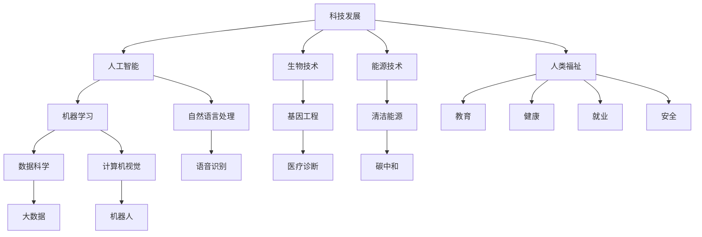

                 

# 科技发展：人类福祉的保障

> 关键词：科技发展,人类福祉,人工智能,机器学习,数据科学,社会责任

## 1. 背景介绍

### 1.1 问题由来
随着科技的迅猛发展，人工智能(AI)、机器学习(ML)、数据科学(Data Science)等前沿技术正在改变世界的每一个角落。这些技术不仅推动了经济增长，提高了生产效率，还改善了人们的生活质量。然而，科技的双刃剑属性也逐渐显现，尤其在数据隐私、算法偏见、就业替代等社会问题上，科技发展与人类福祉之间的平衡成为了亟待解决的课题。

### 1.2 问题核心关键点
本文旨在探讨科技发展与人类福祉之间的关系，重点关注以下核心问题：

- 科技如何影响社会福祉？
- 科技发展过程中面临的主要挑战和风险有哪些？
- 如何构建科技与人类福祉平衡的可持续发展模式？
- 科技从业者和开发者应承担怎样的社会责任？

这些问题的答案不仅关系到技术的发展方向，更关乎人类的未来。通过系统梳理科技与福祉的相互作用，本文力求为科技从业者、政策制定者和社会各界提供思考和实践的指引。

## 2. 核心概念与联系

### 2.1 核心概念概述

要深刻理解科技发展与人类福祉之间的关系，首先需要明确几个关键概念：

- **科技发展**：指通过科学技术手段，推动社会进步和经济增长的过程。主要包含信息技术、生物技术、材料科学、能源技术等诸多领域。
- **人类福祉**：指提升人民生活质量，保障健康、教育、就业、安全等方面的需求和权利。
- **人工智能**：通过算法和模型，使计算机系统具备类似于人的智能行为。涵盖自然语言处理(NLP)、计算机视觉(CV)、机器人学(Robotics)等多个方向。
- **机器学习**：一种让计算机通过数据分析和模式识别，自动提升性能的技术。基于有监督、无监督、强化学习等不同类型。
- **数据科学**：通过收集、分析和解释数据，发现隐藏模式和知识，辅助决策和创新。

这些概念之间的联系可以从以下Mermaid流程图加以体现：



这个流程图展示了科技发展如何通过人工智能、机器学习和数据科学等技术，影响和改善人类福祉的多个方面。

## 3. 核心算法原理 & 具体操作步骤
### 3.1 算法原理概述

科技发展的核心驱动力是算法和模型，这些算法和模型在处理数据、优化决策、提升效能方面发挥着重要作用。以机器学习为例，其基本原理是利用数据集训练模型，使其能够泛化到未见过的数据上，从而做出精准预测。这一过程通过模型训练、验证、测试等步骤完成。

### 3.2 算法步骤详解

一个典型的机器学习算法步骤如下：

1. **数据准备**：收集和清洗数据，划分训练集、验证集和测试集。
2. **特征工程**：从原始数据中提取和构建特征，以增强模型的表达能力。
3. **模型选择与训练**：选择合适的模型架构和超参数，通过训练集进行模型训练。
4. **模型验证与调优**：在验证集上评估模型性能，调整模型参数以优化性能。
5. **模型测试与部署**：在测试集上全面评估模型，将模型部署到实际应用中。

### 3.3 算法优缺点

机器学习算法的优点包括：

- **高效性**：能够在短时间内处理和分析大量数据，提高决策效率。
- **泛化能力**：通过训练集学习规律，模型能够对新数据进行泛化预测。
- **自适应性**：可以根据新数据不断调整模型，保持高效运行。

其缺点包括：

- **数据依赖性**：模型性能依赖于数据质量和数量，数据偏差可能导致算法偏见。
- **复杂性**：模型构建和调优过程复杂，需要专业知识。
- **可解释性不足**：深度学习模型通常被视为"黑盒"，难以解释其决策逻辑。

### 3.4 算法应用领域

机器学习在医疗、金融、制造、交通等多个领域都有广泛应用。例如：

- **医疗领域**：利用机器学习算法进行疾病诊断、影像分析、药物研发等，提升诊疗精度。
- **金融领域**：通过算法进行风险评估、欺诈检测、投资策略优化，提高金融服务效率。
- **制造业**：通过智能传感器和数据分析，优化生产流程，降低成本，提高产品质量。
- **交通领域**：利用算法优化交通流量、智能驾驶、车辆维护，提升出行安全与效率。

## 4. 数学模型和公式 & 详细讲解 & 举例说明

### 4.1 数学模型构建

一个典型的分类问题可以通过逻辑回归模型解决。给定训练集 $\{(x_i, y_i)\}_{i=1}^N$，其中 $x_i$ 为特征向量，$y_i$ 为标签，逻辑回归模型的目标是最小化交叉熵损失函数：

$$
\mathcal{L}(w, b) = -\frac{1}{N}\sum_{i=1}^N y_i\log\sigma(w^Tx_i + b) + (1-y_i)\log(1-\sigma(w^Tx_i + b))
$$

其中 $\sigma(\cdot)$ 为sigmoid函数，$w$ 和 $b$ 为模型参数。

### 4.2 公式推导过程

逻辑回归的梯度下降优化算法更新参数如下：

$$
w \leftarrow w - \eta \nabla_{w}\mathcal{L}(w, b)
$$

$$
b \leftarrow b - \eta \nabla_{b}\mathcal{L}(w, b)
$$

其中 $\eta$ 为学习率，$\nabla_{w}\mathcal{L}$ 和 $\nabla_{b}\mathcal{L}$ 分别为交叉熵损失函数对 $w$ 和 $b$ 的梯度。

### 4.3 案例分析与讲解

以金融风控为例，利用逻辑回归模型对客户信用进行评估。通过收集客户的财务数据、历史交易记录等，训练逻辑回归模型，预测客户是否存在违约风险。具体步骤如下：

1. **数据准备**：收集客户财务数据、交易记录等，并标注是否违约。
2. **特征工程**：提取和构造特征，如收入水平、消费频率、还款记录等。
3. **模型训练**：使用逻辑回归算法，训练模型参数 $w$ 和 $b$。
4. **模型验证**：在验证集上评估模型性能，调整参数以优化。
5. **模型部署**：将模型应用于新客户，进行信用评估。

## 5. 项目实践：代码实例和详细解释说明
### 5.1 开发环境搭建

在进行项目实践前，我们需要准备好开发环境。以下是使用Python进行Scikit-learn开发的简单环境配置流程：

1. 安装Anaconda：从官网下载并安装Anaconda，用于创建独立的Python环境。

2. 创建并激活虚拟环境：
```bash
conda create -n myenv python=3.8 
conda activate myenv
```

3. 安装Scikit-learn：
```bash
pip install scikit-learn
```

4. 安装各类工具包：
```bash
pip install numpy pandas matplotlib sklearn
```

完成上述步骤后，即可在`myenv`环境中开始项目实践。

### 5.2 源代码详细实现

以下是使用Scikit-learn进行逻辑回归模型开发的代码实现。

```python
from sklearn.linear_model import LogisticRegression
from sklearn.model_selection import train_test_split
from sklearn.metrics import accuracy_score
import pandas as pd
import numpy as np

# 读取数据
df = pd.read_csv('credit_data.csv')

# 特征选择与处理
features = ['income', 'loan_amount', 'loan_term', 'credit_history']
X = df[features].values
y = df['default'].values

# 数据划分
X_train, X_test, y_train, y_test = train_test_split(X, y, test_size=0.2, random_state=42)

# 模型训练
model = LogisticRegression()
model.fit(X_train, y_train)

# 模型评估
y_pred = model.predict(X_test)
accuracy = accuracy_score(y_test, y_pred)
print(f'Accuracy: {accuracy:.2f}')
```

### 5.3 代码解读与分析

让我们再详细解读一下关键代码的实现细节：

**读取数据**：
- 使用pandas库读取CSV格式的数据集，并存储为DataFrame对象。

**特征选择与处理**：
- 选择与信用评估相关的特征，包括收入、贷款金额、贷款期限和信用历史。
- 将特征和标签存储为numpy数组。

**数据划分**：
- 使用train_test_split函数，将数据集划分为训练集和测试集。

**模型训练**：
- 定义逻辑回归模型，并使用训练集数据进行训练。

**模型评估**：
- 对测试集进行预测，并计算预测准确率。

可以看到，Scikit-learn库提供了丰富的算法和工具，使得机器学习模型的开发和评估变得简便高效。开发者可以专注于业务逻辑和数据处理，而不必过多关注底层实现细节。

## 6. 实际应用场景

### 6.1 智能医疗

在智能医疗领域，机器学习技术被广泛应用于疾病诊断、影像分析、个性化治疗等方面。例如，通过分析患者的医疗记录、基因信息等，预测疾病风险，制定个性化的治疗方案，显著提高诊疗效果。

### 6.2 智能金融

在金融领域，机器学习用于风险评估、欺诈检测、投资策略优化等。通过分析客户的财务行为、交易记录等，识别潜在的违约风险，保护金融机构和投资者利益。

### 6.3 智能制造

在智能制造领域，机器学习技术通过优化生产流程、预测设备故障、提升产品质量等，提高制造业的自动化和智能化水平。例如，通过传感器数据，实时监控生产状态，预测设备维护需求，降低生产成本，提高生产效率。

### 6.4 未来应用展望

随着科技的不断进步，机器学习技术将在更多领域得到应用，为人类福祉带来新的机遇。未来，我们可以期待：

- **医疗**：更精准的疾病预测和诊断，个性化的治疗方案，提升患者生活质量。
- **金融**：更高效的金融服务，更低的风险评估，更智能的投资策略。
- **制造**：更智能的生产流程，更高的生产效率，更优的产品质量。
- **交通**：更安全的智能驾驶，更高效的交通管理，更绿色的出行方式。

## 7. 工具和资源推荐
### 7.1 学习资源推荐

为了帮助开发者掌握机器学习技术，这里推荐一些优质的学习资源：

1. Coursera的《机器学习》课程：由斯坦福大学Andrew Ng教授主讲，系统讲解了机器学习的基本原理和应用。
2. Kaggle数据科学竞赛平台：提供大量实际数据集，支持在线竞赛和社区交流。
3. Hands-On Machine Learning with Scikit-Learn, Keras, and TensorFlow书籍：详细介绍了Scikit-learn、Keras、TensorFlow等主流机器学习库的使用方法。
4. 《Python机器学习》书籍：由Sebastian Raschka撰写，全面介绍了Python在机器学习中的应用。
5. Fast.ai的深度学习课程：免费提供深度学习基础课程和实战项目，适合初学者和进阶开发者。

通过学习这些资源，相信你一定能够掌握机器学习技术的核心要义，并应用于实际问题解决。

### 7.2 开发工具推荐

高效的开发离不开优秀的工具支持。以下是几款用于机器学习开发的常用工具：

1. Jupyter Notebook：用于数据探索、模型训练、结果展示等，支持代码块、图像、Markdown等多种格式。
2. Google Colab：免费的在线Jupyter Notebook环境，适合快速原型开发和共享学习笔记。
3. PyCharm：支持Python和Scikit-learn等库的IDE，提供代码调试、性能分析等功能。
4. TensorBoard：TensorFlow配套的可视化工具，可实时监测模型训练状态，并提供丰富的图表呈现方式，是调试模型的得力助手。
5. Weights & Biases：模型训练的实验跟踪工具，可以记录和可视化模型训练过程中的各项指标，方便对比和调优。

合理利用这些工具，可以显著提升机器学习模型的开发效率，加快创新迭代的步伐。

### 7.3 相关论文推荐

机器学习领域的理论研究和应用开发始终在不断进步，以下是几篇奠基性的相关论文，推荐阅读：

1. Deep Blue: Where Is the Fluff?：提出了深度学习中"fluff"的概念，探讨如何减少模型中的冗余信息，提高模型泛化能力。
2. AdaBoost: A New Learning Algorithm：介绍了AdaBoost算法，展示了其高效且泛化能力强的特点。
3. Random Forests：介绍了随机森林算法，展示了其在分类、回归任务中的良好性能。
4. Neural Network Pruning: A Review of Methods and Techniques：总结了神经网络剪枝技术的最新进展，适用于提高模型效率和可解释性。
5. Attention Is All You Need：提出了Transformer结构，开启了NLP领域的预训练大模型时代。

这些论文代表了大数据科学和机器学习的发展脉络。通过学习这些前沿成果，可以帮助研究者把握学科前进方向，激发更多的创新灵感。

## 8. 总结：未来发展趋势与挑战
### 8.1 总结

本文对机器学习技术的发展与人类福祉之间的关系进行了系统梳理。首先介绍了机器学习的基本原理和操作步骤，其次通过项目实践展示了机器学习模型在实际应用中的具体实现。同时，本文还广泛探讨了机器学习技术在医疗、金融、制造等众多行业领域的应用前景，展示了其对人类福祉的巨大潜力。最后，本文精选了机器学习技术的各类学习资源，力求为读者提供全方位的技术指引。

通过本文的系统梳理，可以看到，机器学习技术正在成为推动社会进步的重要力量，其高效、智能、泛化能力的特点，使其在解决各种实际问题中具有广阔的应用前景。未来，伴随技术的不断演进，机器学习将更好地服务于人类福祉，助力构建更加美好的未来。

### 8.2 未来发展趋势

展望未来，机器学习技术的发展趋势主要包括以下几个方面：

1. **模型自动化**：通过自动化模型选择和调优，降低人工干预，提升模型构建效率。
2. **算法集成**：将多种算法和模型进行融合，构建更加全面、复杂的解决方案，提升模型表现。
3. **跨领域应用**：在医疗、金融、制造等多个领域，机器学习技术将得到更广泛的应用，带来更显著的社会效益。
4. **持续学习**：机器学习模型能够持续学习新数据，适应环境变化，保持高效运行。
5. **多模态融合**：将文本、图像、语音等多种模态数据进行融合，提升模型对复杂现实世界的理解和建模能力。
6. **可解释性增强**：通过可解释性算法，增强模型决策的透明性和可理解性，增强用户信任。

这些趋势凸显了机器学习技术的广阔前景。这些方向的探索发展，必将进一步提升模型的性能和应用范围，为人类福祉带来更大的益处。

### 8.3 面临的挑战

尽管机器学习技术已经取得了瞩目成就，但在迈向更加智能化、普适化应用的过程中，它仍面临着诸多挑战：

1. **数据隐私和安全**：在处理大量个人数据时，如何保护隐私安全，防止数据泄露，是首要问题。
2. **算法偏见和公平性**：模型可能在训练数据存在偏见的情况下，产生类似的偏见，影响决策公平性。
3. **模型复杂度**：大规模模型在推理和部署时，存在计算资源消耗大、时间延迟高等问题。
4. **解释性不足**：深度学习模型通常被视为"黑盒"，难以解释其内部工作机制和决策逻辑。
5. **伦理和社会责任**：模型可能被用于恶意目的，如假新闻生成、社会操控等，如何确保模型的伦理性和社会责任，是重要课题。

### 8.4 研究展望

面对机器学习面临的这些挑战，未来的研究需要在以下几个方面寻求新的突破：

1. **隐私保护技术**：开发更加高效的隐私保护算法，如差分隐私、联邦学习等，保护数据隐私。
2. **公平性算法**：引入公平性评估指标，优化算法设计，消除算法偏见，确保决策公平。
3. **模型压缩技术**：通过模型压缩、量化等方法，提高模型计算效率，减少推理延迟。
4. **可解释性研究**：开发可解释性算法，增强模型的透明性和可理解性。
5. **伦理约束机制**：建立伦理导向的评估标准和约束机制，确保模型行为符合伦理道德规范。

这些研究方向的探索，必将引领机器学习技术迈向更高的台阶，为构建安全、可靠、可解释、可控的智能系统铺平道路。面向未来，机器学习技术还需要与其他人工智能技术进行更深入的融合，如知识表示、因果推理、强化学习等，多路径协同发力，共同推动人工智能技术的发展。只有勇于创新、敢于突破，才能不断拓展科技的边界，为人类福祉做出更大的贡献。

## 9. 附录：常见问题与解答

**Q1: 机器学习算法和模型有哪些？**

A: 机器学习算法和模型种类繁多，包括但不限于：
1. 监督学习：如线性回归、逻辑回归、决策树、随机森林、支持向量机等。
2. 无监督学习：如聚类、降维、关联规则挖掘等。
3. 半监督学习：结合少量标注数据和大量未标注数据进行学习。
4. 强化学习：通过智能体与环境交互，学习最优决策策略。

**Q2: 机器学习在实际应用中面临哪些挑战？**

A: 机器学习在实际应用中面临以下挑战：
1. 数据隐私和安全问题：如何保护数据隐私，防止数据泄露。
2. 算法偏见和公平性问题：模型在训练数据存在偏见的情况下，可能产生相似的偏见，影响决策公平性。
3. 模型复杂度和计算资源消耗：大规模模型在推理和部署时，存在计算资源消耗大、时间延迟高等问题。
4. 可解释性和透明性问题：深度学习模型通常被视为"黑盒"，难以解释其内部工作机制和决策逻辑。
5. 伦理和社会责任问题：模型可能被用于恶意目的，如假新闻生成、社会操控等，如何确保模型的伦理性和社会责任。

**Q3: 如何构建机器学习模型？**

A: 构建机器学习模型通常包括以下步骤：
1. 数据准备：收集和清洗数据，划分训练集、验证集和测试集。
2. 特征工程：从原始数据中提取和构建特征，以增强模型的表达能力。
3. 模型选择与训练：选择合适的模型架构和超参数，通过训练集进行模型训练。
4. 模型验证与调优：在验证集上评估模型性能，调整模型参数以优化性能。
5. 模型测试与部署：在测试集上全面评估模型，将模型部署到实际应用中。

**Q4: 如何提升机器学习模型的泛化能力？**

A: 提升机器学习模型的泛化能力，可以采取以下措施：
1. 数据增强：通过数据扩充和增强，提高模型的泛化能力。
2. 正则化：使用L1/L2正则化、Dropout等方法，防止过拟合。
3. 模型集成：通过集成多个模型，提高模型的鲁棒性和泛化能力。
4. 迁移学习：将预训练模型的知识迁移到目标任务上，提升模型泛化能力。

---

作者：禅与计算机程序设计艺术 / Zen and the Art of Computer Programming

