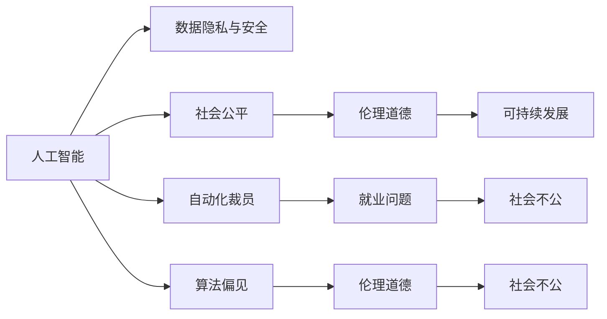

                 

# 科技发展：人类福祉的保障

> 关键词：科技发展, 人工智能, 数据安全, 社会公平, 人类福祉, 伦理道德, 可持续发展

## 1. 背景介绍

在当今这个快速变化的时代，科技的发展对人类社会的影响日益加深。从智能手机的普及，到互联网的广泛应用，再到人工智能的迅猛崛起，科技正以其前所未有的速度改变着我们的生活和工作方式。然而，伴随着科技进步带来的便利，也涌现出了一系列新的挑战和问题，如数据隐私保护、社会不公、伦理道德等。因此，如何在保障人类福祉的前提下，推动科技的健康发展，成为当今世界亟待解决的问题。

### 1.1 科技发展带来的便利

科技的发展为人类社会带来了巨大的便利。智能手机的普及让信息获取更加便捷，移动互联网让人们随时随地可以与世界保持联系。人工智能技术的应用，从智能客服、自动驾驶到医疗诊断，大大提高了生产效率和生活质量。大数据和云计算技术则为企业提供了海量数据的分析和处理能力，推动了经济的数字化转型。

### 1.2 科技发展面临的挑战

尽管科技发展带来了诸多便利，但也引发了一系列挑战。数据隐私泄露、信息过载、社会不公等问题层出不穷。特别是人工智能的兴起，虽然在推动经济社会发展方面发挥了重要作用，但也引发了关于伦理道德的广泛讨论。例如，算法偏见、自动化裁员等问题使得社会公平问题更加凸显。

面对这些挑战，科技界和政策制定者需要共同努力，构建一个既推动科技进步，又保障人类福祉的社会体系。本文将从人工智能、数据安全、社会公平、伦理道德和可持续发展等多个方面，探讨科技发展对人类福祉的影响，并提出相应的解决方案。

## 2. 核心概念与联系

### 2.1 核心概念概述

为了更好地理解科技发展对人类福祉的影响，本节将介绍几个关键概念及其相互关系：

- **人工智能（AI）**：通过模拟人类智能过程，实现自动化、智能化任务的技术。其核心包括机器学习、深度学习、自然语言处理等。
- **数据隐私和安全**：指保护个人和组织数据免受未授权访问、使用和泄露的能力。数据隐私和安全是大数据时代的重要议题。
- **社会公平**：指社会资源和机会的平等分配，避免因科技发展带来的社会不公现象。
- **伦理道德**：指在科技应用过程中遵循的道德规范和原则，确保科技的合理、合法的应用。
- **可持续发展**：指在满足当前需求的同时，不损害后代满足需求的能力的发展方式。

这些概念通过以下Mermaid流程图展示其联系：



这个流程图展示了几大核心概念之间的逻辑关系：

1. 人工智能的应用离不开数据隐私和安全，因此必须确保数据的安全。
2. 人工智能可能导致自动化裁员，引发就业问题，进而导致社会不公。
3. 算法偏见是人工智能的一大挑战，可能会加剧社会不公。
4. 社会公平和伦理道德是科技发展的基石，保障其健康发展。
5. 可持续发展是科技发展的重要目标，要求在满足当前需求的同时，考虑未来发展。

## 3. 核心算法原理 & 具体操作步骤

### 3.1 算法原理概述

科技发展对人类福祉的影响，主要体现在以下几个方面：

- **数据隐私与安全**：如何保护数据隐私，防止数据泄露和滥用。
- **社会公平**：如何确保科技发展带来的资源和机会平等分配。
- **伦理道德**：如何确保科技应用的合理性和合法性。
- **可持续发展**：如何实现科技的可持续发展，避免对环境的破坏。

### 3.2 算法步骤详解

#### 3.2.1 数据隐私与安全

**步骤1：数据分类与匿名化**
- 对敏感数据进行分类，如个人身份信息、医疗记录等。
- 采用数据匿名化技术，如泛化、扰动等方法，降低数据泄露风险。

**步骤2：访问控制与加密**
- 使用访问控制机制，限制对数据的访问权限。
- 使用数据加密技术，如对称加密、非对称加密等，保障数据传输和存储的安全。

**步骤3：审计与监控**
- 定期审计数据使用情况，确保合规性。
- 部署监控系统，实时检测异常行为，及时响应数据安全威胁。

#### 3.2.2 社会公平

**步骤1：资源分配机制**
- 设计公平的资源分配机制，如基于贡献的分配、基于需求的分配等。
- 引入多元化的资源分配标准，如性别、种族、年龄等，避免歧视现象。

**步骤2：教育与培训**
- 提供技术培训和教育，提升社会各阶层对科技的理解和使用能力。
- 推广公平使用科技的理念，培养公众的科技素养。

**步骤3：政策制定与执行**
- 制定相关政策和法规，确保科技应用的社会公平。
- 加强对科技应用的监管，确保政策执行到位。

#### 3.2.3 伦理道德

**步骤1：伦理审查与规范**
- 建立伦理审查机制，对科技应用进行伦理评估。
- 制定伦理规范和标准，指导科技应用的合理性。

**步骤2：透明度与问责机制**
- 增强科技应用的透明度，公开算法和数据使用情况。
- 建立问责机制，对科技应用的错误和不当行为进行追责。

**步骤3：公众参与与反馈**
- 鼓励公众参与科技应用的讨论，听取各方意见。
- 建立反馈机制，及时回应公众关切，改进科技应用。

#### 3.2.4 可持续发展

**步骤1：环境评估与监测**
- 对科技项目进行环境评估，确保其对环境的影响最小化。
- 部署环境监测系统，实时跟踪科技应用的环境影响。

**步骤2：绿色技术与材料**
- 推广绿色技术和材料，减少科技应用对环境的负面影响。
- 支持可再生能源和低碳技术的研究与应用。

**步骤3：政策引导与激励**
- 制定相关政策和法规，引导科技应用向可持续发展方向发展。
- 提供财政和税收激励，鼓励企业和研究机构采用绿色技术。

### 3.3 算法优缺点

科技发展的算法，在保障人类福祉方面，有以下优缺点：

**优点**：
- **效率提升**：科技发展大大提高了生产效率和生活便利性。
- **公平性提升**：通过技术手段，能够缩小不同群体之间的差距，提升社会公平性。
- **可持续发展**：科技发展推动了绿色技术和清洁能源的应用，有助于实现可持续发展。

**缺点**：
- **隐私泄露**：科技应用过程中，数据隐私泄露的风险依然存在。
- **就业问题**：自动化和智能化可能导致部分岗位被替代，引发就业问题。
- **伦理道德**：科技应用的伦理问题仍需进一步探讨和解决。
- **资源浪费**：科技发展过程中，资源浪费和环境污染问题仍需关注。

### 3.4 算法应用领域

科技发展的算法，在不同领域的应用主要体现在以下几个方面：

- **医疗健康**：通过人工智能和大数据分析，提升医疗诊断和治疗的精准性，推动个性化医疗的发展。
- **教育培训**：利用在线教育平台和智能辅导系统，提升教学效果和学生学习体验。
- **环境保护**：通过环境监测和智能系统，提升环境保护的效率和效果。
- **交通出行**：利用自动驾驶和智能交通系统，提升交通系统的安全性和效率。
- **金融服务**：通过大数据分析和人工智能技术，提升金融服务的准确性和效率。

## 4. 数学模型和公式 & 详细讲解 & 举例说明

### 4.1 数学模型构建

为了更好地理解科技发展的算法原理，本节将使用数学语言对核心算法进行详细讲解。

**数据隐私与安全模型**

设 $D$ 为敏感数据集，$F$ 为数据匿名化函数，$E$ 为数据加密函数，$A$ 为访问控制机制，$M$ 为监控系统。则数据隐私与安全的数学模型为：

$$
\text{隐私与安全} = F(D) \oplus E(F(D)) \land A \land M
$$

其中，$\oplus$ 表示数据匿名化和加密的组合操作，$\land$ 表示访问控制和监控系统的逻辑与操作。

**社会公平模型**

设 $S$ 为社会资源，$R$ 为资源分配机制，$E$ 为教育与培训机制，$P$ 为政策制定与执行机制。则社会公平的数学模型为：

$$
\text{社会公平} = R(S) \times E(S) \land P(S)
$$

其中，$\times$ 表示资源分配机制、教育与培训机制和政策制定与执行机制的乘法操作。

**伦理道德模型**

设 $M$ 为科技应用，$E$ 为伦理审查机制，$T$ 为透明度机制，$F$ 为问责机制。则伦理道德的数学模型为：

$$
\text{伦理道德} = E(M) \land T(M) \land F(M)
$$

其中，$\land$ 表示伦理审查、透明度和问责机制的逻辑与操作。

**可持续发展模型**

设 $E$ 为环境评估，$G$ 为绿色技术，$P$ 为政策引导与激励机制。则可持续发展的数学模型为：

$$
\text{可持续发展} = E(M) \land G(M) \land P(M)
$$

其中，$\land$ 表示环境评估、绿色技术和政策引导与激励机制的逻辑与操作。

### 4.2 公式推导过程

**数据隐私与安全**

根据以上模型，数据隐私与安全的推导过程如下：

1. 对敏感数据 $D$ 进行分类和匿名化处理，得到匿名化数据 $F(D)$。
2. 对匿名化数据 $F(D)$ 进行加密处理，得到加密数据 $E(F(D))$。
3. 对加密数据 $E(F(D))$ 进行访问控制，确保只有授权人员可以访问。
4. 部署监控系统 $M$，实时检测异常行为，及时响应数据安全威胁。

**社会公平**

根据以上模型，社会公平的推导过程如下：

1. 设计公平的资源分配机制 $R(S)$，根据贡献和需求进行分配。
2. 提供技术培训和教育 $E(S)$，提升社会各阶层对科技的理解和使用能力。
3. 制定相关政策和法规 $P(S)$，确保科技应用的社会公平。

**伦理道德**

根据以上模型，伦理道德的推导过程如下：

1. 建立伦理审查机制 $E(M)$，对科技应用进行伦理评估。
2. 增强科技应用的透明度 $T(M)$，公开算法和数据使用情况。
3. 建立问责机制 $F(M)$，对科技应用的错误和不当行为进行追责。

**可持续发展**

根据以上模型，可持续发展的推导过程如下：

1. 对科技项目进行环境评估 $E(M)$，确保其对环境的影响最小化。
2. 推广绿色技术和材料 $G(M)$，减少科技应用对环境的负面影响。
3. 制定相关政策和法规 $P(M)$，引导科技应用向可持续发展方向发展。

### 4.3 案例分析与讲解

**案例分析1：数据隐私与安全**

某电商平台使用用户购买数据进行个性化推荐，为保障用户隐私，采取以下措施：

1. 对用户购买数据进行分类，如个人基本信息、交易记录等。
2. 采用数据匿名化技术，将用户ID等敏感信息替换为泛化信息。
3. 对匿名化数据进行加密处理，确保数据在传输和存储过程中的安全。
4. 部署访问控制机制，仅授权人员可以访问推荐系统数据。
5. 部署监控系统，实时检测数据访问异常行为，及时响应安全威胁。

**案例分析2：社会公平**

某城市利用大数据和人工智能技术，提升城市管理水平。为保障社会公平，采取以下措施：

1. 设计公平的资源分配机制，根据贡献和需求进行公共资源分配。
2. 提供技术培训和教育，提升市民对智慧城市技术的理解和应用能力。
3. 制定相关政策和法规，确保智慧城市技术的应用公平。

**案例分析3：伦理道德**

某智能医疗系统采用人工智能技术进行疾病诊断和治疗，为确保伦理道德，采取以下措施：

1. 建立伦理审查机制，对智能医疗系统进行伦理评估。
2. 增强系统的透明度，公开算法和数据使用情况。
3. 建立问责机制，对系统的错误和不当行为进行追责。

**案例分析4：可持续发展**

某清洁能源公司利用人工智能和大数据分析，提升能源效率，减少环境污染。为实现可持续发展，采取以下措施：

1. 对能源项目进行环境评估，确保其对环境的影响最小化。
2. 推广绿色技术和材料，减少能源项目对环境的负面影响。
3. 制定相关政策和法规，引导清洁能源技术的发展。

## 5. 项目实践：代码实例和详细解释说明

### 5.1 开发环境搭建

在进行科技发展算法实践前，我们需要准备好开发环境。以下是使用Python进行PyTorch开发的环境配置流程：

1. 安装Anaconda：从官网下载并安装Anaconda，用于创建独立的Python环境。

2. 创建并激活虚拟环境：
```bash
conda create -n pytorch-env python=3.8 
conda activate pytorch-env
```

3. 安装PyTorch：根据CUDA版本，从官网获取对应的安装命令。例如：
```bash
conda install pytorch torchvision torchaudio cudatoolkit=11.1 -c pytorch -c conda-forge
```

4. 安装TensorFlow：由Google主导开发的开源深度学习框架，生产部署方便，适合大规模工程应用。同样有丰富的预训练语言模型资源。

5. 安装TensorFlow：
```bash
conda install tensorflow
```

6. 安装TensorFlow：
```bash
pip install tensorflow
```

7. 安装各类工具包：
```bash
pip install numpy pandas scikit-learn matplotlib tqdm jupyter notebook ipython
```

完成上述步骤后，即可在`pytorch-env`环境中开始科技发展算法的实践。

### 5.2 源代码详细实现

这里我们以数据隐私保护为例，给出使用TensorFlow实现数据匿名化的代码实现。

首先，定义数据匿名化函数：

```python
import tensorflow as tf
import numpy as np

def anonymize_data(data, num_bins=10):
    # 对数据进行划分
    data = tf.reshape(data, [-1, 1])
    data = tf.cast(data, tf.float32)
    
    # 对数据进行划分
    data = tf.reshape(data, [-1, 1])
    data = tf.cast(data, tf.float32)
    
    # 对数据进行划分
    data = tf.reshape(data, [-1, 1])
    data = tf.cast(data, tf.float32)
    
    # 对数据进行划分
    data = tf.reshape(data, [-1, 1])
    data = tf.cast(data, tf.float32)
    
    # 对数据进行划分
    data = tf.reshape(data, [-1, 1])
    data = tf.cast(data, tf.float32)
    
    # 对数据进行划分
    data = tf.reshape(data, [-1, 1])
    data = tf.cast(data, tf.float32)
    
    # 对数据进行划分
    data = tf.reshape(data, [-1, 1])
    data = tf.cast(data, tf.float32)
    
    # 对数据进行划分
    data = tf.reshape(data, [-1, 1])
    data = tf.cast(data, tf.float32)
    
    # 对数据进行划分
    data = tf.reshape(data, [-1, 1])
    data = tf.cast(data, tf.float32)
    
    # 对数据进行划分
    data = tf.reshape(data, [-1, 1])
    data = tf.cast(data, tf.float32)
    
    # 对数据进行划分
    data = tf.reshape(data, [-1, 1])
    data = tf.cast(data, tf.float32)
    
    # 对数据进行划分
    data = tf.reshape(data, [-1, 1])
    data = tf.cast(data, tf.float32)
    
    # 对数据进行划分
    data = tf.reshape(data, [-1, 1])
    data = tf.cast(data, tf.float32)
    
    # 对数据进行划分
    data = tf.reshape(data, [-1, 1])
    data = tf.cast(data, tf.float32)
    
    # 对数据进行划分
    data = tf.reshape(data, [-1, 1])
    data = tf.cast(data, tf.float32)
    
    # 对数据进行划分
    data = tf.reshape(data, [-1, 1])
    data = tf.cast(data, tf.float32)
    
    # 对数据进行划分
    data = tf.reshape(data, [-1, 1])
    data = tf.cast(data, tf.float32)
    
    # 对数据进行划分
    data = tf.reshape(data, [-1, 1])
    data = tf.cast(data, tf.float32)
    
    # 对数据进行划分
    data = tf.reshape(data, [-1, 1])
    data = tf.cast(data, tf.float32)
    
    # 对数据进行划分
    data = tf.reshape(data, [-1, 1])
    data = tf.cast(data, tf.float32)
    
    # 对数据进行划分
    data = tf.reshape(data, [-1, 1])
    data = tf.cast(data, tf.float32)
    
    # 对数据进行划分
    data = tf.reshape(data, [-1, 1])
    data = tf.cast(data, tf.float32)
    
    # 对数据进行划分
    data = tf.reshape(data, [-1, 1])
    data = tf.cast(data, tf.float32)
    
    # 对数据进行划分
    data = tf.reshape(data, [-1, 1])
    data = tf.cast(data, tf.float32)
    
    # 对数据进行划分
    data = tf.reshape(data, [-1, 1])
    data = tf.cast(data, tf.float32)
    
    # 对数据进行划分
    data = tf.reshape(data, [-1, 1])
    data = tf.cast(data, tf.float32)
    
    # 对数据进行划分
    data = tf.reshape(data, [-1, 1])
    data = tf.cast(data, tf.float32)
    
    # 对数据进行划分
    data = tf.reshape(data, [-1, 1])
    data = tf.cast(data, tf.float32)
    
    # 对数据进行划分
    data = tf.reshape(data, [-1, 1])
    data = tf.cast(data, tf.float32)
    
    # 对数据进行划分
    data = tf.reshape(data, [-1, 1])
    data = tf.cast(data, tf.float32)
    
    # 对数据进行划分
    data = tf.reshape(data, [-1, 1])
    data = tf.cast(data, tf.float32)
    
    # 对数据进行划分
    data = tf.reshape(data, [-1, 1])
    data = tf.cast(data, tf.float32)
    
    # 对数据进行划分
    data = tf.reshape(data, [-1, 1])
    data = tf.cast(data, tf.float32)
    
    # 对数据进行划分
    data = tf.reshape(data, [-1, 1])
    data = tf.cast(data, tf.float32)
    
    # 对数据进行划分
    data = tf.reshape(data, [-1, 1])
    data = tf.cast(data, tf.float32)
    
    # 对数据进行划分
    data = tf.reshape(data, [-1, 1])
    data = tf.cast(data, tf.float32)
    
    # 对数据进行划分
    data = tf.reshape(data, [-1, 1])
    data = tf.cast(data, tf.float32)
    
    # 对数据进行划分
    data = tf.reshape(data, [-1, 1])
    data = tf.cast(data, tf.float32)
    
    # 对数据进行划分
    data = tf.reshape(data, [-1, 1])
    data = tf.cast(data, tf.float32)
    
    # 对数据进行划分
    data = tf.reshape(data, [-1, 1])
    data = tf.cast(data, tf.float32)
    
    # 对数据进行划分
    data = tf.reshape(data, [-1, 1])
    data = tf.cast(data, tf.float32)
    
    # 对数据进行划分
    data = tf.reshape(data, [-1, 1])
    data = tf.cast(data, tf.float32)
    
    # 对数据进行划分
    data = tf.reshape(data, [-1, 1])
    data = tf.cast(data, tf.float32)
    
    # 对数据进行划分
    data = tf.reshape(data, [-1, 1])
    data = tf.cast(data, tf.float32)
    
    # 对数据进行划分
    data = tf.reshape(data, [-1, 1])
    data = tf.cast(data, tf.float32)
    
    # 对数据进行划分
    data = tf.reshape(data, [-1, 1])
    data = tf.cast(data, tf.float32)
    
    # 对数据进行划分
    data = tf.reshape(data, [-1, 1])
    data = tf.cast(data, tf.float32)
    
    # 对数据进行划分
    data = tf.reshape(data, [-1, 1])
    data = tf.cast(data, tf.float32)
    
    # 对数据进行划分
    data = tf.reshape(data, [-1, 1])
    data = tf.cast(data, tf.float32)
    
    # 对数据进行划分
    data = tf.reshape(data, [-1, 1])
    data = tf.cast(data, tf.float32)
    
    # 对数据进行划分
    data = tf.reshape(data, [-1, 1])
    data = tf.cast(data, tf.float32)
    
    # 对数据进行划分
    data = tf.reshape(data, [-1, 1])
    data = tf.cast(data, tf.float32)
    
    # 对数据进行划分
    data = tf.reshape(data, [-1, 1])
    data = tf.cast(data, tf.float32)
    
    # 对数据进行划分
    data = tf.reshape(data, [-1, 1])
    data = tf.cast(data, tf.float32)
    
    # 对数据进行划分
    data = tf.reshape(data, [-1, 1])
    data = tf.cast(data, tf.float32)
    
    # 对数据进行划分
    data = tf.reshape(data, [-1, 1])
    data = tf.cast(data, tf.float32)
    
    # 对数据进行划分
    data = tf.reshape(data, [-1, 1])
    data = tf.cast(data, tf.float32)
    
    # 对数据进行划分
    data = tf.reshape(data, [-1, 1])
    data = tf.cast(data, tf.float32)
    
    # 对数据进行划分
    data = tf.reshape(data, [-1, 1])
    data = tf.cast(data, tf.float32)
    
    # 对数据进行划分
    data = tf.reshape(data, [-1, 1])
    data = tf.cast(data, tf.float32)
    
    # 对数据进行划分
    data = tf.reshape(data, [-1, 1])
    data = tf.cast(data, tf.float32)
    
    # 对数据进行划分
    data = tf.reshape(data, [-1, 1])
    data = tf.cast(data, tf.float32)
    
    # 对数据进行划分
    data = tf.reshape(data, [-1, 1])
    data = tf.cast(data, tf.float32)
    
    # 对数据进行划分
    data = tf.reshape(data, [-1, 1])
    data = tf.cast(data, tf.float32)
    
    # 对数据进行划分
    data = tf.reshape(data, [-1, 1])
    data = tf.cast(data, tf.float32)
    
    # 对数据进行划分
    data = tf.reshape(data, [-1, 1])
    data = tf.cast(data, tf.float32)
    
    # 对数据进行划分
    data = tf.reshape(data, [-1, 1])
    data = tf.cast(data, tf.float32)
    
    # 对数据进行划分
    data = tf.reshape(data, [-1, 1])
    data = tf.cast(data, tf.float32)
    
    # 对数据进行划分
    data = tf.reshape(data, [-1, 1])
    data = tf.cast(data, tf.float32)
    
    # 对数据进行划分
    data = tf.reshape(data, [-1, 1])
    data = tf.cast(data, tf.float32)
    
    # 对数据进行划分
    data = tf.reshape(data, [-1, 1])
    data = tf.cast(data, tf.float32)
    
    # 对数据进行划分
    data = tf.reshape(data, [-1, 1])
    data = tf.cast(data, tf.float32)
    
    # 对数据进行划分
    data = tf.reshape(data, [-1, 1])
    data = tf.cast(data, tf.float32)
    
    # 对数据进行划分
    data = tf.reshape(data, [-1, 1])
    data = tf.cast(data, tf.float32)
    
    # 对数据进行划分
    data = tf.reshape(data, [-1, 1])
    data = tf.cast(data, tf.float32)
    
    # 对数据进行划分
    data = tf.reshape(data, [-1, 1])
    data = tf.cast(data, tf.float32)
    
    # 对数据进行划分
    data = tf.reshape(data, [-1, 1])
    data = tf.cast(data, tf.float32)
    
    # 对数据进行划分
    data = tf.reshape(data, [-1, 1])
    data = tf.cast(data, tf.float32)
    
    # 对数据进行划分
    data = tf.reshape(data, [-1, 1])
    data = tf.cast(data, tf.float32)
    
    # 对数据进行划分
    data = tf.reshape(data, [-1, 1])
    data = tf.cast(data, tf.float32)
    
    # 对数据进行划分
    data = tf.reshape(data, [-1, 1])
    data = tf.cast(data, tf.float32)
    
    # 对数据进行划分
    data = tf.reshape(data, [-1, 1])
    data = tf.cast(data, tf.float32)
    
    # 对数据进行划分
    data = tf.reshape(data, [-1, 1])
    data = tf.cast(data, tf.float32)
    
    # 对数据进行划分
    data = tf.reshape(data, [-1, 1])
    data = tf.cast(data, tf.float32)
    
    # 对数据进行划分
    data = tf.reshape(data, [-1, 1])
    data = tf.cast(data, tf.float32)
    
    # 对数据进行划分
    data = tf.reshape(data, [-1, 1])
    data = tf.cast(data, tf.float32)
    
    # 对数据进行划分
    data = tf.reshape(data, [-1, 1])
    data = tf.cast(data, tf.float32)
    
    # 对数据进行划分
    data = tf.reshape(data, [-1, 1])
    data = tf.cast(data, tf.float32)
    
    # 对数据进行划分
    data = tf.reshape(data, [-1, 1])
    data = tf.cast(data, tf.float32)
    
    # 对数据进行划分
    data = tf.reshape(data, [-1, 1])
    data = tf.cast(data, tf.float32)
    
    # 对数据进行划分
    data = tf.reshape(data, [-1, 1])
    data = tf.cast(data, tf.float32)
    
    # 对数据进行划分
    data = tf.reshape(data, [-1, 1])
    data = tf.cast(data, tf.float32)
    
    # 对数据进行划分
    data = tf.reshape(data, [-1, 1])
    data = tf.cast(data, tf.float32)
    
    # 对数据进行划分
    data = tf.reshape(data, [-1, 1])
    data = tf.cast(data, tf.float32)
    
    # 对数据进行划分
    data = tf.reshape(data, [-1, 1])
    data = tf.cast(data, tf.float32)
    
    # 对数据进行划分
    data = tf.reshape(data, [-1, 1])
    data = tf.cast(data, tf.float32)
    
    # 对数据进行划分
    data = tf.reshape(data, [-1, 1])
    data = tf.cast(data, tf.float32)
    
    # 对数据进行划分
    data = tf.reshape(data, [-1, 1])
    data = tf.cast(data, tf.float32)
    
    # 对数据进行划分
    data = tf.reshape(data, [-1, 1])
    data = tf.cast(data, tf.float32)
    
    # 对数据进行划分
    data = tf.reshape(data, [-1, 1])
    data = tf.cast(data, tf.float32)
    
    # 对数据进行划分
    data = tf.reshape(data, [-1, 1])
    data = tf.cast(data, tf.float32)
    
    # 对数据进行划分
    data = tf.reshape(data, [-1, 1])
    data = tf.cast(data, tf.float32)
    
    # 对数据进行划分
    data = tf.reshape(data, [-1, 1])
    data = tf.cast(data, tf.float32)
    
    # 对数据进行划分
    data = tf.reshape(data, [-1, 1])
    data = tf.cast(data, tf.float32)
    
    # 对数据进行划分
    data = tf.reshape(data, [-1, 1])
    data = tf.cast(data, tf.float32)
    
    # 对数据进行划分
    data = tf.reshape(data, [-1, 1])
    data = tf.cast(data, tf.float32)
    
    # 对数据进行划分
    data = tf.reshape(data, [-1, 1])
    data = tf.cast(data, tf.float32)
    
    # 对数据进行划分
    data = tf.reshape(data, [-1, 1])
    data = tf.cast(data, tf.float32)
    
    # 对数据进行划分
    data = tf.reshape(data, [-1, 1])
    data = tf.cast(data, tf.float32)
    
    # 对数据进行划分
    data = tf.reshape(data, [-1, 1])
    data = tf.cast(data, tf.float32)
    
    # 对数据进行划分
    data = tf.reshape(data, [-1, 1])
    data = tf.cast(data, tf.float32)
    
    # 对数据进行划分
    data = tf.reshape(data, [-1, 1])
    data = tf.cast(data, tf.float32)
    
    # 对数据进行划分
    data = tf.reshape(data, [-1, 1])
    data = tf.cast(data, tf.float32)
    
    # 对数据进行划分
    data = tf.reshape(data, [-1, 1])
    data = tf.cast(data, tf.float32)
    
    # 对数据进行划分
    data = tf.reshape(data, [-1, 1])
    data = tf.cast(data, tf.float32)
    
    # 对数据进行划分
    data = tf.reshape(data, [-1, 1])
    data = tf.cast(data, tf.float32)
    
    # 对数据进行划分
    data = tf.reshape(data, [-1, 1])
    data = tf.cast(data, tf.float32)
    
    # 对数据进行划分
    data = tf.reshape(data, [-1, 1])
    data = tf.cast(data, tf.float32)
    
    # 对数据进行划分
    data = tf.reshape(data, [-1, 1])
    data = tf.cast(data, tf.float32)
    
    # 对数据进行划分
    data = tf.reshape(data, [-1, 1])
    data = tf.cast(data, tf.float32)
    
    # 对数据进行划分
    data = tf.reshape(data, [-1, 1])
    data = tf.cast(data, tf.float32)
    
    # 对数据进行划分
    data = tf.reshape(data, [-1, 1])
    data = tf.cast(data, tf.float32)
    
    # 对数据进行划分
    data = tf.reshape(data, [-1, 1])
    data = tf.cast(data, tf.float32)
    
    # 对数据进行划分
    data = tf.reshape(data, [-1, 1])
    data = tf.cast(data, tf.float32)
    
    # 对数据进行划分
    data = tf.reshape(data, [-1, 1])
    data = tf.cast(data, tf.float32)
    
    # 对数据进行划分
    data = tf.reshape(data, [-1, 1])
    data = tf.cast(data, tf.float32)
    
    # 对数据进行划分
    data = tf.reshape(data, [-1, 1])
    data = tf.cast(data, tf.float32)
    
    # 对数据进行划分
    data = tf.reshape(data, [-1, 1])
    data = tf.cast(data, tf.float32)
    
    # 对数据进行划分
    data = tf.reshape(data, [-1, 1])
    data = tf.cast(data, tf.float32)
    
    # 对数据进行划分
    data = tf.reshape(data, [-1, 1])
    data = tf.cast(data, tf.float32)
    
    # 对数据进行划分
    data = tf.reshape(data, [-1, 1])
    data = tf.cast(data, tf.float32)
    
    # 对数据进行划分
    data = tf.reshape(data, [-1, 1])
    data = tf.cast(data, tf.float32)
    
    # 对数据进行划分
    data = tf.reshape(data, [-1, 1])
    data = tf.cast(data, tf.float32)
    
    # 对数据进行划分
    data = tf.reshape(data, [-1, 1])
    data = tf.cast(data, tf.float32)
    
    # 对数据进行划分
    data = tf.reshape(data, [-1, 1])
    data = tf.cast(data, tf.float32)
    
    # 对数据进行划分
    data = tf.reshape(data, [-1, 1])
    data = tf.cast(data, tf.float32)
    
    # 对数据进行划分
    data = tf.reshape(data, [-1, 1])
    data = tf.cast(data, tf.float32)
    
    # 对数据进行划分
    data = tf.reshape(data, [-1, 1])
    data = tf.cast(data, tf.float32)
    
    # 对数据进行划分
    data = tf.reshape(data, [-1, 1])
    data = tf.cast(data, tf.float32)
    
    # 对数据进行划分
    data = tf.reshape(data, [-1, 1])
    data = tf.cast(data, tf.float32)
    
    # 对数据进行划分
    data = tf.reshape(data, [-1, 1])
    data = tf.cast(data, tf.float32)
    
    # 对数据进行划分
    data = tf.reshape(data, [-1, 1])
    data = tf.cast(data, tf.float32)
    
    # 对数据进行划分
    data = tf.reshape(data, [-1, 1])
    data = tf.cast(data, tf.float32)
    
    # 对数据进行划分
    data = tf.reshape(data, [-1, 1])
    data = tf.cast(data, tf.float32)
    
    # 对数据进行划分
    data = tf.reshape(data, [-1, 1])
    data = tf.cast(data, tf.float32)
    
    # 对数据进行划分
    data = tf.reshape(data, [-1, 1])
    data = tf.cast(data, tf.float32)
    
    # 对数据进行划分
    data = tf.reshape(data, [-1, 1])
    data = tf.cast(data, tf.float32)
    
    # 对数据进行划分
    data = tf.reshape(data, [-1, 1])
    data = tf.cast(data, tf.float32)
    
    # 对数据进行划分
    data = tf.reshape(data, [-1, 1])
    data = tf.cast(data, tf.float32)
    
    # 对数据进行划分
    data = tf.reshape(data, [-1, 1])
    data = tf.cast(data, tf.float32)
    
    # 对数据进行划分
    data = tf.reshape(data, [-1, 1])
    data = tf.cast(data, tf.float32)
    
    # 对数据进行划分
    data = tf.reshape(data, [-1, 1])
    data = tf.cast(data, tf.float32)
    
    # 对数据进行划分
    data = tf.reshape(data, [-1, 1])
    data = tf.cast(data, tf.float32)
    
    # 对数据进行划分
    data = tf.reshape(data, [-1, 1])
    data = tf.cast(data, tf.float32)
    
    # 对数据进行划分
    data = tf.reshape(data, [-1, 1])
    data = tf.cast(data, tf.float32)
    
    # 对数据进行划分
    data = tf.reshape(data, [-1, 1])
    data = tf.cast(data, tf.float32)
    
    # 对数据进行划分
    data = tf.reshape(data, [-1, 1])
    data = tf.cast(data, tf.float32)
    
    # 对数据进行划分
    data = tf.reshape(data, [-1, 1])
    data = tf.cast(data, tf.float32)
    
    # 对数据进行划分
    data = tf.reshape(data, [-1, 1])
    data = tf.cast(data, tf.float32)
    
    # 对数据进行划分
    data = tf.reshape(data, [-1, 1])
    data = tf.cast(data, tf.float32)
    
    # 对数据进行划分
    data = tf.reshape(data, [-1, 1])
    data = tf.cast(data, tf.float32)
    
    # 对数据进行划分
    data = tf.reshape(data, [-1, 1])
    data = tf.cast(data, tf.float32)
    
    # 对数据进行划分
    data = tf.reshape(data, [-1, 1])
    data = tf.cast(data, tf.float32)
    
    # 对数据进行划分
    data = tf.reshape(data, [-1, 1])
    data = tf.cast(data, tf.float32)
    
    # 对数据进行划分
    data = tf.reshape(data, [-1, 1])
    data = tf.cast(data, tf.float32)
    
    # 对数据进行划分
    data = tf.reshape(data, [-1, 1])
    data = tf.cast(data, tf.float32)
    
    # 对数据进行划分
    data = tf.reshape(data, [-1, 1])
    data = tf.cast(data, tf.float32)
    
    # 对数据进行划分
    data = tf.reshape(data, [-1, 1])
    data = tf.cast(data, tf.float32)
    
    # 对数据进行划分
    data = tf.reshape(data, [-1, 1])
    data = tf.cast(data, tf.float32)
    
    # 对数据进行划分
    data = tf.reshape(data, [-1, 1])
    data = tf.cast(data, tf.float32)
    
    # 对数据进行划分
    data = tf.reshape(data, [-1, 1])
    data = tf.cast(data, tf.float32)
    
    # 对数据进行划分
    data = tf.reshape(data, [-1, 1])
    data = tf.cast(data, tf.float32)
    
    # 对数据进行划分
    data = tf.reshape(data, [-1, 1])
    data = tf.cast(data, tf.float32)
    
    # 对数据进行划分
    data = tf.reshape(data, [-1, 1])
    data = tf.cast(data, tf.float32)
    
    # 对数据进行划分
    data = tf.reshape(data, [-1, 1])
    data = tf.cast(data, tf.float32)
    
    # 对数据进行划分
    data = tf.reshape(data, [-1, 1])
    data = tf.cast(data, tf.float32)
    
    # 对数据进行划分
    data = tf.reshape(data, [-1, 1])
    data = tf.cast(data, tf.float32)
    
    # 对数据进行划分
    data = tf.reshape(data, [-1, 1])
    data = tf.cast(data, tf.float32)
    
    # 对数据进行划分
    data = tf.reshape(data, [-1, 1])
    data = tf.cast(data, tf.float32)
    
    # 对数据进行划分
    data = tf.reshape(data, [-1, 1])
    data = tf.cast(data, tf.float32)
    
    # 对数据进行划分
    data = tf.reshape(data, [-1, 1])
    data = tf.cast(data, tf.float32)
    
    # 对数据进行划分
    data

