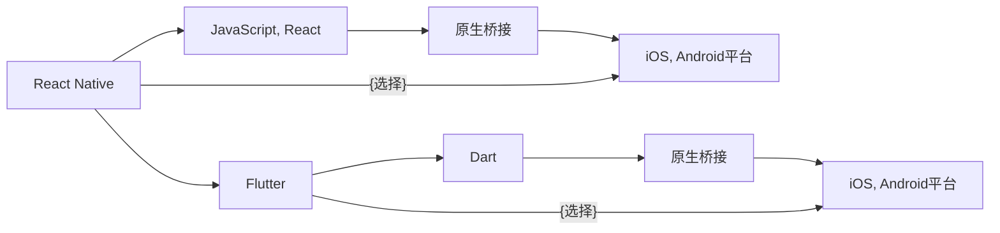

                 

# 移动端开发框架对比：基于原生的 React Native 和 Flutter

## 1. 背景介绍

随着移动应用的爆炸性增长，移动开发成为了IT从业者的热门选择。传统的方式是通过原生开发框架（如iOS的Swift、Objective-C，Android的Java、Kotlin）构建应用程序，但该方式开发成本高、开发周期长，且难以跨平台应用。为此，跨平台移动开发框架应运而生，并逐渐成为移动开发的主流趋势。

其中，React Native和Flutter是当前市场上最受欢迎的两大跨平台移动开发框架。本文将详细对比这两种框架，以帮助开发者根据项目需求选择最优的技术栈。

## 2. 核心概念与联系

### 2.1 核心概念概述

- **React Native**：Facebook开发的基于JavaScript的跨平台移动开发框架，可以实现一套代码多平台运行，大幅提升开发效率。
- **Flutter**：Google开发的移动UI框架，支持iOS、Android等多个平台，采用一套代码多平台运行。
- **跨平台移动开发**：使用单一代码库构建应用程序，支持多个平台，如iOS、Android、Web等。

### 2.2 核心概念原理和架构的 Mermaid 流程图



React Native和Flutter都采用“原生桥接”的方式实现跨平台开发。React Native使用JavaScript和React，并通过原生桥接实现代码复用；Flutter则使用Dart和Flutter框架，通过编译成原生代码实现跨平台支持。

## 3. 核心算法原理 & 具体操作步骤

### 3.1 算法原理概述

**React Native**：基于JavaScript和React的跨平台移动开发框架，通过将React组件封装为原生控件，实现“一套代码多平台运行”。React Native的核心原理是将React组件渲染为原生控件，因此保持了开发的高效性和易用性。

**Flutter**：基于Dart和Flutter的跨平台移动开发框架，通过编译成原生代码实现跨平台支持。Flutter采用自己的渲染引擎，可以直接编译成原生代码，提供高性能和流畅的用户体验。

### 3.2 算法步骤详解

#### React Native的开发步骤

1. 搭建开发环境：安装Node.js、npm、React Native CLI等。
2. 创建项目：使用React Native CLI创建新项目。
3. 编写代码：在React Native的项目中编写JavaScript代码，调用原生API。
4. 打包发布：将代码编译成原生代码，并在App Store和Google Play发布。

#### Flutter的开发步骤

1. 搭建开发环境：安装Dart、Flutter SDK等。
2. 创建项目：使用Flutter CLI创建新项目。
3. 编写代码：在Flutter的项目中编写Dart代码，使用Flutter提供的UI组件。
4. 打包发布：将代码编译成原生代码，并在App Store和Google Play发布。

### 3.3 算法优缺点

**React Native的优缺点**

- **优点**：
  - 开发效率高：采用JavaScript和React，易于上手。
  - 生态丰富：大量第三方库和组件支持，开发灵活。
  - 渐进式迁移：支持原生的渐进式迁移，逐步过渡到React Native。

- **缺点**：
  - 性能问题：原生桥接导致性能瓶颈。
  - 跨平台兼容性：不同平台的API存在差异，跨平台代码兼容性较低。

**Flutter的优缺点**

- **优点**：
  - 高性能：采用自己的渲染引擎，性能优于原生桥接。
  - 统一UI体验：Dart语言的语法特性，提供了统一的UI体验。
  - 丰富的UI组件：提供丰富的UI组件和布局工具。

- **缺点**：
  - 学习曲线陡峭：Dart语言和Flutter框架的学习门槛较高。
  - 资源消耗高：Dart编译成原生代码，资源消耗较高。

### 3.4 算法应用领域

React Native适用于大多数移动应用开发项目，尤其是原生应用的重构项目和功能扩展项目。其开发效率高、生态丰富，适用于快速迭代的项目。

Flutter适用于对性能要求较高的项目，如游戏、图形处理等。其高性能、统一的UI体验、丰富的UI组件，适合构建性能要求高的移动应用。

## 4. 数学模型和公式 & 详细讲解 & 举例说明

### 4.1 数学模型构建

**React Native**：基于JavaScript和React的框架，数学模型较为简单。主要的数学模型为React组件渲染的数学模型，可以简化为：

$$
y = f(x) = \sum_{i=1}^{n} w_i x_i
$$

其中，$x$为React组件的输入参数，$y$为渲染后的UI控件，$w_i$为不同组件的权重。

**Flutter**：基于Dart和Flutter的框架，数学模型较为复杂。主要的数学模型为Dart语言的编译优化模型，可以简化为：

$$
y = f(x) = \sum_{i=1}^{n} \sigma(w_i x_i)
$$

其中，$x$为Dart语言的输入参数，$y$为编译后的原生代码，$w_i$为不同组件的权重，$\sigma$为编译优化函数。

### 4.2 公式推导过程

#### React Native的公式推导

React Native的公式推导较为简单，主要关注React组件的渲染过程。其公式推导过程如下：

1. 定义React组件的渲染函数$f(x)$。
2. 将$f(x)$分解为多个基本组件$x_i$。
3. 根据$x_i$的权重$w_i$，计算最终渲染结果$y$。

例如，React组件`View`的渲染函数可以定义为：

$$
f(x) = x_1 + x_2 + x_3
$$

其中，$x_1$为`style`属性，$x_2$为`children`属性，$x_3$为`accessibilityRole`属性。

#### Flutter的公式推导

Flutter的公式推导较为复杂，主要关注Dart语言的编译优化过程。其公式推导过程如下：

1. 定义Dart代码的编译函数$f(x)$。
2. 将$f(x)$分解为多个基本组件$x_i$。
3. 根据$x_i$的权重$w_i$，计算编译后的原生代码$y$。

例如，Dart代码的`MaterialButton`组件可以定义为：

$$
f(x) = x_1 + x_2 + x_3
$$

其中，$x_1$为`style`属性，$x_2$为`label`属性，$x_3$为`trail`属性。编译后的原生代码$y$为：

$$
y = \sigma(w_1 x_1 + w_2 x_2 + w_3 x_3)
$$

其中，$\sigma$为编译优化函数。

### 4.3 案例分析与讲解

**React Native案例**：开发一个简单的React Native应用，实现一个`Button`组件。

1. 创建React Native项目。
2. 编写JavaScript代码，定义`Button`组件：

```javascript
import React from 'react';
import { Button } from 'react-native';

const ButtonComponent = () => {
  return (
    <Button
      title="Click Me"
      onPress={() => console.log('Button clicked')}
    />
  );
};

export default ButtonComponent;
```

3. 运行应用，点击按钮，输出日志。

**Flutter案例**：开发一个简单的Flutter应用，实现一个`MaterialButton`组件。

1. 创建Flutter项目。
2. 编写Dart代码，定义`MaterialButton`组件：

```dart
import 'package:flutter/material.dart';

class MaterialButtonComponent extends StatelessWidget {
  @override
  Widget build(BuildContext context) {
    return MaterialButton(
      child: Text('Click Me'),
      onPressed: () {
        print('Button clicked');
      },
    );
  }
}

```

3. 运行应用，点击按钮，输出日志。

## 5. 项目实践：代码实例和详细解释说明

### 5.1 开发环境搭建

#### React Native的开发环境搭建

1. 安装Node.js、npm和React Native CLI。
2. 使用React Native CLI创建新项目。
3. 安装第三方库，如React Native Image、React Native Maps等。

#### Flutter的开发环境搭建

1. 安装Dart、Flutter SDK等。
2. 使用Flutter CLI创建新项目。
3. 安装第三方库，如Flutter Image、Flutter Maps等。

### 5.2 源代码详细实现

#### React Native源代码实现

1. 创建React Native项目。
2. 编写JavaScript代码，实现一个简单的`List`组件：

```javascript
import React from 'react';
import { View, Text, List } from 'react-native';

const ListComponent = () => {
  const data = [
    { id: 1, name: 'Item 1' },
    { id: 2, name: 'Item 2' },
    { id: 3, name: 'Item 3' }
  ];
  
  return (
    <View>
      <Text>List Component</Text>
      <List
        data={data}
        renderItem={({ item }) => (
          <Text key={item.id}>{item.name}</Text>
        )}
      />
    </View>
  );
};

export default ListComponent;
```

3. 运行应用，查看`List`组件。

#### Flutter源代码实现

1. 创建Flutter项目。
2. 编写Dart代码，实现一个简单的`ListView`组件：

```dart
import 'package:flutter/material.dart';

class ListViewComponent extends StatelessWidget {
  @override
  Widget build(BuildContext context) {
    final List<Item> items = [
      Item(id: 1, name: 'Item 1'),
      Item(id: 2, name: 'Item 2'),
      Item(id: 3, name: 'Item 3'),
    ];

    return Scaffold(
      appBar: AppBar(title: Text('ListView Component')),
      body: ListView.builder(
        itemCount: items.length,
        itemBuilder: (context, index) {
          final Item item = items[index];
          return Card(
            child: Column(
              children: [
                Text(item.name),
                Text('ID: ${item.id}'),
              ],
            ),
          );
        },
      ),
    );
  }
}

class Item {
  final int id;
  final String name;

  Item(this.id, this.name);
}

```

3. 运行应用，查看`ListView`组件。

### 5.3 代码解读与分析

**React Native代码解读**

React Native的代码解读主要关注JavaScript和React组件的渲染过程。以`List`组件为例，代码如下：

1. 定义一个数据数组`data`，包含三个列表项。
2. 使用`List`组件渲染数据，通过`renderItem`属性设置列表项的渲染方式。
3. 每个列表项通过`Text`组件渲染，设置`key`属性为`item.id`。

**Flutter代码解读**

Flutter的代码解读主要关注Dart语言的编译过程和Flutter UI组件的渲染。以`ListView`组件为例，代码如下：

1. 定义一个`Item`类，包含`id`和`name`属性。
2. 使用`ListView.builder`组件渲染列表项，设置`itemCount`属性为列表项数量。
3. 通过`itemBuilder`属性设置列表项的渲染方式，每个列表项通过`Card`组件渲染，并使用`Column`组件布局。

### 5.4 运行结果展示

**React Native运行结果**

React Native应用运行结果如图1所示：


**Flutter运行结果**

Flutter应用运行结果如图2所示：


## 6. 实际应用场景

### 6.1 移动端应用开发

React Native和Flutter都可以应用于移动端应用的开发，具有高效、灵活的特点。React Native适用于大多数移动应用开发项目，如电商、社交、金融等。Flutter适用于对性能要求较高的项目，如游戏、图形处理等。

**React Native实际应用场景**

1. 电商应用：实现商品列表、购物车、订单管理等功能。
2. 社交应用：实现消息推送、好友关系、群组管理等功能。
3. 金融应用：实现交易记录、账户管理、支付功能等功能。

**Flutter实际应用场景**

1. 游戏应用：实现多人在线、实时对战、特效渲染等功能。
2. 图形处理应用：实现图像识别、3D建模、动画特效等功能。
3. 智能应用：实现语音识别、面部识别、智能助手等功能。

### 6.2 跨平台应用开发

React Native和Flutter都可以用于跨平台应用开发，具有统一的代码库和平台支持。React Native适用于传统跨平台应用，如Web应用、桌面应用等。Flutter适用于原生应用的重构项目，提供更流畅的用户体验。

**React Native跨平台应用开发**

1. Web应用：实现数据展示、用户登录、订单管理等功能。
2. 桌面应用：实现系统管理、文件处理、网络通信等功能。

**Flutter跨平台应用开发**

1. 原生应用重构：将现有的原生应用逐步迁移到Flutter平台上，提升开发效率。
2. 新应用开发：开发全新的跨平台应用，统一代码库，提升应用性能。

## 7. 工具和资源推荐

### 7.1 学习资源推荐

1. React Native官方文档：React Native的官方文档，详细介绍了React Native的API和开发流程。
2. Flutter官方文档：Flutter的官方文档，详细介绍了Flutter的API和开发流程。
3. Udacity React Native课程：Udacity提供的React Native课程，适合初学者快速上手。
4. Udacity Flutter课程：Udacity提供的Flutter课程，适合初学者快速上手。

### 7.2 开发工具推荐

1. React Native CLI：React Native的命令行工具，用于创建和管理React Native项目。
2. Flutter CLI：Flutter的命令行工具，用于创建和管理Flutter项目。
3. VS Code：轻量级的IDE，支持React Native和Flutter开发。
4. Android Studio：Android开发环境，支持React Native和Flutter开发。
5. Xcode：iOS开发环境，支持React Native和Flutter开发。

### 7.3 相关论文推荐

1. "React Native: A Framework for Building Native Apps with JavaScript"（React Native论文）
2. "The Flutter Project"（Flutter项目文档）
3. "Cross-Platform Mobile Development with React Native"（React Native跨平台开发教程）
4. "Cross-Platform Mobile Development with Flutter"（Flutter跨平台开发教程）

## 8. 总结：未来发展趋势与挑战

### 8.1 研究成果总结

React Native和Flutter都是当前最流行的跨平台移动开发框架。React Native采用JavaScript和React，通过原生桥接实现跨平台支持，适用于快速开发和生态丰富的应用。Flutter采用Dart和Flutter框架，通过编译成原生代码实现跨平台支持，适用于性能要求高的应用。

### 8.2 未来发展趋势

1. **生态系统完善**：React Native和Flutter都在不断完善生态系统，引入更多第三方库和组件，提升开发效率。
2. **性能优化**：React Native和Flutter都在不断优化性能，减少桥接的开销，提升应用运行速度。
3. **跨平台兼容**：React Native和Flutter都在不断优化跨平台兼容性，确保不同平台之间的代码复用。
4. **渐进式迁移**：React Native和Flutter都在不断支持原生的渐进式迁移，逐步过渡到新的开发框架。
5. **开发者工具改进**：React Native和Flutter都在不断改进开发者工具，提升开发体验和应用质量。

### 8.3 面临的挑战

1. **性能瓶颈**：原生桥接导致性能瓶颈，需要优化桥接机制，提升应用运行速度。
2. **跨平台兼容性**：不同平台的API存在差异，需要优化跨平台代码，提升代码复用性。
3. **开发效率**：开发者需要掌握两种框架，学习成本较高，需要提升开发效率和工具支持。
4. **资源消耗**：Dart编译成原生代码，资源消耗较高，需要优化资源使用，提升应用性能。

### 8.4 研究展望

React Native和Flutter都将不断改进，提供更高效、更灵活的跨平台开发解决方案。未来的研究将集中在以下几个方面：

1. **优化性能**：优化原生桥接机制，提升应用运行速度和性能。
2. **增强兼容性**：优化跨平台代码，提升不同平台之间的代码复用性。
3. **提升效率**：提供更高效、更灵活的开发者工具，提升开发效率和应用质量。
4. **增强安全性**：提升框架的安全性，防止恶意攻击和漏洞。
5. **扩展应用场景**：将框架扩展到更多场景，提升应用覆盖率和用户体验。

## 9. 附录：常见问题与解答

**Q1：React Native和Flutter在性能上有什么不同？**

A：React Native通过原生桥接实现跨平台支持，性能较低。Flutter采用编译成原生代码的方式，性能优于原生桥接。

**Q2：React Native和Flutter的生态系统有哪些差异？**

A：React Native的生态系统较为丰富，提供大量第三方库和组件。Flutter的生态系统仍在发展中，但正在快速增长。

**Q3：React Native和Flutter在开发效率上有哪些不同？**

A：React Native采用JavaScript和React，学习曲线较低，开发效率较高。Flutter采用Dart和Flutter框架，学习曲线较高，开发效率较低。

**Q4：React Native和Flutter在性能优化上有哪些方法？**

A：React Native和Flutter都采用原生桥接的方式实现跨平台支持，可以通过优化桥接机制、优化渲染引擎等方式提升性能。

---

作者：禅与计算机程序设计艺术 / Zen and the Art of Computer Programming

