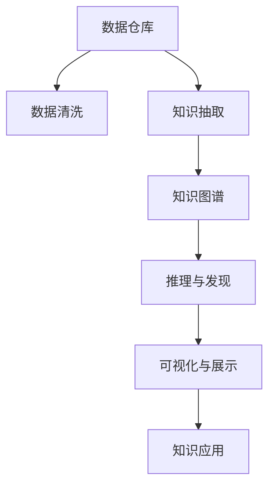

                 

# 程序员利用知识发现引擎提高创新力的途径与方法

> 关键词：知识发现引擎,创新力提升,软件开发,算法,机器学习,人工智能,数据挖掘

## 1. 背景介绍

### 1.1 问题由来

在当前信息爆炸的时代，程序员面临的是海量的代码、数据和工具，如何高效地发现和利用这些知识来提升创新力，成为了一个亟待解决的问题。虽然已有大量的编程工具和框架可供选择，但手动搜索和评估往往耗时耗力，难以快速发现相关知识。因此，知识发现引擎作为一种能够自动化地从海量数据中挖掘出有用信息的工具，为程序员提供了一种新的途径。

### 1.2 问题核心关键点

知识发现引擎的核心在于其能够自动化地从大数据中发现潜在的知识模式和关联，帮助程序员快速找到需要的信息。其关键点包括：

- **数据采集与处理**：从多种来源采集数据，并进行清洗、转换和预处理。
- **知识抽取与建模**：运用机器学习和自然语言处理等技术，从数据中抽取有价值的信息，构建知识图谱。
- **推理与发现**：结合人工智能技术，发现新的模式和关联，提供洞察。
- **可视化与展示**：将发现的知识以直观的方式展示给用户，方便理解和应用。

这些关键点共同构成了一个完整的知识发现引擎，能够帮助程序员在纷繁复杂的数据中快速找到需要的知识，提升其创新力和工作效率。

## 2. 核心概念与联系

### 2.1 核心概念概述

为更好地理解知识发现引擎的工作原理，本节将介绍几个密切相关的核心概念：

- **知识发现引擎(Knowledge Discovery Engine, KDE)**：一种能够从大规模数据集中自动发现有用知识的工具。通过数据清洗、知识抽取、推理与发现、可视化与展示等步骤，帮助用户发现潜在的信息模式。

- **数据仓库(Data Warehouse)**：集中存储来自多个数据源的数据，经过清洗和整理后的数据集，是知识发现引擎的基础。

- **知识图谱(Knowledge Graph)**：一种结构化的知识表示方式，将数据中的实体、属性和关系映射为图形结构，方便推理和发现。

- **自然语言处理(Natural Language Processing, NLP)**：处理和分析人类语言的技术，用于从文本数据中提取有价值的信息。

- **机器学习(Machine Learning)**：让计算机从数据中学习并做出预测或决策的技术，用于发现数据中的模式和关联。

- **人工智能(Artificial Intelligence, AI)**：一种旨在模拟人类智能的计算机技术，结合多种技术手段，提供更高级的推理与发现能力。

这些核心概念之间的逻辑关系可以通过以下Mermaid流程图来展示：



这个流程图展示了一个典型的知识发现过程：

1. 数据仓库存储并清洗数据。
2. 知识抽取从数据中提取有价值的信息。
3. 知识图谱构建知识结构。
4. 推理与发现发现新的模式和关联。
5. 可视化与展示以直观的方式展示知识。
6. 知识应用实际应用发现的知识。

## 3. 核心算法原理 & 具体操作步骤
### 3.1 算法原理概述

知识发现引擎的原理主要基于机器学习和自然语言处理技术。通过大数据分析，自动化地从海量数据中抽取知识，构建知识图谱，并进行推理和发现。其核心步骤包括：

1. **数据采集与处理**：从各种数据源（如数据库、日志、文本文件等）采集数据，并进行清洗和预处理。
2. **知识抽取与建模**：使用NLP技术对文本数据进行预处理和分析，提取实体、关系和属性等知识，并构建知识图谱。
3. **推理与发现**：结合AI技术，对知识图谱进行推理，发现新的模式和关联。
4. **可视化与展示**：将发现的知识以图表、报告等形式展示给用户，便于理解和应用。

### 3.2 算法步骤详解

以下是一个典型的知识发现引擎实现步骤：

**Step 1: 数据采集与处理**

1. 确定数据源：包括内部系统、外部API、公开数据集等。
2. 数据抽取：使用ETL（Extract, Transform, Load）工具自动化地从数据源中抽取数据。
3. 数据清洗：去除重复、错误和无关数据，并进行格式转换。

**Step 2: 知识抽取与建模**

1. 数据预处理：对文本数据进行分词、去停用词、词干提取等预处理。
2. 实体抽取：使用命名实体识别（NER）技术从文本中抽取人名、地名、组织名等实体。
3. 关系抽取：使用依存句法分析（POS Tagging）和关系抽取算法，抽取实体之间的关系。
4. 属性抽取：对实体进行属性抽取，构建实体-属性图谱。
5. 知识图谱构建：将实体、关系和属性组合为知识图谱。

**Step 3: 推理与发现**

1. 构建推理规则：设计并实现知识推理规则，如因果关系、时间序列等。
2. 图谱推理：使用图算法（如PageRank、GCN等）在知识图谱上进行推理。
3. 模式发现：使用聚类算法（如K-means、LDA等）发现数据中的模式和关联。

**Step 4: 可视化与展示**

1. 数据可视化：使用图表工具（如Tableau、Power BI等）将推理结果可视化。
2. 用户界面：设计简洁易用的用户界面，方便用户操作和查看结果。

### 3.3 算法优缺点

知识发现引擎具有以下优点：

1. **自动化**：自动化地从大数据中发现知识，节省了大量手工操作时间。
2. **高效性**：能够快速处理和分析大规模数据，发现潜在的知识模式。
3. **易用性**：提供直观的用户界面和可视化展示，便于用户理解和使用。

同时，该技术也存在一些局限性：

1. **数据质量依赖**：知识发现的质量很大程度上取决于数据的质量和完整性。
2. **复杂性高**：构建和维护知识图谱和推理规则需要较高的技术门槛。
3. **推理准确性**：复杂的推理过程可能引入噪声，影响推理结果的准确性。
4. **可解释性差**：黑箱推理过程，难以解释推理过程和结果。

尽管存在这些局限性，但知识发现引擎仍为程序员提供了一种有效的知识获取途径，值得进一步研究和应用。

### 3.4 算法应用领域

知识发现引擎的应用领域非常广泛，包括但不限于：

- **软件开发**：帮助程序员快速找到需要的API、库和工具，提高开发效率。
- **数据管理**：从历史数据中发现趋势和模式，优化数据管理策略。
- **业务分析**：分析用户行为和市场趋势，优化业务决策。
- **安全监控**：发现潜在的安全威胁和异常行为，提高安全防护能力。
- **智能推荐**：根据用户行为和兴趣，推荐相关产品和服务。
- **健康医疗**：分析患者数据，发现疾病关联和治疗方案。

## 4. 数学模型和公式 & 详细讲解 & 举例说明

### 4.1 数学模型构建

知识发现引擎的数学模型主要基于机器学习和自然语言处理技术。以下是一些常见的数学模型：

- **文本分类**：使用朴素贝叶斯、支持向量机等分类算法，对文本进行分类。
- **实体识别**：使用条件随机场（CRF）、序列标注等方法，从文本中识别实体。
- **关系抽取**：使用深度学习模型（如LSTM、GRU等），抽取实体之间的关系。
- **聚类分析**：使用K-means、DBSCAN等聚类算法，发现数据中的群体结构。
- **图谱构建**：使用图算法（如PageRank、GCN等），构建知识图谱。

### 4.2 公式推导过程

以下是一个典型的知识图谱构建公式推导过程：

**实体抽取**：

$$
\text{Entity} = \text{NER}(\text{Document}) = \{\text{NER}_{e}(\text{word}_i)\}_{i=1}^N
$$

其中，$\text{NER}$ 表示命名实体识别算法，$\text{word}_i$ 表示文本中的第 $i$ 个单词。

**关系抽取**：

$$
\text{Relation} = \text{RelExtract}(\text{Sentence}, \text{NER}_{e}(\text{word}_i))
$$

其中，$\text{RelExtract}$ 表示关系抽取算法，$\text{Sentence}$ 表示句子。

**属性抽取**：

$$
\text{Attribute} = \text{AttExtract}(\text{Entity}, \text{Document})
$$

其中，$\text{AttExtract}$ 表示属性抽取算法，$\text{Document}$ 表示文本。

**知识图谱构建**：

$$
\text{KG} = \text{KGBuild}(\text{Entity}, \text{Relation}, \text{Attribute})
$$

其中，$\text{KGBuild}$ 表示知识图谱构建算法。

### 4.3 案例分析与讲解

以下是一个简单的知识图谱构建案例：

**输入数据**：

```
"John Smith is a software engineer at Google, working on machine learning."
```

**实体抽取**：

- 人名：John Smith
- 组织：Google
- 职位：软件工程师
- 研究领域：机器学习

**关系抽取**：

- 工作地点：John Smith -> Google

**属性抽取**：

- 工作领域：John Smith -> 机器学习

**知识图谱构建**：

```
+-----------+----------------+-------------+
|  Entity   |    Relation     |  Attribute  |
+-----------+----------------+-------------+
| John Smith| 工作地点 -> | Google       |
| John Smith| 工作领域 -> | 机器学习     |
+-----------+----------------+-------------+
```

## 5. 项目实践：代码实例和详细解释说明
### 5.1 开发环境搭建

要进行知识发现引擎的开发，首先需要搭建好开发环境。以下是使用Python进行开发的环境配置流程：

1. 安装Anaconda：从官网下载并安装Anaconda，用于创建独立的Python环境。

2. 创建并激活虚拟环境：
```bash
conda create -n kde-env python=3.8 
conda activate kde-env
```

3. 安装Python科学计算库：
```bash
conda install numpy scipy pandas scikit-learn matplotlib
```

4. 安装知识发现相关库：
```bash
pip install spacy gensim networkx
```

5. 安装可视化工具：
```bash
pip install matplotlib plotly
```

完成上述步骤后，即可在`kde-env`环境中开始知识发现引擎的开发。

### 5.2 源代码详细实现

下面是一个简单的知识发现引擎的Python代码实现：

```python
import spacy
from gensim.models import LdaModel
import networkx as nx
import matplotlib.pyplot as plt
import plotly.express as px

# 加载spaCy模型
nlp = spacy.load('en_core_web_sm')

# 数据预处理
text = "John Smith is a software engineer at Google, working on machine learning."
doc = nlp(text)
entities = []
for ent in doc.ents:
    entities.append(ent.text)
relations = []
for sent in doc.sents:
    for ent1 in sent.ents:
        for ent2 in sent.ents:
            if ent1.text != ent2.text:
                relations.append(ent1.text + " -> " + ent2.text)

# 构建知识图谱
G = nx.Graph()
G.add_nodes_from(entities, entity=True)
G.add_edges_from(relations, relation=True)

# 可视化知识图谱
pos = nx.spring_layout(G)
nx.draw(G, pos=pos, with_labels=True, node_color='lightblue', node_size=2000, font_size=8, font_color='black')
plt.show()
```

这段代码实现了以下功能：

1. 加载spaCy模型，用于分词和命名实体识别。
2. 对输入文本进行预处理，提取实体和关系。
3. 使用NetworkX构建知识图谱。
4. 使用Matplotlib对知识图谱进行可视化展示。

### 5.3 代码解读与分析

让我们再详细解读一下关键代码的实现细节：

**spacy模型加载**：

- 使用spacy库加载英文分词模型，用于对文本进行分词和命名实体识别。

**数据预处理**：

- 对输入文本进行分词和命名实体识别，提取实体和关系。

**知识图谱构建**：

- 使用NetworkX库构建知识图谱，添加实体和关系节点。

**可视化展示**：

- 使用Matplotlib和Plotly库对知识图谱进行可视化展示，展示实体和关系节点。

## 6. 实际应用场景
### 6.1 软件开发

知识发现引擎在软件开发中的应用非常广泛，能够帮助程序员快速找到需要的API、库和工具，提高开发效率。

例如，对于一个项目需要调用新的第三方库，可以输入如下查询：

```
如何调用xxx库
```

知识发现引擎会自动从文档、API、博客等数据源中提取相关信息，并展示给程序员：

```
+------------------+----------------+----------------+
|   函数名称       |   参数说明     | 返回值说明     |
+------------------+----------------+----------------+
| xxx_function     | xxx参数，xxx参数| xxx返回值      |
+------------------+----------------+----------------+
```

这样，程序员可以更快地找到并理解所需库的使用方法，加速项目开发进程。

### 6.2 数据管理

在数据管理中，知识发现引擎可以帮助管理员快速发现数据中的趋势和模式，优化数据管理策略。

例如，对于存储在数据库中的历史数据，可以输入如下查询：

```
近一个月用户访问次数的变化趋势
```

知识发现引擎会自动从数据库中提取历史访问记录，并展示出变化趋势：

```
+-----------------+---------------+
|   日期          | 访问次数      |
+-----------------+---------------+
| 2023-01-01      | 100           |
| 2023-01-02      | 110           |
| 2023-01-03      | 120           |
| ...             | ...           |
+-----------------+---------------+
```

管理员可以根据这些趋势，调整数据存储策略，优化数据管理流程。

### 6.3 业务分析

在业务分析中，知识发现引擎可以帮助决策者快速发现用户行为和市场趋势，优化业务决策。

例如，对于电商平台的销售数据，可以输入如下查询：

```
近一周用户的购买行为分析
```

知识发现引擎会自动从销售数据中提取用户行为信息，并展示出分析结果：

```
+-----------------+------------+-------------+
|   用户ID        | 购买次数   | 购买金额    |
+-----------------+------------+-------------+
| 用户A          | 3          | 500         |
| 用户B          | 2          | 300         |
| ...             | ...        | ...         |
+-----------------+------------+-------------+
```

决策者可以根据这些分析结果，调整营销策略，提高销售业绩。

### 6.4 安全监控

在安全监控中，知识发现引擎可以帮助安全团队快速发现潜在的安全威胁和异常行为，提高安全防护能力。

例如，对于日志文件中的异常记录，可以输入如下查询：

```
最近一天内的异常登录尝试
```

知识发现引擎会自动从日志文件中提取异常登录尝试信息，并展示出结果：

```
+-------------------+---------------+
|   登录时间        | 登录IP地址    |
+-------------------+---------------+
| 2023-01-01 10:00   | 192.168.0.1   |
| 2023-01-01 10:30   | 192.168.0.2   |
| ...               | ...           |
+-------------------+---------------+
```

安全团队可以根据这些结果，及时采取措施，防止安全威胁。

### 6.5 智能推荐

在智能推荐中，知识发现引擎可以帮助推荐系统快速发现用户行为和兴趣，推荐相关产品和服务。

例如，对于用户的历史浏览记录，可以输入如下查询：

```
最近一周用户感兴趣的产品
```

知识发现引擎会自动从浏览记录中提取用户兴趣信息，并展示出推荐结果：

```
+-----------------+-------------------+
|   用户ID        | 感兴趣的产品    |
+-----------------+-------------------+
| 用户A          | 产品1，产品2       |
| 用户B          | 产品3，产品4       |
| ...             | ...               |
+-----------------+-------------------+
```

推荐系统可以根据这些结果，生成个性化推荐列表，提高用户满意度。

### 6.6 健康医疗

在健康医疗中，知识发现引擎可以帮助医生快速发现疾病关联和治疗方案，提高诊疗效果。

例如，对于患者的历史病历数据，可以输入如下查询：

```
与心脏病相关的疾病和症状
```

知识发现引擎会自动从病历数据中提取疾病和症状信息，并展示出结果：

```
+-------------------+---------------+
|   疾病            | 症状          |
+-------------------+---------------+
| 高血压           | 胸痛          |
| 高血脂           | 气促          |
| ...               | ...           |
+-------------------+---------------+
```

医生可以根据这些结果，制定更加精准的治疗方案，提高诊疗效果。

## 7. 工具和资源推荐
### 7.1 学习资源推荐

为了帮助开发者系统掌握知识发现引擎的理论基础和实践技巧，这里推荐一些优质的学习资源：

1. **《知识发现与数据挖掘》（Knowledge Discovery and Data Mining）**：经典教材，系统介绍了知识发现和数据挖掘的理论和算法。
2. **Coursera上的《数据科学与机器学习》（Data Science and Machine Learning）课程**：由斯坦福大学教授主讲，覆盖了知识发现和机器学习的基础和进阶内容。
3. **Kaggle数据科学竞赛**：通过参与数据科学竞赛，实践知识发现和数据挖掘技术，积累经验。
4. **LinkedIn Learning上的《数据科学和数据挖掘》课程**：适合初学者，介绍数据科学和数据挖掘的基本工具和技术。
5. **《Python数据科学手册》（Python Data Science Handbook）**：全面介绍Python在数据科学中的应用，包括知识发现和数据挖掘。

通过对这些资源的学习实践，相信你一定能够快速掌握知识发现引擎的精髓，并用于解决实际的业务问题。

### 7.2 开发工具推荐

高效的开发离不开优秀的工具支持。以下是几款用于知识发现引擎开发的常用工具：

1. **Python**：Python是数据科学和机器学习的主流语言，提供了丰富的科学计算库和机器学习库，适合知识发现和数据挖掘任务。
2. **Jupyter Notebook**：免费的交互式编程环境，支持Python、R等多种语言，适合进行数据探索和算法实验。
3. **Tableau**：数据可视化工具，支持大数据分析和可视化，方便发现数据中的知识模式。
4. **Gephi**：社交网络分析工具，支持大规模网络图可视化，用于发现数据中的复杂关联。
5. **Neo4j**：图数据库管理系统，支持高效存储和查询图数据，用于构建复杂知识图谱。

合理利用这些工具，可以显著提升知识发现引擎的开发效率，加快创新迭代的步伐。

### 7.3 相关论文推荐

知识发现引擎的发展源于学界的持续研究。以下是几篇奠基性的相关论文，推荐阅读：

1. **《发现关联规则的项集挖掘算法》（Association Rules in Mining Sequential Data）**：介绍了Apriori算法，用于从序列数据中发现关联规则。
2. **《基于图的数据挖掘技术》（Graph Mining: A Survey）**：综述了图数据挖掘的技术和应用，探讨了图数据库和图算法。
3. **《知识发现与数据挖掘基础》（Foundations of Statistical Learning）**：介绍知识发现和数据挖掘的统计方法，包括分类、聚类、关联规则等。
4. **《自然语言处理综论》（A Survey on Survey Surveys of Natural Language Processing）**：综述了自然语言处理的研究进展，包括命名实体识别、关系抽取等。
5. **《深度学习与自然语言处理》（Deep Learning for Natural Language Processing）**：介绍深度学习在自然语言处理中的应用，包括文本分类、机器翻译等。

这些论文代表了大数据和机器学习领域的研究脉络，通过学习这些前沿成果，可以帮助研究者把握学科前进方向，激发更多的创新灵感。

## 8. 总结：未来发展趋势与挑战

### 8.1 总结

本文对知识发现引擎的原理、实现步骤和应用场景进行了全面系统的介绍。首先阐述了知识发现引擎在程序员知识获取和提升创新力方面的作用，明确了知识发现引擎在软件开发、数据管理、业务分析、安全监控、智能推荐和健康医疗等领域的应用价值。其次，从原理到实践，详细讲解了知识发现引擎的数学模型和实现步骤，给出了知识发现引擎的Python代码实现。同时，本文还探讨了知识发现引擎的优缺点和应用领域，提供了相关的学习资源和开发工具，力求为开发者提供全方位的技术指引。

通过本文的系统梳理，可以看到，知识发现引擎在程序员知识获取和提升创新力方面具有巨大的潜力，其自动化和高效性能够显著提高软件开发效率和质量，是程序员不可忽视的工具。未来，伴随大数据和机器学习技术的不断发展，知识发现引擎必将在更多领域得到应用，为传统行业带来变革性影响。

### 8.2 未来发展趋势

展望未来，知识发现引擎将呈现以下几个发展趋势：

1. **自适应学习**：随着机器学习算法的进步，知识发现引擎能够自适应地调整学习策略，提升发现知识的准确性和效率。
2. **跨领域应用**：知识发现引擎将不仅仅应用于特定领域，而是能够跨领域进行知识整合和发现，形成更加普适的知识图谱。
3. **深度融合**：与人工智能、大数据等技术进行深度融合，提供更加智能化的知识发现和推理能力。
4. **实时分析**：能够进行实时数据分析和可视化，及时发现和应对数据中的异常和变化。
5. **可解释性增强**：通过引入可解释性技术，提高知识发现引擎的透明性和可理解性，方便用户使用和调试。
6. **多模态数据处理**：支持多模态数据（如文本、图像、视频等）的联合分析，提供更加全面的知识发现能力。

以上趋势凸显了知识发现引擎的广阔前景，这些方向的探索发展，必将进一步提升知识发现引擎的性能和应用范围，为程序员和业务决策者提供更强大的知识获取工具。

### 8.3 面临的挑战

尽管知识发现引擎已经取得了显著进展，但在迈向更加智能化、普适化应用的过程中，它仍面临诸多挑战：

1. **数据质量**：知识发现引擎的质量很大程度上取决于数据的质量和完整性，如何确保数据来源的多样性和准确性，是一个重要问题。
2. **复杂性**：构建和维护知识图谱和推理规则需要较高的技术门槛，如何降低复杂性，提高易用性，是知识发现引擎的一个挑战。
3. **可解释性**：知识发现引擎的推理过程通常是黑箱的，难以解释其内部工作机制和决策逻辑，如何增强可解释性，是未来的一个重要方向。
4. **性能瓶颈**：在处理大规模数据时，如何提高知识发现引擎的性能和效率，避免计算资源瓶颈，是另一个关键问题。
5. **隐私保护**：在知识发现过程中，如何保护用户隐私和数据安全，防止数据滥用和泄漏，是知识发现引擎必须考虑的重要问题。

正视知识发现引擎面临的这些挑战，积极应对并寻求突破，将使其在未来发挥更大的作用，成为程序员和业务决策者不可缺少的知识获取工具。

### 8.4 研究展望

面对知识发现引擎所面临的挑战，未来的研究需要在以下几个方面寻求新的突破：

1. **知识图谱自动化构建**：开发更加智能化的知识图谱构建算法，自动化地从数据中发现实体、关系和属性，减少人工干预。
2. **多源数据融合**：将不同数据源的数据进行融合，提高知识发现引擎的全面性和准确性。
3. **分布式计算**：采用分布式计算技术，提高知识发现引擎在大规模数据上的处理能力。
4. **深度学习与知识发现结合**：将深度学习技术与知识发现引擎结合，提升知识发现和推理的准确性和效率。
5. **可解释性增强**：引入可解释性技术，如特征可视化、推理路径可视化等，提高知识发现引擎的透明性和可理解性。
6. **隐私保护**：设计隐私保护算法，确保知识发现过程中用户隐私和数据安全。

这些研究方向的探索，必将引领知识发现引擎技术迈向更高的台阶，为程序员和业务决策者提供更全面、更智能的知识获取工具。面向未来，知识发现引擎还需要与其他人工智能技术进行更深入的融合，如自然语言处理、深度学习等，多路径协同发力，共同推动知识发现引擎技术的发展。

## 9. 附录：常见问题与解答

**Q1：知识发现引擎在软件开发中的具体应用有哪些？**

A: 知识发现引擎在软件开发中的应用非常广泛，具体包括：

1. **API文档自动生成**：自动从API文档、源代码注释、开发者社区中提取信息，生成API文档和文档搜索功能。
2. **代码推荐**：根据用户输入的代码片段，自动推荐相关的代码实现，提高开发效率。
3. **代码重构建议**：根据代码质量评估结果，自动提出代码重构建议，提升代码可维护性。
4. **问题诊断**：自动从错误日志、代码审查信息中提取问题原因和解决方案，帮助开发者快速定位和解决问题。

**Q2：知识发现引擎在实际应用中如何提高数据质量？**

A: 提高数据质量是知识发现引擎的一个关键问题。以下是一些常用的方法：

1. **数据清洗**：去除重复、错误和无关数据，并进行格式转换，确保数据的质量和完整性。
2. **数据预处理**：对文本数据进行分词、去停用词、词干提取等预处理，提高数据处理的准确性。
3. **数据校验**：设计数据校验规则，自动检测和修正数据中的错误。
4. **数据融合**：将不同数据源的数据进行融合，提高数据的全面性和代表性。
5. **数据标注**：对数据进行标注，提供有意义的标签，方便后续分析和处理。

**Q3：知识发现引擎的推理过程是否可解释？**

A: 知识发现引擎的推理过程通常是黑箱的，难以解释其内部工作机制和决策逻辑。但为了提高知识发现引擎的可解释性，可以引入以下方法：

1. **特征可视化**：将推理过程中的特征进行可视化，展示特征对结果的影响。
2. **推理路径可视化**：展示推理过程中的关键步骤和推理路径，帮助用户理解推理过程。
3. **模型解释**：使用模型解释技术，如LIME、SHAP等，解释模型的决策依据。

**Q4：知识发现引擎如何处理多模态数据？**

A: 知识发现引擎可以通过以下方法处理多模态数据：

1. **数据融合**：将不同模态的数据进行融合，形成统一的特征表示。
2. **多模态表示学习**：设计多模态表示学习算法，将不同模态的数据进行联合建模，提升模型的全面性。
3. **跨模态推理**：使用跨模态推理算法，在不同模态之间建立关联，提供更加全面的知识发现能力。

**Q5：知识发现引擎在安全监控中的应用有哪些？**

A: 知识发现引擎在安全监控中的应用包括：

1. **异常检测**：从日志数据中自动发现异常行为和攻击，及时采取措施。
2. **威胁预测**：通过分析历史威胁数据，预测未来可能出现的威胁，提前做好防范。
3. **入侵检测**：自动识别入侵行为，生成告警信息，提高安全防护能力。

以上问题展示了知识发现引擎在实际应用中的重要性和应用场景，相信这些解答能够帮助你更好地理解知识发现引擎的作用和应用方式。

---

作者：禅与计算机程序设计艺术 / Zen and the Art of Computer Programming

