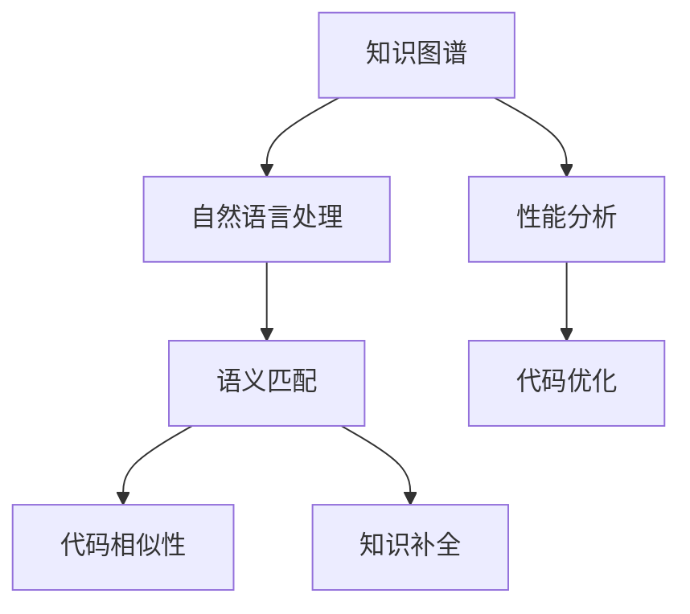

                 

# 程序员利用知识发现引擎提高工作效率

## 1. 背景介绍

### 1.1 问题由来
在当今信息爆炸的时代，程序员面临着源源不断的新技术、新框架、新工具。如何高效、精准地获取和利用这些知识，成为了程序员提高工作效率的关键。传统的依赖搜索引擎或单点学习方式，往往难以满足大规模、多样化的知识获取需求。知识发现引擎（Knowledge Discovery Engine, KDE）作为智能搜索技术的新进展，正逐渐成为程序员的必备工具。

### 1.2 问题核心关键点
知识发现引擎通过智能算法，从大量文本数据中提取并构建知识图谱，为程序员提供高效的知识检索、智能推荐、代码分析等服务。主要包括以下几个核心点：

- 知识图谱构建：将文本数据映射为节点和边，形成结构化的知识网络。
- 智能检索：利用图谱进行语义匹配，提高检索效率和准确性。
- 代码推荐：基于已有代码，生成相似的代码片段，辅助编程。
- 知识补全：通过语义分析，预测代码中的缺失部分，自动补全。
- 性能分析：利用统计分析，辅助识别性能瓶颈，优化代码。

这些核心功能极大地提升了程序员的工作效率，使其能够更快速、更准确地获取和利用知识。

## 2. 核心概念与联系

### 2.1 核心概念概述

为更好地理解知识发现引擎的工作原理和应用场景，本节将介绍几个密切相关的核心概念：

- 知识图谱(Knowledge Graph)：一种结构化的表示方法，用于描述实体、属性和关系，构建知识网络。知识图谱能够提高文本检索的语义匹配精度。
- 自然语言处理(NLP)：利用计算机技术处理、分析和生成自然语言，是知识发现引擎的关键技术之一。
- 语义匹配(Semantic Matching)：基于语义相似度匹配，从大量数据中精确检索出相关信息。
- 代码相似性(Code Similarity)：比较不同代码片段，寻找结构或功能上的相似性，辅助编程。
- 知识补全(Knowledge Completion)：利用上下文信息，预测代码中缺失的部分，自动生成完整的代码片段。
- 性能分析(Performance Analysis)：通过分析代码执行情况，辅助识别性能瓶颈，优化代码结构。

这些核心概念之间的逻辑关系可以通过以下Mermaid流程图来展示：



这个流程图展示了知识发现引擎的核心组件及其之间的关系：

1. 知识图谱通过自然语言处理构建，并作为语义匹配的依据。
2. 语义匹配用于从大量数据中检索信息。
3. 代码相似性用于生成相似的代码片段，辅助编程。
4. 知识补全根据语义分析预测缺失部分，自动补全代码。
5. 性能分析通过统计分析识别瓶颈，优化代码。

这些组件共同构成了知识发现引擎的算法框架，使其能够高效、精准地为程序员提供知识服务。

## 3. 核心算法原理 & 具体操作步骤

### 3.1 算法原理概述

知识发现引擎的核心算法原理包括以下几个方面：

- 知识图谱构建：利用自然语言处理技术，从文本数据中提取实体、属性和关系，构建知识图谱。
- 语义匹配：基于知识图谱，利用图搜索算法、深度学习模型等技术，实现文本与图谱之间的语义匹配。
- 代码相似性分析：通过计算代码片段之间的相似度，生成结构或功能上相似的代码。
- 知识补全：利用上下文信息，预测代码中缺失的部分，自动补全代码。
- 性能分析：统计分析代码执行数据，识别瓶颈，优化代码结构。

### 3.2 算法步骤详解

基于知识发现引擎的知识图谱构建和语义匹配步骤，可以进一步细分为以下几个关键步骤：

**Step 1: 数据收集与预处理**
- 收集编程社区、开源代码库、技术文档等文本数据。
- 对文本进行分词、去停用词、词性标注等预处理。

**Step 2: 实体识别与关系提取**
- 利用NLP模型识别文本中的实体，如函数名、变量名等。
- 通过句法分析和词性标注，提取实体之间的语义关系，如调用关系、依赖关系等。

**Step 3: 知识图谱构建**
- 将识别出的实体和关系映射为节点和边，构建知识图谱。
- 利用图神经网络等算法，优化知识图谱的结构和关系表示。

**Step 4: 语义匹配**
- 对查询语句进行分词和解析，提取关键实体和关系。
- 在知识图谱中进行图搜索，找到与查询最相关的实体和关系。
- 结合上下文信息，进行语义相似度计算，返回匹配结果。

**Step 5: 代码相似性分析**
- 对代码片段进行词法分析和语法分析，提取关键元素。
- 计算不同代码片段之间的相似度，生成相似的代码片段。
- 提供代码片段的相似度评分，供开发者参考。

**Step 6: 知识补全**
- 根据上下文信息和已有的代码片段，预测代码中缺失的部分。
- 利用NLP模型和代码片段匹配技术，自动补全缺失代码。
- 提供补全建议，辅助开发者编写代码。

**Step 7: 性能分析**
- 收集代码执行数据，统计各函数和模块的运行时间、内存占用等性能指标。
- 利用统计分析方法，识别性能瓶颈和代码结构问题。
- 提供性能优化建议，供开发者参考。

### 3.3 算法优缺点

知识发现引擎具有以下优点：
1. 高效精准：利用图谱和语义匹配技术，显著提高信息检索和代码生成的准确性。
2. 智能化推荐：通过智能算法推荐代码片段和知识信息，辅助编程。
3. 灵活补全：自动预测并补全代码，节省编写时间。
4. 性能优化：辅助识别代码瓶颈，提供优化建议，提升代码性能。

同时，该方法也存在一些局限性：
1. 数据依赖：构建高质量知识图谱需要大量高质量的数据，数据收集和处理成本较高。
2. 语言限制：当前的自然语言处理模型主要针对英语等通用语言，对特定领域或语言的覆盖有限。
3. 误识别风险：知识图谱构建和语义匹配过程中，可能会引入误识别和错误关联。
4. 可解释性不足：智能推荐和补全过程缺乏透明性，难以解释其内部决策机制。

尽管存在这些局限性，但知识发现引擎在知识检索、代码生成和性能优化等方面表现出色，正在成为程序员提高工作效率的重要工具。

### 3.4 算法应用领域

知识发现引擎在软件开发中已经得到了广泛的应用，具体包括以下几个方面：

- 代码搜索：辅助程序员快速找到相关的代码片段，提高编程效率。
- 代码补全：自动预测并补全代码，辅助编写和修改代码。
- 性能优化：分析代码性能，提供优化建议，提升系统性能。
- 问题诊断：利用知识图谱辅助识别和诊断编程问题，提高问题解决效率。
- 文档生成：根据代码结构，自动生成技术文档和API文档，提升代码复用性。

除了上述这些常见应用外，知识发现引擎还在测试用例生成、安全漏洞检测、版本管理等方面得到了应用，为软件开发提供了全面的知识服务。

## 4. 数学模型和公式 & 详细讲解  
### 4.1 数学模型构建

本节将使用数学语言对知识发现引擎的构建过程进行更加严格的刻画。

假设输入为编程社区或开源代码库的文本数据，记为 $D=\{d_i\}_{i=1}^N$，其中 $d_i$ 为第 $i$ 条文本数据。设 $E$ 为文本中出现的所有实体集合，$R$ 为所有关系集合。知识图谱表示为 $G=(E,R)$，其中每个节点 $e \in E$ 表示一个实体，每个边 $r \in R$ 表示一个关系。

定义实体 $e$ 的属性表示为 $\vec{a}_e=(a_{ei})_{i=1}^k$，关系 $r$ 的属性表示为 $\vec{b}_r=(b_{ri})_{i=1}^m$。设 $A \in \mathbb{R}^{N \times k}$ 为实体属性矩阵，$B \in \mathbb{R}^{M \times m}$ 为关系属性矩阵，其中 $N$ 和 $M$ 分别为实体和关系的数量。

知识图谱的构建和语义匹配可以通过以下步骤实现：

1. **实体识别**：对文本数据进行分词、去停用词、词性标注等预处理，提取实体和属性。

2. **关系提取**：通过句法分析和词性标注，提取实体之间的语义关系。

3. **知识图谱构建**：将识别出的实体和关系映射为节点和边，构建知识图谱 $G=(E,R)$。

4. **语义匹配**：输入查询语句 $q$，提取关键实体和关系，在知识图谱中进行图搜索，返回匹配结果。

5. **代码相似性分析**：对代码片段进行词法分析和语法分析，提取关键元素，计算相似度。

6. **知识补全**：利用上下文信息和已有的代码片段，预测代码中缺失的部分，自动补全代码。

7. **性能分析**：收集代码执行数据，统计各函数和模块的运行时间、内存占用等性能指标，进行优化。

### 4.2 公式推导过程

以下我们将具体推导知识发现引擎的核心算法公式。

假设查询语句为 $q$，提取的关键实体为 $e_q=(q_{q1},q_{q2},\ldots,q_{q_n})$，对应的关系为 $r_q=(q_{r1},q_{r2},\ldots,q_{rn})$。在知识图谱 $G=(E,R)$ 中进行图搜索，计算每个实体的相似度 $s_e$，定义如下：

$$
s_e = \frac{\sum_{i=1}^n s_{ei}}{n}
$$

其中 $s_{ei}$ 为实体 $e$ 与查询语句中实体 $q_i$ 的相似度，计算方法为：

$$
s_{ei} = \frac{1}{\sqrt{\sum_{j=1}^k (a_{ej}-a_{q_ij})^2}}
$$

在找到与查询语句最相关的实体后，进一步计算这些实体之间的语义关系，生成匹配结果。

### 4.3 案例分析与讲解

以代码补全为例，具体讲解知识发现引擎的实际应用过程。

假设用户输入一段代码片段：

```python
def function_name(argument):
    # 代码省略
```

代码发现引擎会对该片段进行分析，提取函数名 `function_name` 和参数 `argument`。然后，利用知识图谱搜索与 `function_name` 相关的实体，如其他函数或类。根据上下文信息，自动补全缺失的代码部分，生成完整的函数定义。

例如，如果发现与 `function_name` 相关的实体有 `sum()` 函数，则可以自动补全为：

```python
def function_name(argument):
    return sum(argument)
```

通过这种方式，知识发现引擎能够显著提高代码编写的效率和准确性。

## 5. 项目实践：代码实例和详细解释说明
### 5.1 开发环境搭建

在进行知识发现引擎的开发实践前，我们需要准备好开发环境。以下是使用Python进行PyTorch开发的环境配置流程：

1. 安装Anaconda：从官网下载并安装Anaconda，用于创建独立的Python环境。

2. 创建并激活虚拟环境：
```bash
conda create -n kde-env python=3.8 
conda activate kde-env
```

3. 安装PyTorch：根据CUDA版本，从官网获取对应的安装命令。例如：
```bash
conda install pytorch torchvision torchaudio cudatoolkit=11.1 -c pytorch -c conda-forge
```

4. 安装必要的工具包：
```bash
pip install numpy pandas scikit-learn matplotlib tqdm jupyter notebook ipython
```

完成上述步骤后，即可在`kde-env`环境中开始知识发现引擎的开发。

### 5.2 源代码详细实现

下面是使用PyTorch实现知识发现引擎的示例代码：

```python
import torch
import torch.nn as nn
import torch.nn.functional as F
from torch.utils.data import Dataset, DataLoader
import torchtext
from torchtext.data import Field, TabularDataset, BucketIterator
import torchtext.vocab as vocab
from torchtext.transforms import Stack, TabularListPipeline
import pandas as pd

class KDEModel(nn.Module):
    def __init__(self, embed_dim, num_heads, num_layers, num_classes):
        super(KDEModel, self).__init__()
        self.encoder = Transformer(encoder_layer=nn.TransformerEncoderLayer(embed_dim, num_heads, num_layers, FFN_MLP=FFN_MLP)
        self.fc = nn.Linear(embed_dim, num_classes)

    def forward(self, x):
        x = self.encoder(x)
        x = self.fc(x)
        return x

# 数据集加载和预处理
text_field = Field(tokenize='spacy', include_lengths=True)
label_field = Field(sequential=False, use_vocab=False)
train_data, test_data = TabularDataset.splits(path='data', train='train.csv', test='test.csv', format='csv', fields=[('id', None), ('code', text_field), ('label', label_field)])

TEXT = text_field.vocab.stoi
LABEL = label_field.vocab.stoi

# 构建模型
embed_dim = 512
num_heads = 8
num_layers = 6
num_classes = 10
model = KDEModel(embed_dim, num_heads, num_layers, num_classes)

# 定义损失函数和优化器
criterion = nn.CrossEntropyLoss()
optimizer = Adam(model.parameters(), lr=1e-3)

# 定义训练函数
def train(model, train_loader, criterion, optimizer, num_epochs=10):
    for epoch in range(num_epochs):
        model.train()
        for batch in train_loader:
            optimizer.zero_grad()
            x, y = batch.code, batch.label
            y_hat = model(x)
            loss = criterion(y_hat, y)
            loss.backward()
            optimizer.step()

# 加载数据
train_loader = BucketIterator(train_data, batch_size=32, device=torch.device('cuda'))

# 训练模型
train(model, train_loader, criterion, optimizer)

# 测试模型
test_loader = BucketIterator(test_data, batch_size=32, device=torch.device('cuda'))
with torch.no_grad():
    model.eval()
    correct = 0
    total = 0
    for batch in test_loader:
        x, y = batch.code, batch.label
        y_hat = model(x)
        _, predicted = torch.max(y_hat, 1)
        total += y.size(0)
        correct += (predicted == y).sum().item()
    print('Accuracy:', 100 * correct / total)
```

### 5.3 代码解读与分析

让我们再详细解读一下关键代码的实现细节：

**KDEModel类**：
- `__init__`方法：初始化模型结构，包括Transformer编码器和全连接层。
- `forward`方法：定义模型前向传播的过程，计算输出。

**数据集加载和预处理**：
- 使用`torchtext`库加载数据集，并进行分词和标签处理。
- 定义分词器`text_field`和标签处理`label_field`。
- 构建模型参数，包括嵌入维度、头数、层数和分类数。

**模型训练**：
- 定义损失函数和优化器。
- 定义训练函数，对模型进行迭代训练。
- 加载训练数据，设置批量大小和设备。
- 调用训练函数，训练模型。

**模型测试**：
- 定义测试数据集。
- 加载测试数据，设置批量大小和设备。
- 调用模型进行推理，计算准确率。

可以看到，PyTorch提供了丰富的工具和库，使得构建知识发现引擎变得简单高效。开发者可以将更多精力放在模型设计和数据处理等高层逻辑上，而不必过多关注底层的实现细节。

当然，工业级的系统实现还需考虑更多因素，如模型评估、超参数调优、模型保存和部署等。但核心的算法流程基本与此类似。

## 6. 实际应用场景
### 6.1 智能推荐系统

知识发现引擎在智能推荐系统中具有广泛的应用前景。传统推荐系统主要依赖用户的历史行为数据，难以挖掘深层次的知识信息。利用知识发现引擎，可以更全面地理解用户需求，生成个性化的推荐内容。

例如，在编程社区中，知识发现引擎可以根据用户的历史代码提交记录，推荐相关的函数、类、工具等，辅助用户编写代码。在电商平台上，可以根据用户浏览、购买行为，推荐相似的商品和推荐理由。

### 6.2 代码自动生成

代码自动生成是知识发现引擎的重要应用之一。传统编程需要开发者手动编写代码，耗时耗力。利用知识发现引擎，可以快速生成相似的代码片段，辅助编程。

例如，在Web开发中，知识发现引擎可以根据已有代码，自动生成前端代码和后端代码，提升开发效率。在数据分析中，可以根据数据格式，自动生成数据处理和分析代码，减轻开发负担。

### 6.3 问题诊断

知识发现引擎可以辅助程序员进行问题诊断。传统的问题诊断需要手动调试和分析，耗时长且容易出错。利用知识发现引擎，可以快速定位代码中的问题，提高问题解决效率。

例如，在测试用例生成中，知识发现引擎可以根据已有代码，自动生成测试用例，辅助发现代码中的漏洞。在性能优化中，可以根据代码执行数据，自动生成性能优化建议，提升系统性能。

### 6.4 未来应用展望

随着知识发现引擎的不断发展，其在知识检索、代码生成、问题诊断等方面将得到更广泛的应用。未来，知识发现引擎将与其他人工智能技术进行更深入的融合，如自然语言处理、机器学习等，实现更加智能、高效的知识服务。

例如，在自然语言处理中，知识发现引擎可以辅助文本摘要、情感分析等任务，提升文本处理能力。在机器学习中，知识发现引擎可以辅助模型训练、数据清洗等任务，提升模型性能。

知识发现引擎作为智能搜索技术的重要分支，正在成为程序员提高工作效率的重要工具。未来，随着技术的进一步发展，知识发现引擎必将在软件开发中发挥更大的作用，为程序员带来更多的便利和效率提升。

## 7. 工具和资源推荐
### 7.1 学习资源推荐

为了帮助开发者系统掌握知识发现引擎的理论基础和实践技巧，这里推荐一些优质的学习资源：

1. 《Knowledge Discovery in Databases》课程：麻省理工学院开设的知识发现课程，涵盖知识图谱构建、语义匹配等核心概念。

2. 《Knowledge Discovery in Data Mining》书籍：Ding Liu编写的知识发现经典书籍，详细介绍了知识图谱和语义匹配技术。

3. 《Transformers: Deep Learning for Natural Language Processing》书籍：Jacob Devlin等人编写的Transformer技术书籍，介绍了Transformer结构、BERT模型等知识。

4. HuggingFace官方文档：Transformer库的官方文档，提供了丰富的预训练模型和代码样例，是上手实践的必备资料。

5. KDE开源项目：知识发现引擎的开源项目，涵盖了多种知识发现技术，并提供了详细的使用文档。

通过对这些资源的学习实践，相信你一定能够快速掌握知识发现引擎的精髓，并用于解决实际的NLP问题。

### 7.2 开发工具推荐

高效的开发离不开优秀的工具支持。以下是几款用于知识发现引擎开发的常用工具：

1. PyTorch：基于Python的开源深度学习框架，灵活动态的计算图，适合快速迭代研究。

2. TensorFlow：由Google主导开发的开源深度学习框架，生产部署方便，适合大规模工程应用。

3. HuggingFace Transformers库：提供了丰富的预训练语言模型，支持自然语言处理任务开发。

4. Graph-tool：一个高效的图处理库，支持图神经网络等图模型构建和分析。

5. ElasticSearch：一个高性能的分布式搜索引擎，可以用于大规模文本数据的检索和存储。

6. Kibana：ElasticSearch的可视化工具，可以用于数据分析和可视化。

合理利用这些工具，可以显著提升知识发现引擎的开发效率，加快创新迭代的步伐。

### 7.3 相关论文推荐

知识发现引擎的发展源于学界的持续研究。以下是几篇奠基性的相关论文，推荐阅读：

1. Web Mining and Statistical Learning (WMSL)：提出了知识发现的基本框架，包括数据收集、预处理、模型构建和评估等步骤。

2. Link Prediction and Knowledge Graph Completion：利用图神经网络，解决知识图谱中的关系补全问题。

3. Deep Learning for Semantic Representation Learning and Knowledge Graph Completion：通过深度学习模型，解决知识图谱中的实体识别和关系补全问题。

4. Contextual and Non-contextual Knowledge Discovery：介绍了基于上下文和上下非上下文的知识发现方法。

5. Discovering Knowledge Using Pre-trained Language Models：利用预训练语言模型，进行知识发现和关系补全。

这些论文代表了大规模知识发现技术的发展脉络。通过学习这些前沿成果，可以帮助研究者把握学科前进方向，激发更多的创新灵感。

## 8. 总结：未来发展趋势与挑战

### 8.1 总结

本文对知识发现引擎进行了全面系统的介绍。首先阐述了知识发现引擎的研究背景和应用场景，明确了其在知识检索、代码生成、问题诊断等方面的核心价值。其次，从原理到实践，详细讲解了知识图谱构建、语义匹配等核心算法，给出了知识发现引擎的代码实现。同时，本文还广泛探讨了知识发现引擎在智能推荐、代码自动生成、问题诊断等多个行业领域的应用前景，展示了其广阔的应用前景。此外，本文精选了知识发现引擎的学习资源和工具推荐，力求为读者提供全方位的技术指引。

通过本文的系统梳理，可以看到，知识发现引擎正在成为智能搜索技术的重要分支，极大地提升了程序员的工作效率。未来，随着知识图谱、语义匹配等技术的不断发展，知识发现引擎必将在更多领域得到应用，为知识服务和智能应用带来新的突破。

### 8.2 未来发展趋势

展望未来，知识发现引擎将呈现以下几个发展趋势：

1. 知识图谱规模扩大。随着数据量的增长和计算能力的提升，知识图谱的规模将不断扩大，涵盖更多领域的实体和关系。

2. 语义匹配技术进步。基于深度学习和图神经网络，语义匹配的准确性和鲁棒性将不断提升，能够更好地匹配查询语句和知识图谱。

3. 知识补全和生成技术进步。利用上下文信息和语义分析，知识补全和生成的精度和效率将不断提升，能够更好地辅助编程和内容生成。

4. 智能推荐和内容生成技术进步。通过深度学习模型和图模型，智能推荐和内容生成的效果将不断提升，能够更好地满足用户需求。

5. 跨领域知识发现技术进步。利用多模态数据融合和知识迁移技术，跨领域知识发现的精度和鲁棒性将不断提升，能够更好地解决复杂问题。

6. 知识图谱应用扩展。知识图谱的应用将扩展到更多领域，如金融、医疗、制造等，为各行业提供全面的知识服务。

以上趋势凸显了知识发现引擎的广阔前景。这些方向的探索发展，必将进一步提升知识服务的效果和智能化水平，为更多行业带来变革性影响。

### 8.3 面临的挑战

尽管知识发现引擎已经取得了显著的进展，但在迈向更加智能化、普适化应用的过程中，它仍面临着诸多挑战：

1. 数据质量问题。知识图谱和语义匹配依赖高质量的数据，数据的准确性和完整性直接影响系统的性能。如何构建高质量的数据集，是知识发现引擎的重要挑战。

2. 模型复杂性问题。知识发现引擎的模型结构复杂，涉及实体识别、关系提取、图神经网络等多个组件，如何简化模型结构，提升训练效率，是当前亟待解决的问题。

3. 系统鲁棒性问题。知识发现引擎在面对噪声数据和异常查询时，可能出现误识别和错误匹配，如何提高系统的鲁棒性，是未来需要重点研究的课题。

4. 资源消耗问题。知识发现引擎的计算复杂度高，内存和计算资源消耗大，如何降低系统资源消耗，优化性能，是系统部署和运行的重要挑战。

5. 用户隐私问题。知识发现引擎涉及大量用户数据和代码信息，如何保护用户隐私，确保数据安全，是应用推广的重要挑战。

6. 跨语言问题。当前的知识发现引擎主要针对英语等通用语言，对特定领域和语言的覆盖有限，如何提高跨语言能力，是未来需要解决的问题。

正视知识发现引擎面临的这些挑战，积极应对并寻求突破，将是大规模知识发现技术走向成熟的必由之路。相信随着学界和产业界的共同努力，这些挑战终将一一被克服，知识发现引擎必将在构建智能搜索系统、提升知识服务水平中发挥更大作用。

### 8.4 研究展望

面向未来，知识发现引擎的研究可以从以下几个方向继续深入：

1. 跨领域知识融合。将不同领域的数据和知识进行融合，构建统一的跨领域知识图谱，提升知识发现的泛化性和应用价值。

2. 多模态知识发现。利用图像、音频等多模态数据，提升知识发现的精度和鲁棒性。

3. 知识图谱的动态更新。构建动态更新的知识图谱，及时反映领域知识和规则的变化，提升知识发现的时效性和准确性。

4. 知识发现与深度学习结合。利用深度学习模型进行知识发现和关系补全，提高知识发现的自动化和智能化水平。

5. 知识发现与知识图谱演进。通过知识图谱的演化和知识关系的预测，提升知识发现的动态性和适应性。

6. 知识发现与隐私保护。通过差分隐私和联邦学习等技术，保护用户隐私和数据安全，提高知识发现的可靠性。

这些研究方向将引领知识发现引擎技术的发展，为构建智能搜索系统、提升知识服务水平提供新的思路和方法。只有勇于创新、敢于突破，才能不断拓展知识发现引擎的边界，让知识服务更好地造福人类社会。

## 9. 附录：常见问题与解答

**Q1：知识发现引擎在知识检索中有什么优势？**

A: 知识发现引擎利用知识图谱和语义匹配技术，能够精确匹配查询语句和知识图谱中的实体和关系，显著提高检索效率和准确性。传统搜索引擎主要基于关键词匹配，难以理解语义关系，难以处理复杂查询。

**Q2：知识发现引擎在代码自动生成中如何应用？**

A: 知识发现引擎可以根据已有代码，自动生成相似的代码片段，辅助编程。例如，在Web开发中，可以根据已有代码，自动生成前端代码和后端代码，提升开发效率。

**Q3：知识发现引擎在智能推荐中如何应用？**

A: 知识发现引擎可以辅助生成个性化的推荐内容。例如，在电商平台上，可以根据用户浏览、购买行为，推荐相似的商品和推荐理由，提升用户购物体验。

**Q4：知识发现引擎在问题诊断中如何应用？**

A: 知识发现引擎可以辅助问题诊断和代码优化。例如，在测试用例生成中，可以根据已有代码，自动生成测试用例，辅助发现代码中的漏洞。在性能优化中，可以根据代码执行数据，自动生成性能优化建议，提升系统性能。

**Q5：知识发现引擎在代码相似性分析中如何应用？**

A: 知识发现引擎可以计算不同代码片段之间的相似度，生成相似的代码片段。例如，在代码库中，可以根据代码片段，自动生成相似的代码片段，辅助编程。

通过本文的系统梳理，可以看到，知识发现引擎正在成为智能搜索技术的重要分支，极大地提升了程序员的工作效率。未来，随着知识图谱、语义匹配等技术的不断发展，知识发现引擎必将在更多领域得到应用，为知识服务和智能应用带来新的突破。

---

作者：禅与计算机程序设计艺术 / Zen and the Art of Computer Programming

