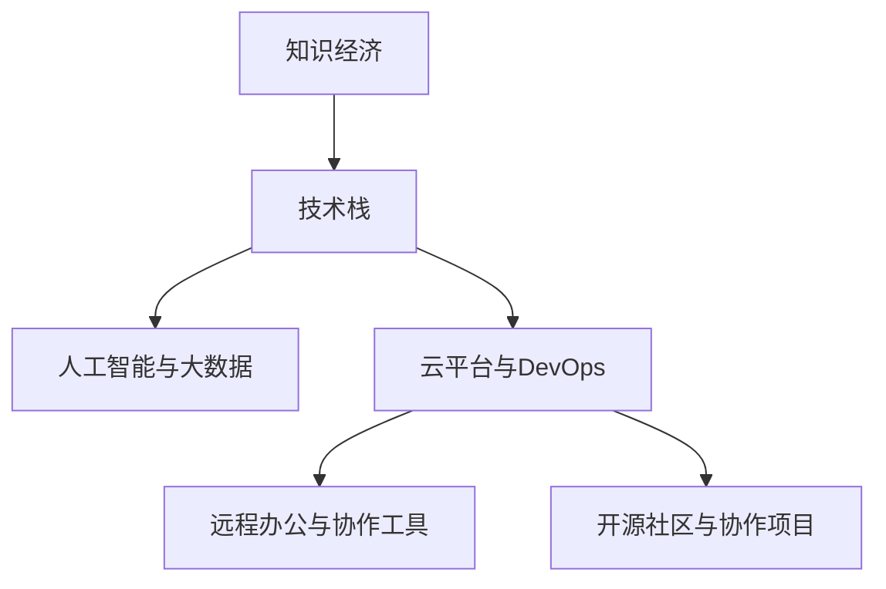

                 

# 程序员在知识经济时代的发展趋势与机遇

在当今这个知识经济时代，技术的进步已经深刻地改变了各行各业的面貌，尤其是信息技术行业，程序员这一职业也随之发生了翻天覆地的变化。本文将深入探讨程序员在知识经济时代的职业发展趋势与机遇，通过分析核心概念与联系、算法原理与操作步骤、实际应用场景等，全面剖析程序员面临的挑战与机遇，并给出未来发展的指导。

## 1. 背景介绍

### 1.1 问题由来

随着信息技术的迅猛发展，程序员在知识经济时代的职业环境也随之发生了巨大变化。传统的软件开发模式、团队合作方式和职业发展路径都在逐步演进。程序员需要具备更广泛的知识技能和更高的职业素养，以适应新兴技术的发展需求。此外，全球化的竞争环境和日益复杂的工作环境也对程序员的职业发展提出了新的挑战和机遇。

### 1.2 问题核心关键点

本节将详细分析程序员在知识经济时代的主要挑战与机遇，以提供更加清晰的发展方向和职业规划建议。

## 2. 核心概念与联系

### 2.1 核心概念概述

1. **知识经济**：指以知识为核心的经济模式，强调创新、创意、技术和知识在经济活动中的核心作用。
2. **技术栈**：程序员所需掌握的技术领域和工具的集合，包括编程语言、框架、数据库、算法等。
3. **人工智能与大数据**：程序员需掌握的高级技术，应用于数据分析、机器学习、深度学习等领域。
4. **云平台与DevOps**：推动了软件开发生命周期的自动化与协作，成为软件开发的主流趋势。
5. **远程办公与协作工具**：改变了传统的工作模式，使得程序员可以更加灵活地开展工作。
6. **开源社区与协作项目**：提供了丰富的资源和机会，促进了知识的共享和技术的创新。

### 2.2 核心概念原理和架构的 Mermaid 流程图



### 2.3 核心概念之间的关系

知识经济时代的技术栈与人工智能、大数据、云平台、DevOps等紧密相连，形成了一个相互促进、协同发展的技术生态系统。远程办公和协作工具为知识工作者提供了更加灵活的工作环境，而开源社区则为程序员提供了丰富的资源和创新的平台。

## 3. 核心算法原理 & 具体操作步骤

### 3.1 算法原理概述

程序员在知识经济时代的职业发展，不仅依赖于编程技能，更依赖于对新技术的掌握、对创新模式的理解和跨领域知识的应用。因此，掌握核心算法原理是程序员职业发展的关键。

### 3.2 算法步骤详解

程序员的职业发展可以分为以下几个关键步骤：

1. **学习与培训**：持续学习新知识，参加培训课程，掌握新兴技术。
2. **技术实践**：通过项目实践，将理论知识应用于实际工作中。
3. **跨领域应用**：将编程技能与其他领域的知识结合，提升综合能力。
4. **团队协作**：参与协作项目，提升团队协作和沟通能力。
5. **创新与改进**：鼓励创新思维，不断改进现有技术，实现技术突破。

### 3.3 算法优缺点

知识经济时代程序员的职业发展，有以下优点和缺点：

**优点**：
1. **职业机会丰富**：新兴技术的发展为程序员提供了丰富的职业机会。
2. **薪酬待遇提升**：技术栈和技术能力的提升，带来更高的薪酬待遇。
3. **工作环境灵活**：远程办公和协作工具，为程序员提供了更灵活的工作环境。

**缺点**：
1. **学习压力增加**：新技术层出不穷，需要不断学习以保持竞争力。
2. **知识更新速度快**：知识半衰期缩短，需要快速适应新变化。
3. **竞争加剧**：技术人才供给增加，竞争日益激烈。

### 3.4 算法应用领域

程序员在知识经济时代的职业发展，可以应用于以下领域：

1. **软件开发**：持续更新技术栈，掌握新兴编程语言和框架。
2. **数据科学**：学习大数据和人工智能技术，从事数据分析和机器学习工作。
3. **云计算**：掌握云平台和DevOps技术，提升软件开发生命周期管理能力。
4. **创新应用**：结合其他领域的知识，开发创新型应用，提升综合竞争力。

## 4. 数学模型和公式 & 详细讲解 & 举例说明

### 4.1 数学模型构建

程序员在知识经济时代的发展，涉及多个领域的数学模型和算法。本节将介绍几个典型的数学模型，并详细讲解其构建和应用。

#### 4.1.1 线性回归模型

线性回归模型是程序员在数据分析中常用的模型之一，用于预测连续型变量。其数学模型为：

$$ y = \beta_0 + \beta_1 x_1 + \beta_2 x_2 + \ldots + \beta_n x_n + \epsilon $$

其中，$y$ 为预测变量，$x_i$ 为自变量，$\beta_i$ 为回归系数，$\epsilon$ 为误差项。

#### 4.1.2 决策树模型

决策树模型是程序员在机器学习中常用的分类模型之一，用于处理离散型变量。其数学模型为：

$$ 
\begin{aligned}
&\text{if} \ x_1 = x_{1,i} \ \text{and} \ x_2 = x_{2,i} \ \text{and} \ \ldots \ \text{and} \ x_n = x_{n,i} \\
&\quad y = c_i \\
&\text{else} \\
&\quad y = \text{GiniIndex}(x_i)
\end{aligned}
$$

其中，$c_i$ 为叶节点的类别，$GiniIndex$ 为基尼指数。

#### 4.1.3 神经网络模型

神经网络模型是程序员在深度学习中常用的模型之一，用于处理复杂的非线性关系。其数学模型为：

$$
\begin{aligned}
&\text{输入层} \quad \{x_1, x_2, \ldots, x_n\} \\
&\text{隐藏层} \quad \{h_1, h_2, \ldots, h_m\} \\
&\text{输出层} \quad y
\end{aligned}
$$

其中，$h_i = w_i \cdot x + b_i$，$w_i$ 为权重，$b_i$ 为偏置。

### 4.2 公式推导过程

以线性回归模型为例，推导其最小二乘法求解过程。

1. **模型构建**：$y = \beta_0 + \beta_1 x_1 + \beta_2 x_2 + \ldots + \beta_n x_n + \epsilon$
2. **最小二乘法求解**：
   $$
   \min_{\beta_0, \beta_1, \beta_2, \ldots, \beta_n} \sum_{i=1}^N (y_i - \hat{y}_i)^2
   $$
   其中，$\hat{y}_i = \beta_0 + \beta_1 x_{1,i} + \beta_2 x_{2,i} + \ldots + \beta_n x_{n,i}$

3. **求解过程**：
   $$
   \frac{\partial}{\partial \beta_j} \sum_{i=1}^N (y_i - \hat{y}_i)^2 = 0 \quad (j=0, 1, 2, \ldots, n)
   $$
   推导得：
   $$
   \begin{aligned}
   \beta_j &= \frac{1}{N} \sum_{i=1}^N (x_{i,j} - \bar{x}_{i,j}) \frac{\sum_{i=1}^N (y_i - \bar{y}) (x_{i,j} - \bar{x}_{i,j})}{\sum_{i=1}^N (x_{i,j} - \bar{x}_{i,j})^2} \\
   &= \frac{\sum_{i=1}^N (y_i - \bar{y}) (x_{i,j} - \bar{x}_{i,j})}{\sum_{i=1}^N (x_{i,j} - \bar{x}_{i,j})^2}
   \end{aligned}
   $$

### 4.3 案例分析与讲解

以机器学习项目为例，探讨程序员在实际项目中如何应用数学模型和算法。

**案例**：房价预测

1. **数据准备**：收集房价数据，包括自变量（面积、位置等）和因变量（房价）。
2. **模型构建**：使用线性回归模型，构建预测房价的模型。
3. **模型训练**：使用历史数据训练模型，调整系数。
4. **模型评估**：使用测试数据评估模型性能。
5. **模型部署**：将训练好的模型部署到实际应用中，进行房价预测。

## 5. 项目实践：代码实例和详细解释说明

### 5.1 开发环境搭建

程序员在知识经济时代的职业发展，离不开良好的开发环境。本节将介绍如何搭建一个全面的开发环境。

**步骤**：
1. **安装Python**：下载并安装Python，推荐使用3.x版本。
2. **安装依赖**：使用pip安装依赖包，如numpy、pandas、scikit-learn等。
3. **配置环境**：设置IDE和版本控制工具，如PyCharm、Git等。
4. **开发环境优化**：使用Jupyter Notebook、Anaconda等工具，提升开发效率。

### 5.2 源代码详细实现

以下是一个简单的线性回归代码实现：

```python
import numpy as np
from sklearn.linear_model import LinearRegression

# 准备数据
X = np.array([[1, 2], [3, 4], [5, 6]])
y = np.array([2, 4, 6])

# 模型训练
model = LinearRegression()
model.fit(X, y)

# 模型预测
X_new = np.array([[7, 8]])
y_new = model.predict(X_new)

print(y_new)
```

### 5.3 代码解读与分析

**代码解读**：
1. **数据准备**：定义自变量和因变量。
2. **模型训练**：使用LinearRegression模型训练数据，调整系数。
3. **模型预测**：使用训练好的模型进行预测。

**代码分析**：
1. **数据处理**：使用numpy数组处理数据。
2. **模型训练**：使用sklearn库的LinearRegression模型。
3. **模型预测**：使用predict方法进行预测，得到结果。

## 6. 实际应用场景

### 6.1 数据科学

数据科学是程序员在知识经济时代的重要应用领域。程序员需掌握数据分析、机器学习、深度学习等技术，处理大规模数据集，挖掘数据价值，提供决策支持。

### 6.2 软件开发

软件开发是程序员的传统领域。程序员需掌握新兴技术栈，如前端框架、后端服务、云计算等，提升软件开发效率和质量。

### 6.3 云计算

云计算是知识经济时代的重要基础设施。程序员需掌握云平台和DevOps技术，优化软件开发生命周期，提升系统稳定性和可扩展性。

### 6.4 远程办公与协作

远程办公和协作工具改变了传统的工作模式，程序员需掌握远程工作技能，提升团队协作和沟通能力。

## 7. 工具和资源推荐

### 7.1 学习资源推荐

为了帮助程序员掌握知识经济时代的技能，以下是一些推荐的资源：

1. **Coursera**：提供大量在线课程，涵盖数据科学、机器学习、编程语言等。
2. **edX**：提供高水平课程，涵盖计算机科学、人工智能等。
3. **Udacity**：提供实战项目，提升编程能力和实际经验。
4. **GitHub**：提供丰富的开源项目和代码库，促进学习和交流。
5. **Stack Overflow**：提供问答社区，解决编程问题，提升技术水平。

### 7.2 开发工具推荐

程序员在知识经济时代的发展，需要利用先进工具提升效率和质量。以下是一些推荐的开发工具：

1. **PyCharm**：Python IDE，提供代码补全、调试等功能。
2. **Visual Studio Code**：轻量级代码编辑器，支持多种编程语言。
3. **Git**：版本控制工具，支持团队协作和代码版本管理。
4. **Jupyter Notebook**：交互式编程环境，支持数据分析和模型训练。
5. **Docker**：容器化技术，提供稳定一致的开发和部署环境。

### 7.3 相关论文推荐

以下是几篇具有代表性的相关论文，推荐程序员阅读：

1. **Deep Learning**：Ian Goodfellow, Yoshua Bengio, Aaron Courville. 涵盖深度学习的基础理论和应用实践。
2. **Programming in the Large**：Martin P. Hall. 介绍大型软件开发的管理和实践。
3. **Cloud Computing**：Kalashniathan, M., & Solvignon, J. S. 探讨云计算的架构和应用。

## 8. 总结：未来发展趋势与挑战

### 8.1 研究成果总结

本文分析了程序员在知识经济时代的职业发展趋势与机遇，探讨了核心概念、算法原理和具体操作步骤，并提供了实际应用场景和工具资源推荐。通过系统的介绍，希望能为程序员提供全面、实用的职业发展指导。

### 8.2 未来发展趋势

知识经济时代，程序员的职业生涯将面临以下趋势：

1. **技术栈多样化**：掌握多种编程语言、框架和工具。
2. **数据驱动决策**：利用数据分析和机器学习技术，提升决策能力。
3. **远程办公常态化**：灵活适应远程工作环境，提升团队协作效率。
4. **跨领域融合**：结合其他领域的知识，开发创新型应用。

### 8.3 面临的挑战

程序员在知识经济时代的发展，面临以下挑战：

1. **技术迭代快**：需要不断学习新技术，保持竞争力。
2. **工作压力大**：项目需求频繁变动，需要快速响应。
3. **知识更新难**：数据量庞大，需要高效处理和分析。

### 8.4 研究展望

为了应对这些挑战，程序员需从以下几个方面进行探索：

1. **持续学习**：参加培训课程，学习新兴技术。
2. **团队合作**：积极参与协作项目，提升协作能力。
3. **项目实践**：通过实际项目，提升技术水平。
4. **创新应用**：结合其他领域的知识，开发创新型应用。

## 9. 附录：常见问题与解答

### Q1: 程序员在知识经济时代如何应对快速技术迭代？

A: 程序员需保持持续学习的心态，参加培训课程，关注技术博客和社区，及时掌握新技术。同时，积累实际项目经验，提升技术水平。

### Q2: 如何提升程序员的跨领域应用能力？

A: 程序员需多参与跨领域项目，学习其他领域的基本知识和技能，如数据科学、人工智能、云计算等。通过实践和交流，提升综合能力。

### Q3: 如何高效处理大规模数据？

A: 程序员需掌握数据分析工具和技术，如Pandas、Scikit-learn、SQL等，提高数据处理效率。同时，使用分布式计算工具，如Hadoop、Spark等，优化计算资源使用。

### Q4: 如何提升团队协作效率？

A: 程序员需使用协作工具，如Git、Jira、Slack等，提升团队沟通和协作效率。同时，参加团队建设活动，提升团队凝聚力。

### Q5: 如何应对远程办公带来的挑战？

A: 程序员需适应远程工作环境，使用远程办公工具，如Zoom、Teams等，保持高效沟通和协作。同时，建立自我管理机制，提升自律性。

总之，程序员在知识经济时代的职业发展，既充满机遇，也面临挑战。只有不断学习、勇于探索，才能在快速变化的技术环境中脱颖而出，实现个人职业和团队发展的双赢。

---

作者：禅与计算机程序设计艺术 / Zen and the Art of Computer Programming

