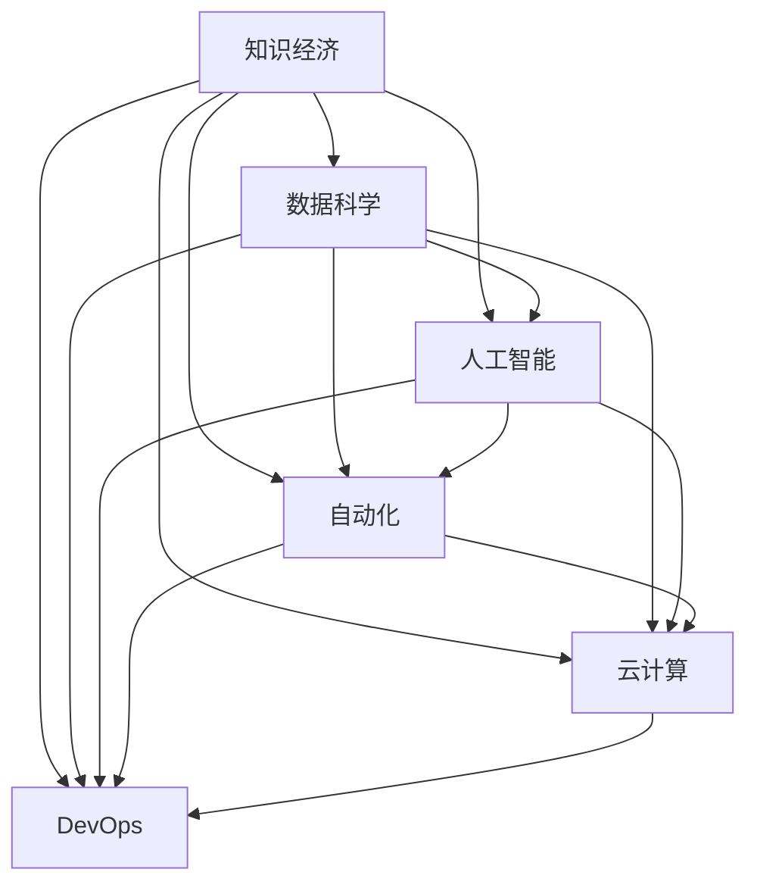

                 

# 程序员在知识经济时代的角色重塑

## 1. 背景介绍

### 1.1 问题由来
当前，全球正处在一场以知识为基础的经济转型期。科技进步尤其是信息技术的飞速发展，推动了数据、算法、计算资源的广泛应用，深刻改变了各行业的生产模式、运营方式和价值创造过程。程序员作为信息技术的核心创造者，其角色和定位也发生了根本性变化。从传统的代码编写、系统集成转向数据驱动、算法创新、智慧决策，程序员的工作重点和价值取向面临重塑。

### 1.2 问题核心关键点
在知识经济时代，程序员的角色不再局限于传统软件开发，而是扩展到数据分析、模型训练、智能决策等多个维度。数据和算法成为了新的生产要素，程序员需要具备处理海量数据、设计复杂算法、实现智慧决策的能力，以支撑企业对市场的快速响应和竞争力的提升。同时，随着开源技术的广泛应用，程序员也需要不断学习和掌握新的编程语言、开发工具和框架，持续提升自身技术水平和行业竞争力。

## 2. 核心概念与联系

### 2.1 核心概念概述

为更好地理解程序员在知识经济时代的角色重塑，本节将介绍几个密切相关的核心概念：

- 知识经济(Knowledge Economy)：以知识和信息为主要生产资料，利用信息技术进行生产和交易的经济形态。其中，程序员作为信息技术的核心创造者，承担着重要角色。
- 数据科学(Data Science)：结合统计学、计算机科学、数学和领域知识，通过数据处理和分析，提取有价值信息的过程。程序员需具备数据处理和算法设计能力。
- 人工智能(AI)：利用机器学习、深度学习等技术，使计算机具备人类智能特征。程序员需设计和优化算法模型，实现智能决策。
- 自动化(Automation)：通过编程实现机器、系统自动执行任务，提升效率和减少人为错误。程序员需掌握自动化编程技术。
- 云计算(Cloud Computing)：基于互联网提供计算资源和服务，实现数据存储、处理和共享。程序员需了解云计算架构和编程模型。
- DevOps：结合开发和运维，提升软件交付速度和质量。程序员需具备持续集成、持续交付的开发理念和实践。

这些核心概念之间的逻辑关系可以通过以下Mermaid流程图来展示：



这个流程图展示的核心概念及其之间的关系：

1. 知识经济以数据科学为基础，数据科学通过人工智能实现智能决策，自动化和云计算提供技术支持，DevOps提升交付效率。
2. 数据科学、人工智能、自动化、云计算、DevOps是知识经济中的关键技术环节，程序员在其中扮演核心角色。

## 3. 核心算法原理 & 具体操作步骤
### 3.1 算法原理概述

在知识经济时代，程序员的角色不仅仅是代码编写者，更应该是数据科学家、算法工程师和系统架构师。以下将从算法原理和操作步骤两个方面，介绍程序员在知识经济时代需要掌握的核心技能。

### 3.2 算法步骤详解

#### 3.2.1 数据处理与清洗
- 数据收集：从各个数据源（如数据库、API接口、文本文件等）收集数据，构建数据集。
- 数据清洗：处理缺失值、异常值和重复数据，进行数据去噪。
- 数据预处理：对数据进行标准化、归一化、编码等预处理操作，提升数据质量。

#### 3.2.2 数据探索与可视化
- 数据探索：使用统计方法、特征工程等手段，分析数据的基本统计特性和分布情况。
- 数据可视化：使用图表、仪表盘等形式，直观展示数据特征和趋势，辅助决策。

#### 3.2.3 算法模型设计
- 算法选择：根据数据特征和业务需求，选择合适的机器学习、深度学习或统计学习算法。
- 模型构建：使用编程语言和框架实现算法模型，进行模型训练和参数调优。
- 模型评估：使用交叉验证、ROC曲线、AUC等指标评估模型性能，确保模型泛化能力。

#### 3.2.4 系统集成与部署
- 系统设计：根据业务需求，设计系统的架构、接口和功能。
- 系统开发：使用编程语言和框架实现系统功能，进行前后端开发、数据库设计和接口集成。
- 系统部署：使用云计算平台部署系统，配置环境、监控运行状态，确保系统稳定运行。

#### 3.2.5 持续迭代与优化
- 数据反馈：收集系统运行反馈，识别数据和算法问题。
- 系统优化：根据反馈调整数据处理流程、算法模型参数，进行系统迭代优化。
- 版本控制：使用Git等工具管理代码版本，跟踪迭代历史，确保系统更新和维护。

### 3.3 算法优缺点

数据驱动的算法在提升决策效率和准确性方面具有显著优势，但也存在以下缺点：

1. 数据依赖性高：算法模型的效果高度依赖于数据质量和数据量，数据偏差可能导致模型输出错误。
2. 模型复杂度高：复杂算法模型的训练和调优需要大量计算资源和时间，难以实时响应。
3. 解释性不足：许多现代算法模型，如深度学习，具有"黑盒"特性，难以解释其决策过程。
4. 模型泛化能力有限：模型在特定数据集上的性能可能较好，但在新数据上的泛化能力较弱。
5. 对抗攻击风险：复杂模型容易受到对抗样本攻击，导致安全漏洞。

尽管存在这些局限性，但算法驱动的决策过程仍然是知识经济时代的重要方向。

### 3.4 算法应用领域

基于数据和算法的应用，程序员在多个领域展现了其核心价值：

- 金融科技：利用算法模型进行风险评估、信用评分、欺诈检测等。
- 医疗健康：通过数据分析和算法模型，实现疾病预测、治疗方案推荐、患者管理等。
- 物流仓储：应用算法优化路线规划、库存管理、配送调度等，提升运营效率。
- 智能制造：使用算法进行工艺优化、质量控制、设备维护等，实现智能化生产。
- 零售电商：基于用户行为数据和推荐算法，实现个性化推荐、需求预测、库存管理等。
- 智慧城市：应用算法优化交通管理、环境监测、能源分配等，构建智慧城市框架。

这些领域的应用场景，展示了程序员在知识经济时代的多元化价值。

## 4. 数学模型和公式 & 详细讲解  
### 4.1 数学模型构建

在本节中，我们将使用数学语言对数据处理和算法设计的基本过程进行严格描述。

假设我们有一组数据集 $D=\{(x_i,y_i)\}_{i=1}^N$，其中 $x_i$ 表示输入特征，$y_i$ 表示目标标签。我们的目标是设计一个模型 $f(x)$，使其在给定输入 $x$ 的情况下，能够准确预测目标标签 $y$。

1. 数据收集：从不同数据源收集数据，构建训练集 $D_{train}$ 和测试集 $D_{test}$。
2. 数据清洗：去除缺失值、异常值和重复数据，处理噪声数据。
3. 数据标准化：对特征进行标准化，确保不同特征在同一尺度下。
4. 特征选择：选择对模型有用的特征，构建特征向量 $x_i \in R^d$。
5. 模型训练：使用训练集 $D_{train}$，通过优化算法（如梯度下降）最小化损失函数 $L(f(x),y)$，优化模型参数。
6. 模型评估：使用测试集 $D_{test}$ 评估模型性能，计算准确率、召回率、F1分数等指标。

### 4.2 公式推导过程

以线性回归模型为例，推导最小二乘法损失函数及其梯度计算公式。

设模型为 $f(x)=wx+b$，其中 $w$ 为权重向量，$b$ 为偏置项。损失函数定义为：

$$
L(f(x),y) = \frac{1}{2N} \sum_{i=1}^N (y_i - f(x_i))^2
$$

求导得到梯度：

$$
\nabla_{\theta}L(f(x),y) = \frac{1}{N} \sum_{i=1}^N (y_i - f(x_i))(x_i)
$$

其中，$\theta = (w,b)$，$x_i$ 为输入特征，$y_i$ 为目标标签。

使用梯度下降算法，更新参数：

$$
\theta_{t+1} = \theta_t - \eta \nabla_{\theta}L(f(x),y)
$$

其中，$\eta$ 为学习率，$t$ 为迭代次数。

### 4.3 案例分析与讲解

假设我们需要使用线性回归模型预测房屋价格。给定历史房屋数据 $D=\{(x_i,y_i)\}_{i=1}^N$，其中 $x_i$ 为房屋面积、位置、年龄等特征，$y_i$ 为房屋价格。我们通过以下步骤实现模型训练和预测：

1. 数据收集：从房地产网站、政府数据库等渠道收集房屋数据，构建训练集 $D_{train}$ 和测试集 $D_{test}$。
2. 数据清洗：处理缺失值、异常值，去除重复数据。
3. 数据标准化：对房屋面积、位置、年龄等特征进行标准化处理。
4. 特征选择：选择对价格预测有用的特征，如房屋面积、地理位置等。
5. 模型训练：使用训练集 $D_{train}$，通过最小二乘法优化模型参数 $w$ 和 $b$，构建线性回归模型。
6. 模型评估：使用测试集 $D_{test}$ 评估模型性能，计算预测误差和准确率。
7. 模型应用：输入新的房屋数据 $x_i$，使用训练好的模型 $f(x)$ 预测房屋价格 $y_i$。

## 5. 项目实践：代码实例和详细解释说明
### 5.1 开发环境搭建

在进行项目实践前，我们需要准备好开发环境。以下是使用Python进行数据科学项目开发的典型环境配置流程：

1. 安装Anaconda：从官网下载并安装Anaconda，用于创建独立的Python环境。

2. 创建并激活虚拟环境：
```bash
conda create -n myenv python=3.8 
conda activate myenv
```

3. 安装常用的数据科学库：
```bash
conda install pandas numpy scikit-learn matplotlib seaborn jupyter notebook
```

4. 安装编程语言：
```bash
conda install python=3.8
```

5. 安装绘图工具：
```bash
conda install matplotlib seaborn
```

6. 安装机器学习库：
```bash
conda install scikit-learn
```

完成上述步骤后，即可在`myenv`环境中开始数据科学项目实践。

### 5.2 源代码详细实现

下面我们以房价预测项目为例，给出使用Python进行数据处理和线性回归模型训练的代码实现。

```python
import pandas as pd
from sklearn.model_selection import train_test_split
from sklearn.linear_model import LinearRegression
from sklearn.metrics import mean_squared_error

# 数据加载
data = pd.read_csv('house_prices.csv')
X = data[['area', 'location', 'age']]
y = data['price']

# 数据处理
X_train, X_test, y_train, y_test = train_test_split(X, y, test_size=0.2, random_state=42)

# 模型训练
model = LinearRegression()
model.fit(X_train, y_train)

# 模型评估
y_pred = model.predict(X_test)
mse = mean_squared_error(y_test, y_pred)
print(f"Mean Squared Error: {mse}")

# 模型应用
new_house = {'area': 2000, 'location': 'suburb', 'age': 5}
new_house_price = model.predict([new_house])
print(f"Predicted price for the new house: {new_house_price}")
```

在上述代码中，我们首先加载数据，然后使用Pandas进行数据预处理，接着使用Scikit-Learn进行模型训练和评估，最后进行模型应用。代码实现了从数据加载到模型应用的全流程，展示了Python在数据科学项目中的广泛应用。

### 5.3 代码解读与分析

让我们再详细解读一下关键代码的实现细节：

**数据加载**：
- 使用Pandas的`read_csv`函数加载CSV格式的数据文件。
- `pd.read_csv`可以自动解析CSV文件中的数据，并将其转换为Pandas DataFrame对象。

**数据处理**：
- 使用`train_test_split`函数将数据集分为训练集和测试集，其中`test_size`参数指定测试集占总数据集的比例，`random_state`参数指定随机数种子，确保每次运行代码时结果一致。
- `train_test_split`函数返回的四个数据集可以直接用于模型训练和评估。

**模型训练**：
- 使用Scikit-Learn的`LinearRegression`类定义线性回归模型。
- 使用`fit`方法对模型进行训练，输入训练集数据`X_train`和`y_train`。
- 训练完成后，模型已经学习了数据集中的线性关系，可以用于预测新的输入数据。

**模型评估**：
- 使用`mean_squared_error`函数计算模型在测试集上的均方误差。
- 均方误差（Mean Squared Error, MSE）是常用的回归模型评估指标，表示预测值与真实值之间的平均误差平方。
- 在实际应用中，我们可以根据具体任务选择合适的评估指标，如准确率、召回率、F1分数等。

**模型应用**：
- 定义新的房屋数据`new_house`，包含面积、位置和年龄三个特征。
- 使用`predict`方法对新的房屋数据进行预测，得到预测价格`new_house_price`。
- 在实际应用中，我们可以将预测结果用于投资决策、市场分析等多个场景，提升决策的科学性和准确性。

在实际项目中，Python的强大数据处理能力和丰富数据科学库，使得数据处理和模型训练变得简单高效。开发者可以将更多精力放在模型优化和应用场景设计上，而不必过多关注底层实现细节。

## 6. 实际应用场景
### 6.1 金融风险管理

在金融领域，数据驱动的决策过程是核心竞争力。通过数据处理和算法模型，金融机构可以实时监控市场动态，评估风险，制定投资策略，实现资产配置优化。

具体而言，数据科学和算法模型在金融风险管理中的应用包括：

- 信用评分：利用数据处理和机器学习算法，评估客户的信用风险，生成信用评分，辅助贷款决策。
- 欺诈检测：通过数据分析和模型训练，识别异常交易行为，实时检测欺诈行为，保护客户资产。
- 投资组合优化：使用数据科学和算法模型，优化投资组合配置，降低风险，提升收益。
- 市场预测：利用历史数据和机器学习算法，预测市场走势，辅助投资决策。

### 6.2 医疗健康管理

在医疗领域，数据驱动的决策过程同样至关重要。通过数据分析和算法模型，医疗机构可以实现疾病预测、治疗方案推荐、患者管理等，提升医疗服务质量和效率。

具体而言，数据科学和算法模型在医疗健康管理中的应用包括：

- 疾病预测：利用电子病历数据和机器学习算法，预测患者的疾病风险，早期干预。
- 治疗方案推荐：结合患者的病情数据和医学知识，推荐最佳治疗方案，提升治疗效果。
- 患者管理：通过数据分析和模型训练，管理患者的健康数据，提供个性化医疗服务。
- 医学研究：利用大数据和算法模型，进行医学研究，发现新的治疗方法和药物。

### 6.3 智能制造优化

在制造业，数据驱动的决策过程能够显著提升生产效率和产品质量。通过数据分析和算法模型，企业可以实现工艺优化、质量控制、设备维护等，实现智能化生产。

具体而言，数据科学和算法模型在智能制造优化中的应用包括：

- 工艺优化：利用生产数据和机器学习算法，优化生产工艺，提升产品质量。
- 质量控制：通过数据分析和模型训练，检测产品缺陷，实现质量控制。
- 设备维护：结合设备运行数据和算法模型，预测设备故障，提前维护。
- 供应链管理：利用数据科学和算法模型，优化供应链管理，提升供应链效率。

### 6.4 未来应用展望

随着数据科学和算法模型的不断发展，未来数据驱动的决策过程将在更多领域得到应用，为各行各业带来变革性影响。

在智慧城市治理中，数据科学和算法模型可以优化城市资源分配、提升城市运行效率，构建更安全、高效、可持续的城市系统。

在农业生产中，数据科学和算法模型可以优化种植方案、提高作物产量，实现农业智能化管理。

在教育领域，数据科学和算法模型可以个性化推荐学习内容、优化教学方案，提升教育质量。

在智能家居中，数据科学和算法模型可以实现智能化家居管理，提升用户体验和生活质量。

## 7. 工具和资源推荐
### 7.1 学习资源推荐

为了帮助开发者系统掌握数据科学和算法设计的基本技能，这里推荐一些优质的学习资源：

1. 《Python数据科学手册》系列书籍：深入浅出地介绍了Python在数据科学中的各种应用，包括数据处理、可视化、机器学习等。
2. Kaggle在线平台：提供丰富的数据集和竞赛项目，帮助开发者实践数据科学技能，积累经验。
3. Coursera《数据科学与机器学习》课程：斯坦福大学开设的精品课程，涵盖数据科学、机器学习等基础和高级内容。
4. Udacity《数据科学家纳米学位》课程：提供系统化的数据科学学习路径，涵盖数据处理、模型训练、项目实践等。
5. O'Reilly《Python数据科学实战》书籍：实战性强，涵盖数据分析、机器学习、深度学习等多个领域的编程实践。

通过对这些资源的学习实践，相信你一定能够系统掌握数据科学和算法设计的精髓，并用于解决实际的业务问题。

### 7.2 开发工具推荐

高效的开发离不开优秀的工具支持。以下是几款用于数据科学项目开发的常用工具：

1. Jupyter Notebook：支持多种编程语言，实现代码单元格、图表、数学公式等的混合显示，方便开发者进行数据分析、模型训练和结果展示。
2. Visual Studio Code：轻量级、功能强大的代码编辑器，支持丰富的插件和扩展，提升开发效率。
3. PyCharm：专业级的Python开发工具，提供代码调试、版本控制、数据可视化等功能，助力开发者快速开发和调试数据科学项目。
4. RStudio：专注于R语言的开发环境，提供丰富的数据分析和可视化功能，适合R语言开发者使用。
5. Tableau：数据可视化工具，支持多种数据源，提供丰富的可视化图表和报表，帮助用户理解数据。
6. Apache Spark：大数据计算框架，提供高效的数据处理和分布式计算能力，适合大规模数据处理和分析任务。

合理利用这些工具，可以显著提升数据科学项目开发效率，加快创新迭代的步伐。

### 7.3 相关论文推荐

数据科学和算法设计的研究源于学界的持续研究。以下是几篇奠基性的相关论文，推荐阅读：

1. Deep Learning：Ian Goodfellow等人撰写，介绍深度学习的基本原理和应用。
2. Scikit-learn用户手册：Scikit-learn开发团队撰写，详细介绍了机器学习库的使用方法和最佳实践。
3. TensorFlow官方文档：TensorFlow团队撰写，提供深度学习框架的详细使用指南和案例。
4. Keras官方文档：Keras团队撰写，提供深度学习框架的使用指南和案例，适合初学者使用。
5. PyTorch官方文档：PyTorch团队撰写，提供深度学习框架的使用指南和案例，支持动态计算图。

这些论文代表了大数据和算法设计的研究方向，通过学习这些前沿成果，可以帮助研究者把握学科前进方向，激发更多的创新灵感。

## 8. 总结：未来发展趋势与挑战
### 8.1 总结

本文对程序员在知识经济时代的角色重塑进行了全面系统的介绍。首先阐述了知识经济对程序员角色和定位的根本性变化，明确了程序员需要掌握数据科学和算法设计的核心技能。其次，从算法原理和操作步骤两个方面，详细讲解了数据处理、模型训练、系统集成的全流程，提供了系统化的代码实现示例。同时，本文还广泛探讨了数据科学和算法设计在金融、医疗、制造等多个领域的应用前景，展示了其广阔的应用空间。

通过本文的系统梳理，可以看到，数据驱动的决策过程已经成为知识经济时代的重要方向，程序员在其中扮演了关键角色。数据科学和算法设计的不断发展，必将带来更多创新应用，推动人工智能技术的落地实践。

### 8.2 未来发展趋势

展望未来，数据科学和算法设计将呈现以下几个发展趋势：

1. 自动化程度提高：数据处理和算法模型将越来越多地采用自动化技术，减少人工干预，提高效率和准确性。
2. 跨领域应用拓展：数据科学和算法设计将越来越多地应用于金融、医疗、制造等多个领域，带来更多创新应用。
3. 多模态数据融合：未来数据处理和算法模型将更多地融合多模态数据，提升数据的多样性和丰富度。
4. 人工智能融合：数据科学和算法设计将与人工智能技术深度融合，实现更智能、更高效的决策过程。
5. 持续学习与优化：数据科学和算法模型将实现持续学习，不断优化模型性能，适应数据分布的变化。
6. 模型解释与可控性提升：未来的数据科学和算法模型将更多地考虑模型解释性和可控性，确保算法的透明性和可靠性。

以上趋势凸显了数据科学和算法设计的发展方向，程序员需要不断学习和掌握新的技术，提升自身的综合素质和竞争力。

### 8.3 面临的挑战

尽管数据科学和算法设计已经取得了瞩目成就，但在迈向更加智能化、普适化应用的过程中，仍然面临诸多挑战：

1. 数据隐私与安全：数据科学和算法设计高度依赖数据，数据的隐私和安全问题将受到越来越多的关注。
2. 模型公平性与偏见：数据和算法模型可能存在偏见，导致不公平的决策结果，需要从数据源和模型设计两个层面进行改进。
3. 模型复杂性管理：复杂的数据科学和算法模型难以解释和维护，需要更多的自动化工具和优化方法。
4. 数据质量与治理：数据的质量和治理问题对模型性能影响巨大，需要构建完善的数据治理机制。
5. 模型泛化能力提升：模型在特定数据集上表现良好，但在新数据上的泛化能力有限，需要更多数据增强和迁移学习技术。
6. 资源优化与成本控制：数据科学和算法模型对计算资源的需求较高，需要优化模型结构和计算过程，降低成本。

正视数据科学和算法设计面临的这些挑战，积极应对并寻求突破，将是大数据和算法设计走向成熟的必由之路。

### 8.4 研究展望

面对数据科学和算法设计所面临的种种挑战，未来的研究需要在以下几个方面寻求新的突破：

1. 探索自动化的数据处理和模型训练方法。开发更多的自动化工具和算法，减少人工干预，提升效率和准确性。
2. 研究跨领域的数据融合与知识迁移。开发跨领域数据融合技术，实现多模态数据的协同建模和知识迁移。
3. 引入因果推理与决策理论。将因果推理和决策理论引入数据科学和算法设计，增强模型的解释性和可控性。
4. 融合符号化知识与人工智能技术。将符号化知识与人工智能技术深度融合，提升模型的智能性和鲁棒性。
5. 纳入伦理道德约束。在数据科学和算法设计目标中引入伦理导向的评估指标，确保算法的透明性和公平性。

这些研究方向将引领数据科学和算法设计走向更高的台阶，为构建安全、可靠、可解释、可控的智能系统铺平道路。面向未来，数据科学和算法设计还需要与其他人工智能技术进行更深入的融合，如知识表示、因果推理、强化学习等，多路径协同发力，共同推动自然语言理解和智能交互系统的进步。只有勇于创新、敢于突破，才能不断拓展数据科学和算法设计的边界，让智能技术更好地造福人类社会。

## 9. 附录：常见问题与解答

**Q1：数据科学和算法设计如何确保模型的公平性与偏见？**

A: 确保模型的公平性与偏见，需要从数据源和模型设计两个层面进行改进：

1. 数据源：选择合适的数据源，避免数据偏见。
2. 数据预处理：去除数据中的偏见项，如性别、种族等。
3. 特征选择：选择对决策有用的特征，避免无关特征对决策的影响。
4. 模型设计：引入公平性约束，确保模型对不同群体的输出一致。
5. 模型评估：评估模型在公平性指标上的表现，如DEAP（Demographic Equality of Prediction）等。

通过以上方法，可以显著提升数据科学和算法模型的公平性与偏见，减少对特定群体的歧视性输出。

**Q2：数据科学和算法设计如何实现自动化？**

A: 实现数据科学和算法设计的自动化，需要以下方法：

1. 自动化数据预处理：使用数据清洗、标准化、特征工程等工具，自动处理数据。
2. 自动化模型训练：使用自动化机器学习工具，如AutoML，自动选择算法和调参。
3. 自动化模型评估：使用自动化评估工具，自动计算模型指标，生成评估报告。
4. 自动化模型部署：使用自动化部署工具，自动部署模型到生产环境。
5. 自动化监控与调优：使用自动化监控工具，实时监控模型运行状态，自动调优模型参数。

这些自动化方法可以提高数据科学和算法设计的效率和准确性，让程序员从繁琐的手动操作中解放出来，专注于模型设计和应用创新。

**Q3：数据科学和算法设计如何提高模型的解释性和可控性？**

A: 提高模型的解释性和可控性，需要以下方法：

1. 模型简化：尽量使用简单的模型，减少模型复杂度。
2. 模型可视化：使用可视化工具，如Shap值、LIME等，解释模型决策过程。
3. 模型规则化：引入规则和约束，增强模型的可解释性。
4. 模型透明化：保证模型设计、训练、评估等各个环节的透明性，便于理解和调试。
5. 模型伦理化：在模型设计中引入伦理导向的评估指标，确保模型的透明性和公平性。

这些方法可以提高数据科学和算法模型的解释性和可控性，增强模型的透明度和可靠性。

**Q4：数据科学和算法设计如何处理多模态数据？**

A: 处理多模态数据，需要以下方法：

1. 数据融合：将不同模态的数据融合到一个统一的空间中，形成多模态数据集。
2. 特征提取：从不同模态的数据中提取有意义的特征，并进行特征融合。
3. 模型融合：将不同的单模态模型融合到多模态模型中，提升模型性能。
4. 数据增强：通过数据增强技术，提高多模态数据的丰富性和多样性。
5. 联合训练：将多模态数据集输入到联合训练模型中，提升模型的泛化能力。

这些方法可以提高数据科学和算法模型处理多模态数据的能力，提升模型的准确性和鲁棒性。

**Q5：数据科学和算法设计如何优化模型性能？**

A: 优化模型性能，需要以下方法：

1. 数据增强：通过数据增强技术，提高数据的多样性和丰富性。
2. 模型选择：选择合适的算法模型，根据数据特征和任务需求，选择最优模型。
3. 模型调优：使用自动化调参工具，优化模型参数，提升模型性能。
4. 模型融合：将不同的单模态模型融合到多模态模型中，提升模型泛化能力。
5. 模型集成：使用集成学习技术，将多个模型组合成一个综合模型，提升模型性能。

这些方法可以显著提升数据科学和算法模型的性能，实现更高效、更准确的决策。

---

作者：禅与计算机程序设计艺术 / Zen and the Art of Computer Programming

