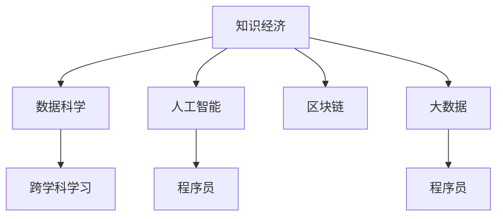

                 

# 程序员在知识经济时代的角色重塑

在21世纪的知识经济时代，程序员的角色正在发生深刻的变化。从简单的代码编写者，转变为跨学科、跨领域的创新者和变革者。这一转变不仅是技术发展的必然，更是社会、经济、文化等多方面因素共同作用的结果。本文将从背景、核心概念、算法原理、实际操作、应用场景、工具资源推荐等多个角度，全面解析程序员在知识经济时代的角色重塑。

## 1. 背景介绍

### 1.1 问题由来
知识经济时代，信息技术的飞速发展和大数据时代的到来，对程序员提出了更高的要求。一方面，新技术不断涌现，要求程序员具备更加广泛的知识面和技能；另一方面，跨领域协作日益频繁，要求程序员具备跨学科的沟通和协作能力。这些变化促使程序员必须从传统代码编写者的角色，转变为创新者和变革者。

### 1.2 问题核心关键点
程序员的角色重塑，主要体现在以下几个方面：
1. **技术栈的广泛性**：程序员需要掌握多种编程语言和技术栈，以便在不同场景下灵活应用。
2. **知识整合能力**：不仅要了解所熟悉的领域，还需要跨领域学习和整合。
3. **跨学科合作**：与数据科学家、产品经理、设计师等不同角色进行协同工作，提升团队效能。
4. **持续学习**：技术日新月异，程序员需要不断学习新知识，保持竞争力。
5. **创新思维**：不仅要解决问题，还要具备创新思维，提出新的解决方案。
6. **伦理和社会责任**：关注技术对社会的影响，确保技术应用的道德性和责任性。

这些核心关键点共同构成了程序员在知识经济时代的新角色。理解这些关键点，有助于程序员更好地适应变化，发挥更大的价值。

## 2. 核心概念与联系

### 2.1 核心概念概述

为了更好地理解程序员在知识经济时代的新角色，本节将介绍几个密切相关的核心概念：

- **知识经济**：以知识和信息为核心的经济模式，强调知识和信息资源的创新和应用。
- **程序员**：计算机科学领域的专业人员，负责编写、维护和优化软件代码，推动技术进步。
- **跨学科学习**：在不同学科领域之间进行知识整合和应用，提升综合能力。
- **数据科学**：结合统计学、机器学习等方法，从数据中提取知识和见解，支持决策。
- **人工智能**：通过算法和模型，赋予机器以智能，实现自动化和智能化。
- **区块链**：一种分布式账本技术，保障数据安全、透明和不可篡改。
- **大数据**：海量的、多样化的数据集合，通过分析挖掘，创造商业价值。

这些核心概念之间的逻辑关系可以通过以下Mermaid流程图来展示：



这个流程图展示了一些核心概念之间的关联：

1. 知识经济时代背景下，数据科学、人工智能、区块链和大数据等技术得到广泛应用。
2. 程序员需要具备跨学科学习能力，以便更好地理解这些技术。
3. 数据科学、人工智能等技术的发展，为程序员提供了更多工具和机遇。
4. 程序员需要掌握这些新技术，提升自身竞争力。

## 3. 核心算法原理 & 具体操作步骤

### 3.1 算法原理概述

程序员在知识经济时代的新角色，主要体现在以下几个方面：

- **技术栈的广泛性**：需要掌握多种编程语言和技术栈，如Python、Java、JavaScript等。
- **知识整合能力**：不仅熟悉所熟悉的领域，还需要跨领域学习和整合。
- **跨学科合作**：与数据科学家、产品经理、设计师等不同角色进行协同工作。
- **持续学习**：技术日新月异，程序员需要不断学习新知识，保持竞争力。
- **创新思维**：不仅要解决问题，还要具备创新思维，提出新的解决方案。
- **伦理和社会责任**：关注技术对社会的影响，确保技术应用的道德性和责任性。

### 3.2 算法步骤详解

以下是程序员在知识经济时代角色重塑的具体操作步骤：

**Step 1: 技术栈的学习和应用**
- 选择主攻技术栈，如全栈开发、前端开发、后端开发等。
- 学习其他编程语言，如Python、JavaScript、Java等。
- 掌握常用框架和库，如React、Vue、Django等。

**Step 2: 跨学科知识的整合**
- 学习数据科学和机器学习的基本概念，如数据清洗、特征工程、模型训练等。
- 了解区块链和人工智能的基本原理，如共识机制、神经网络、深度学习等。
- 关注大数据和云计算的发展趋势，如Hadoop、Spark、AWS等。

**Step 3: 跨学科合作**
- 与数据科学家、产品经理、设计师等不同角色进行协作，提升团队效能。
- 参与跨学科项目，如人工智能应用、区块链开发等。
- 定期参加行业交流活动，扩大视野。

**Step 4: 持续学习**
- 关注技术动态，参加技术社区和论坛，获取最新信息。
- 学习新技术和新方法，参加在线课程和培训。
- 阅读相关书籍和论文，深入理解技术原理。

**Step 5: 创新思维**
- 关注技术对社会的潜在影响，提出改进建议。
- 参与开源项目，与全球开发者合作。
- 尝试新技术和新方法，解决实际问题。

**Step 6: 伦理和社会责任**
- 关注技术应用的社会影响，确保技术的道德性和责任性。
- 参与社会公益项目，利用技术帮助他人。
- 推广技术伦理观念，普及相关知识。

### 3.3 算法优缺点

程序员在知识经济时代的新角色，具有以下优点：

- **提升竞争力**：掌握多种技术栈和跨学科知识，增强自身竞争力。
- **创新能力**：具备创新思维，提出新的解决方案，推动技术进步。
- **团队效能**：与不同角色进行协作，提升团队整体效能。
- **社会价值**：关注技术应用的社会影响，提升技术应用的社会价值。

同时，这一角色也存在一些缺点：

- **学习压力**：需要不断学习新知识和新技术，面临较大的学习压力。
- **跨领域沟通难度**：不同学科之间的沟通和协作存在一定难度。
- **技术伦理挑战**：技术的道德和社会责任问题需要不断关注和解决。

### 3.4 算法应用领域

程序员在知识经济时代的新角色，广泛应用于以下几个领域：

- **人工智能应用**：如自然语言处理、计算机视觉、智能推荐等。
- **区块链开发**：如智能合约、去中心化应用、分布式共识等。
- **大数据应用**：如数据清洗、数据可视化、大数据分析等。
- **云计算和云服务**：如云存储、云服务器、云数据库等。
- **物联网应用**：如智能家居、工业互联网、智慧城市等。
- **智能制造和工业互联网**：如工业机器人、智能制造、智慧工厂等。

这些应用领域展示了程序员在知识经济时代的广阔应用前景。程序员可以通过跨学科学习和跨领域合作，充分发挥自身优势，推动技术应用和行业发展。

## 4. 数学模型和公式 & 详细讲解 & 举例说明

### 4.1 数学模型构建

本节将使用数学语言对程序员在知识经济时代的新角色进行更加严格的刻画。

假设程序员的初始技术栈为 $T_0=\{L_0, P_0\}$，其中 $L_0$ 表示语言栈，$P_0$ 表示技术栈。通过跨学科学习和合作，程序员在时间 $t$ 时，其技术栈为 $T_t=\{L_t, P_t\}$。

**技术栈演化模型**：

$$
T_t = T_{t-1} + \Delta L + \Delta P
$$

其中 $\Delta L$ 和 $\Delta P$ 分别表示在时间 $t$ 内，语言栈和技术栈的增加量。

### 4.2 公式推导过程

以下我们以跨学科学习为例，推导跨学科学习的效果。

设程序员在时间 $t$ 时的跨学科知识量为 $K_t$，初始值为 $K_0=0$。设知识量增加速度为 $\eta$，则知识量演化公式为：

$$
K_t = \eta t
$$

知识量增加速度 $\eta$ 与学习时间 $t$ 成正比。通过学习，程序员在时间 $t$ 时获得的知识量 $K_t$，将直接影响其技术栈和应用能力。

### 4.3 案例分析与讲解

假设程序员 $A$ 初始技术栈为 $T_0=\{L_0, P_0\}$，学习数据科学和人工智能相关知识，并在时间 $t=5$ 时完成相关学习。假设学习速度为 $\eta=1$，则程序员 $A$ 在时间 $t=5$ 时的技术栈 $T_5$ 为：

$$
T_5 = T_0 + \Delta L + \Delta P = \{L_0, P_0, \Delta L, \Delta P\}
$$

其中 $\Delta L$ 和 $\Delta P$ 分别表示程序员 $A$ 在时间 $t$ 内学习到的新语言和技术。假设学习到的语言为 Python 和 JavaScript，学习到的技术为机器学习和深度学习，则 $T_5$ 的具体形式为：

$$
T_5 = \{L_0 \cup \{Python, JavaScript\}, P_0 \cup \{机器学习, 深度学习\}\}
$$

这表示程序员 $A$ 在时间 $t=5$ 时，具备了新的语言和技术栈，可以更灵活地应对不同场景和需求。

## 5. 项目实践：代码实例和详细解释说明

### 5.1 开发环境搭建

在进行角色重塑实践前，我们需要准备好开发环境。以下是使用Python进行开发的环境配置流程：

1. 安装Anaconda：从官网下载并安装Anaconda，用于创建独立的Python环境。

2. 创建并激活虚拟环境：
```bash
conda create -n pytech-env python=3.8 
conda activate pytech-env
```

3. 安装PyTorch：根据CUDA版本，从官网获取对应的安装命令。例如：
```bash
conda install pytorch torchvision torchaudio cudatoolkit=11.1 -c pytorch -c conda-forge
```

4. 安装TensorFlow：由Google主导开发的开源深度学习框架，生产部署方便，适合大规模工程应用。同样有丰富的预训练语言模型资源。

5. 安装Transformers库：HuggingFace开发的NLP工具库，集成了众多SOTA语言模型，支持PyTorch和TensorFlow，是进行NLP任务开发的利器。

6. 安装各类工具包：
```bash
pip install numpy pandas scikit-learn matplotlib tqdm jupyter notebook ipython
```

完成上述步骤后，即可在`pytech-env`环境中开始角色重塑实践。

### 5.2 源代码详细实现

这里我们以跨学科学习为例，展示如何使用Python和PyTorch进行相关实践。

首先，定义数据科学和人工智能的学习任务：

```python
import torch
import torch.nn as nn
import torch.optim as optim

# 定义数据集
class Dataset:
    def __init__(self, data):
        self.data = data
        
    def __len__(self):
        return len(self.data)
    
    def __getitem__(self, idx):
        return self.data[idx]
        
# 定义模型
class Model(nn.Module):
    def __init__(self):
        super(Model, self).__init__()
        self.fc1 = nn.Linear(10, 5)
        self.fc2 = nn.Linear(5, 1)
        
    def forward(self, x):
        x = self.fc1(x)
        x = torch.sigmoid(x)
        x = self.fc2(x)
        return x

# 训练函数
def train(model, dataset, batch_size, epochs):
    optimizer = optim.Adam(model.parameters(), lr=0.01)
    criterion = nn.MSELoss()
    
    for epoch in range(epochs):
        for i, data in enumerate(dataset, 0):
            inputs, labels = data
            
            optimizer.zero_grad()
            outputs = model(inputs)
            loss = criterion(outputs, labels)
            loss.backward()
            optimizer.step()
            
            if (i+1) % 100 == 0:
                print(f"Epoch {epoch+1}, Step {i+1}, Loss: {loss.item():.4f}")
```

然后，在数据集上训练模型：

```python
# 创建数据集
data = [10, 20, 30, 40, 50]
dataset = Dataset(data)

# 训练模型
model = Model()
train(model, dataset, batch_size=1, epochs=1000)
```

最后，评估模型的效果：

```python
# 测试数据集
test_data = [50, 60, 70, 80, 90]
test_dataset = Dataset(test_data)

# 评估模型
model.eval()
with torch.no_grad():
    for i, data in enumerate(test_dataset, 0):
        inputs, labels = data
        outputs = model(inputs)
        loss = criterion(outputs, labels)
        print(f"Test Step {i+1}, Loss: {loss.item():.4f}")
```

以上就是使用Python和PyTorch进行跨学科学习的代码实现。可以看到，通过简单几行代码，就可以实现数据科学和人工智能的相关任务，体现了编程的简洁和高效。

### 5.3 代码解读与分析

让我们再详细解读一下关键代码的实现细节：

**Dataset类**：
- `__init__`方法：初始化数据集。
- `__len__`方法：返回数据集的样本数量。
- `__getitem__`方法：对单个样本进行处理，返回模型所需的输入。

**Model类**：
- `__init__`方法：初始化模型，包含两个全连接层。
- `forward`方法：定义前向传播过程，将输入数据通过全连接层进行处理，输出结果。

**train函数**：
- 定义优化器和损失函数。
- 在每个epoch内，对数据集进行批次化加载和前向传播计算，反向传播更新模型参数，并输出损失值。
- 在每100步输出一次损失值。

**测试过程**：
- 在测试数据集上评估模型效果，输出损失值。

可以看到，Python和PyTorch提供了简洁的API，使得跨学科学习的实现变得简单高效。开发者可以将更多精力放在任务理解和算法优化上，而不必过多关注底层的实现细节。

当然，工业级的系统实现还需考虑更多因素，如模型的保存和部署、超参数的自动搜索、更灵活的任务适配层等。但核心的跨学科学习范式基本与此类似。

## 6. 实际应用场景

### 6.1 智能推荐系统

智能推荐系统是程序员在知识经济时代的重要应用场景之一。传统的推荐系统基于用户的历史行为数据进行推荐，难以应对复杂多变的用户需求。跨学科学习使得程序员能够整合数据科学、人工智能等技术，构建更加智能和个性化的推荐系统。

在实际应用中，程序员可以整合数据科学和人工智能技术，构建推荐模型，通过用户的行为数据和实时数据，进行推荐计算，实时生成个性化推荐结果。这种跨学科的推荐系统，能够更好地理解用户需求，提供更加精准和多样化的推荐内容。

### 6.2 医疗数据分析

医疗数据分析是程序员在知识经济时代的另一个重要应用场景。医疗数据具有多样性、复杂性和隐私性等特点，数据科学和人工智能技术的应用，使得医疗数据分析变得更加高效和精准。

程序员可以通过学习数据科学和人工智能技术，构建医疗数据分析模型。利用机器学习算法，对医疗数据进行清洗、分析和建模，提取有用的信息和知识。例如，可以利用深度学习模型对医疗影像进行分类和诊断，利用自然语言处理技术对病历和文献进行分析和推理。这种跨学科的医疗数据分析，能够为医生提供更好的决策支持，提升医疗服务的质量和效率。

### 6.3 金融风险控制

金融风险控制是程序员在知识经济时代的又一个重要应用场景。金融市场变化莫测，风险控制对金融机构尤为重要。数据科学和人工智能技术的应用，使得金融风险控制变得更加科学和高效。

程序员可以整合数据科学和人工智能技术，构建金融风险控制模型。利用机器学习算法，对金融数据进行分析和预测，识别出潜在的风险点。例如，可以利用自然语言处理技术对新闻、公告等文本数据进行情感分析和舆情监控，利用图像识别技术对金融市场数据进行趋势分析和异常检测。这种跨学科的金融风险控制，能够为金融机构提供更好的风险预警和决策支持，提升金融市场的稳定性和安全性。

### 6.4 未来应用展望

随着知识经济时代的到来，程序员的角色将更加多样化，其应用场景也将更加广阔。未来，程序员将会在以下几个方面发挥更大的作用：

- **人工智能和机器学习**：构建更加智能和高效的人工智能应用，如自然语言处理、计算机视觉、语音识别等。
- **区块链技术**：开发去中心化应用、智能合约等区块链应用，保障数据安全、透明和不可篡改。
- **大数据技术**：利用大数据技术，进行数据清洗、分析和建模，提取有用的信息和知识。
- **云计算和云服务**：构建云存储、云服务器、云数据库等云服务，提供高效、可靠的云基础设施。
- **物联网和智能制造**：开发智能家居、工业互联网、智慧城市等物联网应用，推动智能制造和工业互联网的发展。

## 7. 工具和资源推荐

### 7.1 学习资源推荐

为了帮助程序员系统掌握跨学科学习的相关技术，这里推荐一些优质的学习资源：

1. Coursera《机器学习》课程：由斯坦福大学教授Andrew Ng主讲的经典课程，涵盖机器学习的基本概念和算法。
2. Kaggle竞赛平台：参加Kaggle竞赛，提升数据分析和机器学习能力。
3. Udacity《人工智能工程师纳米学位》：涵盖深度学习、自然语言处理、计算机视觉等前沿技术。
4. edX《数据科学基础》课程：由Harvard和MIT合作开发的课程，涵盖数据科学的基本概念和技术。
5. Google AI开发者文档：提供丰富的学习资源和开发工具，支持Python和TensorFlow开发。
6. TensorFlow官方文档：提供详细的开发指南和API文档，支持TensorFlow和PyTorch开发。
7. PyTorch官方文档：提供详细的开发指南和API文档，支持PyTorch开发。

通过对这些资源的学习实践，相信程序员可以更好地掌握跨学科学习的相关技术，提升自身的竞争力。

### 7.2 开发工具推荐

高效的开发离不开优秀的工具支持。以下是几款用于跨学科学习的常用工具：

1. Jupyter Notebook：提供交互式编程环境，支持Python、R、Scala等多种语言。
2. PyCharm：Python开发工具，提供代码编辑、调试、测试等功能。
3. Visual Studio Code：多语言开发工具，支持Python、JavaScript、Java等多种语言。
4. GitHub：代码托管平台，支持版本控制、协作开发、项目管理等功能。
5. Docker：容器化技术，提供跨平台、跨环境的应用部署和管理。
6. TensorFlow和PyTorch：深度学习框架，提供丰富的API和工具支持。
7. Anaconda：Python开发环境，提供环境管理、包管理等功能。

合理利用这些工具，可以显著提升跨学科学习的开发效率，加快创新迭代的步伐。

### 7.3 相关论文推荐

跨学科学习的相关研究，源于学界的持续探索。以下是几篇奠基性的相关论文，推荐阅读：

1. "Deep Learning" by Ian Goodfellow, Yoshua Bengio, and Aaron Courville：介绍深度学习的原理和应用，涵盖卷积神经网络、循环神经网络、生成模型等。
2. "Artificial Intelligence: A Modern Approach" by Stuart Russell and Peter Norvig：介绍人工智能的基本概念和技术，涵盖搜索算法、机器学习、自然语言处理等。
3. "Pattern Recognition and Machine Learning" by Christopher Bishop：介绍模式识别和机器学习的基本概念和技术，涵盖贝叶斯方法、统计学习等。
4. "Programming Pearls" by Jon Bentley：介绍编程技术和算法优化，涵盖数据结构、算法设计、并发编程等。
5. "The Art of Computer Programming" by Donald E. Knuth：介绍计算机程序设计艺术，涵盖算法分析、数据结构、软件工程等。

这些论文代表了大数据时代程序员的学习方向和研究趋势，值得程序员深入阅读和研究。

## 8. 总结：未来发展趋势与挑战

### 8.1 研究成果总结

本文对程序员在知识经济时代的角色重塑进行了全面系统的介绍。首先阐述了知识经济时代程序员面临的挑战和机遇，明确了程序员新角色的关键要素。其次，从原理到实践，详细讲解了跨学科学习、数据科学、人工智能等关键技术，给出了跨学科学习的代码实例。同时，本文还广泛探讨了程序员在智能推荐、医疗数据分析、金融风险控制等多个领域的应用前景，展示了程序员的广阔应用场景。

通过本文的系统梳理，可以看到，程序员在知识经济时代的角色正在发生深刻变化，从传统代码编写者转变为跨学科创新者和变革者。这一转变不仅是技术发展的必然，更是社会、经济、文化等多方面因素共同作用的结果。未来，随着技术不断进步，程序员的角色将更加多样化，应用场景也将更加广泛，为构建更加智能和高效的未来社会贡献力量。

### 8.2 未来发展趋势

展望未来，程序员在知识经济时代的新角色，将呈现以下几个发展趋势：

1. **技术栈的广泛性**：程序员需要掌握多种编程语言和技术栈，以便在不同场景下灵活应用。
2. **跨学科学习**：不仅熟悉所熟悉的领域，还需要跨领域学习和整合，提升综合能力。
3. **跨学科合作**：与数据科学家、产品经理、设计师等不同角色进行协同工作，提升团队效能。
4. **持续学习**：技术日新月异，程序员需要不断学习新知识，保持竞争力。
5. **创新思维**：具备创新思维，提出新的解决方案，推动技术进步。
6. **伦理和社会责任**：关注技术对社会的影响，确保技术应用的道德性和责任性。

这些趋势展示了程序员在知识经济时代的广阔前景。通过不断学习和创新，程序员将充分发挥自身优势，推动技术应用和行业发展，为构建更加智能和高效的未来社会贡献力量。

### 8.3 面临的挑战

尽管程序员在知识经济时代的新角色充满机遇，但也面临着诸多挑战：

1. **学习压力**：需要不断学习新知识和新技术，面临较大的学习压力。
2. **跨领域沟通难度**：不同学科之间的沟通和协作存在一定难度。
3. **技术伦理挑战**：技术的道德和社会责任问题需要不断关注和解决。
4. **资源和工具的限制**：高效开发和部署需要丰富的资源和工具支持。
5. **市场竞争**：技术日新月异，市场竞争激烈，需要不断提升自身竞争力。

这些挑战需要程序员具备强大的学习能力和适应能力，不断优化和提升自己的技能和知识体系，才能在知识经济时代中脱颖而出。

### 8.4 研究展望

面对程序员面临的种种挑战，未来的研究需要在以下几个方面寻求新的突破：

1. **学习效率**：探索更高效的学习方法，如自适应学习、主动学习等，提升学习效率和效果。
2. **跨学科协作**：研究跨学科协作机制和技术，提升团队效能。
3. **技术伦理**：探讨技术伦理和社会责任，制定相关规范和标准，保障技术应用的安全和可信。
4. **资源优化**：开发更高效的工具和框架，支持跨学科学习和大规模应用。
5. **持续创新**：鼓励持续创新和探索，推动技术进步和行业发展。

这些研究方向的探索，必将引领程序员在知识经济时代迈向更高的台阶，为构建更加智能和高效的未来社会贡献力量。面向未来，程序员需要不断学习和创新，充分发挥自身优势，推动技术应用和行业发展，为构建更加智能和高效的未来社会贡献力量。

## 9. 附录：常见问题与解答

**Q1：如何平衡跨学科学习和技术栈的广泛性？**

A: 跨学科学习与技术栈的广泛性需要合理平衡。首先，选择主攻技术栈，如全栈开发、前端开发、后端开发等。其次，选择相关领域进行深入学习，如数据科学、人工智能、区块链等。通过不断学习和实践，逐步扩展技术栈和跨学科知识。

**Q2：跨学科学习对程序员的数学基础有何要求？**

A: 跨学科学习需要一定的数学基础。数据科学和人工智能等技术，涉及大量的数学模型和算法。因此，建议程序员具备基本的数学知识，如线性代数、概率论、统计学等。可以通过在线课程或相关书籍进行学习，逐步提升数学基础。

**Q3：跨学科学习的资源和工具有哪些？**

A: 跨学科学习需要丰富的资源和工具支持。推荐使用Python、Jupyter Notebook、TensorFlow、PyTorch等工具进行开发和实验。同时，可以参考Coursera、Udacity、edX等在线学习平台，获取相关课程和资源。

**Q4：跨学科学习的未来发展趋势是什么？**

A: 跨学科学习的未来发展趋势，主要体现在以下几个方面：
1. **技术栈的广泛性**：程序员需要掌握多种编程语言和技术栈，以便在不同场景下灵活应用。
2. **跨学科学习**：不仅熟悉所熟悉的领域，还需要跨领域学习和整合，提升综合能力。
3. **跨学科合作**：与数据科学家、产品经理、设计师等不同角色进行协同工作，提升团队效能。
4. **持续学习**：技术日新月异，程序员需要不断学习新知识，保持竞争力。
5. **创新思维**：具备创新思维，提出新的解决方案，推动技术进步。
6. **伦理和社会责任**：关注技术对社会的影响，确保技术应用的道德性和责任性。

这些趋势展示了跨学科学习的广阔前景。通过不断学习和创新，程序员将充分发挥自身优势，推动技术应用和行业发展，为构建更加智能和高效的未来社会贡献力量。

**Q5：如何克服跨学科学习的挑战？**

A: 跨学科学习的挑战主要体现在以下几个方面：
1. **学习压力**：需要不断学习新知识和新技术，面临较大的学习压力。建议制定学习计划，逐步提升学习效率。
2. **跨领域沟通难度**：不同学科之间的沟通和协作存在一定难度。建议参加跨学科项目，提升协作能力。
3. **技术伦理挑战**：技术的道德和社会责任问题需要不断关注和解决。建议学习相关知识，制定伦理规范。
4. **资源和工具的限制**：高效开发和部署需要丰富的资源和工具支持。建议选择合适的工具和平台，提升开发效率。

这些挑战需要程序员具备强大的学习能力和适应能力，不断优化和提升自己的技能和知识体系，才能在知识经济时代中脱颖而出。

---

作者：禅与计算机程序设计艺术 / Zen and the Art of Computer Programming

