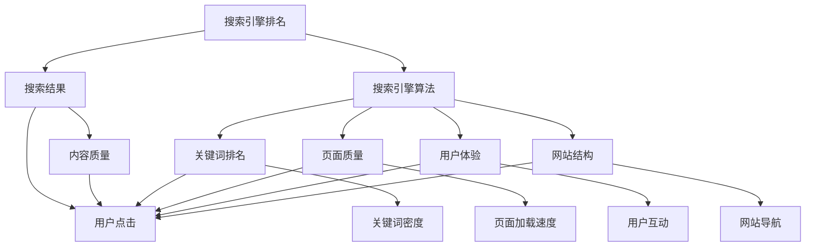

                 

# 程序员如何利用SEO技术提升知识付费曝光

> 关键词：SEO优化,知识付费,搜索引擎排名,网站流量,技术博客

## 1. 背景介绍

随着互联网的飞速发展，知识付费平台成为越来越多用户获取高质量学习内容的首选。知识付费不仅仅是一种商业模式，更是一种知识创新和传播的新方式。然而，在知识付费市场中，内容竞争激烈，如何使自己的内容被更多的用户发现，如何提升内容曝光率，成为知识付费平台面临的重要问题。

搜索引擎优化（SEO）技术是一种提升网站排名的有效手段。通过SEO优化，可以将相关的内容推送给有意向的潜在用户，从而提高知识付费平台的曝光率和用户增长率。本文将详细介绍程序员如何利用SEO技术提升知识付费曝光，帮助内容创作者获得更多的流量和收益。

## 2. 核心概念与联系

### 2.1 核心概念概述

在深入探讨SEO技术之前，我们先明确一些核心概念：

- **搜索引擎排名（Search Engine Ranking）**：搜索引擎根据算法对网站页面的相关性进行评估，按照算法模型生成的排序结果来展示网页。
- **搜索引擎优化（SEO）**：通过优化网站结构和内容，提升搜索引擎对网站的排名，进而提高网站流量和曝光率。
- **搜索引擎算法（Search Engine Algorithm）**：搜索引擎依据一定的规则，对搜索结果进行排序，算法模型复杂多样，包括关键词排名、页面质量、用户体验等因素。
- **内容质量（Content Quality）**：包括内容的原创性、相关性、深度、可读性等，是提升搜索引擎排名的重要因素。
- **技术博客（Tech Blog）**：专门讨论技术、编程、开发等话题的博客或网站。

这些概念之间相互关联，共同构成了一个完整的搜索引擎优化体系。

### 2.2 核心概念原理和架构的 Mermaid 流程图



此图展示了搜索引擎排名与内容质量、搜索引擎算法、关键词排名、页面质量、用户体验、网站结构等概念之间的联系，帮助读者理解SEO优化工作的各个环节。

## 3. 核心算法原理 & 具体操作步骤

### 3.1 算法原理概述

SEO优化算法的主要目标是提高网站在搜索引擎中的排名，进而提升网站流量和曝光率。搜索引擎根据一系列的算法规则对网站进行评估和排名，因此，SEO优化的关键在于优化网站结构和内容，使其满足搜索引擎的算法要求。

主要的SEO优化算法包括：

- **PageRank算法**：谷歌的PageRank算法是搜索引擎排名的核心算法，主要依据页面链接数量和质量对网页进行排序。
- **Ngram模型**：基于单词或短语频率模型，帮助搜索引擎理解页面内容的关键词密度和主题。
- **机器学习模型**：如BERT、GPT等预训练语言模型，通过对网页内容的深度学习，提升内容质量和搜索引擎对网页的理解度。
- **移动设备优化**：随着移动设备的使用增加，搜索引擎算法也越来越重视移动端用户体验，因此优化移动设备浏览体验是SEO优化的一个重要方面。

### 3.2 算法步骤详解

SEO优化的主要步骤包括：

1. **关键词研究**：通过工具如Google Keyword Planner、Ahrefs等，找到与内容相关的关键词，并确定关键词密度。
2. **网站结构优化**：优化网站导航、页面加载速度、响应时间、代码结构等，确保网站结构合理，提高用户体验。
3. **内容优化**：提高内容的原创性、相关性、深度和可读性，确保内容质量，满足搜索引擎算法的要求。
4. **链接建设**：通过外部链接、社交媒体、博客评论等方式，提升网站的链接数量和质量。
5. **技术博客优化**：针对技术博客，优化博客文章标题、描述、标签、代码高亮等，提升搜索引擎对文章的理解度。

### 3.3 算法优缺点

**优点**：

- **提高曝光率**：通过SEO优化，网站可以提升在搜索引擎中的排名，从而获得更多的流量。
- **降低成本**：相比于付费广告，SEO优化的投入相对较低，且长期效果显著。
- **增强品牌影响力**：良好的SEO排名可以提高品牌在搜索引擎中的曝光率，增加用户对品牌的认知。

**缺点**：

- **竞争激烈**：随着SEO技术的发展，竞争者越来越多，获取好的排名越来越困难。
- **效果周期长**：SEO优化是一个长期过程，短时间内可能难以看到明显效果。
- **技术门槛高**：SEO优化涉及算法和技术的多个方面，需要具备一定的技术背景和经验。

### 3.4 算法应用领域

SEO优化不仅仅适用于知识付费平台，更适用于各类网站和博客。无论是电商、新闻、娱乐、教育等各类型网站，都可以通过SEO优化提升其曝光率和流量。

## 4. 数学模型和公式 & 详细讲解 & 举例说明

### 4.1 数学模型构建

SEO优化的数学模型涉及多个因素，包括关键词密度、页面质量、用户体验等。这些因素通过搜索引擎算法模型相互关联，共同影响网站的排名。

以PageRank算法为例，其数学模型如下：

$$
PR_i = \sum_{j \in M_i} \frac{PR_j}{C_j + N} \times L_{ij} + (1 - d) \times \frac{N}{N + C_i}
$$

其中：
- $PR_i$ 表示页面 $i$ 的PageRank值。
- $PR_j$ 表示链接到页面 $i$ 的页面 $j$ 的PageRank值。
- $C_j$ 表示页面 $j$ 的出链数量。
- $N$ 表示所有页面的总数。
- $L_{ij}$ 表示从页面 $j$ 到页面 $i$ 的链接数量。
- $d$ 表示阻尼因子。

### 4.2 公式推导过程

在PageRank算法中，每个网页的PageRank值由所有链接到该网页的页面的PageRank值以及所有其他页面的PageRank值共同决定。公式中的阻尼因子 $d$ 表示由于网页之间存在多个链接，因此链接的效果会逐渐衰减。

通过不断迭代计算，搜索引擎可以得出每个网页的PageRank值，从而对网页进行排序。

### 4.3 案例分析与讲解

以一个简单的博客为例，该博客旨在介绍Python编程技巧。我们可以从以下几个方面进行SEO优化：

1. **关键词研究**：通过工具如Google Keyword Planner，找到与博客内容相关的关键词，如“Python编程技巧”、“Python最佳实践”等。
2. **内容优化**：提高文章的质量，使用清晰、简洁的语言，添加代码高亮，使用示例和插图来增强文章的吸引力和可读性。
3. **技术博客优化**：优化博客标题、描述和标签，确保博客内容与搜索引擎关键词匹配，使用合适的HTML标签（如<h1>、<h2>等）来结构化内容。

## 5. 项目实践：代码实例和详细解释说明

### 5.1 开发环境搭建

在进行SEO优化实践前，我们需要准备好开发环境。以下是使用Python进行SEO优化的环境配置流程：

1. 安装Python：从官网下载并安装Python，确保版本为3.7或以上。
2. 安装Flask：Flask是一个轻量级的Web框架，用于搭建技术博客。
   ```bash
   pip install Flask
   ```
3. 安装SEO工具包：安装seaborn、jupyter notebook等辅助工具。
   ```bash
   pip install seaborn jupyter notebook
   ```

### 5.2 源代码详细实现

以下是一个简单的技术博客示例，包含SEO优化的代码实现：

```python
from flask import Flask, render_template

app = Flask(__name__)

@app.route('/')
def index():
    return render_template('index.html')

@app.route('/blog/<id>')
def blog(id):
    blog_id = 1
    blog_title = 'Python编程技巧'
    blog_description = '这篇文章介绍了Python编程的最佳实践。'
    blog_content = 'Python是一种高效、易读的编程语言，适合入门级和中级程序员使用。'
    blog_keywords = 'Python编程技巧,Python最佳实践'

    return render_template('blog.html', blog_id=blog_id, blog_title=blog_title, blog_description=blog_description, blog_content=blog_content, blog_keywords=blog_keywords)

if __name__ == '__main__':
    app.run(debug=True)
```

### 5.3 代码解读与分析

**index()函数**：

- 用于渲染首页，可以添加SEO优化的标题和描述。

**blog()函数**：

- 用于渲染博客文章页面，输入参数 `id` 代表博客文章的唯一标识。
- `blog_id` 变量用于存储博客文章的ID。
- `blog_title` 变量存储博客标题。
- `blog_description` 变量存储博客描述。
- `blog_content` 变量存储博客内容。
- `blog_keywords` 变量存储博客关键词。

### 5.4 运行结果展示

通过运行上述代码，可以在本地搭建一个简单的技术博客，并在浏览器中访问 `http://localhost:5000/` 来查看效果。通过修改 `index.html` 和 `blog.html` 模板文件，可以在博客中添加SEO优化的元素，如标题、描述、关键词等。

## 6. 实际应用场景

### 6.1 知识付费平台

知识付费平台是一个典型的应用场景。SEO优化可以帮助知识付费平台提升其在搜索引擎中的排名，吸引更多潜在用户。具体措施包括：

- 优化博客内容：针对博客文章标题、描述、关键词等进行SEO优化。
- 优化博客结构：优化网站导航，确保用户可以轻松找到相关内容。
- 链接建设：通过外部链接、社交媒体等提升网站的链接质量。

### 6.2 在线教育

在线教育平台通过SEO优化，可以有效提升其课程的曝光率和用户访问量。具体措施包括：

- 课程页面优化：针对课程标题、描述、关键词等进行SEO优化。
- 视频课程优化：优化课程视频的加载速度，确保用户体验良好。
- 课程内容优化：提高课程内容的质量，增强课程的吸引力。

### 6.3 技术博客

技术博客通过SEO优化，可以吸引更多的技术爱好者和开发者。具体措施包括：

- 博客文章优化：针对博客标题、描述、关键词等进行SEO优化。
- 博客结构优化：优化博客文章的布局和结构，增强文章的易读性和可访问性。
- 社交媒体互动：通过社交媒体推广博客文章，提升文章的曝光率。

## 7. 工具和资源推荐

### 7.1 学习资源推荐

为了帮助开发者系统掌握SEO技术的基础和实践技巧，这里推荐一些优质的学习资源：

1. **Google官方文档**：提供了完整的SEO指南和示例代码。
2. **Moz的SEO博客**：提供SEO最佳实践、SEO工具和技巧等。
3. **Semrush学院**：提供SEO课程、SEO工具使用教程等。
4. **HubSpot的SEO教育中心**：提供SEO基础、高级SEO技巧等。

通过学习这些资源，相信你一定能够快速掌握SEO技术的精髓，并将其应用于实践中。

### 7.2 开发工具推荐

SEO优化需要依赖多种工具和平台，以下是几款常用的开发工具：

1. **Google Analytics**：用于分析网站流量和用户行为。
2. **Google Search Console**：用于监控网站的搜索引擎排名和流量。
3. **SEMrush**：提供SEO工具、关键词研究、竞争对手分析等功能。
4. **Ahrefs**：提供关键词研究、链接建设、竞争对手分析等功能。

合理利用这些工具，可以显著提升SEO优化的效率和效果。

### 7.3 相关论文推荐

SEO优化技术涉及多个领域的知识，以下是几篇重要的相关论文，推荐阅读：

1. **PageRank算法**：由Brain Page和Larry Page提出，是谷歌搜索引擎的核心算法之一。
2. **Ngram模型**：由Fred Jelinek等提出，用于提升搜索引擎对页面内容的理解度。
3. **机器学习在SEO中的应用**：探讨了机器学习算法在SEO优化中的实际应用。

这些论文代表了大规模搜索引擎算法的发展脉络。通过学习这些前沿成果，可以帮助研究者把握SEO技术的前沿方向，激发更多的创新灵感。

## 8. 总结：未来发展趋势与挑战

### 8.1 总结

本文对SEO优化技术进行了全面系统的介绍。首先阐述了SEO优化的背景和意义，明确了SEO在提升网站流量和用户增长中的独特价值。其次，从原理到实践，详细讲解了SEO优化的数学原理和关键步骤，给出了SEO技术博客的完整代码实例。同时，本文还广泛探讨了SEO技术在知识付费、在线教育、技术博客等多个行业领域的应用前景，展示了SEO范式的巨大潜力。此外，本文精选了SEO技术的各类学习资源，力求为读者提供全方位的技术指引。

通过本文的系统梳理，可以看到，SEO优化技术已经成为网站流量增长的重要手段，极大地拓展了网站的影响力和用户增长。SEO技术不仅仅适用于搜索引擎优化，更适用于各类技术博客和知识付费平台的推广，成为内容创作者不可或缺的工具。未来，伴随SEO技术的不断发展，SEO优化必将在更广阔的应用领域大放异彩。

### 8.2 未来发展趋势

展望未来，SEO优化技术将呈现以下几个发展趋势：

1. **移动设备优化**：随着移动设备的使用增加，搜索引擎算法也越来越重视移动端用户体验，优化移动设备浏览体验将成为SEO优化的重要方向。
2. **语义搜索**：搜索引擎将更加注重自然语言理解和语义搜索，未来的SEO优化需要更加关注内容语义和用户意图。
3. **个性化推荐**：搜索引擎将更多地采用个性化推荐算法，提升用户体验，优化搜索结果的个性化程度。
4. **视觉和音频内容优化**：随着视频和音频内容的普及，优化视觉和音频内容的SEO成为趋势。
5. **多模态内容优化**：优化多模态内容（如文本、图像、音频等）的SEO，提升内容的综合表现。

这些趋势凸显了SEO优化技术的广阔前景。这些方向的探索发展，必将进一步提升SEO技术的性能和应用范围，为网站流量增长带来新的动力。

### 8.3 面临的挑战

尽管SEO优化技术已经取得了瞩目成就，但在迈向更加智能化、普适化应用的过程中，它仍面临着诸多挑战：

1. **竞争激烈**：随着SEO技术的发展，竞争者越来越多，获取好的排名越来越困难。
2. **效果周期长**：SEO优化是一个长期过程，短时间内可能难以看到明显效果。
3. **技术门槛高**：SEO优化涉及算法和技术的多个方面，需要具备一定的技术背景和经验。
4. **法规和政策变化**：搜索引擎算法和政策的变化，对SEO优化产生重要影响，需要持续关注和适应。

### 8.4 研究展望

面对SEO优化面临的这些挑战，未来的研究需要在以下几个方面寻求新的突破：

1. **无监督和半监督SEO优化**：摆脱对大规模标注数据的依赖，利用自监督学习、主动学习等无监督和半监督范式，最大限度利用非结构化数据，实现更加灵活高效的SEO优化。
2. **多模态SEO优化**：优化多模态内容（如文本、图像、音频等）的SEO，提升内容的综合表现。
3. **语义搜索优化**：提升搜索引擎的自然语言理解和语义搜索能力，优化内容的语义匹配度。
4. **用户体验优化**：优化移动设备浏览体验、视频加载速度、音频质量等，提升用户体验。
5. **个性化推荐优化**：优化个性化推荐算法，提升搜索结果的个性化程度。

这些研究方向的探索，必将引领SEO优化技术迈向更高的台阶，为网站流量增长带来新的动力。SEO优化需要开发者根据具体场景，不断迭代和优化算法和内容，方能得到理想的效果。

## 9. 附录：常见问题与解答

**Q1：SEO优化的效果如何衡量？**

A: 通常使用网站流量、用户行为（如停留时间、跳出率）、搜索引擎排名等指标来衡量SEO优化的效果。

**Q2：如何进行关键词研究？**

A: 使用工具如Google Keyword Planner、Ahrefs等，找到与内容相关的关键词，并确定关键词密度。

**Q3：网站结构优化有哪些具体措施？**

A: 优化网站导航、页面加载速度、响应时间、代码结构等，确保网站结构合理，提高用户体验。

**Q4：内容优化有哪些具体措施？**

A: 提高内容的原创性、相关性、深度和可读性，确保内容质量，满足搜索引擎算法的要求。

**Q5：链接建设有哪些具体措施？**

A: 通过外部链接、社交媒体、博客评论等方式，提升网站的链接数量和质量。

通过本文的系统梳理，可以看到，SEO优化技术已经成为网站流量增长的重要手段，极大地拓展了网站的影响力和用户增长。SEO优化不仅仅适用于搜索引擎优化，更适用于各类技术博客和知识付费平台的推广，成为内容创作者不可或缺的工具。未来，伴随SEO技术的不断发展，SEO优化必将在更广阔的应用领域大放异彩。

---

作者：禅与计算机程序设计艺术 / Zen and the Art of Computer Programming

