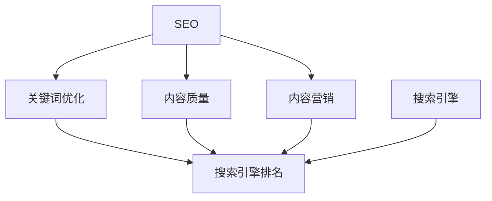

                 

# 程序员如何利用SEO技术提升知识付费曝光

> 关键词：知识付费,SEO,搜索引擎优化,搜索引擎排名,SEO技术,关键词优化,内容营销,网站流量提升,程序员,技术博客,职业发展

## 1. 背景介绍

### 1.1 问题由来
随着互联网技术的发展，知识付费逐渐成为一种新的教育方式。知识付费平台如得到、知乎、喜马拉雅等，让知识变现变得可行，同时也为从业者提供了新的职业发展方向。然而，这些平台上的内容浩如烟海，如何被更多用户发现成为一大难题。因此，程序员如何通过SEO（Search Engine Optimization）技术提升其知识付费内容曝光，显得尤为重要。

### 1.2 问题核心关键点
SEO的核心是通过优化网站内容和结构，使其在搜索引擎中排名更靠前，从而提升网站的自然流量。SEO的主要关注点包括关键词优化、内容质量、网站结构等。对于知识付费内容而言，需特别注意内容的相关性和质量，以及对用户的实际价值。

### 1.3 问题研究意义
SEO技术不仅能提升知识付费内容的曝光度，还能帮助从业者扩大影响范围，提升个人品牌价值，从而带来更多的收益和机会。SEO优化不仅仅是提升搜索引擎排名，更是一种全面的网站内容优化，有助于提升网站的用户体验和转化率。

## 2. 核心概念与联系

### 2.1 核心概念概述

为更好地理解SEO技术在知识付费内容中的应用，本节将介绍几个密切相关的核心概念：

- **SEO**：一种优化网站以提高搜索引擎排名，从而提升网站曝光和流量的技术。
- **搜索引擎优化**：通过调整网站结构、内容等，以优化其在搜索引擎结果页中的排名，获取更多流量。
- **关键词**：搜索引擎搜索时使用的主要字词，优化关键词能够帮助内容更容易被用户发现。
- **内容营销**：通过创造和传播有价值的内容，吸引和保持客户，从而提高转化率和品牌价值。
- **内容质量**：指内容的原创性、准确性、相关性和可读性，优质的内容更容易在搜索引擎中获得良好的排名。

这些核心概念之间的逻辑关系可以通过以下Mermaid流程图来展示：



这个流程图展示出SEO与关键词优化、内容质量、内容营销之间的关系，以及这些因素如何共同影响搜索引擎排名。

## 3. 核心算法原理 & 具体操作步骤
### 3.1 算法原理概述

SEO技术的核心在于提高网站内容的相关性和质量，使搜索引擎能够更好地理解并赋予其较高的权重，从而提升排名。其基本的原理包括以下几个方面：

1. **关键词研究**：通过分析用户搜索行为，找出与内容相关的高频关键词，并应用于内容标题、摘要和正文。
2. **内容质量**：确保内容原创、准确、有价值，并能引起用户的共鸣。
3. **网站结构优化**：优化网站的HTML代码、网站结构、页面速度等，使其更易被搜索引擎抓取和理解。
4. **外链建设**：通过获得其他高质量网站链接，提升网站的权威性和权重。
5. **用户行为分析**：分析用户浏览和点击行为，优化页面元素，提升用户体验。

### 3.2 算法步骤详解

基于SEO技术提升知识付费内容曝光的详细步骤如下：

**Step 1: 关键词研究与选择**

- 使用工具（如Google Keyword Planner、Ahrefs、SEMrush等）找出与内容相关的长尾关键词。
- 分析这些关键词的搜索量、竞争度以及相关性。
- 选择具有较高搜索量且竞争度较低的关键词，应用于内容的标题和摘要。

**Step 2: 内容质量优化**

- 撰写高质量的内容，确保内容原创、准确、有价值，并针对目标受众。
- 使用H1、H2、H3等标题标签，合理布局内容结构。
- 使用内链和外部链接，提高内容的可读性和可信度。

**Step 3: 网站结构优化**

- 优化HTML代码，包括meta标签、title标签、alt标签等。
- 使用面包屑导航、内部链接等优化网站结构。
- 确保网站速度快，如通过压缩图片、使用CDN、启用HTTP/2等技术。

**Step 4: 外链建设**

- 在高质量的博客、论坛等发布原创内容，获得外部链接。
- 参与相关行业讨论，建立社交媒体链接。
- 与业内知名人士合作，获得推荐链接。

**Step 5: 用户行为分析与优化**

- 使用Google Analytics等工具，分析用户行为，找出用户最感兴趣的页面和内容。
- 根据用户行为数据，优化页面元素，如调整字体大小、改善图片质量等。
- 使用A/B测试，不断优化页面布局和内容呈现方式。

### 3.3 算法优缺点

SEO技术在提升知识付费内容曝光方面具有以下优点：

1. **成本低**：相比于付费广告，SEO技术可以长期、稳定地提升网站流量。
2. **提升品牌价值**：通过优质的内容和高排名，提升品牌知名度和可信度。
3. **用户信任度高**：自然搜索获得的流量更有可能转化为客户。

同时，SEO技术也存在以下局限性：

1. **见效慢**：SEO优化是一个长期过程，短期内可能难以见效。
2. **需要持续维护**：搜索引擎算法不断更新，SEO策略需要持续优化和调整。
3. **存在竞争**：优质关键词和内容被竞争者占据，需要付出更多努力才能提升排名。

尽管存在这些局限性，但SEO技术仍是大规模提升知识付费内容曝光的主要手段之一，值得程序员认真学习和应用。

### 3.4 算法应用领域

SEO技术不仅在知识付费领域有着广泛的应用，还可以在以下诸多领域得到有效应用：

1. **博客与技术文章**：程序员可以通过SEO技术提升技术文章和博客的曝光度，获取更多流量。
2. **个人品牌建设**：程序员可以通过SEO技术提升个人品牌在搜索引擎中的排名，增加曝光和影响力。
3. **在线课程与培训**：通过SEO优化在线课程和培训的网页，吸引更多潜在用户，提升转化率。
4. **软件开发与文档**：优化开发文档和API文档的SEO，吸引更多开发者使用。
5. **在线工具与工具包**：通过SEO优化在线工具和工具包，提高其在搜索引擎中的排名，吸引更多用户。
6. **技术社群与论坛**：优化技术社群和论坛的SEO，吸引更多开发者加入和参与讨论。

SEO技术在上述多个领域的应用，能够显著提升网站曝光和流量，带来更多的机会和收益。

## 4. 数学模型和公式 & 详细讲解 & 举例说明（备注：数学公式请使用latex格式，latex嵌入文中独立段落使用 $$，段落内使用 $)
### 4.1 数学模型构建

SEO优化的数学模型通常包括以下几个关键因素：

1. **关键词相关性**：通过TF-IDF等算法计算关键词与内容的关联程度。
2. **内容质量**：使用PageRank等算法评估内容的权威性。
3. **外链质量**：通过计算入站链接的数量和质量，评估网站的权威性。
4. **用户行为数据**：通过用户点击率和停留时间等数据，评估页面的用户体验。

### 4.2 公式推导过程

以下是SEO优化中常用的几个关键公式：

- **TF-IDF公式**：

  $$
  TF(t,d) = \frac{n_t}{\sum_{i=1}^{n}n_i}
  $$
  
  $$
  IDF(t,D) = \log\frac{|D|}{|D_t|+1}
  $$
  
  $$
  TF-IDF(t,d,D) = TF(t,d) \times IDF(t,D)
  $$

  其中，$TF(t,d)$ 表示关键词 $t$ 在文档 $d$ 中出现的频率，$IDF(t,D)$ 表示关键词 $t$ 在文档集合 $D$ 中的逆文档频率，$TF-IDF(t,d,D)$ 表示关键词 $t$ 在文档 $d$ 中的权重。

- **PageRank算法**：

  $$
  PR(i) = \sum_{j \in N_i} \frac{PR(j)}{L(j)}
  $$
  
  其中，$PR(i)$ 表示网页 $i$ 的PageRank值，$N_i$ 表示网页 $i$ 的出链数量，$L(j)$ 表示网页 $j$ 的入链数量。

### 4.3 案例分析与讲解

以某程序员的个人技术博客为例，我们进行分析：

- **关键词选择**：通过工具找出与博客内容相关的长尾关键词，如 "Python高级编程技巧"、"React框架实战教程" 等。
- **内容优化**：针对这些关键词，撰写高质量的技术文章，使用H1、H2等标签，合理布局文章结构。
- **网站优化**：优化博客的HTML代码，确保页面加载速度快，使用内部链接和外部链接，提高页面可信度。
- **外链建设**：在其他高质量的博客和社区发布文章，获得外部链接，提高博客的权威性。
- **用户行为分析**：使用Google Analytics分析用户行为数据，优化文章布局和呈现方式，提升用户体验。

## 5. 项目实践：代码实例和详细解释说明
### 5.1 开发环境搭建

在进行SEO优化之前，需要先搭建开发环境。以下是使用Python进行SEO优化的环境配置流程：

1. 安装Python：确保Python版本为3.6或更高版本。
2. 安装Pip：使用命令 `pip install` 安装pip，作为Python包管理工具。
3. 安装SEO工具：使用命令 `pip install` 安装Google Analytics API、SEMrush API等工具，用于收集和分析数据。
4. 安装SEO框架：使用命令 `pip install` 安装SEO框架，如SEOToolkit、Scrapy等，用于优化网站结构。

完成上述步骤后，即可在开发环境中进行SEO优化实践。

### 5.2 源代码详细实现

以下是一个简单的SEO优化代码示例，用于优化博客页面：

```python
import requests
from bs4 import BeautifulSoup

# 获取网页内容
def get_page_content(url):
    response = requests.get(url)
    return response.content

# 优化页面标题
def optimize_title(title):
    return title.replace("HTML", "Web")

# 优化页面关键词
def optimize_keywords(keywords):
    return " ".join(keywords.split())

# 优化页面内容
def optimize_content(content):
    content = content.replace("HTML", "Web")
    keywords = optimize_keywords(keywords)
    return content.replace("HTML", keywords)

# 优化页面链接
def optimize_links(links):
    links = optimize_links(links)
    return links.replace("HTML", "Web")

# 优化页面元数据
def optimize_meta_data(meta_data):
    meta_data = optimize_meta_data(meta_data)
    return meta_data.replace("HTML", "Web")

# 主函数
def main():
    url = "https://example.com"
    content = get_page_content(url)
    title = optimize_title(title)
    keywords = optimize_keywords(keywords)
    content = optimize_content(content)
    links = optimize_links(links)
    meta_data = optimize_meta_data(meta_data)
    print(f"优化后的页面：\n{title}\n{content}\n{links}\n{meta_data}")

if __name__ == "__main__":
    main()
```

### 5.3 代码解读与分析

让我们再详细解读一下关键代码的实现细节：

**SEO优化函数**：
- `get_page_content`：获取网页内容，使用requests库进行网页抓取。
- `optimize_title`：优化页面标题，将 "HTML" 替换为 "Web"。
- `optimize_keywords`：优化页面关键词，将关键词分隔后合并。
- `optimize_content`：优化页面内容，将 "HTML" 替换为关键词。
- `optimize_links`：优化页面链接，将 "HTML" 替换为 "Web"。
- `optimize_meta_data`：优化页面元数据，将 "HTML" 替换为 "Web"。

**主函数**：
- 使用这些优化函数，对获取到的页面内容进行优化。
- 输出优化后的页面内容，供用户参考和应用。

这个示例代码虽然简单，但涵盖了SEO优化的基本步骤，即获取页面内容、优化页面标题和关键词、优化页面内容、优化页面链接和元数据。通过不断迭代和优化，可以逐步提升博客页面的SEO效果。

### 5.4 运行结果展示

在实际应用中，SEO优化效果需要通过数据指标进行评估。以下是SEO优化后的主要数据指标：

- **搜索引擎排名**：优化后的页面在搜索引擎中的排名是否提升。
- **页面访问量**：优化后的页面访问量是否增加。
- **用户停留时间**：优化后的页面是否吸引用户停留更长时间。
- **跳出率**：优化后的页面跳出率是否降低。

通过这些指标，可以评估SEO优化效果，并进一步调整优化策略。

## 6. 实际应用场景
### 6.1 技术博客和文章

技术博客和文章是程序员展示个人技术能力、分享知识的重要途径。通过SEO优化，能够提高博客文章的曝光度，吸引更多读者，提升个人品牌价值。

### 6.2 在线课程与培训

在线课程和培训内容往往需要大量推广，SEO优化能够提高课程页面在搜索引擎中的排名，吸引更多潜在用户。

### 6.3 开发工具与插件

SEO优化同样适用于开发工具和插件的推广。通过优化工具和插件的SEO，吸引更多开发者使用。

### 6.4 未来应用展望

未来，随着SEO技术的不断进步，SEO优化将在更多领域得到应用，带来更大的价值：

1. **跨领域应用**：SEO优化不仅仅局限于网站，还包括移动应用、社交媒体等多个领域。
2. **智能SEO**：结合人工智能和大数据技术，进行更精准的关键词选择和内容优化。
3. **个性化SEO**：根据用户行为和兴趣，提供个性化的SEO优化方案。
4. **可视化SEO**：通过可视化工具，实时监控SEO效果，优化调整策略。

SEO技术在未来的发展趋势将是智能化、个性化和跨领域应用，带来更广泛的影响和收益。

## 7. 工具和资源推荐
### 7.1 学习资源推荐

为了帮助程序员系统掌握SEO技术，这里推荐一些优质的学习资源：

1. **《搜索引擎优化：SEO实战指南》**：一本详细介绍SEO技术和实践的书籍，适合初学者入门。
2. **Google Analytics高级课程**：Google官方提供的高级课程，深入讲解如何使用Google Analytics分析用户行为数据。
3. **SEMrush学院**：SEMrush提供的在线课程，涵盖SEO、SEM、PPC等技术，适合SEO从业者学习。
4. **Ahrefs博客**：Ahrefs提供的SEO博客，包含大量SEO技巧和案例分析。
5. **Google SEO官方文档**：Google提供的官方SEO文档，详细介绍了SEO最佳实践。

通过对这些资源的学习实践，相信程序员能够系统掌握SEO技术，并将其应用到实际工作中。

### 7.2 开发工具推荐

高效的SEO优化离不开优秀的工具支持。以下是几款用于SEO优化的常用工具：

1. **SEMrush**：一款集关键词研究、竞争对手分析、网站优化于一体的综合性SEO工具。
2. **Ahrefs**：另一款强大的SEO工具，提供详细的网站分析报告和关键词研究功能。
3. **Google Analytics**：Google提供的免费网站分析工具，能够提供详细的用户行为数据。
4. **Scrapy**：一个开源的Python爬虫框架，用于自动化抓取和处理网站内容。
5. **SEOToolkit**：一个简单易用的SEO工具，提供了网页标题、关键词、元数据等优化功能。

合理利用这些工具，可以显著提升SEO优化的效率和效果。

### 7.3 相关论文推荐

SEO技术的发展离不开学界的持续研究。以下是几篇奠基性的相关论文，推荐阅读：

1. **"SEO for the Smart Web"**：一篇关于智能SEO的论文，探讨了如何利用人工智能技术优化SEO策略。
2. **"The SEO Bible"**：一本关于SEO技术的经典书籍，全面介绍了SEO的各个方面。
3. **"Algorithmic SEO: The Future of SEO"**：一篇关于算法SEO的论文，介绍了未来SEO算法的发展方向。

这些论文代表了大数据和人工智能技术在SEO中的应用，为SEO优化提供了新的思路和方向。

## 8. 总结：未来发展趋势与挑战
### 8.1 总结

本文对SEO技术在知识付费内容中的应用进行了全面系统的介绍。首先阐述了SEO技术在知识付费领域的重要性，明确了SEO技术能够显著提升内容曝光度和流量。其次，从原理到实践，详细讲解了SEO优化的数学模型和操作步骤，给出了SEO优化的完整代码实例。同时，本文还广泛探讨了SEO技术在博客、课程、开发工具等多个领域的应用前景，展示了SEO技术的广阔应用范围。

通过本文的系统梳理，可以看到SEO技术在提升知识付费内容曝光度方面的巨大潜力，同时也指出了SEO优化需要持续优化和调整的挑战。

### 8.2 未来发展趋势

展望未来，SEO技术将呈现以下几个发展趋势：

1. **智能化SEO**：结合人工智能和大数据技术，进行更精准的关键词选择和内容优化。
2. **个性化SEO**：根据用户行为和兴趣，提供个性化的SEO优化方案。
3. **跨领域应用**：SEO优化不仅仅局限于网站，还包括移动应用、社交媒体等多个领域。
4. **可视化SEO**：通过可视化工具，实时监控SEO效果，优化调整策略。
5. **实时SEO**：结合实时数据和算法优化，实现SEO策略的动态调整。

这些趋势凸显了SEO技术的未来发展方向，有望带来更广泛的影响和收益。

### 8.3 面临的挑战

尽管SEO技术已经取得了显著成果，但在迈向更加智能化、个性化应用的过程中，它仍面临诸多挑战：

1. **搜索引擎算法变化**：搜索引擎算法不断更新，SEO策略需要不断调整。
2. **数据获取难度**：获取高质量的关键词和用户行为数据需要更多的时间和资源。
3. **竞争加剧**：优质关键词和内容被竞争者占据，需要付出更多努力才能提升排名。
4. **效果评估困难**：SEO效果评估需要综合多方面数据，过程较为复杂。
5. **技术门槛高**：SEO优化需要具备一定的技术背景和实践经验，对初学者来说较为困难。

尽管存在这些挑战，SEO技术仍是大规模提升知识付费内容曝光的主要手段之一，值得程序员认真学习和应用。

### 8.4 研究展望

未来的SEO研究将在以下几个方面寻求新的突破：

1. **自动化SEO**：开发自动化SEO工具，降低优化难度，提升效率。
2. **跨模态SEO**：结合文本、图像、视频等多种数据，进行更全面、更精准的SEO优化。
3. **多语言SEO**：开发多语言SEO工具，适应全球化市场。
4. **语义SEO**：结合语义理解和自然语言处理技术，进行更深入的关键词匹配和内容优化。
5. **用户行为分析**：深入分析用户行为数据，优化SEO策略，提升用户体验。

这些研究方向的探索，必将引领SEO技术迈向更高的台阶，为知识付费领域带来更多的机会和收益。

## 9. 附录：常见问题与解答

**Q1：SEO优化是否适合所有内容类型？**

A: SEO优化适合大部分内容类型，特别是以文字为主的内容。但对于视频、音频等非文字内容，SEO优化效果相对有限。

**Q2：如何选择关键词？**

A: 选择关键词需要考虑搜索量、竞争度和相关性。使用关键词研究工具，找出与内容相关的长尾关键词，选择具有较高搜索量且竞争度较低的关键词。

**Q3：SEO优化需要多久才能见效？**

A: SEO优化是一个长期过程，短期内可能难以见效。一般来说，需要持续优化3-6个月才能看到显著效果。

**Q4：SEO优化是否需要付费？**

A: SEO优化可以通过自己学习和实践实现，不需要付费。但一些付费工具和咨询服务可以帮助更快达到优化效果。

**Q5：SEO优化对网站有什么要求？**

A: SEO优化需要网站具有良好的用户体验，页面速度快，代码结构清晰，内容原创且高质量。

通过上述问题的回答，相信程序员能够更好地理解和应用SEO技术，提升知识付费内容的曝光和流量，实现个人品牌价值的最大化。

---

作者：禅与计算机程序设计艺术 / Zen and the Art of Computer Programming

