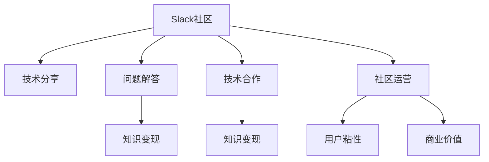

                 

# 程序员如何利用Slack社区进行知识变现

> 关键词：Slack社区, 知识变现, 技术分享, 网络学习, 专家咨询, 知识管理, 社区运营

## 1. 背景介绍

### 1.1 问题由来
在快速发展的IT行业，技术更新迭代速度极快，传统自学模式已难以适应。同时，互联网时代信息泛滥，筛选有效资源成了一大难题。而Slack社区作为一种新型社交网络工具，为技术人员提供了一个高效便捷的知识共享和交流平台。如何高效利用Slack社区进行知识变现，成为了程序员和企业面临的重要课题。

### 1.2 问题核心关键点
本文聚焦于如何通过Slack社区构建专业社群，打造知识分享、问题解答、技术合作和商业变现的一体化平台。通过优化社区运营，整合专家资源，解决技术问题，提升社群影响力，进而实现知识变现。

### 1.3 问题研究意义
利用Slack社区进行知识变现，不仅能为技术人提供高效的学习工具，还能为企业创造可观的商业价值。通过构建富有活力的技术社群，企业不仅能提高员工技能，还能吸引外部技术人才，实现内部与外部的知识双向流动。

## 2. 核心概念与联系

### 2.1 核心概念概述

为更好地理解如何通过Slack社区进行知识变现，本节将介绍几个核心概念：

- Slack社区：一种基于云端的即时通讯工具，通过频道、群组等方式实现实时通信和文件共享，成为技术人知识交流的新场景。

- 知识变现：通过向他人分享知识、提供技术支持或服务，将知识转化为经济效益的过程。

- 技术分享：在Slack社区中，通过公开或私密的频道，进行技术文章、代码分享、项目案例讲解等形式的知识传播。

- 问题解答：在Slack社区中，组建技术专家组，为成员提供一对一的技术支持和问题解答。

- 技术合作：利用Slack社区的协作功能，组建技术团队，实现技术资源整合和协同开发。

- 社区运营：通过科学管理和持续优化，提升Slack社区的活跃度、用户粘性和商业价值。

这些核心概念之间的逻辑关系可以通过以下Mermaid流程图来展示：



这个流程图展示Slack社区的核心概念及其之间的关系：

1. Slack社区提供了一个高效的知识交流平台。
2. 技术分享和问题解答是知识变现的直接方式。
3. 技术合作通过整合社区资源，间接促进知识变现。
4. 社区运营保障了知识变现的高效进行。

这些概念共同构成了Slack社区知识变现的生态系统，使其成为技术人学习和工作的新助力。

## 3. 核心算法原理 & 具体操作步骤
### 3.1 算法原理概述

通过Slack社区进行知识变现，本质上是一个知识传播和应用的过程。其核心思想是：

1. 建立以知识分享和问题解答为中心的Slack频道和群组，定期发布和讨论技术文章、案例、代码等，以形成积极的学习和交流氛围。
2. 邀请技术专家或具有丰富经验的技术人，组建问题解答团队，提供一对一的咨询服务，帮助社区成员解决技术难题。
3. 通过技术合作，整合社区内外的技术资源，共同开发项目，实现技术共享和知识传播。
4. 通过科学的社区运营管理，提升用户粘性和商业价值。

形式化地，假设社区中每个成员的学习需求为 $D$，每个专家对知识的贡献为 $C$，社区运营的效果为 $O$，社区知识变现的收益为 $R$。知识变现的优化目标是最小化学习需求，最大化专家贡献和社区运营效果，从而获得最佳收益：

$$
\max_{D,C,O} R = f(D,C,O)
$$

其中 $f$ 为社区知识变现的收益函数，需根据具体场景和需求进行定义。

### 3.2 算法步骤详解

基于Slack社区的知识变现方法，通常包括以下几个关键步骤：

**Step 1: 建立知识共享平台**
- 在Slack上创建专门的知识分享频道和群组，如 #技术分享、#问题解答、#项目案例等。
- 设置频道和群组的权限，确保每个用户都能自由参与讨论和交流。
- 定期发布技术文章、项目案例、代码示例等，吸引成员加入和参与。

**Step 2: 招募技术专家**
- 通过社区内的投票或推荐机制，选拔有技术专长、乐于分享和帮助的成员，作为问题解答专家。
- 建立专家咨询团队，明确成员职责和权限，保证问题解答的及时性和专业性。
- 通过技术合作等方式，吸引社区外的专家入驻，提供更广泛的技术支持。

**Step 3: 优化社区运营管理**
- 制定社区运营规则和标准，如频道管理、成员行为规范等，确保社区的秩序和高效运转。
- 定期评估社区活跃度，如频道消息数量、互动频率、成员参与度等，进行数据驱动的优化。
- 设置激励机制，如表彰积极贡献的成员，发放技术奖励等，提升用户粘性和社区参与度。

**Step 4: 实现知识变现**
- 通过技术分享和问题解答，提升社区成员的技能和经验，形成具有高商业价值的专业技术团队。
- 通过技术合作，共同开发项目，将社区内的技术积累转化为实际应用。
- 在社区内推广技术咨询、技术培训、技术产品等商业服务，直接创造经济效益。

### 3.3 算法优缺点

利用Slack社区进行知识变现具有以下优点：
1. 高效便捷：Slack社区提供实时通信和文件共享功能，知识传播和应用迅速高效。
2. 资源丰富：社区内外的技术专家、代码示例、技术文章等资源丰富，有利于快速学习。
3. 社区互动：通过社区互动，成员之间能互相学习和支持，提升整体技术水平。
4. 商业合作：社区可吸引技术人才和合作项目，提升商业价值和合作机会。

同时，该方法也存在一定的局限性：
1. 社区运营难度：需要专业运营团队维护，运营成本较高。
2. 专家依赖性：社区技术水平和变现能力很大程度上依赖于专家的选择和培养。
3. 技术多样性：社区涉及的技术领域广泛，难以做到全面覆盖和深度深入。
4. 商业转化困难：虽然社区提供了技术服务，但将其转化为商业变现还需更多策略和手段。

尽管存在这些局限性，但就目前而言，Slack社区在知识变现方面具有显著优势，是一个值得深入探索的新型技术交流平台。

### 3.4 算法应用领域

利用Slack社区进行知识变现，主要应用于以下领域：

- **企业技术社群**：通过建立企业内部Slack社区，进行技术分享、问题解答、技术合作，提升员工技能，吸引外部技术人才。
- **开源社区**：利用开源项目作为知识变现载体，通过Slack进行技术讨论、代码审查、项目迭代，提高项目贡献度。
- **技术培训平台**：通过Slack社区推广在线课程、技术讲座、技术培训，提升培训效果和用户满意度。
- **初创公司**：构建初创公司的Slack技术社区，吸引技术人才，优化产品开发过程，提高产品成功率。

## 4. 数学模型和公式 & 详细讲解 & 举例说明
### 4.1 数学模型构建

本节将使用数学语言对通过Slack社区进行知识变现的过程进行严格的刻画。

设Slack社区中每个成员的学习需求为 $D_i$，每位专家的知识贡献为 $C_j$，社区运营的效果为 $O$，知识变现的收益为 $R$。社区知识变现的收益函数为 $R=f(D,C,O)$。

在优化过程中，我们希望最大化社区知识变现的收益，同时最小化每个成员的学习需求 $D_i$。为了简化问题，我们假设每个成员的学习需求、每个专家的知识贡献和社区运营效果相互独立，并引入约束条件 $D_i,C_j,O$ 均非负。

**优化目标**：

$$
\max_{D,C,O} R = f(D,C,O)
$$

**约束条件**：

$$
\begin{align*}
D_i &\geq 0 \\
C_j &\geq 0 \\
O &\geq 0 \\
\end{align*}
$$

### 4.2 公式推导过程

假设社区中的每个成员和专家都能独立地对知识变现做出贡献，且贡献函数为单调递增函数。社区知识变现的收益 $R$ 可以表示为：

$$
R = \sum_{i=1}^n D_i f_i(C_j) O
$$

其中 $n$ 为社区成员数，$f_i$ 为第 $i$ 个成员的收益函数，$f_i(C_j)$ 表示成员 $i$ 通过专家 $j$ 贡献的知识得到的收益。社区运营效果 $O$ 可表示为：

$$
O = \sum_{k=1}^m C_k f_k(O)
$$

其中 $m$ 为专家数，$f_k(O)$ 表示第 $k$ 个专家对社区运营的贡献函数。

由于社区运营效果 $O$ 对知识变现 $R$ 的影响是乘性的，我们可以引入变量 $\alpha$ 表示专家 $j$ 对社区运营的贡献率，即 $\alpha_{j=1,...,m}$。则有：

$$
O = \sum_{k=1}^m \alpha_k C_k f_k(O)
$$

综合上述公式，可以建立社区知识变现的收益函数：

$$
R = \sum_{i=1}^n D_i \sum_{k=1}^m \alpha_k C_k f_i(C_j) f_k(O)
$$

### 4.3 案例分析与讲解

以一个开源项目为例，介绍如何使用Slack社区进行知识变现。

假设有一个开源项目，社区中有 $n=100$ 名开发者和 $m=10$ 名专家。开发者每天通过问题解答、代码审查等贡献 $D_i=2$，专家每天通过技术指导、贡献代码等贡献 $C_j=1$。社区运营效果 $O=3$。假设收益函数 $f_i(C_j)=C_j^2$，则有：

$$
R = \sum_{i=1}^{100} 2 \sum_{k=1}^{10} \alpha_k C_k 2^{C_j} 3^{f_k(O)}
$$

在求解最优解时，需要考虑社区中每个开发者和专家的约束条件，即 $D_i \geq 0, C_j \geq 0, O \geq 0$。

通过优化算法，如拉格朗日乘数法，可以找到最优的专家贡献率 $\alpha_k$ 和专家组合，使得社区知识变现收益 $R$ 最大化。具体计算过程较为复杂，需根据具体情况进行优化求解。

## 5. 项目实践：代码实例和详细解释说明
### 5.1 开发环境搭建

在进行Slack社区知识变现的实践前，我们需要准备好开发环境。以下是使用Python进行Slack API开发的环境配置流程：

1. 安装Anaconda：从官网下载并安装Anaconda，用于创建独立的Python环境。

2. 创建并激活虚拟环境：
```bash
conda create -n slack-env python=3.8 
conda activate slack-env
```

3. 安装Slack API开发库：
```bash
pip install slackclient
```

4. 安装各类工具包：
```bash
pip install numpy pandas scikit-learn matplotlib tqdm jupyter notebook ipython
```

完成上述步骤后，即可在`slack-env`环境中开始Slack社区知识变现的实践。

### 5.2 源代码详细实现

这里我们以Slack知识分享频道的自动化管理为例，给出使用Slack API进行Slack社区知识变现的Python代码实现。

首先，导入Slack API客户端：

```python
from slack_sdk import WebClient

client = WebClient(token='YOUR_SLACK_API_TOKEN')
```

然后，定义频道信息：

```python
channel_id = 'YOUR_CHANNEL_ID'
```

接着，定义信息发布函数：

```python
def publish_message(text):
    response = client.chat_postMessage(channel=channel_id, text=text)
    if response['ok']:
        print('Message published successfully.')
    else:
        print('Failed to publish message.')
```

最后，启动发布流程：

```python
text = 'Today\'s technical share: Python 3 tips and tricks!'
publish_message(text)
```

以上就是使用Python进行Slack知识分享频道信息自动发布的完整代码实现。

### 5.3 代码解读与分析

让我们再详细解读一下关键代码的实现细节：

**WebClient初始化**：
- `slack_sdk.WebClient`：用于连接Slack API，并实现消息发布、频道管理等操作。
- `token`：用于认证的API密钥，需通过Slack官网获取。

**channel_id定义**：
- `channel_id`：指定知识分享频道的ID，根据实际情况修改。

**publish_message函数**：
- 利用`chat_postMessage`方法，将消息发布到指定频道。
- 判断API调用是否成功，并输出相应提示信息。

**启动发布流程**：
- 定义要发布的消息内容，调用`publish_message`函数发布消息。

可以看到，通过Python和Slack API的结合，可以实现Slack知识分享频道的自动化管理。开发者可以定时发布技术分享内容，保障社区的活跃度和知识传播效果。

当然，工业级的系统实现还需考虑更多因素，如频道的权限管理、消息的模板化生成、系统自动更新等。但核心的知识分享和自动化管理思路基本与此类似。

## 6. 实际应用场景
### 6.1 技术培训平台

Slack社区作为一种高效的学习工具，可以为技术培训平台提供强大的支持。通过Slack社区进行技术分享、问题解答和项目合作，可以迅速提升学员技能，增强培训效果。

在技术培训中，可以根据学员的技术水平和需求，定制化地推送知识内容，利用Slack社区进行在线讨论、案例讲解、代码演示等互动环节。同时，通过问题解答团队，为学员提供个性化的技术支持，解答学习过程中遇到的疑惑，促进技术知识的深入理解和掌握。

### 6.2 企业技术社群

Slack社区在企业技术社群构建中同样具有重要价值。通过建立企业内部Slack技术社区，可以整合企业内部的技术资源，提升员工技术水平，促进知识共享和经验传承。

在企业技术社群中，可以定期举办技术分享会、代码审查、项目评审等活动，提升团队协作效率。同时，利用问题解答团队，为员工提供技术支持，解决实际工作中的问题，提升工作满意度。

### 6.3 开源社区

Slack社区为开源项目提供了便捷的沟通和协作平台。通过Slack社区，开发者可以进行代码讨论、项目迭代、版本管理等操作，提升开源项目的贡献度和代码质量。

在开源社区中，Slack频道可以定期发布项目进展、技术讨论、问题反馈等消息，促进社区成员之间的互动和合作。同时，通过Slack社区进行技术分享和问题解答，提高项目的技术深度和贡献度。

### 6.4 初创公司

Slack社区是初创公司技术交流和协作的重要工具。通过Slack社区，初创公司可以迅速整合技术资源，提升产品开发效率，实现技术共享和知识传播。

在初创公司中，Slack社区可以作为内部的技术交流平台，进行技术分享、项目讨论、技术合作等。同时，通过问题解答团队，为员工提供技术支持，解决实际工作中的问题，提升工作效率和产品成功率。

## 7. 工具和资源推荐
### 7.1 学习资源推荐

为了帮助开发者系统掌握Slack社区知识变现的理论基础和实践技巧，这里推荐一些优质的学习资源：

1. Slack官方文档：Slack API的官方文档，详细介绍了Slack API的调用方式和操作功能，是开发Slack应用的基础。

2. Slack开发者社区：Slack开发者社区，汇聚了大量Slack应用的开发经验和案例，提供了丰富的学习资源。

3. 《Slack API开发实战》书籍：详细介绍了Slack API的开发流程和实战技巧，适合Slack开发的入门和进阶学习。

4. Coursera《Slack API开发》课程：斯坦福大学开设的Slack API开发课程，涵盖Slack API的调用和开发技巧，带你深入了解Slack技术。

5. 《Slack社区管理》文章：介绍如何构建和运营Slack社区的实战经验和技巧，适合Slack社区的运营和管理。

通过对这些资源的学习实践，相信你一定能够快速掌握Slack社区知识变现的精髓，并用于解决实际的Slack开发问题。

### 7.2 开发工具推荐

高效的开发离不开优秀的工具支持。以下是几款用于Slack社区开发和管理的常用工具：

1. Slack API：Slack官网提供的API，用于与Slack进行数据交互，实现消息发布、频道管理等操作。

2. Slack客户端：Slack官方提供的桌面客户端，方便开发者进行实时交流和协作。

3. Slack办公套件：Slack官网提供的办公套件，集成了Slack和Trello、Google Drive等功能，实现一体化办公。

4. Slack自动化工具：如Zapier、IFTTT等，用于自动化管理Slack频道和消息，提升运营效率。

5. Slack监控工具：如SlackDashboard、SlackMonitor等，实时监测Slack社区的运营状态和指标，进行数据驱动的优化。

合理利用这些工具，可以显著提升Slack社区知识变现的开发效率，加快创新迭代的步伐。

### 7.3 相关论文推荐

Slack社区和知识变现的发展源于学界的持续研究。以下是几篇奠基性的相关论文，推荐阅读：

1. "Slack: The Power of Team Communication"：介绍Slack社区的起源和功能，为Slack开发提供了理论基础。

2. "Knowledge Management in the Age of Digital Transformation"：探讨知识管理的最新趋势和技术，为Slack社区的知识变现提供了理论支持。

3. "Collaborative Problem Solving in Slacks"：研究Slack社区中问题解答的技术实现和效果评估，为问题解答团队的构建提供了方法和案例。

4. "Fine-Tuning Machine Learning Models on Slacks"：研究如何利用Slack社区进行模型微调和训练，为Slack社区的技术应用提供了新的思路。

5. "The Future of Work with Slack"：展望Slack社区的未来发展方向，为Slack社区的持续优化和商业变现提供了指导。

这些论文代表了大语言模型微调技术的发展脉络。通过学习这些前沿成果，可以帮助研究者把握学科前进方向，激发更多的创新灵感。

## 8. 总结：未来发展趋势与挑战
### 8.1 总结

本文对通过Slack社区进行知识变现的方法进行了全面系统的介绍。首先阐述了Slack社区在知识传播和应用中的重要价值，明确了知识变现在提升技术水平和商业价值方面的独特意义。其次，从原理到实践，详细讲解了Slack社区知识变现的数学模型和操作步骤，给出了Slack社区知识变现的完整代码实例。同时，本文还广泛探讨了Slack社区在技术培训、企业社群、开源社区和初创公司等多个领域的应用前景，展示了Slack社区知识变现的巨大潜力。

通过本文的系统梳理，可以看到，Slack社区在知识变现方面具有显著优势，为技术人提供了一个高效便捷的学习和工作平台，为企业创造了可观的商业价值。未来，伴随Slack社区功能的不断升级和优化，相信其知识变现能力将进一步提升，为技术人和企业带来更多便捷和收益。

### 8.2 未来发展趋势

展望未来，Slack社区在知识变现方面将呈现以下几个发展趋势：

1. 智能化技术普及：未来的Slack社区将进一步引入人工智能技术，如聊天机器人、自动生成文本、语音交互等，提升知识传播和交流的效率和质量。

2. 社区应用场景丰富：Slack社区将不断拓展应用场景，涵盖更广泛的技术领域和业务需求，为不同行业的知识变现提供新的解决方案。

3. 社区运营管理优化：通过数据分析和机器学习技术，优化社区运营策略，提升用户粘性和社区活跃度。

4. 知识变现多样化：Slack社区将不仅仅是知识分享和问题解答的平台，还将涉足技术合作、技术咨询、技术培训等多元化服务，满足不同层次的技术需求。

5. 生态系统完善：Slack社区将进一步整合外部资源，如API接口、第三方应用等，形成完善的技术生态系统，增强社区的技术实力和服务能力。

以上趋势凸显了Slack社区知识变现技术的广阔前景。这些方向的探索发展，必将进一步提升Slack社区的商业价值，为技术人和企业带来更多便捷和收益。

### 8.3 面临的挑战

尽管Slack社区在知识变现方面已经取得了显著成效，但在迈向更加智能化、商业化的过程中，仍面临诸多挑战：

1. 社区管理难度：社区的快速增长和复杂性增加，需要专业的运营团队进行管理和维护，运营成本较高。

2. 用户粘性不足：如何保持社区用户的长期活跃和参与，仍是社区管理的一大难题。

3. 知识共享质量：社区知识共享的质量和深度不足，难以满足高端用户的需求。

4. 技术资源整合：社区内外的技术资源整合难度较大，难以形成强大的技术合力。

5. 商业变现障碍：尽管Slack社区具有商业潜力，但如何将知识变现转化为具体的商业服务，还需更多策略和手段。

6. 安全性问题：Slack社区涉及大量敏感信息和数据，如何保障数据安全和使用安全，仍需持续改进。

正视Slack社区知识变现面临的这些挑战，积极应对并寻求突破，将是大语言模型微调走向成熟的必由之路。相信随着学界和产业界的共同努力，这些挑战终将一一被克服，Slack社区必将在构建人机协同的智能时代中扮演越来越重要的角色。

### 8.4 研究展望

面对Slack社区知识变现所面临的种种挑战，未来的研究需要在以下几个方面寻求新的突破：

1. 引入更高级的智能技术：如自然语言处理、机器学习等，提升社区的知识传播效率和质量。

2. 优化社区运营策略：通过数据分析和机器学习技术，优化社区运营策略，提升用户粘性和社区活跃度。

3. 拓展社区应用场景：根据不同行业的特点，拓展Slack社区的应用场景，满足不同层次的技术需求。

4. 完善生态系统：进一步整合外部资源，如API接口、第三方应用等，形成完善的技术生态系统，增强社区的技术实力和服务能力。

5. 提高知识共享质量：通过引入专家团队、质量控制等措施，提升社区知识共享的质量和深度。

6. 加强安全性管理：通过加密技术、访问控制等手段，保障Slack社区的数据安全和用户隐私。

这些研究方向的探索，必将引领Slack社区知识变现技术迈向更高的台阶，为技术人和企业带来更多便捷和收益。总之，Slack社区知识变现需要开发者根据具体任务，不断迭代和优化社区、技术和数据，方能得到理想的效果。

## 9. 附录：常见问题与解答
**Q1: 如何选择合适的Slack频道和群组？**

A: 选择Slack频道和群组时，应考虑以下几点：

1. 明确频道和群组的定位和目标：如技术分享、问题解答、项目合作等。
2. 设定明确的频道和群组规则：如频道成员管理、消息发布标准等。
3. 根据社区成员的兴趣和需求，灵活分组，形成垂直或水平的频道和群组结构。

通过科学选择频道和群组，可以提升Slack社区的知识传播和应用效果。

**Q2: 如何提升Slack社区的用户粘性？**

A: 提升Slack社区的用户粘性，主要需从以下几个方面入手：

1. 定期发布有价值的内容：如技术文章、案例讲解、代码演示等，保持社区的活跃度。
2. 建立问题解答团队：定期进行技术支持，解决成员的实际问题，提升社区成员的参与度。
3. 引入激励机制：如表彰积极贡献的成员，发放技术奖励等，增强用户粘性。
4. 举办社区活动：如技术分享会、代码评审等，提升社区成员的互动和合作。

通过科学运营Slack社区，可以显著提升用户粘性，形成积极的社区生态。

**Q3: 如何利用Slack社区进行商业变现？**

A: 利用Slack社区进行商业变现，主要需从以下几个方面入手：

1. 建立技术咨询团队：提供一对一的咨询和技术支持，提升社区成员的技能。
2. 开发技术培训课程：通过Slack社区推广在线课程、技术讲座等，提升培训效果。
3. 引入第三方服务：如Trello、Google Drive等，提供一站式技术协作平台。
4. 推广技术产品：在社区内推广技术产品，实现技术服务的商业变现。

通过科学运营Slack社区，可以显著提升其商业价值，实现知识变现。

**Q4: 如何利用Slack社区进行技术合作？**

A: 利用Slack社区进行技术合作，主要需从以下几个方面入手：

1. 建立技术合作平台：利用Slack社区的协作功能，整合社区内外的技术资源，实现技术共享和协同开发。
2. 定期进行技术讨论和评审：通过Slack频道，定期进行技术讨论和项目评审，提升项目质量。
3. 引入开源项目：在Slack社区推广开源项目，吸引社区外的技术人才和资源。
4. 定期举办技术分享会：提升社区成员的技术水平和合作能力。

通过科学运营Slack社区，可以显著提升其技术合作能力，实现技术资源的优化配置。

**Q5: 如何保障Slack社区的数据安全？**

A: 保障Slack社区的数据安全，主要需从以下几个方面入手：

1. 设置合理的访问权限：通过Slack的权限管理功能，设置合理的频道和群组访问权限。
2. 加密数据传输：利用SSL/TLS等加密技术，保障数据传输的安全性。
3. 定期进行数据备份：通过Slack的云备份功能，定期备份重要数据，防止数据丢失。
4. 加强员工安全意识：通过培训和技术手段，提升员工的安全意识，防范数据泄露和安全风险。

通过科学管理和技术手段，可以显著提升Slack社区的数据安全水平，保障数据和用户隐私。

**Q6: 如何利用Slack社区进行技术培训？**

A: 利用Slack社区进行技术培训，主要需从以下几个方面入手：

1. 设定培训目标和内容：根据社区成员的需求和目标，设定培训目标和内容，形成系统的培训体系。
2. 定期发布培训资料：通过Slack频道，定期发布培训资料和视频，提升培训效果。
3. 设立技术支持团队：为培训中的问题提供及时的技术支持，解答疑惑。
4. 引入互动环节：通过Slack频道的互动功能，进行在线讨论和案例讲解，提升培训的参与度和效果。

通过科学运营Slack社区，可以显著提升技术培训的效果，提升社区成员的技能水平。

**Q7: 如何利用Slack社区进行技术合作？**

A: 利用Slack社区进行技术合作，主要需从以下几个方面入手：

1. 建立技术合作平台：利用Slack社区的协作功能，整合社区内外的技术资源，实现技术共享和协同开发。
2. 定期进行技术讨论和评审：通过Slack频道，定期进行技术讨论和项目评审，提升项目质量。
3. 引入开源项目：在Slack社区推广开源项目，吸引社区外的技术人才和资源。
4. 定期举办技术分享会：提升社区成员的技术水平和合作能力。

通过科学运营Slack社区，可以显著提升其技术合作能力，实现技术资源的优化配置。

---

作者：禅与计算机程序设计艺术 / Zen and the Art of Computer Programming

