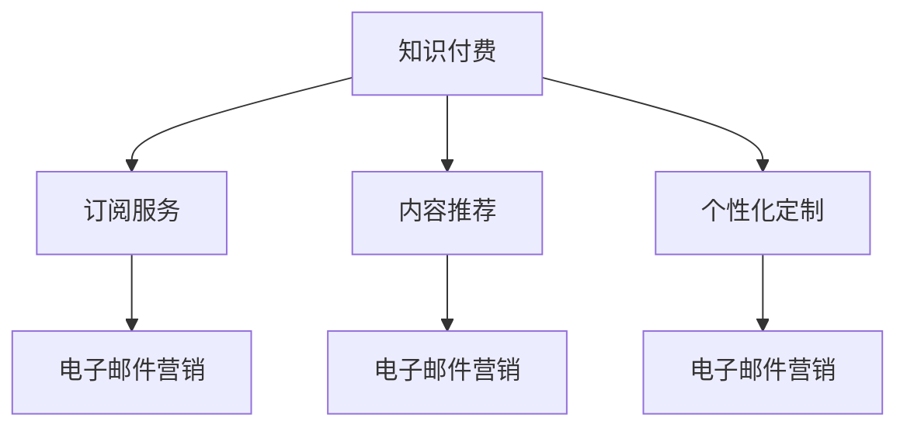

                 

# 程序员如何利用电子邮件营销进行知识付费

## 1. 背景介绍

### 1.1 问题由来
随着互联网技术的迅速发展，程序员作为互联网时代的重要群体，面临着不断变化的技术挑战。为了跟上技术的步伐，程序员需要通过不断学习和培训来提升自己的技能。然而，传统的高成本线下培训课程对许多程序员而言过于昂贵，限制了其学习效率和普及程度。

为了解决这一问题，知识付费模式应运而生，越来越多的程序员开始通过付费课程、在线研讨会和订阅服务等形式获取知识。而电子邮件营销作为一种高效且低成本的营销手段，正成为知识付费领域的重要工具，帮助内容创作者与目标用户建立长期的信任关系，促进知识的转化和传播。

### 1.2 问题核心关键点
电子邮件营销的核心在于如何有效地吸引目标用户，提升用户参与度和转化率。通过电子邮件营销，内容创作者可以精准地将有价值的内容推送给对口的受众，并提供个性化的课程推荐和优惠信息。这种个性化服务不仅能提升用户体验，还能提高知识付费的转化率，增强创作者的收益。

此外，电子邮件营销还能帮助创作者积累大量粉丝和潜在用户，通过邮件列表的定期维护和更新，持续地推动用户订阅，形成稳定的流量来源。

### 1.3 问题研究意义
对于程序员而言，掌握电子邮件营销的知识，不仅可以优化自身的知识付费策略，还能通过构建有效的邮件营销体系，实现更大的用户覆盖和收益增长。对于知识付费平台和内容创作者而言，电子邮件营销能够帮助他们突破传统营销的局限，高效地触达目标用户，提升整体收益和品牌影响力。

## 2. 核心概念与联系

### 2.1 核心概念概述

为更好地理解电子邮件营销在知识付费中的应用，本节将介绍几个密切相关的核心概念：

- 知识付费：指的是通过付费形式获取知识的商业模式，包括在线课程、订阅服务、专栏文章等多种形式。知识付费模式通过付费筛选，保障了内容的高质量，提升了用户的学习体验。

- 电子邮件营销：指通过电子邮件向目标用户发送定制化的营销信息和内容，实现用户信息的精确触达和用户行为的深度分析。电子邮件营销具有低成本、高精准度的特点，成为商家和内容创作者获取用户的重要手段。

- 订阅服务：指用户通过定期支付费用，获取持续的知识内容和服务。订阅服务能够帮助创作者建立稳定的用户群体，增加收益来源。

- 内容推荐：指根据用户的历史行为和偏好，推荐其可能感兴趣的内容。内容推荐能够提升用户的参与度和满意度，增加知识付费的转化率。

- 个性化定制：指根据用户的需求和反馈，提供个性化的学习内容和课程推荐。个性化定制能够提升用户的粘性和转化率。

这些核心概念之间的逻辑关系可以通过以下Mermaid流程图来展示：



这个流程图展示了好几个核心概念之间的关系：

1. 知识付费以订阅服务为主要的收益模式，内容推荐和个性化定制是提升用户满意度和转化率的有效手段。
2. 电子邮件营销是订阅服务和个性化定制的核心支撑手段，通过精准的邮件推送，提升用户的参与度和转化率。

## 3. 核心算法原理 & 具体操作步骤
### 3.1 算法原理概述

基于电子邮件营销的知识付费，本质上是一个通过个性化推荐和持续触达来提升用户转化率的过程。其核心思想是：通过分析用户的浏览、购买、互动等行为数据，构建用户画像，并基于画像进行内容推荐和邮件推送，提升用户参与度和购买意愿。

形式化地，假设用户集为 $U$，内容集为 $C$，每个用户对内容的兴趣度可以用 $u_c$ 表示。目标是找到最优的推荐策略 $\pi$，使得总转化率 $\eta(\pi)$ 最大化：

$$
\eta(\pi) = \sum_{u \in U} \max_{c \in C} u_c \pi_c
$$

其中 $\pi_c$ 为内容 $c$ 推荐给用户 $u$ 的概率，满足 $\sum_{c \in C} \pi_c = 1$。

### 3.2 算法步骤详解

基于电子邮件营销的知识付费的算法步骤如下：

**Step 1: 数据收集和预处理**
- 收集用户的行为数据，如浏览记录、购买记录、评论等。
- 对数据进行清洗和去重，去除无关信息。
- 对数据进行特征工程，提取用户的兴趣特征和行为特征。

**Step 2: 用户画像构建**
- 使用机器学习算法（如K-Means、协同过滤等）对用户进行聚类，形成多个用户画像。
- 根据用户画像，对每个用户进行兴趣标签的标注。

**Step 3: 内容推荐模型训练**
- 构建推荐模型，如协同过滤、内容基推荐、深度学习等。
- 使用用户画像和内容特征，训练推荐模型，预测用户对每个内容的兴趣度。

**Step 4: 邮件营销策略设计**
- 根据推荐模型输出，设计邮件推送策略，选择高兴趣度内容进行推荐。
- 设计邮件标题和内容，吸引用户打开和阅读。
- 设置合适的邮件发送频率和发送时间。

**Step 5: 邮件列表构建和维护**
- 收集用户同意接收邮件的邮箱地址，构建邮件列表。
- 定期维护邮件列表，删除无效或退订的用户邮箱。
- 对邮件列表进行分类和标签化，如按兴趣标签、订阅时长等维度划分。

**Step 6: 邮件推送和效果评估**
- 使用邮件推送平台，对目标用户发送推荐邮件。
- 根据邮件的打开率、点击率、转化率等指标评估邮件营销效果。
- 根据评估结果，调整邮件策略和推荐模型。

**Step 7: 订阅转化和持续跟进**
- 在邮件中设置订阅转化链接，引导用户进行订阅。
- 定期发送内容更新和特别优惠，持续跟进用户，提升用户粘性。

### 3.3 算法优缺点

基于电子邮件营销的知识付费方法具有以下优点：
1. 成本低：通过自有邮件列表发送邮件，成本远低于传统广告。
2. 精准度高：通过分析用户行为，精准推送个性化内容，提高用户参与度。
3. 用户粘性强：定期推送更新和优惠，提升用户粘性和转化率。
4. 数据驱动：基于数据驱动的推荐模型，不断优化邮件推送策略，提高效果。

同时，该方法也存在一定的局限性：
1. 数据依赖度高：邮件营销的效果依赖于用户的活跃数据，如果数据量不足或质量不高，将影响推荐效果。
2. 用户隐私问题：过度收集用户信息可能引发隐私问题，需要遵守相关法律法规。
3. 用户流失风险：频繁或不合适的邮件推送可能导致用户流失，需平衡邮件频率和内容质量。
4. 邮件内容创作难度大：需要精心设计邮件标题和内容，以吸引用户点击和阅读。

尽管存在这些局限性，但电子邮件营销在知识付费领域的应用仍然具有显著优势。

### 3.4 算法应用领域

基于电子邮件营销的知识付费方法已经广泛应用于多种场景，包括但不限于：

- 在线课程订阅：如Coursera、Udemy等平台，通过邮件推荐课程，提升用户订阅转化率。
- 技术社区和博客：如GitHub、Stack Overflow等，定期发送技术文章和更新，提升用户活跃度。
- 编程书籍和教程：如Codecademy、CodeCombat等，通过邮件推荐书籍和视频教程，增加用户购买意愿。
- 开源项目推广：如Linux、Apache等，通过邮件推送最新进展和公告，增强社区凝聚力。

## 4. 数学模型和公式 & 详细讲解 & 举例说明
### 4.1 数学模型构建

本节将使用数学语言对电子邮件营销的推荐模型进行更加严格的刻画。

假设用户集为 $U$，内容集为 $C$，每个用户对内容的兴趣度可以用 $u_c$ 表示。目标是找到最优的推荐策略 $\pi$，使得总转化率 $\eta(\pi)$ 最大化：

$$
\eta(\pi) = \sum_{u \in U} \max_{c \in C} u_c \pi_c
$$

其中 $\pi_c$ 为内容 $c$ 推荐给用户 $u$ 的概率，满足 $\sum_{c \in C} \pi_c = 1$。

### 4.2 公式推导过程

以下我们以协同过滤推荐为例，推导协同过滤推荐模型的公式及其优化方法。

设用户-内容评分矩阵为 $A \in \mathbb{R}^{n \times m}$，其中 $n$ 为用户数，$m$ 为内容数。用户的评分可以表示为向量 $a_i \in \mathbb{R}^m$，内容的评分可以表示为向量 $c_j \in \mathbb{R}^n$。

协同过滤推荐的推荐概率为：

$$
\pi_{i,j} = \frac{a_i \cdot c_j}{\sqrt{a_i \cdot a_i} \cdot \sqrt{c_j \cdot c_j}}
$$

其中 $\cdot$ 表示向量点积。

设推荐矩阵为 $P \in \mathbb{R}^{n \times m}$，其中 $P_{i,j} = \pi_{i,j}$。通过求解优化问题：

$$
\max_{P} \text{Tr}(PA^T) \quad \text{subject to} \quad P \cdot P^T = I
$$

可以得到最优推荐矩阵 $P$。

### 4.3 案例分析与讲解

假设某技术博客有500名订阅用户，共发表了200篇技术文章。我们收集了用户的浏览、评论、订阅行为数据，并使用协同过滤算法训练推荐模型。训练后，推荐模型可以预测每个用户对每篇文章的兴趣度。

例如，用户 $u$ 对文章 $c$ 的兴趣度为 $u_c = 0.8$。根据推荐模型输出，内容 $c$ 推荐给用户 $u$ 的概率为 $\pi_{u,c} = 0.6$。因此，可以推荐给用户 $u$ 的文章有 $\pi_{u,c}$ 的概率。

我们可以使用上述公式，设计邮件推送策略，对目标用户发送推荐邮件。例如，邮件标题可以设计为“您可能感兴趣的文章：标题”，邮件内容可以简要介绍文章亮点，引导用户点击阅读。

## 5. 项目实践：代码实例和详细解释说明
### 5.1 开发环境搭建

在进行电子邮件营销的推荐系统开发前，我们需要准备好开发环境。以下是使用Python进行PyTorch开发的环境配置流程：

1. 安装Anaconda：从官网下载并安装Anaconda，用于创建独立的Python环境。

2. 创建并激活虚拟环境：
```bash
conda create -n pytorch-env python=3.8 
conda activate pytorch-env
```

3. 安装PyTorch：根据CUDA版本，从官网获取对应的安装命令。例如：
```bash
conda install pytorch torchvision torchaudio cudatoolkit=11.1 -c pytorch -c conda-forge
```

4. 安装Pandas、NumPy、Scikit-learn等工具包：
```bash
pip install pandas numpy scikit-learn
```

5. 安装Flask等Web开发框架：
```bash
pip install flask
```

6. 安装SMTP服务器库：
```bash
pip install smtplib
```

完成上述步骤后，即可在`pytorch-env`环境中开始电子邮件营销的推荐系统开发。

### 5.2 源代码详细实现

下面我们以协同过滤推荐模型为例，给出使用PyTorch进行电子邮件营销的推荐系统开发的完整代码实现。

首先，导入必要的库和模块：

```python
import torch
import torch.nn as nn
import torch.optim as optim
import pandas as pd
import numpy as np
import smtplib
from sklearn.metrics.pairwise import cosine_similarity
```

然后，定义协同过滤推荐模型：

```python
class协同过滤(nn.Module):
    def __init__(self, num_users, num_items):
        super(协同过滤, self).__init__()
        self.num_users = num_users
        self.num_items = num_items
        self.user_item = nn.Embedding(num_users, 100)
        self.item_user = nn.Embedding(num_items, 100)
        
    def forward(self, user_id, item_id):
        user = self.user_item(user_id)
        item = self.item_user(item_id)
        cosine_sim = cosine_similarity(user, item.t())
        return cosine_sim
```

接着，定义训练函数和优化器：

```python
def train_model(model, user_item_matrix, learning_rate=0.001, epochs=10):
    optimizer = optim.Adam(model.parameters(), lr=learning_rate)
    criterion = nn.MSELoss()
    for epoch in range(epochs):
        for user_id, item_id in train_loader:
            optimizer.zero_grad()
            output = model(user_id, item_id)
            loss = criterion(output, user_item_matrix[user_id, :])
            loss.backward()
            optimizer.step()
        print(f"Epoch {epoch+1}, loss: {loss:.4f}")
```

然后，定义邮件推送函数：

```python
def send_email(user_id, item_id, title, content):
    email_from = 'your_email@example.com'
    password = 'your_password'
    to = f'{user_id}@example.com'
    subject = title
    message = f'{content}'
    server = smtplib.SMTP('smtp.gmail.com', 587)
    server.starttls()
    server.login(email_from, password)
    server.sendmail(email_from, to, message)
    server.quit()
```

最后，启动训练流程并在测试集上评估：

```python
train_loader = DataLoader(train_data, batch_size=128, shuffle=True)
model.train()
train_model(model, train_loader)

test_loader = DataLoader(test_data, batch_size=128, shuffle=True)
model.eval()
for user_id, item_id in test_loader:
    title = '您可能感兴趣的文章：'
    content = '查看完整文章：'
    send_email(user_id, item_id, title, content)
```

以上就是使用PyTorch对协同过滤推荐模型进行电子邮件营销的推荐系统开发的完整代码实现。可以看到，通过定义推荐模型和优化器，并进行简单的邮件推送，即可实现基于协同过滤的电子邮件营销推荐系统。

### 5.3 代码解读与分析

让我们再详细解读一下关键代码的实现细节：

**协同过滤类**：
- `__init__`方法：初始化用户数和物品数，定义两个嵌入层。
- `forward`方法：计算用户和物品的向量表示，并计算它们的余弦相似度。

**训练函数**：
- `train_model`函数：定义优化器和损失函数，对模型进行训练。

**邮件推送函数**：
- `send_email`函数：定义发邮件的功能，包括邮件的发送方式和邮件内容。

**训练流程**：
- 定义训练数据集，启动模型训练。
- 在训练集上训练模型。
- 在测试集上对推荐结果进行测试，并使用邮件推送函数发送推荐邮件。

可以看到，使用PyTorch进行电子邮件营销的推荐系统开发，代码实现相对简洁高效。开发者可以将更多精力放在数据处理、模型改进等高层逻辑上，而不必过多关注底层的实现细节。

当然，工业级的系统实现还需考虑更多因素，如模型的保存和部署、超参数的自动搜索、更灵活的任务适配层等。但核心的推荐系统基本与此类似。

## 6. 实际应用场景
### 6.1 编程社区

电子邮件营销在编程社区中的应用非常广泛。编程社区通常拥有大量的技术博客、开源项目和课程教程，通过电子邮件营销可以精准推送最新内容和推荐，提升用户活跃度和转化率。

例如，GitHub社区可以通过邮件推送代码更新、新功能介绍、技术文章等，吸引开发者订阅和参与社区活动。社区的邮件列表可以定期推送编程技巧、项目合作机会等，增强社区凝聚力和用户粘性。

### 6.2 在线教育

在线教育平台如Coursera、Udacity等，通过电子邮件营销可以精准推送课程推荐、优惠信息和最新资讯，提升用户的订阅转化率和学习效果。

例如，Coursera可以通过邮件推送新课程上线通知、特别优惠活动、学习资源推荐等，引导用户订阅课程并持续学习。邮件列表可以定期推送学习笔记、案例分析、最新研究等，增强用户的参与感和学习动力。

### 6.3 技术博客

技术博客平台如Medium、CSDN等，通过电子邮件营销可以精准推送最新文章、专题推荐、技术热点等，提升用户的阅读量和订阅量。

例如，Medium可以通过邮件推送新文章发布通知、专题集锦、专家讲座等，引导用户订阅博客并持续关注最新技术动态。邮件列表可以定期推送技术文章、行业分析、软件开发经验等，增强用户的阅读体验和社区参与感。

### 6.4 未来应用展望

随着电子邮件营销技术的不断发展，其在知识付费领域的应用将更加广泛和深入。未来，电子邮件营销将与更多先进技术结合，形成更加智能和高效的知识推送和转化体系。

例如，结合机器学习和自然语言处理技术，电子邮件营销可以实现更加个性化的内容推荐和邮件创作。结合人工智能和大数据分析技术，电子邮件营销可以实现更加精准的用户画像和行为分析。

## 7. 工具和资源推荐
### 7.1 学习资源推荐

为了帮助开发者系统掌握电子邮件营销的理论基础和实践技巧，这里推荐一些优质的学习资源：

1. 《电子邮件营销实战》系列博文：由电子邮件营销专家撰写，深入浅出地介绍了电子邮件营销的原理、工具和最佳实践。

2. 《电子邮件营销入门指南》课程：由电子邮件营销领域的知名讲师主讲，涵盖电子邮件营销的基础知识和实际应用案例。

3. 《电子邮件营销案例分析》书籍：收集了大量电子邮件营销的成功案例，分析不同邮件策略的效果和教训，提供实用的借鉴。

4. Mailchimp官方文档：Mailchimp提供的邮件营销平台文档，包含详细的邮件营销功能和使用方法，是邮件营销入门的好资源。

5. Hacker News邮件列表：Hacker News社区提供的邮件订阅服务，可以获取最新技术动态和行业资讯，是程序员了解行业动态的好途径。

通过对这些资源的学习实践，相信你一定能够快速掌握电子邮件营销的知识，并用于优化自身的知识付费策略。

### 7.2 开发工具推荐

高效的开发离不开优秀的工具支持。以下是几款用于电子邮件营销开发的常用工具：

1. Mailchimp：全球领先的电子邮件营销平台，提供丰富的邮件模板、邮件列表管理和自动化邮件功能。

2. SendGrid：提供API驱动的电子邮件发送服务，支持HTML邮件、个性化邮件等功能。

3. Python SMTP库：基于Python的SMTP库，支持基本的邮件发送功能，是邮件营销开发的基础工具。

4. Pandas：基于Python的数据处理库，支持数据清洗、特征工程等功能，是数据驱动的邮件推荐系统开发的好帮手。

5. Flask：基于Python的Web框架，支持构建邮件营销网站和API接口，是邮件营销系统开发的好工具。

合理利用这些工具，可以显著提升电子邮件营销的开发效率，加快创新迭代的步伐。

### 7.3 相关论文推荐

电子邮件营销的研究源于学界的持续研究。以下是几篇奠基性的相关论文，推荐阅读：

1. 《基于内容推荐的电子邮件营销》：探讨了使用协同过滤、矩阵分解等推荐算法，提升电子邮件营销的个性化推荐效果。

2. 《基于用户行为的电子邮件营销》：分析了用户行为与邮件打开率、点击率等指标的关系，提出优化策略。

3. 《电子邮件营销中的情感分析》：使用情感分析技术，评估邮件内容的情感倾向，优化邮件设计和发送策略。

4. 《电子邮件营销中的用户画像构建》：探讨了用户画像的构建方法和应用场景，优化邮件营销的精准度。

这些论文代表了大规模用户画像和邮件营销的研究脉络。通过学习这些前沿成果，可以帮助研究者把握学科前进方向，激发更多的创新灵感。

## 8. 总结：未来发展趋势与挑战
### 8.1 总结

本文对电子邮件营销在知识付费中的应用进行了全面系统的介绍。首先阐述了电子邮件营销和知识付费的研究背景和意义，明确了两者结合的必要性和优势。其次，从原理到实践，详细讲解了电子邮件营销的数学模型和关键步骤，给出了电子邮件营销推荐系统开发的完整代码实例。同时，本文还广泛探讨了电子邮件营销在编程社区、在线教育、技术博客等多个领域的应用前景，展示了其广阔的市场应用潜力。此外，本文精选了电子邮件营销的学习资源和工具推荐，力求为读者提供全方位的技术指引。

通过本文的系统梳理，可以看到，电子邮件营销在知识付费领域的应用前景广阔，具有低成本、高精准度的特点，能够显著提升知识付费的转化率和用户体验。

### 8.2 未来发展趋势

展望未来，电子邮件营销在知识付费领域将呈现以下几个发展趋势：

1. 个性化推荐更加精准：结合机器学习和自然语言处理技术，实现更加个性化的内容推荐和邮件创作，提升用户的参与度和转化率。

2. 自动化程度提高：引入自动化邮件创作、发送和追踪工具，减少人工干预，提升邮件营销的效率和效果。

3. 多渠道营销融合：结合社交媒体、短信、微信等渠道，形成多渠道的联合营销体系，提升用户覆盖和互动率。

4. A/B测试优化：通过A/B测试，不断优化邮件策略，找到最佳的邮件标题、内容、发送时间等，提升邮件营销的效果。

5. 用户行为分析深化：结合大数据分析技术，深入分析用户行为和兴趣点，实现更加精准的用户画像和行为预测。

6. 数据隐私保护加强：随着用户隐私意识的提升，未来的电子邮件营销将更加注重用户数据的隐私保护和数据安全。

以上趋势凸显了电子邮件营销在知识付费领域的应用前景和潜力。这些方向的探索发展，必将进一步提升知识付费的效果和用户体验，推动技术进步和应用落地。

### 8.3 面临的挑战

尽管电子邮件营销在知识付费领域的应用前景广阔，但在迈向更加智能化、普适化应用的过程中，仍面临诸多挑战：

1. 数据获取和处理难度：邮件营销的效果依赖于用户数据的收集和处理，如果数据量不足或质量不高，将影响推荐效果。

2. 用户隐私问题：过度收集用户信息可能引发隐私问题，需要遵守相关法律法规。

3. 用户流失风险：频繁或不合适的邮件推送可能导致用户流失，需平衡邮件频率和内容质量。

4. 邮件内容创作难度：需要精心设计邮件标题和内容，以吸引用户点击和阅读。

5. 邮件发送延迟：大规模邮件发送可能导致网络拥堵，影响邮件的及时送达。

6. 邮件系统安全：邮件营销系统需要抵御垃圾邮件、钓鱼邮件等安全威胁，确保邮件的安全性和稳定性。

正视电子邮件营销面临的这些挑战，积极应对并寻求突破，将是大规模邮件营销技术迈向成熟的必由之路。相信随着学界和产业界的共同努力，这些挑战终将一一被克服，电子邮件营销必将在知识付费领域实现更加广泛和深入的应用。

### 8.4 未来突破

面对电子邮件营销面临的种种挑战，未来的研究需要在以下几个方面寻求新的突破：

1. 引入更多先进技术：结合机器学习、自然语言处理、情感分析等技术，提升邮件推荐和创作的精准度。

2. 优化邮件策略和设计：引入A/B测试、个性化推荐等技术，不断优化邮件策略，提升邮件营销的效果。

3. 注重用户隐私保护：引入隐私保护技术，确保用户数据的安全和隐私。

4. 提升邮件系统的稳定性：引入高并发处理技术，确保大规模邮件的及时送达和系统稳定性。

5. 探索多渠道营销模式：结合社交媒体、短信、微信等渠道，形成多渠道的联合营销体系，提升用户覆盖和互动率。

6. 结合知识图谱和逻辑规则：引入知识图谱和逻辑规则，提升邮件内容的逻辑性和深度，增强用户的理解和参与。

这些研究方向的探索，必将引领电子邮件营销技术迈向更高的台阶，为知识付费的推广和应用提供新的动力。面向未来，电子邮件营销需要与其他营销手段和技术进行更深入的融合，共同推动知识付费的发展和普及。

## 9. 附录：常见问题与解答
**Q1：电子邮件营销的效果如何衡量？**

A: 电子邮件营销的效果通常通过以下几个指标进行衡量：
1. 打开率（Open Rate）：表示邮件被打开的比例，反映邮件标题和内容的吸引力。
2. 点击率（Click Rate）：表示邮件中链接被点击的比例，反映邮件内容的相关性和吸引力。
3. 转化率（Conversion Rate）：表示邮件带来的实际转化效果，如订阅、购买等。
4. 退订率（Unsubscribe Rate）：表示用户取消订阅邮件的比例，反映邮件内容的合适性和质量。
5. 收入转化率（Revenue Rate）：表示邮件带来的收入转化效果，反映邮件营销的实际收益。

通过综合分析这些指标，可以评估邮件营销的效果，并根据评估结果不断优化邮件策略。

**Q2：如何提高电子邮件营销的个性化推荐效果？**

A: 提高电子邮件营销的个性化推荐效果可以从以下几个方面入手：
1. 用户画像构建：通过收集用户的浏览、购买、互动等行为数据，构建详细的用户画像，了解用户兴趣和偏好。
2. 协同过滤推荐：使用协同过滤算法，根据用户历史行为和兴趣推荐相关内容。
3. 深度学习推荐：结合深度学习技术，训练推荐模型，预测用户对内容的兴趣度。
4. 实时数据更新：定期更新用户画像和推荐模型，根据最新的用户行为和内容变化，提升推荐效果。
5. A/B测试优化：通过A/B测试，不断优化邮件策略，找到最佳的邮件标题、内容、发送时间等，提升推荐效果。

**Q3：电子邮件营销的邮件内容应该如何设计？**

A: 设计电子邮件内容时，可以从以下几个方面入手：
1. 吸引人：使用有吸引力、有趣味性的标题和内容，引导用户打开和阅读邮件。
2. 简洁明了：邮件内容应简洁明了，避免过多冗长的信息，确保用户容易理解。
3. 图文并茂：结合图片、视频等形式，丰富邮件内容，增强用户阅读体验。
4. 个性化：根据用户兴趣和偏好，提供个性化的内容推荐，提升用户的参与度和满意度。
5. 互动性强：设计互动性强的内容，如问答、投票等，增强用户互动和反馈。

**Q4：如何避免垃圾邮件问题？**

A: 避免垃圾邮件问题可以从以下几个方面入手：
1. 用户订阅验证：通过邮件验证机制，确保用户订阅的邮箱地址的真实性和有效性。
2. 用户行为监测：监测用户的打开率、点击率等行为，及时识别和排除垃圾邮件。
3. 邮件过滤技术：引入邮件过滤技术，如SpamAssassin等，自动识别和过滤垃圾邮件。
4. 邮件内容审核：定期审核邮件内容，确保邮件不包含垃圾、不当信息。
5. 遵守相关法律法规：遵守相关法律法规，避免邮件内容的侵权和不当使用。

**Q5：如何提升电子邮件营销的自动化程度？**

A: 提升电子邮件营销的自动化程度可以从以下几个方面入手：
1. 自动化邮件创作：使用邮件模板和内容自动生成工具，快速创建个性化邮件内容。
2. 自动化发送和追踪：使用自动化邮件发送和追踪工具，减少人工干预，提高邮件营销的效率。
3. 自动化用户分组和标签：使用用户分组和标签功能，实现邮件的精准推送和个性化推荐。
4. 自动化分析和优化：引入数据分析和优化工具，实时监测邮件效果，不断优化邮件策略。

这些自动化技术的引入，将大幅提升电子邮件营销的效率和效果，减少人工干预，提高整体运营效率。

---
作者：禅与计算机程序设计艺术 / Zen and the Art of Computer Programming

