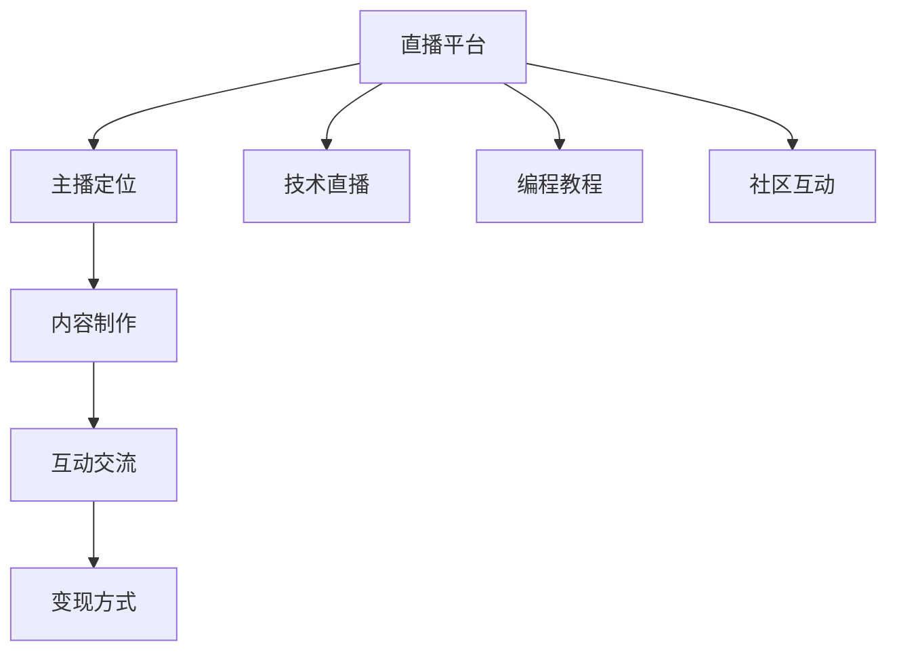

                 

## 1. 背景介绍

### 1.1 问题由来

在互联网飞速发展的今天，直播平台逐渐成为信息传播和知识分享的重要渠道。程序员作为互联网技术的重要参与者，拥有丰富的技术储备和编程经验，直播平台成为他们展示专业技能、传授知识的绝佳平台。通过直播，程序员不仅能够与更多人分享自己的编程经验和技术见解，还可以通过变现获取经济收益，达到知识与财富的双重收获。

### 1.2 问题核心关键点

利用直播平台进行知识变现的关键点主要包括以下几点：
- 选择合适的直播平台和主播定位：不同的直播平台用户群体不同，需要根据自身的技术专长和粉丝偏好选择合适的平台，并确定自己的主播定位。
- 内容规划和制作：内容是直播的核心，需要有系统的内容规划，同时制作高质量的直播视频或音频。
- 互动和交流：与观众进行互动是直播的重要部分，通过解答问题、互动交流等方式增加观众的黏性。
- 变现方式：了解直播平台的变现规则，选择合适的变现方式，如打赏、课程销售、付费咨询等。

### 1.3 问题研究意义

利用直播平台进行知识变现具有以下几个重要意义：
- 提升个人品牌价值：通过直播分享技术知识，可以提升个人的品牌知名度和影响力。
- 实现知识变现：利用个人技术专长进行变现，不仅可以提升收入，还可以激励自己不断学习和进步。
- 促进技术传播：通过直播平台，可以将技术知识传递给更多的人，促进技术传播和创新。
- 拓展职业发展：直播变现也可以为职业转型、创业等提供支持。

## 2. 核心概念与联系

### 2.1 核心概念概述

为更好地理解如何利用直播平台进行知识变现，本节将介绍几个密切相关的核心概念：

- 直播平台：指能够实时传输音频、视频等内容的互联网平台，如Bilibili、抖音、YouTube等。
- 主播定位：指主播根据自身兴趣和粉丝群体，确定其直播内容和风格，如技术讲解、编程教程、编程答疑等。
- 内容制作：指主播根据直播主题，制作高质量的直播内容，如脚本撰写、视频剪辑、音频处理等。
- 互动交流：指主播通过与观众的互动，增加观众的参与感和黏性，提升直播效果。
- 变现方式：指主播在直播过程中通过各种方式获取收入，如打赏、课程销售、付费咨询等。

- 技术直播：指结合编程技术的直播内容，如技术讲解、编程答疑、编程实战等。
- 编程教程：指通过直播平台分享的编程课程，内容可以包括基础编程、进阶技巧、项目实战等。
- 社区互动：指主播通过直播平台与粉丝互动，建立紧密的社区关系，增加粉丝的忠诚度。

这些核心概念之间的逻辑关系可以通过以下Mermaid流程图来展示：



这个流程图展示了大语言模型的核心概念及其之间的关系：

1. 直播平台作为基础设施，支持主播内容的传输和互动。
2. 主播定位决定主播的内容方向和风格。
3. 内容制作是直播质量的重要保障。
4. 互动交流提升观众的参与度和忠诚度。
5. 变现方式则是主播经济收入的来源。
6. 技术直播和编程教程是主播的核心内容。
7. 社区互动是建立粉丝关系的重要手段。

这些核心概念共同构成了直播知识变现的框架，主播需要根据自身的特点和观众的需求，合理规划和执行各个环节，才能取得良好的效果。

## 3. 核心算法原理 & 具体操作步骤

### 3.1 算法原理概述

利用直播平台进行知识变现，本质上是一个内容变现的过程。主播通过制作和分享有价值的内容，吸引观众的关注和支持，通过各种变现方式获取收入。

形式化地，设主播制作的内容集为 $C$，观众集为 $A$，内容价值函数为 $v(C)$，观众支持的意愿函数为 $s(A)$。直播变现的目标是最大化主播和观众双方的收益，即：

$$
\max_{C, A} (v(C) \cdot s(A))
$$

具体来说，主播需要通过内容制作和互动交流，提升观众的参与度和满意度，从而增加观众的支持意愿 $s(A)$。同时，主播需要选择合适的变现方式，最大化变现收益 $v(C)$。

### 3.2 算法步骤详解

基于上述原理，利用直播平台进行知识变现的具体步骤如下：

**Step 1: 选择合适的直播平台和主播定位**

- 了解不同直播平台的用户群体和特点，如B站适合技术讲解和编程教程，抖音适合短视频内容。
- 根据自身的技术专长和粉丝偏好，确定直播内容和风格，如面向初学者、面向专业人士等。

**Step 2: 制定内容规划和制作策略**

- 规划直播内容的主题和目标受众，如编程基础、项目实战、技术分析等。
- 制作高质量的直播视频或音频，确保内容的清晰度和专业性。
- 使用合适的工具和软件进行内容编辑和处理，如剪辑视频、配音解说等。

**Step 3: 与观众互动交流**

- 在直播过程中积极与观众互动，解答问题，增加观众的参与感和黏性。
- 定期收集观众的反馈意见，根据观众的需求调整内容方向。
- 通过社区互动工具，建立和管理粉丝群体，增加观众的忠诚度。

**Step 4: 选择合适的变现方式**

- 了解直播平台的变现规则，选择适合自己的变现方式，如打赏、课程销售、付费咨询等。
- 合理定价和包装课程或咨询服务，提升观众的购买意愿。
- 利用直播平台提供的变现工具，如购物车、打赏按钮等，便捷地完成变现操作。

### 3.3 算法优缺点

利用直播平台进行知识变现具有以下优点：
1. 灵活性高：主播可以自主安排直播时间，随时随地进行内容创作和分享。
2. 互动性强：主播能够与观众实时互动，增加观众的参与感和黏性。
3. 成本低廉：主播只需要一个电脑、摄像头等基本设备，即可进行高质量的直播。
4. 变现多样化：主播可以选择多种变现方式，如打赏、课程销售、付费咨询等。

同时，该方法也存在以下局限性：
1. 对主播的要求高：主播需要具备较高的技术水平和表达能力，才能制作高质量的直播内容。
2. 市场竞争激烈：直播平台用户众多，主播需要具备一定的竞争力，才能在激烈的市场竞争中脱颖而出。
3. 时间和精力投入大：主播需要投入大量时间和精力进行内容制作和互动交流，对主播的精力和能力提出了较高要求。
4. 粉丝忠诚度需要长期维护：主播需要持续进行内容更新和互动，才能维持粉丝的忠诚度和参与度。

### 3.4 算法应用领域

基于直播平台的知识变现方法，在技术社区、教育培训、IT咨询等多个领域已经得到了广泛的应用，覆盖了几乎所有常见场景，例如：

- 技术社区：通过技术讲解和编程答疑，与社区成员互动，解答技术问题。
- 教育培训：通过课程分享和项目实战，传授编程知识和技能，提供持续的学习支持。
- IT咨询：通过技术分析和项目咨询，提供专业建议和解决方案，帮助客户解决问题。
- 软件开发：通过开源项目和代码分享，展示自己的技术实力，提升个人品牌价值。
- 编程教学：通过编程实战和案例分析，教授编程技巧，提升学生的编程能力。

除了上述这些经典场景外，直播变现还催生了更多的创新应用，如技术讲解直播、编程代码直播、技术分享会等，为技术传播和创新提供了新的途径。

## 4. 数学模型和公式 & 详细讲解 & 举例说明

### 4.1 数学模型构建

本节将使用数学语言对直播变现的过程进行更加严格的刻画。

设直播平台的用户集为 $A$，主播的内容集为 $C$，观众的支持意愿函数为 $s(A)$，主播的内容价值函数为 $v(C)$。直播变现的目标是最大化观众的支持意愿和主播的内容价值，即：

$$
\max_{C, A} (v(C) \cdot s(A))
$$

在实践中，我们可以使用效用函数来表示观众的支持意愿和主播的内容价值，如：

$$
u(A, C) = v(C) \cdot s(A)
$$

观众的支持意愿 $s(A)$ 可以基于观众的参与度、互动反馈等因素进行建模。主播的内容价值 $v(C)$ 可以基于内容的独特性、专业性、更新频率等因素进行建模。

### 4.2 公式推导过程

以下我们以编程教程直播为例，推导直播变现的效用函数及其计算公式。

设主播在某个时间点提供的编程教程内容为 $C_t$，观众的参与度为 $p_t$，观众的支持意愿函数为 $s(p_t)$，主播的内容价值函数为 $v(C_t)$。观众的支持意愿可以表示为：

$$
s(p_t) = \exp(-\alpha \cdot p_t + \beta)
$$

其中 $\alpha$ 和 $\beta$ 为模型参数，表示参与度的影响系数和基准支持意愿。主播的内容价值可以表示为：

$$
v(C_t) = \gamma \cdot f(C_t)
$$

其中 $\gamma$ 为模型参数，表示内容的权重系数，$f(C_t)$ 为内容的价值函数，可以根据内容的专业性、更新频率等因素进行建模。

假设观众的参与度与主播的互动次数 $i_t$ 成正比，即 $p_t = \delta \cdot i_t$，其中 $\delta$ 为比例系数。观众的支持意愿函数可以进一步表示为：

$$
s(p_t) = \exp(-\alpha \cdot (\delta \cdot i_t) + \beta)
$$

直播变现的效用函数可以表示为：

$$
u(A, C_t) = v(C_t) \cdot s(p_t) = \gamma \cdot f(C_t) \cdot \exp(-\alpha \cdot (\delta \cdot i_t) + \beta)
$$

通过最大化效用函数 $u(A, C_t)$，可以优化直播变现的效果。在实践中，可以通过调整参与度、互动次数、内容价值等参数，找到最佳的直播内容和互动策略，达到最优的变现效果。

### 4.3 案例分析与讲解

假设某技术社区的主播提供了一门Python编程教程直播，观众的参与度与主播互动次数成正比，内容的价值函数为内容的专业性 $f(C_t)$，参与度与互动次数的比例系数为 $\delta$，观众的支持意愿函数为 $s(p_t) = \exp(-0.1 \cdot (\delta \cdot i_t) + 5)$，内容价值函数为 $v(C_t) = 1.5 \cdot f(C_t)$，内容的专业性可以表示为 $f(C_t) = 0.8 + 0.2 \cdot C_t$。

主播需要在某个时间点 $t$ 提供内容 $C_t$，观众的参与度为 $p_t = 100 \cdot i_t$，互动次数为 $i_t = 50$。

根据上述模型，计算直播变现的效用函数 $u(A, C_t)$：

$$
u(A, C_t) = \gamma \cdot (0.8 + 0.2 \cdot C_t) \cdot \exp(-0.1 \cdot (100 \cdot 50) + 5) = 0.8 \cdot \exp(5) \cdot \exp(-50 \cdot 0.1)
$$

通过最大化效用函数，可以找到最优的直播内容 $C_t$ 和互动次数 $i_t$，达到最佳的直播变现效果。

## 5. 项目实践：代码实例和详细解释说明

### 5.1 开发环境搭建

在进行直播变现实践前，我们需要准备好开发环境。以下是使用Python进行Twitch直播实践的环境配置流程：

1. 安装Twitch Developer Tools：从官网下载并安装Twitch Developer Tools，用于创建直播应用和获取直播权限。
2. 创建直播应用：在Twitch Developer Portal上创建直播应用，并获取相应的API密钥和访问令牌。
3. 安装相关库：
```python
pip install twitchio
pip install requests
```

完成上述步骤后，即可在本地环境中开始直播实践。

### 5.2 源代码详细实现

这里我们以Twitch直播为例，给出使用Python进行编程教程直播的Twitchio库代码实现。

首先，定义直播类的基类：

```python
from twitchio.ext import commands
import requests

class BaseStreamer(commands.Bot):
    def __init__(self, config):
        super().__init__(config['bot_name'], **config)
        self.load_commands()

    async def on_ready(self):
        print(f'Logged in as {self.name}')
```

然后，定义编程教程直播的子类：

```python
class PythonTutorialStreamer(BaseStreamer):
    def __init__(self, config):
        super().__init__(config)
        self.tutorial_url = config['tutorial_url']
        self.practice_url = config['practice_url']
        self.tutorial_text = config['tutorial_text']
        self.practice_text = config['practice_text']

    async def on_message(self, message):
        if message.content.startswith('!tutorial'):
            await self.send_tutorial()
        elif message.content.startswith('!practice'):
            await self.send_practice()

    async def send_tutorial(self):
        await self.say(self.tutorial_text)
        await self.practice()

    async def send_practice(self):
        await self.say(self.practice_text)
        await self.practice()

    async def practice(self):
        practice_url = self.practice_url
        practice_text = '欢迎进入Python编程实战环节，请访问链接：' + practice_url
        await self.say(practice_text)

    def load_commands(self):
        self.add_command('!tutorial', self.send_tutorial)
        self.add_command('!practice', self.send_practice)
```

最后，启动直播流程：

```python
import os
import json

config = json.load(open('config.json'))
streamer = PythonTutorialStreamer(config)

loop = asyncio.get_event_loop()
loop.run_until_complete(streamer.connect(config['oauth']))
loop.run_forever()
```

以上就是使用Python进行编程教程直播的Twitchio库代码实现。可以看到，通过Twitchio库，主播可以很方便地进行直播内容的控制和互动管理。

### 5.3 代码解读与分析

让我们再详细解读一下关键代码的实现细节：

**BaseStreamer类**：
- `on_ready`方法：在Bot对象创建后打印登录信息。
- `load_commands`方法：加载自定义命令，用于主播控制直播内容。

**PythonTutorialStreamer类**：
- `send_tutorial`方法：发送编程教程，并跳转到实战环节。
- `send_practice`方法：发送编程实战，并跳转到实战环节。
- `practice`方法：提示观众访问实战链接。

**config.json配置文件**：
- 包括直播应用名、API密钥、访问令牌、教程链接、实战链接、教程和实战文本等配置信息。

主播可以通过配置文件中的参数，灵活控制直播内容和互动环节。同时，Twitchio库还提供了多种控制命令，如聊天、观看者管理、订阅管理等，方便主播进行全面的直播管理。

## 6. 实际应用场景

### 6.1 技术社区

技术社区是程序员利用直播平台进行知识变现的重要场景之一。通过技术社区直播，程序员可以分享自己的编程经验和项目实战，与社区成员互动，解答技术问题。这不仅能够提升自身的品牌知名度和影响力，还能够通过直播变现获得经济收益。

在技术社区直播中，主播需要根据社区成员的需求，制定合理的直播内容和互动策略，最大化观众的支持意愿和内容价值。通过不断地内容创新和互动优化，主播可以吸引更多的观众关注和支持，实现知识变现。

### 6.2 教育培训

教育培训是利用直播平台进行知识变现的重要应用领域。程序员可以通过直播分享编程课程和技术讲解，帮助学生提升编程能力和技术水平。这不仅能够为教育培训机构提供高质量的教学资源，还能够通过课程销售和打赏等变现方式获得收入。

在教育培训直播中，主播需要根据学生的学习需求，制定合理的课程内容和互动策略，最大化观众的支持意愿和内容价值。通过不断地课程创新和互动优化，主播可以吸引更多的学生参与和支持，实现知识变现。

### 6.3 IT咨询

IT咨询是利用直播平台进行知识变现的重要方式之一。程序员可以通过直播提供技术分析和项目咨询，帮助客户解决技术难题和项目挑战。这不仅能够为客户提供专业的技术支持，还能够通过咨询服务获得经济收益。

在IT咨询直播中，主播需要根据客户的需求，制定合理的咨询内容和互动策略，最大化观众的支持意愿和内容价值。通过不断地咨询服务创新和互动优化，主播可以吸引更多的客户参与和支持，实现知识变现。

### 6.4 未来应用展望

随着直播平台和技术的不断发展，基于直播平台的知识变现将呈现以下几个发展趋势：

1. 内容多样化：主播将不再局限于编程讲解和项目实战，更多元化的内容形式，如技术分析、案例分享、编程答疑等，将逐渐丰富。
2. 互动智能化：直播平台将引入AI技术，提供智能化的互动服务，如智能问答、智能推荐等，提升观众的互动体验。
3. 变现多元化：主播将不仅仅依赖打赏和课程销售，更多元化的变现方式，如知识众筹、技术众包、数据分析等，将逐渐普及。
4. 社区生态化：主播将构建更加完善的社区生态，通过直播互动、社区讨论、知识分享等，建立长期稳定的观众关系。
5. 平台普及化：更多的直播平台将提供直播变现功能，主播可以选择适合自己的平台进行内容创作和变现。

这些趋势将推动直播平台知识变现的发展，为程序员提供更广阔的知识变现空间，同时也为观众带来更多元化、更高质量的内容选择。

## 7. 工具和资源推荐

### 7.1 学习资源推荐

为了帮助程序员系统掌握利用直播平台进行知识变现的理论基础和实践技巧，这里推荐一些优质的学习资源：

1. Twitch Developer Documentation：Twitch官方开发者文档，提供详细的API接口和开发指南，帮助主播熟悉直播平台的各种功能。
2. Twitch Streamer Training：Twitch提供的直播变现培训课程，包括直播策略、观众互动、变现技巧等方面的内容。
3. YouTube Live直播课程：YouTube提供的视频直播课程，包括编程讲解、编程答疑、编程实战等方面的内容。
4. Udemy编程直播课程：Udemy提供的多门编程直播课程，覆盖基础编程、进阶技巧、项目实战等方面，适合各个层次的程序员。
5. Coursera编程直播课程：Coursera提供的多门编程直播课程，由名校教授授课，涵盖技术讲解、编程实战、编程项目等多个方面。

通过对这些资源的学习实践，相信程序员能够快速掌握利用直播平台进行知识变现的精髓，并用于解决实际的编程问题。

### 7.2 开发工具推荐

高效的开发离不开优秀的工具支持。以下是几款用于直播变现开发的常用工具：

1. Twitch：由亚马逊推出的实时视频流媒体平台，适合进行技术讲解、编程答疑、项目实战等直播。
2. YouTube Live：由谷歌推出的实时视频流媒体平台，适合进行编程讲解、编程实战、编程项目等直播。
3. Vimeo Live：由Vimeo推出的实时视频流媒体平台，适合进行编程讲解、编程答疑、项目实战等直播。
4. Twitchio：Twitch官方提供的Python库，用于Twitch直播的控制和互动管理。
5. YT Live API：YouTube官方提供的API，用于YouTube Live的控制和互动管理。
6. OBS Studio：开源的直播软件，支持多种输入输出设备，提供灵活的直播控制。

合理利用这些工具，可以显著提升直播变现的开发效率，加快创新迭代的步伐。

### 7.3 相关论文推荐

程序员利用直播平台进行知识变现是一个前沿的研究方向，以下是几篇奠基性的相关论文，推荐阅读：

1. "Leveraging Live Streams for Knowledge Sharing and Monetization" by Chen et al.：探讨了利用直播平台进行知识共享和变现的策略和方法。
2. "Streaming Programming on Twitch: A Case Study of Game Development" by Hiltunen et al.：研究了在Twitch上进行编程直播的具体实践和效果评估。
3. "Programming in the Community: A Study of Software Developers Using Twitch Live Streaming" by Turnley et al.：分析了软件开发者在Twitch上进行编程直播的动机和效果。
4. "Programming on Twitch: A Study of Interactive Teaching" by Rutter et al.：探讨了在Twitch上进行编程教学的互动方式和教学效果。
5. "Streaming: An Effective Learning and Vocational Skill Development Medium" by Grigorova et al.：研究了利用直播平台进行技能培训和职业发展的应用案例。

这些论文代表了大语言模型微调技术的发展脉络。通过学习这些前沿成果，可以帮助程序员更好地把握直播变现的研究方向，激发更多的创新灵感。

## 8. 总结：未来发展趋势与挑战

### 8.1 总结

本文对利用直播平台进行知识变现的方法进行了全面系统的介绍。首先阐述了直播变现的基本原理和重要意义，明确了利用直播平台进行知识变现的可行性和潜力。其次，从原理到实践，详细讲解了直播变现的数学模型和关键步骤，给出了直播变现任务开发的完整代码实例。同时，本文还广泛探讨了直播变现方法在技术社区、教育培训、IT咨询等多个领域的应用前景，展示了直播变现范式的广泛适用性。此外，本文精选了直播变现技术的各类学习资源，力求为程序员提供全方位的技术指引。

通过本文的系统梳理，可以看到，利用直播平台进行知识变现的方法正在成为程序员展示技术能力、分享编程经验、变现经济收益的重要手段。程序员可以通过直播平台与更多人分享自己的知识和技术，提升自己的品牌价值和经济收益，同时也为技术传播和创新提供新的途径。未来，伴随直播平台和技术的不断发展，直播变现方法将在更多领域得到应用，为程序员提供更广阔的知识变现空间。

### 8.2 未来发展趋势

展望未来，直播平台知识变现将呈现以下几个发展趋势：

1. 内容多样化：主播将不再局限于编程讲解和项目实战，更多元化的内容形式，如技术分析、案例分享、编程答疑等，将逐渐丰富。
2. 互动智能化：直播平台将引入AI技术，提供智能化的互动服务，如智能问答、智能推荐等，提升观众的互动体验。
3. 变现多元化：主播将不仅仅依赖打赏和课程销售，更多元化的变现方式，如知识众筹、技术众包、数据分析等，将逐渐普及。
4. 社区生态化：主播将构建更加完善的社区生态，通过直播互动、社区讨论、知识分享等，建立长期稳定的观众关系。
5. 平台普及化：更多的直播平台将提供直播变现功能，主播可以选择适合自己的平台进行内容创作和变现。

这些趋势将推动直播平台知识变现的发展，为程序员提供更广阔的知识变现空间，同时也为观众带来更多元化、更高质量的内容选择。

### 8.3 面临的挑战

尽管利用直播平台进行知识变现已经取得了瞩目成就，但在迈向更加智能化、普适化应用的过程中，它仍面临着诸多挑战：

1. 互动质量控制：直播互动质量的控制是一个重要挑战，需要主播具备较高的互动技巧和应急处理能力。
2. 观众参与度提升：主播需要不断创新互动内容和互动形式，提升观众的参与度和黏性，才能保持直播的稳定性和变现效果。
3. 变现模式多样化：主播需要根据自身情况选择合适的变现模式，同时兼顾内容质量和变现效果，实现两者的平衡。
4. 平台支持多样性：不同的直播平台支持的功能和服务各不相同，主播需要熟悉不同平台的特点，灵活选择直播平台和变现方式。
5. 技术工具的掌握：主播需要掌握多种技术工具和平台API，如Twitchio、YouTube Live、OBS Studio等，才能高效进行直播变现。

正视直播变现面临的这些挑战，积极应对并寻求突破，将是大语言模型微调走向成熟的必由之路。相信随着学界和产业界的共同努力，这些挑战终将一一被克服，直播变现方法必将在构建人机协同的智能时代中扮演越来越重要的角色。

### 8.4 研究展望

面向未来，直播平台知识变现技术还需要与其他人工智能技术进行更深入的融合，如知识表示、因果推理、强化学习等，多路径协同发力，共同推动自然语言理解和智能交互系统的进步。只有勇于创新、敢于突破，才能不断拓展直播变现的边界，让知识变现技术更好地造福人类社会。

总之，利用直播平台进行知识变现，不仅能够提升程序员的个人品牌价值和经济收益，还能够为技术传播和创新提供新的途径。未来，伴随直播平台和技术的不断发展，直播变现方法将在更多领域得到应用，为程序员提供更广阔的知识变现空间，同时也为观众带来更多元化、更高质量的内容选择。

## 9. 附录：常见问题与解答

**Q1：直播变现对主播有哪些要求？**

A: 直播变现对主播的要求较高，主要包括：
- 技术水平：主播需要具备较高的编程能力和技术经验，才能制作高质量的直播内容。
- 表达能力：主播需要具备良好的表达能力和沟通技巧，才能与观众进行有效的互动交流。
- 互动技巧：主播需要掌握一定的互动技巧和应急处理能力，提升观众的参与度和互动效果。
- 内容创新：主播需要不断创新直播内容和互动形式，保持观众的兴趣和黏性。

**Q2：如何选择适合自己的直播平台？**

A: 选择适合自己的直播平台需要考虑以下几个因素：
- 平台用户群体：了解平台的用户群体和特点，选择适合自己内容定位和目标受众的平台。
- 平台功能：了解平台的功能和支持的服务，选择支持自己需求的平台。
- 平台变现规则：了解平台的变现规则和收益模式，选择适合自己变现策略的平台。
- 平台接入难度：了解平台的接入难度和开发成本，选择适合自己技术能力的平台。
- 平台运营支持：了解平台的运营支持和社区氛围，选择适合自己运营需求的平台。

**Q3：如何提升直播互动质量？**

A: 提升直播互动质量需要主播具备以下能力：
- 积极互动：主播需要积极与观众互动，解答问题，增加观众的参与感和黏性。
- 即时回应：主播需要具备较强的即时回应能力，快速处理观众的问题和需求。
- 多样化内容：主播需要不断创新互动内容和互动形式，提升观众的参与度和互动效果。
- 互动引导：主播需要引导观众进行互动，提升互动的广度和深度。
- 观众反馈：主播需要定期收集观众的反馈意见，根据观众的需求调整互动策略。

**Q4：如何实现直播变现的多样化？**

A: 实现直播变现的多样化需要主播具备以下能力：
- 多平台运营：主播可以选择多个直播平台进行内容创作和变现，提升变现效果。
- 多元化内容：主播可以制作多种形式的内容，如编程讲解、编程答疑、编程实战等，吸引不同需求的观众。
- 多样化变现：主播可以选择多种变现方式，如打赏、课程销售、付费咨询等，实现多样化的变现效果。
- 内容个性化：主播可以根据观众的需求，提供个性化的内容服务，提升观众的满意度和忠诚度。
- 变现策略：主播需要根据自身的资源和能力，制定合理的变现策略，实现最佳的经济收益。

**Q5：如何构建长期的观众关系？**

A: 构建长期的观众关系需要主播具备以下能力：
- 持续互动：主播需要定期进行互动，增加观众的参与感和黏性。
- 内容更新：主播需要不断更新内容，保持观众的兴趣和期待。
- 社区管理：主播需要建立和管理社区关系，增加观众的忠诚度和认同感。
- 观众反馈：主播需要定期收集观众的反馈意见，根据观众的需求调整内容方向。
- 互动优化：主播需要不断优化互动形式和互动效果，提升观众的互动体验。

通过本文的系统梳理，可以看到，利用直播平台进行知识变现的方法正在成为程序员展示技术能力、分享编程经验、变现经济收益的重要手段。程序员可以通过直播平台与更多人分享自己的知识和技术，提升自己的品牌价值和经济收益，同时也为技术传播和创新提供新的途径。未来，伴随直播平台和技术的不断发展，直播变现方法将在更多领域得到应用，为程序员提供更广阔的知识变现空间，同时也为观众带来更多元化、更高质量的内容选择。

