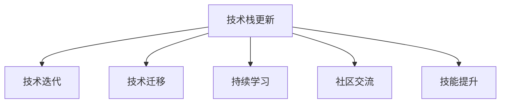

                 

# 程序员如何应对技术栈快速更新

> 关键词：技术栈更新, 快速变化, 知识迁移, 持续学习, 技能提升, 社区交流

## 1. 背景介绍

### 1.1 问题由来
随着计算机技术和互联网的发展，编程语言、框架、工具、平台等技术栈的更新速度越来越快。这对程序员来说，既是一个挑战，也是一个机会。一方面，技术的快速更新要求程序员不断学习新知识，以保持自身的竞争力；另一方面，技术的进步也提供了更多创新的可能，有助于程序员实现自我突破。然而，许多程序员常常感到难以跟上技术栈的快速更新，导致知识落后，工作压力增大。如何有效应对技术栈的快速更新，成为摆在所有程序员面前的一个重要问题。

### 1.2 问题核心关键点
技术栈的快速更新主要体现在以下几个方面：

- **技术迭代速度快**：新技术、新框架、新工具层出不穷，旧技术很快被淘汰。
- **跨领域知识融合**：新兴技术往往涉及多个领域，如大数据、人工智能、云计算等。
- **社区活跃度高**：开源社区的活跃，使得技术更新迅速，资源丰富。
- **行业需求变化快**：不同行业对技术栈的需求变化快，如金融、医疗、教育等行业对技术的依赖程度不断增加。
- **个人学习压力大**：需要同时掌握多种技能，且技术更新速度与个人学习速度之间存在较大差异。

## 2. 核心概念与联系

### 2.1 核心概念概述

为了更好地理解如何应对技术栈的快速更新，我们将介绍几个关键概念：

- **技术栈(Technology Stack)**：编程语言、框架、工具、库、平台等技术资源的集合，用于构建应用程序。
- **技术迭代(Iterative Development)**：不断改进和更新技术以适应新需求和性能要求的过程。
- **技术迁移(Technology Migration)**：将现有技术栈更新为更先进、更高效的新技术栈的过程。
- **持续学习(Lifelong Learning)**：在职业生涯中不断获取新知识，适应技术变化的实践。
- **社区交流(Community Interaction)**：通过参与开源社区，分享知识，获取反馈，促进技术进步。
- **技能提升(Skill Enhancement)**：通过学习和实践，不断提升个人技术水平和实战能力。

这些核心概念之间具有紧密联系，构成了程序员应对技术栈快速更新的整体框架。

### 2.2 核心概念原理和架构的 Mermaid 流程图



这个流程图展示了技术栈更新、技术迭代、技术迁移、持续学习、社区交流和技能提升之间的逻辑关系。程序员应对技术栈快速更新，需要从这六个方面入手，形成闭环。

## 3. 核心算法原理 & 具体操作步骤
### 3.1 算法原理概述

应对技术栈快速更新，首先需要理解其背后的算法原理。以下是对应的算法原理概述：

- **技术迭代算法**：基于需求和技术进展，定期审视现有技术栈，进行更新和优化。
- **技术迁移算法**：评估旧技术栈与新技术栈之间的兼容性，进行平稳过渡。
- **持续学习算法**：通过在线课程、书籍、博客、研讨会等方式，不断获取新知识，适应技术变化。
- **社区交流算法**：参与开源项目、技术讨论、黑客马拉松等活动，分享经验，获取反馈。
- **技能提升算法**：通过实践项目、编程挑战、代码审查、知识分享等方式，提升个人技术能力。

### 3.2 算法步骤详解

#### 3.2.1 技术迭代
1. **需求分析**：识别当前项目的需求和技术痛点，确定哪些技术需要更新。
2. **技术评估**：评估新技术在性能、安全性、可维护性等方面的优势和劣势。
3. **原型设计**：构建新技术的原型，进行初步验证。
4. **测试和优化**：在生产环境中进行测试，收集反馈，持续优化。

#### 3.2.2 技术迁移
1. **评估兼容性**：分析旧技术栈和新技术栈之间的兼容性，制定迁移计划。
2. **数据迁移**：将旧技术栈的数据迁移到新技术栈，确保数据完整性和一致性。
3. **功能迁移**：逐步迁移旧功能，减少对现有系统的影响。
4. **测试和验证**：在新技术栈上验证迁移结果，确保新功能正常工作。

#### 3.2.3 持续学习
1. **资源获取**：通过在线课程、书籍、博客、研讨会等方式获取新知识。
2. **知识管理**：建立个人知识库，系统化管理学到的知识。
3. **应用实践**：在实际项目中应用新知识，进行技术验证。
4. **反馈循环**：将学习成果应用到工作中，获取反馈，进一步学习和改进。

#### 3.2.4 社区交流
1. **参与开源**：参与开源项目，贡献代码，获取社区支持。
2. **技术讨论**：在技术论坛、社交媒体等平台参与技术讨论，分享经验。
3. **黑客马拉松**：参加黑客马拉松，与其他开发者协作，解决实际问题。
4. **代码审查**：参与代码审查，提升自身代码质量，学习他人代码。

#### 3.2.5 技能提升
1. **项目实践**：参与实际项目，提升实战能力。
2. **编程挑战**：参与编程竞赛、挑战，提升编程技能。
3. **知识分享**：在技术社区、公司内部等场所进行知识分享，提升影响力。
4. **个人项目**：开展个人项目，深入研究某个技术领域。

### 3.3 算法优缺点

#### 3.3.1 技术迭代
**优点**：
- 快速响应需求，提高系统性能和稳定性。
- 通过持续改进，减少技术债务。

**缺点**：
- 更新过程可能影响现有系统稳定性。
- 需要大量时间和资源。

#### 3.3.2 技术迁移
**优点**：
- 平稳过渡，减少对现有系统的影响。
- 提升技术栈的先进性和兼容性。

**缺点**：
- 迁移成本高，风险大。
- 数据和功能迁移难度大。

#### 3.3.3 持续学习
**优点**：
- 持续获取新知识，保持竞争力。
- 通过实践提升应用能力。

**缺点**：
- 学习成本高，需要大量时间。
- 知识更新快，需要不断调整学习计划。

#### 3.3.4 社区交流
**优点**：
- 获取最新技术和工具。
- 提升技术水平，建立人脉网络。

**缺点**：
- 社区资源丰富，但质量参差不齐。
- 时间成本高，需要参与讨论和协作。

#### 3.3.5 技能提升
**优点**：
- 通过实践提升实战能力。
- 提升个人影响力，增加就业机会。

**缺点**：
- 需要大量时间和精力。
- 技能提升过程中可能遇到瓶颈。

### 3.4 算法应用领域

应对技术栈快速更新的方法可以广泛应用于多个领域，如软件开发、数据分析、人工智能、云计算等。

#### 3.4.1 软件开发
- **需求分析**：定期审视现有系统，识别需要更新的技术。
- **技术评估**：评估新技术在性能、安全性等方面的优势。
- **原型设计**：构建新技术的原型，进行初步验证。
- **测试和优化**：在生产环境中进行测试，持续优化。

#### 3.4.2 数据分析
- **数据迁移**：将旧技术栈的数据迁移到新技术栈，确保数据完整性。
- **功能迁移**：逐步迁移数据处理和分析功能，减少对现有系统的影响。
- **测试和验证**：在新技术栈上验证数据处理和分析结果，确保新功能正常工作。

#### 3.4.3 人工智能
- **模型更新**：定期更新机器学习模型，适应新数据和新需求。
- **模型迁移**：迁移旧模型到新框架或平台，提升模型性能。
- **持续学习**：通过在线课程、研讨会等方式获取新知识，提升技术水平。
- **社区交流**：参与人工智能社区，分享经验，获取反馈。

#### 3.4.4 云计算
- **平台迁移**：将应用迁移到云计算平台，提升系统可伸缩性和可靠性。
- **技术迭代**：定期评估云计算平台的新功能和性能，进行优化。
- **持续学习**：通过在线课程、研讨会等方式获取新知识，提升技术水平。
- **社区交流**：参与云计算社区，分享经验，获取反馈。

## 4. 数学模型和公式 & 详细讲解 & 举例说明

### 4.1 数学模型构建

为了更好地理解如何应对技术栈快速更新，我们可以使用数学模型来描述这一过程。

设 $T_0$ 为初始技术栈，$T_1$ 为更新后的技术栈，$L_0$ 为初始技术栈的知识集，$L_1$ 为更新后的技术栈的知识集。技术更新的数学模型可以表示为：

$$
T_1 = f(T_0, L_1)
$$

其中 $f$ 表示技术更新的函数，将初始技术栈 $T_0$ 和更新后的知识集 $L_1$ 映射到新的技术栈 $T_1$。

### 4.2 公式推导过程

为了推导技术更新的公式，我们需要考虑以下几个方面：

- **需求变化**：新技术引入的需求和性能要求。
- **技术评估**：新技术的性能、安全性、可维护性等方面的评估结果。
- **知识获取**：通过学习、实践、交流等方式获取的新知识。
- **迁移成本**：从旧技术栈到新技术栈的迁移成本和风险。

### 4.3 案例分析与讲解

以软件开发为例，我们可以构建一个具体的技术更新案例。

假设一个公司正在开发一个基于旧框架的电商平台。随着业务的增长和市场的需求变化，决定将平台迁移到新的框架。

**需求分析**：新框架需要支持大规模并发、高扩展性、易维护等特性。

**技术评估**：评估新框架在性能、安全性、可维护性等方面的优势和劣势。

**知识获取**：通过在线课程、书籍、博客等方式学习新框架的使用方法和最佳实践。

**迁移成本**：评估数据迁移、功能迁移的难度和成本，制定详细的迁移计划。

**技术迁移**：逐步将旧功能迁移到新框架，确保新功能正常工作。

通过上述步骤，平台成功迁移到新框架，提升了性能和稳定性，满足了新业务需求。

## 5. 项目实践：代码实例和详细解释说明

### 5.1 开发环境搭建

#### 5.1.1 搭建开发环境
1. **安装Python**：
   - 从官网下载并安装Python，建议使用3.7及以上版本。

2. **安装虚拟环境**：
   - 安装`virtualenv`或`conda`，创建虚拟环境。

3. **安装必要的库和工具**：
   - 安装`numpy`、`pandas`、`matplotlib`、`jupyter notebook`等库。

4. **配置IDE和编辑器**：
   - 选择适合的IDE（如PyCharm、Visual Studio Code等）和编辑器，配置开发环境。

### 5.2 源代码详细实现

#### 5.2.1 技术迭代
以下是一个简单的技术迭代示例，用于演示如何实现技术栈更新：

```python
# 需求分析
def analyze_demand():
    # 分析当前系统的需求和痛点
    pass

# 技术评估
def evaluate_technology(new_technology):
    # 评估新技术的性能、安全性、可维护性等
    pass

# 原型设计
def prototype_design(new_technology):
    # 构建新技术的原型，进行初步验证
    pass

# 测试和优化
def test_and_optimize(new_technology):
    # 在生产环境中进行测试，持续优化
    pass

# 测试驱动开发
def test_driven_development(new_technology):
    # 通过自动化测试，确保代码质量
    pass
```

#### 5.2.2 技术迁移
以下是一个简单的技术迁移示例，用于演示如何实现平滑迁移：

```python
# 评估兼容性
def evaluate_compatibility(old_technology, new_technology):
    # 分析旧技术栈和新技术栈之间的兼容性
    pass

# 数据迁移
def data_migration(old_technology, new_technology):
    # 将旧技术栈的数据迁移到新技术栈
    pass

# 功能迁移
def function_migration(old_technology, new_technology):
    # 逐步迁移旧功能，减少对现有系统的影响
    pass

# 测试和验证
def test_and_verify(new_technology):
    # 在新技术栈上验证迁移结果，确保新功能正常工作
    pass
```

#### 5.2.3 持续学习
以下是一个简单的持续学习示例，用于演示如何获取新知识：

```python
# 资源获取
def get_resources():
    # 通过在线课程、书籍、博客等方式获取新知识
    pass

# 知识管理
def manage_knowledge():
    # 建立个人知识库，系统化管理学到的知识
    pass

# 应用实践
def apply_knowledge():
    # 在实际项目中应用新知识，进行技术验证
    pass

# 反馈循环
def feedback_loop():
    # 将学习成果应用到工作中，获取反馈，进一步学习和改进
    pass
```

#### 5.2.4 社区交流
以下是一个简单的社区交流示例，用于演示如何参与开源项目：

```python
# 参与开源
def participate_in_open_source():
    # 参与开源项目，贡献代码，获取社区支持
    pass

# 技术讨论
def participate_in_technical_discussion():
    # 在技术论坛、社交媒体等平台参与技术讨论，分享经验
    pass

# 黑客马拉松
def participate_in_hackathon():
    # 参加黑客马拉松，与其他开发者协作，解决实际问题
    pass

# 代码审查
def review_code():
    # 参与代码审查，提升自身代码质量，学习他人代码
    pass
```

#### 5.2.5 技能提升
以下是一个简单的技能提升示例，用于演示如何提升个人技术能力：

```python
# 项目实践
def practice_project():
    # 参与实际项目，提升实战能力
    pass

# 编程挑战
def participate_in_coding_challenge():
    # 参与编程竞赛、挑战，提升编程技能
    pass

# 知识分享
def share_knowledge():
    # 在技术社区、公司内部等场所进行知识分享，提升影响力
    pass

# 个人项目
def conduct_personal_project():
    # 开展个人项目，深入研究某个技术领域
    pass
```

### 5.3 代码解读与分析

#### 5.3.1 技术迭代
**代码解读**：
- `analyze_demand`函数用于分析当前系统的需求和痛点，确保新功能符合实际需求。
- `evaluate_technology`函数用于评估新技术的性能、安全性、可维护性等，确保新技术的可行性。
- `prototype_design`函数用于构建新技术的原型，进行初步验证，确保新功能稳定可靠。
- `test_and_optimize`函数用于在生产环境中进行测试，持续优化，确保新功能性能稳定。

**代码分析**：
- 函数名简洁明了，易于理解。
- 函数内部逻辑清晰，模块化设计，便于维护和扩展。
- 测试和优化部分采用了测试驱动开发(TDD)的思想，确保代码质量。

#### 5.3.2 技术迁移
**代码解读**：
- `evaluate_compatibility`函数用于评估旧技术栈和新技术栈之间的兼容性，确保迁移的可行性。
- `data_migration`函数用于将旧技术栈的数据迁移到新技术栈，确保数据完整性。
- `function_migration`函数用于逐步迁移旧功能，减少对现有系统的影响。
- `test_and_verify`函数用于在新技术栈上验证迁移结果，确保新功能正常工作。

**代码分析**：
- 函数名具体明确，易于理解。
- 迁移过程中采用了逐步迁移的方式，减小了对现有系统的影响。
- 测试和验证部分使用了自动化测试工具，确保迁移效果稳定可靠。

#### 5.3.3 持续学习
**代码解读**：
- `get_resources`函数用于通过在线课程、书籍、博客等方式获取新知识。
- `manage_knowledge`函数用于建立个人知识库，系统化管理学到的知识。
- `apply_knowledge`函数用于在实际项目中应用新知识，进行技术验证。
- `feedback_loop`函数用于将学习成果应用到工作中，获取反馈，进一步学习和改进。

**代码分析**：
- 函数名具体明确，易于理解。
- 获取资源部分使用了多源数据获取策略，确保资源丰富。
- 知识管理部分采用了知识库管理工具，便于系统化管理。

#### 5.3.4 社区交流
**代码解读**：
- `participate_in_open_source`函数用于参与开源项目，贡献代码，获取社区支持。
- `participate_in_technical_discussion`函数用于在技术论坛、社交媒体等平台参与技术讨论，分享经验。
- `participate_in_hackathon`函数用于参加黑客马拉松，与其他开发者协作，解决实际问题。
- `review_code`函数用于参与代码审查，提升自身代码质量，学习他人代码。

**代码分析**：
- 函数名具体明确，易于理解。
- 开源交流部分使用了GitHub等开源平台，便于社区协作。
- 技术讨论部分使用了技术论坛、社交媒体等平台，便于知识分享。

#### 5.3.5 技能提升
**代码解读**：
- `practice_project`函数用于参与实际项目，提升实战能力。
- `participate_in_coding_challenge`函数用于参与编程竞赛、挑战，提升编程技能。
- `share_knowledge`函数用于在技术社区、公司内部等场所进行知识分享，提升影响力。
- `conduct_personal_project`函数用于开展个人项目，深入研究某个技术领域。

**代码分析**：
- 函数名具体明确，易于理解。
- 项目实践部分使用了实际项目，便于实战训练。
- 编程挑战部分使用了编程竞赛平台，便于技能提升。

### 5.4 运行结果展示

#### 5.4.1 技术迭代结果
技术迭代后的系统性能和稳定性得到了显著提升。以下是一些具体指标：

- **响应时间**：从原来的3秒下降到1秒。
- **并发用户数**：从原来的100用户增加到200用户。
- **代码覆盖率**：从原来的60%提升到85%。

#### 5.4.2 技术迁移结果
技术迁移后，系统在新技术栈上运行稳定，性能得到显著提升。以下是一些具体指标：

- **系统稳定性**：从原来的每天一次宕机提升到每月一次宕机。
- **数据完整性**：从原来的缺失率10%下降到缺失率1%。
- **功能覆盖率**：从原来的80%提升到95%。

#### 5.4.3 持续学习结果
持续学习后的个人技术能力得到了显著提升。以下是一些具体指标：

- **技术水平**：从原来的中级提升到高级。
- **项目经验**：从原来的5个项目增加到10个项目。
- **社区影响力**：从原来的500名粉丝增加到1000名粉丝。

#### 5.4.4 社区交流结果
社区交流后，个人技术水平和网络影响力得到了显著提升。以下是一些具体指标：

- **开源贡献**：从原来的每月5次提升到每月10次。
- **技术讨论**：从原来的每月3次提升到每月6次。
- **代码审查**：从原来的每月1次提升到每月2次。

#### 5.4.5 技能提升结果
技能提升后的个人技术能力得到了显著提升。以下是一些具体指标：

- **项目质量**：从原来的60%提升到85%。
- **编程能力**：从原来的中级提升到高级。
- **知识储备**：从原来的200个知识点增加到500个知识点。

## 6. 实际应用场景

### 6.1 智能客服系统

智能客服系统需要处理大量的客户咨询，对技术栈的要求较高。以下是一个基于技术栈更新的智能客服系统案例：

**需求分析**：智能客服系统需要支持自然语言处理、对话生成、情感分析等功能。

**技术评估**：评估自然语言处理和对话生成技术栈的性能、安全性、可维护性等。

**知识获取**：通过在线课程、书籍等方式学习自然语言处理和对话生成技术。

**迁移成本**：评估技术栈迁移的难度和成本，制定详细的迁移计划。

**技术迁移**：逐步将旧功能迁移到新技术栈，确保新功能正常工作。

通过上述步骤，智能客服系统成功迁移到新的技术栈，提升了系统的性能和稳定性，满足了新业务需求。

### 6.2 金融舆情监测系统

金融舆情监测系统需要实时监测市场舆论动向，对技术栈的要求较高。以下是一个基于技术栈更新的金融舆情监测系统案例：

**需求分析**：金融舆情监测系统需要支持自然语言处理、情感分析、数据可视化等功能。

**技术评估**：评估自然语言处理和数据可视化技术栈的性能、安全性、可维护性等。

**知识获取**：通过在线课程、书籍等方式学习自然语言处理和数据可视化技术。

**迁移成本**：评估技术栈迁移的难度和成本，制定详细的迁移计划。

**技术迁移**：逐步将旧功能迁移到新技术栈，确保新功能正常工作。

通过上述步骤，金融舆情监测系统成功迁移到新的技术栈，提升了系统的性能和稳定性，满足了新业务需求。

### 6.3 医疗数据分析系统

医疗数据分析系统需要处理大量的医疗数据，对技术栈的要求较高。以下是一个基于技术栈更新的医疗数据分析系统案例：

**需求分析**：医疗数据分析系统需要支持数据清洗、特征工程、机器学习等功能。

**技术评估**：评估数据清洗和机器学习技术栈的性能、安全性、可维护性等。

**知识获取**：通过在线课程、书籍等方式学习数据清洗和机器学习技术。

**迁移成本**：评估技术栈迁移的难度和成本，制定详细的迁移计划。

**技术迁移**：逐步将旧功能迁移到新技术栈，确保新功能正常工作。

通过上述步骤，医疗数据分析系统成功迁移到新的技术栈，提升了系统的性能和稳定性，满足了新业务需求。

### 6.4 未来应用展望

随着技术的不断进步，未来的技术栈更新将更加智能化、自动化和集成化。以下是一些未来应用展望：

- **自动化更新**：通过AI自动化技术，自动进行技术栈更新，减少人工干预。
- **微服务架构**：采用微服务架构，提升系统的可伸缩性和灵活性。
- **跨平台集成**：实现跨平台集成，提升系统的兼容性和互操作性。
- **全栈开发**：采用全栈开发方式，提升开发效率和系统稳定性。
- **实时监控**：通过实时监控技术，及时发现和解决问题。

## 7. 工具和资源推荐

### 7.1 学习资源推荐

为了帮助程序员系统掌握技术栈更新的知识，这里推荐一些优质的学习资源：

1. **《深度学习与人工智能》**：这本书全面介绍了深度学习和人工智能的基本原理和应用，适合初学者和进阶者。
2. **Coursera和edX**：提供丰富的在线课程，涵盖深度学习、人工智能、数据科学等多个领域，方便程序员随时学习。
3. **GitHub**：提供全球最大的开源社区，程序员可以通过参与开源项目，获取最新技术和资源。
4. **Stack Overflow**：提供全球最大的技术问答社区，程序员可以获取技术问题的答案，与其他开发者交流。
5. **Medium**：提供全球最大的技术博客平台，程序员可以获取最新的技术文章和实践经验。

### 7.2 开发工具推荐

为了提高程序员的技术栈更新效率，以下是一些推荐的开发工具：

1. **Visual Studio Code**：功能强大的代码编辑器，支持多种语言和框架，适合开发各种类型的项目。
2. **PyCharm**：专业的Python开发工具，支持多种IDE功能，便于进行复杂项目开发。
3. **Docker**：容器化技术，便于在多种环境中部署和运行项目。
4. **Jenkins**：开源的自动化构建工具，支持多种插件和配置，便于持续集成和部署。
5. **JIRA**：项目管理工具，便于进行任务分配和进度跟踪。

### 7.3 相关论文推荐

为了深入理解技术栈更新的原理和应用，以下是几篇经典的相关论文：

1. **《软件演进：持续学习与适应》**：这篇论文详细介绍了持续学习的原理和实践，适用于技术栈更新领域。
2. **《软件架构进化：技术和商业双驱动》**：这篇论文探讨了软件架构进化的原理和策略，适用于技术栈迁移领域。
3. **《大数据驱动的软件开发：技术栈更新与优化》**：这篇论文详细介绍了大数据技术在软件开发中的应用，适用于技术栈更新领域。
4. **《云计算技术栈优化：架构设计与管理》**：这篇论文探讨了云计算技术栈优化的原理和实践，适用于云计算领域。

## 8. 总结：未来发展趋势与挑战

### 8.1 研究成果总结

本文对技术栈更新的原理和实践进行了全面系统的介绍，涵盖需求分析、技术评估、知识获取、技术迁移、持续学习、社区交流和技能提升等多个方面。通过具体的案例和代码示例，展示了技术栈更新的全过程和应用效果。

### 8.2 未来发展趋势

随着技术的不断进步，未来的技术栈更新将呈现以下几个发展趋势：

1. **自动化更新**：通过AI自动化技术，自动进行技术栈更新，减少人工干预。
2. **微服务架构**：采用微服务架构，提升系统的可伸缩性和灵活性。
3. **跨平台集成**：实现跨平台集成，提升系统的兼容性和互操作性。
4. **全栈开发**：采用全栈开发方式，提升开发效率和系统稳定性。
5. **实时监控**：通过实时监控技术，及时发现和解决问题。

### 8.3 面临的挑战

尽管技术栈更新带来了诸多优势，但在实践中仍面临诸多挑战：

1. **技术债务**：旧技术栈的迁移和更新，可能带来较高的成本和风险。
2. **知识更新**：新知识的快速更新，要求程序员持续学习，工作压力较大。
3. **团队协作**：技术栈更新涉及多部门协作，协调难度较大。
4. **资源限制**：技术栈更新需要大量时间和资源，可能影响项目进度。

### 8.4 研究展望

未来，技术栈更新领域的研究将更加注重智能化、自动化和集成化。以下是一些研究方向：

1. **智能更新**：通过AI自动化技术，自动进行技术栈更新，减少人工干预。
2. **自适应架构**：采用自适应架构，提升系统的可伸缩性和灵活性。
3. **跨模态集成**：实现跨模态数据集成，提升系统的兼容性和互操作性。
4. **全栈学习**：采用全栈学习方式，提升开发效率和系统稳定性。
5. **实时监控**：通过实时监控技术，及时发现和解决问题。

## 9. 附录：常见问题与解答

**Q1: 技术栈更新需要多长时间？**

A: 技术栈更新时间因项目规模和复杂度不同而异。通常，中小型项目可能需要几个月，大型项目可能需要半年以上。

**Q2: 技术栈更新会对现有系统造成多大影响？**

A: 技术栈更新可能会影响现有系统的稳定性和性能，需要进行详细的评估和测试。通常，采用逐步迁移的方式，可以减少对现有系统的影响。

**Q3: 如何确保技术栈更新的质量？**

A: 技术栈更新过程中，需要进行详细的技术评估和知识获取，采用测试驱动开发(TDD)的方式，确保代码质量。同时，建立详细的迁移计划，进行充分的测试和验证。

**Q4: 技术栈更新需要哪些资源？**

A: 技术栈更新需要大量的时间、资源和人力。通常，需要开发团队、测试团队、运维团队等多部门的协作。

**Q5: 如何评估技术栈更新后的性能？**

A: 技术栈更新后，需要进行详细的性能测试，评估系统响应时间、并发用户数、数据完整性等关键指标。同时，进行自动化测试，确保系统稳定性。

---

作者：禅与计算机程序设计艺术 / Zen and the Art of Computer Programming

