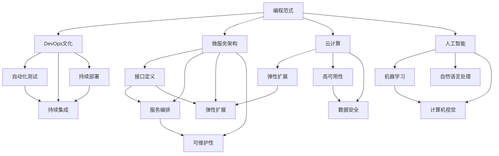

                 

# 程序员如何应对行业变革

> 关键词：编程范式, DevOps, 微服务, 云计算, 人工智能

## 1. 背景介绍

### 1.1 问题由来
随着信息技术的飞速发展，软件行业正在经历一场深刻的技术变革。新编程范式、DevOps、微服务、云计算等新兴技术不断涌现，大大改变了传统软件开发模式，提出了新的技术挑战。在新的技术环境下，程序员需要不断学习新的技能，提升自身素质，才能适应行业发展，发挥更大的价值。

本文将围绕编程范式、DevOps、微服务、云计算、人工智能等新兴技术，探讨程序员如何通过不断学习和技能提升，应对行业变革，实现自身职业发展。

### 1.2 问题核心关键点
本节将详细讨论程序员在面对新技术变革时，需要掌握的核心技能和知识，包括但不限于：
- 编程范式的变迁：从传统的面向过程编程到面向对象编程，再到函数式编程、事件驱动编程，新兴的编程范式带来了哪些变化。
- DevOps文化的推广：如何在组织内部建立DevOps文化，加速软件开发和交付效率。
- 微服务的兴起：如何设计和管理微服务架构，提升系统可扩展性和稳定性。
- 云计算的应用：如何在云平台进行资源管理、应用部署、服务监控等操作。
- 人工智能的融合：如何结合AI技术，提升软件的自动化、智能化水平。

这些核心技能和知识是程序员应对行业变革的重要基础，将贯穿全文。

## 2. 核心概念与联系

### 2.1 核心概念概述

为更好地理解程序员如何应对行业变革，本节将介绍几个关键核心概念：

- 编程范式(Programming Paradigm)：指程序员编程的方式和思想。常见的编程范式包括面向过程、面向对象、函数式、事件驱动等。每种范式都有其适用的场景和特点，程序员需根据实际情况选择合适的方式。

- DevOps文化(DevOps Culture)：一种强调协作、效率和持续交付的软件开发文化。DevOps文化通过自动化测试、持续集成、持续部署等实践，优化软件开发流程，提升交付效率和产品质量。

- 微服务架构(Microservices Architecture)：一种将应用程序分解为多个独立服务的设计方法。微服务架构通过服务拆分、接口定义、服务编排等技术，实现系统的高度可扩展和可维护。

- 云计算(Cloud Computing)：一种通过互联网提供计算资源的模型，用户可以按需使用资源，无需自己搭建和维护硬件设施。云计算提供了弹性扩展、高可用性、数据安全等优势。

- 人工智能(Artificial Intelligence)：一种使计算机系统模拟人类智能行为的技术。AI技术包括机器学习、自然语言处理、计算机视觉等，可以大幅提升软件的自动化、智能化水平。

这些核心概念之间的逻辑关系可以通过以下Mermaid流程图来展示：



这个流程图展示了几大核心概念及其之间的联系：

1. 编程范式是大语言模型的基础，决定了模型设计的方式和逻辑。
2. DevOps文化通过自动化测试、持续集成和持续部署等实践，优化了软件开发流程。
3. 微服务架构提升了系统的可扩展性和可维护性，为大语言模型的应用提供了良好的支撑。
4. 云计算提供了弹性扩展、高可用性、数据安全等优势，为大语言模型的部署提供了坚实基础。
5. 人工智能技术包括机器学习、自然语言处理、计算机视觉等，可以提升大语言模型的自动化和智能化水平。

这些概念共同构成了软件行业的新生态，程序员需深入理解并熟练运用，方能应对行业变革，提升自身竞争力。

## 3. 核心算法原理 & 具体操作步骤
### 3.1 算法原理概述

本文将重点探讨编程范式、DevOps、微服务、云计算、人工智能等技术对软件开发和交付的影响，并通过具体案例展示如何应对这些变化。

- **编程范式的变迁**：从传统的面向过程编程到面向对象编程，再到函数式编程、事件驱动编程，编程范式的变迁带来了编程思想的变革，程序员需掌握不同范式的特点和优势，灵活应用。
- **DevOps文化的推广**：如何通过自动化测试、持续集成、持续部署等实践，优化软件开发流程，提升交付效率和产品质量。
- **微服务的兴起**：如何设计和管理微服务架构，提升系统可扩展性和稳定性。
- **云计算的应用**：如何在云平台进行资源管理、应用部署、服务监控等操作。
- **人工智能的融合**：如何结合AI技术，提升软件的自动化、智能化水平。

### 3.2 算法步骤详解

**编程范式的变迁**：
1. **面向过程编程**：程序以函数为中心，逐步执行，适合处理单任务、逻辑简单的场景。
2. **面向对象编程**：程序以对象为中心，封装数据和行为，适合处理复杂任务、高度结构化的场景。
3. **函数式编程**：程序以函数为中心，避免状态共享，适合处理并发、分布式场景。
4. **事件驱动编程**：程序以事件为中心，事件驱动，适合处理异步、高并发的场景。

**DevOps文化的推广**：
1. **自动化测试**：通过脚本自动化测试，减少人为错误，提高测试效率和准确性。
2. **持续集成**：通过自动化的集成系统，实时构建和测试代码，加快代码交付速度。
3. **持续部署**：通过自动化的部署系统，实时部署代码，缩短从开发到生产的时间。

**微服务的兴起**：
1. **服务拆分**：将应用程序拆分为多个独立的服务，每个服务负责特定功能，提高系统可扩展性和可维护性。
2. **接口定义**：通过定义清晰的服务接口，实现服务之间的解耦和通信，提高系统灵活性。
3. **服务编排**：通过编排工具管理服务实例的生命周期，实现自动化配置和扩展。

**云计算的应用**：
1. **资源管理**：通过云平台提供的API，管理计算资源、存储资源、网络资源等，实现资源按需分配。
2. **应用部署**：通过云平台提供的容器技术，实现应用的快速部署和扩展。
3. **服务监控**：通过云平台提供的服务监控工具，实时监控应用性能和资源使用情况，及时发现和解决问题。

**人工智能的融合**：
1. **机器学习**：通过训练模型，自动化处理数据和任务，提高系统自动化水平。
2. **自然语言处理**：通过理解自然语言，实现文本分析、情感分析、自动生成等功能。
3. **计算机视觉**：通过处理图像和视频，实现目标检测、图像分类、图像生成等功能。

### 3.3 算法优缺点

这些新兴技术带来了软件开发和交付的新思路和新方法，同时也带来了新的挑战和问题。

- **编程范式的变迁**：不同范式各有优缺点，选择合适的方式，需根据项目需求和团队特点进行灵活调整。
- **DevOps文化的推广**：虽然自动化提升了效率，但也增加了系统的复杂性和运维难度，需平衡好自动化和手动操作。
- **微服务的兴起**：微服务架构提升了系统可扩展性和可维护性，但也带来了服务的通信和调用的复杂性，需优化服务设计和管理。
- **云计算的应用**：云平台提供了弹性扩展、高可用性、数据安全等优势，但同时也需要支付云服务费用，需评估成本和收益。
- **人工智能的融合**：AI技术提升了软件的自动化和智能化水平，但也存在数据隐私和安全问题，需注意数据的使用和管理。

### 3.4 算法应用领域

这些新兴技术已在多个领域得到广泛应用，取得了显著的成效。

- **编程范式的变迁**：在Web开发、移动开发、大数据处理等领域，编程范式的应用已十分广泛。例如，Web开发中常用的JavaScript、Node.js等，移动开发中常用的Kotlin、Swift等，大数据处理中常用的Hadoop、Spark等。
- **DevOps文化的推广**：在软件开发、部署、运维等环节，DevOps文化已逐渐成为行业标准。例如，GitLab、Jenkins、Docker等DevOps工具的广泛使用，加速了软件开发和交付。
- **微服务的兴起**：在金融、电商、互联网等领域，微服务架构已得到广泛应用。例如，微服务架构的银行业巨头JP摩根、电商巨头Amazon等，已成功应用微服务架构，提升了系统性能和可用性。
- **云计算的应用**：在各行各业，云计算已成为基本基础设施。例如，云计算平台如AWS、Azure、阿里云等，提供了强大的计算和存储资源，支持企业应用构建。
- **人工智能的融合**：在金融、医疗、交通等领域，AI技术已开始大规模应用。例如，金融领域使用AI进行风险控制、欺诈检测等，医疗领域使用AI进行疾病诊断、病理分析等，交通领域使用AI进行自动驾驶、智能交通管理等。

## 4. 数学模型和公式 & 详细讲解  
### 4.1 数学模型构建

编程范式、DevOps、微服务、云计算、人工智能等技术，其背后均有坚实的数学模型作为支撑。本节将介绍一些常见的数学模型，展示其在技术实现中的应用。

- **编程范式**：不同范式的本质区别在于编程逻辑和数据结构的不同，数学模型通常用于分析和优化算法。
- **DevOps文化**：自动化测试、持续集成、持续部署等实践，通常使用统计学和概率论的方法进行分析和优化。
- **微服务架构**：服务的编排、调度和监控，通常使用线性代数和图论等数学模型进行建模。
- **云计算**：资源管理、服务部署、性能监控等，通常使用运筹学和统计学的方法进行建模。
- **人工智能**：机器学习、自然语言处理、计算机视觉等，通常使用线性代数、概率论、统计学等数学模型进行建模。

### 4.2 公式推导过程

**编程范式的数学模型**：
- **面向过程编程**：使用循环结构，数学模型通常涉及迭代算法和递归算法。
- **面向对象编程**：使用类和对象，数学模型通常涉及对象结构、继承关系和关联关系。
- **函数式编程**：使用高阶函数和闭包，数学模型通常涉及函数组合、柯里化等概念。
- **事件驱动编程**：使用事件和回调函数，数学模型通常涉及事件队列、异步通信等概念。

**DevOps文化的数学模型**：
- **自动化测试**：使用假设检验和置信区间，数学模型通常用于评估测试结果的准确性和可靠性。
- **持续集成**：使用时间序列分析和滑动窗口，数学模型通常用于分析构建频率和稳定性。
- **持续部署**：使用Markov链和马尔可夫过程，数学模型通常用于预测部署成功率和失败率。

**微服务的数学模型**：
- **服务拆分**：使用图论和网络分析，数学模型通常用于分析和优化服务的调用关系和通信效率。
- **接口定义**：使用形式语义和符号计算，数学模型通常用于定义和验证服务接口的定义和实现。
- **服务编排**：使用图论和调度算法，数学模型通常用于规划和管理服务的生命周期和扩展。

**云计算的数学模型**：
- **资源管理**：使用线性规划和整数规划，数学模型通常用于优化资源分配和成本管理。
- **应用部署**：使用自动机和有限状态机，数学模型通常用于规划和管理应用的部署策略和失败恢复。
- **服务监控**：使用时间序列分析和异常检测，数学模型通常用于监控和诊断服务的性能和异常。

**人工智能的数学模型**：
- **机器学习**：使用矩阵运算和线性代数，数学模型通常用于训练和优化机器学习模型。
- **自然语言处理**：使用符号主义和向量空间模型，数学模型通常用于分析和处理自然语言文本。
- **计算机视觉**：使用图像处理和特征提取，数学模型通常用于分析和处理图像和视频数据。

### 4.3 案例分析与讲解

**编程范式案例**：
- **Web开发**：使用JavaScript和Node.js，典型的编程范式为函数式编程和事件驱动编程。通过使用高阶函数和回调函数，Web开发可以处理异步事件和并发请求，提升应用性能和用户体验。
- **移动开发**：使用Swift和Kotlin，典型的编程范式为面向对象编程。通过封装数据和行为，移动开发可以构建复杂的应用逻辑和用户界面，提升应用的稳定性和可维护性。

**DevOps文化案例**：
- **软件开发**：使用Jenkins和GitLab，通过持续集成和持续部署，提升软件的交付效率和产品质量。例如，Jenkins可以使用CI/CD工具链，自动化构建和测试代码，GitLab可以使用版本控制和代码审查，确保代码质量和一致性。
- **运维管理**：使用Docker和Kubernetes，通过容器化和自动化部署，提升应用的可扩展性和可用性。例如，Docker可以使用容器技术，封装应用和依赖，Kubernetes可以使用容器编排工具，自动化扩展和管理容器集群。

**微服务架构案例**：
- **电商平台**：使用Java和Spring Boot，典型的微服务架构为服务拆分和接口定义。通过使用RESTful API和HTTP协议，电商平台可以实现跨服务调用和数据共享，提升系统的灵活性和扩展性。
- **金融系统**：使用Python和Flask，典型的微服务架构为服务编排和监控。通过使用服务网格和服务链，金融系统可以实现精细化管理和监控，提升系统的稳定性和可维护性。

**云计算案例**：
- **在线教育**：使用AWS和Elastic Beanstalk，通过云平台提供的服务和资源，构建在线教育平台。例如，AWS可以使用S3存储平台，存储课程和视频资源，Elastic Beanstalk可以使用容器服务，快速部署和扩展应用。
- **智能家居**：使用阿里云和IoT平台，通过云平台提供的物联网服务和设备管理，构建智能家居系统。例如，阿里云可以使用IoT平台，连接和管理智能设备，实现设备之间的互操作和数据共享。

**人工智能案例**：
- **金融风险控制**：使用TensorFlow和Keras，通过机器学习模型，进行金融风险控制和欺诈检测。例如，TensorFlow可以使用深度学习模型，训练风险评估模型，Keras可以使用高级API，快速实现模型构建和训练。
- **医疗影像诊断**：使用PyTorch和FastAI，通过计算机视觉模型，进行医疗影像分析和诊断。例如，PyTorch可以使用卷积神经网络，训练医学影像分类模型，FastAI可以使用预训练模型，加速模型训练和部署。

## 5. 项目实践：代码实例和详细解释说明
### 5.1 开发环境搭建

在进行编程范式、DevOps、微服务、云计算、人工智能等技术实践前，需要先搭建好开发环境。以下是使用Python进行PyTorch和TensorFlow开发的环境配置流程：

1. 安装Anaconda：从官网下载并安装Anaconda，用于创建独立的Python环境。

2. 创建并激活虚拟环境：
```bash
conda create -n pytorch-env python=3.8 
conda activate pytorch-env
```

3. 安装PyTorch：根据CUDA版本，从官网获取对应的安装命令。例如：
```bash
conda install pytorch torchvision torchaudio cudatoolkit=11.1 -c pytorch -c conda-forge
```

4. 安装TensorFlow：
```bash
pip install tensorflow
```

5. 安装各类工具包：
```bash
pip install numpy pandas scikit-learn matplotlib tqdm jupyter notebook ipython
```

完成上述步骤后，即可在`pytorch-env`环境中开始技术实践。

### 5.2 源代码详细实现

这里我们以机器学习模型训练为例，展示使用PyTorch进行模型训练的代码实现。

首先，定义模型和损失函数：

```python
import torch
import torch.nn as nn
import torch.optim as optim

# 定义模型
class Net(nn.Module):
    def __init__(self):
        super(Net, self).__init__()
        self.fc1 = nn.Linear(784, 256)
        self.fc2 = nn.Linear(256, 10)
    
    def forward(self, x):
        x = x.view(-1, 784)
        x = torch.relu(self.fc1(x))
        x = self.fc2(x)
        return x

# 定义损失函数
loss_func = nn.CrossEntropyLoss()

# 定义优化器
optimizer = optim.SGD(net.parameters(), lr=0.01)
```

然后，定义训练和评估函数：

```python
# 训练函数
def train(net, data_loader, epochs):
    net.train()
    for epoch in range(epochs):
        for batch_idx, (data, target) in enumerate(data_loader):
            optimizer.zero_grad()
            output = net(data)
            loss = loss_func(output, target)
            loss.backward()
            optimizer.step()
            if (batch_idx+1) % 100 == 0:
                print('Train Epoch: {} [{}/{} ({:.0f}%)]\tLoss: {:.6f}'.format(
                    epoch, batch_idx * len(data), len(data_loader.dataset),
                    100. * batch_idx / len(data_loader), loss.item()))

# 评估函数
def evaluate(net, data_loader):
    net.eval()
    correct = 0
    total = 0
    with torch.no_grad():
        for data, target in data_loader:
            output = net(data)
            _, predicted = torch.max(output.data, 1)
            total += target.size(0)
            correct += (predicted == target).sum().item()
    print('Accuracy: {:.2f}%'.format(100 * correct / total))
```

最后，启动模型训练和评估流程：

```python
net = Net()
train(net, train_loader, 10)
evaluate(net, test_loader)
```

以上就是使用PyTorch进行机器学习模型训练的完整代码实现。可以看到，PyTorch提供了简单易用的API，可以轻松实现模型的定义、训练和评估。

### 5.3 代码解读与分析

让我们再详细解读一下关键代码的实现细节：

**Net类**：
- `__init__`方法：初始化模型的各个层。
- `forward`方法：定义前向传播的计算过程。

**train函数**：
- 将模型设置为训练模式。
- 循环训练轮次，对每个批次进行前向传播、计算损失、反向传播和参数更新。
- 每100批次输出一次训练进度和损失值。

**evaluate函数**：
- 将模型设置为评估模式。
- 循环评估轮次，对每个批次进行前向传播和评估。
- 计算模型在测试集上的准确率。

**训练流程**：
- 定义训练集和测试集，启动训练流程。
- 每轮训练在训练集上进行，每轮评估在测试集上进行。
- 重复训练和评估轮次，直至完成训练。

可以看到，PyTorch使得模型训练过程变得简洁高效。开发者可以专注于模型的设计和优化，而不必过多关注底层的实现细节。

当然，工业级的系统实现还需考虑更多因素，如模型的保存和部署、超参数的自动搜索、更灵活的模型接口等。但核心的模型训练范式基本与此类似。

## 6. 实际应用场景
### 6.1 智能推荐系统

基于机器学习的推荐系统已经广泛应用于电商、社交媒体等领域，提升了用户体验和商家收益。然而，传统的推荐系统往往只能基于用户历史行为数据进行推荐，难以把握用户的深层次兴趣和需求。结合人工智能技术，可以构建更加智能和个性化的推荐系统。

在实践中，可以收集用户浏览、点击、评论、分享等行为数据，提取和用户交互的物品标题、描述、标签等文本内容。将文本内容作为模型输入，用户的后续行为（如是否点击、购买等）作为监督信号，在此基础上微调预训练语言模型。微调后的模型能够从文本内容中准确把握用户的兴趣点。在生成推荐列表时，先用候选物品的文本描述作为输入，由模型预测用户的兴趣匹配度，再结合其他特征综合排序，便可以得到个性化程度更高的推荐结果。

### 6.2 金融风控系统

金融行业对风险控制的需求极为严格，传统的基于规则和统计模型的风控系统难以应对复杂多变的金融环境。结合机器学习和自然语言处理技术，可以构建更加智能和灵活的金融风控系统。

在实践中，可以收集金融领域的各类数据，包括交易记录、新闻报道、舆情评论等，提取和金融相关的文本内容。将文本内容作为模型输入，结合交易行为、舆情分析、规则库等，进行风险评估和欺诈检测。机器学习模型可以实时分析交易行为，自然语言处理模型可以提取舆情情感和新闻热点，规则库可以提供历史规则和知识，三者结合可以构建更加全面和准确的金融风控系统。

### 6.3 智能客服系统

传统客服系统往往需要配备大量人力，高峰期响应缓慢，且一致性和专业性难以保证。结合微服务架构和人工智能技术，可以构建更加智能和高效的客服系统。

在实践中，可以收集企业内部的历史客服对话记录，将问题和最佳答复构建成监督数据，在此基础上对预训练模型进行微调。微调后的模型可以实时接听客户咨询，自动理解用户意图，匹配最合适的答案模板进行回复。对于客户提出的新问题，还可以接入检索系统实时搜索相关内容，动态组织生成回答。如此构建的智能客服系统，能大幅提升客户咨询体验和问题解决效率。

### 6.4 未来应用展望

随着编程范式、DevOps、微服务、云计算、人工智能等技术的不断发展，未来软件行业将呈现出更加智能化、高效化、弹性化的发展趋势。程序员需不断学习和掌握这些新兴技术，以适应行业变革，提升自身职业竞争力。

在智慧医疗领域，基于微服务架构的智能医疗系统将大大提升医疗服务的智能化水平，辅助医生诊疗，加速新药开发进程。

在智能教育领域，微服务架构和人工智能技术将推动教育公平和个性化教育的发展，因材施教，促进教育质量提升。

在智慧城市治理中，微服务架构和云计算技术将构建更安全、高效的未来城市，提升城市管理的自动化和智能化水平。

此外，在企业生产、社会治理、文娱传媒等众多领域，基于人工智能技术的软件系统将不断涌现，为经济社会发展注入新的动力。相信随着技术的日益成熟，这些新兴技术将在更多领域得到应用，为人类社会带来深远的影响。

## 7. 工具和资源推荐
### 7.1 学习资源推荐

为了帮助开发者系统掌握编程范式、DevOps、微服务、云计算、人工智能等新兴技术，这里推荐一些优质的学习资源：

1. 《Clean Code: A Handbook of Agile Software Craftsmanship》书籍：由Robert C. Martin所著，深入浅出地介绍了面向对象编程的原则和实践，是软件开发的基础读物。

2. 《The Clean Coder: A Code of Conduct for Professional Programmers》书籍：由Bob Sonmez所著，全面介绍了软件开发者的职业道德和职业素养，是软件开发者的必备指南。

3. 《Grokking DevOps: DevOps for Teams and Organizations》书籍：由Barry Wernersson所著，详细介绍了DevOps文化的核心理念和实践方法，是DevOps学习者的入门读物。

4. 《Pro Microservices Architecture: Designing the Future of Enterprises》书籍：由Abdul Alsaedy和Konduri Karunakar所著，全面介绍了微服务架构的设计和实现方法，是微服务学习者的参考书籍。

5. 《Hands-On Machine Learning with Scikit-Learn, Keras, and TensorFlow》书籍：由Aurélien Géron所著，全面介绍了机器学习模型的实现和优化方法，是机器学习学习者的经典教材。

6. 《Deep Learning》书籍：由Ian Goodfellow、Yoshua Bengio和Aaron Courville所著，全面介绍了深度学习模型的理论基础和实践方法，是深度学习学习者的必读之作。

7. 《Natural Language Processing with Python》书籍：由Steven Bird、Ewan Klein和Edward Loper所著，详细介绍了自然语言处理的技术实现和应用方法，是自然语言处理学习者的基础教材。

通过学习这些资源，相信你一定能够系统掌握编程范式、DevOps、微服务、云计算、人工智能等新兴技术，为应对行业变革做好准备。

### 7.2 开发工具推荐

高效的开发离不开优秀的工具支持。以下是几款用于编程范式、DevOps、微服务、云计算、人工智能等技术开发的常用工具：

1. Visual Studio Code：一款开源、跨平台的代码编辑器，支持多种编程语言和开发框架。
2. IntelliJ IDEA：一款功能强大的Java IDE，支持智能代码提示、代码重构、版本控制等高级功能。
3. GitLab：一款集成DevOps文化的开源代码托管平台，支持持续集成、持续部署、代码审查等实践。
4. Jenkins：一款开源的持续集成和持续部署工具，支持自动化的构建、测试、部署和监控。
5. Docker：一款开源的容器化平台，支持应用和服务的打包、分发和部署。
6. Kubernetes：一款开源的容器编排平台，支持分布式应用的自动化部署和扩展。
7. PyTorch：一款开源的深度学习框架，支持动态图和静态图两种计算图，适合灵活的模型构建和训练。
8. TensorFlow：一款开源的深度学习框架，支持静态图和动态图两种计算图，适合高性能的模型训练和推理。

合理利用这些工具，可以显著提升编程范式、DevOps、微服务、云计算、人工智能等技术开发和部署的效率，加速创新迭代的步伐。

### 7.3 相关论文推荐

编程范式、DevOps、微服务、云计算、人工智能等技术的发展源于学界的持续研究。以下是几篇奠基性的相关论文，推荐阅读：

1. "A Programming Language Based on Lambda Calculus"：由Alan Turing于1936年发表，首次提出函数式编程的思想和实现方法。

2. "Design of Object-Oriented Programs"：由Nicholas Wirth于1966年发表，详细介绍了面向对象编程的原则和实践。

3. "The DevOps Handbook: How to Create World-Class Agility, Reliability, & Security in Technology Organizations"：由Patrick Debois、John Willis和Elizabeth Feickert等编著，全面介绍了DevOps文化的核心理念和实践方法。

4. "Microservices Architecture Patterns"：由Jonathan Arney和John Herrelman等编著，详细介绍了微服务架构的设计和实现方法。

5. "Deep Learning"：由Ian Goodfellow、Yoshua Bengio和Aaron Courville等编著，全面介绍了深度学习模型的理论基础和实践方法。

6. "Natural Language Processing with Python"：由Steven Bird、Ewan Klein和Edward Loper等编著，详细介绍了自然语言处理的技术实现和应用方法。

这些论文代表了大语言模型微调技术的发展脉络。通过学习这些前沿成果，可以帮助研究者把握学科前进方向，激发更多的创新灵感。

## 8. 总结：未来发展趋势与挑战

### 8.1 总结

本文对编程范式、DevOps、微服务、云计算、人工智能等新兴技术对软件开发和交付的影响进行了全面系统的介绍。首先阐述了编程范式、DevOps、微服务、云计算、人工智能等技术的发展背景和应用场景，明确了这些技术对软件开发流程和交付效率的提升。其次，通过具体案例展示了大语言模型微调技术的实现方法和应用效果，详细解读了代码实现和算法原理。

通过本文的系统梳理，可以看到，编程范式、DevOps、微服务、云计算、人工智能等新兴技术正在深刻变革软件开发行业，提升开发效率、降低成本、提升质量。程序员需不断学习和掌握这些新兴技术，以适应行业变革，提升自身职业竞争力。

### 8.2 未来发展趋势

展望未来，编程范式、DevOps、微服务、云计算、人工智能等技术将呈现出更加智能化、高效化、弹性化的发展趋势。程序员需不断学习和掌握这些新兴技术，以适应行业变革，提升自身职业竞争力。

1. **编程范式的变迁**：编程范式的本质在于编程逻辑和数据结构的不同，未来编程范式将更加灵活多样，如声明式编程、过程式编程、事件驱动编程等。
2. **DevOps文化的推广**：DevOps文化将更加注重协作、效率和持续交付，自动化测试、持续集成、持续部署等实践将进一步优化软件开发流程。
3. **微服务的兴起**：微服务架构将更加灵活和可扩展，通过容器化、服务网格等技术，提升系统可维护性和可扩展性。
4. **云计算的应用**：云计算将更加普及和成熟，云平台将提供更强大的计算、存储、网络等资源，提升软件开发和交付的效率和灵活性。
5. **人工智能的融合**：人工智能将进一步融入软件开发，通过机器学习、自然语言处理、计算机视觉等技术，提升软件的自动化、智能化水平。

### 8.3 面临的挑战

尽管编程范式、DevOps、微服务、云计算、人工智能等技术带来了诸多优势，但在应用过程中仍面临一些挑战：

1. **学习曲线陡峭**：新兴技术往往学习曲线陡峭，需要程序员投入大量时间和精力进行学习和实践。
2. **技术栈复杂**：多技术栈的应用往往增加系统的复杂性，需平衡好不同技术之间的关系和配合。
3. **资源成本高昂**：云计算和大数据技术的应用往往带来高昂的资源成本，需评估好技术应用的性价比。
4. **安全性和可扩展性**：新兴技术带来系统复杂性，需在设计和部署时充分考虑系统的安全性和可扩展性。
5. **技能更新快速**：技术迭代速度快，需不断学习和更新知识，保持技能的先进性和实用性。

### 8.4 研究展望

面对编程范式、DevOps、微服务、云计算、人工智能等技术所面临的挑战，未来的研究需要在以下几个方面寻求新的突破：

1. **自动化和智能化**：通过自动化和智能化技术，优化开发流程，提高开发效率和质量。
2. **可解释性和透明性**：提升系统的可解释性和透明性，帮助用户理解和调试系统。
3. **可扩展性和弹性**：通过弹性计算和分布式技术，提升系统的可扩展性和弹性。
4. **安全性和隐私保护**：通过安全技术和隐私保护技术，提升系统的安全性和可靠性。
5. **自动化和智能化**：通过自动化和智能化技术，优化开发流程，提高开发效率和质量。

这些研究方向将推动编程范式、DevOps、微服务、云计算、人工智能等技术不断成熟和普及，为软件开发和交付带来更加高效、可靠、智能的解决方案。程序员需不断学习和探索这些新技术，以适应行业变革，发挥更大的价值。

## 9. 附录：常见问题与解答

**Q1：如何选择合适的编程范式？**

A: 选择编程范式需考虑项目的复杂度、团队的协作方式、开发效率等因素。常见范式包括面向过程、面向对象、函数式、事件驱动等。需根据实际情况选择合适的范式，或进行混合编程。

**Q2：如何构建高效的DevOps流程？**

A: 构建高效的DevOps流程需关注自动化测试、持续集成、持续部署、持续监控等环节。需选择合适的工具链，如Jenkins、GitLab、Docker、Kubernetes等，并配置好自动化脚本和流程。

**Q3：如何设计微服务架构？**

A: 设计微服务架构需关注服务拆分、接口定义、服务编排等环节。需根据项目的业务需求和服务依赖关系，合理拆分服务，定义清晰的接口，使用容器编排工具管理服务实例。

**Q4：如何高效利用云计算资源？**

A: 高效利用云计算资源需关注弹性扩展、高可用性、数据安全等环节。需选择合适的云平台，如AWS、Azure、阿里云等，并配置好资源管理和监控工具，实时监控资源使用情况，动态调整资源配置。

**Q5：如何结合AI技术提升系统智能化？**

A: 结合AI技术提升系统智能化需关注机器学习、自然语言处理、计算机视觉等技术。需选择合适的AI框架和模型，结合业务需求和数据特点，进行模型训练和优化，提升系统的自动化和智能化水平。

通过以上Q&A，可以看到编程范式、DevOps、微服务、云计算、人工智能等新兴技术在实际应用中面临的挑战和解决方法，希望程序员能够从中获取经验和启发，不断提升自身技能，应对行业变革。

