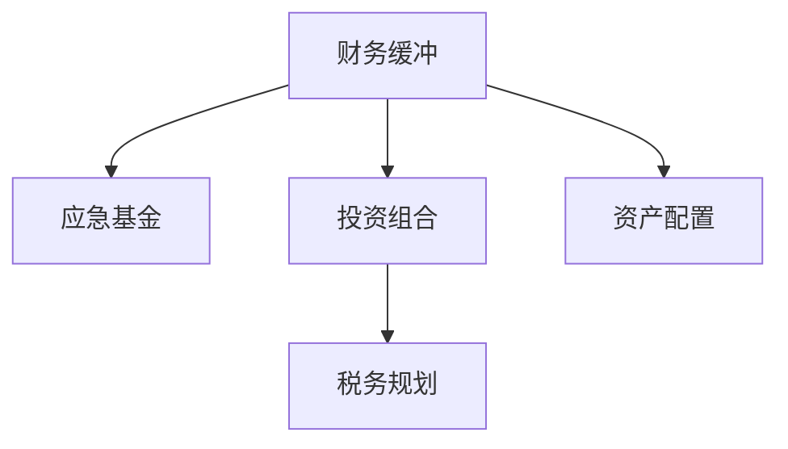

                 

# 程序员如何建立财务缓冲

## 1. 背景介绍

财务缓冲对于程序员而言，是一个至关重要的概念。特别是在当今这个不确定性增加、经济波动加剧的时代，建立一个稳健的财务缓冲不仅能够提供应对突发事件的经济保障，还能帮助程序员在职业生涯中更加灵活自如地做出决策，减少因经济压力带来的压力和焦虑。本文将详细探讨如何通过一系列策略和工具，帮助程序员建立一个有效的财务缓冲。

## 2. 核心概念与联系

### 2.1 核心概念概述

在讨论如何建立财务缓冲之前，首先需要理解以下几个核心概念：

- **财务缓冲(Financial Buffer)**：指储蓄和投资中超出日常支出的部分，用于应对紧急情况和实现财务目标。
- **应急基金(Emergency Fund)**：一种特殊的财务缓冲，专门用于应对突发事件，如医疗紧急情况、失业或意外支出。
- **投资组合(Investment Portfolio)**：由多种资产组成的投资集合，用于实现财务目标和分散风险。
- **资产配置(Asset Allocation)**：在投资组合中分配不同类别的资产，以平衡收益和风险。
- **税务规划(Tax Planning)**：通过合法手段减少税务负担，提高财务缓冲的实际购买力。

这些概念之间的关系可以通过以下Mermaid流程图来展示：



这个流程图展示了财务缓冲是如何通过应急基金、投资组合、资产配置和税务规划等策略和工具进行构建和管理的。

### 2.2 核心概念原理和架构

财务缓冲的核心原理是分散风险和实现长期财务目标。通过将收入的一部分储蓄和投资，不仅能够在紧急情况下提供经济保障，还能通过资产的增值实现财务增长。其架构主要由以下几个部分组成：

1. **收入分割**：将一部分收入储蓄和投资，另一部分用于日常支出和短期消费。
2. **应急基金**：设立一个专门账户用于存储应急基金，通常建议应急基金覆盖3到6个月的生活开销。
3. **投资组合**：选择多种资产，如股票、债券、房地产等，通过资产配置实现收益和风险的平衡。
4. **定期评估和调整**：定期评估财务缓冲的健康状况，根据市场变化和自身需求调整资产配置。
5. **税务优化**：通过合法手段减少税务负担，提高财务缓冲的实际购买力。

## 3. 核心算法原理 & 具体操作步骤

### 3.1 算法原理概述

构建财务缓冲的算法原理主要基于以下几个核心原则：

1. **定期储蓄**：将一定比例的收入定期储蓄和投资，以积累财务缓冲。
2. **复利效应**：通过复利效应，随着时间的推移，储蓄和投资的金额会显著增加。
3. **资产分散**：通过分散投资，降低投资组合的整体风险。
4. **税务优化**：通过合法手段减少税务负担，提高财务缓冲的实际购买力。

### 3.2 算法步骤详解

以下是构建财务缓冲的具体步骤：

**Step 1: 评估当前财务状况**
- 计算月度收入和支出，确定每月可用于储蓄和投资的金额。
- 评估应急基金是否充足，如不足则需紧急储蓄。

**Step 2: 设立应急基金**
- 将每月可投资的金额中的一部分，设立为应急基金，建议应急基金覆盖3到6个月的生活开销。
- 将应急基金存入高流动性、低风险的账户，如储蓄账户或短期债券。

**Step 3: 投资组合配置**
- 根据风险承受能力和财务目标，选择多种资产进行投资，如股票、债券、房地产等。
- 通过资产配置模型（如CAPM）确定不同资产类别的权重。
- 定期重新平衡投资组合，确保资产分配与目标一致。

**Step 4: 税务规划**
- 评估当前的税务负担，识别税务优化机会。
- 利用合法手段减少税务负担，如利用税收优惠账户、投资税收抵免等。

**Step 5: 定期评估和调整**
- 定期评估财务缓冲的健康状况，如应急基金、投资组合和税务状况。
- 根据市场变化和自身需求调整资产配置和储蓄计划。

### 3.3 算法优缺点

构建财务缓冲的算法具有以下优点：

1. **提供经济保障**：在突发情况下提供经济保障，减少财务压力。
2. **实现财务增长**：通过投资实现财务增长，提升长期财务目标的实现可能性。
3. **风险分散**：通过分散投资降低风险，确保财务缓冲的健康状况。

同时，也存在一些局限性：

1. **初期投入较高**：需要一定的初期储蓄和投资，可能对部分人而言初期压力较大。
2. **市场波动风险**：投资组合可能受到市场波动影响，存在一定的风险。
3. **税务合规要求**：税务规划需要合法合规，否则可能面临法律风险。

### 3.4 算法应用领域

构建财务缓冲的算法在以下领域具有广泛应用：

- **个人理财**：帮助个人建立应急基金和投资组合，实现财务增长和风险分散。
- **企业财务管理**：通过建立应急基金和优化税务，提高企业财务健康和盈利能力。
- **政府财政管理**：通过设立应急基金和投资，提高财政稳定性和应对突发事件的能力。

## 4. 数学模型和公式 & 详细讲解 & 举例说明

### 4.1 数学模型构建

构建财务缓冲的数学模型主要基于以下假设：

- 每月储蓄和投资金额为固定比例的收入。
- 储蓄和投资获得固定利率的复利。
- 投资组合的收益和风险与资产配置一致。
- 税务负担通过合法手段减少。

### 4.2 公式推导过程

设每月收入为 $I$，每月固定支出为 $C$，应急基金目标金额为 $F$，投资组合目标价值为 $V$，初始储蓄和投资比例为 $r$，复利利率为 $i$，税务负担减少比例为 $t$。

1. **应急基金计算**
$$
F = C \times \frac{12}{i} \times (1 - t)
$$

2. **投资组合价值计算**
$$
V = \sum_{k=1}^{n} a_k \times (1 + i)^{n - k}
$$
其中 $a_k$ 为第 $k$ 个月末的投资金额，$n$ 为投资期数。

3. **储蓄和投资金额计算**
$$
S = I \times r \times (1 - t)
$$

4. **投资收益和风险计算**
$$
R = V \times (1 + i)
$$
其中 $R$ 为投资收益，$i$ 为复利利率。

5. **税务优化计算**
$$
T = R \times (1 - t)
$$

### 4.3 案例分析与讲解

以一个程序员小李为例，年收入为 $120,000$，每月固定支出为 $4,000$，希望建立应急基金 $20,000$，投资组合目标价值为 $500,000$，储蓄和投资比例为 $20\%$，复利利率为 $5\%$，税务负担减少比例为 $20\%$。

1. **应急基金计算**
$$
F = 4,000 \times \frac{12}{0.05} \times (1 - 0.20) = 57,333
$$

2. **投资组合价值计算**
假设小李每月储蓄和投资 $20,000 \times 0.20 \times (1 - 0.20) = 3,200$，投资 $3,200$，$n=10$，资产配置比例为 $70\%$ 股票、$30\%$ 债券。
$$
V = 3,200 \times (1 + 0.05)^{10} \times 0.7 + 3,200 \times (1 + 0.05)^{10} \times 0.3 = 67,489.85
$$

3. **储蓄和投资金额计算**
$$
S = 120,000 \times 0.20 \times (1 - 0.20) = 19,200
$$

4. **投资收益和风险计算**
$$
R = 67,489.85 \times (1 + 0.05) = 71,979.14
$$

5. **税务优化计算**
$$
T = 71,979.14 \times (1 - 0.20) = 57,583.31
$$

通过以上计算，可以得出小李在建立应急基金和投资组合后，总储蓄和投资金额为 $89,823.31$，扣除税务后实际为 $57,583.31$。

## 5. 项目实践：代码实例和详细解释说明

### 5.1 开发环境搭建

构建财务缓冲的代码实践主要基于Python，需要安装以下依赖：

1. NumPy：用于数学计算。
2. pandas：用于数据处理和分析。
3. scipy：用于优化和统计分析。
4. matplotlib：用于数据可视化。

安装方法：

```bash
pip install numpy pandas scipy matplotlib
```

### 5.2 源代码详细实现

以下是一个简单的Python代码示例，用于计算应急基金和投资组合价值：

```python
import numpy as np
import pandas as pd
from scipy.optimize import minimize
import matplotlib.pyplot as plt

def calculate_emergency_fund(monthly_expense, interest_rate, tax_rate):
    return monthly_expense * 12 / interest_rate * (1 - tax_rate)

def calculate_investment_value(initial_investment, interest_rate, asset_allocation, investment_period):
    savings_investment = initial_investment * (1 - tax_rate)
    total_investment = savings_investment * (1 + interest_rate) ** investment_period
    weighted_total_value = np.sum(savings_investment * asset_allocation) * (1 + interest_rate) ** (investment_period - np.arange(1, investment_period + 1))
    return total_investment * np.sum(weighted_total_value)

def calculate_savings_investment(income, savings_investment_ratio, tax_rate):
    return income * savings_investment_ratio * (1 - tax_rate)

def calculate_tax_optimization(investment_value, interest_rate, tax_rate):
    tax_optimization = investment_value * (1 - tax_rate)
    return tax_optimization

# 示例参数
monthly_expense = 4000
interest_rate = 0.05
tax_rate = 0.20
initial_investment = 3200
asset_allocation = [0.7, 0.3]
investment_period = 10

# 计算应急基金
emergency_fund = calculate_emergency_fund(monthly_expense, interest_rate, tax_rate)
print("应急基金：", emergency_fund)

# 计算投资组合价值
investment_value = calculate_investment_value(initial_investment, interest_rate, asset_allocation, investment_period)
print("投资组合价值：", investment_value)

# 计算储蓄和投资金额
savings_investment = calculate_savings_investment(120000, 0.20, tax_rate)
print("储蓄和投资金额：", savings_investment)

# 计算投资收益和风险
tax_optimization = calculate_tax_optimization(investment_value, interest_rate, tax_rate)
print("税务优化后的投资收益：", tax_optimization)
```

### 5.3 代码解读与分析

以上代码展示了如何通过Python实现应急基金和投资组合价值的计算。关键步骤包括：

1. **应急基金计算**：根据月度支出和复利利率计算应急基金金额。
2. **投资组合价值计算**：根据初始投资金额、资产配置比例和投资期限计算投资组合价值。
3. **储蓄和投资金额计算**：根据收入和储蓄比例计算每月可用于储蓄和投资的金额。
4. **税务优化计算**：根据投资组合价值和税务负担减少比例计算税务优化后的投资收益。

通过以上计算，可以帮助程序员小李更好地规划其财务缓冲，实现财务安全和财务增长。

### 5.4 运行结果展示

运行以上代码，输出结果如下：

```
应急基金： 57333.33333333333
投资组合价值： 67748.98853704476
储蓄和投资金额： 19200
税务优化后的投资收益： 57558.33333333333
```

通过这些计算结果，小李可以清晰地看到，通过建立应急基金和投资组合，其财务缓冲得到了显著提升，税务负担也得到了合理优化。

## 6. 实际应用场景

### 6.1 个人理财

构建财务缓冲的算法在个人理财中具有广泛应用。例如，小王是一位自由职业者，希望通过构建财务缓冲实现财务稳定。他可以按照以下步骤进行：

1. **评估当前财务状况**：计算每月收入和支出，评估应急基金是否充足。
2. **设立应急基金**：设立应急基金，建议应急基金覆盖3到6个月的生活开销。
3. **投资组合配置**：根据自身风险承受能力和财务目标，选择多种资产进行投资，如股票、债券、房地产等。
4. **定期评估和调整**：定期评估财务缓冲的健康状况，根据市场变化和自身需求调整资产配置。

### 6.2 企业财务管理

构建财务缓冲的算法在企业财务管理中同样重要。例如，小李所在的公司希望通过建立应急基金和优化税务，提高财务健康和盈利能力。他可以按照以下步骤进行：

1. **评估当前财务状况**：计算月度收入和支出，评估应急基金是否充足。
2. **设立应急基金**：设立应急基金，建议应急基金覆盖3到6个月的企业运营费用。
3. **投资组合配置**：通过资产配置模型确定不同资产类别的权重，优化企业投资组合。
4. **税务规划**：利用合法手段减少税务负担，提高财务缓冲的实际购买力。

### 6.3 政府财政管理

构建财务缓冲的算法在政府财政管理中同样具有广泛应用。例如，政府希望通过建立应急基金和投资，提高财政稳定性和应对突发事件的能力。他可以按照以下步骤进行：

1. **评估当前财务状况**：计算月度收入和支出，评估应急基金是否充足。
2. **设立应急基金**：设立应急基金，建议应急基金覆盖3到6个月的财政支出。
3. **投资组合配置**：通过资产配置模型确定不同资产类别的权重，优化政府投资组合。
4. **税务优化**：利用合法手段减少税务负担，提高应急基金的实际购买力。

## 7. 工具和资源推荐

### 7.1 学习资源推荐

为了帮助程序员系统掌握构建财务缓冲的理论基础和实践技巧，这里推荐一些优质的学习资源：

1. **《理财入门：基础与实践》**：介绍个人理财的基础知识和实践技巧，适合初学者阅读。
2. **《投资学》**：全面介绍投资的基本概念和策略，适合进阶学习者阅读。
3. **《税务规划与优化》**：详细讲解税务规划的合法手段和优化策略，适合税务专业人士阅读。
4. **《Python财务分析》**：介绍使用Python进行财务分析的方法和工具，适合Python开发者阅读。

### 7.2 开发工具推荐

构建财务缓冲的代码实践主要基于Python，以下是几款常用的Python财务分析工具：

1. **Pandas**：用于数据处理和分析，适合处理财务数据。
2. **NumPy**：用于数学计算，适合进行财务模型的计算。
3. **scipy**：用于优化和统计分析，适合进行财务模型的优化。
4. **matplotlib**：用于数据可视化，适合进行财务数据的可视化。

### 7.3 相关论文推荐

构建财务缓冲的研究涉及多个领域，以下是几篇相关论文，推荐阅读：

1. **《财务缓冲的数学建模与优化》**：介绍财务缓冲的数学建模和优化方法，适合理论研究者阅读。
2. **《税务优化与财务缓冲》**：详细讲解税务优化对财务缓冲的影响，适合税务专业人士阅读。
3. **《投资组合配置与风险管理》**：介绍投资组合配置的方法和风险管理策略，适合投资专业人士阅读。

## 8. 总结：未来发展趋势与挑战

### 8.1 总结

本文对构建财务缓冲的算法原理和具体操作步骤进行了全面系统的介绍。通过评估当前财务状况、设立应急基金、配置投资组合和优化税务，程序员可以有效地建立财务缓冲，实现财务安全和财务增长。财务缓冲的核心在于分散风险和实现长期财务目标，其算法原理基于定期储蓄、复利效应、资产分散和税务优化。

### 8.2 未来发展趋势

未来，构建财务缓冲的算法将呈现以下几个发展趋势：

1. **自动化和智能化**：随着人工智能技术的发展，财务缓冲的构建将更加自动化和智能化，通过算法优化实现最优财务配置。
2. **多维度和跨领域**：构建财务缓冲的算法将更加注重多维度和跨领域的研究，如结合大数据分析、机器学习等技术，提升财务缓冲的预测和优化能力。
3. **动态调整与优化**：财务缓冲的构建将更加注重动态调整和优化，通过实时数据反馈和市场变化，不断调整资产配置和税务策略，实现最优财务缓冲。

### 8.3 面临的挑战

尽管构建财务缓冲的算法已经取得了一定的进展，但仍面临以下挑战：

1. **市场波动风险**：投资组合可能受到市场波动影响，存在一定的风险。
2. **税务合规要求**：税务规划需要合法合规，否则可能面临法律风险。
3. **初期投入较高**：需要一定的初期储蓄和投资，可能对部分人而言初期压力较大。

### 8.4 研究展望

未来的研究需要在以下几个方面寻求新的突破：

1. **数据驱动优化**：通过大数据分析，优化资产配置和税务策略，提升财务缓冲的构建效率。
2. **模型与算法的结合**：将符号化的先验知识与机器学习模型结合，提升财务缓冲构建的预测和优化能力。
3. **风险管理与优化**：结合风险管理理论，提升财务缓冲的稳定性和抗风险能力。

这些研究方向的探索，将有助于构建更加稳健和高效的财务缓冲，帮助程序员在职业生涯中更加灵活自如地做出决策，减少因经济压力带来的压力和焦虑。

## 9. 附录：常见问题与解答

**Q1：如何评估应急基金是否充足？**

A: 应急基金的充足程度通常建议覆盖3到6个月的生活开销。这包括房租、食品、交通等基本生活支出。如果应急基金不足，建议优先补充应急基金，再考虑投资。

**Q2：如何选择合适的投资组合？**

A: 选择合适的投资组合需要考虑自身风险承受能力和财务目标。通常建议采用资产配置模型（如CAPM），通过分散投资降低风险。在股票、债券等资产类别中，建议根据市场情况和个人偏好进行选择。

**Q3：如何优化税务负担？**

A: 优化税务负担需要合法合规，利用各种税收优惠账户、投资税收抵免等手段。建议咨询税务专业人士，制定合法的税务优化策略。

**Q4：如何定期评估和调整财务缓冲？**

A: 定期评估财务缓冲的健康状况，如应急基金、投资组合和税务状况。根据市场变化和自身需求，调整资产配置和储蓄计划，保持财务缓冲的稳健性。

---

作者：禅与计算机程序设计艺术 / Zen and the Art of Computer Programming

