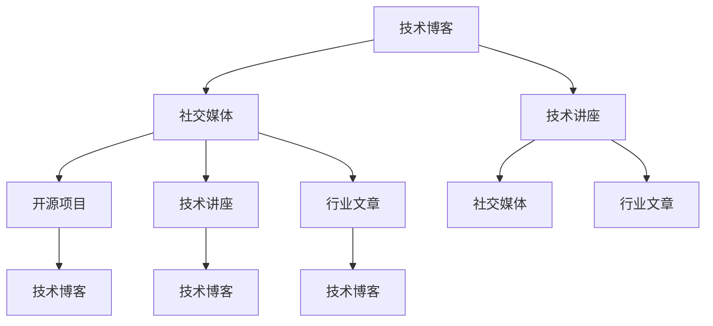

                 

# 程序员如何打造个人IP矩阵

> 关键词：个人品牌建设,技术博客,社交媒体,开发者社区,网络影响力

## 1. 背景介绍

在现代社会，个人IP矩阵的打造已经成为了一种趋势，尤其是在IT行业。程序员作为一个高度专业化的群体，其个人IP矩阵不仅能够提升自身的知名度和影响力，还能为他们的职业发展带来更多的机会和资源。

### 1.1 什么是个人IP矩阵

个人IP矩阵，即个人的品牌形象和信息展示的矩阵，包括多个维度的信息，如技术博客、社交媒体账号、开源项目、技术讲座、行业会议等。通过多渠道的输出，能够全面展示个人的专业技能和思想深度，从而建立独特且具影响力的个人品牌。

### 1.2 为什么程序员需要打造个人IP矩阵

1. **职业发展的驱动力**：建立个人IP矩阵可以帮助程序员在职业上获得更多认可，增加曝光度，从而提升职位和薪酬水平。
2. **技术分享的渠道**：通过博客、社交媒体、开源项目等形式，程序员可以分享自己的技术心得和项目经验，帮助同行学习和成长。
3. **提升行业影响力**：在技术社区和行业会议上发表文章、演讲，可以提升程序员在行业内的知名度和影响力。
4. **建立专业声誉**：持续的高质量输出可以树立专业形象，成为某技术领域的意见领袖。

### 1.3 个人IP矩阵的构成要素

一个完整的个人IP矩阵主要包括以下几个方面：

1. **技术博客**：通过撰写技术文章，分享个人技术见解和项目经验。
2. **社交媒体**：利用微博、微信、LinkedIn等平台，发布技术动态，互动交流。
3. **开源项目**：贡献代码，参与开源项目，展示技术能力。
4. **技术讲座**：在技术会议、讲座、沙龙上分享经验，提升影响力。
5. **行业文章**：在行业知名刊物、媒体发表文章，扩大影响范围。

## 2. 核心概念与联系

### 2.1 核心概念概述

要打造个人IP矩阵，首先需要明确几个核心概念：

- **技术博客**：个人技术文章的集合，是展示技术深度和思想广度的主要平台。
- **社交媒体**：在社交平台上建立个人账号，与同行交流互动，建立个人品牌。
- **开源项目**：参与开源社区，贡献代码，提升技术声誉。
- **技术讲座**：在技术会议上发言，展示技术实力，扩大影响力。
- **行业文章**：在行业刊物上发表文章，展示专业水平，提升行业知名度。

这些概念通过以下Mermaid流程图展示它们的相互联系：



### 2.2 核心概念原理和架构

个人IP矩阵的构建基于以下几个基本原理：

1. **内容为王**：高质量的技术内容是个人IP矩阵的核心，能够吸引同行关注，建立专业形象。
2. **多渠道展示**：通过多种渠道展示技术成果，如技术博客、社交媒体、开源项目等，形成全面的展示矩阵。
3. **持续更新**：定期更新个人IP矩阵中的内容，保持新鲜度和吸引力。
4. **互动交流**：通过社交媒体和行业会议等渠道，与同行交流互动，建立良好的人际关系。

## 3. 核心算法原理 & 具体操作步骤

### 3.1 算法原理概述

个人IP矩阵的构建虽然不涉及传统意义上的算法，但其背后的原理可以类比于网络爬虫、信息检索等算法。目标是高效地构建和维护个人品牌，最大化地展示个人技术实力和影响力。

### 3.2 算法步骤详解

以下是构建个人IP矩阵的具体操作步骤：

1. **确定目标和定位**：明确个人IP矩阵的目标，如成为某技术领域的专家，提升知名度等。确定个人品牌定位，如技术专家、架构师、全栈开发者等。
2. **选择平台和工具**：根据目标和定位选择合适的技术博客平台（如Medium、CSDN、知乎等）、社交媒体平台（如微博、LinkedIn、微信等）和开发工具（如GitHub、Jekyll等）。
3. **创建技术博客**：撰写高质量的技术文章，展示技术深度和广度。定期更新博客，保持活跃度。
4. **社交媒体互动**：在社交媒体上发布技术动态，与同行交流互动，回答问题。定期发布原创内容，展示专业技能。
5. **参与开源项目**：选择感兴趣的开源项目，贡献代码，展示技术实力。关注项目的活跃度，选择影响力大的项目参与。
6. **参加技术讲座**：在技术会议上发言，分享经验，提升影响力。选择与个人技术栈相关的会议参与，展示专业能力。
7. **发表行业文章**：在行业知名刊物、媒体发表技术文章，扩大影响范围。选择与个人技术栈相关的刊物投稿。

### 3.3 算法优缺点

**优点**：

- **全面展示技术实力**：通过多种渠道展示技术成果，形成全面的个人IP矩阵。
- **建立专业形象**：高质量的技术内容和高频率的互动，能够建立专业形象。
- **提升知名度**：通过社交媒体和技术讲座等渠道，能够提升个人在行业内的知名度。

**缺点**：

- **时间成本高**：多渠道展示需要投入大量时间，对工作和生活有一定的影响。
- **内容创作难度大**：高质量的技术内容创作需要较高的技术水平和表达能力。
- **需持续维护**：个人IP矩阵需要定期更新和维护，以保证其新鲜度和吸引力。

### 3.4 算法应用领域

个人IP矩阵构建不仅适用于技术领域，还适用于其他专业领域。例如，律师可以通过建立法律博客、发布专业文章，提升行业知名度；设计师可以通过社交媒体展示作品、参加设计讲座，建立设计风格。

## 4. 数学模型和公式 & 详细讲解 & 举例说明

### 4.1 数学模型构建

个人IP矩阵的构建可以抽象为以下几个关键模型的构建：

1. **内容质量模型**：评估技术文章、社交媒体动态等内容的深度和质量。
2. **曝光度模型**：计算不同渠道内容的曝光度和阅读量。
3. **互动模型**：统计社交媒体互动量、评论数等。
4. **影响力模型**：综合评价个人在不同平台的影响力。

### 4.2 公式推导过程

以下是一些简单的公式示例，用于评估内容质量和曝光度：

- **内容质量公式**：

$$
Q = \frac{R + C}{L}
$$

其中，$Q$为内容质量，$R$为阅读量，$C$为评论数，$L$为文章长度（假设长度与质量正相关）。

- **曝光度公式**：

$$
E = \frac{S + T + B}{N}
$$

其中，$E$为曝光度，$S$为社交媒体转发数，$T$为技术博客点击量，$B$为LinkedIn分享数，$N$为总样本数。

### 4.3 案例分析与讲解

以某知名程序员为例，其技术博客每月阅读量达20万次，平均每篇文章评论数超过100条，社交媒体账号每条动态平均转发量500次，LinkedIn分享数每月平均50次。通过计算可得：

- 内容质量$Q = \frac{20万 + 100}{L}$，假设每篇文章平均长度为5000字，则$Q \approx \frac{20万 + 100}{5000} = 40$（假设质量与长度正相关）。
- 曝光度$E = \frac{500 + 20万 + 50}{总样本数}$，假设总样本数为5000，则$E \approx \frac{500 + 20万 + 50}{5000} = 400$。

根据公式计算，该程序员的内容质量和曝光度均处于较高水平，说明其个人IP矩阵构建得较为成功。

## 5. 项目实践：代码实例和详细解释说明

### 5.1 开发环境搭建

以下是使用Python和Jekyll搭建技术博客的流程：

1. **安装Jekyll**：通过命令行安装Jekyll，创建一个技术博客项目。

```bash
gem install jekyll
jekyll new myblog
cd myblog
```

2. **配置Github Pages**：在Github上创建一个仓库，并配置为Github Pages，用于托管博客内容。

```bash
git init
git remote add origin https://github.com/<username>/myblog.git
git push -u origin master
```

3. **本地搭建测试环境**：通过本地服务器搭建Jekyll环境，验证博客部署。

```bash
bundle exec jekyll serve
```

### 5.2 源代码详细实现

以下是使用Python编写技术博客的示例代码：

```python
from markdown import markdown

def write_tech_blog(title, content):
    with open('blog/' + title + '.md', 'w') as f:
        f.write('# ' + title + '\n')
        f.write('\n')
        f.write(markdown(content))
```

### 5.3 代码解读与分析

这段代码实现了将技术文章保存到本地博客目录的功能。通过调用`write_tech_blog`函数，可以将文章标题和内容作为参数传入，自动生成Markdown格式的博客文章。

## 6. 实际应用场景

### 6.1 技术博客

技术博客是展示技术深度和广度的重要平台。程序员可以通过博客分享项目经验、技术心得、解决方案等，吸引同行关注和互动。例如，某知名程序员每周定期发布一篇博客，内容包括新技术尝试、问题解决思路、代码实现技巧等。这些文章吸引了大量的访问量和评论，帮助其在技术社区内建立了深厚的专业声誉。

### 6.2 社交媒体

社交媒体是个人IP矩阵的重要组成部分，通过社交媒体可以与同行交流互动，建立良好的人际关系。例如，某程序员在LinkedIn上定期发布技术动态，参与技术讨论，回答问题，分享技术文章。通过这些活动，逐步建立了自己在技术领域的影响力。

### 6.3 开源项目

参与开源项目是展示技术实力和影响力的重要途径。程序员可以选择参与影响力大的项目，贡献代码，展示技术能力。例如，某程序员加入了某个知名开源项目，定期提交代码，参与社区讨论。通过这些活动，该程序员不仅提升了技术水平，还建立了广泛的行业联系。

### 6.4 技术讲座

技术讲座是展示技术实力和影响力的重要手段。程序员可以在技术会议上发言，分享经验，提升知名度。例如，某程序员每年参加多次技术会议，发表多篇技术讲座，展示了其在技术领域的深厚功底。

### 6.5 行业文章

发表行业文章可以扩大个人在行业内的知名度。程序员可以选择与个人技术栈相关的刊物投稿，展示专业水平。例如，某程序员在《程序员》杂志发表多篇技术文章，展示其在某技术领域的专业性，提升了其在行业内的知名度。

## 7. 工具和资源推荐

### 7.1 学习资源推荐

以下是推荐的个人IP矩阵构建学习资源：

1. **《网络结构、算法与应用》**：深入浅出介绍网络爬虫、信息检索等技术。
2. **《深度学习入门：基于TensorFlow》**：介绍深度学习模型的构建和优化。
3. **《编程之美》**：分享软件开发中的技术和经验。
4. **《Github Pages实战》**：介绍如何使用Github Pages搭建技术博客。
5. **《技术博客写作指南》**：介绍技术博客写作的规范和技巧。

### 7.2 开发工具推荐

以下是推荐的个人IP矩阵构建开发工具：

1. **Github Pages**：托管技术博客，提供简洁的展示平台。
2. **Jekyll**：构建静态网站，支持Markdown语法。
3. **Markdown**：轻量级的文本格式化工具，适合写博客。
4. **GitHub**：版本控制平台，方便协作和维护代码。
5. **Gitter**：社区交流工具，方便与同行互动。

### 7.3 相关论文推荐

以下是推荐的个人IP矩阵构建相关论文：

1. **《Web 3.0中的社交网络及其影响力分析》**：分析社交媒体对个人IP矩阵的影响。
2. **《开源社区中的技术贡献及其对个人影响力的影响》**：研究开源项目对个人技术实力的提升。
3. **《技术讲座对技术分享与影响力提升的影响》**：分析技术讲座对个人影响力的影响。
4. **《技术博客对职业发展的驱动作用》**：研究技术博客对个人职业发展的推动作用。

## 8. 总结：未来发展趋势与挑战

### 8.1 研究成果总结

个人IP矩阵的构建为程序员提供了展示技术实力和影响力的重要手段，已在技术领域取得了广泛应用。通过技术博客、社交媒体、开源项目、技术讲座和行业文章等多渠道展示，个人IP矩阵有效地提升了程序员在技术社区和行业内的知名度和影响力。

### 8.2 未来发展趋势

未来的个人IP矩阵构建将呈现以下几个趋势：

1. **技术多样性增强**：个人IP矩阵将涵盖更多技术领域，展示个人在多个技术栈上的深度和广度。
2. **数据驱动决策**：利用大数据和人工智能技术，优化个人IP矩阵的构建，提升展示效果。
3. **内容平台化**：个人IP矩阵将逐步平台化，形成集技术分享、社区交流、资源共享为一体的平台。
4. **国际化扩展**：个人IP矩阵将逐步扩展到国际范围，提升全球影响力。

### 8.3 面临的挑战

尽管个人IP矩阵的构建已取得显著成效，但仍面临以下挑战：

1. **内容创作难度大**：高质量的技术内容创作需要较高的技术水平和表达能力，对个人时间和精力要求较高。
2. **时间成本高**：多渠道展示需要投入大量时间，对工作和生活有一定的影响。
3. **维护成本高**：个人IP矩阵需要定期更新和维护，以保证其新鲜度和吸引力。

### 8.4 研究展望

未来的研究应在以下几个方面寻求新的突破：

1. **自动化内容创作**：利用人工智能技术，自动化生成高质量的技术文章和社交媒体内容。
2. **多渠道优化**：优化个人IP矩阵在不同平台上的展示效果，提升曝光度和互动率。
3. **社区协作**：利用社区协作机制，提高个人IP矩阵的构建效率和质量。
4. **国际化推广**：扩展个人IP矩阵的国际影响力，推动全球技术分享和交流。

## 9. 附录：常见问题与解答

**Q1：如何提升技术博客的质量？**

A: 提升技术博客质量需要从多个方面入手：

- **持续学习**：不断学习新技术、新工具，更新博客内容。
- **注重可读性**：使用清晰、简洁的语言，避免过度技术细节。
- **图表丰富**：合理使用图表、代码片段，增强博客的可视化效果。
- **读者互动**：积极与读者互动，回答评论和问题，提升互动率。

**Q2：如何选择开源项目参与？**

A: 选择开源项目需要考虑以下几个因素：

- **项目活跃度**：选择活跃度高、贡献活跃的项目，有助于快速展示技术实力。
- **项目规模**：选择规模适中、任务明确的项目，避免过于庞大的项目。
- **项目影响**：选择影响力大的项目，有助于提升个人知名度。
- **个人兴趣**：选择与个人技术栈和兴趣相符的项目，有助于提升个人投入和成就感。

**Q3：如何提升社交媒体互动率？**

A: 提升社交媒体互动率需要从以下几个方面入手：

- **定期更新**：定期发布技术动态和文章，保持活跃度。
- **互动回复**：积极回复评论和消息，建立良好的人际关系。
- **高质量内容**：分享高质量的技术内容和见解，吸引同行关注。
- **参与讨论**：参与技术讨论和社区活动，增强曝光度。

**Q4：如何进行技术讲座准备？**

A: 进行技术讲座准备需要从以下几个方面入手：

- **充分准备**：深入理解讲座主题，准备详实的幻灯片和示例代码。
- **互动环节**：设置互动环节，增强观众参与度。
- **后续跟进**：在讲座后发布总结文章和代码，进行后续跟进。

**Q5：如何选择行业文章投稿？**

A: 选择行业文章投稿需要考虑以下几个因素：

- **投稿质量**：选择与个人技术栈和兴趣相符的刊物投稿，提升投稿质量。
- **影响范围**：选择影响力大的刊物投稿，有助于提升个人知名度。
- **稿件格式**：按照刊物的格式要求撰写稿件，提升投稿成功率。
- **持续投稿**：定期投稿，建立长期的合作关系。

通过以上讨论，我们可以看到，个人IP矩阵的构建不仅需要技术实力，还需要良好的表达能力和人际交往能力。未来，随着技术的不断进步，个人IP矩阵的构建将更加高效和智能化，为程序员的职业发展带来更多机会和可能。

