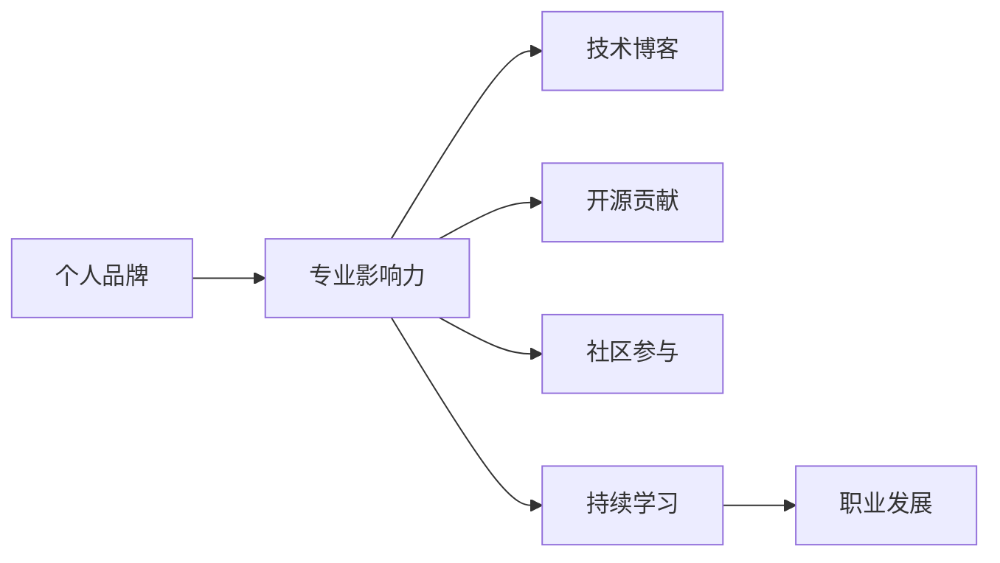

                 

# 程序员如何打造个人品牌IP

> 关键词：个人品牌, 专业影响力, 技术博客, 开源贡献, 社区参与, 持续学习, 职业发展

## 1. 背景介绍

在数字化时代的浪潮中，个人品牌（Personal Branding）已成为程序员在职业发展中不可或缺的一部分。一个具有强大个人品牌影响力的程序员，不仅能获得更高的职业认可，还能在业界内外积累更多的资源，甚至在技术领域内外影响行业趋势。本文将详细探讨程序员如何通过打造个人品牌IP，实现从普通技术人到行业领袖的跨越。

## 2. 核心概念与联系

### 2.1 核心概念概述

为更好地理解如何打造个人品牌IP，本节将介绍几个关键概念及其相互关系：

- **个人品牌**：程序员通过其在技术、行业、社区等领域的个人形象、专业知识、技能和贡献，在公众中建立的独特且可识别的人设。

- **专业影响力**：程序员在特定技术领域内获得的权威和认可，可通过技术贡献、公开演讲、媒体采访等方式体现。

- **技术博客**：程序员开设的、分享技术心得、行业见解和项目案例的个人或团队博客。

- **开源贡献**：程序员对开源项目（如GitHub）的代码贡献、代码审查、文档编写等活动。

- **社区参与**：程序员在技术社区（如Stack Overflow、GitHub、Reddit等）中的活跃度、影响力和互动性。

- **持续学习**：程序员不断更新和扩展自身技能，积极参与新技术、新方法的学习和实践。

- **职业发展**：程序员在职业生涯中的目标设定、职业规划和路径选择。

这些概念通过以下Mermaid流程图展示它们之间的联系：



## 3. 核心算法原理 & 具体操作步骤
### 3.1 算法原理概述

打造个人品牌IP，本质上是建立一个与技术相关、以专业知识和技能为核心吸引力的个人品牌形象。这通常包括：

- 在技术领域内积累权威地位。
- 在社交媒体和社区中建立活跃且专业的形象。
- 通过持续学习和实践，展示自身不断进步的能力。
- 通过开源项目和博客展示专业技能和知识。

### 3.2 算法步骤详解

程序员打造个人品牌IP的基本步骤包括：

1. **建立专业形象**：
   - 设定专业方向，成为某一技术领域的专家。
   - 创建个人博客或技术社区账号，持续分享技术心得和行业见解。

2. **积累开源贡献**：
   - 参与开源项目，贡献代码和文档。
   - 定期更新和维护已贡献的项目，展示专业能力。

3. **积极参与社区**：
   - 在技术社区中回答问题、参与讨论。
   - 主动提出问题，引导社区讨论，提高知名度。

4. **持续学习和提升**：
   - 不断学习新技术、新方法，定期完成培训和认证。
   - 参加技术会议和活动，拓宽知识面和视野。

5. **展现职业成就**：
   - 在LinkedIn、GitHub等平台展示职业成就和项目经历。
   - 接受行业媒体采访，提高曝光度。

### 3.3 算法优缺点

打造个人品牌IP的主要优点包括：

- 提升专业权威：通过技术贡献和社区参与，逐步建立权威地位。
- 增加曝光度：持续的博客输出和开源贡献，提高技术影响力。
- 拓展职业机会：获得更多行业内的认可和机会。

其缺点包括：

- 需要大量时间和精力投入。
- 需要不断学习，保持与技术前沿同步。
- 需持续维护个人品牌形象，避免负面影响。

### 3.4 算法应用领域

个人品牌IP的应用领域不仅限于技术领域，还扩展到职业发展、行业交流和商业合作等多个方面。

- **技术领域**：提升技术专业度和行业影响力。
- **职业发展**：助力职业晋升、项目获取和薪资提升。
- **行业交流**：与其他行业专家建立联系，拓展合作机会。
- **商业合作**：吸引潜在客户和合作伙伴，推动业务发展。

## 4. 数学模型和公式 & 详细讲解 & 举例说明

### 4.1 数学模型构建

个人品牌影响力的提升，可通过以下数学模型进行量化分析：

- **品牌影响力指数(BII)**：
  $$
  BII = I_{社交} + I_{技术} + I_{社区}
  $$
  其中，$I_{社交}$为社交媒体上的影响力和曝光度，$I_{技术}$为技术博客和开源项目的活跃度，$I_{社区}$为技术社区的参与度和贡献度。

### 4.2 公式推导过程

以GitHub为例，计算开源贡献对品牌影响力的贡献：

- 设一个程序员在GitHub上一年内贡献$n$个项目，每个项目平均获得$m$个star。则
  $$
  I_{技术} = n \times m
  $$
  假设社交媒体的影响力贡献为$I_{社交} = 2I_{技术}$，社区参与度贡献为$I_{社区} = 1.5I_{技术}$。则
  $$
  BII = 2I_{技术} + I_{技术} + 1.5I_{技术} = 4.5I_{技术}
  $$

### 4.3 案例分析与讲解

一个典型的案例是，某知名开源项目 maintainer 通过对一个流行技术框架的贡献，吸引了数千关注者。通过在技术博客上分享使用经验和改进建议，他进一步提升了影响力，吸引了更多开源项目贡献者。通过在Stack Overflow上回答技术问题，他建立了技术社区中的权威地位，最终获得了行业媒体的采访机会，显著提升了个人品牌影响力。

## 5. 项目实践：代码实例和详细解释说明

### 5.1 开发环境搭建

打造个人品牌IP，需要稳定的开发环境。以下是基本搭建步骤：

1. **创建GitHub账号**：
   - 注册GitHub账号，使用GitHub Pages托管个人博客。

2. **配置开发环境**：
   - 使用PyCharm或VSCode等IDE，安装所需依赖。
   - 配置版本控制，使用Git管理代码。

3. **开设个人博客**：
   - 使用WordPress或Jekyll等工具，创建个人技术博客。
   - 定期更新博客内容，分享技术心得和行业见解。

### 5.2 源代码详细实现

以下是一个简单的技术博客创建和维护示例：

```python
# 创建GitHub仓库
!mkdir blog
!git init
!git remote add origin https://github.com/yourusername/blog.git

# 安装Jekyll环境
!pip install jekyll

# 配置Jekyll
!jekyll new blog --blog-in-theme
!cp _config.yml.example _config.yml

# 编写博客内容
!echo "title: 关于个人品牌" >> _config.yml
!echo "description: 分享技术心得和行业见解" >> _config.yml
!echo "theme: jekyll-theme-blog" >> _config.yml

# 发布博客
!jekyll serve
```

### 5.3 代码解读与分析

**关键步骤**：

- 创建一个GitHub仓库，作为个人博客的存储库。
- 安装Jekyll，这是一个基于Ruby的静态网站生成器。
- 配置博客的参数，如标题、描述、主题等。
- 编写和发布博客内容。
- 启动本地服务器，查看博客效果。

**注意事项**：

- 定期更新博客内容，保持与技术前沿同步。
- 分享实用的技术文章和行业见解，吸引更多读者关注。
- 使用专业博客工具，提升博客的用户体验和可访问性。

### 5.4 运行结果展示

运行上述代码后，可以在浏览器中访问`localhost:4000`，查看已发布的博客文章。

## 6. 实际应用场景

### 6.1 技术博客与个人品牌

技术博客是展示技术能力和专业知识的有效途径。通过持续的博客输出，程序员可以建立自己的技术权威地位，吸引更多的读者和关注者。

**案例**：某技术博主通过分享最新技术趋势和实战经验，迅速成为特定技术领域的知名专家。他的博客不仅吸引了数万技术爱好者，还获得了各大媒体的采访和推荐，显著提升了个人品牌影响力。

### 6.2 开源贡献与个人品牌

开源项目是程序员展示技术实力和合作精神的重要平台。通过积极参与开源项目，程序员可以建立良好的社区形象，提升技术影响力和行业地位。

**案例**：某开源项目 maintainer 通过高效、高质量的代码贡献，吸引了众多技术爱好者。他不仅在社区中建立了权威地位，还获得了行业媒体的关注和报道，显著提升了个人品牌影响力。

### 6.3 社区参与与个人品牌

积极参与技术社区，如Stack Overflow、GitHub等，可以提升程序员在社区中的活跃度和知名度。通过回答问题、提出问题、引导讨论，程序员可以逐步积累社区影响力。

**案例**：某技术社区活跃者通过积极回答问题和提出问题，引导社区讨论，逐渐成为社区中的知名人士。他的活跃度和影响力吸引了更多关注，最终获得了行业媒体的报道和采访。

### 6.4 未来应用展望

未来，个人品牌IP的打造将更加注重多维度、多平台的发展。除了技术博客和开源贡献，以下方向也值得关注：

- **视频博客**：通过视频展示技术项目和应用场景，提升个人品牌的影响力。
- **社交媒体**：在微博、LinkedIn等社交媒体上分享技术心得和行业见解，扩大曝光度。
- **线上讲座**：通过线上讲座和公开课，展示专业知识和技能，吸引更多关注者。
- **企业合作**：与企业技术团队合作，参与技术培训和项目开发，提升个人品牌的专业认可度。

## 7. 工具和资源推荐
### 7.1 学习资源推荐

1. **《程序员打造个人品牌IP指南》**：由知名技术专家撰写的指南，详细介绍了技术博主、开源贡献者、社区活跃者的成功案例和经验。
2. **《技术博客最佳实践》**：介绍如何创建和维护高质量技术博客的文章，涵盖内容规划、SEO优化等关键点。
3. **《开源项目贡献指南》**：提供开源项目贡献的详细指南，涵盖代码贡献、代码审查、社区互动等各个方面。
4. **《社区参与技巧》**：分享如何在技术社区中建立活跃度、影响力，获得更多关注和认可的技巧。
5. **《持续学习工具集》**：推荐持续学习所需的各种工具，如在线课程、技术社区、学习管理软件等。

### 7.2 开发工具推荐

1. **GitHub**：全球最大的开源平台，提供代码托管、版本控制、协作工具等功能，适合开源贡献和技术分享。
2. **Jekyll**：优秀的静态网站生成器，易于使用，适合创建和维护技术博客。
3. **PyCharm**：功能强大的IDE，支持Python、Java等多种编程语言，适合开发和测试。
4. **VSCode**：轻量级但功能强大的IDE，支持多种编程语言和工具扩展。
5. **Hugo**：基于Go语言的静态网站生成器，易于配置和使用，适合技术博客的快速搭建。

### 7.3 相关论文推荐

1. **《技术博主的影响力测量与分析》**：研究技术博主的影响力和传播机制，量化分析其品牌影响力。
2. **《开源贡献者成功案例研究》**：详细介绍了开源贡献者的成功经验和案例，为其他开发者提供参考。
3. **《社区参与与个人品牌建设》**：研究技术社区中的活跃度和影响力提升方法，助力个人品牌建设。

## 8. 总结：未来发展趋势与挑战
### 8.1 研究成果总结

通过本文的系统梳理，可以看到个人品牌IP的打造对于程序员职业发展的重要性。打造个人品牌IP不仅能提升技术影响力，还能拓展职业机会，获得更多认可。

### 8.2 未来发展趋势

未来，个人品牌IP的打造将更加注重多维度、多平台的发展。视频博客、社交媒体、线上讲座、企业合作等新方向将进一步扩展个人品牌的影响力和应用场景。

### 8.3 面临的挑战

尽管个人品牌IP的打造有诸多好处，但也面临诸多挑战：

- **时间管理**：需要投入大量时间和精力，平衡工作和个人品牌建设。
- **技术更新**：需要不断学习新技术，保持与技术前沿同步。
- **内容质量**：需要持续产出高质量的内容，才能吸引和保持读者关注。

### 8.4 研究展望

未来，个人品牌IP的打造需要从多个维度进行深入研究：

- **多平台整合**：如何更好地整合社交媒体、博客、开源平台等，实现多平台联动，提升个人品牌影响力。
- **内容个性化**：如何根据不同平台和受众，个性化定制内容，提高传播效果。
- **持续评估与优化**：通过数据驱动的方法，持续评估个人品牌影响力，并根据反馈进行优化。

## 9. 附录：常见问题与解答

**Q1: 如何提升技术博客的阅读量？**

A: 提升技术博客阅读量的方法包括：
- 定期更新博客内容，保持与技术前沿同步。
- 在社交媒体和社区平台分享博客内容，吸引更多读者。
- 加入技术社区和论坛，主动讨论并分享链接。

**Q2: 如何平衡工作和个人品牌建设？**

A: 平衡工作和个人品牌建设的关键在于时间管理：
- 设定固定的时间段，专门用于个人品牌建设。
- 利用碎片时间，如通勤、休息等，进行学习和输出。
- 高效利用工具，如时间管理软件、内容管理系统等。

**Q3: 如何确保内容质量？**

A: 确保内容质量的关键在于：
- 深入理解技术内容，避免浅显和错误的信息。
- 多角度、多层次展示内容，提升可读性。
- 引入专业审稿机制，确保内容质量。

**Q4: 如何提高社区参与度？**

A: 提高社区参与度的方法包括：
- 积极回答问题，提供高质量的答案。
- 主动提出问题，引导社区讨论。
- 参与社区活动，如技术会议、线上讲座等。

**Q5: 如何评估个人品牌影响力？**

A: 评估个人品牌影响力的方法包括：
- 使用品牌影响力指数(BII)模型，量化评估影响力。
- 关注社交媒体和社区平台上的关注度和互动情况。
- 收集媒体报道和采访情况，评估曝光度和认可度。

---

作者：禅与计算机程序设计艺术 / Zen and the Art of Computer Programming

