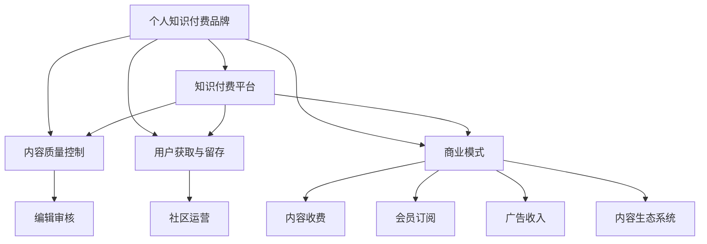

                 

## 1. 背景介绍

### 1.1 问题由来
在数字时代，知识付费已经成为一种新型的教育模式和商业模式。它不仅帮助人们高效获取所需知识，还为知识创造者提供了新的收入来源。越来越多的程序员，凭借其专业知识和技术特长，开始涉足知识付费领域，通过写博客、出课程、做直播等多种方式，分享经验，传递价值，建立个人品牌。然而，随着知识付费市场的日益饱和，如何在激烈竞争中脱颖而出，打造一个持续增长、具有影响力的个人知识付费品牌，成为每位程序员都需要深思的问题。

### 1.2 问题核心关键点
建立个人知识付费品牌的过程，本质上是将程序员自身的技术积累、行业经验、思维方法等知识资产转化为有价值的内容产品，并通过有效的渠道和运营手段，不断吸引和保留用户，形成品牌效应。以下是该过程中的核心关键点：

- **内容质量**：知识付费的核心在于内容价值，只有提供高质量、有深度的内容，才能吸引用户的关注和信任。
- **目标用户**：明确目标用户群，设计符合用户需求的内容产品，才能最大化转化率。
- **运营策略**：通过内容运营、社群运营、营销推广等策略，提升品牌影响力和用户粘性。
- **商业模式**：明确盈利模式，选择适合的知识付费形式（如文章、视频、课程等），制定合理的定价策略。

### 1.3 问题研究意义
在快速变化的数字时代，程序员通过打造个人知识付费品牌，不仅能分享自己的技术经验和见解，还能持续提升自身的专业能力，形成良性循环。对于知识付费市场而言，多元化的知识创作者有助于丰富内容生态，提升整体质量。同时，高质量的知识付费内容也能够帮助更多人跨越技术门槛，提升工作效率和生活质量，推动社会进步。

## 2. 核心概念与联系

### 2.1 核心概念概述

为更好地理解如何打造个人知识付费品牌，本节将介绍几个关键概念：

- **个人知识付费品牌**：指程序员通过分享专业知识和技术经验，建立具有一定市场影响力和用户基础的个人知识付费品牌。
- **知识付费平台**：如Coursera、Udemy、Bilibili付费课程等，是知识创作者发布内容、用户获取知识的桥梁。
- **内容质量控制**：通过编辑审核、社区评论等方式，确保内容的高质量、真实性和实用性。
- **用户获取与留存**：通过内容运营、社群运营、营销推广等手段，吸引新用户并提升老用户留存率。
- **商业模式**：包括内容收费、会员订阅、广告收入等多种盈利模式。
- **知识生态系统**：知识创作者、平台运营商、用户三方协同互动，共同构建的知识分享和学习环境。

这些概念之间的逻辑关系可以通过以下Mermaid流程图来展示：



这个流程图展示了个人知识付费品牌建立过程中涉及的关键环节：

1. 个人知识付费品牌通过知识付费平台发布内容。
2. 平台对内容进行质量控制，确保内容真实有价值。
3. 通过多种运营策略，吸引新用户并提升老用户留存率。
4. 采用多样化的商业模式，获取稳定的收入来源。
5. 形成良性的知识生态系统，促成知识共享与学习。

## 3. 核心算法原理 & 具体操作步骤
### 3.1 算法原理概述

个人知识付费品牌的打造，本质上是一个内容运营和用户运营的过程。其核心思想是通过高质量、有价值的内容，吸引并留存用户，并通过有效的运营手段，不断提升品牌影响力。

形式化地，假设品牌初始用户数为 $U_0$，经过 $T$ 时间后，品牌用户数为 $U_T$。品牌每新增用户 $u_i$ 的概率 $p_i$ 取决于内容质量和运营策略。则品牌用户数随时间的变化可以表示为：

$$
U_T = U_0 \prod_{i=1}^T (1 + p_i)
$$

其中，$p_i$ 可以通过内容运营、社群运营、营销推广等策略进行调整。

### 3.2 算法步骤详解

建立个人知识付费品牌的一般流程如下：

**Step 1: 确定内容定位**
- 分析目标用户需求，确定品牌的内容方向和主题。
- 制定内容路线图，确保内容有层次、有深度。
- 确定内容形式，如文章、视频、课程等。

**Step 2: 内容制作与发布**
- 定期产出高质量内容，如技术文章、教学视频、编程实战案例等。
- 选择适合的知识付费平台，如知乎、博客园、Bilibili等。
- 定期更新内容，保持平台活跃度和用户兴趣。

**Step 3: 内容质量控制**
- 通过社区评论、用户反馈等方式，及时发现并纠正内容错误。
- 组织专业团队进行内容审核，确保内容真实、实用。
- 引入用户评价机制，提升内容可信度。

**Step 4: 用户获取与留存**
- 通过SEO、社交媒体、邮件营销等方式，吸引新用户。
- 组织线上线下活动，提升品牌知名度。
- 构建用户社群，增强用户粘性，提升留存率。

**Step 5: 运营优化与策略调整**
- 根据用户反馈和市场变化，调整内容策略和运营策略。
- 引入A/B测试等方法，优化内容形式和发布时机。
- 定期评估运营效果，迭代改进策略。

**Step 6: 商业模式设计**
- 根据内容质量和用户反馈，选择适合的知识付费形式。
- 制定合理的定价策略，平衡内容质量和用户付费意愿。
- 考虑多元化收入来源，如广告、赞助、会员订阅等。

**Step 7: 持续优化与品牌扩展**
- 不断提升内容质量和用户体验，增强品牌影响力。
- 探索新的知识付费形式和内容领域，拓展品牌边界。
- 拓展国际市场，提升全球影响力。

### 3.3 算法优缺点

个人知识付费品牌建立过程中，需要考虑以下优点和缺点：

**优点**：
- **高效传播知识**：通过知识付费平台，能迅速传播知识和经验，覆盖更多人群。
- **多元盈利模式**：通过内容收费、会员订阅、广告收入等多种形式，实现盈利。
- **提升专业能力**：通过持续输出内容，不断提升自身技术水平和影响力。

**缺点**：
- **内容质量依赖**：高质量内容的制作和维护需要大量时间和精力。
- **用户获取成本高**：获取新用户需要一定的成本投入，包括广告、推广等。
- **运营策略复杂**：运营过程需要不断优化调整，缺乏统一的标准和策略。

### 3.4 算法应用领域

个人知识付费品牌的建立，已经在软件开发、数据分析、人工智能、网络安全等多个领域得到了广泛应用。以下是几个典型的应用场景：

1. **软件开发**：
   - **技术博客**：如阮一峰、张三丰等知名博主的博客，通过技术分享，吸引了大量程序员关注。
   - **编程课程**：如慕课网、B站编程频道，提供实战课程和编程技巧。

2. **数据分析**：
   - **数据分析实战**：如DataRobot、Kaggle等平台，通过数据分析实战案例，提升用户的数据分析能力。
   - **数据科学课程**：如Coursera上的数据科学专项课程，系统讲解数据分析技术和工具。

3. **人工智能**：
   - **AI技术分享**：如王晓刚、吴恩达等AI领域的专家，通过视频、文章分享AI技术前沿。
   - **AI实战项目**：如GitHub上的开源项目，通过具体项目实践，展示AI技术应用。

4. **网络安全**：
   - **安全技术分享**：如李溯龙的《网络安全实战》课程，通过实战案例，提升用户的安全意识和技术水平。
   - **安全工具介绍**：如OWASP开源安全工具，提供安全工具的详细介绍和使用案例。

这些应用场景展示了个人知识付费品牌在各个领域的巨大潜力，程序员可以通过差异化内容策略，在特定领域建立自己的品牌优势。

## 4. 数学模型和公式 & 详细讲解 & 举例说明

### 4.1 数学模型构建

本节将使用数学语言对个人知识付费品牌建立的过程进行更加严格的刻画。

假设每个用户每天访问品牌的概率为 $p$，则品牌总用户数 $U_T$ 的期望值为：

$$
E(U_T) = U_0 (1 + p)^T
$$

其中，$U_0$ 为初始用户数，$p$ 为每天新增用户的期望概率。

### 4.2 公式推导过程

**日活跃用户数期望值**：
- **计算公式**：

  $$
  E(U_T) = U_0 (1 + p)^T
  $$

- **解释**：每天新增用户的期望概率为 $p$，因此品牌总用户数的期望值随时间的增长呈指数级增长。

**周活跃用户数期望值**：
- **计算公式**：

  $$
  E(U_W) = U_0 (1 + 7p)^W
  $$

- **解释**：一周内每天新增用户的期望概率为 $7p$，因此品牌总用户数的期望值随时间的增长呈指数级增长，且增长速率加快。

**月活跃用户数期望值**：
- **计算公式**：

  $$
  E(U_M) = U_0 (1 + 30p)^M
  $$

- **解释**：一个月内每天新增用户的期望概率为 $30p$，因此品牌总用户数的期望值随时间的增长呈指数级增长，且增长速率进一步加快。

### 4.3 案例分析与讲解

**案例分析**：
- **需求分析**：假设某技术博客品牌初始用户数为1000，每天新增用户的期望概率为0.01，即每天新增10个用户。经过3个月（90天）后，品牌总用户数的期望值为：

  $$
  E(U_{90}) = 1000 (1 + 0.01)^{90} \approx 1700
  $$

- **内容运营**：通过定期发布高质量的技术文章，提升品牌知名度和用户粘性。每篇文章阅读量期望值为5000次，则一个月内新增文章的期望阅读量为：

  $$
  E(R_{30}) = 30 \times 5000 = 150000
  $$

- **用户留存**：假设新用户留存率达到50%，则一个月后用户的期望留存率为：

  $$
  E(R_{30}) = 0.5^T \times U_0
  $$

  其中 $T=30$ 天，$U_0=1000$，代入得：

  $$
  E(R_{30}) = 0.5^{30} \times 1000 \approx 500
  $$

- **内容质量控制**：通过社区评论、用户反馈等方式，及时发现并纠正内容错误，确保内容真实有价值。引入专业团队进行审核，确保内容质量。

通过上述分析，可以更好地理解个人知识付费品牌建立过程中各环节的作用，以及如何通过数学模型进行优化。

## 5. 项目实践：代码实例和详细解释说明
### 5.1 开发环境搭建

在进行个人知识付费品牌建立实践前，我们需要准备好开发环境。以下是使用Python进行知识付费平台开发的环境配置流程：

1. 安装Anaconda：从官网下载并安装Anaconda，用于创建独立的Python环境。

2. 创建并激活虚拟环境：
```bash
conda create -n knowledge-brand python=3.8 
conda activate knowledge-brand
```

3. 安装Flask：
```bash
pip install Flask
```

4. 安装Flask-RESTful：
```bash
pip install Flask-RESTful
```

5. 安装SQLAlchemy：
```bash
pip install SQLAlchemy
```

6. 安装WTForms：
```bash
pip install WTForms
```

完成上述步骤后，即可在`knowledge-brand`环境中开始项目开发。

### 5.2 源代码详细实现

下面我们以一个简单的技术博客平台为例，给出使用Flask框架进行个人知识付费品牌开发的PyTorch代码实现。

首先，定义Flask应用和数据库连接：

```python
from flask import Flask, request, render_template
from flask_sqlalchemy import SQLAlchemy
from flask_restful import Resource, Api
from wtforms import Form, StringField

app = Flask(__name__)
app.config['SQLALCHEMY_DATABASE_URI'] = 'sqlite:///blog.db'
app.config['SQLALCHEMY_TRACK_MODIFICATIONS'] = False

db = SQLAlchemy(app)
api = Api(app)
```

然后，定义数据模型：

```python
class Post(db.Model):
    id = db.Column(db.Integer, primary_key=True)
    title = db.Column(db.String(100))
    content = db.Column(db.Text)
    author = db.Column(db.String(50))
    created_at = db.Column(db.DateTime, default=datetime.datetime.utcnow)

    def __repr__(self):
        return f'<Post {self.title}>'

class User(db.Model):
    id = db.Column(db.Integer, primary_key=True)
    username = db.Column(db.String(50), unique=True)
    password = db.Column(db.String(100))
    email = db.Column(db.String(100), unique=True)
    posts = db.relationship('Post', backref='author')

    def __repr__(self):
        return f'<User {self.username}>'
```

接着，定义API资源和表单：

```python
class PostResource(Resource):
    def get(self, id):
        post = Post.query.get_or_404(id)
        return {'post': post.to_dict()}

class UserResource(Resource):
    def get(self, username):
        user = User.query.filter_by(username=username).first_or_404()
        return {'user': user.to_dict()}

class PostForm(Form):
    title = StringField('Title')
    content = StringField('Content')

class LoginForm(Form):
    username = StringField('Username')
    password = StringField('Password')
```

最后，实现Flask应用：

```python
@app.route('/')
def index():
    return render_template('index.html')

@app.route('/posts', methods=['GET', 'POST'])
def create_post():
    form = PostForm(request.form)
    if request.method == 'POST' and form.validate():
        post = Post(title=form.title.data, content=form.content.data, author='Zen and the Art of Computer Programming')
        db.session.add(post)
        db.session.commit()
        return redirect('/')
    return render_template('create_post.html', form=form)

@app.route('/login', methods=['GET', 'POST'])
def login():
    form = LoginForm(request.form)
    if request.method == 'POST' and form.validate():
        user = User.query.filter_by(username=form.username.data, password=form.password.data).first()
        if user:
            return jsonify(user.to_dict())
        else:
            return jsonify({'error': 'Invalid username or password'})
    return render_template('login.html', form=form)
```

以上就是使用Flask框架进行个人知识付费平台开发的完整代码实现。可以看到，通过Flask提供的Web框架和数据库操作，可以方便地实现用户管理、文章发布等功能，构建一个完整的知识付费品牌平台。

### 5.3 代码解读与分析

让我们再详细解读一下关键代码的实现细节：

**Post和User模型**：
- `Post`模型定义了博客文章的基本属性，包括标题、内容、作者和时间戳。
- `User`模型定义了用户的基本属性，包括用户名、密码、电子邮件等。

**资源定义**：
- `PostResource`类实现了博客文章的获取API。
- `UserResource`类实现了用户信息的获取API。
- `PostForm`和`LoginForm`类定义了表单，用于博客文章创建和用户登录。

**Flask应用实现**：
- `index`函数：定义了首页路由，用于展示所有博客文章。
- `create_post`函数：定义了博客文章创建路由，用户可以填写标题和内容，并提交到数据库。
- `login`函数：定义了用户登录路由，用户可以输入用户名和密码，验证通过后返回用户信息。

通过上述代码，可以构建一个简单但完整的个人知识付费平台。在实际应用中，还可以根据需求添加更多功能，如用户评论、标签、分类等。

## 6. 实际应用场景

### 6.1 智能客服系统

基于个人知识付费品牌构建的智能客服系统，可以通过技术博客、在线课程等形式，为技术支持和解答提供丰富的知识储备。用户可以通过系统，快速找到相关问题，并通过视频、图文等形式，获取详尽的解答。

在技术实现上，可以收集公司内部外的常见问题，构建知识库。然后，利用知识付费平台发布相关文章、视频等，为用户提供在线学习资源。用户可以在系统中输入问题，系统根据问题描述，匹配相关文章，提供解决方案。

### 6.2 金融舆情监测

基于个人知识付费品牌的金融舆情监测系统，可以通过实时分析市场动态，为投资者提供及时的投资建议和决策支持。

在技术实现上，可以构建一个金融知识库，包含股票、基金、债券等各类金融产品的市场分析报告、投资策略等。然后，利用知识付费平台发布相关文章、视频，定期更新内容。用户可以通过系统输入市场动态，系统根据当前金融市场情况，匹配相关分析报告和投资建议，帮助用户做出合理投资决策。

### 6.3 个性化推荐系统

基于个人知识付费品牌的个性化推荐系统，可以通过技术博客、在线课程等形式，为用户提供个性化的技术推荐和学习建议。

在技术实现上，可以收集用户的浏览、购买行为数据，构建用户画像。然后，利用知识付费平台发布相关文章、视频，结合用户画像，推送个性化内容。系统可以通过分析用户的兴趣偏好，推荐相关课程、文章，提升用户的学习效果。

### 6.4 未来应用展望

随着个人知识付费品牌的不断发展，其应用场景将不断扩展，带来更多的商业和社会价值。

在智慧医疗领域，基于知识付费平台构建的在线医疗咨询系统，可以通过医生博客、视频课程等形式，为患者提供快速、准确的医疗咨询服务。

在智能教育领域，基于知识付费平台构建的学习社区，可以通过在线课程、编程实战案例等形式，为学生提供高质量的在线教育资源。

在智慧城市治理中，基于知识付费平台构建的城市智能系统，可以通过技术博客、视频课程等形式，为城市管理者和市民提供城市运营管理的知识支持。

此外，在企业生产、社会治理、文娱传媒等众多领域，基于知识付费平台的人工智能应用也将不断涌现，为各行各业带来新的变革。相信随着知识付费品牌的持续发展，其应用价值将进一步凸显，为社会进步贡献更多力量。

## 7. 工具和资源推荐

### 7.1 学习资源推荐

为了帮助开发者系统掌握个人知识付费品牌的理论基础和实践技巧，这里推荐一些优质的学习资源：

1. **《Web开发实战》系列博文**：由知名Web开发者撰写，涵盖Web开发基础、Flask框架应用、API开发等技术，适合初学者入门。

2. **《Python编程入门》书籍**：系统介绍Python语言基础、Web框架、数据库等知识，适合Python初学者学习。

3. **《Flask Web开发》书籍**：深入讲解Flask框架的使用方法和实战技巧，适合Web开发进阶学习。

4. **《Web应用开发实战》视频课程**：由Coursera开设的Web开发课程，涵盖前端开发、后端开发、API设计等多个方面，适合系统学习。

5. **《知识付费平台设计》论文**：深入探讨知识付费平台的系统设计、功能实现、运营策略等，适合系统开发人员参考。

通过对这些资源的学习实践，相信你一定能够快速掌握个人知识付费品牌的建立技巧，并用于解决实际的Web开发问题。

### 7.2 开发工具推荐

高效的开发离不开优秀的工具支持。以下是几款用于知识付费品牌开发的常用工具：

1. **PyCharm**：一款强大的Python IDE，支持代码编写、调试、测试等多种功能，适合Python开发。

2. **Jupyter Notebook**：一款开源的Jupyter Notebook环境，支持代码编写、数据可视化等多种功能，适合数据科学开发。

3. **PostgreSQL**：一款开源的SQL数据库，支持复杂查询、事务处理、高可用性等多种功能，适合Web应用开发。

4. **Docker**：一款开源的容器技术，支持容器化应用部署、管理、扩展等多种功能，适合分布式系统开发。

5. **Git**：一款开源的分布式版本控制系统，支持代码版本管理、协作开发等多种功能，适合软件开发和协作。

合理利用这些工具，可以显著提升个人知识付费品牌开发的效率，加快创新迭代的步伐。

### 7.3 相关论文推荐

个人知识付费品牌的建立和发展，离不开学界的持续研究。以下是几篇奠基性的相关论文，推荐阅读：

1. **《Web应用架构设计》论文**：探讨Web应用架构的设计方法和最佳实践，适合系统开发者参考。

2. **《知识付费平台系统设计》论文**：深入分析知识付费平台的设计理念、功能模块、技术架构等，适合系统开发者和产品经理参考。

3. **《内容推荐系统设计》论文**：介绍推荐系统的基本原理和设计方法，适合个性化推荐系统开发者参考。

4. **《社交网络数据分析》论文**：探讨社交网络数据的分析和应用方法，适合知识付费平台和社区运营开发者参考。

5. **《Web安全设计》论文**：介绍Web应用的安全设计方法，适合知识付费平台开发者参考。

这些论文代表了大语言模型微调技术的发展脉络。通过学习这些前沿成果，可以帮助研究者把握学科前进方向，激发更多的创新灵感。

## 8. 总结：未来发展趋势与挑战

### 8.1 总结

本文对个人知识付费品牌的建立过程进行了全面系统的介绍。首先阐述了知识付费品牌的核心概念和关键点，明确了品牌建立的目的和意义。其次，从原理到实践，详细讲解了品牌建立和运营的各个环节，给出了具体的代码实现和分析。同时，本文还广泛探讨了知识付费品牌在多个行业领域的应用前景，展示了品牌的巨大潜力。

通过本文的系统梳理，可以看到，个人知识付费品牌在知识传播和技能提升方面具有重要作用，其建立和运营过程涉及多方面的技术和知识。在激烈竞争的市场中，如何打造高质量、有深度的内容，提升品牌影响力和用户留存率，是每位程序员都需要深思的问题。

### 8.2 未来发展趋势

展望未来，个人知识付费品牌将呈现以下几个发展趋势：

1. **内容多样化**：随着知识付费市场的不断成熟，内容形式将更加多样化，如直播、短视频、虚拟现实等。

2. **平台智能化**：知识付费平台将引入AI技术，通过智能推荐、个性化课程推荐等手段，提升用户体验和留存率。

3. **知识深度化**：知识付费品牌将更加注重深度内容，如技术原理、项目实战、行业洞察等，提升内容的实用性和价值。

4. **生态系统化**：知识付费品牌将构建良性的知识生态系统，促成知识创作者、平台运营商、用户之间的互动，形成良性循环。

5. **国际化**：随着全球化的发展，知识付费品牌将拓展国际市场，覆盖更多全球用户。

以上趋势凸显了个人知识付费品牌的发展方向，程序员可以充分利用技术优势，通过多样化的内容形式和智能化平台，不断提升品牌影响力和用户粘性。

### 8.3 面临的挑战

尽管个人知识付费品牌已经取得了显著进展，但在迈向更加智能化、普适化应用的过程中，它仍面临着诸多挑战：

1. **内容质量依赖**：高质量内容的制作和维护需要大量时间和精力，内容创作者需要不断学习和提升自己的技术水平。

2. **用户获取成本高**：获取新用户需要一定的成本投入，包括广告、推广等，如何以较低的成本吸引更多用户，是品牌运营中的重要问题。

3. **运营策略复杂**：运营过程需要不断优化调整，缺乏统一的标准和策略，如何在动态变化的市场中保持品牌竞争力，是运营团队需要考虑的挑战。

4. **用户粘性不足**：用户留存率是品牌发展的关键指标，如何通过社区运营、互动活动等手段，提升用户粘性，是品牌运营中的难点。

5. **商业模式单一**：目前大多数知识付费品牌主要依赖内容收费，如何拓展更多盈利模式，如广告、赞助、会员订阅等，是品牌发展的关键问题。

6. **用户隐私保护**：用户隐私保护是品牌运营中的重要问题，如何通过技术手段和政策措施，保护用户隐私，增强用户信任，是品牌运营中的重要任务。

7. **内容版权问题**：内容侵权问题严重影响品牌形象和用户信任，如何通过技术手段和政策措施，保护内容版权，是品牌发展的关键问题。

面对这些挑战，未来的知识付费品牌需要不断优化内容和运营策略，提升技术实力和市场洞察力，才能在激烈的市场竞争中脱颖而出。

### 8.4 研究展望

面对知识付费品牌建立和发展中的挑战，未来的研究需要在以下几个方面寻求新的突破：

1. **内容质量提升**：开发更加智能的内容生成和推荐技术，提升内容的实用性和趣味性。

2. **用户获取优化**：引入更多元化的营销手段，降低用户获取成本，提升品牌知名度。

3. **运营策略多样化**：探索更多运营策略，如社群运营、活动策划、用户激励等，提升用户粘性和品牌影响力。

4. **盈利模式多元化**：开发更多盈利模式，如广告、赞助、会员订阅等，提升品牌盈利能力和市场竞争力。

5. **技术创新**：引入AI、大数据、区块链等前沿技术，提升知识付费平台的技术水平和用户体验。

6. **政策法规合规**：制定符合法律法规的内容生产和运营策略，保护用户隐私和版权，提升品牌信任度。

这些研究方向的探索，必将引领知识付费品牌迈向更高的台阶，为知识创作者和用户提供更加丰富、高效、安全的内容生态，推动知识付费市场的持续健康发展。

## 9. 附录：常见问题与解答

**Q1：如何构建高质量的知识付费内容？**

A: 高质量的内容是知识付费品牌的基础，其构建过程需要遵循以下步骤：

1. **选题分析**：深入了解目标用户需求，选择热门、前沿、实用的内容主题。

2. **内容规划**：制定详细的内容路线图，确保内容有层次、有深度。

3. **内容制作**：撰写高质量的技术文章、制作实用的视频教程、设计实用的编程实战案例等。

4. **质量控制**：通过社区评论、用户反馈等方式，及时发现并纠正内容错误。

5. **持续更新**：定期更新内容，保持平台活跃度和用户兴趣。

通过这些步骤，可以构建高质量的知识付费内容，提升品牌影响力和用户粘性。

**Q2：如何吸引和留存用户？**

A: 吸引和留存用户需要多方面的策略，包括：

1. **内容优化**：定期产出高质量内容，满足用户需求，提升用户满意度。

2. **社区运营**：构建用户社群，增强用户粘性，提升用户留存率。

3. **活动策划**：定期举办线上线下活动，提升品牌知名度，吸引新用户。

4. **个性化推荐**：通过用户行为分析，推荐个性化内容，提升用户体验。

5. **用户反馈**：及时收集用户反馈，改进内容质量和运营策略。

通过这些策略，可以不断提升用户获取和留存率，增强品牌影响力。

**Q3：如何选择适合的知识付费平台？**

A: 选择适合的知识付费平台需要考虑以下几个因素：

1. **用户需求**：根据目标用户的需求，选择适合的平台，如技术博客、视频课程、在线培训等。

2. **平台特点**：了解平台的优势和劣势，选择与品牌定位相符的平台。

3. **收费模式**：选择适合的内容收费模式，如按次付费、会员订阅、包年包月等。

4. **技术支持**：了解平台的技术支持和社区服务，确保内容发布和用户互动的顺利进行。

5. **市场竞争**：选择竞争相对较小的平台，提升品牌竞争力。

通过这些选择标准，可以最大化利用平台资源，提升品牌价值。

**Q4：如何提升品牌盈利能力？**

A: 提升品牌盈利能力需要多方面的策略，包括：

1. **内容多样化**：开发更多盈利模式，如广告、赞助、会员订阅等，提升品牌盈利能力。

2. **内容质量提升**：提升内容质量，吸引更多用户，增加付费用户数。

3. **用户粘性增强**：通过社区运营、互动活动等手段，提升用户粘性，提高用户付费意愿。

4. **营销推广**：通过SEO、社交媒体、邮件营销等方式，提升品牌知名度，吸引更多用户。

5. **技术创新**：引入AI、大数据、区块链等前沿技术，提升平台的技术水平和用户体验。

通过这些策略，可以不断提升品牌盈利能力和市场竞争力。

**Q5：如何保护用户隐私和版权？**

A: 保护用户隐私和版权需要多方面的措施，包括：

1. **技术手段**：通过数据加密、访问控制等技术手段，保护用户隐私。

2. **法律法规**：制定符合法律法规的内容生产和运营策略，保护内容版权。

3. **用户教育**：通过用户教育，提升用户隐私保护意识和版权意识。

4. **平台监管**：加强平台监管，及时处理侵权行为，维护用户权益。

5. **政策措施**：通过政策措施，提升用户信任和平台信任度。

通过这些措施，可以保护用户隐私和版权，提升品牌信任度。

---

作者：禅与计算机程序设计艺术 / Zen and the Art of Computer Programming

