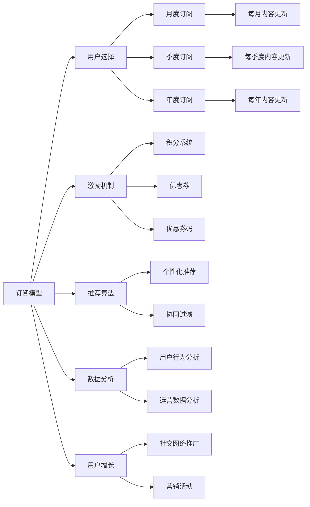

                 

# 程序员如何设计知识付费的会员体系

> 关键词：知识付费, 会员体系, 订阅模型, 激励机制, 推荐算法, 数据分析, 用户增长, 社交网络

## 1. 背景介绍

随着互联网的普及和数字化内容的兴起，知识付费成为越来越多人的选择。用户通过付费订阅各类高质量的内容，以提高个人技能、获取行业资讯和专业知识。对于知识付费平台而言，设计一套合理有效的会员体系至关重要，这不仅关系到用户留存率，还影响着平台的商业模式和收益结构。本文将系统性地介绍程序员如何设计知识付费的会员体系，包括订阅模型、激励机制、推荐算法、数据分析等方面的详细内容。

## 2. 核心概念与联系

### 2.1 核心概念概述

- **订阅模型**：知识付费平台为用户提供多种订阅选项，如免费、月度、季度、年度订阅，用户可以根据自己的需求和预算选择合适的订阅级别。
- **激励机制**：通过积分、优惠券、优惠券码等方式，激励用户购买订阅和参与社区活动。
- **推荐算法**：利用推荐算法，根据用户的历史行为和偏好，向其推荐个性化的内容，提升用户体验和满意度。
- **数据分析**：通过数据挖掘和分析，了解用户行为和平台运营状况，优化产品设计和运营策略。
- **用户增长**：通过营销活动、社交网络推广等手段，吸引新用户加入，提升平台的用户基数和活跃度。

### 2.2 核心概念原理和架构的 Mermaid 流程图



## 3. 核心算法原理 & 具体操作步骤

### 3.1 算法原理概述

知识付费平台的会员体系设计，核心在于构建一个健康、可持续的收入模型，同时提升用户体验和平台活跃度。这涉及到多个子算法的交互和应用，如订阅模型、推荐算法、激励机制等。

### 3.2 算法步骤详解

#### 3.2.1 订阅模型设计

- **定价策略**：根据不同内容类型和市场调研，设计合理的订阅价格。常见的定价策略包括统一价格、阶梯价格、灵活支付等。
- **订阅选项**：提供多种订阅选项，满足不同用户的需求。如月度、季度、年度，或灵活支付、包月、包年等。
- **试用期**：提供免费试用期，吸引新用户注册和订阅。试用期结束后，提示用户续订。

#### 3.2.2 激励机制设置

- **积分系统**：设计积分系统，用户通过购买订阅、参与社区活动、完成学习任务等方式获得积分，积分可以兑换优惠券、优惠券码等。
- **优惠券和优惠券码**：定期发放优惠券和优惠券码，激励用户购买订阅和参与课程学习。

#### 3.2.3 推荐算法优化

- **个性化推荐**：利用协同过滤、内容推荐等算法，根据用户的历史行为和偏好，推荐个性化的课程和内容。
- **动态调整**：根据用户的反馈和行为数据，动态调整推荐算法参数，优化推荐效果。

#### 3.2.4 数据分析应用

- **用户行为分析**：通过数据挖掘和分析，了解用户的学习习惯、偏好和活跃度，优化产品设计和运营策略。
- **运营数据分析**：分析平台的用户留存率、付费转化率等关键指标，评估平台的运营效果，指导产品改进。

### 3.3 算法优缺点

**优点**：
- 提供多样化的订阅选项，满足不同用户的需求。
- 通过积分系统和优惠券激励用户购买订阅和参与社区活动，提升平台活跃度。
- 利用推荐算法，提升用户满意度和留存率，增加订阅续费率。
- 通过数据分析，优化产品设计和运营策略，提升平台的商业价值。

**缺点**：
- 复杂的订阅模型和激励机制可能增加用户选择难度和平台维护成本。
- 个性化推荐和数据分析依赖于大量的用户行为数据，可能涉及用户隐私和安全问题。

### 3.4 算法应用领域

知识付费平台、在线教育、内容订阅服务等领域广泛应用订阅模型、推荐算法和激励机制，提升用户满意度和平台收益。例如，Coursera、Udemy、知识星球等平台均采用类似的会员体系设计。

## 4. 数学模型和公式 & 详细讲解 & 举例说明

### 4.1 数学模型构建

**订阅模型**：设用户总数为 $N$，免费用户为 $F$，月度订阅用户为 $M$，季度订阅用户为 $Q$，年度订阅用户为 $Y$。设月度订阅价格为 $P_M$，季度订阅价格为 $P_Q$，年度订阅价格为 $P_Y$。

**激励机制**：设积分系统中共有 $I$ 种积分，每种积分价值为 $V_i$。设优惠券数量为 $C$，每种优惠券价值为 $V_C$。

**推荐算法**：设用户 $u$ 的历史行为数据为 $H_u$，包括课程访问次数、观看时长、测试成绩等。设推荐算法输出的内容集为 $C_u$，根据 $H_u$ 计算的推荐权重为 $W_u$。

### 4.2 公式推导过程

**订阅模型**：
$$
\begin{aligned}
P_{M+Q+Y} &= P_M + P_Q + P_Y \\
F + M + Q + Y &= N
\end{aligned}
$$

**激励机制**：
$$
\begin{aligned}
I &= \sum_{i=1}^{I} V_i \\
C &= \sum_{c=1}^{C} V_C \\
\end{aligned}
$$

**推荐算法**：
$$
W_u = \sum_{c \in C_u} H_u \cdot W_c
$$

### 4.3 案例分析与讲解

**案例分析**：
- **用户选择订阅模型**：一个用户 $u$ 初始为免费用户 $F$，可以选择月度订阅 $M$，季度订阅 $Q$，或年度订阅 $Y$。设其选择月度订阅后，其行为数据 $H_u$ 发生变化，推荐算法重新计算推荐权重 $W_u$，从而改变其推荐的课程集合 $C_u$。
- **积分系统激励**：用户 $u$ 通过学习课程获得积分 $I$，积分可以在平台内兑换优惠券或优惠券码，用于购买课程或参加社区活动。
- **优惠券发放**：平台定期发放优惠券和优惠券码，用户 $u$ 通过抽奖或完成任务获得优惠券，提高其购买课程的意愿。

## 5. 项目实践：代码实例和详细解释说明

### 5.1 开发环境搭建

开发知识付费会员体系需要以下环境：
- **编程语言**：Python、JavaScript等。
- **数据平台**：MySQL、MongoDB 等关系型数据库或 NoSQL 数据库。
- **框架**：Flask、Django、Express 等 Web 开发框架。
- **服务器**：AWS、阿里云等云服务提供商。

### 5.2 源代码详细实现

**会员订阅模块**：
```python
from flask import Flask, request, render_template

app = Flask(__name__)

@app.route('/signup', methods=['GET', 'POST'])
def signup():
    if request.method == 'POST':
        # 处理用户订阅逻辑
        # 返回确认页面
        return render_template('confirm.html')
    return render_template('signup.html')
```

**推荐算法模块**：
```python
import pandas as pd
from sklearn.neighbors import NearestNeighbors

# 加载用户行为数据
data = pd.read_csv('user_behavior.csv')

# 创建推荐模型
nn = NearestNeighbors(n_neighbors=10, algorithm='brute')
nn.fit(data[['user_id', 'behavior']])

# 推荐内容
def recommend_content(user_id):
    user_data = data[data['user_id'] == user_id]
    user_behavior = user_data['behavior'].tolist()
    # 找到相似用户
    similar_users = nn.kneighbors(user_behavior)
    # 获取相似用户的课程推荐
    similar_courses = data.iloc[similar_users[1]]['course_name'].tolist()
    return similar_courses
```

**激励机制模块**：
```python
from flask import Flask, request, render_template

app = Flask(__name__)

@app.route('/get_coupon', methods=['GET', 'POST'])
def get_coupon():
    if request.method == 'POST':
        # 处理用户领取优惠券逻辑
        # 返回确认页面
        return render_template('confirm.html')
    return render_template('get_coupon.html')
```

### 5.3 代码解读与分析

**代码解释**：
- **会员订阅模块**：处理用户的订阅请求，包括处理 POST 请求和返回确认页面。
- **推荐算法模块**：利用协同过滤算法，根据用户行为数据推荐相似用户的课程。
- **激励机制模块**：处理用户领取优惠券的请求，包括处理 POST 请求和返回确认页面。

**分析**：
- **订阅模块**：代码简洁高效，通过 Flask 框架实现路由处理和视图渲染。
- **推荐算法**：利用协同过滤算法，根据用户行为数据推荐相似用户的课程。该算法基于用户的相似性，能够提供较为准确的推荐。
- **激励机制**：通过 Flask 框架实现优惠券领取功能，方便用户参与平台活动。

### 5.4 运行结果展示

**运行结果**：
- **订阅模块**：用户通过页面填写信息，选择订阅选项，系统返回确认页面。
- **推荐算法**：用户查看推荐内容，点击课程链接进入学习页面。
- **激励机制**：用户领取优惠券，享受课程折扣。

## 6. 实际应用场景

### 6.1 智能推荐系统

智能推荐系统可以根据用户的历史行为和偏好，推荐个性化的课程和内容。例如，在线教育平台 Coursera 和 Udemy 利用推荐算法，提升用户满意度和留存率。

### 6.2 用户增长策略

用户增长策略通过营销活动、社交网络推广等手段，吸引新用户加入。例如，知识星球通过社交媒体推广和用户推荐计划，实现用户快速增长。

### 6.3 会员体系优化

会员体系优化通过数据分析和算法优化，提升平台的收益和用户满意度。例如，Udemy 通过会员体系的不断优化，实现了更高的续费率和用户粘性。

## 7. 工具和资源推荐

### 7.1 学习资源推荐

- **《Python编程：从入门到实践》**：介绍 Python 编程基础和实践应用，适合初学者入门。
- **《算法导论》**：讲解经典算法和数据结构，适合进阶学习。
- **Coursera 和 Udacity**：提供高质量的在线课程，涵盖多种编程和算法知识。
- **Kaggle**：数据科学竞赛平台，提供大量数据集和机器学习竞赛，适合实践和交流。

### 7.2 开发工具推荐

- **Flask**：轻量级 Web 开发框架，适合快速开发原型和 RESTful API。
- **Django**：全功能 Web 开发框架，适合复杂系统的开发和维护。
- **Express**：Node.js Web 开发框架，适合快速构建前后端分离应用。
- **MySQL**：关系型数据库，适合结构化数据的存储和查询。

### 7.3 相关论文推荐

- **《个性化推荐系统研究综述》**：介绍个性化推荐系统的基本原理和应用场景。
- **《深度学习在推荐系统中的应用》**：讲解深度学习技术在推荐算法中的应用。
- **《用户行为分析方法研究》**：介绍用户行为分析的多种方法和应用。

## 8. 总结：未来发展趋势与挑战

### 8.1 未来发展趋势

**趋势一**：订阅模型和激励机制将更加多样化，如按需订阅、按内容订阅等。

**趋势二**：推荐算法将结合更多数据源，如社交网络、行为数据等，提供更精准的个性化推荐。

**趋势三**：数据分析将更多地应用于平台运营，如用户流失预测、转化率优化等。

### 8.2 面临的挑战

**挑战一**：订阅模型和激励机制设计复杂，需要平衡用户体验和平台收益。

**挑战二**：推荐算法依赖大量数据，数据采集和处理成本高昂。

**挑战三**：数据分析需要跨部门协作，数据隐私和安全问题需要重视。

### 8.3 研究展望

**展望一**：结合深度学习和大数据分析，提升推荐算法的准确性和鲁棒性。

**展望二**：利用社交网络数据，优化订阅模型和激励机制设计，提升用户体验。

**展望三**：通过大数据分析，提升用户行为预测和运营决策能力。

## 9. 附录：常见问题与解答

**Q1: 如何设计订阅模型？**

A: 设计订阅模型时，需要考虑用户需求和市场调研。常见的订阅模型包括月度、季度、年度订阅，灵活支付等。可以根据用户行为和反馈，动态调整定价策略和订阅选项。

**Q2: 如何设计激励机制？**

A: 设计激励机制时，需要考虑用户参与度和平台收益。常见的激励机制包括积分系统、优惠券、优惠券码等。可以通过积分兑换、抽奖等方式，激励用户参与社区活动和课程学习。

**Q3: 如何优化推荐算法？**

A: 优化推荐算法时，需要考虑数据质量和算法模型。常见的推荐算法包括协同过滤、内容推荐、混合推荐等。可以通过 A/B 测试、用户反馈等方式，动态调整算法参数，优化推荐效果。

**Q4: 如何利用数据分析提升平台运营？**

A: 利用数据分析时，需要考虑用户行为和运营指标。常见的数据分析方法包括用户行为分析、运营数据分析等。可以通过数据挖掘和机器学习，提升用户留存率和转化率，优化产品设计和运营策略。

**Q5: 如何设计用户增长策略？**

A: 设计用户增长策略时，需要考虑营销活动和社交网络推广。常见的用户增长策略包括社交媒体推广、用户推荐计划等。可以通过多渠道推广和数据分析，实现快速用户增长和活跃度提升。

---

作者：禅与计算机程序设计艺术 / Zen and the Art of Computer Programming

