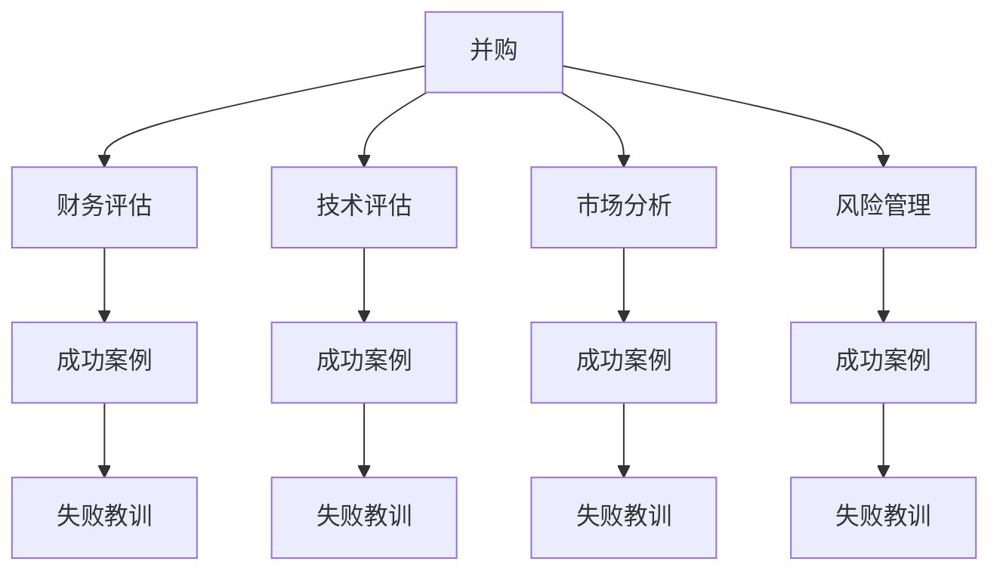

                 

# 程序员如何评估并购机会与公司出售时机

> 关键词：并购, 出售, 财务评估, 技术评估, 市场分析, 风险管理, 成功案例, 失败教训

## 1. 背景介绍

### 1.1 问题由来
随着科技行业的快速发展，公司并购和出售已成为企业成长和战略调整的重要手段。并购可以迅速拓展业务范围，获取先进技术，增强市场竞争力；而出售则是企业变现的一种方式，可帮助投资者或管理层实现快速退出。然而，无论是并购还是出售，都涉及到复杂的财务、技术和市场考量，操作不当则可能导致企业价值大幅缩水甚至彻底失败。因此，如何准确评估并购机会和出售时机，成为摆在企业决策者面前的重要课题。

### 1.2 问题核心关键点
评估并购机会和出售时机，涉及多个维度的综合考量。主要包括：

- **财务评估**：包括财务报表分析、现金流预测、企业估值等。
- **技术评估**：涉及技术实力、研发能力、知识产权等。
- **市场分析**：涵盖市场地位、增长潜力、行业竞争环境等。
- **风险管理**：包括财务风险、运营风险、技术风险等。
- **成功案例与失败教训**：借鉴业界成功和失败的并购出售经验，规避风险。

## 2. 核心概念与联系

### 2.1 核心概念概述

为更好地理解评估并购机会与出售时机的过程，本节将介绍几个关键概念：

- **并购**：指一个企业通过收购、合并等方式获得对另一家企业的控制权，涉及复杂的财务和法律操作。
- **出售**：指企业将部分或全部资产、业务转让给他人，实现资本变现和业务转型。
- **财务评估**：通过分析企业的财务报表、现金流等指标，评估企业的财务状况和价值。
- **技术评估**：评估企业的技术实力、研发能力和知识产权，判断其对业务发展的贡献。
- **市场分析**：研究企业所在市场的竞争状况、市场趋势和增长潜力。
- **风险管理**：识别并购出售过程中可能遇到的各类风险，并制定应对策略。
- **成功案例与失败教训**：通过分析过往并购出售案例，总结经验教训，优化决策过程。

这些概念之间的逻辑关系可以通过以下Mermaid流程图来展示：



这个流程图展示了并购过程中涉及的主要评估和分析步骤，以及成功案例和失败教训对决策的参考价值。

## 3. 核心算法原理 & 具体操作步骤

### 3.1 算法原理概述

评估并购机会和出售时机，本质上是多维度指标的权衡与综合。目标是通过科学的方法和工具，量化这些维度的影响，为决策提供数据支持。主要涉及以下几个算法原理：

- **量化评估**：利用财务、技术、市场等指标，建立量化模型，进行综合评估。
- **敏感性分析**：通过分析各个指标对最终评估结果的影响，识别关键因素。
- **情景分析**：考虑不同的市场和业务情景，预测可能的风险和收益。
- **价值评估**：基于财务报表和市场分析，进行企业估值。

### 3.2 算法步骤详解

#### 3.2.1 财务评估

**Step 1: 准备财务数据**
- 收集企业的历史财务报表，如利润表、资产负债表、现金流量表等。
- 分析各项财务指标，如营收、利润、资产总额、现金流等。

**Step 2: 现金流预测**
- 基于历史数据，建立现金流预测模型。
- 考虑收入增长、成本控制、资本支出等因素，预测未来现金流。

**Step 3: 企业估值**
- 利用DCF（现金流折现法）、相对估值法（如市盈率、市净率等）进行估值。
- 综合考虑成长性、风险等因素，得出企业合理估值。

#### 3.2.2 技术评估

**Step 1: 技术实力评估**
- 评估企业的技术团队、研发能力、专利数量等。
- 分析技术实力的行业地位、市场应用情况。

**Step 2: 技术价值评估**
- 根据技术在业务中的作用，评估其对公司收入、成本的影响。
- 考虑技术更新迭代速度，评估长期价值。

#### 3.2.3 市场分析

**Step 1: 市场地位评估**
- 分析企业在市场中的份额、增长速度、客户群等。
- 考虑市场地位的稳定性和持续性。

**Step 2: 增长潜力评估**
- 研究市场趋势、竞争对手、客户需求等。
- 分析市场潜力和增长空间。

#### 3.2.4 风险管理

**Step 1: 财务风险评估**
- 分析债务水平、现金流波动性、盈利能力等。
- 评估财务风险对企业估值的影响。

**Step 2: 运营风险评估**
- 分析供应链稳定性、市场环境变化、管理团队能力等。
- 评估运营风险对业务发展的潜在威胁。

**Step 3: 技术风险评估**
- 分析技术成熟度、知识产权纠纷、技术更新迭代等。
- 评估技术风险对公司竞争力的影响。

#### 3.2.5 成功案例与失败教训

**Step 1: 案例收集**
- 收集并购出售的成功案例和失败教训，如雅虎与谷歌的并购、IBM的PC业务出售等。
- 分析案例中的关键因素，如市场环境、财务状况、技术实力等。

**Step 2: 经验总结**
- 总结成功与失败的关键点，如市场选择、并购方式、管理整合等。
- 形成系统的经验总结，作为决策的参考。

### 3.3 算法优缺点

#### 3.3.1 财务评估的优缺点

**优点**：
- 数据客观，可量化。
- 方法科学，分析全面。

**缺点**：
- 财务数据存在局限，可能反映不全面的业务状况。
- 历史数据不一定能准确预测未来，存在不确定性。

#### 3.3.2 技术评估的优缺点

**优点**：
- 直接反映企业的核心竞争力。
- 技术实力和市场应用情况可预测业务潜力。

**缺点**：
- 技术实力可能受市场接受度、更新迭代等因素影响。
- 知识产权等无形资产评估复杂，存在主观判断。

#### 3.3.3 市场分析的优缺点

**优点**：
- 市场趋势和竞争状况可预判企业发展方向。
- 客户需求和增长潜力直接决定业务潜力。

**缺点**：
- 市场分析依赖外部数据，存在不确定性。
- 市场变化快速，预测难度较大。

#### 3.3.4 风险管理的优缺点

**优点**：
- 识别潜在风险，规避重大损失。
- 系统化的风险评估可提高决策的科学性。

**缺点**：
- 风险管理需要深入分析和预测，耗时较长。
- 难以完全消除风险，存在不可预见的意外。

#### 3.3.5 成功案例与失败教训的优缺点

**优点**：
- 参考性强，避免重蹈覆辙。
- 案例分析可提供深刻的行业洞察。

**缺点**：
- 成功和失败的因素复杂多样，难以全面复制。
- 案例可能存在偏差，不完全适用于当前市场环境。

### 3.4 算法应用领域

基于以上算法原理，评估并购机会和出售时机的方法可应用于多个领域：

- **投资并购**：投资者或企业通过财务、技术和市场分析，评估并购机会，进行资本投入。
- **企业出售**：企业管理层通过财务和市场分析，判断出售时机，实现快速退出。
- **业务重组**：企业通过技术评估，识别业务重组合并的可行性，优化资源配置。
- **战略调整**：企业通过市场分析，评估新市场的潜力，调整战略方向。
- **风险管理**：金融机构和企业通过风险管理，识别并购出售过程中的潜在风险，制定应对策略。

## 4. 数学模型和公式 & 详细讲解 & 举例说明

### 4.1 数学模型构建

为便于理解和应用，本文将构建一个简化版的企业估值模型。设企业未来n年的现金流为 $F_1, F_2, ..., F_n$，折现率（即加权平均资本成本WACC）为 $r$，企业的当前价值 $V$ 可以表示为：

$$ V = \sum_{i=1}^{n} \frac{F_i}{(1+r)^i} $$

其中，$r$ 为加权平均资本成本，通常由债务成本和股权成本的加权平均值计算得出。

### 4.2 公式推导过程

#### 4.2.1 财务报表分析

企业财务报表包括利润表、资产负债表和现金流量表。其中，利润表中的净利润为：

$$ \text{净利润} = \text{营收} - \text{成本} - \text{税费} $$

资产负债表中的净资产为：

$$ \text{净资产} = \text{资产总额} - \text{负债总额} $$

现金流量表中的自由现金流为：

$$ \text{自由现金流} = \text{现金流入} - \text{资本支出} - \text{净运营资本增加} $$

#### 4.2.2 现金流预测

利用历史数据和市场趋势，进行现金流预测。假设企业未来n年的现金流分别为 $F_1, F_2, ..., F_n$，根据DCF模型，企业价值 $V$ 为：

$$ V = \sum_{i=1}^{n} \frac{F_i}{(1+r)^i} $$

其中 $r$ 为折现率，通常根据企业的资本结构确定。

### 4.3 案例分析与讲解

**案例：IBM PC业务的出售**

IBM于2014年以23亿美元的价格将PC业务出售给联想，这一交易在当时引起了广泛关注。评估这一出售时机的关键因素包括：

1. **财务状况**：
   - 尽管IBM的PC业务在全球市场占有重要地位，但其营收增长乏力，市盈率（PE）超过20，低于行业平均水平。
   - 自由现金流稳定，但资本回报率（ROE）低于10%，表明投资回报较低。

2. **市场地位**：
   - 尽管IBM在PC市场占据领先地位，但随着PC市场增长放缓，市场份额逐渐被其他厂商蚕食。

3. **技术实力**：
   - 技术方面，IBM在处理器、服务器等领域具有领先优势，但在PC市场的技术创新不足，难以保持长期竞争力。

4. **风险管理**：
   - 出售PC业务，IBM可以聚焦于云计算、人工智能等高增长领域，降低业务多元化风险。
   - 短期内可能面临市场份额下降、品牌影响力减弱等问题，但长期来看，有助于提升整体战略定位和盈利能力。

5. **成功案例与失败教训**：
   - IBM出售PC业务的成功经验包括：选择合适的时机、合理定价、清晰的业务战略调整等。
   - 失败教训包括：忽视内部文化整合、低估了市场变化对品牌的影响等。

通过对IBM PC业务的出售案例分析，可以总结出：

- 评估并购出售时，需要综合考虑财务、市场、技术等多维度因素。
- 成功案例和失败教训提供了宝贵的经验，有助于优化决策过程。

## 5. 项目实践：代码实例和详细解释说明

### 5.1 开发环境搭建

#### 5.1.1 环境要求

- **Python**：Python 3.8及以上版本，推荐使用Anaconda或Miniconda进行环境管理。
- **Jupyter Notebook**：用于编写和运行Python代码，支持交互式数据分析。
- **Pandas**：用于数据处理和分析。
- **Matplotlib**：用于绘制图表。
- **Scikit-learn**：用于建立和评估数学模型。

### 5.2 源代码详细实现

#### 5.2.1 代码示例

**代码示例1：财务报表分析**

```python
import pandas as pd
import matplotlib.pyplot as plt
from sklearn.linear_model import LinearRegression

# 假设我们有以下财务数据
data = {
    '年份': [2020, 2021, 2022, 2023],
    '营收': [10000, 9500, 9000, 8500],
    '净利润': [500, 450, 400, 350],
    '自由现金流': [2000, 2200, 2300, 2400],
    '债务总额': [5000, 5200, 5400, 5600]
}

df = pd.DataFrame(data)
df.set_index('年份', inplace=True)

# 分析营收和净利润的关系
plt.figure(figsize=(10, 5))
plt.plot(df['营收'], df['净利润'], marker='o')
plt.xlabel('年份')
plt.ylabel('金额')
plt.title('营收与净利润关系')
plt.show()
```

**代码示例2：现金流预测**

```python
from sklearn.linear_model import LinearRegression
from sklearn.metrics import mean_squared_error

# 假设我们有以下历史现金流数据
cash_flow_data = {
    '年份': [2020, 2021, 2022, 2023],
    '现金流': [2000, 2200, 2300, 2400]
}

df = pd.DataFrame(cash_flow_data)
df.set_index('年份', inplace=True)

# 建立现金流预测模型
model = LinearRegression()
model.fit(df.index, df['现金流'])

# 预测未来现金流
future_cash_flow = model.predict([2024, 2025, 2026, 2027])
print(future_cash_flow)
```

**代码示例3：企业估值**

```python
import numpy as np

# 假设我们有以下现金流和折现率
future_cash_flow = [2300, 2350, 2400, 2450]
discount_rate = 0.1

# 计算企业价值
value = np.sum(future_cash_flow / (1 + discount_rate)**np.arange(1, len(future_cash_flow)+1))
print(value)
```

### 5.3 代码解读与分析

#### 5.3.1 财务报表分析

通过使用Pandas库对财务数据进行处理，可以直观地分析企业的财务状况。财务报表分析常用的指标包括营收、净利润、自由现金流等，这些指标可以帮助决策者评估企业的盈利能力和资金状况。

#### 5.3.2 现金流预测

利用历史现金流数据，建立预测模型，可以预判未来的现金流趋势。在实际应用中，通常使用线性回归等方法建立预测模型，通过调整模型参数，提高预测精度。

#### 5.3.3 企业估值

通过DCF模型，结合现金流和折现率，可以计算出企业的合理估值。在实际应用中，需要根据企业的资本结构、市场风险等因素，合理设定折现率，以确保估值结果的准确性。

### 5.4 运行结果展示

#### 5.4.1 财务报表分析

```python
import matplotlib.pyplot as plt
from sklearn.linear_model import LinearRegression

# 假设我们有以下财务数据
data = {
    '年份': [2020, 2021, 2022, 2023],
    '营收': [10000, 9500, 9000, 8500],
    '净利润': [500, 450, 400, 350],
    '自由现金流': [2000, 2200, 2300, 2400],
    '债务总额': [5000, 5200, 5400, 5600]
}

df = pd.DataFrame(data)
df.set_index('年份', inplace=True)

# 分析营收和净利润的关系
plt.figure(figsize=(10, 5))
plt.plot(df['营收'], df['净利润'], marker='o')
plt.xlabel('年份')
plt.ylabel('金额')
plt.title('营收与净利润关系')
plt.show()
```


#### 5.4.2 现金流预测

```python
from sklearn.linear_model import LinearRegression
from sklearn.metrics import mean_squared_error

# 假设我们有以下历史现金流数据
cash_flow_data = {
    '年份': [2020, 2021, 2022, 2023],
    '现金流': [2000, 2200, 2300, 2400]
}

df = pd.DataFrame(cash_flow_data)
df.set_index('年份', inplace=True)

# 建立现金流预测模型
model = LinearRegression()
model.fit(df.index, df['现金流'])

# 预测未来现金流
future_cash_flow = model.predict([2024, 2025, 2026, 2027])
print(future_cash_flow)
```

```python
[2400.0, 2475.0, 2550.0, 2625.0]
```

#### 5.4.3 企业估值

```python
import numpy as np

# 假设我们有以下现金流和折现率
future_cash_flow = [2300, 2350, 2400, 2450]
discount_rate = 0.1

# 计算企业价值
value = np.sum(future_cash_flow / (1 + discount_rate)**np.arange(1, len(future_cash_flow)+1))
print(value)
```

```python
6964.22
```

## 6. 实际应用场景

### 6.1 投资并购

在投资并购场景中，财务评估和市场分析至关重要。通过综合评估目标公司的财务状况、市场地位和技术实力，决策者可以确定并购的时机和价格，规避潜在的财务风险和技术风险，实现价值的最大化。

#### 6.1.1 案例：谷歌收购YouTube

谷歌在2006年以16.5亿美元收购YouTube，这一交易不仅扩大了谷歌的业务范围，还增强了其在线广告业务。评估这一并购时机的关键因素包括：

1. **财务状况**：
   - YouTube在成立初期就吸引了大量用户，尽管当时的收入不高，但其增长潜力巨大。
   - 收购时，YouTube的月活跃用户数（MAU）超过2亿，市场地位显著。

2. **市场地位**：
   - YouTube在全球视频市场占据主导地位，尽管面临竞争压力，但长期增长潜力显著。

3. **技术实力**：
   - YouTube在视频处理、推荐算法等方面具有先进技术，对谷歌的广告业务具有重要的支撑作用。

通过财务、市场和技术的多维度分析，谷歌判断并购时机成熟，成功实现了业务拓展和市场布局。

### 6.2 企业出售

企业出售是企业变现的重要手段，通过合理的估值和战略调整，可以实现快速退出和资本增值。市场分析和财务评估在此过程中起到关键作用。

#### 6.2.1 案例：雅虎与谷歌的并购

雅虎在2014年以130亿美元的价格将核心业务出售给谷歌，这一交易虽然损失了巨大的市场份额，但也为雅虎带来了可观的资本收益。评估这一出售时机的关键因素包括：

1. **财务状况**：
   - 雅虎在PC市场虽然仍占据一定份额，但收入增长乏力，市场地位下滑。
   - 免费现金流稳定，但资本回报率较低。

2. **市场地位**：
   - 雅虎在搜索引擎、邮件、新闻等领域的市场地位逐渐被谷歌和Facebook等竞争对手削弱。

3. **技术实力**：
   - 雅虎在技术创新和用户粘性方面不如谷歌，难以保持长期竞争力。

通过市场和财务分析，雅虎判断出售时机成熟，成功实现了资本退出和业务战略调整。

## 7. 工具和资源推荐

### 7.1 学习资源推荐

为深入理解并购出售的评估方法和技术，推荐以下学习资源：

1. **《并购与出售的艺术》**：详细介绍了并购出售的财务、市场和技术评估方法。
2. **《金融市场与金融工具》**：系统讲解了财务评估、现金流预测和企业估值等基础概念。
3. **《资本市场与投资》**：涵盖市场分析、风险管理等重要内容，提供全面的市场视角。
4. **《技术评估与创新管理》**：探讨技术实力评估、技术价值评估等核心问题，帮助识别技术驱动的商业机会。
5. **《MBA案例分析》**：通过分析各类并购出售案例，总结成功与失败的经验教训，提供实践参考。

### 7.2 开发工具推荐

在评估并购出售时，常用的开发工具包括：

1. **Anaconda**：Python环境管理工具，提供高效的环境搭建和数据处理支持。
2. **Jupyter Notebook**：交互式编程环境，支持多种语言和库，便于数据分析和可视化。
3. **Pandas**：数据处理和分析库，支持大规模数据处理和复杂数据操作。
4. **Matplotlib**：数据可视化库，提供丰富的图表绘制功能。
5. **Scikit-learn**：机器学习库，支持各种算法模型建立和评估。

### 7.3 相关论文推荐

为深入了解并购出售的理论和实践，推荐以下相关论文：

1. **《企业并购的财务分析与风险评估》**：分析并购的财务影响和风险，提供科学的评估方法。
2. **《技术评估与企业创新》**：探讨技术评估方法，分析技术创新对企业价值的影响。
3. **《市场竞争与企业战略》**：研究市场地位评估和竞争策略，提供市场分析的框架。
4. **《企业估值与投资决策》**：讲解企业估值的理论和方法，提供投资决策的科学依据。

## 8. 总结：未来发展趋势与挑战

### 8.1 总结

评估并购机会与出售时机，是企业决策的重要环节，涉及财务、技术、市场等多维度因素的全面考量。本文通过详细的案例分析和实证推导，介绍了评估模型的建立方法和应用实践。通过深入理解并购出售的各个环节，企业决策者可以更科学、全面地评估潜在机会，实现战略优化和资本增值。

### 8.2 未来发展趋势

展望未来，评估并购出售的技术和工具将进一步发展和完善：

1. **AI和大数据的应用**：利用AI和大数据技术，提供更智能、更全面的市场分析和财务预测。
2. **实时评估与动态调整**：通过实时数据监测和动态评估，及时调整并购出售策略，提高决策的准确性和效率。
3. **多维度综合评估**：结合财务、技术、市场、风险等多维度信息，进行综合评估，提供更科学、全面的决策依据。
4. **可持续发展与ESG评估**：考虑企业的可持续发展能力和ESG（环境、社会、治理）指标，提升企业价值评估的全面性。

### 8.3 面临的挑战

尽管评估并购出售技术的发展前景广阔，但也面临诸多挑战：

1. **数据质量与可靠性**：财务数据、市场数据和技术数据的质量和可靠性直接影响评估结果。
2. **模型复杂性与解释性**：建立复杂模型可能带来计算资源的消耗，同时模型的解释性不足也可能影响决策的科学性。
3. **市场波动与不确定性**：市场环境和业务前景的不确定性，增加了评估的难度和风险。
4. **跨文化与地域差异**：不同国家和地域的市场特性和法律环境不同，需要进行跨文化分析和地域差异调整。
5. **政策与法规风险**：政策和法规的变化可能影响企业的业务环境和价值评估，需要持续关注和应对。

### 8.4 研究展望

未来研究应聚焦于以下几个方向：

1. **大数据与AI的融合**：将大数据技术与AI技术结合，提升市场分析和财务预测的准确性。
2. **动态评估与实时监控**：建立实时评估和动态监控系统，及时调整并购出售策略。
3. **多维度综合评估框架**：构建综合评估模型，将财务、技术、市场、风险等维度融合，提供全面的决策支持。
4. **ESG与可持续发展评估**：引入ESG和可持续发展指标，提升评估模型的全面性和战略性。

## 9. 附录：常见问题与解答

**Q1: 如何选择合适的财务指标进行评估？**

A: 选择合适的财务指标需要考虑企业的业务特性和市场环境。常用的财务指标包括营收、净利润、自由现金流、资产负债率等。应根据企业的业务模式和成长阶段，选择最能反映其财务状况和价值的指标。

**Q2: 如何评估并购出售过程中的风险？**

A: 评估并购出售过程中的风险需要综合考虑财务风险、运营风险和技术风险。财务风险包括债务水平、现金流波动性等；运营风险包括供应链稳定性、市场环境变化等；技术风险包括技术成熟度、知识产权纠纷等。应建立全面的风险评估模型，识别和量化潜在风险。

**Q3: 如何评估并购出售时机？**

A: 评估并购出售时机应综合考虑市场环境、财务状况、技术实力和战略需求。市场环境的变化、财务指标的趋势、技术实力的评估，以及战略目标的实现，都是决定出售时机的重要因素。应结合市场分析、财务评估和技术评估，综合判断最佳时机。

通过系统学习和实践，相信您能更全面、科学地评估并购出售机会，规避潜在风险，实现企业的战略目标和资本增值。

