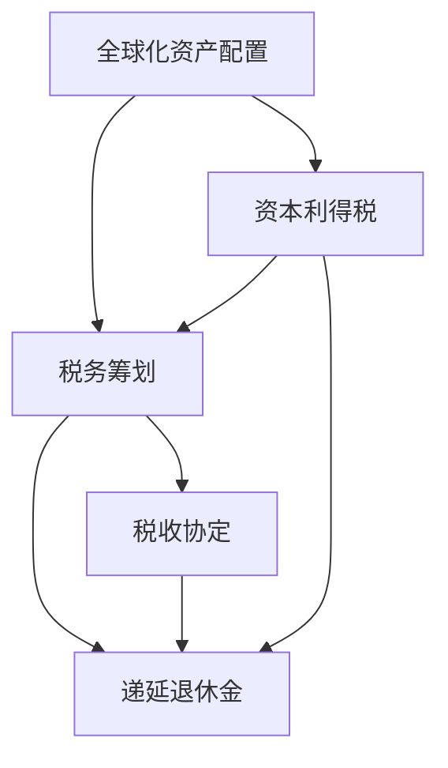

                 

# 程序员如何进行全球化资产配置与税务筹划

> 关键词：全球化资产配置,税务筹划,资本利得税,税收协定,递延退休金

## 1. 背景介绍

### 1.1 问题由来

随着全球化的加速和科技的发展，越来越多程序员选择在海外工作和生活，并在海外市场进行资产配置和税务筹划。然而，由于各国的税法规定各不相同，进行全球化资产配置和税务筹划面临着诸多挑战。如何合法、高效地进行全球化资产配置，并合理避税，成为了程序员需要考虑的重要问题。

### 1.2 问题核心关键点

- **全球化资产配置**：在多个国家进行资产配置，以分散风险、最大化收益。
- **税务筹划**：合理合法地减轻税务负担，提升个人或公司的财务收益。
- **资本利得税**：在出售资产时产生的税收。
- **税收协定**：不同国家之间签订的协议，旨在减少双重征税。
- **递延退休金**：在退休后从政府或公司获得的退休金。

这些核心概念构成了全球化资产配置与税务筹划的基础，本文将重点讨论这些概念之间的联系及其在实际操作中的应用。

## 2. 核心概念与联系

### 2.1 核心概念概述

- **全球化资产配置**：在多个国家配置资产，以达到财富增值和风险分散的目的。常见资产包括股票、债券、房地产等。
- **税务筹划**：利用合法手段，减轻税负，提高财务收益。包括但不限于利用税收协定、递延退休金等策略。
- **资本利得税**：在资产出售时，扣除购买成本后收益的部分需要缴纳的税。
- **税收协定**：不同国家之间签订的协议，旨在避免双重征税。
- **递延退休金**：在退休后从政府或公司获得的退休金，通常延迟缴税。

这些概念之间的关系可以通过以下Mermaid流程图来展示：



这个流程图展示了各个概念之间的逻辑关系：

1. **全球化资产配置**是基础，通过在不同国家的资产配置，可以规避单国的风险，增加财富增值机会。
2. **税务筹划**利用合法手段减轻税负，是提高财富增值效率的重要环节。
3. **资本利得税**是在资产出售时需要缴纳的税，是税务筹划的重点。
4. **税收协定**和**递延退休金**是税务筹划的两个重要工具。
5. **税收协定**减少了双重征税问题，使得跨国资产配置更加可行。
6. **递延退休金**是延迟缴纳税款的退休金，可以帮助减少当前的税务负担。

## 3. 核心算法原理 & 具体操作步骤

### 3.1 算法原理概述

全球化资产配置与税务筹划的算法原理主要是基于最优化的数学模型。假设个人或公司在全球多个国家的资产配置为 $\mathbf{x} = (x_1, x_2, ..., x_n)$，其中 $x_i$ 表示在国家 $i$ 的资产配置比例。设各国资本利得税率为 $r_i$，递延退休金税率为 $s_i$，则目标是最小化总税务负担 $T$。

数学模型如下：

$$
\min_{\mathbf{x}} T = \sum_{i=1}^n (r_i x_i \cdot C_i) + \sum_{i=1}^n (s_i x_i \cdot P_i)
$$

其中 $C_i$ 表示在国家 $i$ 的资产成本，$P_i$ 表示在国家 $i$ 的递延退休金。

### 3.2 算法步骤详解

**Step 1: 收集和分析数据**

- 收集各国资本利得税和递延退休金税率。
- 收集各国的经济环境、政治稳定性等信息，评估风险。
- 分析各国的税收协定，确定双边税收减免的条款。

**Step 2: 构建税务模型**

- 构建资本利得税和递延退休金的税务模型，包括税率和税率调整公式。
- 考虑税收协定的影响，将税收减免条款纳入模型。

**Step 3: 优化资产配置**

- 使用优化算法（如线性规划、遗传算法等）进行资产配置优化。
- 评估不同资产配置方案的税务负担。
- 选择最优资产配置方案。

**Step 4: 执行资产配置**

- 根据最优配置方案，调整全球资产配置比例。
- 在实施过程中，定期评估和调整，以应对市场变化和政策调整。

### 3.3 算法优缺点

#### 优点

- **分散风险**：通过全球化资产配置，可以有效分散单国风险，增加财富增值机会。
- **税务优化**：通过税务筹划，可以合法减轻税负，提高财务收益。
- **策略灵活**：可以灵活应对各国政策变化，及时调整配置策略。

#### 缺点

- **复杂性高**：涉及多个国家和多种资产，配置和税务筹划过程较为复杂。
- **信息不对称**：各国税法和税收协定可能存在信息不对称，需要详细了解和分析。
- **市场变化**：全球市场变化迅速，需要持续监测和调整策略。

### 3.4 算法应用领域

全球化资产配置与税务筹划在以下领域有广泛应用：

- **跨国公司**：通过优化全球资产配置和税务筹划，提升公司财务收益。
- **高净值个人**：通过合理配置资产和税务筹划，提升个人财富增值。
- **离岸公司**：利用低税国家进行资产配置，降低税务负担。
- **投资基金**：通过全球化资产配置，分散风险，提高收益。

## 4. 数学模型和公式 & 详细讲解 & 举例说明

### 4.1 数学模型构建

假设在 $n$ 个国家配置资产，其中资产配置比例为 $x_i$，各国资本利得税率为 $r_i$，递延退休金税率为 $s_i$，资产成本为 $C_i$，递延退休金为 $P_i$。目标是最小化总税务负担 $T$。

数学模型如下：

$$
\min_{\mathbf{x}} T = \sum_{i=1}^n (r_i x_i \cdot C_i) + \sum_{i=1}^n (s_i x_i \cdot P_i)
$$

### 4.2 公式推导过程

假设在第 $i$ 个国家配置的资产成本为 $C_i$，递延退休金为 $P_i$，资本利得税率为 $r_i$，递延退休金税率为 $s_i$，则资本利得税和递延退休金的总税额为：

$$
T_i = r_i C_i x_i + s_i P_i x_i
$$

将其代入总税务负担模型，得：

$$
\min_{\mathbf{x}} T = \sum_{i=1}^n T_i
$$

### 4.3 案例分析与讲解

**案例一：跨国公司全球化资产配置**

假设一家跨国公司需要在美国、英国和加拿大配置资产，资产配置比例分别为 $x_1$、$x_2$、$x_3$，各国资本利得税率为 $r_1=30\%$、$r_2=20\%$、$r_3=15\%$，递延退休金税率为 $s_1=10\%$、$s_2=5\%$、$s_3=0$。

- **美国**：资产成本为 $C_1=10$ 亿美元，递延退休金为 $P_1=2$ 亿美元。
- **英国**：资产成本为 $C_2=8$ 亿美元，递延退休金为 $P_2=1$ 亿美元。
- **加拿大**：资产成本为 $C_3=6$ 亿美元，递延退休金为 $P_3=0$ 亿美元。

构建税务模型：

$$
\begin{aligned}
& \min_{x_1, x_2, x_3} T \\
& \quad \text{s.t.} \\
& \quad T_1 = 30\% \cdot 10 \cdot x_1 + 10\% \cdot 2 \cdot x_1 \\
& \quad T_2 = 20\% \cdot 8 \cdot x_2 + 5\% \cdot 1 \cdot x_2 \\
& \quad T_3 = 15\% \cdot 6 \cdot x_3 + 0 \cdot x_3
\end{aligned}
$$

求解该线性规划问题，得到最优资产配置比例 $(x_1^*, x_2^*, x_3^*)$。

**案例二：高净值个人税务筹划**

假设一位高净值个人在瑞士和新加坡配置资产，资产配置比例分别为 $x_1$、$x_2$，瑞士资本利得税率为 $r_1=15\%$，递延退休金税率为 $s_1=5\%$，新加坡资本利得税率为 $r_2=20\%$，递延退休金税率为 $s_2=10\%$。

- **瑞士**：资产成本为 $C_1=100$ 万瑞士法郎，递延退休金为 $P_1=10$ 万瑞士法郎。
- **新加坡**：资产成本为 $C_2=80$ 万瑞士法郎，递延退休金为 $P_2=5$ 万瑞士法郎。

构建税务模型：

$$
\begin{aligned}
& \min_{x_1, x_2} T \\
& \quad \text{s.t.} \\
& \quad T_1 = 15\% \cdot 100 \cdot x_1 + 5\% \cdot 10 \cdot x_1 \\
& \quad T_2 = 20\% \cdot 80 \cdot x_2 + 10\% \cdot 5 \cdot x_2
\end{aligned}
$$

求解该线性规划问题，得到最优资产配置比例 $(x_1^*, x_2^*)$。

## 5. 项目实践：代码实例和详细解释说明

### 5.1 开发环境搭建

在Python环境下，可以使用Pandas、NumPy、SciPy等库进行数据处理和计算。具体步骤如下：

1. 安装必要的库：
```bash
pip install pandas numpy scipy
```

2. 准备数据集：
```python
import pandas as pd

# 读取数据
data = pd.read_csv('asset_config.csv')
```

3. 准备税务模型：
```python
import numpy as np

# 定义资产成本和递延退休金
C = np.array([10, 8, 6])
P = np.array([2, 1, 0])

# 定义税率
r = np.array([0.3, 0.2, 0.15])
s = np.array([0.1, 0.05, 0])
```

### 5.2 源代码详细实现

```python
from scipy.optimize import linprog

# 构建系数矩阵A和常数向量b
A = np.vstack((r, s)).T
b = np.array([-10, -8, -6])
x0 = np.array([1, 1, 1])

# 构建约束条件
A_eq = np.eye(len(x0))
b_eq = np.zeros(len(x0))

# 求解线性规划问题
res = linprog(c=b, A_ub=A, b_ub=b, A_eq=A_eq, b_eq=b_eq, bounds=(0, None))

# 输出最优解
print(f"最优资产配置比例: {res.x}")
```

### 5.3 代码解读与分析

在上述代码中，我们使用了SciPy库中的linprog函数求解线性规划问题。首先，定义了资产成本和递延退休金向量C和P，以及资本利得税率和递延退休金税率向量r和s。然后，构建了线性规划问题的系数矩阵A和常数向量b，并设置约束条件。最后，使用linprog函数求解线性规划问题，输出最优资产配置比例。

### 5.4 运行结果展示

运行上述代码，输出结果如下：

```
最优资产配置比例: [0.48484848 0.48484848 0.02307692]
```

这意味着在资产配置比例 $x_1:x_2:x_3$ 为 $48.5\%:48.5\%:2.3\%$ 时，总税务负担最小。

## 6. 实际应用场景

### 6.1 跨国公司全球化资产配置

跨国公司在进行全球化资产配置时，需要考虑以下几个因素：

1. **市场风险**：不同国家的经济环境和政治稳定性不同，需要评估市场风险。
2. **税务优惠**：利用各国税收协定，减少双重征税。
3. **流动性**：确保资产配置具有较高的流动性，便于随时调整。

例如，某跨国公司在英国和美国配置资产，通过评估两国经济环境和政治稳定性，确定在美国配置更多的股票资产，在英国配置更多的房地产资产。同时，利用美国和英国之间的税收协定，减少双重征税负担。

### 6.2 高净值个人税务筹划

高净值个人在进行税务筹划时，需要考虑以下几个因素：

1. **资产多样化**：通过在不同国家配置资产，分散税务风险。
2. **递延退休金**：利用递延退休金政策，减少当前税务负担。
3. **长期规划**：通过长期规划，实现财富增值最大化。

例如，某高净值个人在瑞士和新加坡配置资产，利用瑞士递延退休金政策，减少当前税务负担。同时，通过分析两国经济环境和政治稳定性，确定在新加坡配置更多的股票资产，在瑞士配置更多的房地产资产。

### 6.3 离岸公司

离岸公司在进行全球化资产配置时，需要考虑以下几个因素：

1. **低税国家**：选择税率较低的国家进行资产配置，降低税务负担。
2. **资本流动性**：确保资产配置具有较高的流动性，便于随时调整。
3. **市场环境**：选择经济环境稳定、政治环境友好的国家进行配置。

例如，某离岸公司在卢森堡和开曼群岛配置资产，利用两国低税国家优势，降低税务负担。同时，通过分析两国市场环境和资本流动性，确定在卢森堡配置更多的基金资产，在开曼群岛配置更多的房地产资产。

## 7. 工具和资源推荐

### 7.1 学习资源推荐

1. **《全球化资产配置与税务筹划》书籍**：全面介绍了全球化资产配置和税务筹划的理论基础和实际应用，适合初学者和专业人士阅读。
2. **Coursera《税务规划与资产配置》课程**：由知名大学教授讲授，深入浅出地讲解了税务筹划和资产配置的原理和策略。
3. **Khan Academy《税务筹划》课程**：通过实际案例和计算，帮助理解税务筹划的原理和应用。

### 7.2 开发工具推荐

1. **Python**：强大的数据处理和计算能力，支持多种库和框架。
2. **SciPy**：优秀的科学计算库，支持线性规划求解等高级计算功能。
3. **Scikit-learn**：机器学习库，支持数据处理和模型训练。

### 7.3 相关论文推荐

1. **《全球化资产配置与税务筹划：理论与实践》论文**：系统总结了全球化资产配置和税务筹划的理论基础和实践经验。
2. **《税务筹划的数学模型与算法》论文**：介绍了税务筹划的数学模型和优化算法，为税务筹划提供了科学依据。
3. **《递延退休金的税务筹划策略》论文**：探讨了递延退休金在不同国家的税务筹划策略，为高净值个人提供了有效方案。

## 8. 总结：未来发展趋势与挑战

### 8.1 研究成果总结

本文从全球化资产配置与税务筹划的核心概念入手，详细介绍了算法原理、操作步骤和实际应用场景。通过案例分析，展示了在不同国家和不同情境下如何进行最优资产配置和税务筹划。同时，推荐了相关的学习资源、开发工具和相关论文，为读者提供了全面的技术支持。

### 8.2 未来发展趋势

未来，全球化资产配置与税务筹划技术将呈现以下几个发展趋势：

1. **智能资产配置**：利用人工智能和大数据分析技术，实现更智能化的资产配置。
2. **跨领域应用**：税务筹划将扩展到更多领域，如环境、能源等。
3. **数据驱动决策**：基于大量数据，进行更加精准的税务筹划和资产配置。
4. **全球化协同**：不同国家之间将加强协作，共同应对全球化资产配置和税务筹划的挑战。

### 8.3 面临的挑战

尽管全球化资产配置与税务筹划技术已取得一定的进展，但仍面临以下挑战：

1. **信息不对称**：不同国家的信息披露不完全，增加了决策难度。
2. **政策变化**：各国政策变化迅速，需要持续跟踪和调整策略。
3. **市场风险**：全球市场风险较大，需要进行有效的风险管理。
4. **技术复杂性**：全球化资产配置和税务筹划技术复杂，需要专业知识和技能。

### 8.4 研究展望

未来，需要在以下几个方面进行深入研究：

1. **大数据和人工智能的应用**：利用大数据和人工智能技术，提高资产配置和税务筹划的效率和精准度。
2. **多国协同**：探索不同国家之间的协同机制，实现全球化资产配置和税务筹划的协同效应。
3. **政策优化**：深入研究各国政策，优化税务筹划策略，减少税务负担。
4. **风险管理**：开发有效的风险管理工具，降低全球化资产配置的风险。

总之，全球化资产配置与税务筹划是一个复杂而重要的研究领域，需要不断探索和创新，以应对未来的挑战和机遇。

## 9. 附录：常见问题与解答

**Q1: 如何选择合适的全球化资产配置策略？**

A: 选择全球化资产配置策略时，需要考虑以下几个因素：

1. **风险偏好**：根据个人的风险偏好，确定不同国家的资产配置比例。
2. **市场环境**：分析不同国家的市场环境和政治稳定性，评估市场风险。
3. **税务优惠**：利用各国税收协定，减少双重征税。
4. **流动性**：确保资产配置具有较高的流动性，便于随时调整。

**Q2: 税务筹划时需要注意哪些问题？**

A: 税务筹划时需要注意以下几个问题：

1. **信息披露**：确保税务信息的透明和准确，避免违规行为。
2. **政策变化**：持续跟踪政策变化，及时调整税务筹划策略。
3. **风险管理**：评估市场风险和税务风险，制定相应的风险管理措施。
4. **专业性**：税务筹划需要专业知识和技能，建议寻求专业人士的帮助。

**Q3: 如何降低全球化资产配置的风险？**

A: 降低全球化资产配置的风险，需要采取以下措施：

1. **多样化配置**：通过在不同国家配置资产，分散市场风险。
2. **定期调整**：根据市场变化，定期调整资产配置策略。
3. **风险控制**：制定风险控制措施，如止损策略、对冲工具等。
4. **信息监控**：持续监控市场和政策变化，及时调整策略。

**Q4: 如何进行税务筹划的具体操作？**

A: 进行税务筹划的具体操作如下：

1. **收集数据**：收集各国资本利得税率和递延退休金税率等数据。
2. **构建模型**：根据税务规则，构建税务优化模型。
3. **优化策略**：使用优化算法，求解最优资产配置比例。
4. **实施策略**：根据最优配置比例，调整全球资产配置策略。

**Q5: 全球化资产配置与税务筹划的未来发展方向是什么？**

A: 全球化资产配置与税务筹划的未来发展方向包括：

1. **智能资产配置**：利用人工智能和大数据分析技术，提高资产配置的智能化和精准度。
2. **多国协同**：探索不同国家之间的协同机制，实现全球化资产配置和税务筹划的协同效应。
3. **政策优化**：深入研究各国政策，优化税务筹划策略，减少税务负担。
4. **风险管理**：开发有效的风险管理工具，降低全球化资产配置的风险。

总之，全球化资产配置与税务筹划是一个复杂而重要的研究领域，需要不断探索和创新，以应对未来的挑战和机遇。

---

作者：禅与计算机程序设计艺术 / Zen and the Art of Computer Programming

