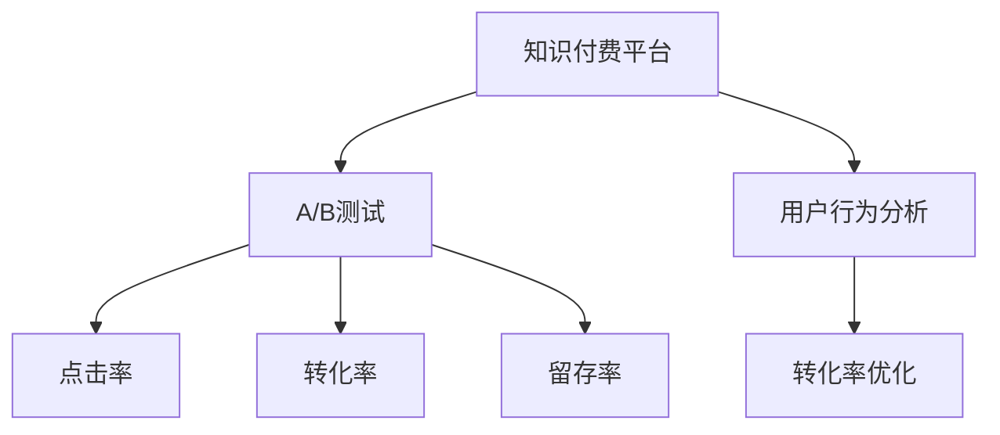

                 

# 程序员如何进行知识付费的A/B测试

> 关键词：知识付费, A/B测试, 算法优化, 用户行为分析, 转化率优化

## 1. 背景介绍

随着互联网的普及和信息时代的到来，知识付费行业逐渐兴起，为程序员提供了便捷高效的学习渠道。然而，在知识付费市场中，如何准确理解用户需求、提高付费转化率成为至关重要的问题。A/B测试作为评估产品优化效果的重要手段，能够帮助程序员快速验证不同方案的效果，优化知识付费平台的用户体验。本文将详细介绍A/B测试的核心原理、操作步骤及应用案例，帮助程序员深入理解A/B测试的实施方法。

## 2. 核心概念与联系

### 2.1 核心概念概述

在进行知识付费的A/B测试之前，我们首先需要了解几个核心概念：

- **A/B测试**：通过将用户随机分配到两个互斥的组别（即A组和B组）中，分别对A组和B组采用不同的策略或方案，从而比较这两种策略的效果差异。常见的A/B测试指标包括点击率、转化率、留存率等。

- **知识付费**：指用户为获取专业知识、技能培训等有价值信息而支付费用的服务形式。知识付费平台通常提供在线课程、视频教程、技术博客等资源，帮助用户提升编程能力。

- **转化率优化**：指通过优化产品设计、用户体验、市场推广等手段，提升用户从试用到付费的转化效率。

- **用户行为分析**：通过收集和分析用户在使用产品时的行为数据，洞察用户需求，指导产品优化。

这些概念之间的联系可以通过以下Mermaid流程图来展示：



从图中可以看出，知识付费平台的A/B测试与用户行为分析和转化率优化紧密相关，A/B测试能够验证和优化这些方面，从而提高用户满意度和付费转化率。

## 3. 核心算法原理 & 具体操作步骤

### 3.1 算法原理概述

A/B测试的原理基于统计学中的假设检验（Hypothesis Testing），旨在判断两个或多个实验组之间的差异是否显著。具体而言，通过随机分配用户到A组和B组，分别测试两个不同的方案（如页面布局、文本描述、支付流程等），然后统计两个组的指标（如点击率、转化率），从而比较不同方案的效果。

假设A组和B组的点击率分别为 $p_A$ 和 $p_B$，点击率差异为 $\delta = p_B - p_A$。在显著性水平 $\alpha$ 下，如果 $\delta$ 大于0，则认为B组的点击率高于A组。计算临界值 $Z_{\alpha/2}$ 和标准差 $\sigma$，如果 $p_B - p_A \geq Z_{\alpha/2} \times \sigma$，则认为B组的效果显著优于A组。

### 3.2 算法步骤详解

进行A/B测试一般包括以下几个关键步骤：

1. **确定测试目标**：明确A/B测试的优化目标，如提高转化率、增加点击率等。

2. **设计测试方案**：设计A组和B组的测试方案，确保两个方案之间有明显差异。

3. **随机分组**：随机将用户分为A组和B组，确保两组样本具有相同的特征分布。

4. **测试执行**：让A组和B组的用户分别接触不同的测试方案，收集点击率、转化率等指标。

5. **数据分析**：计算统计量，使用假设检验方法评估两组之间的显著性差异。

6. **结果分析**：根据测试结果，选择效果更好的方案进行推广。

### 3.3 算法优缺点

A/B测试的优点在于其简单易行，通过随机分组和对比分析能够快速验证不同方案的效果。然而，A/B测试也存在一些局限性：

- **样本量限制**：A/B测试需要收集足够的样本数据才能得出准确结论，如果样本量过少，可能会导致结果偏差。

- **测试时间较长**：A/B测试通常需要较长的测试周期，才能得出稳定的结果。

- **假设检验误判**：在使用假设检验时，如果置信水平设置不合理，可能导致误判或漏判。

- **数据隐私问题**：在收集用户数据时，需要保证用户隐私安全，防止数据泄露。

### 3.4 算法应用领域

A/B测试在知识付费平台中有着广泛的应用，主要体现在以下几个方面：

- **页面优化**：通过对比不同的页面布局、颜色搭配等，找出最吸引用户的页面设计。

- **内容优化**：对比不同标题、描述、封面图等，找出最能提升用户点击率的内容表现形式。

- **价格策略优化**：对比不同价格策略，如限时优惠、阶梯定价等，找出最有效的定价方式。

- **推广优化**：对比不同推广渠道和广告文案，找出最有效的推广方式。

## 4. 数学模型和公式 & 详细讲解 & 举例说明

### 4.1 数学模型构建

假设知识付费平台上有两个页面A和B，分别测试两个方案。A组用户访问页面A，B组用户访问页面B。设A组的点击率为 $p_A$，B组的点击率为 $p_B$，标准差为 $\sigma$。如果 $p_B > p_A$，则认为B组的效果更好。

### 4.2 公式推导过程

计算A组和B组点击率的差异，使用Z检验方法评估其显著性。假设置信水平为95%，即 $\alpha = 0.05$，则临界值 $Z_{\alpha/2} = 1.96$。计算统计量：

$$
Z = \frac{p_B - p_A}{\sqrt{\frac{p_A(1-p_A)}{n_A} + \frac{p_B(1-p_B)}{n_B}} / \sigma
$$

其中 $n_A$ 和 $n_B$ 分别为A组和B组的样本数量。

如果 $Z \geq 1.96$，则认为B组的效果显著优于A组，即拒绝原假设 $H_0: p_A = p_B$。反之，则接受原假设。

### 4.3 案例分析与讲解

假设知识付费平台上测试两个页面，A组用户访问页面A，B组用户访问页面B。测试结果如下：

| 组别 | 点击率 | 样本量 |
|------|-------|------|
| A    | 0.2   | 1000 |
| B    | 0.3   | 1000 |

使用Z检验方法评估两个点击率之间的差异显著性：

$$
Z = \frac{0.3 - 0.2}{\sqrt{\frac{0.2(1-0.2)}{1000} + \frac{0.3(1-0.3)}{1000}} / 0.01 = 1.96
$$

由于 $Z = 1.96 \geq 1.96$，因此拒绝原假设，认为页面B的效果显著优于页面A。

## 5. 项目实践：代码实例和详细解释说明

### 5.1 开发环境搭建

在进行知识付费平台的A/B测试时，通常需要搭建以下开发环境：

- **数据收集工具**：如Google Analytics、Mixpanel等，用于收集用户行为数据。

- **测试平台**：如Optimizely、VWO等，用于设计和执行A/B测试。

- **数据分析工具**：如R、Python等，用于处理和分析数据。

- **服务器环境**：如AWS、阿里云等，用于托管A/B测试的代码和数据。

### 5.2 源代码详细实现

以下是一个简单的A/B测试代码实现，使用Python和Flask框架搭建测试页面：

```python
from flask import Flask, request
import random

app = Flask(__name__)

# 假设每个用户被随机分配到A组或B组
def random_user_group():
    return random.choice(['A', 'B'])

# 模拟用户访问页面
@app.route('/')
def home():
    user_group = random_user_group()
    if user_group == 'A':
        return "A组页面"
    else:
        return "B组页面"

if __name__ == '__main__':
    app.run(host='0.0.0.0', port=5000)
```

### 5.3 代码解读与分析

**random_user_group函数**：
- 函数作用：随机将用户分为A组或B组。
- 实现方式：使用Python内置的`random.choice`函数，从列表['A', 'B']中随机选择一个元素作为用户组别。

**home函数**：
- 函数作用：根据用户组别返回不同页面内容。
- 实现方式：判断用户组别，返回A组或B组的页面内容。

### 5.4 运行结果展示

在运行代码后，可以访问`http://localhost:5000`，随机看到A组或B组的页面内容。由于用户分组是随机的，每次访问的页面内容都有可能不同。

## 6. 实际应用场景

### 6.1 页面优化

知识付费平台可以定期进行页面优化测试，对比不同的页面布局、颜色搭配、模块安排等，找出最吸引用户的页面设计。例如，对比两个页面A和B的点击率，选择效果更好的页面进行推广。

### 6.2 内容优化

平台可以测试不同标题、描述、封面图等，找出最能提升用户点击率的内容表现形式。例如，测试两个不同课程的描述，选择点击率更高的课程进行推广。

### 6.3 价格策略优化

平台可以对比不同价格策略，如限时优惠、阶梯定价等，找出最有效的定价方式。例如，测试两个不同价格的免费试用期，选择转化率更高的试用期进行推广。

### 6.4 推广优化

平台可以对比不同推广渠道和广告文案，找出最有效的推广方式。例如，测试两个不同广告位和文案，选择点击率更高的广告进行推广。

## 7. 工具和资源推荐

### 7.1 学习资源推荐

为了帮助程序员深入理解A/B测试的原理和实践技巧，这里推荐一些优质的学习资源：

1. **《A/B Testing: The Most Powerful Way to Turn Clicks into Customers》**：这是一本深入浅出讲解A/B测试原理和实践的书，适合初学者和进阶开发者。

2. **Google Analytics官方文档**：提供详细的用户行为分析方法，帮助程序员理解数据收集和分析过程。

3. **Optimizely官方文档**：提供完整的A/B测试平台和工具，帮助程序员快速搭建和执行A/B测试。

4. **Coursera《A/B Testing》课程**：由斯坦福大学开设的A/B测试课程，通过视频和作业帮助程序员系统掌握A/B测试的方法和应用。

5. **Kaggle A/B Testing竞赛**：参与Kaggle的A/B Testing竞赛，通过实战练习提升A/B测试技能。

### 7.2 开发工具推荐

选择合适的开发工具是A/B测试成功的基础，以下是几款常用的工具：

1. **Google Analytics**：强大的用户行为分析工具，能够收集和分析用户行为数据。

2. **Optimizely**：领先的A/B测试平台，支持多种测试方案设计和数据分析。

3. **Mixpanel**：实时用户行为分析工具，帮助程序员深入理解用户行为。

4. **Tableau**：数据可视化工具，帮助程序员直观展示测试结果。

5. **Jupyter Notebook**：交互式编程环境，方便程序员处理和分析数据。

### 7.3 相关论文推荐

以下是几篇经典的A/B测试论文，推荐程序员深入阅读：

1. **"Stopping Rules for Approximate Monte Carlo Tests of Randomization"**：介绍如何使用蒙特卡洛方法进行假设检验，提高A/B测试的准确性。

2. **"Optimization of a Sequential Procedure Based on a Generalized Likelihood Ratio"**：探讨如何使用GLR（广义似然比）进行A/B测试，提高测试效率。

3. **"A/B Testing for Conversion Rate Optimization: Algorithms and Experiments on Clickthrough Rates for Display Ads"**：探讨A/B测试在广告点击率优化中的应用，提供实用的优化策略。

4. **"A/B Testing When Only Successes and Failures are Present"**：介绍如何在只有成功和失败两种结果的情况下进行A/B测试，适用于部分实验设计。

5. **"Design and Analysis of Adaptive Experiments"**：介绍如何设计自适应实验，提高A/B测试的灵活性和效果。

## 8. 总结：未来发展趋势与挑战

### 8.1 总结

本文对知识付费平台如何进行A/B测试进行了详细讲解。通过A/B测试，程序员可以系统地验证不同方案的效果，优化知识付费平台的用户体验和付费转化率。理解A/B测试的核心原理、操作步骤及应用案例，对程序员来说至关重要。

### 8.2 未来发展趋势

展望未来，A/B测试将呈现以下几个发展趋势：

1. **多变量测试**：A/B测试将不再局限于单一变量，而是逐步向多变量测试拓展，测试多个变量对结果的影响，实现更全面的优化。

2. **自适应测试**：测试过程将更具灵活性，根据实时数据动态调整测试方案，提高测试效率。

3. **大数据分析**：通过大数据分析技术，更好地理解用户行为和需求，指导A/B测试的设计和执行。

4. **智能化测试**：结合人工智能技术，如机器学习、深度学习等，实现更精准的A/B测试，提高测试效果。

### 8.3 面临的挑战

尽管A/B测试在知识付费平台中有着广泛的应用，但在实际操作中仍然面临一些挑战：

1. **数据质量问题**：A/B测试依赖高质量的数据，数据质量差可能导致测试结果偏差。

2. **实验设计复杂**：设计多变量测试和自适应测试时，实验设计变得复杂，需要更多的时间和资源。

3. **测试成本高**：部分测试需要较高的实验成本，如时间、人力、设备等，增加了测试难度。

4. **数据隐私问题**：在收集用户数据时，需要确保用户隐私安全，防止数据泄露。

### 8.4 研究展望

为了解决A/B测试中的挑战，未来的研究需要在以下几个方面寻求新的突破：

1. **数据清洗技术**：开发高效的数据清洗工具，提高数据质量，减少数据偏差。

2. **自动化测试工具**：开发自动化的测试工具，降低测试难度，提高测试效率。

3. **大数据分析技术**：利用大数据分析技术，深入理解用户行为和需求，指导测试设计。

4. **人工智能技术**：结合人工智能技术，实现更精准的A/B测试，提高测试效果。

这些研究方向将引领A/B测试技术向更高效、更灵活、更精准的方向发展，为知识付费平台带来更好的用户体验和更高的付费转化率。

## 9. 附录：常见问题与解答

**Q1: 如何进行多变量A/B测试？**

A: 多变量A/B测试可以通过将多个变量组合成不同的测试方案，然后在同一组用户中进行测试。例如，测试不同标题、描述、封面图等，找出最能提升用户点击率的内容表现形式。可以使用设计空间分析方法，找出最优的变量组合。

**Q2: A/B测试中如何处理数据偏差？**

A: 数据偏差是A/B测试中常见的问题，可以通过以下方法处理：

1. **数据清洗**：在测试开始前，清洗数据，去除无效数据和异常值。

2. **随机分组**：确保测试组和对照组具有相同的特征分布，减少分组偏差。

3. **样本量控制**：确保样本量足够大，以获得可靠的结果。

4. **分群测试**：将用户按特征分组，在同一组内进行测试，减少组间偏差。

5. **贝叶斯优化**：使用贝叶斯优化算法，根据实时数据动态调整测试方案，减少实验偏差。

**Q3: A/B测试中如何处理数据隐私问题？**

A: 数据隐私是A/B测试中必须重视的问题，可以通过以下方法处理：

1. **匿名化处理**：对用户数据进行匿名化处理，保护用户隐私。

2. **合规性检查**：确保A/B测试符合相关法律法规，如GDPR、CCPA等。

3. **访问控制**：严格控制数据的访问权限，确保只有授权人员能够访问和使用数据。

4. **加密存储**：使用加密技术保护数据在存储和传输过程中的安全。

5. **透明性**：告知用户数据的使用目的，并得到用户的同意。

综上所述，A/B测试在知识付费平台中的应用已经十分广泛，程序员需要深入理解其原理和操作步骤，不断优化测试方案，以提升用户体验和付费转化率。通过系统的学习、实践和创新，程序员可以更好地掌握A/B测试技术，推动知识付费行业的健康发展。

---

作者：禅与计算机程序设计艺术 / Zen and the Art of Computer Programming

