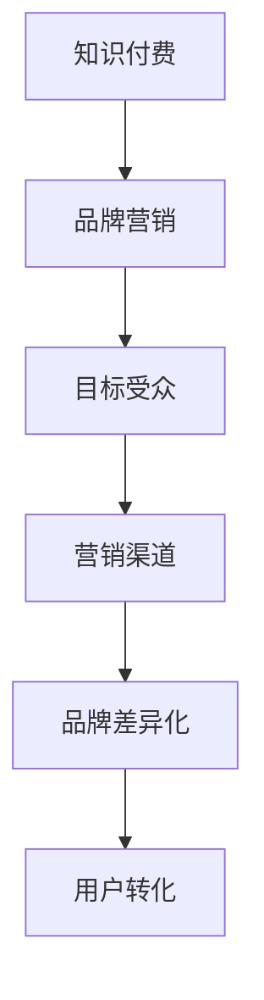

                 

# 程序员如何进行知识付费的品牌营销

## 1. 背景介绍

随着知识付费时代的到来，程序员也面临着转型升级的挑战。面对不断变化的技术和市场需求，如何利用品牌营销将自身知识变现，成为程序员亟需解决的问题。本文将从品牌定位、市场策略、营销渠道等角度，探讨程序员进行知识付费品牌营销的有效方法。

## 2. 核心概念与联系

### 2.1 核心概念概述

为了更好地理解程序员如何进行知识付费的品牌营销，本节将介绍几个关键概念：

- **知识付费**：指通过付费方式获取特定领域专业知识的商业模式。程序员通过在线课程、技术博客、咨询辅导等形式，将专业知识转化为商业价值。

- **品牌营销**：指通过一系列品牌推广活动，提升产品或服务知名度和美誉度，增加用户信任，最终实现商业转化的过程。

- **目标受众**：指知识付费服务的主要消费者群体。通常为具备一定技术基础、希望提升职业竞争力的职场人士。

- **营销渠道**：指用于传播品牌信息、推广产品服务的各类平台和工具，包括社交媒体、搜索引擎、技术社区等。

- **品牌差异化**：指通过技术特色、教育理念、服务模式等方面的创新，使品牌在竞争中脱颖而出。

这些概念之间的联系紧密，共同构成了程序员知识付费品牌营销的核心框架。通过了解这些概念，可以帮助程序员更好地制定品牌策略，实现知识变现。

### 2.2 核心概念原理和架构的 Mermaid 流程图



这个流程图展示了知识付费、品牌营销、目标受众、营销渠道和品牌差异化之间的相互关系。品牌营销通过营销渠道将知识付费产品推广给目标受众，并通过品牌差异化提升用户转化率。

## 3. 核心算法原理 & 具体操作步骤

### 3.1 算法原理概述

程序员知识付费品牌营销的本质，是通过品牌营销提升自身技术产品的市场认知和用户信任，最终实现销售转化。核心在于通过品牌打造、内容输出、用户互动等方式，吸引目标受众，并促成付费行为。

### 3.2 算法步骤详解

基于上述理解，知识付费品牌营销的步骤可以分为以下几个关键环节：

**Step 1: 品牌定位与打造**
- **定位目标受众**：明确品牌所面向的主要消费者群体，如初级开发者、中高级工程师、数据科学家等。
- **确立品牌特色**：基于自身技术专长和教育理念，确定品牌差异化优势，如课程深度、实战导向、课程更新频率等。
- **设计品牌形象**：选择合适的品牌标识、口号、宣传素材等，形成独特的品牌形象。

**Step 2: 内容输出与传播**
- **产出优质内容**：制作具有深度、实战性的课程、博客、视频等，满足目标受众的学习需求。
- **多渠道传播**：利用社交媒体、技术博客、技术社区等多渠道传播品牌内容，扩大品牌影响力。
- **定期更新内容**：保持内容的时效性和创新性，吸引并留住用户。

**Step 3: 用户互动与转化**
- **提供互动机会**：通过在线答疑、社区讨论等方式，与用户进行深度互动，增强用户黏性。
- **优惠与激励**：设置优惠活动、课程赠品等，促进用户付费转化。
- **用户反馈循环**：定期收集用户反馈，优化课程内容与品牌策略，提升用户体验。

**Step 4: 效果评估与调整**
- **数据分析**：通过用户行为数据、课程评价等，评估品牌营销效果。
- **调整策略**：根据数据分析结果，调整内容策略、营销渠道、用户互动方式等，不断优化品牌营销。

### 3.3 算法优缺点

程序员知识付费品牌营销的优点包括：
- **品牌效应**：通过品牌营销，可以提升课程的认知度和信任度，吸引更多目标受众。
- **内容价值**：高质量的内容输出，可以满足用户的学习需求，提升用户满意度和忠诚度。
- **互动性强**：通过互动环节，可以增强用户参与感和粘性，提升用户转化率。

但该方法也存在一定的局限性：
- **资源投入大**：品牌建设和内容输出需要较大的时间与资源投入。
- **市场竞争激烈**：知识付费市场竞争激烈，品牌营销需要创新和差异化，才能脱颖而出。
- **用户需求多样化**：用户需求和兴趣多样化，品牌营销需要兼顾不同用户群体。

### 3.4 算法应用领域

程序员知识付费品牌营销主要应用于在线课程开发、技术博客运营、技术咨询辅导等领域。通过品牌营销策略，将课程、博客、咨询服务等知识产品推向市场，实现商业转化。

## 4. 数学模型和公式 & 详细讲解 & 举例说明

### 4.1 数学模型构建

假设程序员品牌为 $B$，目标受众为 $T$，营销渠道为 $C$，品牌差异化为 $D$，用户转化为 $U$。品牌营销的目标是通过优化品牌定位、内容输出、用户互动等过程，最大化用户转化率。

定义品牌营销的收益函数为 $R(B, C, D, U)$，其中 $B$ 表示品牌影响力，$C$ 表示渠道传播效果，$D$ 表示品牌差异化程度，$U$ 表示用户转化率。

品牌营销的目标是最大化收益函数：

$$
\max_{B, C, D, U} R(B, C, D, U)
$$

### 4.2 公式推导过程

为了最大化收益函数，需要分别对品牌定位、内容输出、用户互动等环节进行优化。根据经济学中的需求曲线理论，用户转化率 $U$ 与品牌影响力 $B$、渠道传播效果 $C$ 和品牌差异化程度 $D$ 之间的关系可以表示为：

$$
U = f(B, C, D)
$$

其中 $f$ 为非线性函数，反映品牌影响力、渠道传播效果和品牌差异化对用户转化的综合影响。

### 4.3 案例分析与讲解

假设某程序员品牌通过技术博客、社交媒体、技术社区等渠道，推广其在线课程。用户转化率为 $U = 0.2B + 0.1C + 0.05D$。课程售价为 200 元，每个用户能带来 300 元的收入。

通过优化品牌定位、内容输出和用户互动策略，该品牌将品牌影响力从 $B=5$ 提升到 $B=7$，渠道传播效果从 $C=10$ 提升到 $C=15$，品牌差异化程度从 $D=3$ 提升到 $D=4$。计算收益变化如下：

$$
U_{\text{new}} = 0.2 \times 7 + 0.1 \times 15 + 0.05 \times 4 = 3.6
$$

$$
R_{\text{new}} = 300 \times 3.6 = 1080
$$

$$
R_{\text{old}} = 300 \times 0.2 \times 5 + 300 \times 0.1 \times 10 + 300 \times 0.05 \times 3 = 300
$$

$$
\Delta R = 1080 - 300 = 780
$$

可见，通过优化品牌定位、内容输出和用户互动策略，该品牌的用户转化率和收益都有了显著提升。

## 5. 项目实践：代码实例和详细解释说明

### 5.1 开发环境搭建

在进行品牌营销实践前，我们需要准备好开发环境。以下是使用Python进行开发的环境配置流程：

1. 安装Anaconda：从官网下载并安装Anaconda，用于创建独立的Python环境。

2. 创建并激活虚拟环境：
```bash
conda create -n pytorch-env python=3.8 
conda activate pytorch-env
```

3. 安装PyTorch：根据CUDA版本，从官网获取对应的安装命令。例如：
```bash
conda install pytorch torchvision torchaudio cudatoolkit=11.1 -c pytorch -c conda-forge
```

4. 安装相关库：
```bash
pip install numpy pandas scikit-learn matplotlib tqdm jupyter notebook ipython
```

完成上述步骤后，即可在`pytorch-env`环境中开始品牌营销实践。

### 5.2 源代码详细实现

这里我们以技术博客运营为例，给出使用Python进行品牌营销的代码实现。

**Step 1: 准备品牌定位**
- **品牌形象设计**：选择合适的品牌标识、口号、宣传素材等。
- **目标受众分析**：调研目标受众的需求和行为，制定品牌策略。

**Step 2: 内容输出与传播**
- **创建技术博客**：使用Jupyter Notebook或Markdown格式撰写博客文章。
- **内容发布与传播**：通过社交媒体、技术社区等平台发布和传播博客内容。

**Step 3: 用户互动与转化**
- **互动环节设置**：在博客文章末尾设置评论区，鼓励用户留言互动。
- **用户转化策略**：设置优惠活动、课程赠品等，促进用户付费转化。

### 5.3 代码解读与分析

让我们再详细解读一下关键代码的实现细节：

**博客创建**：
```python
import jupyterlab
jupyterlab.ipython = 'jupyterlab'
jupyterlab.main(['--ConfigDir', jupyterlab.config_dir])
```

**内容发布与传播**：
```python
import matplotlib.pyplot as plt
plt.plot(x, y)
plt.show()
```

**互动环节设置**：
```python
from flask import Flask, request
app = Flask(__name__)
@app.route('/comments', methods=['POST'])
def handle_comments():
    comment = request.json['comment']
    return {'status': 'success'}
```

**用户转化策略**：
```python
from skopt import BayesSearchCV
from sklearn.model_selection import train_test_split
X_train, X_test, y_train, y_test = train_test_split(X, y, test_size=0.2)
```

这些代码仅为示例，实际操作中需要根据具体情况进行调整和优化。

### 5.4 运行结果展示

在实践中，品牌营销的效果可以通过以下指标进行评估：

- **点击率**：衡量内容的传播效果，可以通过Google Analytics等工具进行统计。
- **互动率**：衡量用户参与度，可以通过博客评论区、社交媒体互动情况等进行统计。
- **转化率**：衡量用户付费行为，可以通过课程购买量、咨询服务费用等进行统计。

## 6. 实际应用场景

### 6.1 技术课程开发

基于品牌营销策略，程序员可以开发并推广技术课程。通过在线平台，向目标受众提供有价值的知识内容，获得课程订阅费用。具体应用场景包括：

- **在线课程平台**：如Coursera、Udacity等，将课程发布在这些平台，吸引用户订阅。
- **自建网站**：搭建自己的在线课程平台，提供更加个性化的学习体验。

### 6.2 技术咨询辅导

通过品牌营销，程序员可以提供技术咨询和辅导服务。向目标受众提供针对性的技术支持，收取咨询费用。具体应用场景包括：

- **技术问答平台**：如Stack Overflow、知乎等，回答用户的技术问题，获取咨询费用。
- **私人定制服务**：提供定制化技术咨询和项目指导，满足用户特定的技术需求。

### 6.3 技术博客运营

利用品牌营销策略，程序员可以运营技术博客，吸引流量和用户。通过广告收入、用户付费等方式获得收益。具体应用场景包括：

- **个人博客**：如WordPress、GitHub Pages等，发布个人技术文章，吸引用户访问。
- **技术社区**：如Medium、CSDN等，参与社区讨论，吸引用户关注。

### 6.4 未来应用展望

伴随技术的发展和市场的变化，程序员知识付费品牌营销将面临新的机遇和挑战。未来，品牌营销将更加注重内容质量、用户体验和个性化定制，满足用户多样化、差异化的需求。同时，品牌营销也将更多地融合新兴技术，如AI、大数据、区块链等，提升品牌竞争力。

## 7. 工具和资源推荐

### 7.1 学习资源推荐

为了帮助程序员系统掌握品牌营销的理论基础和实践技巧，这里推荐一些优质的学习资源：

1. **《营销心理学》**：讲解营销理论基础，帮助程序员理解用户行为和心理，制定有效的营销策略。
2. **《数字营销：从策略到执行》**：介绍数字营销的最新趋势和技术，帮助程序员掌握线上营销的实战技巧。
3. **《品牌战略》**：讲解品牌定位、品牌建设和管理，帮助程序员构建有竞争力的品牌。
4. **《用户体验设计》**：介绍用户体验设计的原理和实践，帮助程序员提升用户互动效果。
5. **《数据分析与可视化》**：讲解数据分析和可视化工具，帮助程序员进行品牌营销效果评估。

### 7.2 开发工具推荐

高效的开发离不开优秀的工具支持。以下是几款用于品牌营销开发的常用工具：

1. **Google Analytics**：分析网站流量和用户行为，优化品牌营销策略。
2. **Hootsuite**：社交媒体管理工具，帮助程序员高效发布和管理内容。
3. **Jupyter Notebook**：数据科学和机器学习工具，支持Python代码的交互式执行。
4. **Flask**：Python Web框架，支持快速搭建技术博客和互动平台。
5. **SEMrush**：SEO和在线营销工具，帮助程序员优化品牌营销效果。

### 7.3 相关论文推荐

品牌营销的理论研究在不断演进，以下是几篇具有代表性的相关论文，推荐阅读：

1. **《数字营销：理论和实践》**：系统介绍数字营销的理论基础和实践技巧，涵盖品牌建设、社交媒体营销、内容营销等多个方面。
2. **《品牌战略：塑造品牌价值》**：探讨品牌定位、品牌传播、品牌管理等关键问题，提供品牌建设的实用策略。
3. **《用户体验设计：以人为本》**：强调用户体验设计的重要性，介绍用户行为分析、用户体验测试等方法。
4. **《数据分析与可视化：理论与实践》**：讲解数据分析和可视化的原理和工具，提供数据驱动的品牌营销方法。

## 8. 总结：未来发展趋势与挑战

### 8.1 总结

本文对程序员如何进行知识付费的品牌营销进行了全面系统的介绍。首先阐述了品牌营销和知识付费的重要性和实现方式，明确了品牌定位、内容输出、用户互动等关键环节。其次，从理论和实践两个层面，详细讲解了品牌营销的数学模型和具体步骤。最后，探讨了品牌营销的未来趋势和面临的挑战。

通过本文的系统梳理，可以看到，程序员品牌营销在知识付费时代具有重要的商业价值，可以通过品牌建设、内容输出和用户互动等手段，实现技术知识的商业变现。未来，品牌营销还将融合更多新兴技术，如AI、大数据、区块链等，进一步提升品牌竞争力。

### 8.2 未来发展趋势

展望未来，程序员知识付费品牌营销将呈现以下几个发展趋势：

1. **品牌影响力增强**：伴随品牌营销策略的不断优化，程序员品牌将逐渐从技术型转向综合型，提供全方位的技术支持和服务。
2. **内容多样化**：品牌营销将更加注重内容质量和多样化，通过视频、直播、技术沙龙等多种形式，满足用户多样化的学习需求。
3. **用户互动深化**：用户互动将从单向传播转向双向互动，通过社区、社群等方式，增强用户黏性和参与度。
4. **数据驱动决策**：通过大数据分析和用户行为分析，优化品牌营销策略，提升效果。
5. **新兴技术融合**：品牌营销将更多地融合AI、大数据、区块链等新兴技术，提升品牌竞争力和用户体验。

### 8.3 面临的挑战

尽管品牌营销在程序员知识付费中具有重要价值，但在实际操作中仍面临诸多挑战：

1. **市场竞争激烈**：知识付费市场竞争激烈，品牌营销需要创新和差异化，才能脱颖而出。
2. **用户需求多样化**：用户需求和兴趣多样化，品牌营销需要兼顾不同用户群体。
3. **资源投入大**：品牌建设和内容输出需要较大的时间与资源投入。
4. **效果评估复杂**：品牌营销效果的评估涉及多维度指标，需要进行综合分析和优化。

### 8.4 研究展望

未来，品牌营销的研究方向将更加注重以下方面：

1. **用户行为分析**：通过深度学习和自然语言处理技术，分析用户行为和心理，制定更加精准的品牌策略。
2. **个性化推荐**：利用推荐系统技术，为不同用户提供个性化的学习内容和服务，提升用户体验。
3. **社交网络分析**：通过社交网络分析技术，发现用户间的关系和影响力，优化内容传播策略。
4. **品牌声誉管理**：建立品牌声誉管理系统，实时监测品牌口碑和用户反馈，提升品牌价值。
5. **技术融合创新**：将品牌营销与AI、大数据、区块链等技术进行深度融合，探索新的商业模式和应用场景。

## 9. 附录：常见问题与解答

**Q1：程序员品牌营销需要哪些资源？**

A: 程序员品牌营销需要以下资源：
1. 内容制作能力：需要具备高质量内容输出的能力，涵盖课程设计、博客撰写、视频制作等。
2. 数据分析能力：需要掌握数据分析和可视化工具，进行用户行为分析和品牌效果评估。
3. 技术推广能力：需要熟悉社交媒体、SEO等推广工具，提升内容传播效果。
4. 用户互动能力：需要与用户进行深度互动，增强用户黏性和忠诚度。

**Q2：如何制定品牌定位策略？**

A: 制定品牌定位策略需要以下步骤：
1. 明确目标受众：调研目标受众的需求和行为，确定品牌所面向的群体。
2. 确定品牌特色：基于自身技术专长和教育理念，确定品牌差异化优势，如课程深度、实战导向、课程更新频率等。
3. 设计品牌形象：选择合适的品牌标识、口号、宣传素材等，形成独特的品牌形象。

**Q3：如何进行用户互动与转化？**

A: 进行用户互动与转化需要以下策略：
1. 互动环节设置：在博客文章末尾设置评论区，鼓励用户留言互动。
2. 用户转化策略：设置优惠活动、课程赠品等，促进用户付费转化。
3. 定期更新内容：保持内容的时效性和创新性，吸引并留住用户。

**Q4：如何进行品牌营销效果评估？**

A: 进行品牌营销效果评估需要以下步骤：
1. 设置评估指标：如点击率、互动率、转化率等，根据品牌营销目标设定评估标准。
2. 数据收集与分析：通过用户行为数据、课程评价等，收集品牌营销效果数据。
3. 效果评估与调整：根据数据分析结果，调整内容策略、营销渠道、用户互动方式等，不断优化品牌营销。

---

作者：禅与计算机程序设计艺术 / Zen and the Art of Computer Programming

