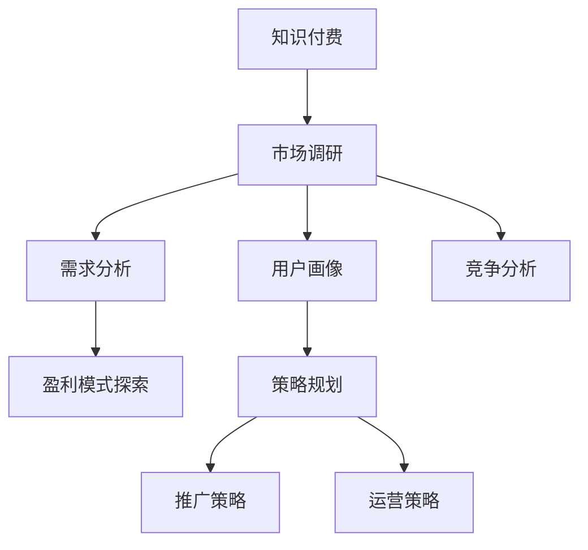

                 

# 程序员如何进行知识付费的市场调研

> 关键词：知识付费, 市场调研, 需求分析, 用户画像, 盈利模式, 竞争分析, 策略规划

## 1. 背景介绍

### 1.1 问题由来
随着互联网和数字技术的迅猛发展，知识付费市场呈现蓬勃发展态势，尤其在程序员群体中，需求显著。程序员通过在线课程、书籍订阅、技术博客、视频教程等形式，不断更新自己的技术栈和知识储备，以适应快速变化的技术环境。然而，面对海量的知识产品，如何选择高效、实用的付费内容，成为程序员面临的一个重要问题。

### 1.2 问题核心关键点
程序员知识付费的市场调研，旨在帮助程序员理性选择知识付费产品，提高投资回报率，同时推动知识付费行业的发展和优化。核心关键点包括：

1. **用户需求分析**：深入理解程序员的技术需求、学习习惯和付费偏好。
2. **市场供需匹配**：研究市场上的知识付费产品，找到与程序员需求相匹配的内容。
3. **竞争分析**：分析同行竞品的优劣势，找到差异化竞争策略。
4. **盈利模式探索**：研究知识付费业务的盈利模式，探索可行的商业模式。
5. **策略规划**：基于调研结果，制定知识付费内容的推广和运营策略。

## 2. 核心概念与联系

### 2.1 核心概念概述

为更好地理解程序员知识付费的市场调研方法，本节将介绍几个密切相关的核心概念：

- **知识付费**：用户为获取有价值的知识信息而支付费用的行为。知识付费的形式多种多样，包括在线课程、电子书、技术博客、视频教程等。
- **市场调研**：通过调查和分析，收集市场信息、用户需求、竞品情况等，为产品决策提供依据的过程。
- **需求分析**：研究用户的具体需求和期望，帮助产品设计和优化。
- **用户画像**：基于用户行为和特征，构建用户群体的典型代表。
- **盈利模式**：知识付费平台的收入来源，如订阅费用、付费下载、广告分成等。
- **竞争分析**：研究竞品的功能、价格、市场策略，找出自身的优势和劣势。
- **策略规划**：制定基于市场调研结果的运营和推广策略，提升市场竞争力。

这些核心概念之间的逻辑关系可以通过以下Mermaid流程图来展示：



这个流程图展示了我們如何进行知识付费市场调研的核心步骤：

1. 从知识付费本身出发，了解其基本概念。
2. 通过市场调研，收集相关的市场信息和用户需求。
3. 对用户进行需求分析和画像构建，找到目标用户群体。
4. 分析竞品情况，确定自身在市场中的位置。
5. 探索盈利模式，找到适合平台的收入来源。
6. 基于以上调研结果，制定推广和运营策略。

## 3. 核心算法原理 & 具体操作步骤
### 3.1 算法原理概述

程序员知识付费的市场调研，本质上是一个数据分析和预测过程。其核心思想是：通过收集和分析程序员社区的反馈、购买行为、课程评价等数据，找到程序员在知识付费上的偏好和需求，预测未来的市场趋势和用户行为，从而制定有效的市场策略。

形式化地，假设程序员社区中有 $N$ 名用户，每名用户对 $M$ 种知识付费产品有不同程度的兴趣。设 $I_{i,j}$ 为第 $i$ 名用户对第 $j$ 种产品的兴趣程度， $1 \leq i \leq N, 1 \leq j \leq M$。市场调研的目标是找到一组参数 $\theta$，使得以下目标函数最大化：

$$
\max_{\theta} \sum_{i=1}^N \sum_{j=1}^M I_{i,j} \cdot f(\theta)
$$

其中， $f(\theta)$ 为对用户兴趣的预测模型。

### 3.2 算法步骤详解

程序员知识付费的市场调研一般包括以下几个关键步骤：

**Step 1: 数据收集与预处理**
- 收集程序员社区的各类数据，包括但不限于：
  - 用户注册和登录信息
  - 课程浏览和购买记录
  - 用户评价和反馈
  - 社区讨论和问答记录
  - 第三方市场数据（如搜索引擎数据）
- 对收集的数据进行清洗、去重、归一化等预处理，确保数据的准确性和一致性。

**Step 2: 用户需求分析**
- 对预处理后的数据进行统计分析，识别出程序员最感兴趣和最常使用的知识付费产品类型。
- 通过问卷调查或用户访谈，进一步了解用户的学习目标、偏好和购买动机。
- 根据用户画像构建方法，将用户划分为不同的兴趣群体，如初级开发者、中高级开发者、特定技术栈专家等。

**Step 3: 市场供需匹配**
- 分析现有的知识付费产品，如在线课程、电子书、技术博客等，评估其内容质量、价格、用户体验和市场占有率。
- 利用用户反馈和购买行为数据，识别热门课程和冷门课程，找到市场上的供需不平衡点。
- 通过A/B测试等方法，评估不同产品的用户转化率和满意度，优化产品设计和定价策略。

**Step 4: 竞争分析**
- 收集竞品的市场数据，包括但不限于：
  - 产品线及内容覆盖范围
  - 用户数量及增长趋势
  - 价格策略及促销活动
  - 用户评价及口碑
  - 市场推广和用户获取策略
- 利用SWOT分析法，评估竞品的优劣势，找到自身可利用的市场机会。
- 研究竞品的盈利模式，探索自身的差异化竞争策略。

**Step 5: 盈利模式探索**
- 分析知识付费行业的常见盈利模式，如订阅模式、按需购买模式、广告分成模式等。
- 根据用户需求和市场调研结果，探索适合自身平台的发展方向，如专注于某个技术栈、提供定制化课程、推出限时优惠等。
- 研究价格策略，如按月订阅、按需付费、分级定价等，找到用户接受度最高的价格模型。

**Step 6: 策略规划**
- 制定基于市场调研结果的推广策略，如通过社交媒体、技术社区、SEO优化等手段提升品牌知名度。
- 规划运营策略，包括用户获取、课程上线、数据分析等环节，确保平台的高效运转和持续发展。
- 制定产品路线图，定期更新和迭代知识付费内容，保持平台的竞争力和用户粘性。

### 3.3 算法优缺点

程序员知识付费的市场调研方法具有以下优点：
1. **数据驱动**：基于实际数据进行决策，更具客观性和科学性。
2. **用户导向**：通过用户行为和反馈，找到最真实的需求和期望。
3. **市场敏感**：及时捕捉市场变化，适应外部环境。
4. **差异化竞争**：通过对竞品的全面分析，找到差异化优势。
5. **灵活迭代**：根据市场调研结果，不断优化产品策略，提升用户满意度。

同时，该方法也存在一定的局限性：
1. **数据质量**：数据收集和预处理的准确性直接影响到调研结果的可靠性。
2. **用户多样性**：程序员社区的用户群体可能存在一定的多样性，调研结果可能不完全适用于所有用户。
3. **隐私保护**：收集和分析用户数据时，需要注意隐私保护和数据安全。
4. **成本投入**：调研过程可能需要投入一定的时间和资源，尤其是数据清洗和分析环节。

尽管存在这些局限性，但就目前而言，基于数据的市场调研方法仍是大规模知识付费决策的重要参考。未来相关研究的重点在于如何进一步提升数据质量，提高分析效率，同时兼顾用户隐私保护和数据安全。

### 3.4 算法应用领域

程序员知识付费的市场调研方法，在知识付费行业的应用非常广泛，覆盖了从课程开发到用户运营的各个环节，例如：

- **课程开发**：通过市场调研，了解用户对各类课程的兴趣和需求，指导课程设计、内容选择和定价策略。
- **用户运营**：基于用户画像，制定精准的用户获取和流失预防策略，提高用户转化率和留存率。
- **推广和营销**：利用调研结果，优化广告投放策略，提升品牌知名度和用户流量。
- **竞品分析**：研究竞品的成功经验，优化自身产品设计，提升市场竞争力。
- **盈利模式创新**：探索新的盈利模式，提高平台的整体盈利能力和用户粘性。

除了上述这些经典应用外，知识付费市场调研的方法还将在更多场景中得到应用，如在线教育、技术咨询、企业培训等，为知识付费行业带来新的突破。

## 4. 数学模型和公式 & 详细讲解 & 举例说明

### 4.1 数学模型构建

本节将使用数学语言对程序员知识付费的市场调研过程进行更加严格的刻画。

假设程序员社区中 $N$ 名用户对 $M$ 种知识付费产品（如课程、博客等）进行评价，评价分为 $K$ 个等级，每个用户的评价为 $R_{i,j}$，其中 $1 \leq i \leq N, 1 \leq j \leq M$。市场调研的目标是找到一组参数 $\theta$，使得以下目标函数最大化：

$$
\max_{\theta} \sum_{i=1}^N \sum_{j=1}^M \sum_{k=1}^K R_{i,j,k} \cdot g(\theta)
$$

其中， $g(\theta)$ 为对用户评价的预测模型。

### 4.2 公式推导过程

以下我们以用户对课程满意度的预测为例，推导一个简单的评分模型。

假设用户对课程 $j$ 的满意度 $R_{i,j}$ 可以表示为一个线性函数：

$$
R_{i,j} = \theta_0 + \sum_{k=1}^K \theta_k X_{i,j,k}
$$

其中， $\theta_0$ 为截距， $\theta_k$ 为权重， $X_{i,j,k}$ 为影响用户满意度的特征变量。例如，课程名称、授课老师、学习时长、评价分数等。

通过最小二乘法，可以求得参数 $\theta$：

$$
\theta = (\mathbf{X}^T \mathbf{X})^{-1} \mathbf{X}^T \mathbf{R}
$$

其中， $\mathbf{X}$ 为特征矩阵， $\mathbf{R}$ 为评价矩阵。

### 4.3 案例分析与讲解

假设一个程序员社区中，有 $N=100$ 名用户对 $M=10$ 门课程进行了评价，评价等级分为 $K=5$（非常不满意、不满意、一般、满意、非常满意）。设特征变量 $X_{i,j,k}$ 为课程名称、授课老师、学习时长，评价矩阵 $\mathbf{R}$ 如表所示：

| 用户ID | 课程ID | 满意度 |
| ------ | ------ | ------ |
| 1      | 1      | 2      |
| 1      | 2      | 3      |
| ...    | ...    | ...    |
| 100    | 10     | 5      |

根据上述评分模型，可以求解出最优的参数 $\theta$，从而预测新课程的满意度。

## 5. 项目实践：代码实例和详细解释说明

### 5.1 开发环境搭建

在进行市场调研实践前，我们需要准备好开发环境。以下是使用Python进行数据分析和建模的环境配置流程：

1. 安装Anaconda：从官网下载并安装Anaconda，用于创建独立的Python环境。

2. 创建并激活虚拟环境：
```bash
conda create -n market调研-env python=3.8 
conda activate market调研-env
```

3. 安装Python依赖包：
```bash
conda install pandas numpy scipy matplotlib seaborn jupyter notebook
```

4. 安装R：从官网下载安装R软件包，并配置R Studio或R Markdown环境。

5. 安装R的Python接口包：
```bash
conda install rpy2
```

完成上述步骤后，即可在`market调研-env`环境中开始市场调研实践。

### 5.2 源代码详细实现

下面我们以用户满意度预测为例，给出使用Python进行数据分析的代码实现。

首先，导入必要的Python库：

```python
import pandas as pd
import numpy as np
from sklearn.linear_model import LinearRegression
from sklearn.model_selection import train_test_split
```

然后，读取数据并预处理：

```python
# 读取数据
data = pd.read_csv('user_evaluations.csv')

# 特征工程
features = data[['course_name', 'instructor', 'duration']]
target = data['satisfaction']

# 标准化特征
features = (features - features.mean()) / features.std()

# 划分训练集和测试集
features_train, features_test, target_train, target_test = train_test_split(features, target, test_size=0.2, random_state=42)
```

接着，训练线性回归模型：

```python
# 训练模型
model = LinearRegression()
model.fit(features_train, target_train)

# 预测测试集
predictions = model.predict(features_test)
```

最后，评估模型性能：

```python
# 评估模型
print('R-squared:', model.score(features_test, target_test))
```

以上是一个简单的用户满意度预测模型，展示了使用Python进行数据分析的基本流程。

### 5.3 代码解读与分析

让我们再详细解读一下关键代码的实现细节：

**数据读取与预处理**：
- 使用pandas库读取CSV格式的数据文件。
- 将课程名称、授课老师、学习时长等特征提取出来，并将目标变量（用户满意度）分离出来。
- 对特征进行标准化处理，以避免不同特征尺度不一致影响模型性能。
- 使用train_test_split函数将数据划分为训练集和测试集。

**模型训练**：
- 使用sklearn库中的LinearRegression模型进行线性回归。
- 在训练集上拟合模型，并使用测试集进行预测。

**模型评估**：
- 使用R-squared（决定系数）评估模型的拟合程度，值越接近1表示模型越好。

这个示例展示了如何利用Python和scikit-learn库进行数据预处理和模型训练。在实际应用中，还需要根据具体需求，选择合适的特征、构建更复杂的模型（如决策树、随机森林等），并进行超参数调优。

## 6. 实际应用场景

### 6.1 智能课程推荐

基于程序员知识付费的市场调研，可以构建智能课程推荐系统，帮助程序员选择最适合自己的课程。智能推荐系统可以根据用户的学习历史、课程评价、用户画像等信息，推荐相关课程，提升用户的学习效率和满意度。

具体而言，可以将用户的学习历史和课程评价作为训练数据，构建用户满意度的预测模型。通过分析用户的行为特征和评价结果，为用户推荐与其兴趣和需求相匹配的课程。同时，利用模型预测新课程的用户满意度，指导课程上线和定价策略，提升课程的吸引力和转化率。

### 6.2 个性化内容定制

通过市场调研，可以了解程序员的个性化需求和偏好，构建个性化的内容定制服务。例如，针对不同技术栈的程序员，提供针对性的学习资源和技术支持，帮助他们快速掌握新技能。

在实践中，可以通过问卷调查和用户访谈等方式，收集程序员的学习目标、技术栈偏好、学习习惯等信息。基于这些数据，构建用户画像，并根据用户画像提供定制化内容，如专属课程、技术博客、视频教程等。同时，利用用户反馈和评价数据，不断优化和迭代内容，提升用户满意度。

### 6.3 用户反馈和改进

通过市场调研，可以及时了解程序员对知识付费产品的反馈，找到产品的改进方向。例如，对于用户反馈较多的问题或不足之处，可以进行针对性的优化和改进，提升用户体验。

具体而言，可以利用用户评价和反馈数据，构建满意度评分模型。通过分析评分结果，识别用户对产品的满意度和不满意度因素，并进行改进。例如，针对课程内容、教师教学风格、平台界面等方面进行优化，提升用户的学习体验和满意度。

### 6.4 未来应用展望

随着程序员知识付费市场的发展，基于市场调研的方法将会有更广阔的应用前景。

在智慧教育领域，智能课程推荐、个性化内容定制等应用将进一步推动教育技术的创新和普及。

在企业培训领域，市场调研可以帮助企业找到最符合员工需求的培训课程，提升培训效果和员工满意度。

在在线教育领域，市场调研将帮助教育平台优化课程内容和定价策略，提升平台的竞争力和用户粘性。

此外，在科研、公共教育等更多领域，基于市场调研的方法也将在知识付费中发挥重要作用，推动知识传播和创新发展。

## 7. 工具和资源推荐

### 7.1 学习资源推荐

为了帮助程序员系统掌握知识付费的市场调研理论基础和实践技巧，这里推荐一些优质的学习资源：

1. 《数据科学基础》系列博文：由数据科学领域专家撰写，深入浅出地介绍了数据分析、机器学习、数据可视化等基础知识。

2. 《统计学习方法》书籍：李航著，全面介绍了统计学习的基本原理和方法，涵盖分类、回归、聚类等任务。

3. 《Python数据分析实战》书籍：清华大学出版社，介绍了使用Python进行数据分析和可视化的实际案例和实践技巧。

4. Kaggle竞赛平台：提供各类数据科学和机器学习竞赛，通过实际项目提升数据分析和建模能力。

5. Coursera在线课程：提供各类数据科学和机器学习课程，涵盖基础理论、高级技术、实战项目等。

通过对这些资源的学习实践，相信你一定能够快速掌握知识付费市场调研的精髓，并用于解决实际的市场问题。

### 7.2 开发工具推荐

高效的开发离不开优秀的工具支持。以下是几款用于知识付费市场调研开发的常用工具：

1. Jupyter Notebook：开源的交互式笔记本环境，支持Python、R等语言，方便进行数据分析和建模。

2. R Markdown：R语言的Markdown语法，支持在文档中嵌入R代码和结果，方便文档和代码的同步更新。

3. Tableau：数据可视化工具，支持拖拽式操作，快速生成图表和报表。

4. Power BI：微软推出的商业智能工具，支持大规模数据分析和可视化。

5. R Studio：基于R语言的开源开发环境，支持R语言的IDE开发和调试。

6. JupyterLab：Jupyter Notebook的Web界面版本，支持集成代码编辑器和notebook，提供更加丰富的开发体验。

合理利用这些工具，可以显著提升知识付费市场调研的开发效率，加快创新迭代的步伐。

### 7.3 相关论文推荐

知识付费市场调研的发展源于学界的持续研究。以下是几篇奠基性的相关论文，推荐阅读：

1. "A Survey of Data Mining and Statistical Learning"：吴恩达著，全面介绍了数据科学和机器学习的基础知识和方法。

2. "Predictive Analytics: The Role of Predictive Analytics in the Utilization of Health Data"：Marketing Surveys，研究如何利用数据分析提升商业决策。

3. "Applied Predictive Modeling: Data Mining and Statistical Learning for Predictive Data Analytics"：Data Mining and Statistical Learning，介绍了预测模型的实际应用方法和技巧。

4. "The Future of Jobs Report 2020"：World Economic Forum，分析了未来劳动力市场的变化和趋势，为知识付费提供方向性指导。

5. "The Data-Driven Salesperson: How Analytics Can Give Sales Teams a Competitive Edge"：Salesforce，探讨了数据驱动的销售策略和方法。

这些论文代表了大数据和机器学习技术的发展脉络。通过学习这些前沿成果，可以帮助研究者把握学科前进方向，激发更多的创新灵感。

## 8. 总结：未来发展趋势与挑战

### 8.1 总结

本文对程序员知识付费的市场调研方法进行了全面系统的介绍。首先阐述了知识付费和市场调研的基本概念，明确了市场调研在程序员知识付费决策中的重要性。其次，从原理到实践，详细讲解了市场调研的数学模型和操作步骤，给出了市场调研任务开发的完整代码实例。同时，本文还广泛探讨了市场调研方法在知识付费平台中的应用前景，展示了市场调研范式的巨大潜力。此外，本文精选了市场调研技术的各类学习资源，力求为程序员提供全方位的技术指引。

通过本文的系统梳理，可以看到，程序员知识付费的市场调研方法正在成为知识付费平台的重要决策依据，极大地提升了平台的投资回报率和用户满意度。市场调研方法不仅能够帮助平台优化产品设计，提升用户转化率，还能够洞察用户需求，推动知识付费行业的持续发展。未来，伴随知识付费行业的不断成熟，基于市场调研的方法也将不断进化，为程序员提供更丰富、更高效的知识服务。

### 8.2 未来发展趋势

展望未来，程序员知识付费市场调研将呈现以下几个发展趋势：

1. **数据驱动决策**：基于大数据和人工智能技术，市场调研将越来越依赖数据驱动的决策方法，提高决策的客观性和科学性。
2. **用户需求多样化**：程序员的技术栈和需求不断变化，市场调研需要更多地关注用户多样化的需求，提供更加个性化的知识服务。
3. **技术融合创新**：市场调研方法将与大数据、人工智能、自然语言处理等前沿技术深度融合，提升调研的准确性和效率。
4. **实时动态分析**：市场调研将更多地结合实时数据和动态分析，及时响应市场变化，优化产品策略。
5. **跨领域应用**：市场调研的方法将拓展到更多行业领域，如在线教育、企业培训、公共教育等，推动跨领域知识付费的发展。

以上趋势凸显了程序员知识付费市场调研技术的广阔前景。这些方向的探索发展，必将进一步提升知识付费平台的用户体验和市场竞争力，推动知识付费行业向更高层次演进。

### 8.3 面临的挑战

尽管程序员知识付费市场调研技术已经取得了显著成果，但在迈向更加智能化、普适化应用的过程中，它仍面临着诸多挑战：

1. **数据隐私和安全**：收集和分析用户数据时，需要注意隐私保护和数据安全，确保用户信息不被滥用。
2. **数据质量和完整性**：数据收集和预处理的准确性直接影响到调研结果的可靠性，需要建立完善的数据治理机制。
3. **模型复杂度和可解释性**：复杂的模型虽然可以提高预测精度，但也需要更多的解释性和可理解性，便于用户理解和接受。
4. **市场变化速度**：知识付费市场的变化速度快，需要调研方法能够及时响应和调整，保持调研结果的有效性。
5. **技术和资源投入**：市场调研需要大量的技术和资源投入，包括数据分析、模型训练、平台建设等，需要合理规划和控制成本。

正视市场调研面临的这些挑战，积极应对并寻求突破，将是大数据和人工智能技术持续发展的必由之路。相信随着技术的发展和应用实践的深入，这些挑战终将一一被克服，知识付费市场调研将为程序员提供更加精准、高效的知识服务。

### 8.4 研究展望

面对程序员知识付费市场调研所面临的种种挑战，未来的研究需要在以下几个方面寻求新的突破：

1. **数据治理与隐私保护**：探索数据治理框架和隐私保护技术，确保数据的质量和用户隐私安全。
2. **高效建模与可解释性**：研究高效的建模方法和可解释性技术，提升模型的精度和可理解性。
3. **实时动态分析**：开发实时动态分析工具，及时捕捉市场变化，优化产品策略。
4. **跨领域应用**：将市场调研方法拓展到更多行业领域，推动跨领域知识付费的发展。
5. **智能推荐系统**：结合智能推荐技术，提升课程推荐和内容定制的个性化程度。

这些研究方向的探索，必将引领知识付费市场调研技术迈向更高的台阶，为程序员提供更加精准、高效的知识服务，推动知识付费行业的持续发展和创新。

## 9. 附录：常见问题与解答

**Q1：程序员知识付费市场调研需要哪些数据？**

A: 程序员知识付费市场调研需要以下关键数据：
1. 用户注册和登录信息：记录用户的基本信息和行为特征。
2. 课程浏览和购买记录：记录用户对课程的浏览、购买和评价数据。
3. 用户评价和反馈：记录用户对课程、讲师、平台等内容的评价和反馈。
4. 社区讨论和问答记录：记录用户在技术社区、论坛等平台的讨论和问答数据。
5. 第三方市场数据：如搜索引擎数据、社交媒体数据等，用于补充和验证数据。

**Q2：如何选择市场调研的方法和工具？**

A: 选择市场调研的方法和工具需要考虑以下因素：
1. 数据类型：根据数据的类型（如文本、图像、时间序列等），选择合适的分析方法和工具。
2. 数据规模：根据数据的规模（如海量数据、中量数据、小量数据），选择适合的计算资源和处理技术。
3. 技术成熟度：根据技术成熟度（如传统统计方法、机器学习算法、深度学习模型等），选择合适的工具和框架。
4. 用户需求：根据用户需求（如精确性、可解释性、实时性等），选择合适的调研方法和工具。

**Q3：如何进行数据分析和建模？**

A: 进行数据分析和建模的基本步骤如下：
1. 数据清洗和预处理：去除噪声数据、处理缺失值、标准化数据等。
2. 特征工程：提取有用的特征，构建特征矩阵。
3. 模型选择和训练：选择合适的模型（如线性回归、决策树、随机森林等），并在训练集上拟合模型。
4. 模型评估和优化：使用测试集评估模型性能，根据评估结果进行优化。

**Q4：如何进行用户画像构建？**

A: 用户画像的构建需要以下步骤：
1. 数据收集：收集用户的基本信息、行为数据、反馈数据等。
2. 特征提取：提取有用的特征，如学习时间、技术栈偏好、问题类型等。
3. 聚类分析：使用聚类算法（如K-Means、层次聚类等），将用户分为不同的群体。
4. 画像描述：为每个用户群体构建画像描述，包括群体特征、需求和行为等。

**Q5：如何进行竞品分析？**

A: 进行竞品分析的基本步骤如下：
1. 收集竞品信息：收集竞品的产品线、功能、价格、市场策略等数据。
2. 分析竞品优势：通过SWOT分析、五力模型等方法，分析竞品的优劣势。
3. 找出差异化策略：根据竞品分析结果，找出自身的差异化优势和改进方向。
4. 制定竞争策略：结合市场调研结果，制定相应的竞争策略，提升市场竞争力。

这些问题的解答，希望对您在程序员知识付费的市场调研过程中有所帮助。

---

作者：禅与计算机程序设计艺术 / Zen and the Art of Computer Programming

