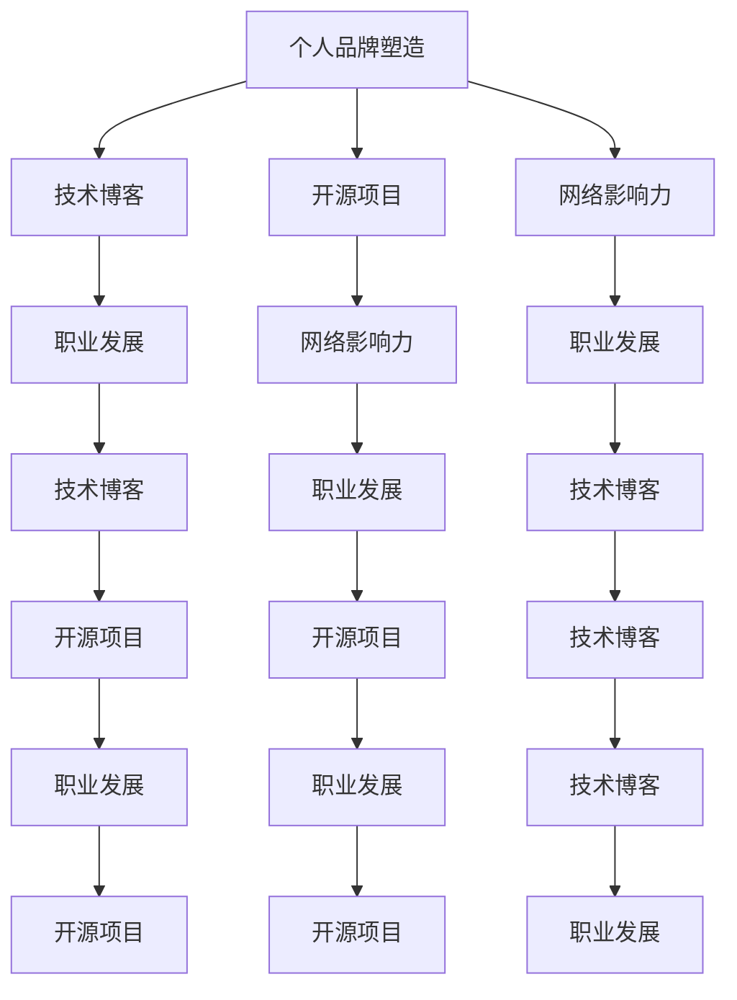

                 

# 程序员的个人品牌塑造与知识付费

> 关键词：程序员，个人品牌塑造，知识付费，技术博客，软件开发，职业发展，网络影响力

## 1. 背景介绍

### 1.1 问题由来
在当前快速发展的数字时代，技术更新迭代日新月异，程序员们面临着不断提升自我和技能更新的挑战。互联网技术的普及使得技术分享和交流成为可能，同时也为技术人才提供了展示才华的平台。在这样的背景下，个人品牌塑造与知识付费成为程序员提升自己职业发展、扩大影响力、实现价值变现的重要方式。

### 1.2 问题核心关键点
1. **个人品牌塑造**：利用各种社交媒体、技术博客、公开课、讲座等形式，展示自己的技术专长和思想见解，提升在技术社区中的知名度和影响力。
2. **知识付费**：通过付费订阅、定制课程、线上咨询、技术博客打赏等方式，向同行、学生、企业客户等提供有价值的技术知识和经验分享，实现个人价值的货币化。

### 1.3 问题研究意义
个人品牌塑造和知识付费不仅能够帮助程序员在技术领域内建立权威，获得同行认可，还能通过知识变现，实现自我价值的提升。对企业而言，个人品牌代表着技术水平和创新能力，对求职者而言，强大的个人品牌能提升就业竞争力。

## 2. 核心概念与联系

### 2.1 核心概念概述

为更好地理解程序员的个人品牌塑造与知识付费，本节将介绍几个密切相关的核心概念：

- **个人品牌塑造**：通过各种技术分享和影响力传播手段，建立和巩固自己在技术社区中的地位和影响力。
- **知识付费**：利用技术知识和经验，通过付费形式向他人提供有价值的知识和服务，实现知识价值的货币化。
- **技术博客**：程序员在互联网平台开设的专门分享技术心得、经验、项目实践的博客。
- **开源项目**：程序员发布到GitHub等平台上的代码，用于展示技术实力和团队协作能力。
- **网络影响力**：在技术社区、社交媒体上积累的关注者数量和互动频率，体现个人的技术影响力。
- **职业发展**：通过提升个人品牌和知识变现，促进职业生涯的发展，包括提升薪资待遇、获得更多职业机会等。

这些核心概念之间具有密切的联系，通过个人品牌塑造和知识付费，程序员可以提升自己的技术影响力和职业价值，进而推动个人职业发展。

### 2.2 核心概念原理和架构的 Mermaid 流程图



此图展示了个人品牌塑造与知识付费的核心概念及其相互关联。通过技术博客和开源项目展示技术专长，提升网络影响力，进而推动职业发展。

## 3. 核心算法原理 & 具体操作步骤
### 3.1 算法原理概述

个人品牌塑造与知识付费的过程，本质上是一种通过技术输出与市场反馈相互作用的优化过程。其核心思想是：

1. **技术输出**：利用博客、代码分享、公开课等形式，将个人在技术领域的专长和见解分享给外界。
2. **市场反馈**：通过阅读量、订阅量、评论互动等指标，评估输出内容的受欢迎程度和实际效果。
3. **优化调整**：根据市场反馈调整技术输出的内容和形式，不断优化提升。

形式化地，假设个人品牌价值为 $V$，技术输出为 $F$，市场反馈为 $R$，优化调整策略为 $A$。则个人品牌塑造的优化目标为：

$$
V_{\text{opt}}=\mathop{\arg\max}_{F,A} V=\mathop{\arg\max}_{F,A} \int \text{User Feedback}(F,A) \text{d} R
$$

其中 $\text{User Feedback}$ 表示用户对技术输出 $F$ 的反馈，$R$ 为市场反馈的随机变量。

### 3.2 算法步骤详解

基于个人品牌塑造与知识付费的优化目标，本节详细讲解具体的操作步骤：

**Step 1: 确定个人定位**
- 识别自身技术专长和兴趣领域。
- 确定目标受众群体，如同行、学生、企业客户等。
- 设定长期职业发展目标，如成为技术专家、提升薪资待遇等。

**Step 2: 选择输出渠道**
- 开设技术博客，分享技术心得、项目实践、技术趋势等。
- 发布开源项目，展示代码能力与团队协作。
- 参与技术讲座、公开课、网络研讨会等。

**Step 3: 内容设计与优化**
- 根据受众需求设计博客内容，如深度技术文章、实战项目案例、行业趋势分析等。
- 定期更新内容，保持博客的活跃度与新鲜感。
- 利用数据和反馈不断调整内容策略，提升输出质量。

**Step 4: 市场反馈与互动**
- 通过阅读量、评论、点赞等指标评估内容受欢迎程度。
- 与读者互动，解答技术问题，建立社区讨论。
- 根据反馈调整博客内容和风格，提升用户体验。

**Step 5: 知识变现与职业发展**
- 通过博客打赏、课程订阅、线上咨询等方式变现知识。
- 积累技术影响力和市场资源，提升职业发展机会。
- 利用个人品牌吸引求职、项目合作等机会，扩大影响力。

### 3.3 算法优缺点

个人品牌塑造与知识付费方法具有以下优点：
1. 展示技术实力：通过技术输出与公开分享，展示个人在技术领域的专长和见解。
2. 获取反馈：通过市场反馈，不断调整技术输出内容，提升效果。
3. 实现价值变现：通过知识付费，实现个人价值和职业发展的货币化。
4. 提升网络影响力：通过持续的内容输出和市场互动，提升在技术社区中的影响力。

同时，该方法也存在一定的局限性：
1. 需要持续投入：保持博客更新、参与讲座等需要持续的时间和精力投入。
2. 竞争激烈：技术领域内容丰富，需要在创意和质量上不断创新。
3. 市场需求变化快：需要快速响应市场和技术的变化，避免知识过时。
4. 个人品牌依赖：个人品牌影响力受限于输出内容的质量和受众反馈。

尽管存在这些局限性，但通过合理利用个人品牌塑造与知识付费方法，程序员能够显著提升个人职业发展和市场影响力。

### 3.4 算法应用领域

个人品牌塑造与知识付费方法广泛应用于以下领域：

- **技术专家与顾问**：通过知识分享和专业咨询，提供技术咨询与指导服务。
- **开发者社区领袖**：在技术社区内建立权威，提升影响力，吸引粉丝和合作机会。
- **职业培训与教育**：开设在线课程、技术讲座，传授技术知识和实战经验。
- **开源社区贡献者**：通过参与开源项目，展示代码能力和团队协作精神，提升影响力。
- **企业技术营销**：利用个人品牌吸引企业客户，推动企业技术创新和市场拓展。

## 4. 数学模型和公式 & 详细讲解  
### 4.1 数学模型构建

本节将使用数学语言对个人品牌塑造与知识付费的过程进行更加严格的刻画。

假设技术输出为 $F(t)$，市场反馈为 $R(t)$，个人品牌价值为 $V(t)$，市场反馈对个人品牌价值的边际贡献为 $g(t)$，则个人品牌价值的时间演化方程为：

$$
\frac{dV}{dt}=g(t)R(t)
$$

其中 $g(t)$ 为市场反馈对个人品牌价值的增长系数，与技术输出质量、受众互动等有关。

### 4.2 公式推导过程

根据上述模型，个人品牌价值的变化率为市场反馈与其增长系数之积。为简化计算，我们假设 $g(t)$ 为常数，则

$$
\int_{0}^T \frac{dV}{dt} \text{d}t=\int_{0}^T g(t)R(t) \text{d}t
$$

对两边同时取极限，得到：

$$
V(T)-V(0)=\lim_{\Delta t \to 0} \sum_{k=0}^{K-1} g(t_k)R(t_k)\Delta t
$$

其中 $t_k$ 为时间离散化的节点。将上式改写为差分形式，得到：

$$
V(t+\Delta t)-V(t)=g(t)R(t)\Delta t
$$

通过累加，得到：

$$
V(T)-V(0)=\sum_{k=0}^{K-1} g(t_k)R(t_k)\Delta t
$$

简化得到：

$$
V(T)=\sum_{k=0}^{K-1} g(t_k)R(t_k)\Delta t+V(0)
$$

### 4.3 案例分析与讲解

假设某程序员在2019年初开始技术博客更新，每月阅读量为10000，评论互动为1000，增长系数为0.2，则经过一年后的品牌价值变化如下：

$$
V(T)-V(0)=\sum_{k=0}^{K-1} 0.2 \times (1000 + 1000) \times \frac{1}{12} = 2000 \times \frac{1}{12} \times 12 = 2000
$$

其中 $T$ 为一年（12个月）。因此，该程序员一年后的品牌价值为 $V(T)=V(0)+2000$。

## 5. 项目实践：代码实例和详细解释说明
### 5.1 开发环境搭建

在进行个人品牌塑造与知识付费的实践前，我们需要准备好开发环境。以下是使用Python进行Web开发的环境配置流程：

1. 安装Python：从官网下载并安装Python，选择合适版本的Python。
2. 安装Django或Flask框架：
```bash
pip install django
# 或
pip install flask
```
3. 安装数据库：如MySQL、PostgreSQL等，可以使用官方客户端进行安装。
4. 安装可视化工具：如Jupyter Notebook，用于实时展示分析结果。

完成上述步骤后，即可在本地搭建Web应用，进行博客管理和内容发布。

### 5.2 源代码详细实现

这里我们以Django框架为例，展示如何搭建一个简单的技术博客。

**博客模型定义**：
```python
from django.db import models

class Blog(models.Model):
    title = models.CharField(max_length=200)
    content = models.TextField()
    author = models.ForeignKey(User, on_delete=models.CASCADE)
    create_time = models.DateTimeField(auto_now_add=True)
```

**博客视图函数**：
```python
from django.shortcuts import render
from .models import Blog

def blog_list(request):
    blog_list = Blog.objects.all().order_by('-create_time')
    return render(request, 'blog_list.html', {'blog_list': blog_list})
```

**博客表单与页面展示**：
```html
<!-- blog_list.html -->
<html>
<head>
    <title>My Blog</title>
</head>
<body>
    
        <h2>{{ blog.title }}</h2>
        <p>{{ blog.content }}</p>
        <p>Posted by {{ blog.author.username }} on {{ blog.create_time }}</p>
    
</body>
</html>
```

**博客管理界面**：
```html
<!-- blog_form.html -->
<html>
<head>
    <title>Add Blog</title>
</head>
<body>
    <h2>Add a Blog Post</h2>
    <form method="post">
        
        {{ form.as_p }}
        <button type="submit">Submit</button>
    </form>
</body>
</html>
```

**博客表单处理**：
```python
from django import forms

class BlogForm(forms.ModelForm):
    class Meta:
        model = Blog
        fields = ['title', 'content', 'author']

# views.py
from django.shortcuts import render, redirect
from .models import Blog
from .forms import BlogForm

def add_blog(request):
    if request.method == 'POST':
        form = BlogForm(request.POST)
        if form.is_valid():
            blog = form.save(commit=False)
            blog.author = request.user
            blog.save()
            return redirect('blog_list')
    else:
        form = BlogForm()
    return render(request, 'blog_form.html', {'form': form})
```

完成上述步骤后，即可在本地运行Django服务器，通过Web界面管理博客内容和展示博客列表。

### 5.3 代码解读与分析

让我们再详细解读一下关键代码的实现细节：

**博客模型定义**：
- 定义了博客的基本字段，包括标题、内容、作者和创建时间。

**博客视图函数**：
- 获取所有博客，按照创建时间降序排序，渲染到HTML页面展示。

**博客表单与页面展示**：
- 利用Django的表单组件，实现博客内容的快速输入和提交。

**博客管理界面**：
- 提供博客创建表单，通过POST请求提交博客内容，保存到数据库。

**博客表单处理**：
- 获取POST请求数据，验证表单，保存博客内容到数据库，并跳转到博客列表页面。

此代码框架展示了如何用Django实现一个简单的技术博客管理功能，开发者可以根据自己的需求进一步扩展和优化。

### 5.4 运行结果展示

在完成上述开发后，运行Django服务器，访问本地Web地址，即可看到博客列表和博客管理界面。通过这些页面，用户可以浏览博客内容，提交新博客，进行博客管理。

## 6. 实际应用场景
### 6.1 个人品牌塑造
个人品牌塑造可以应用于以下场景：

- **技术博客**：通过博客定期发布技术文章，展示个人在技术领域的见解和项目经验。
- **开源项目**：通过GitHub等平台发布开源项目，展示代码能力与团队协作精神。
- **技术讲座与公开课**：参与技术讲座和公开课，提升在技术社区中的影响力。

### 6.2 知识付费
知识付费可以应用于以下场景：

- **线上课程**：通过平台如Udemy、Coursera等开设在线课程，传授技术知识和实战经验。
- **技术咨询**：通过个人博客或网站提供技术咨询，解答读者技术问题。
- **编程书籍与报告**：编写技术书籍或报告，通过电子书平台或网站销售。

## 7. 工具和资源推荐
### 7.1 学习资源推荐

为了帮助程序员掌握个人品牌塑造与知识付费的方法，这里推荐一些优质的学习资源：

1. **博客与内容管理工具**：如WordPress、Ghost、Medium等，提供博客构建和内容管理功能。
2. **开源项目托管平台**：如GitHub、GitLab等，用于发布和管理开源项目。
3. **技术讲座与公开课平台**：如Zoom、Webinar、Eventbrite等，提供技术讲座与公开课举办和传播渠道。
4. **课程平台与培训资源**：如Udemy、Coursera、edX等，提供丰富的技术课程和培训资源。
5. **博客写作与SEO工具**：如SEO插件、关键词分析工具等，帮助提升博客的搜索引擎排名。

通过对这些资源的学习实践，相信你一定能够快速掌握个人品牌塑造与知识付费的精髓，并用于解决实际的职业发展问题。

### 7.2 开发工具推荐

高效的开发离不开优秀的工具支持。以下是几款用于个人品牌塑造与知识付费开发的常用工具：

1. **博客构建工具**：如WordPress、Ghost、Medium等，提供博客构建和内容管理功能，支持多语言和SEO优化。
2. **开源项目托管平台**：如GitHub、GitLab等，提供代码托管、协作开发、版本控制等功能。
3. **技术讲座与公开课工具**：如Zoom、Webinar、Eventbrite等，提供技术讲座与公开课举办和传播渠道，支持多种媒体和互动功能。
4. **课程平台与培训资源**：如Udemy、Coursera、edX等，提供丰富的技术课程和培训资源，支持在线学习与互动。
5. **SEO与博客优化工具**：如SEO插件、关键词分析工具等，帮助提升博客的搜索引擎排名，吸引更多读者。

合理利用这些工具，可以显著提升个人品牌塑造与知识付费的开发效率，加快创新迭代的步伐。

### 7.3 相关论文推荐

个人品牌塑造与知识付费的发展源于学界的持续研究。以下是几篇奠基性的相关论文，推荐阅读：

1. **品牌塑造的理论基础**：《Brand Identity and Brand Management》一书，介绍了品牌塑造的理论基础和实践方法。
2. **知识付费的经济模型**：《Economic Models of Online Education》一书，分析了在线教育与知识付费的经济模型和市场影响。
3. **技术传播与影响力**：《Social Media and the Spread of Information》一书，研究了社交媒体对技术传播和影响力扩散的影响。
4. **在线课程的市场影响**：《E-learning, Online Education and Emerging Technologies》一书，分析了在线课程的市场影响和技术创新。
5. **技术博客的SEO优化**：《SEO for Bloggers》一书，介绍了博客SEO优化的策略和方法。

这些论文代表了大品牌塑造与知识付费的发展脉络。通过学习这些前沿成果，可以帮助研究者把握学科前进方向，激发更多的创新灵感。

## 8. 总结：未来发展趋势与挑战
### 8.1 总结

本文对程序员的个人品牌塑造与知识付费进行了全面系统的介绍。首先阐述了个人品牌塑造与知识付费的研究背景和意义，明确了在技术领域内建立个人品牌和实现价值变现的重要性。其次，从原理到实践，详细讲解了个人品牌塑造与知识付费的数学模型和操作步骤，给出了具体的代码实例。同时，本文还广泛探讨了个人品牌塑造与知识付费在技术社区、职业发展、知识变现等多个领域的应用前景，展示了其巨大的潜力。此外，本文精选了个人品牌塑造与知识付费的各种学习资源，力求为读者提供全方位的技术指引。

通过本文的系统梳理，可以看到，个人品牌塑造与知识付费为程序员在技术领域内提升影响力、实现职业发展和价值变现提供了新的途径。个人品牌塑造有助于提升技术影响力，知识付费则通过变现知识实现自我价值，两者相辅相成，共同促进了技术人才的职业发展和市场竞争力的提升。

### 8.2 未来发展趋势

展望未来，个人品牌塑造与知识付费将呈现以下几个发展趋势：

1. **技术博客与内容多样化**：随着技术社区的多元化发展，博客内容将更加多样化，涉及深度技术文章、技术趋势分析、技术实战案例等。
2. **知识付费形式多元化**：除了传统的在线课程和书籍外，将出现更多的知识付费形式，如订阅制内容、技术咨询、技术培训等。
3. **社交媒体与博客互动加强**：通过社交媒体与博客的互动，提升个人品牌的影响力和知名度。
4. **开源项目与知识共享**：通过开源项目分享技术成果，促进技术知识共享和协同创新。
5. **技术讲座与公开课的普及化**：技术讲座与公开课将更加普及，成为技术传播和知识共享的重要方式。

### 8.3 面临的挑战

尽管个人品牌塑造与知识付费具有广阔的发展前景，但在迈向更加智能化、普适化应用的过程中，它仍面临着诸多挑战：

1. **持续投入与内容更新**：保持博客和公开课的持续更新需要大量的时间和精力投入。
2. **内容质量与市场竞争**：技术社区竞争激烈，需要在内容质量和创意上不断创新，以吸引受众。
3. **市场需求变化快**：技术更新迅速，需要快速响应市场和技术的变化，避免知识过时。
4. **个人品牌依赖**：个人品牌影响力受限于输出内容的质量和受众反馈。
5. **知识产权与法律风险**：知识付费与内容分享过程中需要关注知识产权和法律问题，避免侵权风险。

尽管存在这些挑战，但通过合理利用个人品牌塑造与知识付费方法，程序员能够显著提升个人职业发展和市场影响力。未来，伴随技术的不断进步和市场需求的日益多样化，个人品牌塑造与知识付费将迎来更多机会和挑战，为程序员的职业发展提供更多可能性。

### 8.4 研究展望

面对个人品牌塑造与知识付费所面临的种种挑战，未来的研究需要在以下几个方面寻求新的突破：

1. **个性化内容推荐**：通过数据分析和推荐算法，提供个性化内容推荐，提升用户体验。
2. **多渠道分发与互动**：通过多种渠道分发内容，提升内容的覆盖面和互动性。
3. **社区协作与协同创新**：建立技术社区，促进技术协作和创新。
4. **实时互动与反馈机制**：引入实时互动和反馈机制，提升用户参与度和品牌影响力。
5. **知识图谱与内容关联**：利用知识图谱技术，实现内容关联和知识整合，提升内容的质量和价值。
6. **元宇宙与虚拟现实**：通过元宇宙和虚拟现实技术，提供沉浸式学习体验，提升技术传播效果。

这些研究方向的探索，必将引领个人品牌塑造与知识付费技术迈向更高的台阶，为程序员提供更多的职业发展机会和市场空间。

## 9. 附录：常见问题与解答

**Q1：个人品牌塑造和知识付费如何相互促进？**

A: 个人品牌塑造通过技术输出与市场反馈的互动，提升了在技术社区中的知名度和影响力，为知识付费提供了更多的受众和合作机会。知识付费通过变现知识，实现了个人价值的提升，进一步推动个人品牌的发展和扩展。两者相辅相成，共同促进了技术人才的职业发展和市场竞争力的提升。

**Q2：如何选择合适的技术博客平台？**

A: 选择合适的技术博客平台，应考虑以下几个因素：
1. 平台的用户基础和活跃度。
2. 平台的SEO优化能力，提升博客的搜索引擎排名。
3. 平台的博客构建和内容管理功能。
4. 平台的技术支持和社区氛围。
5. 平台的付费模式和盈利机制。

**Q3：如何通过开源项目提升个人品牌影响力？**

A: 通过开源项目提升个人品牌影响力的关键在于展示技术能力和团队协作精神：
1. 选择有实际应用前景的项目，解决实际问题。
2. 定期更新和维护项目，保持活跃度和质量。
3. 与社区互动，参与项目讨论和贡献代码。
4. 利用项目成果撰写技术文章，分享项目经验和成果。
5. 在博客、社交媒体等平台宣传项目，吸引更多关注和参与。

**Q4：如何设计有效的知识付费策略？**

A: 设计有效的知识付费策略，需要考虑以下几个因素：
1. 受众需求和痛点。
2. 内容的质量和价值。
3. 定价策略和性价比。
4. 平台和渠道的选择。
5. 用户反馈和迭代优化。

**Q5：如何提升博客的SEO优化效果？**

A: 提升博客SEO优化效果，可以从以下几个方面入手：
1. 关键词研究和优化。
2. 高质量内容的创作和发布。
3. 内链和外链建设。
4. 社交媒体的互动和分享。
5. 博客的定期更新和维护。

---

作者：禅与计算机程序设计艺术 / Zen and the Art of Computer Programming

