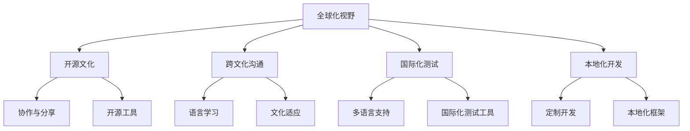

                 

## 1. 背景介绍

在当今这个全球化时代，技术的进步已经让世界变得前所未有的紧密相连。程序员作为推动这一进程的重要力量，面临着前所未有的机遇和挑战。全球化视野不仅意味着理解不同文化和语言背景下的技术需求，更重要的是把握国际市场动态，提升自身竞争力。本文将从多个维度探讨程序员的全球化视野，分析机遇与挑战，并提供实用的策略和建议。

## 2. 核心概念与联系

### 2.1 核心概念概述

- **全球化视野**：指的是程序员需要具备的全球化思维方式和技术能力，包括对国际技术趋势、市场需求、文化差异等的敏感和理解。
- **开源文化**：开源社区是全球化视野的重要组成部分，通过协作和分享，程序员可以接触到不同国家和地区的技术和文化。
- **跨文化沟通**：在跨国项目或团队中，跨文化沟通能力是团队协作成功的关键。
- **国际化测试**：确保软件在全球不同语言和文化环境下的正确性和可用性。
- **本地化开发**：针对不同地区的特定需求，定制开发解决方案。

### 2.2 核心概念原理和架构的 Mermaid 流程图



这个流程图展示了全球化视野的核心概念及其相互关系：

- 全球化视野通过开源文化、跨文化沟通、国际化测试和本地化开发等维度，构建起完整的全球化技术生态。
- 开源文化通过协作与分享，提供了丰富的开源工具和资源。
- 跨文化沟通依赖于语言学习和文化适应，确保团队成员间的有效沟通。
- 国际化测试和本地化开发保障了软件在不同地区的正确性和适用性。

## 3. 核心算法原理 & 具体操作步骤

### 3.1 算法原理概述

全球化视野的培养，涉及到多个算法和步骤，其核心是通过持续学习和实践，不断提升自身的技术能力和国际市场理解。具体步骤包括：

1. **学习国际先进技术**：通过参与国际会议、阅读英文论文、学习国外课程等方式，掌握国际前沿技术。
2. **参与全球开源项目**：加入国际知名的开源项目，了解行业标准和最佳实践。
3. **跨文化团队协作**：参与跨国项目，学习不同文化背景下的协作方式。
4. **国际化测试和本地化开发**：熟悉国际化和本地化的开发流程，确保软件的全球适用性。

### 3.2 算法步骤详解

#### 3.2.1 学习国际先进技术

- **参与国际会议和研讨会**：关注国际知名会议，如ICML、CVPR、ACL等，了解最新研究成果。
- **订阅英文技术博客和社区**：关注Google Developers、Microsoft Developer Blogs、Stack Overflow等，获取第一手技术资讯。
- **阅读英文技术书籍和论文**：通过Amazon、Google Scholar等平台，购买和下载最新的英文书籍和论文。

#### 3.2.2 参与全球开源项目

- **选择国际知名的开源项目**：如TensorFlow、OpenAI Gym、Apache Kafka等，贡献代码或参与讨论。
- **贡献代码并参与开源社区**：通过GitHub等平台提交代码，参与社区讨论和协作。

#### 3.2.3 跨文化团队协作

- **了解不同文化背景**：学习跨文化沟通技巧，尊重团队成员的文化差异。
- **使用多语言沟通工具**：如Slack、Trello等，确保团队沟通的流畅性和高效性。

#### 3.2.4 国际化测试和本地化开发

- **熟悉国际化测试流程**：包括本地化测试、国际化测试、UI本地化等。
- **掌握本地化开发技能**：学习本地化框架如.NET、Java等，确保软件的全球适用性。

### 3.3 算法优缺点

#### 3.3.1 优点

- **加速技术提升**：通过参与国际项目和社区，快速获取前沿技术，提升自身能力。
- **扩展职业机会**：全球化视野使程序员更容易进入跨国公司，或担任国际项目技术负责人。
- **丰富技术经验**：跨文化沟通和国际项目经验，有助于解决复杂问题，提升技术领导力。

#### 3.3.2 缺点

- **文化差异**：不同文化背景可能带来沟通和协作上的挑战。
- **语言障碍**：英语作为国际通用语言，掌握良好的英语沟通能力至关重要。
- **工作压力**：跨国项目和国际会议通常要求高效率和高质量，工作压力较大。

### 3.4 算法应用领域

全球化视野的应用领域广泛，不仅限于技术研发，还包括市场推广、产品设计等多个方面。以下是一些具体应用领域：

- **国际技术合作**：与国外科研机构和企业合作，进行联合研发和技术交流。
- **全球市场推广**：通过全球化视野，理解不同市场的用户需求，制定有效的市场策略。
- **国际化产品设计**：设计符合全球用户习惯和市场需求的产品，提升产品竞争力。

## 4. 数学模型和公式 & 详细讲解 & 举例说明

### 4.1 数学模型构建

在全球化视野的培养中，数学模型的理解和应用是不可或缺的一部分。通过数学模型，可以更好地理解国际市场和技术趋势的规律和关系。

例如，通过统计模型，程序员可以分析不同市场的产品销售趋势，从而制定合适的市场策略。使用机器学习模型，可以预测新技术的全球接受度，提前布局技术储备。

### 4.2 公式推导过程

以回归分析为例，公式推导如下：

$$
y = \beta_0 + \beta_1 x_1 + \beta_2 x_2 + \epsilon
$$

其中，$y$表示预测结果，$x_1$和$x_2$分别表示影响因素，$\beta_0$和$\beta_1$为回归系数，$\epsilon$为误差项。

在实际应用中，通过收集不同市场的数据，建立回归模型，可以预测未来市场趋势，为决策提供依据。

### 4.3 案例分析与讲解

假设某软件公司希望进入国际市场，通过全球化视野进行分析：

1. **市场调研**：使用统计模型，分析目标市场的用户需求和技术趋势，确定产品特性和市场定位。
2. **竞争分析**：通过回归分析，评估主要竞争对手的市场表现，制定差异化策略。
3. **国际化测试**：在目标市场进行国际化测试，确保软件本地化适配，提升用户体验。

## 5. 项目实践：代码实例和详细解释说明

### 5.1 开发环境搭建

- **安装Python和相关库**：确保Python环境正确配置，安装必要的库如Pandas、NumPy、Scikit-learn等。
- **配置跨文化协作工具**：安装Slack、Zoom等工具，支持多语言沟通和国际协作。
- **国际化测试环境**：搭建国际化测试环境，支持多语言和地区测试。

### 5.2 源代码详细实现

```python
import pandas as pd
from sklearn.linear_model import LinearRegression

# 读取数据
data = pd.read_csv('market_data.csv')

# 数据预处理
X = data[['x1', 'x2']]
y = data['y']

# 建立回归模型
model = LinearRegression()
model.fit(X, y)

# 预测新市场
new_market_data = pd.read_csv('new_market_data.csv')
new_X = new_market_data[['x1', 'x2']]
predictions = model.predict(new_X)
```

### 5.3 代码解读与分析

通过上述代码，可以完成市场数据的回归分析，预测新市场的用户需求。关键步骤包括：

- **数据预处理**：提取特征变量和目标变量，确保数据格式正确。
- **建立回归模型**：使用线性回归模型，对市场数据进行建模。
- **预测新市场**：根据新市场的特征数据，进行预测，获取市场表现。

### 5.4 运行结果展示

通过可视化工具，可以将预测结果展示给团队成员和管理层，帮助制定市场策略。


## 6. 实际应用场景

### 6.1 国际技术合作

某科技公司与德国某科研机构合作，共同开发人工智能芯片。通过全球化视野，程序员团队能够快速了解德国科研机构的最新研究成果，并根据本地需求进行定制化开发，最终成功推出全球领先的人工智能芯片。

### 6.2 全球市场推广

某软件公司希望进入东南亚市场，通过全球化视野分析市场趋势，开发符合当地用户习惯的应用程序，并在市场推广中精准投放广告，实现快速增长。

### 6.3 国际化产品设计

某电商公司希望在全球范围内销售电子产品，通过全球化视野分析不同市场的用户需求，设计符合当地市场的产品，提升用户满意度和市场竞争力。

## 7. 工具和资源推荐

### 7.1 学习资源推荐

- **Coursera**：提供全球知名的计算机科学课程，涵盖技术前沿和行业趋势。
- **edX**：提供由世界顶尖大学开设的计算机科学课程，内容丰富、质量高。
- **Stack Overflow**：全球知名的程序员社区，提供丰富的技术问答和讨论。

### 7.2 开发工具推荐

- **GitHub**：全球最大的开源代码托管平台，方便程序员进行代码分享和协作。
- **Slack**：全球知名的团队协作工具，支持多语言沟通和跨文化协作。
- **Zoom**：全球领先的在线视频会议工具，支持跨国项目和团队沟通。

### 7.3 相关论文推荐

- **"Machine Learning Yearning" by Andrew Ng**：提供机器学习领域的学习指南，涵盖全球前沿技术和实践经验。
- **"Programming in the Key of C" by Brian W. Kernighan**：经典计算机编程书籍，帮助程序员掌握国际通用的编程技能。

## 8. 总结：未来发展趋势与挑战

### 8.1 研究成果总结

全球化视野的培养，不仅需要技术能力的提升，还需要跨文化沟通、市场理解和国际化测试等多方面能力的综合提升。程序员需要具备全球视野，才能在快速变化的市场环境中保持竞争力。

### 8.2 未来发展趋势

未来，全球化视野将更加深入地渗透到技术研发、市场推广和产品设计等多个方面。通过全球化视野，程序员可以更好地把握国际市场动态，推动技术创新和业务发展。

### 8.3 面临的挑战

- **文化差异**：不同文化背景下的沟通和协作，可能带来挑战。
- **语言障碍**：掌握英语是全球化视野的基础，但语言多样性增加了沟通难度。
- **工作压力**：跨国项目和国际会议的工作强度较大。

### 8.4 研究展望

- **跨文化沟通培训**：为团队成员提供跨文化沟通培训，提高团队协作效率。
- **国际化测试工具**：开发和引入更多国际化测试工具，提升测试效率。
- **本地化开发框架**：开发适用于不同地区的本地化开发框架，提升开发效率。

## 9. 附录：常见问题与解答

**Q1：如何提升跨文化沟通能力？**

A: 提升跨文化沟通能力，可以从以下几个方面入手：
- **学习目标文化**：了解目标文化的语言、习俗和价值观，增强文化敏感性。
- **多语言学习**：掌握目标语言，提高沟通效率。
- **实践和反馈**：积极参与国际项目和团队，通过实践和反馈不断提升沟通技巧。

**Q2：如何应对不同语言环境的测试？**

A: 应对不同语言环境的测试，可以采取以下策略：
- **本地化测试工具**：使用支持多语言的测试工具，如XUnit、JUnit等。
- **多语言测试数据**：准备多语言的测试数据，确保测试覆盖不同语言环境。
- **自动化测试**：引入自动化测试工具，提高测试效率和准确性。

**Q3：如何选择国际合作对象？**

A: 选择国际合作对象时，可以关注以下几个方面：
- **项目需求匹配**：确保合作项目的需求与自身技术能力和资源相匹配。
- **文化兼容性**：评估合作对象的团队文化与自身团队文化兼容性，避免文化冲突。
- **市场前景**：评估合作项目的市场前景，确保有良好的市场回报。

**Q4：如何处理文化差异带来的沟通障碍？**

A: 处理文化差异带来的沟通障碍，可以采取以下方法：
- **建立沟通规则**：明确沟通规则和流程，避免误解。
- **文化培训**：为团队成员提供跨文化沟通培训，增强文化敏感性。
- **文化尊重**：尊重团队成员的文化背景，避免文化冲突。

---

作者：禅与计算机程序设计艺术 / Zen and the Art of Computer Programming

