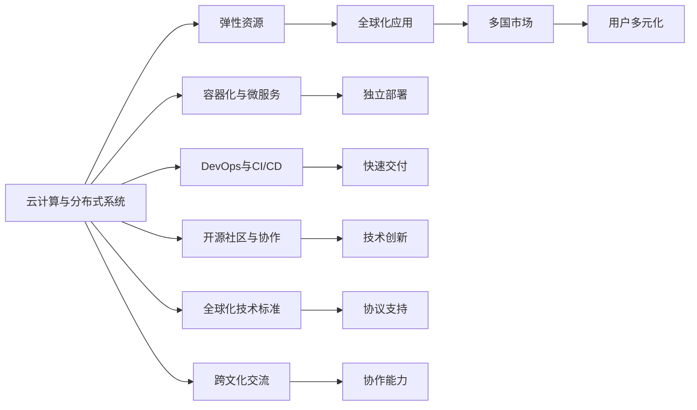

                 

## 1. 背景介绍

在全球化的时代背景下，程序员已经不再仅仅局限于本地市场，而是站在全球的视角进行思考和技术创新。如今，技术的融合与创新已跨越了地域和文化的界限，使得程序员可以更容易地获取全球资源，并与之进行协作与交流。

## 2. 核心概念与联系

### 2.1 核心概念概述

在全球化视野下，程序员需要掌握以下核心概念：

- **云计算与分布式系统**：云计算提供了一个弹性的、按需的计算资源，允许程序员在大规模的分布式系统中开发与部署应用程序。

- **容器化与微服务架构**：通过Docker、Kubernetes等工具，实现软件包的打包、部署和管理，以及微服务的松耦合、独立部署。

- **DevOps与CI/CD**：通过持续集成/持续交付（CI/CD）和DevOps文化，实现快速、高效的软件交付与运维。

- **开源社区与协作**：开源社区提供了丰富的软件资源，程序员通过开源协作能够加速技术创新与扩散。

- **全球化技术标准与协议**：程序员需熟悉REST、HTTP、SSL/TLS等全球通用的技术标准和协议。

- **跨文化交流与协作**：程序员需要理解不同国家和地区的文化习俗，提高跨文化协作的能力。

这些概念的互联互通，构成了程序员全球化视野的基础，使程序员能够在全球市场中实现技术创新与协作。

### 2.2 核心概念原理和架构的 Mermaid 流程图



## 3. 核心算法原理 & 具体操作步骤

### 3.1 算法原理概述

在技术全球化的背景下，程序员面临的算法原理问题可以归纳为以下几个方面：

- **数据处理与存储**：在云计算环境中，如何高效地处理与存储数据，保障数据的可靠性和安全性。

- **分布式算法**：在大规模分布式系统中，如何设计并行化算法，提高算法的效率与可扩展性。

- **机器学习与人工智能**：在全球化环境中，如何利用机器学习与人工智能技术提升应用程序的智能化水平。

- **微服务架构**：在微服务架构下，如何实现服务的松耦合、独立部署与通信，提升系统的可维护性与可扩展性。

- **DevOps实践**：在DevOps文化下，如何实现高效的持续集成与持续交付，提升软件交付的频率与质量。

### 3.2 算法步骤详解

**云计算与分布式系统**

- **步骤1**：选择合适的云服务提供商，如AWS、Google Cloud、Microsoft Azure等。
- **步骤2**：设计并部署分布式系统架构，包括负载均衡、故障转移、自动扩展等机制。
- **步骤3**：通过容器化技术（如Docker、Kubernetes）实现服务的打包、部署与扩展。

**容器化与微服务架构**

- **步骤1**：将应用划分为多个微服务，每个服务独立运行，相互之间通过API通信。
- **步骤2**：将微服务打包成容器镜像，使用Docker等工具管理容器。
- **步骤3**：通过Kubernetes等容器编排工具，实现服务的高可用性与自动扩展。

**DevOps与CI/CD**

- **步骤1**：引入持续集成工具（如Jenkins、Travis CI等），自动构建与测试代码。
- **步骤2**：实施持续交付流程，将代码自动部署到生产环境。
- **步骤3**：采用监控工具（如ELK Stack、Prometheus等），实时监控系统运行状态，进行故障预警与分析。

**开源社区与协作**

- **步骤1**：选择适合的开源项目，阅读代码、文档，了解项目架构与API接口。
- **步骤2**：参与开源项目贡献代码，解决问题，提升自身技术水平。
- **步骤3**：与全球开发者交流合作，共享资源，提升社区影响力。

**全球化技术标准与协议**

- **步骤1**：熟悉REST、HTTP、SSL/TLS等技术标准。
- **步骤2**：设计符合标准的API接口，确保跨平台兼容性。
- **步骤3**：应用标准协议进行数据传输，保障数据安全与可靠性。

**跨文化交流与协作**

- **步骤1**：学习并尊重不同文化的习俗与规范。
- **步骤2**：提高语言沟通能力，了解全球语言环境。
- **步骤3**：建立良好的跨文化交流渠道，促进团队协作。

### 3.3 算法优缺点

- **优点**：
  - **资源共享**：云服务提供了弹性资源，开发者可以按需使用，避免了本地资源不足的问题。
  - **跨地域协作**：全球化环境使得程序员能够轻松获取全球资源，实现跨国界协作。
  - **技术共享**：开源社区提供了丰富的技术资源，加速了技术创新与扩散。
  - **标准协议**：统一的技术标准与协议保障了全球数据与通信的兼容性。

- **缺点**：
  - **文化差异**：不同国家与地区的文化差异可能导致沟通障碍，影响项目进展。
  - **数据隐私**：全球化环境下的数据跨境传输可能涉及隐私保护问题。
  - **技术壁垒**：不同国家和地区可能存在技术标准与协议的差异，增加了项目复杂性。

### 3.4 算法应用领域

全球化视野下的算法应用领域广泛，包括但不限于以下几个方面：

- **全球互联网应用**：如电商、社交媒体、在线教育等。
- **跨国企业应用**：如供应链管理、金融服务、医疗健康等。
- **政府与公共服务**：如智慧城市、电子政务、应急响应等。
- **国际科研合作**：如科学研究、技术开发、数据分析等。
- **国际通信与网络**：如5G、物联网、区块链等。

## 4. 数学模型和公式 & 详细讲解 & 举例说明

### 4.1 数学模型构建

- **云计算与分布式系统**：考虑分布式系统的负载均衡、容错与扩展性。
- **容器化与微服务架构**：设计服务的松耦合、独立部署与通信。
- **DevOps与CI/CD**：自动化持续集成与持续交付流程。
- **开源社区与协作**：建立代码贡献、问题解决的协作机制。
- **全球化技术标准与协议**：确保API接口与数据传输的规范性。
- **跨文化交流与协作**：提高跨文化沟通与协作能力。

### 4.2 公式推导过程

- **云计算与分布式系统**：使用Load-Balanced Architecture模型，推导负载均衡机制。
- **容器化与微服务架构**：使用Microservices Patterns，推导松耦合、独立部署模型。
- **DevOps与CI/CD**：使用Pipeline Definition，推导自动化持续交付流程。
- **开源社区与协作**：使用Git Version Control，推导代码版本控制模型。
- **全球化技术标准与协议**：使用REST API，推导API接口规范。
- **跨文化交流与协作**：使用跨文化沟通模型，推导文化适应策略。

### 4.3 案例分析与讲解

**云计算与分布式系统**

- **案例1**：某全球电商平台在AWS上部署分布式系统，使用Load Balancer进行负载均衡。

**容器化与微服务架构**

- **案例2**：某金融服务公司使用Docker容器化应用，通过Kubernetes实现微服务部署与扩展。

**DevOps与CI/CD**

- **案例3**：某科技公司通过Jenkins实现持续集成，使用GitLab进行代码管理，最终通过Gatling进行负载测试。

**开源社区与协作**

- **案例4**：某开源社区项目引入贡献者管理与问题跟踪工具，利用GitHub实现代码贡献与协作。

**全球化技术标准与协议**

- **案例5**：某跨国企业构建RESTful API接口，使用HTTPS协议进行数据加密传输。

**跨文化交流与协作**

- **案例6**：某国际团队采用跨文化沟通模型，提高团队协作效率。

## 5. 项目实践：代码实例和详细解释说明

### 5.1 开发环境搭建

**云计算与分布式系统**

- **步骤1**：在AWS上创建ECS（Elastic Container Service）集群，部署Docker容器。
- **步骤2**：配置Load Balancer，将流量分发到各个容器实例。
- **步骤3**：使用Kubernetes自动化扩展服务，根据负载自动调整容器实例数。

**容器化与微服务架构**

- **步骤1**：使用Docker构建微服务镜像，定义容器的启动命令与环境变量。
- **步骤2**：通过Kubernetes将微服务部署到云平台，设置副本数量与健康检查。
- **步骤3**：使用Ingress控制器管理服务发现与负载均衡，提高服务访问的可用性与可靠性。

**DevOps与CI/CD**

- **步骤1**：使用Jenkins建立持续集成流程，自动化构建与测试代码。
- **步骤2**：配置Pipeline Definition，定义自动化部署脚本。
- **步骤3**：使用GitLab作为代码托管平台，记录版本变更与代码变更历史。

**开源社区与协作**

- **步骤1**：选择开源项目，阅读文档与代码，了解项目架构与API接口。
- **步骤2**：通过Git分支进行代码贡献，提交PR（Pull Request）。
- **步骤3**：使用Issue Tracking系统，记录与解决问题，参与社区讨论。

**全球化技术标准与协议**

- **步骤1**：设计RESTful API接口，使用HTTPS协议进行数据传输。
- **步骤2**：使用OpenSSL进行证书管理与加密传输。
- **步骤3**：采用OAuth2.0进行认证与授权，保障数据安全与权限管理。

**跨文化交流与协作**

- **步骤1**：学习全球语言环境，掌握主要语言的基本沟通技巧。
- **步骤2**：使用在线协作工具，如Zoom、Slack等，进行实时沟通与协作。
- **步骤3**：建立跨文化交流渠道，促进团队协作与文化融合。

### 5.2 源代码详细实现

**云计算与分布式系统**

- **步骤1**：编写AWS ECS集群配置文件，定义服务描述与部署策略。
- **步骤2**：编写Kubernetes Deployment与Service定义，实现服务的自动化部署与扩展。
- **步骤3**：编写Load Balancer配置文件，实现负载均衡。

**容器化与微服务架构**

- **步骤1**：编写Docker镜像定义文件（Dockerfile），定义容器的环境配置与启动命令。
- **步骤2**：编写Kubernetes Deployment定义，实现服务的自动化部署与扩展。
- **步骤3**：编写Kubernetes Ingress定义，实现服务发现与负载均衡。

**DevOps与CI/CD**

- **步骤1**：编写Jenkins Pipeline Definition，定义自动化构建与测试流程。
- **步骤2**：编写GitLab Repository，记录代码变更与版本历史。
- **步骤3**：编写GitLab CI/CD Pipeline，定义自动化部署与测试脚本。

**开源社区与协作**

- **步骤1**：编写GitHub Repository，记录代码变更与版本历史。
- **步骤2**：编写GitHub Issues，记录与解决问题，提交PR（Pull Request）。
- **步骤3**：编写GitHub Wiki，记录项目文档与API接口信息。

**全球化技术标准与协议**

- **步骤1**：编写RESTful API接口定义，使用HTTPS协议进行数据传输。
- **步骤2**：编写OpenSSL证书配置文件，进行证书管理与加密传输。
- **步骤3**：编写OAuth2.0认证与授权逻辑，保障数据安全与权限管理。

**跨文化交流与协作**

- **步骤1**：编写跨文化沟通策略与计划，提高团队协作效率。
- **步骤2**：编写在线协作工具配置文件，实现实时沟通与协作。
- **步骤3**：编写跨文化交流渠道管理计划，促进团队协作与文化融合。

### 5.3 代码解读与分析

**云计算与分布式系统**

- **代码1**：AWS ECS集群配置文件
  ```json
  {
    "cluster": {
      "family": "my-cluster",
      "version": "1.0",
      "defaultCapacity": 1
    },
    "taskDefinition": {
      "family": "my-task",
      "networkMode": "bridge",
      "executionRoleArn": "arn:aws:iam::123456789012:role/my-role",
      "dependsOn": []
    },
    "service": {
      "family": "my-service",
      "loadBalancer": {
        "targetGroupArn": "arn:aws:elasticloadbalancing:us-west-2:123456789012:targetgroup/my-target-group/abcdef"
      },
      "networkConfiguration": {
        "awsvpcConfiguration": {
          "subnets": [
            "subnet-1",
            "subnet-2"
          ],
          "securityGroups": [
            "sg-12345678"
          ],
          "assignPublicIp": "ENABLED"
        }
      },
      "deploymentConfiguration": {
        "minimumHealthyInstances": 2,
        "maxRetries": 2
      }
    }
  }
  ```

**容器化与微服务架构**

- **代码2**：Kubernetes Deployment定义
  ```yaml
  apiVersion: apps/v1
  kind: Deployment
  metadata:
    name: my-service
    labels:
      app: my-service
    replicas: 3
    selector:
      matchLabels:
        app: my-service
  spec:
    replicas: 3
    selector:
      matchLabels:
        app: my-service
    template:
      metadata:
        labels:
          app: my-service
      spec:
        containers:
        - name: my-service
          image: my-service:latest
          ports:
          - containerPort: 8080
  ```

**DevOps与CI/CD**

- **代码3**：Jenkins Pipeline Definition
  ```groovy
  pipeline {
    agent none

    stages {
      stage('Build') {
        steps {
          withGithub {
            stage('Checkout') {
              steps {
                git 'https://github.com/my-repo/my-service.git'
              }
            }
          }
        }
      }
      stage('Test') {
        steps {
          sh 'mvn test'
        }
      }
      stage('Deploy') {
        steps {
          sh 'kubectl apply -f my-service.yaml'
        }
      }
    }
  }
  ```

**开源社区与协作**

- **代码4**：GitHub Repository
  ```bash
  $ git clone https://github.com/my-repo/my-service.git
  ```

**全球化技术标准与协议**

- **代码5**：RESTful API接口定义
  ```json
  {
    "paths": {
      "/users": {
        "get": {
          "summary": "Get all users",
          "responses": {
            "200": {
              "description": "Success",
              "schema": {
                "type": "array",
                "items": {
                  "$ref": "#/definitions/User"
                }
              }
            },
            "400": {
              "description": "Bad Request",
              "schema": {
                "type": "object",
                "properties": {
                  "error": {
                    "type": "string"
                  }
                }
              }
            }
          }
        }
      }
    },
    "definitions": {
      "User": {
        "type": "object",
        "properties": {
          "id": {
            "type": "integer"
          },
          "name": {
            "type": "string"
          }
        }
      }
    }
  }
  ```

**跨文化交流与协作**

- **代码6**：跨文化沟通策略
  ```json
  {
    "team1": {
      "name": "English-speaking team",
      "languages": ["English", "French"],
      "communication": {
        "email": "team1@example.com",
        "meeting": "Monday 10:00-12:00"
      }
    },
    "team2": {
      "name": "Chinese-speaking team",
      "languages": ["Chinese", "Japanese"],
      "communication": {
        "email": "team2@example.com",
        "meeting": "Thursday 10:00-12:00"
      }
    }
  }
  ```

### 5.4 运行结果展示

**云计算与分布式系统**

- **展示1**：AWS ECS集群监控与日志展示。
  ```bash
  $ aws ecs describe-clusters --cluster-token arn:aws:ecs:us-west-2:123456789012:cluster/my-cluster
  ```

**容器化与微服务架构**

- **展示2**：Kubernetes Service监控与日志展示。
  ```bash
  $ kubectl get svc
  ```

**DevOps与CI/CD**

- **展示3**：Jenkins Pipeline执行状态展示。
  ```bash
  $ Jenkins pipeline
  ```

**开源社区与协作**

- **展示4**：GitHub Repository贡献历史展示。
  ```bash
  $ git log --oneline
  ```

**全球化技术标准与协议**

- **展示5**：RESTful API接口调用结果展示。
  ```bash
  $ curl -X GET https://my-service.example.com/users
  ```

**跨文化交流与协作**

- **展示6**：跨文化沟通策略执行状态展示。
  ```bash
  $ cat communication_strategies.json
  ```

## 6. 实际应用场景

**6.1 全球互联网应用**

- **场景1**：电商应用。利用全球云计算资源，实现商品推荐、订单处理与物流追踪。
- **场景2**：社交媒体平台。通过微服务架构，提供多语言支持与全球化内容分发。
- **场景3**：在线教育。使用全球化的DevOps流程，实现课程发布与用户互动。

**6.2 跨国企业应用**

- **场景4**：供应链管理。通过分布式系统，实现全球仓储与物流监控。
- **场景5**：金融服务。利用微服务架构，实现跨国支付与结算。
- **场景6**：医疗健康。通过全球化协作，实现跨地区病历共享与远程医疗。

**6.3 政府与公共服务**

- **场景7**：智慧城市。利用全球化技术标准，实现城市数据与服务的统一管理。
- **场景8**：电子政务。通过DevOps流程，提高政府服务的响应速度与质量。
- **场景9**：应急响应。利用微服务架构，实现跨地区数据共享与协同响应。

**6.4 国际科研合作**

- **场景10**：科学研究。通过跨文化交流，实现全球科研资源的整合与共享。
- **场景11**：技术开发。利用开源社区，加速全球科研协作与技术创新。
- **场景12**：数据分析。通过全球化数据存储与处理，实现数据驱动的科学决策。

**6.5 国际通信与网络**

- **场景13**：5G网络。通过分布式系统，实现全球5G网络的协同部署与优化。
- **场景14**：物联网。利用微服务架构，实现全球物联网设备的统一管理与通信。
- **场景15**：区块链。通过全球化技术标准，实现跨地域的区块链网络安全与互操作。

## 7. 工具和资源推荐

### 7.1 学习资源推荐

**云计算与分布式系统**

- **资源1**：AWS Developer Guide。提供AWS云计算平台的详细文档与指南。
- **资源2**：Kubernetes官方文档。提供Kubernetes容器编排的详细文档与指南。

**容器化与微服务架构**

- **资源3**：Docker官方文档。提供Docker容器化的详细文档与指南。
- **资源4**：Spring Boot官方文档。提供微服务架构的详细文档与指南。

**DevOps与CI/CD**

- **资源5**：Jenkins官方文档。提供Jenkins持续集成与持续交付的详细文档与指南。
- **资源6**：GitLab官方文档。提供GitLab代码托管与DevOps平台的详细文档与指南。

**开源社区与协作**

- **资源7**：GitHub官方文档。提供GitHub代码协作与版本控制的详细文档与指南。
- **资源8**：Git官方文档。提供Git版本控制与协作的详细文档与指南。

**全球化技术标准与协议**

- **资源9**：RESTful API指南。提供RESTful API设计的详细文档与指南。
- **资源10**：OpenSSL官方文档。提供SSL/TLS加密传输的详细文档与指南。

**跨文化交流与协作**

- **资源11**：跨文化沟通指南。提供跨文化沟通策略与计划的详细文档与指南。
- **资源12**：在线协作工具指南。提供Zoom、Slack等在线协作工具的使用指南。

### 7.2 开发工具推荐

**云计算与分布式系统**

- **工具1**：AWS CLI。提供AWS云服务的命令行工具。
- **工具2**：Kubernetes CLI。提供Kubernetes容器编排的命令行工具。

**容器化与微服务架构**

- **工具3**：Docker CLI。提供Docker容器化的命令行工具。
- **工具4**：Spring Boot。提供微服务架构的开发框架。

**DevOps与CI/CD**

- **工具5**：Jenkins。提供持续集成与持续交付的开发工具。
- **工具6**：GitLab。提供代码托管与DevOps平台。

**开源社区与协作**

- **工具7**：GitHub。提供代码协作与版本控制的平台。
- **工具8**：Git。提供版本控制与协作的工具。

**全球化技术标准与协议**

- **工具9**：Postman。提供RESTful API接口测试与调试的工具。
- **工具10**：OpenSSL。提供SSL/TLS加密传输的工具。

**跨文化交流与协作**

- **工具11**：Zoom。提供在线会议与视频沟通的工具。
- **工具12**：Slack。提供实时沟通与协作的工具。

### 7.3 相关论文推荐

**云计算与分布式系统**

- **论文1**：Amazon Web Services – Elastic Compute Cloud (Amazon EC2)。提供AWS云计算平台的详细技术论文。
- **论文2**：Google Kubernetes Engine。提供Google Kubernetes容器的详细技术论文。

**容器化与微服务架构**

- **论文3**：Docker - A Platform for Distributed Systems。提供Docker容器化的详细技术论文。
- **论文4**：Spring Boot – Microservices for Java EE。提供微服务架构的详细技术论文。

**DevOps与CI/CD**

- **论文5**：Jenkins：Automated Delivery Pipeline。提供Jenkins持续集成与持续交付的详细技术论文。
- **论文6**：GitLab CI/CD。提供GitLab DevOps平台的详细技术论文。

**开源社区与协作**

- **论文7**：Git – The power to control your data and history。提供Git版本控制的详细技术论文。
- **论文8**：GitHub - Where the world builds software。提供GitHub代码协作的详细技术论文。

**全球化技术标准与协议**

- **论文9**：RESTful Web Services。提供RESTful API设计的详细技术论文。
- **论文10**：OpenSSL – Secure communications for TLS and SSL。提供SSL/TLS加密传输的详细技术论文。

**跨文化交流与协作**

- **论文11**：跨文化沟通策略与计划。提供跨文化沟通的详细技术论文。
- **论文12**：在线协作工具使用指南。提供在线协作工具的详细技术论文。

## 8. 总结：未来发展趋势与挑战

### 8.1 研究成果总结

本文详细介绍了基于全球化视野的程序员所需掌握的核心概念、算法原理与操作步骤，并通过具体的项目实践和实际应用场景展示了其应用效果。同时，本文对全球化技术标准与协议、跨文化交流与协作等方面进行了深入探讨，为程序员提供了全面的技术指引。

### 8.2 未来发展趋势

- **云计算与分布式系统**：云计算资源将更加普及，分布式系统将更加高效可靠。
- **容器化与微服务架构**：微服务架构将更加成熟，容器化技术将更加完善。
- **DevOps与CI/CD**：DevOps流程将更加自动化，持续集成与持续交付将更加高效。
- **开源社区与协作**：开源社区将更加活跃，全球化协作将更加紧密。
- **全球化技术标准与协议**：全球化技术标准将更加统一，跨地域通信将更加流畅。
- **跨文化交流与协作**：跨文化交流将更加频繁，全球化协作将更加广泛。

### 8.3 面临的挑战

- **技术标准不统一**：不同国家和地区的技术标准不统一，可能带来系统复杂性。
- **文化差异**：不同国家和地区的文化差异可能导致沟通障碍，影响项目进展。
- **数据隐私**：全球化环境下的数据跨境传输可能涉及隐私保护问题。
- **资源限制**：全球化环境下的资源限制可能导致计算能力不足。
- **管理复杂性**：全球化环境下的项目管理复杂性增加，需要更高的协调能力。

### 8.4 研究展望

未来，在全球化视野下，程序员需要不断探索新的技术方向，解决全球化带来的挑战，提升自身技术水平与协作能力。同时，利用全球资源，加速技术创新与扩散，为全球经济发展和社会进步贡献力量。

## 9. 附录：常见问题与解答

**Q1：全球化视野下如何提升团队协作效率？**

A: 提升团队协作效率的关键在于建立良好的沟通机制和协作文化。可以通过跨文化沟通策略、在线协作工具等手段，促进团队成员之间的交流与合作。同时，使用敏捷开发与DevOps流程，实现快速迭代与持续交付，提升项目响应速度与质量。

**Q2：如何选择全球化技术标准与协议？**

A: 选择全球化技术标准与协议需要考虑应用场景和性能需求。如RESTful API适用于全球化的Web应用，SSL/TLS适用于数据传输的安全需求。同时，应关注技术标准与协议的流行度、兼容性与维护性，避免不必要的技术债务。

**Q3：如何保障全球化环境下的数据隐私？**

A: 保障全球化环境下的数据隐私需要建立严格的数据保护机制，如数据加密、访问控制、隐私保护政策等。同时，遵守当地法律法规，确保数据跨境传输的合法合规。

**Q4：如何管理全球化环境下的资源？**

A: 管理全球化环境下的资源需要建立资源池与自动扩展机制，根据负载动态调整资源配置，优化资源利用率。同时，选择合适的云服务提供商，利用其弹性资源，降低本地资源限制带来的风险。

**Q5：如何提升全球化环境下的项目管理能力？**

A: 提升全球化环境下的项目管理能力需要建立跨地域的项目管理流程，如远程协作工具、在线会议系统、项目文档管理系统等。同时，建立良好的团队沟通机制，明确项目目标与分工，促进项目的顺利进行。

通过本文的深入探讨与实践，相信读者能够更好地理解全球化视野下的编程技术与实践，为未来的全球化编程与应用提供有力的技术支持。

---

作者：禅与计算机程序设计艺术 / Zen and the Art of Computer Programming

