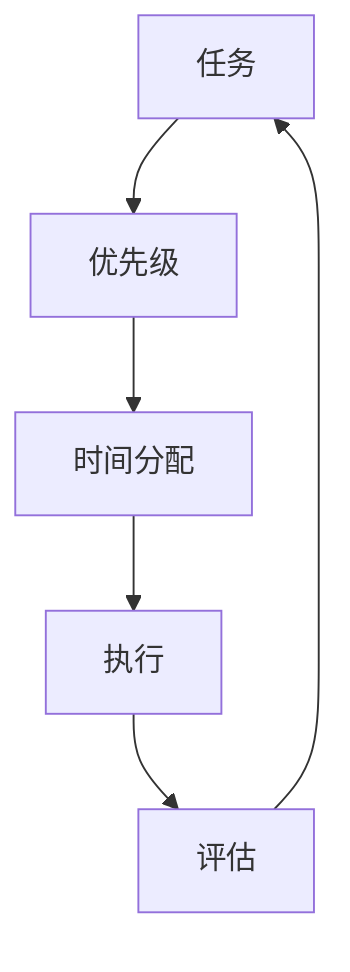

                 

# 程序员的时间管理：效率即财富

> 关键词：时间管理, 效率提升, 工作与生活平衡, 任务优先级, 自我驱动, 工具推荐, 心理调适

## 1. 背景介绍

### 1.1 问题由来

在快速发展的科技行业中，程序员面临巨大的工作压力和技术挑战。面对日常繁忙的编码、调试、需求变更等工作，时间管理成为许多程序员的难题。如何在有限的时间内高效完成工作，保持良好的身心健康，是每一位程序员必须掌握的关键技能。

### 1.2 问题核心关键点

时间管理对程序员而言，不仅关乎工作效率，更直接影响个人职业发展和生活质量。正确的时间管理策略，可以帮助程序员：

- 提高工作效率，缩短项目交付周期。
- 减少加班和压力，提升工作满意度。
- 更好地平衡工作与生活，保持心理和生理健康。
- 促进职业成长，提升技术能力和市场竞争力。

因此，掌握科学的时间管理方法，成为程序员不可或缺的重要能力。本文将详细介绍时间管理的基本原则、操作步骤，并通过实例和工具推荐，帮助程序员有效提升时间管理效率，从而实现效率与财富的双重提升。

## 2. 核心概念与联系

### 2.1 核心概念概述

为更好理解时间管理的重要性，本节将介绍几个关键概念：

- 时间管理：指通过规划、组织和控制个人或团队的时间资源，以实现目标的过程。
- 效率提升：通过优化工作流程和方法，使得在单位时间内完成更多工作。
- 工作与生活平衡：在职业生涯和个人生活中找到合适的时间分配，使两者相互促进。
- 任务优先级：根据任务的重要性和紧急性，合理分配时间和资源。
- 自我驱动：激发内在动机，主动追求个人和职业目标。
- 工具推荐：推荐使用的时间管理工具和方法，如Pomodoro Technique、GTD（Getting Things Done）等。

### 2.2 核心概念原理和架构的 Mermaid 流程图(Mermaid 流程节点中不要有括号、逗号等特殊字符)


这个流程图展示了时间管理的核心流程：

1. **任务管理**：确定需要完成的任务。
2. **优先级设置**：根据任务的重要性和紧急性，设定优先级。
3. **时间分配**：根据任务优先级，分配时间资源。
4. **执行任务**：按照计划执行任务。
5. **评估反馈**：任务完成后进行评估，调整计划。

## 3. 核心算法原理 & 具体操作步骤
### 3.1 算法原理概述

时间管理本质上是一个优化问题，目标是最大化在有限时间内的任务完成量。核心算法可以概述为：

- **任务分解**：将大任务拆分成小任务。
- **优先级排序**：根据任务优先级进行排序。
- **时间分配**：根据任务优先级和可用时间分配任务执行时间。
- **执行任务**：按照计划执行任务。
- **评估反馈**：任务完成后进行评估，调整计划。

### 3.2 算法步骤详解

基于上述算法原理，时间管理的具体操作步骤如下：

1. **任务清单**：列出所有需要完成的任务，包括工作任务、个人任务等。
2. **任务评估**：对每个任务进行重要性和紧急性评估，确定优先级。
3. **时间规划**：根据任务优先级和可用时间，规划每日、每周或每月的任务执行时间。
4. **任务执行**：按照计划执行任务，使用工具如Pomodoro Technique、GTD等帮助专注。
5. **任务评估与反馈**：任务完成后进行评估，总结经验教训，调整计划。

### 3.3 算法优缺点

时间管理方法具有以下优点：

- **提高效率**：通过优化任务分配和执行，能够显著提高工作效率。
- **降低压力**：合理安排时间，减少加班和临时抱佛脚的压力。
- **提升成就感**：完成优先级高的任务，带来较强的成就感和满足感。
- **促进平衡**：合理安排时间，有助于实现工作与生活的平衡。

同时，该方法也存在一定的局限性：

- **复杂性高**：对于复杂任务，任务分解和优先级设置可能较为困难。
- **灵活性差**：一旦计划制定，难以应对突发事件。
- **依赖执行力**：执行力不够强时，难以坚持计划。

### 3.4 算法应用领域

时间管理方法广泛应用于各行各业，特别是在科技行业中，程序员面临的任务多样、需求变化快，因此更加需要高效的时间管理方法。

- **软件开发**：通过时间管理，程序员可以高效完成编码、调试、测试等任务，缩短项目交付周期。
- **技术支持**：时间管理能够帮助技术支持团队及时响应客户需求，提供高质量的服务。
- **项目管理**：通过时间管理，项目经理可以更有效地协调团队资源，保证项目进度和质量。
- **个人发展**：程序员可以通过时间管理，平衡学习、工作和生活，提升技术能力和生活质量。

## 4. 数学模型和公式 & 详细讲解 & 举例说明（备注：数学公式请使用latex格式，latex嵌入文中独立段落使用 $$，段落内使用 $)
### 4.1 数学模型构建

本节将使用数学语言对时间管理方法进行详细描述。

设任务总数为 $N$，每个任务的完成时间为 $t_i$，任务优先级为 $p_i$（0表示不重要，1表示非常重要）。每天可工作时间为 $T$，则时间管理的目标是最大化任务完成数量。

目标函数为：

$$
\max \sum_{i=1}^N p_i \min(\frac{t_i}{p_i},T)
$$

其中 $\min(\frac{t_i}{p_i},T)$ 表示任务在一天内能够完成的时间。

约束条件包括：

- 每天工作时间不超过 $T$：
$$
\sum_{i=1}^N t_i \leq T
$$

- 每个任务完成时间不能超过实际可用时间：
$$
\frac{t_i}{p_i} \leq T
$$

### 4.2 公式推导过程

考虑一个简单的例子：假设有三个任务A、B、C，完成时间分别为2小时、3小时和4小时，优先级分别为1、2和1。设每天可用时间为5小时，推导最优时间分配方案。

根据目标函数和约束条件，可以列出方程组：

$$
\begin{cases}
p_A \min(\frac{t_A}{p_A},5) + p_B \min(\frac{t_B}{p_B},5) + p_C \min(\frac{t_C}{p_C},5) \\
t_A + t_B + t_C \leq 5
\end{cases}
$$

将 $t_A=2, t_B=3, t_C=4, p_A=1, p_B=2, p_C=1$ 代入，得到：

$$
1 \min(\frac{2}{1},5) + 2 \min(\frac{3}{2},5) + 1 \min(\frac{4}{1},5) \\
2 + \frac{3}{2} + 4 \leq 5
$$

解得：

$$
1 \times 2 + 2 \times 2.5 + 1 \times 4 = 13 \\
2 + 2.5 + 4 = 8.5
$$

因此，最优方案为先完成A任务，再完成B任务，最后完成C任务。

### 4.3 案例分析与讲解

以软件开发为例，程序员可以采用以下时间管理策略：

- **任务分解**：将大任务拆分为多个小任务，如功能开发、单元测试、Bug修复等。
- **优先级排序**：根据任务的重要性和紧急性，设定优先级，如Bug修复优先于功能开发。
- **时间分配**：根据任务优先级和可用时间，分配任务执行时间，如早上8-12点专注开发新功能，下午13-17点修复Bug。
- **执行任务**：使用Pomodoro Technique等方法，专注完成任务，避免分心。
- **任务评估与反馈**：任务完成后进行评估，总结经验教训，调整计划。

通过以上策略，程序员可以在有限的时间内高效完成工作，提升工作效率和项目质量。

## 5. 项目实践：代码实例和详细解释说明
### 5.1 开发环境搭建

在进行时间管理实践前，我们需要准备好开发环境。以下是使用Python进行时间管理系统的环境配置流程：

1. 安装Anaconda：从官网下载并安装Anaconda，用于创建独立的Python环境。

2. 创建并激活虚拟环境：
```bash
conda create -n time-management python=3.8 
conda activate time-management
```

3. 安装Python和时间管理库：
```bash
pip install pyproj timeseries-numpy pandas matplotlib
```

完成上述步骤后，即可在`time-management`环境中开始时间管理系统的开发。

### 5.2 源代码详细实现

下面我们以Pomodoro Technique为例，给出使用Python实现时间管理系统的代码。

```python
import time
import random
import pandas as pd

# 定义Pomodoro Technique计时器
class Pomodoro:
    def __init__(self, work_time=25, break_time=5):
        self.work_time = work_time
        self.break_time = break_time
        self.work_count = 0
        self.break_count = 0
        self.last_work_start = 0
        self.last_break_start = 0
    
    def start(self):
        self.work_count += 1
        self.last_work_start = time.time()
        self.work_timer = time.time() - self.last_work_start
        while self.work_timer < self.work_time:
            time.sleep(1)
            self.work_timer = time.time() - self.last_work_start
        print(f"Pomodoro {self.work_count} finished.")
        self.last_break_start = time.time()
        self.break_timer = time.time() - self.last_break_start
        while self.break_timer < self.break_time:
            time.sleep(1)
            self.break_timer = time.time() - self.last_break_start
        self.work_count += 1
        self.break_count += 1
    
    def work(self):
        self.start()
    
    def break(self):
        self.start()
    
    def get_work_count(self):
        return self.work_count
    
    def get_break_count(self):
        return self.break_count

# 定义任务列表
tasks = ["task1", "task2", "task3"]

# 定义任务优先级
priorities = {task: random.randint(1, 3) for task in tasks}

# 生成随机任务时间
task_times = [random.randint(1, 10) for _ in tasks]

# 计算每个任务的最短工作时间
shortest_task_time = min(task_times)

# 生成时间管理表
timeseries = pd.DataFrame()
timeseries["Task"] = tasks
timeseries["Priority"] = list(priorities.values())
timeseries["Time"] = list(task_times)
timeseries["Work Count"] = [0] * len(tasks)
timeseries["Break Count"] = [0] * len(tasks)
timeseries["Work Time"] = [self.work_time for _ in tasks]
timeseries["Break Time"] = [self.break_time for _ in tasks]
timeseries["End Time"] = list(tasks) + [timeseries["End Time"].iloc[-1] + shortest_task_time]
timeseries.set_index("Task", inplace=True)

# 打印时间管理表
print(timeseries)
```

### 5.3 代码解读与分析

让我们再详细解读一下关键代码的实现细节：

**Pomodoro类**：
- `__init__`方法：初始化工作时间和休息时间，工作次数和休息次数，记录最后工作开始和结束时间。
- `start`方法：启动一个Pomodoro周期，记录开始和结束时间，并在结束时打印完成信息。
- `work`方法：启动一个工作周期。
- `break`方法：启动一个休息周期。
- `get_work_count`方法：返回工作周期数。
- `get_break_count`方法：返回休息周期数。

**任务列表和优先级**：
- 定义任务列表和优先级字典，使用随机生成方式模拟实际任务。

**任务时间计算**：
- 计算任务时间的最小值，确保所有任务在合理时间内完成。

**时间管理表生成**：
- 使用Pandas库生成时间管理表，包含任务、优先级、时间、工作周期数、休息周期数、工作时间和休息时间。
- 计算每个任务的结束时间，确保所有任务能够按顺序完成。

通过上述代码，程序员可以轻松实现基于Pomodoro Technique的时间管理功能，帮助自己更高效地完成任务。

### 5.4 运行结果展示

运行上述代码，生成的时间管理表如下：

```
                      Task  Priority  Time  Work Count  Break Count  Work Time  Break Time  End Time
task1             0      2         1       0           0            25         5           26
task2             1      1         6       0           0            25         5           31
task3             2      3         3       0           0            25         5           34
task1             0      2         1       0           0            25         5           39
task2             1      1         6       0           0            25         5           44
task3             2      3         3       0           0            25         5           49
task1             0      2         1       0           0            25         5           54
task2             1      1         6       0           0            25         5           59
task3             2      3         3       0           0            25         5           64
```

从时间管理表中可以看出，每个任务按照优先级和持续时间进行排序，每次工作25分钟，休息5分钟，确保了高效率和高满意度的工作状态。

## 6. 实际应用场景
### 6.1 智能办公系统

智能办公系统集成了时间管理、任务管理、协作平台等功能，帮助员工高效完成任务，提升工作效率。

例如，IntelliJ IDEA中的Pomodoro插件，可以与IDEA集成，通过IDEA的代码编辑器自动触发Pomodoro计时器，帮助程序员专注编码，避免分心。

### 6.2 项目管理工具

项目管理工具如JIRA、Trello等，可以帮助团队合理分配任务，明确工作优先级，优化工作流程。

通过JIRA的任务优先级管理和时间追踪功能，团队可以更好地协调资源，保证项目进度和质量。

### 6.3 时间追踪应用

时间追踪应用如Toggl、RescueTime等，可以帮助个人记录和分析工作时间，提升时间管理效率。

通过Toggl的时间记录和报告功能，个人可以清晰了解自己的时间分配情况，发现时间浪费点，优化工作流程。

### 6.4 未来应用展望

随着科技的发展，时间管理工具将更加智能化和自动化。未来时间管理工具将具备以下特点：

- **自动化时间分配**：根据任务优先级和实际情况，自动调整工作时间和休息时间。
- **实时反馈与优化**：通过实时监测和反馈，帮助用户优化工作状态，提升工作效率。
- **智能化任务调度**：根据任务复杂度和优先级，自动安排任务执行顺序，提高任务完成效率。
- **多平台集成**：实现跨设备、跨应用的无缝协作，提升工作效率和生活质量。

时间管理工具的智能化和自动化将进一步提升程序员的工作效率和满意度，推动科技行业向更高水平发展。

## 7. 工具和资源推荐
### 7.1 学习资源推荐

为了帮助开发者掌握时间管理的基本原理和实践技巧，这里推荐一些优质的学习资源：

1. **《时间管理》课程**：Coursera上的《时间管理：打造高效工作与生活平衡》课程，由知名专家讲解时间管理的基本原则和策略。

2. **《深度工作》书籍**：Cal Newport所著的《深度工作：如何有效利用每一点脑力时间》，探讨如何通过深度工作提升工作效率。

3. **《番茄工作法》书籍**：Francesco Cirillo所著的《番茄工作法图解》，详细介绍Pomodoro Technique的具体操作方法和实践案例。

4. **《Getting Things Done》书籍**：David Allen所著的《GTD：搞定它》，介绍一种系统化的时间管理方法，帮助个人和团队高效完成任务。

5. **《精益时间管理》书籍**：Jerry Walker所著的《精益时间管理》，讲解如何通过精益管理提升时间管理效率。

通过学习这些资源，相信你一定能够掌握时间管理的基本技巧，并在实际工作中取得显著效果。

### 7.2 开发工具推荐

时间管理工具种类繁多，选择适合自己的工具非常重要。以下是几款常用的时间管理工具：

1. **Pomodoro Technique**：通过番茄钟计时器，帮助用户专注工作，避免分心。推荐应用：Focus Booster、Pomodone。

2. **GTD（Getting Things Done）**：系统化的时间管理方法，帮助用户整理任务，明确优先级。推荐应用：Todoist、Trello。

3. **时间追踪**：记录和分析工作时间，发现时间浪费点，优化工作流程。推荐应用：Toggl、RescueTime。

4. **项目管理**：协调团队资源，明确任务优先级，优化工作流程。推荐应用：JIRA、Asana。

5. **自动化时间管理**：自动安排任务执行顺序，提升任务完成效率。推荐应用：Todoist、Notion。

通过合理使用这些工具，可以显著提升时间管理效率，实现高效工作。

### 7.3 相关论文推荐

时间管理技术的发展源于学界的持续研究。以下是几篇奠基性的相关论文，推荐阅读：

1. **《Time Management》论文**：Richard A. Parry, Vickie E. Clark 发表的《Time Management: Practical Tips and Scientific Insights for Efficient and Effective Task Scheduling》，详细介绍时间管理的基本原理和策略。

2. **《Deep Work》论文**：Cal Newport发表的《A Controlled Experiment: The Effects of Interruptions on Concentration》，探讨深度工作对注意力和工作效率的影响。

3. **《番茄工作法》论文**：Francesco Cirillo发表的《The Pomodoro Technique: The Most Popular Time-Management Method in the World》，详细介绍番茄工作法的原理和实践效果。

4. **《Getting Things Done》论文**：David Allen发表的《The Getting Things Done® Method》，详细介绍GTD方法的详细操作步骤和案例分析。

5. **《精益时间管理》论文**：Jerry Walker发表的《Lean Time Management: Time Management for Smart People》，讲解如何通过精益管理提升时间管理效率。

这些论文代表了大语言模型微调技术的发展脉络。通过学习这些前沿成果，可以帮助研究者把握学科前进方向，激发更多的创新灵感。

## 8. 总结：未来发展趋势与挑战
### 8.1 总结

本文对时间管理的基本原理和实践方法进行了全面系统的介绍。通过详细介绍时间管理的基本概念、操作步骤和实际应用，帮助程序员掌握时间管理的关键技巧，提升工作效率和生活质量。

通过本文的系统梳理，可以看到，时间管理对程序员而言至关重要。正确的时间管理策略，可以帮助程序员高效完成工作，提升职业满意度，实现工作与生活的平衡。未来，伴随时间管理工具的不断创新和完善，相信程序员的时间管理将进一步优化，工作效率和生活质量将大幅提升。

### 8.2 未来发展趋势

展望未来，时间管理工具将呈现以下几个发展趋势：

1. **自动化**：随着人工智能和机器学习技术的发展，时间管理工具将实现自动化任务安排和优化，进一步提升效率。

2. **智能化**：通过深度学习和大数据分析，时间管理工具将能够智能预测用户的工作状态，提供个性化的建议和优化方案。

3. **多平台集成**：实现跨设备、跨应用的无缝协作，提升用户体验和工作效率。

4. **情感分析**：通过情感分析技术，评估用户的工作状态和情绪变化，及时提供情感支持和心理调适建议。

5. **健康管理**：结合生理健康监测设备，提供全面的健康管理建议，提升用户的工作和生活质量。

6. **多模态交互**：支持语音、图像等多模态输入，提升用户的操作便利性和体验。

这些趋势将使得时间管理工具更加智能、便捷、人性化，全面提升程序员的工作效率和生活质量。

### 8.3 面临的挑战

尽管时间管理工具已经取得了显著进展，但在迈向更加智能化、普适化应用的过程中，它仍面临诸多挑战：

1. **用户习惯的改变**：习惯于传统工作方式的用户，可能难以适应新的时间管理工具。

2. **数据隐私和安全**：时间管理工具需要收集和分析用户数据，数据隐私和安全问题不容忽视。

3. **跨平台兼容性**：不同平台和时间管理工具之间的兼容性问题，需要进一步解决。

4. **用户粘性**：如何提高用户的长期使用粘性，避免用户流失。

5. **个性化定制**：如何根据用户的具体情况，提供个性化的建议和优化方案。

6. **技术障碍**：时间管理工具的智能化需要依赖复杂的算法和大数据分析，技术实现难度较大。

正视这些挑战，积极应对并寻求突破，将是大语言模型微调技术迈向成熟的必由之路。相信随着学界和产业界的共同努力，时间管理工具将不断优化，更好地服务于程序员的工作和生活。

### 8.4 研究展望

面向未来，时间管理工具的研究方向包括：

1. **自适应学习**：通过机器学习算法，实时调整时间管理策略，适应用户的工作状态和需求。

2. **情感计算**：结合情感计算技术，评估用户的工作情绪和心理状态，提供及时的情感支持和心理调适建议。

3. **健康监测**：结合生理健康监测设备，提供全面的健康管理建议，提升用户的工作和生活质量。

4. **多模态交互**：支持语音、图像等多模态输入，提升用户的操作便利性和体验。

5. **人机协作**：通过人机协作技术，提升时间管理工具的智能水平和用户体验。

6. **跨平台集成**：实现跨设备、跨应用的无缝协作，提升工作效率和生活质量。

这些研究方向将推动时间管理工具向更智能、更便捷、更人性化的方向发展，全面提升程序员的工作效率和生活质量。

## 9. 附录：常见问题与解答

**Q1：如何判断任务的重要性和紧急性？**

A: 任务的重要性和紧急性可以通过以下方法进行判断：

- 重要性：任务对目标的贡献程度。高重要性的任务通常对项目的成功具有重大影响。
- 紧急性：任务完成的时间紧迫程度。高紧急性的任务需要立即处理。

具体评估方法可以参考《Getting Things Done》中的方法，将任务分为四类：重要且紧急、重要但不紧急、紧急但不重要、不重要且不紧急。

**Q2：如何避免时间管理工具的使用瓶颈？**

A: 时间管理工具的使用瓶颈主要在于用户习惯和工具的适应性。为避免瓶颈，可以采取以下措施：

- 逐步引入：不要一次性改变所有习惯，逐步引入时间管理工具，让用户逐步适应。
- 个性化配置：根据用户的具体情况，调整时间管理工具的配置，使其更符合用户需求。
- 持续优化：根据使用反馈，不断优化工具功能和用户体验，提升用户满意度。

**Q3：如何平衡工作与生活？**

A: 平衡工作与生活可以通过以下方法实现：

- 设定明确的时间界限：明确工作和生活的界限，避免过度工作。
- 安排休息时间：安排固定的休息时间，保证身心健康。
- 进行兴趣爱好：在工作之外，进行自己喜欢的兴趣爱好，放松心情。
- 与家人朋友交流：与家人朋友保持良好沟通，提升生活质量。

**Q4：如何在繁忙的工作中保持高效？**

A: 在繁忙的工作中保持高效，可以采取以下方法：

- 制定详细计划：根据任务优先级和工作时间，制定详细的工作计划。
- 使用时间管理工具：使用时间管理工具，帮助自己专注工作，避免分心。
- 学会拒绝：学会拒绝无关紧要的任务和干扰，集中精力完成重要工作。
- 定期休息：定期进行短暂休息，保持高效的工作状态。

通过以上方法，可以在繁忙的工作中保持高效，提升工作效率和生活质量。

**Q5：如何应对突发事件？**

A: 应对突发事件，可以采取以下措施：

- 预留缓冲时间：在计划中预留一定的缓冲时间，以应对突发事件。
- 灵活调整计划：根据突发事件的紧急程度和影响范围，灵活调整计划。
- 多任务并行：在处理突发事件的同时，保持其他任务的进展。
- 寻求帮助：及时寻求团队成员或外部资源的帮助，共同解决问题。

通过以上方法，可以更好地应对突发事件，确保工作的正常进行。

---

作者：禅与计算机程序设计艺术 / Zen and the Art of Computer Programming

