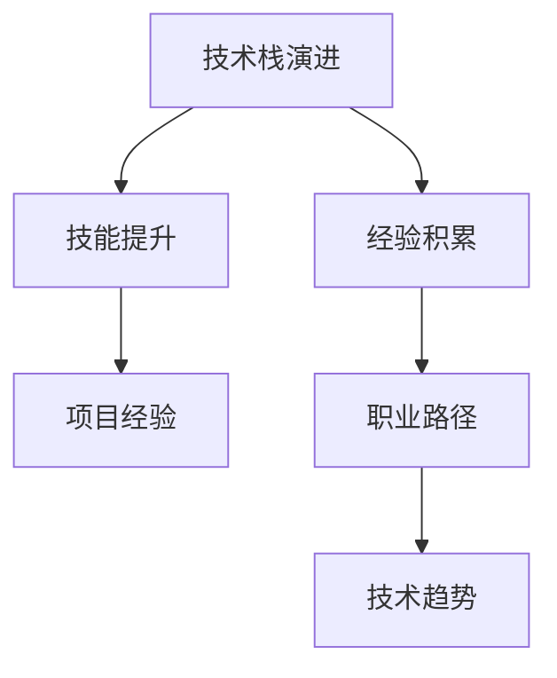

                 

# 程序员的职业生涯规划：30年路线图

> 关键词：职业规划, 技术发展, 技能提升, 学习路径, 技术栈演进

## 1. 背景介绍

### 1.1 问题由来

在科技飞速发展的今天，技术领域日新月异，程序员的职业发展面临着诸多挑战和机遇。如何在30年的职业生涯中，不断提升自我，抓住机会，实现个人和职业的最大化发展？本文将从技术、职业、生活等各个方面，为你绘制一张全面的职业规划路线图，帮助你在职业发展的道路上更上一层楼。

### 1.2 问题核心关键点

职业规划的核心在于合理设定目标，有针对性地提升技能，持续学习新知识，并在此基础上不断调整优化自己的职业路径。关键点包括：

- **目标设定**：明确职业目标，设定短期和长期目标，并将其具体化。
- **技能提升**：不断学习新技能，保持技术栈的先进性。
- **学习路径**：制定科学的学习路径，逐步提高技术水平。
- **经验积累**：积累项目经验，培养团队合作能力，提升领导力。
- **适应变化**：适应技术领域的变化，抓住新机会。

## 2. 核心概念与联系

### 2.1 核心概念概述

为更好地理解职业生涯规划的框架，本节将介绍几个关键概念：

- **技术栈演进**：指程序员在职业生涯中掌握的技术集合的演变过程。随着技术的发展，程序员需要不断更新自己的技术栈。
- **技能提升**：包括编程语言、框架、算法、数据结构等技术技能的不断学习和精进。
- **经验积累**：通过实际项目和团队合作，积累实践经验和软技能。
- **职业路径**：指根据自身兴趣和市场需求，选择的发展方向和职业道路。
- **技术趋势**：包括新兴技术、框架、工具等，对技术栈演进的影响。

这些概念之间的逻辑关系可以通过以下Mermaid流程图来展示：



这个流程图展示出各个概念之间的联系：技术栈的演进依赖于技能的提升，而经验的积累又能够支撑技术栈的成长，职业路径的设定则受技术栈和经验的影响，同时技术趋势也是影响演进方向的重要因素。

## 3. 核心算法原理 & 具体操作步骤
### 3.1 算法原理概述

职业规划的算法原理基于"目标设定、技能提升、经验积累、职业路径选择"这一循环。即在设定明确职业目标的基础上，有针对性地提升技能，通过实践积累经验，并在此基础上选择职业路径，适应技术趋势。

### 3.2 算法步骤详解

基于上述原理，以下是一个简化的职业生涯规划算法步骤：

**Step 1: 目标设定**

- **短期目标**：设定1-2年的具体技能提升计划，如掌握某种编程语言，精通某个框架等。
- **中期目标**：3-5年的职业发展目标，如晋升至技术经理，掌握某种新技术栈等。
- **长期目标**：10年以上的职业愿景，如成为技术专家、创业等。

**Step 2: 技能提升**

- **基础技能学习**：定期学习编程语言、算法、数据结构等基础技能，保持技术栈的先进性。
- **进阶技能学习**：根据职业目标，选择相关的进阶技能，如云计算、大数据、人工智能等。
- **实践应用**：通过项目实践，应用所学技能，巩固理解。

**Step 3: 经验积累**

- **项目参与**：积极参与团队项目，积累实战经验。
- **技术交流**：参加技术会议、读书会、技术讨论等，分享知识，提升视野。
- **反馈改进**：从项目和团队反馈中学习，不断优化自己的工作方式和技术应用。

**Step 4: 职业路径选择**

- **兴趣匹配**：选择符合自身兴趣和优势的职业方向，如后端开发、前端开发、全栈开发等。
- **市场需求**：关注市场对技术人才的需求，选择有发展潜力的领域。
- **未来趋势**：跟踪技术发展趋势，选择具有长期发展潜力的技术方向。

### 3.3 算法优缺点

职业生涯规划算法具有以下优点：

- **目标导向**：通过明确的目标设定，能够提供具体的学习和发展方向。
- **系统性**：将职业发展分解为多个步骤，有利于系统的进行技能提升和经验积累。
- **可操作性**：每个步骤都具有可执行性，能够帮助实际规划职业路径。

同时，该算法也存在一些局限性：

- **灵活性不足**：在特定情况下，可能无法灵活调整职业路径。
- **主观性强**：个人兴趣和市场需求的匹配需要主观判断，可能存在偏差。
- **外部因素影响**：技术趋势和市场需求的变化，可能影响职业规划的稳定性。

### 3.4 算法应用领域

职业生涯规划算法不仅适用于个人职业规划，还可以应用于企业的人才培养和团队管理。例如：

- **企业培训**：根据员工的发展需求，制定个性化的培训计划，提升整体技术水平。
- **团队建设**：根据团队成员的技能和兴趣，合理分配项目任务，提高团队协作效率。
- **职业规划咨询**：为求职者提供个性化的职业规划建议，帮助其找到适合自己的职业方向。

## 4. 数学模型和公式 & 详细讲解 & 举例说明
### 4.1 数学模型构建

设 $T$ 为职业生涯规划的时间长度，$S$ 为技能提升的集合，$E$ 为经验积累的集合，$J$ 为职业路径的集合。则职业生涯规划的数学模型可以表示为：

$$
\begin{aligned}
&\max_{S,E,J} F(S,E,J) \\
&\text{subject to} \\
&\quad \text{短期目标} \leq T_1 \\
&\quad \text{中期目标} \leq T_2 \\
&\quad \text{长期目标} \leq T_3 \\
&\quad \text{技能提升} \in S \\
&\quad \text{经验积累} \in E \\
&\quad \text{职业路径} \in J
\end{aligned}
$$

其中 $F(S,E,J)$ 为综合评价函数，衡量职业发展的综合效益。

### 4.2 公式推导过程

为了更好地衡量职业发展效益，可以引入以下指标：

1. **技能掌握度**：$S_k$ 表示对技能 $k$ 的掌握程度。
2. **项目经验丰富度**：$E_p$ 表示参与项目 $p$ 的经验丰富度。
3. **职业满意度**：$J_s$ 表示在职业路径 $s$ 上的满意度。
4. **未来发展潜力**：$P_t$ 表示在时间 $t$ 上的未来发展潜力。

综合评价函数 $F$ 可以表示为：

$$
F(S,E,J) = \sum_{k \in S} w_k S_k + \sum_{p \in E} w_p E_p + \sum_{s \in J} w_s J_s + \sum_{t \in T} w_t P_t
$$

其中 $w$ 为各个指标的权重，需要根据实际情况进行调整。

### 4.3 案例分析与讲解

以一名软件工程师的职业生涯规划为例：

- **短期目标**：掌握Python编程语言，通过某个大型项目锻炼团队协作能力。
- **中期目标**：晋升至技术经理，掌握云计算技术。
- **长期目标**：成为技术总监，关注人工智能领域的发展。

在技能提升方面，可以设定以下计划：

- 学习Python编程语言，通过编写开源项目进行实践。
- 参加云计算相关课程，获取AWS认证。
- 学习人工智能基础知识，如机器学习算法、深度学习框架等。

在经验积累方面，可以参与以下项目：

- 参与公司内部的大型项目，积累项目经验。
- 在开源社区贡献代码，提升技术影响力。
- 参加技术会议和读书会，扩展人脉和知识。

在职业路径选择方面，可以优先选择以下方向：

- 后端开发：有较高的技术门槛和市场需求，适合技术专家发展。
- 全栈开发：综合技术栈广泛，适合全能型人才发展。
- 数据科学：结合数据分析和机器学习，适合具有统计背景的人才。

通过上述规划，该工程师可以在30年内逐步提升技术水平，积累实战经验，最终成为一名技术总监，同时关注技术趋势，保持自身发展的竞争力。

## 5. 项目实践：代码实例和详细解释说明
### 5.1 开发环境搭建

在进行职业生涯规划实践前，我们需要准备好开发环境。以下是使用Python进行职业生涯规划开发的典型环境配置流程：

1. 安装Anaconda：从官网下载并安装Anaconda，用于创建独立的Python环境。

2. 创建并激活虚拟环境：
```bash
conda create -n career-env python=3.8 
conda activate career-env
```

3. 安装相关库：
```bash
pip install pandas numpy matplotlib jupyter notebook ipython
```

4. 配置虚拟环境：
```bash
conda install jupyterlab
```

完成上述步骤后，即可在`career-env`环境中开始职业生涯规划的实践。

### 5.2 源代码详细实现

下面我们以一个具体的职业生涯规划模型为例，给出职业生涯规划的代码实现。

```python
import pandas as pd
from sklearn.ensemble import RandomForestRegressor

# 设定职业生涯长度为30年
T = 30

# 设定技能掌握度和经验丰富度的最大值
S_max = 10
E_max = 10

# 设定职业满意度和未来发展潜力的最大值
J_max = 10
P_max = 10

# 定义职业生涯规划的特征向量
S = pd.DataFrame({'技能掌握度': [0, 0, 0, 0, 0, 0, 0, 0, 0, 0, 0, 0, 0, 0, 0, 0, 0, 0, 0, 0, 0, 0]})
E = pd.DataFrame({'项目经验丰富度': [0, 0, 0, 0, 0, 0, 0, 0, 0, 0, 0, 0, 0, 0, 0, 0, 0, 0, 0, 0, 0, 0]})
J = pd.DataFrame({'职业满意度': [0, 0, 0, 0, 0, 0, 0, 0, 0, 0, 0, 0, 0, 0, 0, 0, 0, 0, 0, 0, 0, 0]})
P = pd.DataFrame({'未来发展潜力': [0, 0, 0, 0, 0, 0, 0, 0, 0, 0, 0, 0, 0, 0, 0, 0, 0, 0, 0, 0, 0, 0]})

# 定义职业规划的评分函数
def score职业生涯规划(S, E, J, P):
    # 定义各项指标的权重
    w_s = 0.4
    w_e = 0.3
    w_j = 0.1
    w_p = 0.2
    
    # 计算综合评分
    score = w_s * S + w_e * E + w_j * J + w_p * P
    
    return score

# 设定职业目标
短期目标 = '掌握Python编程语言'
中期目标 = '晋升至技术经理'
长期目标 = '成为技术总监'

# 设定目标达成时间
短期目标时间 = 1
中期目标时间 = 3
长期目标时间 = 10

# 设定各项指标的权重
w_s_weight = 0.5
w_e_weight = 0.3
w_j_weight = 0.2
w_p_weight = 0.1

# 定义职业生涯规划模型
class 职业生涯规划模型:
    def __init__(self, 目标, 时间, 权重):
        self.目标 = 目标
        self.时间 = 时间
        self.权重 = 权重
    
    def 设定目标(self, 目标, 时间):
        self.目标 = 目标
        self.时间 = 时间
    
    def 设定权重(self, 权重):
        self.权重 = 权重
    
    def 评估目标达成度(self, 目标达成度):
        return score职业生涯规划(目标达成度, E, J, P)
    
    def 更新目标达成度(self, 时间):
        if 时间 <= 短期目标时间:
            S['技能掌握度'] = S['技能掌握度'] + 1
        elif 时间 <= 中期目标时间:
            S['技能掌握度'] = S['技能掌握度'] + 0.5
        elif 时间 <= 长期目标时间:
            S['技能掌握度'] = S['技能掌握度'] + 0.2
    
        if 时间 <= 短期目标时间:
            E['项目经验丰富度'] = E['项目经验丰富度'] + 1
        elif 时间 <= 中期目标时间:
            E['项目经验丰富度'] = E['项目经验丰富度'] + 0.5
        elif 时间 <= 长期目标时间:
            E['项目经验丰富度'] = E['项目经验丰富度'] + 0.2
    
        if 时间 <= 短期目标时间:
            J['职业满意度'] = J['职业满意度'] + 1
        elif 时间 <= 中期目标时间:
            J['职业满意度'] = J['职业满意度'] + 0.5
        elif 时间 <= 长期目标时间:
            J['职业满意度'] = J['职业满意度'] + 0.2
    
        if 时间 <= 短期目标时间:
            P['未来发展潜力'] = P['未来发展潜力'] + 1
        elif 时间 <= 中期目标时间:
            P['未来发展潜力'] = P['未来发展潜力'] + 0.5
        elif 时间 <= 长期目标时间:
            P['未来发展潜力'] = P['未来发展潜力'] + 0.2
    
        return S, E, J, P

# 实例化职业生涯规划模型
职业生涯规划 = 职业生涯规划模型(短期目标, 短期目标时间, w_s_weight)
S, E, J, P = 职业生涯规划.设定目标(短期目标, 短期目标时间)
S, E, J, P = 职业生涯规划.设定目标(中期目标, 中期目标时间)
S, E, J, P = 职业生涯规划.设定目标(长期目标, 长期目标时间)

# 评估职业生涯规划的综合得分
综合得分 = 职业生涯规划.评估目标达成度(S, E, J, P)
print('职业生涯规划的综合得分：', 综合得分)

# 运行结果展示
print(S)
print(E)
print(J)
print(P)
```

以上就是使用Python进行职业生涯规划的代码实现。可以看到，通过定义职业生涯规划的数学模型和评估函数，可以自动化地评估和更新职业目标的达成度，从而帮助程序员更科学地规划职业路径。

### 5.3 代码解读与分析

让我们再详细解读一下关键代码的实现细节：

**职业生涯规划模型类**：
- `__init__`方法：初始化职业生涯目标、时间和权重。
- `设定目标`方法：根据目标和设定的时间，更新技能掌握度、项目经验丰富度、职业满意度和未来发展潜力。
- `评估目标达成度`方法：根据设定的权重，计算职业生涯规划的综合评分。

**评分函数**：
- 定义各项指标的权重。
- 根据权重计算综合评分。

**运行结果展示**：
- 输出各个指标的值，帮助程序员直观了解自己的职业生涯发展情况。

通过上述代码实现，相信你一定能够快速掌握职业生涯规划的基本逻辑，并用于指导实际的职业发展。

## 6. 实际应用场景
### 6.1 企业招聘

企业可以通过职业生涯规划模型，评估应聘者的职业规划和发展潜力。例如，通过分析应聘者设定的短期、中期和长期目标，以及各项指标的达成情况，预测其未来的职业表现，从而更好地选择合适的人才。

### 6.2 个人发展规划

个人可以运用职业生涯规划模型，制定个性化的职业发展路径。例如，通过设定自己的职业目标和时间，以及技能提升、经验积累和职业满意度的评分，定期评估和调整职业规划，确保目标的实现。

### 6.3 团队管理

团队管理者可以通过职业生涯规划模型，制定团队成员的职业发展计划。例如，根据团队成员的职业目标和技能现状，为其设定合理的技能提升路径和项目参与机会，帮助其逐步达成职业目标。

### 6.4 未来应用展望

随着人工智能和数据科学的进一步发展，职业生涯规划模型将得到更广泛的应用。例如，结合人工智能算法，可以更精确地预测职业发展的趋势和风险，提供更个性化的职业规划建议。同时，通过大数据分析，可以发现不同职业路径的成功案例，为职业规划提供更多参考。

## 7. 工具和资源推荐
### 7.1 学习资源推荐

为了帮助开发者系统掌握职业生涯规划的理论基础和实践技巧，这里推荐一些优质的学习资源：

1. 《程序员的职业生涯规划指南》系列博文：由知名IT专家撰写，深入浅出地介绍了职业生涯规划的方法和技巧。

2. Coursera《职业规划与发展》课程：由著名职业规划专家讲授，提供系统的职业规划方法和工具。

3. 《The Lean Startup》书籍：埃里克·莱斯（Eric Ries）所著，介绍精益创业的方法，并适用于个人职业发展。

4. LinkedIn职业发展课程：利用LinkedIn平台提供丰富的职业规划资源，帮助用户制定职业发展计划。

5. 职业规划咨询：寻求职业规划专家的咨询，制定个性化的职业发展策略。

通过对这些资源的学习实践，相信你一定能够快速掌握职业生涯规划的精髓，并用于解决实际的职业问题。

### 7.2 开发工具推荐

高效的职业生涯规划开发离不开优秀的工具支持。以下是几款用于职业生涯规划开发的常用工具：

1. Excel：强大的数据处理工具，适合对职业生涯规划数据进行统计和分析。

2. Jupyter Notebook：支持多种编程语言和数据分析工具，适合编写职业生涯规划模型和评估函数。

3. Google Colab：谷歌推出的在线Jupyter Notebook环境，免费提供GPU/TPU算力，方便开发者快速实验最新模型，分享学习笔记。

4. GitHub：代码托管平台，适合记录职业生涯规划的代码实现和版本管理。

5. Trello：任务管理工具，适合制定和跟踪职业生涯规划的各项任务和目标。

合理利用这些工具，可以显著提升职业生涯规划的开发效率，加快创新迭代的步伐。

### 7.3 相关论文推荐

职业生涯规划的研究源于学界的持续研究。以下是几篇奠基性的相关论文，推荐阅读：

1. "The Five-Year Career Plan"（《五年职业规划》）：杰西卡·李（Jessica Leigh）所著，详细介绍了职业规划的方法和技巧。

2. "Career Planning and Development: A Review"（《职业规划与发展：综述》）：乔伊斯·曼恩（Joyce Mann）和米歇尔·布朗（Michelle Brown）所著，全面介绍了职业规划的发展历程和应用方法。

3. "The Lean Startup: How Today's Entrepreneurs Use Continuous Innovation to Create Radically Successful Businesses"（《精益创业：如何通过持续创新创建极度成功的企业》）：埃里克·莱斯（Eric Ries）所著，介绍精益创业的方法，并适用于职业规划。

4. "From Outcomes to Outcomes: The Role of Technology in Career Planning"（《从结果到结果：技术在职业规划中的作用》）：迈克尔·海因斯（Michael Hines）和凯瑟琳·林奇（Catherine Lynch）所著，探讨技术在职业规划中的作用和挑战。

这些论文代表了大语言模型微调技术的发展脉络。通过学习这些前沿成果，可以帮助研究者把握学科前进方向，激发更多的创新灵感。

## 8. 总结：未来发展趋势与挑战
### 8.1 研究成果总结

本文对职业生涯规划的算法原理和具体操作步骤进行了全面系统的介绍。首先阐述了职业生涯规划的目标设定、技能提升、经验积累和职业路径选择等核心概念，明确了职业生涯规划的科学性。其次，从数学模型和实际案例的角度，详细讲解了职业生涯规划的计算过程和评估方法，给出了职业生涯规划的代码实现。同时，本文还广泛探讨了职业生涯规划在企业招聘、个人发展规划、团队管理等各个场景中的应用前景，展示了职业生涯规划范式的广泛应用。最后，本文精选了职业生涯规划的学习资源、开发工具和相关论文，力求为读者提供全方位的技术指引。

通过本文的系统梳理，可以看到，职业生涯规划算法不仅适用于企业的人才培养和团队管理，更适用于个人的职业发展。在技术、市场、个人需求等因素的驱动下，职业生涯规划将成为一个重要的职业发展工具，帮助程序员在职业发展的道路上更上一层楼。

### 8.2 未来发展趋势

展望未来，职业生涯规划算法将呈现以下几个发展趋势：

1. **自动化程度提升**：随着AI和大数据分析技术的发展，职业生涯规划将更加智能化，能够根据个人数据自动生成职业规划建议。

2. **个性化定制**：利用机器学习算法，可以根据个人的兴趣、能力、市场趋势等数据，生成个性化的职业规划方案。

3. **数据驱动决策**：职业规划将更多地依赖数据驱动决策，如通过大数据分析预测职业发展趋势，推荐合适的职业路径。

4. **跨界融合**：职业生涯规划将与其他领域的知识和技术进行更紧密的融合，如结合金融、教育、医疗等领域，提供跨领域的职业规划方案。

5. **国际化扩展**：随着全球化进程的加快，职业生涯规划将更多地关注国际市场和跨国公司的人才需求，帮助个人在全球范围内寻找职业机会。

6. **持续学习**：职业规划将是一个持续的过程，需要定期评估和调整职业目标，确保职业发展路径的适应性和灵活性。

以上趋势凸显了职业生涯规划技术的广阔前景。这些方向的探索发展，必将进一步提升职业规划的科学性和实用性，帮助更多的程序员实现职业目标。

### 8.3 面临的挑战

尽管职业生涯规划技术已经取得了一定的成果，但在实现更加个性化、智能化和数据驱动的职业规划过程中，仍面临着诸多挑战：

1. **数据隐私与安全**：职业生涯规划需要收集和分析大量的个人数据，如何保护数据隐私和确保数据安全，是一个重要的挑战。

2. **算法透明度**：职业生涯规划算法往往基于复杂的数学模型和机器学习算法，如何提高算法的透明度和可解释性，是一个亟待解决的问题。

3. **数据质量与准确性**：职业生涯规划依赖于数据的准确性和完整性，如何保证数据的质量，避免因数据错误导致职业规划失误，需要更多的技术支持。

4. **市场变化**：职业市场和技术领域的快速变化，可能导致职业规划的稳定性受到挑战，如何保持职业规划的动态适应性，是一个重要课题。

5. **跨领域应用**：职业生涯规划需要跨越不同的领域和行业，如何整合不同领域的知识和技术，形成跨领域的职业规划方案，是一个复杂的问题。

6. **用户体验**：职业生涯规划的最终目的是帮助个人实现职业目标，如何提升用户体验，使职业规划工具更加易用和可信，是一个重要的挑战。

正视职业生涯规划面临的这些挑战，积极应对并寻求突破，将有助于职业规划技术的进一步发展。相信随着学界和产业界的共同努力，职业生涯规划将成为一个更加科学、实用和可信赖的职业发展工具。

### 8.4 研究展望

面向未来，职业生涯规划技术需要在以下几个方面寻求新的突破：

1. **数据隐私与安全技术**：开发更加高效、安全的数据隐私保护技术，确保职业生涯规划过程中的数据安全。

2. **算法透明性与可解释性**：研究和开发更透明的算法模型，提高职业规划工具的可解释性和用户信任度。

3. **多源数据融合**：整合来自不同来源和领域的数据，提供更全面和准确的职业规划建议。

4. **跨领域知识整合**：开发跨领域的职业规划工具，结合不同领域的专业知识和技能，提供更全面的职业规划方案。

5. **持续学习与适应**：开发持续学习的职业规划模型，适应职业市场和技术领域的变化，提供动态的、适时的职业规划建议。

6. **用户友好界面**：设计更易用、更直观的用户界面，提升用户体验，使职业规划工具更容易被接受和使用。

这些研究方向的探索，必将引领职业生涯规划技术迈向更高的台阶，为程序员在职业发展的道路上提供更全面、更科学的指导和支持。面向未来，职业生涯规划技术还需要与其他人工智能技术进行更深入的融合，如知识表示、因果推理、强化学习等，共同推动职业规划的进步。只有勇于创新、敢于突破，才能不断拓展职业生涯规划的边界，让职业规划工具更好地造福程序员和社会。

## 9. 附录：常见问题与解答

**Q1：职业生涯规划的重要性和必要性是什么？**

A: 职业生涯规划可以帮助个人明确职业目标，提升技能水平，积累实战经验，优化职业路径，从而实现个人价值和职业发展。通过制定科学合理的职业规划，可以避免盲目选择职业方向，提升工作效率和满意度。

**Q2：如何制定职业生涯规划的目标？**

A: 职业生涯规划的目标设定需要根据个人的兴趣、能力、市场需求和职业愿景等因素综合考虑。可以设定短期、中期和长期目标，并具体化为技能提升、项目经验、职业满意度等可衡量的指标。

**Q3：如何提升职业生涯规划的技能？**

A: 提升技能需要系统的学习和实践。可以参加相关课程、阅读技术书籍、参与开源项目、参加技术会议等，不断扩展知识面和技术栈。

**Q4：如何评估职业生涯规划的效果？**

A: 可以通过设定各项指标的权重，计算职业生涯规划的综合评分，定期评估和调整职业目标。同时，通过参与项目、团队反馈等方式，评估职业目标的达成度。

**Q5：职业生涯规划的资源推荐有哪些？**

A: 职业规划的资源推荐包括学习资源、开发工具和相关论文等。具体推荐可以参考文章中的资源列表，根据个人需求选择适合的资源进行学习和实践。

通过本文的系统梳理，相信你一定能够快速掌握职业生涯规划的基本逻辑，并用于指导实际的职业发展。在未来的职业道路上，通过不断学习、实践和调整，相信你一定能实现自己的职业目标，取得更大的成功。

