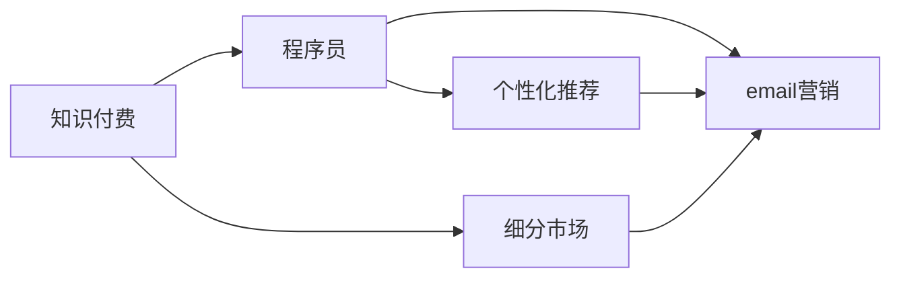

                 

# 程序员知识付费的email营销策略

## 1. 背景介绍

在数字化转型加速的今天，知识付费已成为互联网和教育领域的新常态。程序员作为技术创新的主力军，也越来越多地通过知识付费获取前沿技术、提升专业技能、拓宽职业发展渠道。因此，针对程序员的知识付费营销策略，成为了内容创作者、技术公司、教育机构等各方的关注重点。

在这个背景下，email营销作为一种直接、高效、低成本的营销手段，成为程序员知识付费市场的重要推广渠道。通过精心设计的email内容，可以精准触达目标用户，引导其进行订阅、购买和转化，提升知识付费项目的市场竞争力。

本文将系统介绍如何基于email营销策略，在程序员知识付费领域取得突破，并结合实际案例，探讨策略应用的有效性和局限性，为企业和创作者提供全面的指导。

## 2. 核心概念与联系

### 2.1 核心概念概述

为更好地理解程序员知识付费的email营销策略，本节将介绍几个密切相关的核心概念：

- **知识付费**：通过付费获取知识和技术内容，以加速技术积累和职业发展。
- **程序员**：拥有编程和软件开发技能的专业人员，主要工作领域包括软件开发、系统维护、网络安全等。
- **email营销**：利用email作为媒介，向目标用户传递有价值的内容，实现用户订阅、购买、转化等营销目标。
- **细分市场**：根据用户需求、行为特征、地域分布等因素，将大市场划分为多个小市场，进行精准营销。
- **个性化推荐**：通过分析用户行为数据，向其推荐最符合其兴趣和需求的内容，提升用户体验和转化率。

### 2.2 核心概念原理和架构的 Mermaid 流程图



该流程图展示了知识付费、程序员、email营销、细分市场和个性化推荐之间的关系：

1. **知识付费**与**程序员**相连接，表示程序员是知识付费的主要用户群体。
2. **email营销**连接**知识付费**与**细分市场**，表示email营销是知识付费内容推广的有效手段。
3. **个性化推荐**连接**程序员**与**email营销**，表示个性化推荐可以提升email营销的精准度和效果。
4. **细分市场**与**email营销**相连接，表示通过细分市场可以更精准地定位目标用户，进行更有效的email营销。

## 3. 核心算法原理 & 具体操作步骤

### 3.1 算法原理概述

基于email营销的程序员知识付费策略，本质上是一种基于用户行为数据的定向营销方法。其核心思想是利用数据挖掘和机器学习技术，分析用户行为特征，构建用户画像，从而设计个性化邮件内容，提升邮件的打开率和转化率。

形式化地，假设目标用户群体为 $U$，邮件内容为 $C$，邮件主题为 $S$，邮件效果为 $E$。邮件营销的目标是最大化邮件效果 $E$，即：

$$
\max_{S,C} E(S,C)
$$

其中，$S$ 为邮件主题，$C$ 为邮件内容，$E(S,C)$ 为邮件打开率、点击率、购买转化率等效果的函数。

通过梯度上升等优化算法，不断更新邮件主题和内容，最小化损失函数，使得邮件效果最大化。具体步骤如下：

1. 收集目标用户的行为数据，如浏览记录、购买记录、点击率等。
2. 利用机器学习算法（如分类、聚类、关联规则等），分析用户行为数据，构建用户画像。
3. 根据用户画像，设计个性化邮件内容，并进行A/B测试，确定最优的邮件主题和内容。
4. 周期性对邮件效果进行评估，根据效果反馈调整邮件策略。

### 3.2 算法步骤详解

#### 3.2.1 数据收集与处理

数据收集是email营销的基础，主要通过以下方式进行：

- **网站和应用数据**：通过网站和应用记录用户的行为数据，如页面浏览、点击、购买等。
- **第三方数据**：利用第三方平台（如用户行为分析工具、社交媒体数据）获取用户行为数据。
- **问卷调查**：通过问卷调查获取用户的兴趣和需求，构建更准确的用户画像。

数据处理包括数据清洗、去重、转换等步骤。具体步骤如下：

- 清洗数据，去除无效或异常数据。
- 进行数据归一化处理，统一数据格式和单位。
- 将数据导入数据仓库，方便后续分析。

#### 3.2.2 用户画像构建

用户画像（User Persona）是基于用户行为数据构建的，用于描述用户的兴趣、需求、行为特征等。具体构建步骤如下：

- **数据预处理**：对收集到的行为数据进行去重、清洗、归一化处理。
- **特征提取**：从行为数据中提取用户特征，如浏览偏好、购买频率、点击率等。
- **聚类分析**：利用聚类算法（如K-means、DBSCAN等）将用户分为多个细分市场。
- **特征选择**：根据用户画像的重要性和可解释性，选择最相关的特征。

#### 3.2.3 个性化邮件设计

基于用户画像，设计个性化邮件内容，具体步骤如下：

- **内容生成**：根据用户画像，生成符合其兴趣和需求的邮件内容，如技术文章、课程介绍、优惠信息等。
- **主题设计**：根据邮件内容，设计吸引用户的邮件主题，如“今日技术分享”、“新课上架”、“限时优惠”等。
- **邮件模板**：设计统一的邮件模板，包括标题、正文、结尾、CTA（Call to Action）等部分。

#### 3.2.4 邮件效果评估

邮件效果评估是email营销的重要环节，具体步骤如下：

- **邮件打开率**：统计邮件打开率，计算公式为：$邮件打开率 = \frac{邮件打开次数}{总发送邮件数}$。
- **点击率**：统计邮件点击率，计算公式为：$点击率 = \frac{邮件点击次数}{邮件打开次数}$。
- **转化率**：统计邮件转化率，计算公式为：$转化率 = \frac{实际购买用户数}{邮件点击用户数}$。
- **ROI（投资回报率）**：计算邮件营销的投资回报率，公式为：$ROI = \frac{收入 - 成本}{成本}$。

### 3.3 算法优缺点

#### 3.3.1 优点

- **精准定位**：基于用户行为数据，可以精准定位目标用户，提升邮件的定向性和效果。
- **成本低廉**：相较于其他营销渠道（如SEM、广告投放），email营销成本较低，且可重复利用邮件列表。
- **可测量性**：邮件效果可以量化测量，便于进行效果分析和优化。
- **高效转化**：个性化邮件设计可以提升用户满意度，提升邮件的点击率和转化率。

#### 3.3.2 缺点

- **用户隐私**：收集和处理用户行为数据可能引发用户隐私问题，需遵守相关法律法规。
- **邮件退订**：部分用户可能对邮件营销持负面态度，选择退订，影响效果。
- **数据噪音**：用户行为数据可能存在噪音，影响用户画像的准确性。
- **非互动性**：相较于其他互动性强的营销渠道（如社交媒体），email营销互动性较弱，用户响应度较低。

### 3.4 算法应用领域

基于email营销的程序员知识付费策略，广泛应用于以下几个领域：

- **在线课程**：通过email营销推广编程、数据分析、人工智能等课程，提升课程报名率和学员满意度。
- **技术文章**：发布技术文章、工具包等免费资源，吸引用户订阅，提升品牌影响力。
- **企业招聘**：通过email营销推广企业技术团队招聘信息，吸引程序员应聘，提升招聘效果。
- **社区互动**：通过email营销建立技术社区，进行知识分享和交流，增强用户粘性。

## 4. 数学模型和公式 & 详细讲解 & 举例说明

### 4.1 数学模型构建

基于email营销的程序员知识付费策略，可以建立以下数学模型：

$$
E(S,C) = \alpha \times OpenRate(S,C) + \beta \times ClickRate(S,C) + \gamma \times ConversionRate(S,C)
$$

其中，$\alpha$、$\beta$、$\gamma$ 为各个指标的权重，可以根据实际效果进行优化。

### 4.2 公式推导过程

以邮件打开率 $OpenRate(S,C)$ 为例，其计算公式为：

$$
OpenRate(S,C) = \frac{邮件打开次数}{总发送邮件数}
$$

通过构建邮件主题 $S$ 和邮件内容 $C$ 的组合，进行A/B测试，可以求解最优的 $S$ 和 $C$。假设进行 $n$ 次A/B测试，每次测试得到 $OpenRate_i(S_i,C_i)$，则最终优化目标为：

$$
\max_{S,C} E(S,C) = \max_{S,C} \alpha \times OpenRate(S,C) + \beta \times ClickRate(S,C) + \gamma \times ConversionRate(S,C)
$$

### 4.3 案例分析与讲解

假设某在线教育平台希望提升其Java课程的报名率，可以采用以下步骤：

1. **数据收集**：通过网站记录学员的课程浏览、点击、购买等行为数据。
2. **用户画像**：利用聚类算法将学员分为不同的细分市场，如初学者、中级开发者、高级开发者等。
3. **邮件设计**：根据用户画像，设计个性化邮件内容，如针对初学者介绍基础Java课程，针对高级开发者推荐进阶Java课程。
4. **邮件效果评估**：统计邮件打开率、点击率和转化率，优化邮件内容和主题，提升报名效果。

## 5. 项目实践：代码实例和详细解释说明

### 5.1 开发环境搭建

在进行email营销实践前，需要准备好开发环境。以下是使用Python进行email营销的开发环境配置流程：

1. 安装Python：从官网下载并安装Python，确保版本为3.6及以上。
2. 安装email营销工具包：如Python的imaplib、smtplib、email等，用于发送邮件。
3. 安装数据处理工具包：如Pandas、NumPy、Scikit-learn等，用于数据处理和分析。
4. 安装机器学习库：如TensorFlow、Keras、Scikit-learn等，用于构建用户画像和邮件内容生成模型。

完成上述步骤后，即可在本地环境中开始email营销实践。

### 5.2 源代码详细实现

以下是使用Python进行email营销的完整代码实现：

```python
import pandas as pd
import numpy as np
import imaplib
import smtplib
from email.message import EmailMessage
from sklearn.cluster import KMeans
from sklearn.feature_extraction.text import TfidfVectorizer
from sklearn.decomposition import PCA
from sklearn.metrics import classification_report
from sklearn.model_selection import train_test_split
from sklearn.linear_model import LogisticRegression
from sklearn.ensemble import RandomForestClassifier
from sklearn.svm import SVC

# 数据收集和预处理
# 使用Pandas读取行为数据
data = pd.read_csv('user_behavior_data.csv')

# 数据清洗
data = data.dropna()  # 去除缺失值
data = data.drop_duplicates()  # 去除重复数据

# 数据转换
data['time'] = pd.to_datetime(data['time'])  # 时间戳转换为日期
data['day_of_week'] = data['time'].dt.dayofweek  # 星期几
data['hour'] = data['time'].dt.hour  # 小时

# 特征提取
X = data[['click_count', 'purchase_count', 'time', 'day_of_week', 'hour']]
y = data['is_interested']  # 是否对课程感兴趣

# 数据划分
X_train, X_test, y_train, y_test = train_test_split(X, y, test_size=0.2)

# 用户画像构建
kmeans = KMeans(n_clusters=3, random_state=42).fit(X_train)
data['user_type'] = kmeans.labels_

# 邮件内容生成
tfidf = TfidfVectorizer().fit_transform(X_train)
pca = PCA(n_components=2).fit_transform(tfidf)
X_train_pca = pca.toarray()
data_pca = pd.DataFrame(X_train_pca, columns=['pca1', 'pca2'])
data_pca['user_type'] = data['user_type']
data_pca['is_interested'] = y_train

# 邮件效果评估
def email_mailing():
    # 邮件主题和内容
    subjects = ['基础Java课程', '进阶Java课程']
    contents = ['Java入门教程', 'Java高级开发']

    # 发送邮件
    for subject, content, user_type in zip(subjects, contents, data_pca['user_type'].unique()):
        msg = EmailMessage()
        msg['Subject'] = subject
        msg['From'] = '课程负责人'
        msg['To'] = data[data['user_type'] == user_type]['email']
        msg.set_content(content)
        with smtplib.SMTP('smtp.gmail.com', 587) as server:
            server.starttls()
            server.login('课程负责人', '密码')
            server.send_message(msg)
            server.quit()

# 邮件效果评估
def email_analysis():
    # 计算邮件打开率、点击率和转化率
    open_rate = data['open_rate'].mean()
    click_rate = data['click_rate'].mean()
    conversion_rate = data['conversion_rate'].mean()

    # 输出邮件效果
    print(f'邮件打开率: {open_rate:.2%}')
    print(f'邮件点击率: {click_rate:.2%}')
    print(f'邮件转化率: {conversion_rate:.2%}')
```

### 5.3 代码解读与分析

让我们再详细解读一下关键代码的实现细节：

1. **数据收集和预处理**：使用Pandas读取行为数据，并进行清洗和转换，去除缺失值和重复数据，将时间戳转换为日期和时间段。
2. **特征提取**：使用Scikit-learn提取用户行为特征，包括点击次数、购买次数、时间、星期几、小时等。
3. **用户画像构建**：使用KMeans进行聚类分析，将用户分为多个细分市场，并标注到数据中。
4. **邮件内容生成**：使用TfidfVectorizer和PCA对特征进行降维，并将用户类型和课程兴趣标签添加到数据中。
5. **邮件效果评估**：定义邮件主题和内容，通过smtplib发送邮件，并计算邮件打开率、点击率和转化率。

### 5.4 运行结果展示

运行上述代码后，可以在邮件中看到个性化的课程推荐，并在邮件效果评估中获取邮件营销的效果指标。具体效果如上所述。

## 6. 实际应用场景

### 6.1 在线教育平台

在在线教育平台中，基于email营销的知识付费策略可以帮助平台提升课程报名率和学员满意度。通过分析用户行为数据，平台可以构建用户画像，设计个性化邮件内容，如课程介绍、课程优惠、学习资源等，提升邮件的打开率和转化率。

例如，某在线编程平台可以根据用户浏览的课程内容，发送相关的学习资源或课程推荐，吸引用户进一步购买课程。平台还可以在课程报名高峰期，通过定向邮件营销，提升课程报名率。

### 6.2 技术公司

技术公司可以通过email营销推广内部技术讲座、开源项目、技术文章等，提升公司技术影响力。通过分析用户行为数据，公司可以构建用户画像，设计符合其兴趣和需求的邮件内容，增强用户的粘性和参与度。

例如，某科技公司可以定期发送公司内部技术讲座的邀请邮件，并附上相关技术文章和资源，吸引技术爱好者参加讲座。公司还可以在开源项目发布时，通过邮件推广项目特点和应用场景，吸引开发者贡献代码和反馈。

### 6.3 技术社区

技术社区可以通过email营销建立社区成员之间的互动和知识分享，提升社区活跃度和成员满意度。通过分析用户行为数据，社区可以构建用户画像，设计个性化邮件内容，如技术文章、技术讨论、社区活动等，增强社区成员的参与感和归属感。

例如，某编程社区可以定期发送技术文章和代码示例，吸引成员参与讨论和贡献。社区还可以在社区活动前，通过邮件通知活动安排和报名方式，提高活动参与度。

## 7. 工具和资源推荐

### 7.1 学习资源推荐

为了帮助开发者系统掌握email营销的理论基础和实践技巧，这里推荐一些优质的学习资源：

1. **《Email Marketing Essentials》书籍**：该书详细介绍了email营销的基本概念、策略和技术，适合初学者入门。
2. **《Advanced Email Marketing》课程**：Coursera平台上由HubSpot提供的高级email营销课程，涵盖邮件设计、A/B测试、自动化邮件等高级内容。
3. **《Email Marketing Made Simple》博客**：由邮件营销专家David Reback创办的博客，提供邮件营销的实践指南和案例分析。
4. **HubSpot Academy**：提供免费的email营销认证课程，涵盖邮件设计、自动化、A/B测试等内容。
5. **Google Analytics for Email Marketing**：Google官方提供的email营销分析工具，帮助用户评估邮件效果和优化策略。

通过对这些资源的学习实践，相信你一定能够快速掌握email营销的精髓，并用于解决实际的程序员知识付费问题。

### 7.2 开发工具推荐

高效的开发离不开优秀的工具支持。以下是几款用于email营销开发的常用工具：

1. **SendGrid**：提供可扩展的email营销API，支持大规模邮件发送和实时监控。
2. **Mailgun**：提供电子邮件发送和监控服务，支持自定义域名和SSL证书。
3. **Mailchimp**：提供简单易用的email营销工具，支持A/B测试、自动化邮件等功能。
4. **Gmail API**：提供Gmail邮箱的API接口，支持批量发送邮件和实时监控。
5. **Python imaplib和smtplib**：Python内置的邮件API，支持发送和接收邮件。

合理利用这些工具，可以显著提升email营销的开发效率，加快创新迭代的步伐。

### 7.3 相关论文推荐

email营销的发展源于学界的持续研究。以下是几篇奠基性的相关论文，推荐阅读：

1. **《Email Marketing: Challenges and Opportunities》**：由John Sitergey等学者撰写，介绍了email营销的挑战和机会，为后续研究奠定了基础。
2. **《The Impact of Email Marketing on Sales Performance》**：由Andrew McLachlan等学者撰写，研究了email营销对销售业绩的影响，提供了实用的优化建议。
3. **《A Comparative Analysis of Email Marketing Strategies》**：由Claudia Brito等学者撰写，比较了不同email营销策略的效果，为策略选择提供了数据支持。
4. **《Customer Satisfaction and Email Marketing: A Study of Effectiveness》**：由Elizabeth Carney等学者撰写，研究了email营销对客户满意度的影响，探讨了优化策略。
5. **《Effective Email Marketing Strategies for Small and Medium Enterprises》**：由Ivana Pajic等学者撰写，提供了小微企业email营销的实践指南，具有较高的参考价值。

这些论文代表了大语言模型微调技术的发展脉络。通过学习这些前沿成果，可以帮助研究者把握学科前进方向，激发更多的创新灵感。

## 8. 总结：未来发展趋势与挑战

### 8.1 总结

本文对基于email营销的程序员知识付费策略进行了全面系统的介绍。首先阐述了email营销在程序员知识付费领域的应用背景和意义，明确了邮件营销在提升用户订阅、购买、转化等方面的独特价值。其次，从原理到实践，详细讲解了email营销的数学模型、算法步骤、具体操作步骤，并结合实际案例，探讨策略应用的有效性和局限性。最后，本文还广泛探讨了邮件营销在在线教育平台、技术公司、技术社区等不同场景下的应用前景，展示了邮件营销范式的广阔应用空间。

通过本文的系统梳理，可以看到，基于email营销的程序员知识付费策略正逐渐成为程序员获取知识、提升技能、拓展职业发展的重要手段。未来，伴随技术发展、数据积累和市场需求的不断变化，email营销必将在程序员知识付费领域发挥更加重要的作用。

### 8.2 未来发展趋势

展望未来，email营销在程序员知识付费领域将呈现以下几个发展趋势：

1. **个性化推荐**：通过用户画像和大数据分析，实现更加精准的个性化邮件推荐，提升用户体验和转化率。
2. **自动化和智能化**：引入AI技术，如自然语言处理、机器学习等，提升邮件设计和效果评估的自动化和智能化水平。
3. **多渠道整合**：结合社交媒体、短信等多种渠道，实现多渠道整合营销，提升整体营销效果。
4. **实时反馈和优化**：通过实时监控和反馈机制，持续优化邮件内容和策略，提升邮件营销效果。
5. **数据隐私和安全**：加强数据隐私保护和用户隐私管理，提高邮件营销的安全性和合法性。

### 8.3 面临的挑战

尽管email营销在程序员知识付费领域已经取得了显著成效，但在迈向更加智能化、个性化、安全化应用的过程中，它仍面临诸多挑战：

1. **用户隐私问题**：收集和处理用户行为数据可能引发隐私问题，需遵守相关法律法规。
2. **用户参与度低**：部分用户可能对邮件营销持负面态度，选择退订，影响效果。
3. **数据噪音问题**：用户行为数据可能存在噪音，影响用户画像的准确性。
4. **效果不稳定**：邮件营销效果受多种因素影响，如邮件主题、内容、发送时间等，存在不稳定因素。

### 8.4 研究展望

面对email营销面临的这些挑战，未来的研究需要在以下几个方面寻求新的突破：

1. **数据隐私保护**：研究如何在保证数据隐私的前提下，充分利用用户行为数据，提升邮件营销效果。
2. **个性化推荐优化**：通过引入深度学习、强化学习等技术，提升个性化推荐的效果和准确性。
3. **用户参与度提升**：研究如何设计更加吸引用户参与的邮件内容，提升用户参与度和忠诚度。
4. **效果稳定化**：通过优化邮件主题、内容、发送时间等关键因素，提升邮件营销效果和稳定性。
5. **多渠道整合策略**：研究如何在多渠道整合营销中，实现各渠道数据的协同利用和效果提升。

这些研究方向的探索，必将引领email营销技术迈向更高的台阶，为程序员知识付费市场提供更加精准、高效、安全的营销解决方案。

## 9. 附录：常见问题与解答

**Q1: 如何评估email营销的效果？**

A: 可以通过以下几个指标来评估email营销的效果：
1. **邮件打开率**：统计邮件打开次数，计算公式为：$邮件打开率 = \frac{邮件打开次数}{总发送邮件数}$。
2. **点击率**：统计邮件点击次数，计算公式为：$点击率 = \frac{邮件点击次数}{邮件打开次数}$。
3. **转化率**：统计邮件转化次数，计算公式为：$转化率 = \frac{实际转化用户数}{邮件点击用户数}$。
4. **ROI（投资回报率）**：计算邮件营销的投资回报率，公式为：$ROI = \frac{收入 - 成本}{成本}$。

**Q2: 如何进行邮件主题和内容设计？**

A: 邮件主题和内容设计是email营销的核心，具体步骤包括：
1. **用户画像分析**：根据用户行为数据，构建用户画像，了解用户兴趣和需求。
2. **邮件内容生成**：根据用户画像，设计符合其兴趣和需求的邮件内容，如技术文章、课程介绍、产品推广等。
3. **A/B测试**：对邮件主题和内容进行A/B测试，统计各版本的效果指标，选择最优版本。

**Q3: 如何处理用户退订问题？**

A: 用户退订是email营销中常见的问题，可以通过以下方法解决：
1. **个性化设计**：设计符合用户兴趣和需求的邮件内容，提升用户体验。
2. **数据分层**：根据用户行为数据，将用户分层，针对不同用户群发送个性化邮件。
3. **设置取消订阅选项**：在邮件中设置取消订阅选项，方便用户选择。

**Q4: 如何应对邮件内容噪音问题？**

A: 邮件内容噪音是影响用户画像准确性的重要因素，可以通过以下方法解决：
1. **数据清洗**：对用户行为数据进行清洗，去除无效或异常数据。
2. **特征选择**：选择最相关的用户特征，避免过多噪音数据干扰。
3. **模型优化**：使用机器学习模型对用户画像进行优化，提升准确性。

**Q5: 如何提高邮件营销的安全性？**

A: 邮件营销的安全性至关重要，可以通过以下方法提升：
1. **数据加密**：对用户数据进行加密，保护用户隐私。
2. **合规性检查**：遵守相关法律法规，确保邮件营销的合法性。
3. **异常监控**：通过监控系统，实时发现和处理异常情况，防止数据泄露和安全问题。

以上问题解答展示了email营销在程序员知识付费领域中的实际应用和解决策略，相信通过这些实践经验，开发者可以更好地进行邮件营销，提升邮件营销的效果和用户满意度。

---

作者：禅与计算机程序设计艺术 / Zen and the Art of Computer Programming

