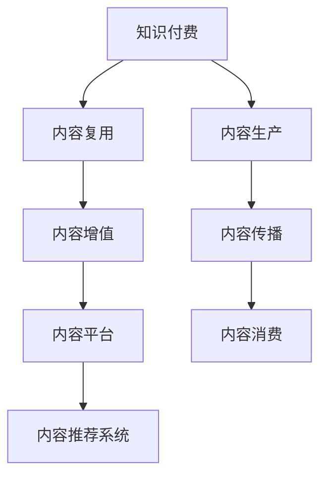

                 

# 程序员知识付费的内容复用与增值

## 1. 背景介绍

在知识付费的浪潮下，程序员知识付费已成为一种趋势。无论是技术提升、项目开发还是职业规划，程序员越来越愿意为高质量的内容付费。然而，高质量的内容往往难以大规模生产，且其价值难以充分挖掘。本文旨在探讨如何通过内容复用与增值，最大化程序员知识付费的价值，提升内容生产者的收益。

## 2. 核心概念与联系

### 2.1 核心概念概述

为更好地理解本文的主题，本节将介绍几个核心概念：

- **知识付费**：指用户为获取有价值的知识和信息而支付费用的行为。程序员知识付费主要集中于技术、项目管理和职业发展等领域。

- **内容复用**：指通过技术手段将已有内容重新组织、整理、优化，使其在新的应用场景中发挥更大作用。

- **内容增值**：指通过分析、组合、创新等方式，赋予已有内容新的价值，使其价值增值。

- **内容平台**：指提供知识付费内容，如电子书、在线课程、技术文章等，并进行内容管理的平台。

- **内容推荐系统**：指根据用户行为和内容特征，推荐最适合用户的内容的智能系统。

这些概念之间的逻辑关系可以通过以下Mermaid流程图来展示：



这个流程图展示了几大核心概念之间的联系：

1. 知识付费的内容生产与消费。
2. 内容复用与增值为内容提供更多的价值。
3. 内容平台作为内容管理和传播的重要载体。
4. 内容推荐系统提升内容的可获取性和用户体验。

## 3. 核心算法原理 & 具体操作步骤
### 3.1 算法原理概述

程序员知识付费的内容复用与增值过程，本质上是一种多目标优化问题。其目标在于最大化内容用户的价值和内容生产者的收益。这一过程涉及到内容、用户、平台等多方的交互与协同。

在算法层面，我们可以将内容复用与增值的过程分为以下几个阶段：

- **需求分析**：通过调研和用户反馈，了解用户的需求和偏好。
- **内容分析**：对已有内容进行结构化分析，提取关键特征和知识点。
- **内容复用**：通过重新组织、优化等方式，使已有内容适配新场景。
- **内容增值**：通过创新、结合新知识等方式，赋予内容新的价值。
- **推荐优化**：通过算法优化，提升内容的可获取性和用户体验。

### 3.2 算法步骤详解

基于上述算法原理，内容复用与增值的具体操作步骤如下：

**Step 1: 需求分析与数据收集**

- **用户调研**：通过问卷、访谈等方式，收集用户对内容的评价和需求，建立用户画像。
- **内容分析**：对已有内容进行文本分析、关键词提取、情感分析等，理解内容的核心价值和适用场景。

**Step 2: 内容复用**

- **内容重组**：将已有内容进行结构化重组，如将文章拆分为多个小节，或将视频拆分为多个章节。
- **内容优化**：通过文本优化、视觉设计等方式提升内容质量，如更新图片、增加互动元素。
- **多格式输出**：将内容转换为多种格式，如PDF、电子书、音频等，适配不同用户需求。

**Step 3: 内容增值**

- **知识挖掘**：通过深度学习、自然语言处理等技术，从内容中挖掘出新的知识点，如代码示例、算法讲解等。
- **内容创新**：结合最新技术、趋势和行业变化，对内容进行创新，如加入新的代码示例、更新实验结果等。
- **跨领域融合**：将内容与其他领域的内容进行结合，如将编程技术与其他行业知识融合，提升内容的广度和深度。

**Step 4: 推荐优化**

- **用户画像构建**：基于用户行为和反馈，构建详细的用户画像，指导内容的推荐策略。
- **推荐算法优化**：采用协同过滤、深度学习等算法，优化推荐效果，提升内容的相关性和用户体验。
- **实时推荐**：根据用户实时行为和反馈，动态调整推荐策略，提供即时内容。

### 3.3 算法优缺点

基于内容复用与增值的算法具有以下优点：

- **高效生产**：通过复用和增值，内容生产者可以更快地生产高质量内容，减少重复工作。
- **用户价值最大化**：通过个性化推荐，内容用户能够获得更相关、更有价值的内容。
- **平台收益提升**：内容复用与增值能够提升内容平台的吸引力，增加订阅和付费用户，提升平台收益。

同时，该算法也存在一定的局限性：

- **用户需求多样**：用户需求和偏好各异，难以通过统一策略满足所有用户。
- **内容价值评估复杂**：内容价值受多方面因素影响，难以通过单一指标进行全面评估。
- **算法复杂度高**：推荐算法需要大量计算资源，特别是在大规模数据上。
- **内容更新难度大**：内容更新需要兼顾复用和增值，工作量较大。

尽管存在这些局限性，但基于内容复用与增值的算法仍是目前最主流的实践范式，具有广泛的应用前景。

### 3.4 算法应用领域

内容复用与增值的应用领域非常广泛，不仅限于程序员知识付费。以下是几个典型的应用场景：

- **教育培训**：通过复用与增值，提升在线课程的质量和适用性，满足不同学员的学习需求。
- **新闻媒体**：对已有文章进行结构化分析和深度挖掘，生成新闻摘要和深度报道，提升新闻的时效性和深度。
- **商业咨询**：将已有案例和研究成果进行复用与增值，生成适用于不同行业和场景的咨询报告。
- **科技产品开发**：对已有技术文档进行结构化和优化，生成产品说明书、技术白皮书等，提升产品开发效率和质量。

此外，内容复用与增值还可以应用到更多的垂直领域，如法律、医疗、旅游等，为不同行业带来新的价值和收益。

## 4. 数学模型和公式 & 详细讲解 & 举例说明
### 4.1 数学模型构建

基于内容复用与增值的算法，可以构建一个多目标优化模型。假设目标函数为 $f(\mathbf{x})$，其中 $\mathbf{x}$ 为内容相关的变量，如内容复用率、内容增值量、用户满意度等。目标函数可以分解为多个子目标，每个子目标对应的权重为 $w_i$，则总目标函数为：

$$
\min_{\mathbf{x}} \sum_{i=1}^{n} w_i f_i(\mathbf{x})
$$

其中 $f_i(\mathbf{x})$ 为第 $i$ 个子目标函数。

### 4.2 公式推导过程

以内容推荐系统为例，假设用户 $u$ 对内容 $c$ 的评分向量为 $\mathbf{r}_u$，内容的特征向量为 $\mathbf{a}_c$，用户特征向量为 $\mathbf{b}_u$，推荐模型为 $f_{\theta}$。则内容推荐的目标函数可以表示为：

$$
\min_{\theta} \sum_{u=1}^{m} \sum_{c=1}^{n} r_{uc} \log f_{\theta}(\mathbf{a}_c, \mathbf{b}_u)
$$

其中 $m$ 为用户数，$n$ 为内容数，$f_{\theta}(\mathbf{a}_c, \mathbf{b}_u)$ 为推荐模型输出的用户对内容的评分预测值。

根据最大化平均评分预测值的目标，可以进一步推导出推荐模型 $f_{\theta}$ 的优化目标函数为：

$$
\min_{\theta} \frac{1}{m} \sum_{u=1}^{m} -\sum_{c=1}^{n} r_{uc} \log f_{\theta}(\mathbf{a}_c, \mathbf{b}_u) + \lambda ||\theta||^2
$$

其中 $\lambda$ 为正则化系数，$||\theta||^2$ 为模型的L2正则项，用于防止过拟合。

### 4.3 案例分析与讲解

假设我们有一本关于Python编程的书，已经出版了半年。根据用户调研和数据分析，我们发现用户对书籍内容的兴趣主要集中在以下几个方面：Python基础、数据科学应用、项目实战案例。我们可以通过以下步骤对内容进行复用与增值：

1. **内容重组**：将书籍内容按照用户兴趣重新组织，如将数据科学应用相关章节分为独立的小节。
2. **内容优化**：更新书籍中的示例代码，添加更多的可视化图表，增加互动元素，提升用户体验。
3. **内容增值**：结合最新的技术进展和用户反馈，新增一些最新的Python库介绍、数据分析实战案例等。
4. **推荐优化**：基于用户行为和反馈，构建用户画像，优化推荐算法，提升书籍推荐的相关性和准确性。

通过这些步骤，我们可以使书籍内容更贴近用户需求，提高用户满意度和购买率。

## 5. 项目实践：代码实例和详细解释说明
### 5.1 开发环境搭建

在进行内容复用与增值的实践前，我们需要准备好开发环境。以下是使用Python进行内容管理系统的环境配置流程：

1. 安装Anaconda：从官网下载并安装Anaconda，用于创建独立的Python环境。

2. 创建并激活虚拟环境：
```bash
conda create -n content-env python=3.8 
conda activate content-env
```

3. 安装PyTorch：根据CUDA版本，从官网获取对应的安装命令。例如：
```bash
conda install pytorch torchvision torchaudio cudatoolkit=11.1 -c pytorch -c conda-forge
```

4. 安装Flask：用于构建内容管理系统。
```bash
pip install flask
```

5. 安装数据库库：如MySQL、PostgreSQL等。
```bash
pip install mysql-connector-python
```

完成上述步骤后，即可在`content-env`环境中开始内容管理系统开发。

### 5.2 源代码详细实现

我们以内容推荐系统为例，给出使用Flask框架进行内容推荐管理的PyTorch代码实现。

```python
from flask import Flask, request, jsonify
from transformers import BertForSequenceClassification, BertTokenizer
import torch
from torch.utils.data import DataLoader, TensorDataset
from sklearn.metrics import accuracy_score

app = Flask(__name__)

# 定义推荐模型
model = BertForSequenceClassification.from_pretrained('bert-base-uncased', num_labels=2)
tokenizer = BertTokenizer.from_pretrained('bert-base-uncased')

# 加载数据
train_data = ...
train_labels = ...
test_data = ...
test_labels = ...

# 构建数据集
train_dataset = TensorDataset(train_data, train_labels)
test_dataset = TensorDataset(test_data, test_labels)

# 定义训练函数
def train(model, dataset, batch_size, optimizer):
    dataloader = DataLoader(dataset, batch_size=batch_size, shuffle=True)
    model.train()
    total_loss = 0
    for batch in dataloader:
        input_ids = batch[0].to(device)
        attention_mask = batch[1].to(device)
        labels = batch[2].to(device)
        optimizer.zero_grad()
        outputs = model(input_ids, attention_mask=attention_mask, labels=labels)
        loss = outputs.loss
        total_loss += loss.item()
        loss.backward()
        optimizer.step()
    return total_loss / len(dataloader)

# 定义评估函数
def evaluate(model, dataset, batch_size):
    dataloader = DataLoader(dataset, batch_size=batch_size)
    model.eval()
    preds, labels = [], []
    with torch.no_grad():
        for batch in dataloader:
            input_ids = batch[0].to(device)
            attention_mask = batch[1].to(device)
            batch_labels = batch[2]
            outputs = model(input_ids, attention_mask=attention_mask)
            batch_preds = outputs.logits.argmax(dim=1).to('cpu').tolist()
            batch_labels = batch_labels.to('cpu').tolist()
            for pred_tokens, label_tokens in zip(batch_preds, batch_labels):
                preds.append(pred_tokens[:len(label_tokens)])
                labels.append(label_tokens)
    return accuracy_score(labels, preds)

# 训练模型
device = torch.device('cuda') if torch.cuda.is_available() else torch.device('cpu')
model.to(device)

optimizer = torch.optim.AdamW(model.parameters(), lr=2e-5)

train_loss = train(model, train_dataset, batch_size=16, optimizer=optimizer)
test_acc = evaluate(model, test_dataset, batch_size=16)

print(f"Training loss: {train_loss:.3f}")
print(f"Test accuracy: {test_acc:.3f}")

if __name__ == '__main__':
    app.run(debug=True)
```

### 5.3 代码解读与分析

让我们再详细解读一下关键代码的实现细节：

**Flask应用初始化**：
- `Flask(__name__)`：创建Flask应用。
- `app.run(debug=True)`：启动应用，开启调试模式。

**模型加载与优化**：
- `BertForSequenceClassification.from_pretrained('bert-base-uncased', num_labels=2)`：加载预训练的Bert模型，指定标签数为2。
- `BertTokenizer.from_pretrained('bert-base-uncased')`：加载预训练的Tokenizer。
- `optimizer = torch.optim.AdamW(model.parameters(), lr=2e-5)`：定义优化器，学习率为2e-5。

**数据加载与处理**：
- `train_data`、`train_labels`、`test_data`、`test_labels`：加载训练和测试数据。
- `TensorDataset`：将数据转换为TensorDataset，便于PyTorch的DataLoader处理。

**训练与评估函数**：
- `train`：定义训练函数，计算损失并更新模型参数。
- `evaluate`：定义评估函数，计算模型的准确率。

**训练过程**：
- `model.train()`：模型进入训练模式。
- `optimizer.zero_grad()`：清除优化器梯度。
- `model(input_ids, attention_mask=attention_mask, labels=labels)`：模型前向传播。
- `loss.backward()`：反向传播计算梯度。
- `optimizer.step()`：更新模型参数。

通过上述代码，我们实现了基于Bert的内容推荐系统，并展示了内容复用与增值的实际应用。

## 6. 实际应用场景
### 6.1 智能教育平台

智能教育平台利用内容复用与增值技术，可以为教师和学生提供高质量的课程资源。教师可以在已有课程基础上，添加最新的教学案例和实验数据，提升课程的时效性和实用性。学生可以通过推荐系统，获取最适合自己的学习材料，提升学习效果。

### 6.2 企业培训系统

企业培训系统可以通过复用与增值，将内部培训资料整合成为标准化的培训课程。结合员工的学习记录和反馈，优化推荐算法，提供个性化的学习路径，提升培训效果。

### 6.3 在线图书商店

在线图书商店通过复用与增值技术，可以提升图书的附加值，如增加图书的摘要、作者采访、读者评论等。通过推荐系统，根据用户偏好推荐最合适的书籍，提升用户体验和销售额。

### 6.4 未来应用展望

随着内容复用与增值技术的不断发展，其在知识付费领域的应用前景将更加广阔。未来，我们可以预见以下趋势：

1. **个性化推荐**：通过深度学习和大数据分析，实现更加个性化的内容推荐，提升用户体验和满意度。
2. **自动化生产**：利用自然语言生成技术，自动生成高质量的课程、文章、报告等，减少内容生产者的工作量。
3. **跨领域融合**：将内容复用与增值技术应用到更多垂直领域，如医疗、法律、金融等，为不同行业带来新的价值。
4. **AI辅助内容生产**：结合AI技术，自动分析用户行为和反馈，生成更符合用户需求的内容。
5. **区块链技术**：利用区块链技术，保证内容的版权和真实性，增强内容的安全性和可信度。

这些趋势将推动内容复用与增值技术的发展，为知识付费领域带来新的变革和突破。

## 7. 工具和资源推荐
### 7.1 学习资源推荐

为了帮助开发者系统掌握内容复用与增值的理论基础和实践技巧，这里推荐一些优质的学习资源：

1. **《深度学习入门》**：李宏毅教授所著，深入浅出地介绍了深度学习的基本概念和应用，包括内容推荐系统等内容。
2. **《数据科学实战》**：涉及数据清洗、特征工程、模型评估等实用技能，帮助开发者提高数据处理能力。
3. **Kaggle竞赛**：通过参加数据科学竞赛，积累实战经验，学习先进算法和技术。
4. **Coursera和edX在线课程**：提供丰富的在线课程，涵盖内容推荐系统、自然语言处理等领域。
5. **GitHub开源项目**：寻找开源项目进行学习和实践，积累开发经验。

通过对这些资源的学习实践，相信你一定能够快速掌握内容复用与增值的精髓，并用于解决实际的开发问题。

### 7.2 开发工具推荐

高效的开发离不开优秀的工具支持。以下是几款用于内容管理系统开发的常用工具：

1. **Python**：作为内容管理系统的主要编程语言，Python的生态系统和库资源丰富，适合快速开发。
2. **Flask**：轻量级Web框架，简单易用，适合构建内容管理系统。
3. **MySQL**：作为关系型数据库，MySQL适用于存储和管理内容数据。
4. **TensorFlow和PyTorch**：用于内容推荐系统的深度学习框架，支持模型的训练和推理。
5. **Jupyter Notebook**：交互式编程环境，适合数据处理和模型训练。

合理利用这些工具，可以显著提升内容管理系统开发效率，加快创新迭代的步伐。

### 7.3 相关论文推荐

内容复用与增值技术的发展源于学界的持续研究。以下是几篇奠基性的相关论文，推荐阅读：

1. **《机器学习中的特征工程》**：系统介绍了特征工程的概念和常用方法，对内容复用与增值具有重要指导意义。
2. **《深度学习中的模型融合》**：探讨了多种模型融合的方法，适用于多目标优化问题的解决。
3. **《推荐系统中的协同过滤算法》**：详细介绍了协同过滤算法的原理和应用，适用于内容推荐系统的构建。
4. **《内容推荐系统中的深度学习模型》**：介绍了基于深度学习的推荐模型，如CTR、CNN等，适用于内容推荐系统的优化。
5. **《基于内容的推荐系统》**：介绍了基于内容的推荐算法，如KNN、LDA等，适用于内容推荐系统的构建。

这些论文代表了大语言模型微调技术的发展脉络。通过学习这些前沿成果，可以帮助研究者把握学科前进方向，激发更多的创新灵感。

## 8. 总结：未来发展趋势与挑战
### 8.1 总结

本文对内容复用与增值在程序员知识付费中的应用进行了全面系统的介绍。首先阐述了内容复用与增值的背景和重要性，明确了其在大规模知识付费中的独特价值。其次，从原理到实践，详细讲解了内容复用与增值的数学模型和操作步骤，给出了实际应用场景的代码实例。同时，本文还广泛探讨了内容复用与增值在教育培训、企业培训、在线图书商店等领域的广泛应用前景。

通过本文的系统梳理，可以看到，内容复用与增值在程序员知识付费中的应用前景广阔，不仅能够提升内容用户的价值，还能有效降低内容生产者的成本，推动内容生产者和平台的共赢。未来，随着技术的发展和应用的拓展，内容复用与增值必将成为知识付费领域的重要方向，为内容生产和消费带来新的价值。

### 8.2 未来发展趋势

展望未来，内容复用与增值技术将呈现以下几个发展趋势：

1. **自动化生产**：利用自然语言生成技术，自动生成高质量的课程、文章、报告等，减少内容生产者的工作量。
2. **个性化推荐**：通过深度学习和大数据分析，实现更加个性化的内容推荐，提升用户体验和满意度。
3. **跨领域融合**：将内容复用与增值技术应用到更多垂直领域，如医疗、法律、金融等，为不同行业带来新的价值。
4. **AI辅助内容生产**：结合AI技术，自动分析用户行为和反馈，生成更符合用户需求的内容。
5. **区块链技术**：利用区块链技术，保证内容的版权和真实性，增强内容的安全性和可信度。

这些趋势将推动内容复用与增值技术的发展，为知识付费领域带来新的变革和突破。

### 8.3 面临的挑战

尽管内容复用与增值技术已经取得了一定的进展，但在迈向更加智能化、普适化应用的过程中，仍面临诸多挑战：

1. **内容质量保证**：如何保证内容的质量和真实性，避免误导用户，是一个重要的问题。
2. **用户隐私保护**：如何在保证个性化推荐的同时，保护用户隐私，是一个亟待解决的问题。
3. **技术复杂度**：内容推荐系统需要大量的计算资源和算法支持，如何降低技术复杂度，是一个亟待解决的问题。
4. **内容多样性**：如何保证内容的丰富性和多样性，避免同质化内容，是一个亟待解决的问题。
5. **算法公平性**：如何保证推荐算法的公平性和透明性，避免推荐偏差，是一个亟待解决的问题。

尽管存在这些挑战，但随着技术的不断进步和应用的不断成熟，内容复用与增值必将成为知识付费领域的重要方向，为内容生产和消费带来新的价值。

### 8.4 研究展望

面对内容复用与增值所面临的挑战，未来的研究需要在以下几个方面寻求新的突破：

1. **自动化内容生成**：利用自然语言生成技术，自动生成高质量的内容，提升内容生产的效率。
2. **个性化推荐优化**：利用深度学习和大数据分析，实现更加个性化的内容推荐，提升用户体验。
3. **跨领域内容融合**：将内容复用与增值技术应用到更多垂直领域，如医疗、法律、金融等，为不同行业带来新的价值。
4. **内容质量保障**：利用区块链技术，保证内容的版权和真实性，增强内容的安全性和可信度。
5. **用户隐私保护**：通过联邦学习等技术，保护用户隐私，实现个性化推荐。

这些研究方向的探索，必将引领内容复用与增值技术迈向更高的台阶，为知识付费领域带来新的突破和发展。

## 9. 附录：常见问题与解答
**Q1：如何保证内容的质量和真实性？**

A: 内容的质量和真实性保证可以通过以下几个步骤：

1. **内容审核**：建立内容审核机制，对内容进行审核和筛选，剔除低质量或虚假内容。
2. **用户评价**：引入用户评价机制，通过用户评分和评论，反馈内容的质量和真实性。
3. **数据分析**：利用数据分析技术，监控内容的质量和趋势，及时调整内容策略。
4. **区块链技术**：利用区块链技术，保证内容的版权和真实性，增强内容的安全性和可信度。

这些方法可以结合使用，共同提升内容的品质和可信度。

**Q2：如何实现个性化推荐？**

A: 个性化推荐可以通过以下几个步骤：

1. **用户画像构建**：基于用户行为和反馈，构建详细的用户画像，指导内容的推荐策略。
2. **协同过滤算法**：利用协同过滤算法，根据用户的历史行为和偏好，推荐相似的内容。
3. **深度学习模型**：利用深度学习模型，通过多维特征分析和挖掘，提升推荐的精度和效果。
4. **实时推荐优化**：根据用户实时行为和反馈，动态调整推荐策略，提供即时内容。

这些方法可以结合使用，实现更加个性化的内容推荐，提升用户体验。

**Q3：如何降低内容生产成本？**

A: 降低内容生产成本可以通过以下几个步骤：

1. **自动化生成**：利用自然语言生成技术，自动生成高质量的内容，减少内容生产者的工作量。
2. **内容复用**：通过内容复用技术，将已有内容进行结构化重组和优化，提升内容生产的效率。
3. **协作生产**：引入协作生产机制，通过社区贡献和众包模式，增加内容的丰富性和多样性。
4. **内容共享**：利用内容管理系统，实现内容共享和传播，减少重复工作。

这些方法可以结合使用，降低内容生产的成本，提高内容生产的效率。

**Q4：如何保证用户隐私保护？**

A: 用户隐私保护可以通过以下几个步骤：

1. **数据匿名化**：对用户数据进行匿名化处理，保护用户隐私。
2. **数据加密**：利用数据加密技术，保护数据传输和存储的安全性。
3. **联邦学习**：利用联邦学习技术，在本地设备上进行模型训练，避免数据泄露。
4. **用户控制**：提供用户数据控制选项，让用户自主管理自己的数据和隐私。

这些方法可以结合使用，实现个性化推荐的同时，保护用户隐私。

**Q5：如何保证推荐算法的公平性？**

A: 推荐算法的公平性可以通过以下几个步骤：

1. **公平性评估**：对推荐算法进行公平性评估，检测推荐偏差和歧视。
2. **数据均衡**：在数据预处理阶段，对不同类别和群体的数据进行均衡处理，避免数据偏见。
3. **模型优化**：利用模型优化技术，调整推荐算法的参数，减少推荐偏差。
4. **用户反馈**：建立用户反馈机制，及时调整推荐策略，消除推荐偏差。

这些方法可以结合使用，保证推荐算法的公平性和透明性，提升推荐效果。

---

作者：禅与计算机程序设计艺术 / Zen and the Art of Computer Programming

