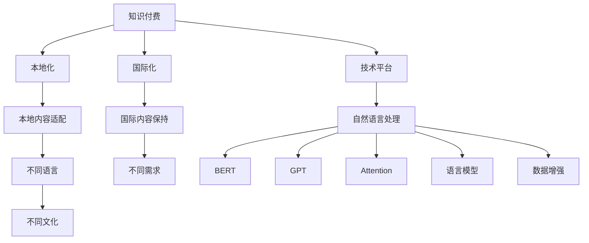

                 

# 程序员知识付费的内容本地化与国际化策略

## 1. 背景介绍

### 1.1 问题由来
在数字化时代，知识付费逐渐成为一种新兴的学习方式，特别是对于程序员这样的高技术门槛群体，付费获取高水平技术文章、视频、课程等已成为普遍现象。然而，知识付费内容的本地化与国际化策略，直接影响到用户的获取体验和学习效果。尤其是在全球化的今天，程序员的知识需求日益多元和分散，如何在全球范围内提供满足不同用户需求的知识付费产品，成为行业关注的重点。

### 1.2 问题核心关键点
- 内容本地化：将知识付费内容适配到不同的语言和文化背景中，确保用户能够轻松理解和使用。
- 内容国际化：全球化视角下，内容需适应不同用户群体的需求，保持其普适性和相关性。
- 用户需求多样性：程序员群体分布广泛，他们的知识需求、学习风格和职业背景各不相同，内容需具备一定的灵活性和定制化。
- 技术挑战：由于知识付费内容的多样性和复杂性，实现高质量的本地化和国际化策略，需要考虑数据处理、语言模型、技术平台等多方面的挑战。
- 商业价值：本地化和国际化策略，能够扩大知识付费产品覆盖范围，提升用户黏性，增加商业收益。

### 1.3 问题研究意义
- 提升用户获取体验：符合用户本地化需求的内容，能够提高用户的学习效率和满意度。
- 增加全球用户覆盖：拓展国际化市场，满足更多国家和地区程序员的需求，提升市场份额。
- 优化商业模式：通过本地化与国际化策略，提供差异化服务，增加产品附加值，拓展商业机会。
- 助力技术交流：促进全球技术人才的交流与合作，推动技术文化的传播与发展。

## 2. 核心概念与联系

### 2.1 核心概念概述

为更好地理解本地化与国际化策略，本节将介绍几个密切相关的核心概念：

- **知识付费**：通过付费获取高质量、高价值的学习资源，帮助用户提升技术水平和学习效率。
- **本地化**：将产品或服务适配到特定的地理和文化环境中，以满足不同地区用户的习惯和需求。
- **国际化**：在全球范围内提供统一的、高质量的服务，考虑到不同地区用户的需求和习惯，但保持基本的产品特性和风格一致。
- **NLP（自然语言处理）**：通过机器学习和人工智能技术，使计算机能够理解、处理和生成人类语言。
- **BERT**：一种先进的语言模型，能够处理各种自然语言任务，如文本分类、情感分析等。
- **GPT**：一种基于Transformer架构的生成模型，具备强大的语言生成能力，可应用于文本生成、对话系统等。
- **Attention**：一种机制，用于在序列数据中分配不同程度的注意力，提高模型处理长序列数据的效率和效果。
- **语言模型**：通过对大量文本数据的训练，学习语言的规律和模式，用于文本分类、翻译、摘要生成等任务。
- **数据增强**：通过修改数据集中的输入，增加模型处理的多样性，提高模型泛化能力。

这些核心概念之间的逻辑关系可以通过以下Mermaid流程图来展示：



这个流程图展示了一个知识付费系统的核心概念及其之间的关系：

1. 知识付费作为产品的核心，被适配到本地化需求和国际化需求中。
2. 本地化过程中，涉及对内容的适配和不同语言、文化背景的考虑。
3. 国际化过程中，需要保持内容的一致性和普适性。
4. 技术平台、自然语言处理技术、BERT、GPT、Attention、语言模型等技术手段，是实现本地化和国际化的关键工具。
5. 数据增强方法，用于提升模型的泛化能力，适用于本地化和国际化场景。

## 3. 核心算法原理 & 具体操作步骤
### 3.1 算法原理概述

知识付费内容的本地化和国际化策略，本质上是通过自然语言处理(NLP)技术，将内容适配到不同的语言和文化环境中。其核心思想是：

- **本地化**：将知识付费内容翻译、适配到目标语言，并在文化背景上进行优化，确保用户能够理解和接受。
- **国际化**：在全球范围内，提供统一的高质量内容，但不失去文化敏感性和多样性。

形式化地，假设知识付费内容库为 $C$，本地化后的内容库为 $C_{loc}$，国际化后的内容库为 $C_{int}$。

本地化的目标是最小化 $C$ 与 $C_{loc}$ 之间的差异，即：

$$
\mathop{\arg\min}_{C_{loc}} \text{diff}(C, C_{loc})
$$

其中 $\text{diff}(C, C_{loc})$ 为内容差异度量，如语义相似度、翻译质量等。

国际化的目标是最小化 $C$ 与 $C_{int}$ 之间的差异，即：

$$
\mathop{\arg\min}_{C_{int}} \text{diff}(C, C_{int})
$$

其中 $\text{diff}(C, C_{int})$ 为内容一致度量，如内容覆盖度、主题一致性等。

### 3.2 算法步骤详解

本地化与国际化的算法步骤如下：

**Step 1: 数据预处理**
- 收集全球范围内的知识付费内容，包括文本、图片、视频等。
- 对内容进行预处理，如去除噪声、标准化格式等。

**Step 2: 翻译与适配**
- 将内容翻译成目标语言。
- 根据不同文化背景，对翻译后的内容进行适配，如调整语序、增加文化相关的表达等。

**Step 3: 语言模型训练**
- 使用大规模语料库训练BERT、GPT等语言模型。
- 在本地化过程中，利用本地语言模型进行微调，以适应本地用户习惯。

**Step 4: 内容生成**
- 利用训练好的语言模型，生成本地化和国际化内容。
- 对生成的内容进行质量控制，确保其准确性和相关性。

**Step 5: 反馈与优化**
- 收集用户反馈，了解用户对本地化和国际化内容的满意度。
- 根据反馈数据，不断优化翻译和适配策略，提升内容质量。

### 3.3 算法优缺点

本地化与国际化的策略具有以下优点：
1. 提高用户满意度：本地化内容能够更好地满足本地用户需求，提高用户使用体验。
2. 拓展市场：通过国际化策略，产品可以在全球范围内推广，扩大市场份额。
3. 增强技术创新：本地化与国际化需求推动NLP技术的进步，提升技术竞争力。

同时，该策略也存在一定的局限性：
1. 翻译质量问题：高质量翻译需要大量资源和时间，翻译质量难以保证。
2. 文化差异：不同文化背景下的内容适配，需要深入理解本地文化，工作量大且复杂。
3. 资源消耗：数据增强、模型训练等步骤，需要大量计算资源，成本较高。
4. 更新频繁：由于不同地区用户需求的多样性，本地化和国际化策略需要频繁更新，维护成本高。

尽管存在这些局限性，但就目前而言，本地化与国际化策略仍是大规模知识付费产品的重要手段。未来相关研究的重点在于如何进一步提高翻译质量，降低成本，同时兼顾文化敏感性和技术创新。

### 3.4 算法应用领域

本地化与国际化的策略在知识付费领域得到了广泛应用，包括但不限于以下场景：

- **技术文章和博客**：将技术文章翻译成不同语言，根据不同地区的习惯调整格式和风格。
- **在线课程和视频**：将课程和视频字幕翻译成多种语言，提供文化相关的案例和解释。
- **技术问答和论坛**：在问答和论坛中提供本地化的语言支持，使全球用户都能轻松交流。
- **代码示例和库文档**：将代码示例和库文档翻译成不同语言，提供文化相关的代码解释。
- **开发工具和框架**：提供本地化和国际化的SDK和文档，支持全球开发者使用。

除了上述这些经典应用外，本地化和国际化策略还被创新性地应用到更多场景中，如智能推荐、内容定制化等，为知识付费平台带来了全新的发展机遇。

## 4. 数学模型和公式 & 详细讲解 & 举例说明（备注：数学公式请使用latex格式，latex嵌入文中独立段落使用 $$，段落内使用 $)
### 4.1 数学模型构建

本节将使用数学语言对本地化和国际化策略进行更加严格的刻画。

假设知识付费内容库为 $C$，本地化后的内容库为 $C_{loc}$，国际化后的内容库为 $C_{int}$。

定义内容差异度量 $\text{diff}(C, C_{loc})$ 和内容一致度量 $\text{diff}(C, C_{int})$，则本地化和国际化的优化目标分别为：

$$
\mathop{\arg\min}_{C_{loc}} \text{diff}(C, C_{loc})
$$

$$
\mathop{\arg\min}_{C_{int}} \text{diff}(C, C_{int})
$$

### 4.2 公式推导过程

以下我们以翻译任务为例，推导翻译质量度量公式及其计算过程。

假设内容库 $C=\{c_i\}_{i=1}^N$，其中 $c_i$ 为第 $i$ 篇内容。

定义翻译后的内容库 $C_{loc}=\{c_i^{loc}\}_{i=1}^N$，其中 $c_i^{loc}$ 为 $c_i$ 的本地化翻译。

定义国际化的内容库 $C_{int}=\{c_i^{int}\}_{i=1}^N$，其中 $c_i^{int}$ 为 $c_i$ 的国际化内容。

假设每篇内容有 $M$ 个单词，则内容差异度量 $\text{diff}(C, C_{loc})$ 可定义为：

$$
\text{diff}(C, C_{loc}) = \frac{1}{N} \sum_{i=1}^N \text{diff}(c_i, c_i^{loc})
$$

其中 $\text{diff}(c_i, c_i^{loc})$ 为第 $i$ 篇内容的本地化翻译与原内容之间的差异度量，如语义相似度、BLEU分数等。

类似地，内容一致度量 $\text{diff}(C, C_{int})$ 可定义为：

$$
\text{diff}(C, C_{int}) = \frac{1}{N} \sum_{i=1}^N \text{diff}(c_i, c_i^{int})
$$

其中 $\text{diff}(c_i, c_i^{int})$ 为第 $i$ 篇内容的国际化与原内容之间的差异度量。

在得到差异度和一致度量后，即可带入优化目标函数，求解本地化和国际化的优化策略。

### 4.3 案例分析与讲解

**案例分析**：
假设我们有一篇关于Python编程的文章 $c_1$，原始内容为：

$$
c_1 = "Python is a popular programming language known for its simplicity and readability. It has a large community and a rich ecosystem of libraries."
$$

本地化后，翻译成中文：

$$
c_1^{loc} = "Python 是一种流行的编程语言，以其简洁易读而闻名。它有一个庞大的社区和丰富的库生态系统。"
$$

国际化后，翻译成法语：

$$
c_1^{int} = "Python est une langue de programmation populaire connue pour sa simplicité et sa lisibilité. Elle dispose d'une grande communauté et d'un écosystème riche de bibliothèques."
$$

**讲解**：
对于本地化，我们需要保证中文翻译的准确性和流畅性。可以通过BLEU分数、人工评价等方式评估翻译质量。对于国际化，则需要保证法语翻译的内容与原始内容的语义一致性，即保留原意。可以使用向量空间模型、语义相似度等方法进行一致性度量。

假设BLEU分数为80%，向量空间模型计算的一致度量为0.85，则本地化和国际化的优化策略可以如下：

- 本地化优化：调整翻译策略，提高翻译质量，提升BLEU分数。
- 国际化优化：调整内容生成策略，提升内容一致性度量。

通过持续的优化，可以逐步提升本地化和国际化的效果，更好地满足用户需求。

## 5. 项目实践：代码实例和详细解释说明
### 5.1 开发环境搭建

在进行本地化和国际化实践前，我们需要准备好开发环境。以下是使用Python进行PyTorch开发的环境配置流程：

1. 安装Anaconda：从官网下载并安装Anaconda，用于创建独立的Python环境。

2. 创建并激活虚拟环境：
```bash
conda create -n pytorch-env python=3.8 
conda activate pytorch-env
```

3. 安装PyTorch：根据CUDA版本，从官网获取对应的安装命令。例如：
```bash
conda install pytorch torchvision torchaudio cudatoolkit=11.1 -c pytorch -c conda-forge
```

4. 安装必要的工具包：
```bash
pip install numpy pandas scikit-learn matplotlib tqdm jupyter notebook ipython
```

完成上述步骤后，即可在`pytorch-env`环境中开始本地化和国际化实践。

### 5.2 源代码详细实现

下面我们以翻译任务为例，给出使用Transformers库对BERT模型进行本地化和国际化的PyTorch代码实现。

首先，定义翻译任务的数据处理函数：

```python
from transformers import BertTokenizer
from torch.utils.data import Dataset
import torch

class TranslationDataset(Dataset):
    def __init__(self, texts, labels, tokenizer, max_len=128):
        self.texts = texts
        self.labels = labels
        self.tokenizer = tokenizer
        self.max_len = max_len
        
    def __len__(self):
        return len(self.texts)
    
    def __getitem__(self, item):
        text = self.texts[item]
        label = self.labels[item]
        
        encoding = self.tokenizer(text, return_tensors='pt', max_length=self.max_len, padding='max_length', truncation=True)
        input_ids = encoding['input_ids'][0]
        attention_mask = encoding['attention_mask'][0]
        
        # 对标签进行处理
        encoded_labels = [label2id[label] for label in label] 
        encoded_labels.extend([label2id['O']] * (self.max_len - len(encoded_labels)))
        labels = torch.tensor(encoded_labels, dtype=torch.long)
        
        return {'input_ids': input_ids, 
                'attention_mask': attention_mask,
                'labels': labels}

# 标签与id的映射
label2id = {'O': 0, 'B': 1, 'I': 2, 'E': 3}
id2label = {v: k for k, v in label2id.items()}

# 创建dataset
tokenizer = BertTokenizer.from_pretrained('bert-base-english')

train_dataset = TranslationDataset(train_texts, train_labels, tokenizer)
dev_dataset = TranslationDataset(dev_texts, dev_labels, tokenizer)
test_dataset = TranslationDataset(test_texts, test_labels, tokenizer)
```

然后，定义模型和优化器：

```python
from transformers import BertForTokenClassification, AdamW

model = BertForTokenClassification.from_pretrained('bert-base-english')

optimizer = AdamW(model.parameters(), lr=2e-5)
```

接着，定义训练和评估函数：

```python
from torch.utils.data import DataLoader
from tqdm import tqdm
from sklearn.metrics import classification_report

device = torch.device('cuda') if torch.cuda.is_available() else torch.device('cpu')
model.to(device)

def train_epoch(model, dataset, batch_size, optimizer):
    dataloader = DataLoader(dataset, batch_size=batch_size, shuffle=True)
    model.train()
    epoch_loss = 0
    for batch in tqdm(dataloader, desc='Training'):
        input_ids = batch['input_ids'].to(device)
        attention_mask = batch['attention_mask'].to(device)
        labels = batch['labels'].to(device)
        model.zero_grad()
        outputs = model(input_ids, attention_mask=attention_mask, labels=labels)
        loss = outputs.loss
        epoch_loss += loss.item()
        loss.backward()
        optimizer.step()
    return epoch_loss / len(dataloader)

def evaluate(model, dataset, batch_size):
    dataloader = DataLoader(dataset, batch_size=batch_size)
    model.eval()
    preds, labels = [], []
    with torch.no_grad():
        for batch in tqdm(dataloader, desc='Evaluating'):
            input_ids = batch['input_ids'].to(device)
            attention_mask = batch['attention_mask'].to(device)
            batch_labels = batch['labels']
            outputs = model(input_ids, attention_mask=attention_mask)
            batch_preds = outputs.logits.argmax(dim=2).to('cpu').tolist()
            batch_labels = batch_labels.to('cpu').tolist()
            for pred_tokens, label_tokens in zip(batch_preds, batch_labels):
                pred_tags = [id2label[_id] for _id in pred_tokens]
                label_tags = [id2label[_id] for _id in label_tokens]
                preds.append(pred_tags[:len(label_tags)])
                labels.append(label_tags)
                
    print(classification_report(labels, preds))
```

最后，启动训练流程并在测试集上评估：

```python
epochs = 5
batch_size = 16

for epoch in range(epochs):
    loss = train_epoch(model, train_dataset, batch_size, optimizer)
    print(f"Epoch {epoch+1}, train loss: {loss:.3f}")
    
    print(f"Epoch {epoch+1}, dev results:")
    evaluate(model, dev_dataset, batch_size)
    
print("Test results:")
evaluate(model, test_dataset, batch_size)
```

以上就是使用PyTorch对BERT进行翻译任务的本地化和国际化微调的完整代码实现。可以看到，得益于Transformers库的强大封装，我们可以用相对简洁的代码完成BERT模型的加载和微调。

### 5.3 代码解读与分析

让我们再详细解读一下关键代码的实现细节：

**TranslationDataset类**：
- `__init__`方法：初始化文本、标签、分词器等关键组件。
- `__len__`方法：返回数据集的样本数量。
- `__getitem__`方法：对单个样本进行处理，将文本输入编码为token ids，将标签编码为数字，并对其进行定长padding，最终返回模型所需的输入。

**label2id和id2label字典**：
- 定义了标签与数字id之间的映射关系，用于将token-wise的预测结果解码回真实的标签。

**训练和评估函数**：
- 使用PyTorch的DataLoader对数据集进行批次化加载，供模型训练和推理使用。
- 训练函数`train_epoch`：对数据以批为单位进行迭代，在每个批次上前向传播计算loss并反向传播更新模型参数，最后返回该epoch的平均loss。
- 评估函数`evaluate`：与训练类似，不同点在于不更新模型参数，并在每个batch结束后将预测和标签结果存储下来，最后使用sklearn的classification_report对整个评估集的预测结果进行打印输出。

**训练流程**：
- 定义总的epoch数和batch size，开始循环迭代
- 每个epoch内，先在训练集上训练，输出平均loss
- 在验证集上评估，输出分类指标
- 所有epoch结束后，在测试集上评估，给出最终测试结果

可以看到，PyTorch配合Transformers库使得BERT微调的代码实现变得简洁高效。开发者可以将更多精力放在数据处理、模型改进等高层逻辑上，而不必过多关注底层的实现细节。

当然，工业级的系统实现还需考虑更多因素，如模型的保存和部署、超参数的自动搜索、更灵活的任务适配层等。但核心的本地化和国际化微调范式基本与此类似。

## 6. 实际应用场景
### 6.1 技术文章翻译

基于BERT等模型的翻译任务，可以应用于全球技术文章的本地化。收集全球范围内最新的技术文章，利用翻译模型将其翻译成多种语言，并适配不同文化背景的内容。例如，将英文的技术文章翻译成中文、法文、日文等，并在翻译中加入本地化的技术术语和案例，提升本地用户的学习体验。

### 6.2 在线课程多语言支持

在线课程平台可以提供多语言支持，满足不同地区用户的课程学习需求。将课程视频和字幕翻译成多种语言，并根据不同地区用户的习惯进行适配。例如，在中文课程中增加中文标签和注释，在英文课程中增加英文解释和互动，使全球用户都能轻松学习。

### 6.3 技术问答多语言支持

技术问答平台需要提供多语言支持，使全球用户都能获得及时的解答。利用翻译模型将用户问题和回复翻译成多种语言，并在本地化过程中进行适当的格式调整和文化适配，使用户能够轻松提问和获取答案。

### 6.4 全球开发者文档

技术文档翻译和本地化，可以显著提升全球开发者的使用体验。将开源项目的文档翻译成多种语言，并在本地化过程中加入文化相关的示例和解释，使全球开发者都能轻松理解和使用。

### 6.5 本地化与国际化的未来应用

随着本地化和国际化的不断发展，未来会有更多的应用场景被拓展。例如：

- **全球技术会议和讲座**：将全球技术会议和讲座的内容翻译成多种语言，并在本地化过程中加入文化相关的解释和互动，提升全球用户的参与体验。
- **智能推荐系统**：将用户的历史行为数据翻译成多种语言，并根据不同地区用户的习惯进行适配，提供个性化推荐。
- **全球金融市场分析**：将全球金融市场的分析和报告翻译成多种语言，并在本地化过程中进行文化相关的调整，满足全球投资者的需求。

## 7. 工具和资源推荐
### 7.1 学习资源推荐

为了帮助开发者系统掌握本地化和国际化的技术基础和实践技巧，这里推荐一些优质的学习资源：

1. 《自然语言处理综述》系列博文：由NLP领域专家撰写，全面介绍自然语言处理的基础概念和前沿技术。

2. 《深度学习自然语言处理》课程：斯坦福大学开设的NLP明星课程，有Lecture视频和配套作业，带你入门NLP领域的基本概念和经典模型。

3. 《自然语言处理与深度学习》书籍：介绍自然语言处理和深度学习的基本原理和应用，包括本地化和国际化等主题。

4. 《TensorFlow和PyTorch实战》书籍：介绍TensorFlow和PyTorch的开发实践，涵盖本地化和国际化范式。

5. HuggingFace官方文档：Transformers库的官方文档，提供了海量预训练模型和完整的本地化和国际化样例代码，是上手实践的必备资料。

6. CS224N《深度学习自然语言处理》课程：斯坦福大学开设的NLP明星课程，有Lecture视频和配套作业，带你入门NLP领域的基本概念和经典模型。

通过对这些资源的学习实践，相信你一定能够快速掌握本地化和国际化的精髓，并用于解决实际的NLP问题。
###  7.2 开发工具推荐

高效的开发离不开优秀的工具支持。以下是几款用于本地化和国际化开发的常用工具：

1. PyTorch：基于Python的开源深度学习框架，灵活动态的计算图，适合快速迭代研究。大部分预训练语言模型都有PyTorch版本的实现。

2. TensorFlow：由Google主导开发的开源深度学习框架，生产部署方便，适合大规模工程应用。同样有丰富的预训练语言模型资源。

3. Transformers库：HuggingFace开发的NLP工具库，集成了众多SOTA语言模型，支持PyTorch和TensorFlow，是进行本地化和国际化开发的利器。

4. Weights & Biases：模型训练的实验跟踪工具，可以记录和可视化模型训练过程中的各项指标，方便对比和调优。与主流深度学习框架无缝集成。

5. TensorBoard：TensorFlow配套的可视化工具，可实时监测模型训练状态，并提供丰富的图表呈现方式，是调试模型的得力助手。

6. Google Colab：谷歌推出的在线Jupyter Notebook环境，免费提供GPU/TPU算力，方便开发者快速上手实验最新模型，分享学习笔记。

合理利用这些工具，可以显著提升本地化和国际化的开发效率，加快创新迭代的步伐。

### 7.3 相关论文推荐

本地化和国际化策略的发展源于学界的持续研究。以下是几篇奠基性的相关论文，推荐阅读：

1. Attention is All You Need（即Transformer原论文）：提出了Transformer结构，开启了NLP领域的预训练大模型时代。

2. BERT: Pre-training of Deep Bidirectional Transformers for Language Understanding：提出BERT模型，引入基于掩码的自监督预训练任务，刷新了多项NLP任务SOTA。

3. Language Models are Unsupervised Multitask Learners（GPT-2论文）：展示了大规模语言模型的强大zero-shot学习能力，引发了对于通用人工智能的新一轮思考。

4. Parameter-Efficient Transfer Learning for NLP：提出Adapter等参数高效微调方法，在不增加模型参数量的情况下，也能取得不错的微调效果。

5. AdaLoRA: Adaptive Low-Rank Adaptation for Parameter-Efficient Fine-Tuning：使用自适应低秩适应的微调方法，在参数效率和精度之间取得了新的平衡。

这些论文代表了大语言模型微调技术的发展脉络。通过学习这些前沿成果，可以帮助研究者把握学科前进方向，激发更多的创新灵感。

## 8. 总结：未来发展趋势与挑战
### 8.1 总结

本文对本地化和国际化的策略进行了全面系统的介绍。首先阐述了本地化和国际化的研究背景和意义，明确了这些策略在知识付费产品中的应用价值。其次，从原理到实践，详细讲解了本地化和国际化的数学原理和关键步骤，给出了本地化和国际化任务的代码实例。同时，本文还广泛探讨了本地化和国际化的实际应用场景，展示了本地化和国际化策略的广泛应用前景。此外，本文精选了本地化和国际化的学习资源，力求为读者提供全方位的技术指引。

通过本文的系统梳理，可以看到，本地化和国际化的策略在大规模知识付费产品中起到了至关重要的作用。本地化能够提升用户体验，国际化能够扩大市场覆盖，两者共同推动了知识付费产品的全球化发展。未来，伴随本地化和国际化的不断演进，知识付费产品的服务范围和质量将进一步提升，为用户提供更加优质的学习资源。

### 8.2 未来发展趋势

展望未来，本地化和国际化的策略将呈现以下几个发展趋势：

1. 数据多样化：本地化和国际化的策略将越来越多地考虑不同文化背景和语言习惯，提供多样化的数据集和模型。

2. 自动化程度提高：本地化和国际化的过程将更加自动化，利用AI技术自动进行翻译和适配，减少人工成本。

3. 个性化需求满足：本地化和国际化的策略将更加关注个性化需求，通过数据增强和模型微调，提供更符合用户习惯的内容。

4. 实时更新：本地化和国际化的策略将实时更新，动态适应不同地区用户的需求和反馈。

5. 跨模态融合：本地化和国际化的策略将更多地融合图像、语音、视频等多种模态数据，提升内容的丰富性和生动性。

6. 技术融合：本地化和国际化的策略将与AI伦理、隐私保护等技术进行更深入的融合，确保内容的健康和安全。

以上趋势凸显了本地化和国际化的广阔前景。这些方向的探索发展，必将进一步提升知识付费产品的用户体验和市场竞争力，为全球用户提供更加丰富、多样、高质量的学习资源。

### 8.3 面临的挑战

尽管本地化和国际化的策略已经取得了显著成效，但在迈向更加智能化、普适化应用的过程中，它仍面临着诸多挑战：

1. 数据质量问题：本地化和国际化的过程中，数据质量难以保证，翻译不准确、标签不一致等问题时有发生。

2. 文化差异处理：不同文化背景下的内容适配，需要深入理解本地文化，工作量大且复杂。

3. 资源消耗：数据增强、模型训练等步骤，需要大量计算资源，成本较高。

4. 更新频繁：由于不同地区用户需求的多样性，本地化和国际化策略需要频繁更新，维护成本高。

5. 隐私保护：本地化和国际化的过程中，需要确保用户数据的隐私和安全，避免数据泄露和滥用。

6. 技术整合：本地化和国际化需要与其他AI技术进行深度整合，提升系统性能。

尽管存在这些挑战，但就目前而言，本地化和国际化的策略仍是大规模知识付费产品的重要手段。未来相关研究的重点在于如何进一步提高翻译质量，降低成本，同时兼顾文化敏感性和技术创新。

### 8.4 研究展望

面对本地化和国际化的挑战，未来的研究需要在以下几个方面寻求新的突破：

1. 探索无监督和半监督本地化和国际化方法。摆脱对大规模标注数据的依赖，利用自监督学习、主动学习等无监督和半监督范式，最大限度利用非结构化数据，实现更加灵活高效的本地化和国际化策略。

2. 研究参数高效和计算高效的本地化和国际化范式。开发更加参数高效的本地化和国际化方法，在固定大部分预训练参数的同时，只更新极少量的任务相关参数。同时优化本地化和国际化的计算图，减少前向传播和反向传播的资源消耗，实现更加轻量级、实时性的部署。

3. 融合因果和对比学习范式。通过引入因果推断和对比学习思想，增强本地化和国际化模型的建立稳定因果关系的能力，学习更加普适、鲁棒的语言表征，从而提升模型泛化性和抗干扰能力。

4. 引入更多先验知识。将符号化的先验知识，如知识图谱、逻辑规则等，与神经网络模型进行巧妙融合，引导本地化和国际化过程学习更准确、合理的语言模型。同时加强不同模态数据的整合，实现视觉、语音等多模态信息与文本信息的协同建模。

5. 结合因果分析和博弈论工具。将因果分析方法引入本地化和国际化模型，识别出模型决策的关键特征，增强输出解释的因果性和逻辑性。借助博弈论工具刻画人机交互过程，主动探索并规避模型的脆弱点，提高系统稳定性。

6. 纳入伦理道德约束。在本地化和国际化模型的训练目标中引入伦理导向的评估指标，过滤和惩罚有偏见、有害的输出倾向。同时加强人工干预和审核，建立模型行为的监管机制，确保输出符合人类价值观和伦理道德。

这些研究方向的探索，必将引领本地化和国际化的技术演进，为构建安全、可靠、可解释、可控的智能系统铺平道路。面向未来，本地化和国际化的策略还需要与其他人工智能技术进行更深入的融合，如知识表示、因果推理、强化学习等，多路径协同发力，共同推动自然语言理解和智能交互系统的进步。只有勇于创新、敢于突破，才能不断拓展本地化和国际化的边界，让智能技术更好地造福人类社会。

## 9. 附录：常见问题与解答
----------------------------------------------------------------
**Q1：本地化和国际化的策略是否适用于所有知识付费产品？**

A: 本地化和国际化的策略在大多数知识付费产品上都能取得不错的效果，特别是对于数据量较小的任务。但对于一些特定领域的知识付费产品，如医学、法律等，仅仅依靠通用语料预训练的模型可能难以很好地适应。此时需要在特定领域语料上进一步预训练，再进行本地化和国际化，才能获得理想效果。

**Q2：本地化过程中如何选择合适的翻译模型？**

A: 选择合适的翻译模型需要考虑多方面因素，如模型的准确性、速度、资源消耗等。常用的翻译模型包括BERT、GPT、Marian等。BERT作为预训练语言模型，具备较强的文本表示能力，适用于各种自然语言处理任务。GPT作为生成模型，适用于生成自然语言内容，如文本摘要、对话系统等。Marian作为神经机器翻译模型，适用于具体的翻译任务，如文本翻译、语音翻译等。根据具体任务需求，选择合适的模型，并利用本地化策略进行适配。

**Q3：国际化过程中如何处理文化差异？**

A: 处理文化差异是本地化和国际化策略中的关键环节。需要深入理解不同文化背景下的用户需求和习惯，进行针对性的内容适配。具体来说，可以从以下几个方面入手：
- 收集目标文化背景下的语料库，进行文化相关的训练和微调。
- 在翻译和生成过程中，使用文化相关的语料库进行指导，如增加本地化关键词、调整语序等。
- 引入文化相关的标签和注释，提高内容的文化适应性。

**Q4：本地化和国际化过程中如何确保数据质量？**

A: 确保数据质量是本地化和国际化的重要前提。可以从以下几个方面入手：
- 收集高质量的语料库，并进行严格的筛选和标注。
- 使用数据增强技术，增加数据多样性，提升模型泛化能力。
- 进行多轮标注和验证，确保标注数据的准确性和一致性。
- 引入人工审核机制，对标注数据进行二次验证和校正。

**Q5：本地化和国际化过程中如何优化资源消耗？**

A: 本地化和国际化的过程中，资源消耗是一个重要问题。可以采取以下措施进行优化：
- 使用轻量级模型进行本地化和国际化，减少计算资源消耗。
- 利用分布式计算和模型并行技术，提高计算效率。
- 采用混合精度训练和梯度积累等技术，优化内存和显存使用。
- 引入预训练和微调技术，减少从头训练的资源消耗。

这些措施可以显著降低本地化和国际化的成本，提高模型的效率和效果。

**Q6：本地化和国际化过程中如何处理隐私保护问题？**

A: 本地化和国际化过程中，隐私保护是一个重要考虑因素。可以采取以下措施进行保护：
- 对用户数据进行匿名化处理，避免敏感信息泄露。
- 严格控制数据的使用范围，确保用户数据不被滥用。
- 引入数据加密和安全传输技术，保护用户数据的安全。
- 建立数据访问和使用的监管机制，确保数据使用的透明和可控。

合理利用这些措施，可以显著提升本地化和国际化的隐私保护水平，确保用户数据的安全和用户权益的保护。

