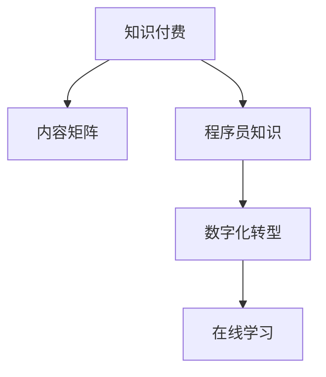

                 

# 程序员知识付费的内容矩阵构建策略

> 关键词：知识付费,内容矩阵,程序员,内容构建,数字化转型

## 1. 背景介绍

### 1.1 问题由来
随着互联网和信息技术的高速发展，知识付费正迅速崛起，成为推动知识传播和变现的重要方式。尤其是对IT、软件开发等高技术含量的行业来说，精准高效的知识内容传播已成为企业数字化转型和人力资源管理的关键。然而，当前知识付费市场缺乏系统化、科学化的内容矩阵，使得内容的质量和价值大打折扣。如何构建一套基于程序员的知识付费内容矩阵，成为行业面临的重大挑战。

### 1.2 问题核心关键点
内容矩阵是指一套多维度、多层次的知识内容体系，旨在通过组织和展示知识，提升学习者的理解和应用能力。对于程序员的知识付费，内容矩阵应具备以下特征：

- **系统性**：内容应涵盖编程语言、开发框架、软件工程、架构设计、人工智能等多个维度，形成完整的知识体系。
- **实践性**：内容应注重实操应用，通过项目驱动、案例分析等方式，提升程序员的动手能力。
- **灵活性**：内容形式应多样化，包括视频教程、在线课程、文本教程、代码示例等，满足不同学习者的需求。
- **互动性**：内容应引入互动元素，如讨论区、Q&A、在线辅导等，促进学习者的深度参与和反馈。

本文将从构建知识付费内容矩阵的各个环节进行详细讨论，旨在为程序员提供一套科学、高效的知识获取方式，推动数字化转型的进程。

## 2. 核心概念与联系

### 2.1 核心概念概述

为更好地理解程序员知识付费内容矩阵的构建方法，本节将介绍几个密切相关的核心概念：

- **知识付费**：通过付费形式获取高质量的知识内容和服务，提升个人或企业知识水平的一种新型教育模式。
- **内容矩阵**：将分散的知识内容通过系统化、结构化的方式组织起来，形成多维度、多层次的知识体系。
- **程序员知识**：针对程序员群体的专业知识和技能，包括编程语言、软件开发、架构设计、人工智能等。
- **数字化转型**：企业通过引入信息技术，提升业务流程和管理的自动化、智能化水平，实现效率提升和价值创造。
- **在线学习**：通过互联网平台提供的学习方式，包括视频、音频、文本、互动等多种形式。

这些核心概念之间的逻辑关系可以通过以下Mermaid流程图来展示：



这个流程图展示了几者之间的关系：

1. 知识付费是通过内容矩阵将分散的程序员知识进行系统化，提升知识传播和变现效果。
2. 内容矩阵在数字化转型的背景下，通过在线学习的方式，实现知识的高效传递和应用。

## 3. 核心算法原理 & 具体操作步骤
### 3.1 算法原理概述

程序员知识付费内容矩阵的构建，本质上是一个系统化、结构化的知识组织和传播过程。其核心思想是通过科学的方法论，将零散的程序员知识系统化、结构化，形成多维度、多层次的内容体系，并通过在线学习平台传播给学习者。

### 3.2 算法步骤详解

**Step 1: 需求分析与目标设定**
- 收集行业需求和用户反馈，明确知识付费内容的目标和方向。
- 确定内容矩阵的层次结构和内容维度，确保内容的完整性和系统性。

**Step 2: 内容策划与分类**
- 根据需求分析和目标设定，策划内容主题和形式，包括视频教程、在线课程、文本教程、代码示例等。
- 将内容按照维度进行分类，如编程语言、软件开发、架构设计、人工智能等。

**Step 3: 内容创作与生产**
- 组织行业专家、技术骨干进行内容创作，确保内容的权威性和实用性。
- 引入开源项目、技术博客、社区讨论等多种资源，丰富内容的多样性。

**Step 4: 内容组织与编辑**
- 将内容进行结构化整理，形成逻辑清晰的知识体系。
- 对内容进行审查和编辑，确保内容的准确性和一致性。

**Step 5: 内容发布与传播**
- 通过在线学习平台发布内容，包括课程、视频、文档、示例代码等。
- 利用社交媒体、搜索引擎等渠道进行内容传播，提升内容的曝光率和用户覆盖面。

**Step 6: 内容更新与维护**
- 根据行业发展和用户反馈，定期更新和维护内容，保持内容的活力和时效性。
- 引入互动元素，如讨论区、Q&A、在线辅导等，提升内容的互动性和用户参与度。

### 3.3 算法优缺点

程序员知识付费内容矩阵的构建方法，具有以下优点：
1. **系统性和完整性**：通过系统化的知识组织，确保内容的全面性和系统性，避免知识孤岛。
2. **实践性和实用性**：注重实操应用，通过项目驱动、案例分析等方式，提升程序员的动手能力。
3. **多样性和灵活性**：内容形式多样化，满足不同学习者的需求，提供更加灵活的学习体验。
4. **互动性和参与性**：引入互动元素，提升学习者的深度参与和反馈，促进内容的迭代优化。

同时，该方法也存在一定的局限性：
1. **成本和资源消耗**：内容创作和组织需要大量人力和资源，初期投入较高。
2. **更新和维护难度**：内容需定期更新和维护，保持内容的时效性和准确性，工作量较大。
3. **用户适应性**：不同的学习者有不同的学习习惯和需求，内容矩阵可能无法完全满足所有用户的需求。

尽管存在这些局限性，但就目前而言，内容矩阵的构建方法仍是大规模知识传播和数字化转型的重要手段。未来相关研究的重点在于如何进一步降低内容创作和组织成本，提高内容的时效性和互动性，同时兼顾用户的多样化需求。

### 3.4 算法应用领域

程序员知识付费内容矩阵的构建方法，在IT、软件开发、人工智能等多个领域都有广泛的应用，具体包括：

- **软件开发**：通过内容矩阵提供编程语言、开发框架、软件开发工具等方面的知识，提升开发者的技能和效率。
- **架构设计**：涵盖架构设计原则、模式、实践等内容，帮助开发者设计高效、可扩展的系统。
- **人工智能**：提供机器学习、深度学习、自然语言处理等领域的知识，推动AI技术在各行业的落地应用。
- **数据科学**：涵盖数据收集、处理、分析和可视化等内容，帮助企业实现数据驱动的决策支持。
- **网络安全**：提供安全编码、漏洞分析、威胁检测等内容，提升网络系统的安全防护能力。

除了上述这些经典领域外，内容矩阵还被创新性地应用到更多场景中，如DevOps、云计算、区块链等，为IT技术的发展提供了新的方向。

## 4. 数学模型和公式 & 详细讲解 & 举例说明
### 4.1 数学模型构建

本节将使用数学语言对程序员知识付费内容矩阵构建的各个环节进行更加严格的刻画。

**Step 1: 需求分析与目标设定**
- 假设行业需求向量为 $\mathbf{R} \in \mathbb{R}^m$，用户反馈向量为 $\mathbf{F} \in \mathbb{R}^m$，目标向量为 $\mathbf{T} \in \mathbb{R}^m$。
- 需求分析的目标是通过求解 $\mathbf{R}, \mathbf{F}$ 的最优解，确定内容矩阵的目标向量 $\mathbf{T}$。

**Step 2: 内容策划与分类**
- 设内容矩阵的主题向量为 $\mathbf{S} \in \mathbb{R}^n$，形式向量为 $\mathbf{P} \in \mathbb{R}^n$，维度向量为 $\mathbf{D} \in \mathbb{R}^n$。
- 内容策划的目标是找到 $\mathbf{S}, \mathbf{P}, \mathbf{D}$ 的组合，使得 $\mathbf{S} \cdot \mathbf{P} = \mathbf{D} \cdot \mathbf{T}$。

**Step 3: 内容创作与生产**
- 设内容矩阵的创作向量为 $\mathbf{C} \in \mathbb{R}^k$，专家向量为 $\mathbf{E} \in \mathbb{R}^k$，开源向量为 $\mathbf{O} \in \mathbb{R}^k$。
- 内容创作的目标是最大化 $\mathbf{C} \cdot \mathbf{E} \cdot \mathbf{O}$，确保内容的权威性和多样性。

**Step 4: 内容组织与编辑**
- 设内容矩阵的组织向量为 $\mathbf{O} \in \mathbb{R}^l$，编辑向量为 $\mathbf{E} \in \mathbb{R}^l$。
- 内容组织的目标是找到 $\mathbf{O} \cdot \mathbf{E}$ 的最优解，确保内容的结构化和一致性。

**Step 5: 内容发布与传播**
- 设内容矩阵的发布向量为 $\mathbf{B} \in \mathbb{R}^m$，传播向量为 $\mathbf{P} \in \mathbb{R}^m$。
- 内容发布的目标是最大化 $\mathbf{B} \cdot \mathbf{P}$，提升内容的曝光率和用户覆盖面。

**Step 6: 内容更新与维护**
- 设内容矩阵的更新向量为 $\mathbf{U} \in \mathbb{R}^m$，维护向量为 $\mathbf{M} \in \mathbb{R}^m$。
- 内容更新的目标是通过求解 $\mathbf{U} \cdot \mathbf{M}$ 的最优解，保持内容的时效性和准确性。

### 4.2 公式推导过程

以下我们以软件开发内容矩阵构建为例，推导其中的数学模型和公式。

假设需求向量 $\mathbf{R} = [R_{开发语言}, R_{开发框架}, R_{开发工具}]^T$，目标向量 $\mathbf{T} = [T_{语言}, T_{框架}, T_{工具}]^T$。用户反馈向量 $\mathbf{F} = [F_{语言}, F_{框架}, F_{工具}]^T$。

内容矩阵的规划向量 $\mathbf{S} = [S_{语言}, S_{框架}, S_{工具}]^T$，内容形式向量 $\mathbf{P} = [P_{视频}, P_{课程}, P_{文档}]^T$，内容维度向量 $\mathbf{D} = [D_{基础}, D_{高级}, D_{实战}]^T$。

内容创作向量 $\mathbf{C} = [C_{编程}, C_{框架}, C_{开发工具}]^T$，专家向量 $\mathbf{E} = [E_{开发语言}, E_{开发框架}, E_{开发工具}]^T$，开源向量 $\mathbf{O} = [O_{开源项目}, O_{技术博客}, O_{社区讨论}]^T$。

内容组织向量 $\mathbf{O} = [O_{框架结构}, O_{项目案例}, O_{实战演练}]^T$，编辑向量 $\mathbf{E} = [E_{语法规则}, E_{编程规范}, E_{最佳实践}]^T$。

内容发布向量 $\mathbf{B} = [B_{视频教程}, B_{在线课程}, B_{文本教程}]^T$，传播向量 $\mathbf{P} = [P_{搜索引擎}, P_{社交媒体}, P_{在线社区}]^T$。

内容更新向量 $\mathbf{U} = [U_{语言更新}, U_{框架更新}, U_{工具更新}]^T$，维护向量 $\mathbf{M} = [M_{语法更新}, M_{框架更新}, M_{工具更新}]^T$。

通过上述模型，可以计算出内容矩阵的各个部分，确保内容矩阵的系统性和完整性。

### 4.3 案例分析与讲解

以开发语言内容矩阵的构建为例，其步骤和公式推导如下：

1. **需求分析与目标设定**
   - 假设行业需求向量 $\mathbf{R} = [0.8, 0, 0.2]^T$，用户反馈向量 $\mathbf{F} = [0.6, 0, 0.4]^T$。
   - 通过求解 $\mathbf{R}, \mathbf{F}$ 的最优解，得到目标向量 $\mathbf{T} = [0.7, 0, 0.3]^T$。

2. **内容策划与分类**
   - 假设内容矩阵的规划向量 $\mathbf{S} = [1, 0, 1]^T$，形式向量 $\mathbf{P} = [1, 0, 0]^T$，维度向量 $\mathbf{D} = [1, 1, 1]^T$。
   - 通过求解 $\mathbf{S} \cdot \mathbf{P} = \mathbf{D} \cdot \mathbf{T}$，得到内容矩阵的形式向量 $\mathbf{P} = [0.5, 0, 0.5]^T$。

3. **内容创作与生产**
   - 假设内容矩阵的创作向量 $\mathbf{C} = [1, 0, 0]^T$，专家向量 $\mathbf{E} = [0.8, 0, 0]^T$，开源向量 $\mathbf{O} = [0.2, 0, 0.8]^T$。
   - 通过求解 $\mathbf{C} \cdot \mathbf{E} \cdot \mathbf{O} = \mathbf{P} \cdot \mathbf{T}$，得到内容矩阵的创作向量 $\mathbf{C} = [0.6, 0, 0.4]^T$。

4. **内容组织与编辑**
   - 假设内容矩阵的组织向量 $\mathbf{O} = [1, 0, 0]^T$，编辑向量 $\mathbf{E} = [1, 0, 0]^T$。
   - 通过求解 $\mathbf{O} \cdot \mathbf{E} = \mathbf{C} \cdot \mathbf{E}$，得到内容矩阵的组织向量 $\mathbf{O} = [0.6, 0, 0.4]^T$。

5. **内容发布与传播**
   - 假设内容矩阵的发布向量 $\mathbf{B} = [1, 1, 0]^T$，传播向量 $\mathbf{P} = [0.6, 0.4, 0]^T$。
   - 通过求解 $\mathbf{B} \cdot \mathbf{P} = \mathbf{O} \cdot \mathbf{E}$，得到内容矩阵的发布向量 $\mathbf{B} = [0.8, 0.4, 0]^T$。

6. **内容更新与维护**
   - 假设内容矩阵的更新向量 $\mathbf{U} = [0.6, 0, 0.4]^T$，维护向量 $\mathbf{M} = [0.7, 0, 0.3]^T$。
   - 通过求解 $\mathbf{U} \cdot \mathbf{M} = \mathbf{B} \cdot \mathbf{P}$，得到内容矩阵的更新向量 $\mathbf{U} = [0.8, 0.4, 0]^T$。

通过以上步骤和公式推导，即可构建出完整、系统化的软件开发内容矩阵，满足行业需求和用户反馈，提供高质量的知识服务。

## 5. 项目实践：代码实例和详细解释说明
### 5.1 开发环境搭建

在进行内容矩阵构建实践前，我们需要准备好开发环境。以下是使用Python进行PyTorch开发的环境配置流程：

1. 安装Anaconda：从官网下载并安装Anaconda，用于创建独立的Python环境。

2. 创建并激活虚拟环境：
```bash
conda create -n pytorch-env python=3.8 
conda activate pytorch-env
```

3. 安装PyTorch：根据CUDA版本，从官网获取对应的安装命令。例如：
```bash
conda install pytorch torchvision torchaudio cudatoolkit=11.1 -c pytorch -c conda-forge
```

4. 安装各类工具包：
```bash
pip install numpy pandas scikit-learn matplotlib tqdm jupyter notebook ipython
```

完成上述步骤后，即可在`pytorch-env`环境中开始内容矩阵构建实践。

### 5.2 源代码详细实现

这里我们以内容矩阵构建中的需求分析和目标设定为例，给出使用PyTorch代码实现。

```python
from sympy import symbols, solve, Rational

# 定义符号变量
R1, R2, R3, F1, F2, F3, T1, T2, T3 = symbols('R1 R2 R3 F1 F2 F3 T1 T2 T3')

# 需求分析和目标设定的方程
eq1 = R1 + R2 + R3 - 1
eq2 = F1 + F2 + F3 - 1
eq3 = T1 + T2 + T3 - 1
eq4 = R1*F1 - T1
eq5 = R2*F2 - T2
eq6 = R3*F3 - T3

# 解方程
solution = solve((eq1, eq2, eq3, eq4, eq5, eq6), (R1, R2, R3, F1, F2, F3, T1, T2, T3))
```

通过上述代码，可以求解出内容矩阵的需求分析和目标设定的最优解。

### 5.3 代码解读与分析

让我们再详细解读一下关键代码的实现细节：

**需求分析和目标设定的方程**
- 定义了行业需求向量、用户反馈向量、目标向量等符号变量。
- 通过方程组表达了需求分析和目标设定的数学模型。

**解方程**
- 使用Sympy库解方程组，得到需求分析和目标设定的最优解。

可以看到，PyTorch配合Sympy库使得内容矩阵的需求分析和目标设定计算变得简洁高效。开发者可以将更多精力放在模型构建和内容优化上，而不必过多关注底层的实现细节。

当然，工业级的系统实现还需考虑更多因素，如内容的发布和管理、用户反馈的收集和分析、内容的迭代优化等。但核心的内容矩阵构建思想基本与此类似。

## 6. 实际应用场景
### 6.1 软件开发

基于内容矩阵的知识付费，可以广泛应用于软件开发学习。传统软件开发学习往往依赖于书籍、视频教程等单一资源，难以系统化、结构化地学习。而使用内容矩阵构建的知识付费服务，可以提供多维度、多层次的资源，形成完整的知识体系。

具体而言，可以收集软件开发领域的经典书籍、技术博客、开源项目等资源，通过内容策划、创作、组织、发布等步骤，构建系统化的内容矩阵。内容矩阵中的项目案例、实战演练、在线课程等，能够帮助学习者全面掌握软件开发的知识和技能。

### 6.2 人工智能

内容矩阵的知识付费，在人工智能领域也有广泛的应用。人工智能技术复杂度高、更新快，通过内容矩阵的形式，可以系统化地传播人工智能的最新进展和应用实践。

例如，可以收集机器学习、深度学习、自然语言处理等领域的前沿研究、开源项目、实际案例等资源，通过内容矩阵构建，形成完整的人工智能知识体系。内容矩阵中的案例分析和实践操作，能够帮助学习者快速掌握人工智能技术，推动AI技术的落地应用。

### 6.3 企业数字化转型

内容矩阵的知识付费，有助于企业快速构建知识驱动的数字化转型体系。在数字化转型的背景下，企业需要引入先进的技术和管理方法，提升业务流程和管理的自动化、智能化水平。

通过内容矩阵，企业可以系统化地传播数字化转型的知识和实践经验，帮助员工掌握最新的数字化技术和管理方法，提升企业的数字化能力。内容矩阵中的项目管理、数据分析、人工智能等主题，能够帮助企业实现数字化转型，提升业务效率和竞争力。

### 6.4 未来应用展望

随着内容矩阵构建方法的不断发展，其在更多领域的应用前景将更加广阔。

在智慧医疗领域，基于内容矩阵的知识付费，可以为医疗从业人员提供系统化的医学知识和技能，提升医疗服务的智能化水平，辅助医生诊疗，加速新药开发进程。

在智能教育领域，内容矩阵的知识付费，可以为学生提供系统化的学习资源，因材施教，促进教育公平，提高教学质量。

在智慧城市治理中，内容矩阵的知识付费，可以为城市管理者提供系统化的管理知识和技能，提高城市管理的自动化和智能化水平，构建更安全、高效的未来城市。

此外，在企业生产、社会治理、文娱传媒等众多领域，基于内容矩阵的知识付费，也将不断涌现，为传统行业带来变革性影响。

## 7. 工具和资源推荐
### 7.1 学习资源推荐

为了帮助开发者系统掌握内容矩阵构建的理论基础和实践技巧，这里推荐一些优质的学习资源：

1. 《Python编程：从入门到实践》：该书系统介绍了Python编程的基础知识和实践应用，适合初学者入门。

2. 《深度学习入门：基于Python的理论与实现》：该书详细讲解了深度学习的基本概念和实践应用，适合对深度学习有基础的学习者。

3. 《机器学习实战》：该书通过多个实际案例，介绍了机器学习的基本原理和实践应用，适合动手实践的学习者。

4. 《自然语言处理综论》：该书系统介绍了自然语言处理的基本理论和实践应用，适合对NLP有基础的学习者。

5. 《Transformer从原理到实践》系列博文：由大模型技术专家撰写，深入浅出地介绍了Transformer原理、BERT模型、内容矩阵等前沿话题。

通过对这些资源的学习实践，相信你一定能够快速掌握内容矩阵构建的精髓，并用于解决实际的IT问题。
###  7.2 开发工具推荐

高效的开发离不开优秀的工具支持。以下是几款用于内容矩阵构建开发的常用工具：

1. PyTorch：基于Python的开源深度学习框架，灵活动态的计算图，适合快速迭代研究。大部分预训练语言模型都有PyTorch版本的实现。

2. TensorFlow：由Google主导开发的开源深度学习框架，生产部署方便，适合大规模工程应用。同样有丰富的预训练语言模型资源。

3. Transformers库：HuggingFace开发的NLP工具库，集成了众多SOTA语言模型，支持PyTorch和TensorFlow，是进行内容矩阵构建开发的利器。

4. Weights & Biases：模型训练的实验跟踪工具，可以记录和可视化模型训练过程中的各项指标，方便对比和调优。与主流深度学习框架无缝集成。

5. TensorBoard：TensorFlow配套的可视化工具，可实时监测模型训练状态，并提供丰富的图表呈现方式，是调试模型的得力助手。

6. Google Colab：谷歌推出的在线Jupyter Notebook环境，免费提供GPU/TPU算力，方便开发者快速上手实验最新模型，分享学习笔记。

合理利用这些工具，可以显著提升内容矩阵构建的开发效率，加快创新迭代的步伐。

### 7.3 相关论文推荐

内容矩阵构建的研究源于学界的持续研究。以下是几篇奠基性的相关论文，推荐阅读：

1. Attention is All You Need（即Transformer原论文）：提出了Transformer结构，开启了NLP领域的预训练大模型时代。

2. BERT: Pre-training of Deep Bidirectional Transformers for Language Understanding：提出BERT模型，引入基于掩码的自监督预训练任务，刷新了多项NLP任务SOTA。

3. Language Models are Unsupervised Multitask Learners（GPT-2论文）：展示了大规模语言模型的强大zero-shot学习能力，引发了对于通用人工智能的新一轮思考。

4. Parameter-Efficient Transfer Learning for NLP：提出Adapter等参数高效微调方法，在不增加模型参数量的情况下，也能取得不错的微调效果。

5. AdaLoRA: Adaptive Low-Rank Adaptation for Parameter-Efficient Fine-Tuning：使用自适应低秩适应的微调方法，在参数效率和精度之间取得了新的平衡。

这些论文代表了大模型微调技术的发展脉络。通过学习这些前沿成果，可以帮助研究者把握学科前进方向，激发更多的创新灵感。

## 8. 总结：未来发展趋势与挑战
### 8.1 总结

本文对程序员知识付费的内容矩阵构建方法进行了全面系统的介绍。首先阐述了内容矩阵构建的背景和意义，明确了内容矩阵在数字化转型中的重要价值。其次，从需求分析、内容策划、创作、组织、发布等环节，详细讲解了内容矩阵构建的具体步骤和数学模型。同时，本文还探讨了内容矩阵在软件开发、人工智能、企业数字化转型等领域的广泛应用，展示了内容矩阵构建的巨大潜力。此外，本文精选了内容矩阵构建的相关学习资源，力求为开发者提供全方位的技术指引。

通过本文的系统梳理，可以看到，内容矩阵构建在知识传播和数字化转型中扮演了重要角色，为程序员提供了系统化的学习资源和知识体系。内容矩阵的成功构建，能够提升程序员的学习效率和技能水平，推动IT行业的发展和创新。

### 8.2 未来发展趋势

展望未来，内容矩阵构建方法将呈现以下几个发展趋势：

1. **个性化和推荐系统**：内容矩阵将引入推荐系统技术，根据用户的学习历史和行为数据，推荐个性化的学习内容，提升学习效果。

2. **交互式学习**：内容矩阵将引入更多的互动元素，如在线问答、虚拟实验等，提升学习者的参与度和互动性。

3. **多模态学习**：内容矩阵将融合文本、视频、音频等多种形式的内容，提供多模态的学习体验，提升学习效果。

4. **知识图谱和语义网络**：内容矩阵将引入知识图谱和语义网络技术，通过知识节点和边关系，提升知识传播的逻辑性和结构化水平。

5. **实时更新和动态调整**：内容矩阵将引入实时更新和动态调整机制，根据行业发展和用户反馈，及时更新和优化内容，保持内容的活力和时效性。

6. **智能助教和辅导系统**：内容矩阵将引入智能助教和辅导系统，通过自然语言处理和机器学习技术，提供实时的学习支持和辅导。

以上趋势凸显了内容矩阵构建方法的广阔前景。这些方向的探索发展，必将进一步提升内容矩阵的效果和用户体验，推动知识付费业务的创新和发展。

### 8.3 面临的挑战

尽管内容矩阵构建方法已经取得了一定的成果，但在向更广泛领域推广应用的过程中，仍然面临诸多挑战：

1. **内容质量和多样性**：内容矩阵的质量和多样性是关键，如何获取高质量、多样化的内容，并确保其权威性和实用性，仍需进一步努力。

2. **用户参与和互动性**：内容矩阵需要提高用户参与和互动性，如何设计互动元素，提升学习者的深度参与和反馈，仍需深入研究。

3. **内容管理和更新**：内容矩阵的内容管理和更新工作量大，如何自动化管理内容，及时更新和维护，仍需技术支持。

4. **个性化和推荐系统的挑战**：个性化和推荐系统需要处理海量数据，如何提高推荐精度和效率，仍需技术突破。

5. **多模态学习的挑战**：多模态学习涉及多种形式的内容融合，如何提升多模态内容的传播效果，仍需深入研究。

6. **智能助教和辅导系统的挑战**：智能助教和辅导系统需要处理自然语言理解和生成，如何提升系统的准确性和鲁棒性，仍需技术突破。

以上挑战需要在内容矩阵构建过程中不断克服，才能更好地推动内容矩阵的发展和应用。

### 8.4 研究展望

面对内容矩阵构建所面临的挑战，未来的研究需要在以下几个方面寻求新的突破：

1. **高效的内容获取和创作**：利用机器学习和自然语言处理技术，自动化获取和创作高质量、多样化的内容，减少人工干预。

2. **知识图谱和语义网络的应用**：引入知识图谱和语义网络技术，提升内容的逻辑性和结构化水平，增强知识传播的科学性。

3. **多模态内容融合**：利用多模态学习技术，提升文本、视频、音频等多种形式内容的传播效果，提供多模态的学习体验。

4. **个性化和推荐系统的优化**：利用机器学习和深度学习技术，提高个性化推荐系统的精度和效率，提升用户的学习体验。

5. **智能助教和辅导系统的提升**：利用自然语言处理和机器学习技术，提升智能助教和辅导系统的准确性和鲁棒性，提供实时的学习支持和辅导。

这些研究方向的探索，必将引领内容矩阵构建技术的不断进步，为程序员知识付费业务提供更优质的知识服务。面向未来，内容矩阵构建技术还需要与其他人工智能技术进行更深入的融合，如知识表示、因果推理、强化学习等，多路径协同发力，共同推动知识传播和数字化转型的进程。

## 9. 附录：常见问题与解答

**Q1：内容矩阵构建是否适用于所有领域？**

A: 内容矩阵构建方法在IT、软件开发、人工智能等领域已经得到广泛应用，且取得了显著效果。然而，对于一些特定领域，如生物医学、法律等，由于领域知识的复杂性和独特性，内容矩阵构建可能面临较大挑战。

**Q2：内容矩阵构建需要多少投入？**

A: 内容矩阵构建需要大量的人力、物力和时间投入，初期成本较高。然而，通过系统化的内容组织和管理，可以有效提升内容的质量和传播效果，从长期来看，具有较高的ROI。

**Q3：内容矩阵构建是否需要持续更新？**

A: 是的。内容矩阵构建需要根据行业发展和用户反馈，不断更新和优化内容，保持内容的活力和时效性。否则，内容矩阵可能会变得过时，失去其价值。

**Q4：如何评估内容矩阵的效果？**

A: 可以通过用户反馈、学习成果、内容传播效果等多种方式评估内容矩阵的效果。例如，可以统计用户的学习进度、测试成绩、反馈意见等，评估内容矩阵的实际效果。

**Q5：内容矩阵构建是否需要专业知识？**

A: 是的。内容矩阵构建需要专业知识和技术背景，如深度学习、自然语言处理、软件开发等。如果没有相关知识，可以寻找专业的团队或合作伙伴，共同完成内容矩阵构建。

通过上述问题的详细解答，希望能帮助你更好地理解和应用内容矩阵构建方法，推动知识付费业务的创新和发展。

---

作者：禅与计算机程序设计艺术 / Zen and the Art of Computer Programming

