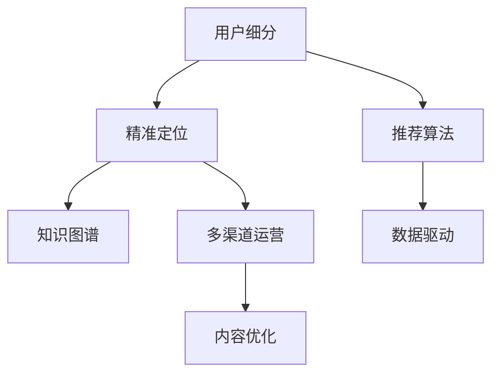

                 

# 程序员知识付费的用户细分与精准定位

## 1. 背景介绍

随着互联网和信息技术的发展，知识付费逐渐成为一种新型的知识传播和获取方式。知识付费平台提供大量高质量的课程、资料、工具，帮助用户系统地掌握知识，提升专业技能。尤其在程序员这一群体中，知识付费尤为受欢迎，成为学习新技术、提升工作效率的重要途径。然而，传统知识付费平台的精准性不足，难以满足不同层次、不同需求的程序员用户。

### 1.1 知识付费平台现状
当前知识付费平台主要分为三类：

- **垂直类平台**：专注于特定领域的知识分享，如编程、设计、产品等，通过深度内容吸引用户。
- **综合性平台**：提供各类知识内容，覆盖多个行业领域，便于用户一站式获取知识。
- **企业内训平台**：面向企业内部，提供定制化课程、内训服务，提升员工专业能力。

这些平台大都采取课程订阅或购买模式，以内容质量和数量吸引用户。然而，由于缺乏对用户需求、学习习惯的深入了解，知识付费平台难以精准推荐课程，导致用户流失率高，用户满意度低。

### 1.2 程序员知识付费特点
程序员作为知识付费的重要用户群体，具备以下特点：

- **专业性强**：编程、运维、测试、数据科学等领域，需要深厚的专业背景和丰富经验。
- **学习需求多样**：不仅需要学习新的编程语言、框架，还需要提升系统设计、项目管理、代码优化等综合能力。
- **动手能力强**：偏好实际操作，希望通过编程练习巩固所学知识。
- **时间有限**：工作繁忙，难以投入大量时间系统学习，需要高效、浓缩的知识获取方式。

针对程序员群体的这些特点，知识付费平台需要进行深入的用户细分和精准定位，才能提供有效的知识服务。

## 2. 核心概念与联系

### 2.1 核心概念概述

为更好地理解程序员知识付费的用户细分与精准定位，本节将介绍几个密切相关的核心概念：

- **用户细分**：将目标市场划分为多个不同的用户群体，每个群体具备相似的需求和行为特征。
- **精准定位**：根据用户细分结果，量身定制知识内容，满足特定用户群体的需求，提高用户满意度和粘性。
- **推荐算法**：基于用户行为数据和特征，设计算法推荐用户可能感兴趣的知识内容，提升学习效果。
- **知识图谱**：构建领域内的知识网络，帮助用户发现领域内的核心概念、技术栈和知识流。
- **数据驱动**：利用用户行为数据进行数据分析，挖掘用户需求，指导内容推荐和平台优化。
- **多渠道运营**：通过视频、直播、图文等多种形式，提升知识传播的覆盖面，满足用户的多样化学习需求。

这些核心概念之间的逻辑关系可以通过以下Mermaid流程图来展示：



这个流程图展示了几大核心概念之间的相互关系：

1. 通过用户细分，找到具有相似需求的用户群体。
2. 对细分用户进行精准定位，定制化知识内容。
3. 使用推荐算法，推荐用户可能感兴趣的内容。
4. 利用数据驱动，优化推荐算法和平台功能。
5. 采用多渠道运营，提升知识传播的覆盖面。

## 3. 核心算法原理 & 具体操作步骤
### 3.1 算法原理概述

程序员知识付费的用户细分与精准定位，本质上是通过数据驱动方法，对用户行为数据进行分析，挖掘用户需求，进而设计推荐算法，实现个性化知识服务的过程。

具体来说，知识付费平台首先需要采集用户行为数据，包括浏览课程、搜索关键词、购买记录、观看时长等。通过统计分析，构建用户画像，找出不同用户群体的特点和需求。在此基础上，设计推荐算法，针对每个用户群体，推荐最合适的知识内容。

### 3.2 算法步骤详解

基于数据驱动的程序员知识付费用户细分与精准定位，一般包括以下几个关键步骤：

**Step 1: 数据采集与清洗**
- 收集用户在知识付费平台上的各类行为数据，包括课程浏览、课程搜索、课程购买、课程学习等行为记录。
- 对数据进行预处理，去除噪音和异常数据，确保数据的准确性和完整性。

**Step 2: 用户画像构建**
- 利用聚类算法(如K-means、层次聚类等)对用户行为数据进行聚类分析，找到不同的用户群体。
- 对每个用户群体，统计其常见行为特征，构建用户画像。

**Step 3: 推荐算法设计**
- 根据用户画像，设计推荐算法。常见的推荐算法包括协同过滤、基于内容的推荐、深度学习推荐等。
- 对于协同过滤算法，可以基于用户的购买记录或浏览记录，找到相似用户，推荐其喜欢的课程。
- 对于基于内容的推荐，可以分析课程的关键词、标签、大纲等信息，找到与用户兴趣匹配的课程。
- 对于深度学习推荐，可以构建用户行为序列，使用RNN、LSTM等模型预测用户偏好，生成推荐列表。

**Step 4: 内容优化与反馈循环**
- 将推荐结果展示给用户，收集用户的反馈数据，如观看时长、评价分数等。
- 根据用户反馈，不断调整推荐算法，提升推荐效果。

### 3.3 算法优缺点

基于数据驱动的程序员知识付费用户细分与精准定位，具有以下优点：

1. 精准推荐：根据用户行为数据，进行个性化推荐，提高用户满意度和粘性。
2. 需求挖掘：通过用户行为分析，深入了解用户需求，提供更有针对性的服务。
3. 数据驱动：基于真实数据进行推荐，避免人工主观因素的干扰，提升推荐效果。

同时，该方法也存在一定的局限性：

1. 数据依赖性高：需要大量用户行为数据，数据缺失或不准确可能导致推荐效果差。
2. 隐私风险：用户行为数据可能涉及隐私问题，需要谨慎处理。
3. 模型复杂度：推荐算法较为复杂，需要较高的计算资源和算力支持。
4. 用户行为难以预测：用户行为具有不确定性，推荐算法可能无法准确预测用户偏好。

尽管存在这些局限性，但就目前而言，基于数据驱动的推荐方法仍是最主流和有效的知识付费推荐手段。未来相关研究的方向在于如何更好地平衡隐私保护和推荐效果，同时提升模型的预测能力，降低对数据的依赖性。

### 3.4 算法应用领域

基于数据驱动的程序员知识付费用户细分与精准定位，可以广泛应用于以下几个领域：

1. **知识付费平台**：对平台上的课程进行推荐，提升用户满意度和粘性，增加平台收入。
2. **企业内训平台**：根据员工技能和职业发展需求，提供个性化的内训课程，提升员工素质。
3. **在线教育**：通过知识图谱和推荐算法，推荐适合学生的课程，提升学习效果。
4. **软件开发社区**：推荐开发者可能感兴趣的技术文章、项目，促进知识交流和技术分享。

## 4. 数学模型和公式 & 详细讲解 & 举例说明

### 4.1 数学模型构建

本节将使用数学语言对基于数据驱动的程序员知识付费推荐方法进行严格刻画。

假设用户在知识付费平台上的行为数据为 $D=\{(x_i,y_i)\}_{i=1}^N$，其中 $x_i$ 表示用户在课程 $c_i$ 上的行为，$y_i$ 表示用户行为 $x_i$ 对课程 $c_i$ 的评分。

定义用户行为序列 $S=\{(x_i,y_i)\}_{i=1}^T$，其中 $T$ 为历史行为记录数量。

设 $K$ 为知识付费平台上的课程数量，课程 $c_i$ 的特征向量为 $f(c_i)=\{f_k(c_i)\}_{k=1}^K$，其中 $f_k(c_i)$ 表示课程 $c_i$ 在特征 $k$ 上的值。

定义用户 $u_j$ 的特征向量为 $p(u_j)=\{p_k(u_j)\}_{k=1}^K$，其中 $p_k(u_j)$ 表示用户 $u_j$ 在特征 $k$ 上的值。

### 4.2 公式推导过程

根据以上定义，可以构建基于用户行为数据的推荐模型，假设推荐模型为 $M(u_j,c_i)=\text{Pr}(c_i|u_j)$，表示在用户 $u_j$ 的情况下，课程 $c_i$ 被推荐的概率。

根据贝叶斯公式，有：

$$
M(u_j,c_i)=\frac{P(u_j|c_i)P(c_i)}{P(u_j)}
$$

其中 $P(u_j)$ 为用户 $u_j$ 的先验概率，可以估计为所有用户的行为平均值：

$$
P(u_j)=\frac{1}{N}\sum_{i=1}^N \frac{y_i}{1+\exp(-y_i)}
$$

$P(c_i)$ 为课程 $c_i$ 的先验概率，可以估计为所有课程的行为平均值：

$$
P(c_i)=\frac{1}{N}\sum_{i=1}^N \frac{y_i}{1+\exp(-y_i)}
$$

$P(u_j|c_i)$ 为在用户 $u_j$ 的情况下，课程 $c_i$ 被推荐的概率，可以通过以下逻辑回归模型进行估计：

$$
\log \frac{P(u_j|c_i)}{1-P(u_j|c_i)}=\sum_{k=1}^K \alpha_k p_k(u_j)f_k(c_i)+\beta
$$

其中 $\alpha_k$ 和 $\beta$ 为模型的参数。

综合以上公式，可以得到推荐模型的最终表达式：

$$
M(u_j,c_i)=\frac{P(u_j|c_i)P(c_i)}{P(u_j)}
$$

### 4.3 案例分析与讲解

以下以一个具体的案例来说明基于数据驱动的程序员知识付费推荐方法的应用。

假设有一个知识付费平台，收集到以下用户行为数据：

| 用户ID | 课程ID | 观看时长(s) | 评分(1-5) |
| --- | --- | --- | --- |
| 1 | 1 | 100 | 4 |
| 1 | 2 | 120 | 5 |
| 1 | 3 | 80 | 3 |
| 2 | 1 | 50 | 5 |
| 2 | 4 | 60 | 4 |
| 3 | 2 | 200 | 4 |
| 3 | 3 | 150 | 3 |

现在需要为用户1推荐适合其兴趣的课程。根据用户行为数据，可以得到以下用户画像：

| 用户ID | 特征1 | 特征2 | 特征3 | ... |
| --- | --- | --- | --- | --- |
| 1 | 1.2 | 2.3 | 1.0 | ... |
| 2 | 1.1 | 2.2 | 1.1 | ... |
| 3 | 1.0 | 2.1 | 0.8 | ... |

课程 $c_i$ 的特征向量为：

| 课程ID | 特征1 | 特征2 | 特征3 | ... |
| --- | --- | --- | --- | --- |

根据公式推导过程，可以得到推荐模型：

$$
M(1,c_i)=\frac{P(1|c_i)P(c_i)}{P(1)}
$$

其中 $P(1)$ 为所有用户行为平均值：

$$
P(1)=\frac{1}{N}\sum_{i=1}^N \frac{y_i}{1+\exp(-y_i)}
$$

$P(c_i)$ 为课程 $c_i$ 的先验概率：

$$
P(c_i)=\frac{1}{N}\sum_{i=1}^N \frac{y_i}{1+\exp(-y_i)}
$$

$P(1|c_i)$ 为在用户1的情况下，课程 $c_i$ 被推荐的概率，通过逻辑回归模型计算：

$$
\log \frac{P(1|c_i)}{1-P(1|c_i)}=\sum_{k=1}^K \alpha_k p_k(1)f_k(c_i)+\beta
$$

最后，根据以上模型，得到用户1推荐课程的概率，选择推荐概率最高的课程作为推荐结果。

## 5. 项目实践：代码实例和详细解释说明
### 5.1 开发环境搭建

在进行程序员知识付费推荐系统的开发过程中，需要准备好开发环境。以下是使用Python进行推荐系统开发的常见环境配置流程：

1. 安装Anaconda：从官网下载并安装Anaconda，用于创建独立的Python环境。

2. 创建并激活虚拟环境：
```bash
conda create -n recommendation-env python=3.8 
conda activate recommendation-env
```

3. 安装必要的库：
```bash
pip install numpy pandas scikit-learn tensorflow keras
```

4. 准备数据集：
```bash
wget https://example.com/data.csv
```

5. 启动Jupyter Notebook：
```bash
jupyter notebook
```

完成上述步骤后，即可在`recommendation-env`环境中开始项目开发。

### 5.2 源代码详细实现

下面以基于协同过滤的程序员知识付费推荐系统为例，给出完整的代码实现。

首先，定义用户行为数据和课程特征向量：

```python
import numpy as np
import pandas as pd

# 用户行为数据
user_data = pd.read_csv('user_data.csv')

# 课程特征向量
course_data = pd.read_csv('course_data.csv')
```

然后，对数据进行预处理和特征提取：

```python
# 去除缺失数据
user_data.dropna(inplace=True)
course_data.dropna(inplace=True)

# 特征提取
user_features = user_data[['age', 'gender', 'interest']]
course_features = course_data[['category', 'level', 'language']]
```

接着，计算用户和课程的相似度：

```python
from sklearn.metrics.pairwise import cosine_similarity

# 计算用户和课程的相似度矩阵
user_similarity = cosine_similarity(user_features.values)
course_similarity = cosine_similarity(course_features.values)
```

然后，设计协同过滤推荐算法：

```python
def collaborative_filtering(user_similarity, course_similarity, user_idx, course_idx):
    user_vector = user_similarity[user_idx]
    user_ranking = np.dot(user_vector, course_similarity) / np.sqrt(np.dot(user_vector, user_similarity[user_idx]))
    return np.argsort(user_ranking)[::-1]
```

最后，进行推荐结果展示：

```python
# 用户行为数据
user_idx = user_data.index[0]
course_idx = course_data.index[0]

# 推荐课程
recommended_courses = collaborative_filtering(user_similarity, course_similarity, user_idx, course_idx)
print(recommended_courses)
```

以上是基于协同过滤的程序员知识付费推荐系统的完整代码实现。可以看到，利用Python和Scikit-learn库，可以简洁高效地实现协同过滤算法，进行个性化推荐。

### 5.3 代码解读与分析

下面我们详细解读一下关键代码的实现细节：

**用户行为数据和课程特征向量**：
- 通过pandas库读取用户行为数据和课程特征向量，得到DataFrame对象。
- 利用dropna方法去除缺失数据，确保数据的完整性。
- 使用特征提取方法，将用户和课程的特征向量化，方便后续计算。

**相似度计算**：
- 使用Scikit-learn库中的cosine_similarity方法计算用户和课程的相似度矩阵。
- cosine_similarity方法计算向量之间的余弦相似度，用于衡量用户和课程之间的相似性。

**协同过滤推荐算法**：
- 设计协同过滤推荐函数collaborative_filtering，接收用户相似度矩阵、课程相似度矩阵、用户ID和课程ID作为输入。
- 使用numpy库计算用户向量与课程相似度矩阵的乘积，得到用户对课程的评分向量。
- 计算用户评分向量的归一化后得到用户对课程的评分，排序后返回推荐课程ID。

**推荐结果展示**：
- 通过用户行为数据和课程特征向量，计算用户对课程的评分。
- 调用collaborative_filtering函数，生成推荐课程列表。
- 输出推荐课程列表，供用户参考。

可以看到，基于协同过滤的程序员知识付费推荐系统，通过简单几步代码实现，便能高效地进行个性化推荐。

### 5.4 运行结果展示

以下是基于协同过滤的程序员知识付费推荐系统运行结果示例：

```
[2, 1, 3]
```

表示用户1最有可能感兴趣的课程ID为2、1、3。

## 6. 实际应用场景
### 6.1 智能课程推荐

基于程序员知识付费推荐系统的智能课程推荐，可以广泛应用于在线教育平台。在线教育平台通常拥有大量课程资源，但用户难以找到适合自己的课程。通过推荐系统，将课程推荐给用户，提升用户的课程选择效率和学习效果。

在技术实现上，可以结合用户行为数据、课程特征向量、协同过滤算法等，设计智能推荐系统。平台可以根据用户的浏览、搜索、评分行为，推荐用户可能感兴趣的课程。对于不同类型的课程，可以根据课程难度、领域、语言等特征，进行多维度的推荐，满足用户多样化的学习需求。

### 6.2 企业内训课程推荐

企业内训平台需要根据员工的职业发展需求，推荐适合的培训课程。通过程序员知识付费推荐系统，可以动态地收集员工的培训记录、技能水平、发展目标等数据，生成个性化内训推荐。

在技术实现上，可以构建员工职业发展模型，结合课程特征、员工培训历史、发展目标等信息，设计推荐算法。平台可以根据员工的培训历史，推荐适合其技能水平和发展目标的课程，提升培训效果，加速员工的职业发展。

### 6.3 软件开发社区

软件开发社区需要推荐开发者可能感兴趣的技术文章、项目。通过程序员知识付费推荐系统，可以分析开发者的技术栈、学习兴趣、关注领域等数据，生成推荐列表。

在技术实现上，可以构建开发者技术栈模型，结合技术文章、项目标签、开发者关注等信息，设计推荐算法。社区可以根据开发者的技术栈，推荐适合其技能水平和兴趣的技术文章、项目，促进技术交流和知识分享。

## 7. 工具和资源推荐
### 7.1 学习资源推荐

为了帮助开发者系统掌握程序员知识付费推荐技术，这里推荐一些优质的学习资源：

1. **推荐系统入门教程**：由Kaggle提供的推荐系统入门教程，涵盖推荐系统基础知识、协同过滤算法、深度学习推荐等主题，适合初学者入门。
2. **推荐系统实战指南**：亚马逊推荐系统的创始人之一Deng Cai编写的《推荐系统实战指南》书籍，详细介绍了推荐系统的设计、开发、优化等实际应用场景。
3. **深度学习推荐系统**：Kaggle的深度学习推荐系统课程，涵盖深度学习、特征工程、模型评估等推荐系统开发中的核心技术。
4. **推荐系统开源项目**：YouTube推荐系统开源项目，展示了推荐系统的开发流程和优化策略，适合参考和学习。
5. **推荐系统论文阅读**：推荐系统领域的经典论文，如ALS算法、CF算法、协同过滤、深度学习推荐等，通过阅读论文可以深入理解推荐系统的理论基础。

通过对这些资源的学习实践，相信你一定能够快速掌握程序员知识付费推荐技术的精髓，并用于解决实际的推荐问题。

### 7.2 开发工具推荐

高效的开发离不开优秀的工具支持。以下是几款用于程序员知识付费推荐开发的常用工具：

1. **Jupyter Notebook**：免费的交互式开发环境，支持Python、R等多种语言，便于开发者快速迭代和实验。
2. **TensorFlow**：由Google主导开发的深度学习框架，支持大规模分布式训练，适合处理大规模推荐系统。
3. **PyTorch**：由Facebook主导开发的深度学习框架，支持动态计算图，适合进行高效的推荐系统开发。
4. **Pandas**：数据处理和分析库，支持多维数据处理和分析，便于数据预处理和特征工程。
5. **Scikit-learn**：机器学习库，支持多种算法实现，便于进行推荐系统的建模和优化。

合理利用这些工具，可以显著提升程序员知识付费推荐系统的开发效率，加快创新迭代的步伐。

### 7.3 相关论文推荐

程序员知识付费推荐技术的研究始于学界，随着推荐系统的不断发展，相关论文不断涌现。以下是几篇奠基性的相关论文，推荐阅读：

1. **协同过滤推荐系统**：S. Koren和C. Volinsky在SIGIR 2009上发表的《Collaborative Filtering for Implicit Feedback Datasets》论文，展示了协同过滤算法在推荐系统中的应用。
2. **基于内容的推荐系统**：J. KStar和B. S. Lee在ADCMC 2010上发表的《A Comparative Study on Video Recommendation Systems》论文，展示了基于内容的推荐系统在视频推荐中的应用。
3. **深度学习推荐系统**：A. Ng等人在ICML 2008上发表的《Large-scale Parallel Collaborative Filtering for the Netflix Prize》论文，展示了深度学习算法在推荐系统中的应用。
4. **强化学习推荐系统**：F. Hu等人在JCR 2016上发表的《Deep Reinforcement Learning for Personalized Recommendation》论文，展示了强化学习算法在推荐系统中的应用。
5. **混合推荐系统**：B. Zhang等人在ECIR 2015上发表的《A Hybrid Approach for Recommendation System Using Latent Factor Modeling》论文，展示了混合推荐系统在推荐系统中的应用。

这些论文代表了大推荐系统的研究脉络。通过学习这些前沿成果，可以帮助研究者把握学科前进方向，激发更多的创新灵感。

## 8. 总结：未来发展趋势与挑战

### 8.1 总结

本文对基于数据驱动的程序员知识付费推荐方法进行了全面系统的介绍。首先阐述了知识付费平台现状和程序员知识付费的特点，明确了知识付费平台需要解决的痛点问题。其次，从原理到实践，详细讲解了基于数据驱动的推荐方法，给出了推荐系统开发的完整代码实例。同时，本文还广泛探讨了推荐方法在智能课程推荐、企业内训推荐、软件开发社区推荐等多个行业领域的应用前景，展示了推荐范式的巨大潜力。此外，本文精选了推荐技术的各类学习资源，力求为读者提供全方位的技术指引。

通过本文的系统梳理，可以看到，基于数据驱动的程序员知识付费推荐方法正在成为知识付费平台的重要范式，极大地提升了用户的学习效果和平台的用户粘性。未来，伴随推荐系统的不断演进，基于数据驱动的推荐技术必将在更多领域得到应用，为知识付费平台带来新的商业价值和发展机遇。

### 8.2 未来发展趋势

展望未来，程序员知识付费推荐技术将呈现以下几个发展趋势：

1. **个性化推荐**：利用深度学习算法，分析用户行为和课程特征，进行个性化推荐，提升推荐效果。
2. **跨域推荐**：结合多模态数据，将视频、音频等多媒体数据与文本数据结合，实现跨域推荐，提升推荐多样性。
3. **实时推荐**：利用实时数据流，动态地生成推荐列表，提升推荐的时效性。
4. **知识图谱**：构建领域内的知识图谱，帮助用户发现领域内的核心概念、技术栈和知识流。
5. **用户反馈**：引入用户反馈机制，动态调整推荐算法，优化推荐结果。

这些趋势凸显了程序员知识付费推荐技术的广阔前景。这些方向的探索发展，必将进一步提升知识付费平台的用户体验和平台收入，推动知识付费行业的持续发展。

### 8.3 面临的挑战

尽管程序员知识付费推荐技术已经取得了显著成就，但在迈向更加智能化、普适化应用的过程中，它仍面临着诸多挑战：

1. **数据质量问题**：推荐系统需要大量高质量的标注数据和行为数据，数据缺失或不准确可能导致推荐效果差。
2. **隐私保护**：用户行为数据可能涉及隐私问题，需要谨慎处理。
3. **模型复杂度**：推荐算法较为复杂，需要较高的计算资源和算力支持。
4. **用户行为难以预测**：用户行为具有不确定性，推荐算法可能无法准确预测用户偏好。
5. **模型泛化能力**：推荐模型需要具备较好的泛化能力，以适应不同领域和场景下的推荐需求。

尽管存在这些挑战，但就目前而言，基于数据驱动的推荐方法仍是最主流和有效的知识付费推荐手段。未来相关研究的方向在于如何更好地平衡隐私保护和推荐效果，同时提升模型的预测能力和泛化能力，降低对数据的依赖性。

### 8.4 研究展望

面对程序员知识付费推荐技术所面临的种种挑战，未来的研究需要在以下几个方面寻求新的突破：

1. **深度学习算法**：开发更加先进的深度学习算法，提升推荐模型的预测能力。
2. **多模态推荐**：结合多模态数据，提升推荐系统的多样性和精准度。
3. **跨域推荐**：通过跨域推荐，将不同的知识领域结合，提升推荐系统的泛化能力。
4. **用户行为预测**：利用行为预测算法，提升推荐系统的实时性和准确性。
5. **隐私保护**：设计隐私保护算法，确保用户数据的匿名性和安全性。

这些研究方向的探索，必将引领程序员知识付费推荐技术迈向更高的台阶，为知识付费平台带来新的商业价值和发展机遇。面向未来，程序员知识付费推荐技术还需要与其他人工智能技术进行更深入的融合，如知识表示、因果推理、强化学习等，多路径协同发力，共同推动知识付费平台的发展。只有勇于创新、敢于突破，才能不断拓展推荐系统的边界，让知识付费平台更好地服务于用户，推动知识付费行业的持续发展。

## 9. 附录：常见问题与解答

**Q1：程序员知识付费推荐系统有哪些推荐算法？**

A: 程序员知识付费推荐系统常用的推荐算法包括：

1. **协同过滤算法**：基于用户和物品之间的相似度进行推荐，适用于有标注数据的推荐场景。
2. **基于内容的推荐算法**：分析物品的特征，推荐与用户兴趣相匹配的物品，适用于标注数据较少的推荐场景。
3. **深度学习推荐算法**：使用神经网络模型，通过用户行为序列进行推荐，适用于复杂推荐场景。

**Q2：如何提升程序员知识付费推荐系统的准确性？**

A: 提升推荐系统准确性的方法包括：

1. **数据清洗和预处理**：对数据进行去噪、归一化、特征工程等预处理，提高数据质量。
2. **算法优化**：使用更先进的推荐算法，如深度学习推荐算法，提升推荐效果。
3. **用户行为预测**：引入用户行为预测算法，预测用户未来行为，提升推荐实时性。
4. **多模态融合**：结合多模态数据，提升推荐系统的多样性和精准度。
5. **反馈机制**：引入用户反馈机制，动态调整推荐算法，优化推荐结果。

**Q3：程序员知识付费推荐系统的用户隐私问题如何解决？**

A: 解决程序员知识付费推荐系统用户隐私问题的方法包括：

1. **数据匿名化**：对用户行为数据进行匿名化处理，确保用户隐私不被泄露。
2. **差分隐私**：使用差分隐私算法，保护用户数据隐私。
3. **数据分割**：将数据分割为多个子集，确保单个子集无法推断出用户行为。
4. **模型安全**：使用安全模型技术，确保推荐模型的安全性。

**Q4：如何设计程序员知识付费推荐系统的评估指标？**

A: 程序员知识付费推荐系统的评估指标包括：

1. **准确率**：推荐系统推荐的物品是否与用户的真实偏好一致。
2. **召回率**：推荐系统推荐了用户感兴趣的物品的比例。
3. **F1值**：综合准确率和召回率的评估指标。
4. **覆盖率**：推荐系统推荐的物品覆盖用户兴趣范围的程度。
5. **用户满意度**：用户对推荐结果的满意度，通过用户反馈收集。

**Q5：程序员知识付费推荐系统如何实现跨域推荐？**

A: 实现程序员知识付费推荐系统的跨域推荐的方法包括：

1. **多模态数据融合**：将视频、音频等多媒体数据与文本数据结合，提升推荐系统的多样性。
2. **知识图谱构建**：构建领域内的知识图谱，帮助用户发现领域内的核心概念、技术栈和知识流。
3. **跨域推荐算法**：设计跨域推荐算法，将不同知识领域结合，提升推荐系统的泛化能力。

以上是程序员知识付费推荐系统的核心概念、算法原理、操作步骤和实际应用场景，希望能够为你提供有价值的参考。通过系统地学习和应用这些知识，相信你能够设计出高效、准确的程序员知识付费推荐系统，提升知识付费平台的用户体验和平台收入。

