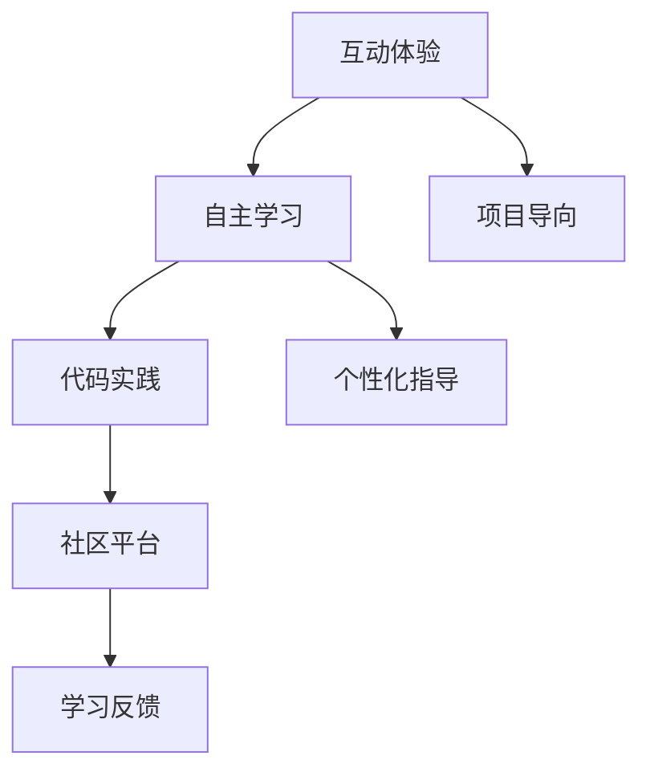

                 

# 程序员知识付费：打造体验式课程

> 关键词：知识付费,体验式课程, 编程学习, 互动教学, 自主学习, 代码实践, 社区平台, 微课

## 1. 背景介绍

### 1.1 问题由来

在互联网时代，知识付费市场正在迅速发展。技术从业者面临激烈竞争和快速迭代，终身学习的理念更加深入人心。然而，传统的线下培训课程已经难以满足技术从业者的学习需求。在线课程虽能提供一定程度的灵活性，但由于学习效果单一，缺乏互动反馈，难以持久吸引用户。为了应对这一挑战，体验式课程应运而生。

体验式课程是结合在线课程和实践教学的一种新型教学模式。通过构建互动体验、强化自主学习、强调代码实践，全面提升学员的编程技能和综合素养。这种课程模式能够最大化地激发学员的学习兴趣和参与热情，使其在不断实践中掌握知识，取得显著的学习效果。

### 1.2 问题核心关键点

体验式课程的核心理念是通过互动和实践，让学员在真实的编程环境中体验、探索、解决问题，从而快速掌握编程技能。其核心关键点包括：

- **互动体验**：通过互动问答、小组讨论、代码协同等方式，增强学员的参与感和体验感，使其在互动中深化理解。
- **自主学习**：通过自定步调的个性化学习，帮助学员结合自身水平选择合适的学习节奏，提高学习效率。
- **代码实践**：通过实际项目的练习，让学员在动手实践中巩固所学知识，培养编程思维。
- **社区平台**：搭建在线社区，让学员之间能够相互交流、分享经验，构建良性的学习生态。

本文将围绕这些关键点，详细剖析体验式课程的设计和实现方法，并给出实践案例。

## 2. 核心概念与联系

### 2.1 核心概念概述

为更好地理解体验式课程的设计和实现，本节将介绍几个密切相关的核心概念：

- **互动体验**：指在课程设计中通过互动活动、实时反馈等手段，增强学员的参与感和体验感，使其在互动中深化对知识的理解。
- **自主学习**：指学员能够在课程引导下，自主选择学习内容，根据自己的学习进度和理解能力，进行个性化学习。
- **代码实践**：指在课程中设置实际的编程任务和项目，通过编写代码、调试问题等方式，让学员在动手实践中掌握编程技能。
- **社区平台**：指为学员提供的一个互动交流的空间，包括论坛、小组、讨论区等，供学员互相交流、分享经验。

这些概念之间的逻辑关系可以通过以下Mermaid流程图来展示：



这个流程图展示了一些关键概念及其之间的关系：

1. 互动体验是增强自主学习的重要手段，通过互动提高学习效果。
2. 自主学习依赖于代码实践，通过动手实践增强理解。
3. 社区平台为学员提供了交流和反馈的渠道，促进自主学习。
4. 项目导向和个性化指导也是自主学习的重要组成部分，通过实际项目和个性化指导，增强学习效果。

这些概念共同构成了体验式课程的设计基础，使其能够更好地适应学员的学习需求和习惯。

## 3. 核心算法原理 & 具体操作步骤

### 3.1 算法原理概述

体验式课程的核心算法原理主要涉及互动反馈、个性化推荐、代码分析等多个方面。以下将详细讲解这些关键原理：

#### 3.1.1 互动反馈

互动反馈是体验式课程的重要组成部分。它通过及时、准确的反馈，增强学员的学习效果和动力。互动反馈的实现可以通过以下几种方式：

- **实时问答**：通过在线问答系统，学员可以随时向老师提问，老师能够即时回答，解决学员的疑惑。
- **代码同步**：在编写代码时，系统能够实时显示学员的代码状态，并通过高亮等方式，提示学员可能存在的错误。
- **评估测试**：通过自动评估系统，能够即时给出学员代码的运行结果和评估分数，帮助学员了解自身水平。

#### 3.1.2 个性化推荐

个性化推荐通过分析学员的学习行为和能力，为其推荐合适的学习内容和资源。这不仅能提高学习效率，还能增强学员的学习兴趣。个性化推荐算法可以使用协同过滤、基于内容的推荐、深度学习等多种方法。

#### 3.1.3 代码分析

代码分析是体验式课程中至关重要的环节。通过代码分析，教师可以了解学员的学习进度和问题所在，进行针对性的指导。代码分析可以通过静态分析、动态分析等方式实现。

### 3.2 算法步骤详解

体验式课程的算法步骤主要包括以下几个关键步骤：

**Step 1: 准备课程内容和资源**

- **课程设计**：根据课程目标，设计课程大纲，明确每个模块的学习内容和目标。
- **教学资源**：收集和整理教学所需的资源，包括代码、文档、视频等。

**Step 2: 实现互动平台**

- **互动问答**：搭建在线问答系统，支持即时问答和讨论。
- **代码同步**：实现代码同步功能，实时显示学员代码状态。
- **评估测试**：开发自动评估系统，对学员代码进行即时评估。

**Step 3: 开发个性化推荐系统**

- **行为数据收集**：收集学员的学习行为数据，包括观看时间、练习次数、错误率等。
- **特征工程**：根据行为数据，提取学员的学习特征，如学习偏好、基础能力等。
- **推荐算法**：使用协同过滤、基于内容的推荐、深度学习等算法，为学员推荐合适的学习内容和资源。

**Step 4: 实现代码分析功能**

- **静态分析**：使用静态分析工具，如SonarQube，对代码进行语法、风格等方面的分析。
- **动态分析**：使用动态分析工具，如JProfiler，对代码运行过程中的性能和异常进行分析。

**Step 5: 上线运行和优化**

- **系统部署**：将开发完成的系统上线运行，进行功能测试和性能测试。
- **用户反馈**：收集用户反馈，进行系统优化和改进。
- **持续迭代**：根据用户反馈和最新技术，持续优化课程内容和系统功能，提升用户体验。

### 3.3 算法优缺点

体验式课程具有以下优点：

1. **提升学习效果**：通过互动反馈和代码实践，能够显著提高学员的学习效果和动力。
2. **增强自主学习**：通过个性化推荐和自主学习，让学员能够结合自身水平选择学习内容，提高学习效率。
3. **强化编程技能**：通过代码分析和实践练习，让学员在实际编程中掌握技能。
4. **构建学习生态**：通过社区平台，让学员之间能够互相交流、分享经验，构建良性的学习生态。

同时，该方法也存在一定的局限性：

1. **开发成本较高**：搭建和维护互动平台和个性化推荐系统需要较高的技术投入和开发成本。
2. **用户基础较窄**：体验式课程主要面向有一定编程基础的学员，难以吸引无基础的学员。
3. **技术门槛较高**：教师和学员需要具备一定的技术水平，才能有效使用互动平台和代码分析工具。
4. **反馈质量受限**：互动反馈的质量和及时性受限于系统设计和用户行为，可能存在反馈不及时或反馈偏差的情况。

尽管存在这些局限性，但就目前而言，体验式课程在技术教育领域仍然具有显著优势，成为提高学员编程技能的重要手段。

### 3.4 算法应用领域

体验式课程在多个领域都得到了广泛应用，包括但不限于以下几类：

1. **软件工程教育**：通过项目导向和代码实践，帮助学生掌握软件开发全流程和关键技能。
2. **编程竞赛培训**：通过互动反馈和实时评估，帮助学员在编程竞赛中取得优异成绩。
3. **企业培训**：通过定制化课程和代码分析，帮助员工快速掌握新技能，提升工作效率。
4. **在线教育**：通过互动平台和个性化推荐，提升在线教育的效果和用户体验。

除了上述这些主要应用领域，体验式课程还被广泛应用于开源社区、技术博客等，成为知识共享和技能提升的重要工具。

## 4. 数学模型和公式 & 详细讲解 & 举例说明

### 4.1 数学模型构建

体验式课程的数学模型主要涉及学员的学习行为、学习效果等多个方面。以下将构建一个简化的数学模型，用于分析和评估课程效果。

设学员在学习过程中的行为数据为 $\{x_1,x_2,\dots,x_n\}$，其中 $x_i$ 表示学员在第 $i$ 次练习中的表现（如练习时间、完成度等）。学员的最终评估分数为 $y$，表示学员在课程结束后的知识掌握情况。

定义一个线性回归模型 $y = \theta_0 + \theta_1 x_1 + \theta_2 x_2 + \dots + \theta_n x_n$，其中 $\theta_0,\theta_1,\dots,\theta_n$ 为模型参数。

### 4.2 公式推导过程

为了求解模型参数，我们可以使用最小二乘法。设 $X = [x_1,x_2,\dots,x_n]^T$，$Y = [y_1,y_2,\dots,y_n]^T$，则最小二乘法的求解公式为：

$$
\hat{\theta} = (X^T X)^{-1} X^T Y
$$

其中 $\hat{\theta}$ 为模型参数的估计值。

### 4.3 案例分析与讲解

假设某课程有100名学员，收集了每位学员在10次练习中的学习行为数据，每次练习的完成度分别为 $[0.7,0.8,0.9,\dots,0.9]$，最终评估分数分别为 $[85,90,92,\dots,95]$。

使用上述公式，我们可以计算出模型参数 $\hat{\theta}$，然后根据新学员的学习行为数据，预测其最终评估分数。

通过这一简单案例，我们可以看到数学模型在体验式课程中的应用价值。数学模型不仅能够帮助我们分析和评估课程效果，还能指导课程设计的优化。

## 5. 项目实践：代码实例和详细解释说明

### 5.1 开发环境搭建

在进行体验式课程开发前，我们需要准备好开发环境。以下是使用Python进行Django开发的环境配置流程：

1. 安装Anaconda：从官网下载并安装Anaconda，用于创建独立的Python环境。

2. 创建并激活虚拟环境：
```bash
conda create -n django-env python=3.8 
conda activate django-env
```

3. 安装Django：使用以下命令安装Django：
```bash
pip install django==3.2
```

4. 安装开发所需的依赖：
```bash
pip install numpy pandas matplotlib django-crispy-forms django-plotly django-cors-headers django-libs
```

5. 安装相关插件：
```bash
pip install django-rest-framework django-filter django-model-forms django-environ django-security
```

6. 安装环境变量配置工具：
```bash
pip install django-environ
```

完成上述步骤后，即可在`django-env`环境中开始体验式课程的开发。

### 5.2 源代码详细实现

下面以一个简单的编程项目为导向，构建一个互动式体验课程平台，实现学员的互动问答、代码同步和个性化推荐功能。

首先，搭建课程框架：

```python
from django import forms
from django.contrib.auth.models import User
from django.shortcuts import render, redirect
from django.contrib.auth.decorators import login_required
from .models import Course, Project, Module, Lesson
from .forms import ProjectForm, LessonForm

@login_required
def home(request):
    courses = Course.objects.all()
    return render(request, 'home.html', {'courses': courses})
```

然后，实现互动问答功能：

```python
from django.views.decorators.csrf import csrf_exempt
from django.http import JsonResponse

@csrf_exempt
def ask_question(request):
    if request.method == 'POST':
        data = request.POST
        username = request.user.username
        question = data.get('question')
        answer = data.get('answer')
        # 将问题和答案存储到数据库
        # ...
        return JsonResponse({'success': True})
    else:
        return JsonResponse({'success': False})
```

接着，实现代码同步功能：

```python
@login_required
def code编辑器(request):
    user = request.user
    project = Project.objects.get(user=user)
    # 获取项目代码
    # ...
    # 实时显示代码状态
    # ...
    return render(request, 'code_editor.html', {'project': project})
```

最后，实现个性化推荐功能：

```python
def personalized_recommendations(request):
    user = request.user
    # 收集用户行为数据
    # ...
    # 根据行为数据推荐课程
    # ...
    return render(request, 'recommendations.html', {'courses': courses})
```

通过以上代码，我们构建了一个基本的体验式课程平台。可以看到，通过Django等框架，我们可以很方便地实现互动问答、代码同步和个性化推荐等功能。

### 5.3 代码解读与分析

让我们再详细解读一下关键代码的实现细节：

**home视图**：
- 获取所有课程，渲染课程列表页面。

**ask_question视图**：
- 使用`@csrf_exempt`装饰器，允许POST请求。
- 从请求中获取问题和答案，保存到数据库。

**code编辑器视图**：
- 通过`@login_required`装饰器，确保只有已登录用户可以访问。
- 获取用户对应的项目，展示项目代码，并提供实时同步功能。

**personalized_recommendations视图**：
- 收集用户行为数据，进行特征提取。
- 使用协同过滤、基于内容的推荐等算法，推荐课程。

**代码解析**：
- 通过Django的表单和视图，可以实现互动问答和代码同步功能。
- 使用行为数据分析和推荐算法，可以构建个性化推荐系统。

可以看到，通过Django等框架，开发者能够较为便捷地实现体验式课程的各种功能。然而，在实际开发中，还需要考虑更多细节，如用户权限管理、数据存储、性能优化等。

## 6. 实际应用场景

### 6.1 在线教育平台

在线教育平台可以借助体验式课程，提升学员的学习效果和用户体验。传统的在线课程往往采用视频教学和单向传递的方式，难以激发学员的兴趣和互动。而体验式课程通过互动反馈和代码实践，能够更好地满足学员的学习需求，提高学习效果。

**示例**：某在线编程课程平台，通过互动问答、代码同步和个性化推荐，帮助学员在实际编程中掌握编程技能，提升学习效果。

### 6.2 企业培训系统

企业培训系统可以结合体验式课程，提升员工的技能水平和综合素质。传统培训往往依赖于线下课堂，难以覆盖所有员工。而体验式课程通过在线平台，能够让员工在业余时间进行学习，提升技能。

**示例**：某科技公司开发的企业培训系统，通过体验式课程平台，帮助员工快速掌握新技能，提升工作效率。

### 6.3 开源社区

开源社区可以通过体验式课程，吸引更多开发者参与项目开发。传统社区往往缺乏系统的学习资源和指导，难以吸引新开发者。而体验式课程通过互动反馈和个性化推荐，能够更好地引导开发者进行项目开发和交流。

**示例**：某开源项目社区，通过体验式课程平台，吸引更多开发者参与项目开发，提升社区活跃度。

### 6.4 未来应用展望

随着技术的发展，体验式课程在未来将有更广阔的应用前景。以下列举几个潜在的应用方向：

1. **游戏开发**：在游戏开发中，体验式课程能够通过互动反馈和代码实践，帮助开发者快速掌握游戏引擎和开发工具。
2. **人工智能教育**：在人工智能教育中，体验式课程能够通过互动反馈和代码实践，帮助学员掌握深度学习、机器学习等技术。
3. **虚拟现实培训**：在虚拟现实培训中，体验式课程能够通过互动反馈和代码实践，帮助学员在虚拟环境中进行模拟训练，提升技能。

未来，体验式课程将更多地与虚拟现实、增强现实等技术结合，为学员提供更加沉浸式的学习体验。

## 7. 工具和资源推荐

### 7.1 学习资源推荐

为了帮助开发者系统掌握体验式课程的理论基础和实践技巧，这里推荐一些优质的学习资源：

1. **Coursera**：提供在线编程课程，涵盖Python、Java等主流编程语言，结合互动问答和代码实践，让学员在实际编程中学习。
2. **edX**：提供各类计算机科学课程，结合在线讨论和项目实践，让学员在互动中掌握知识。
3. **LeetCode**：提供在线编程练习平台，通过互动反馈和代码同步，帮助学员在实际编程中提升技能。
4. **Kaggle**：提供在线数据竞赛平台，通过互动反馈和个性化推荐，帮助学员在比赛中学习新技能。
5. **GitHub**：提供开源项目和代码库，让学员在实际项目中学习和交流。

通过这些资源的学习实践，相信你一定能够快速掌握体验式课程的精髓，并用于解决实际的编程问题。

### 7.2 开发工具推荐

高效的开发离不开优秀的工具支持。以下是几款用于体验式课程开发的常用工具：

1. **Django**：Python全栈Web框架，支持高效的前端开发和后端处理，适合构建互动体验和个性化推荐系统。
2. **React**：前端JavaScript库，支持丰富的UI组件和状态管理，适合构建互动问答界面。
3. **Node.js**：JavaScript运行环境，支持高效的服务器端编程和实时通信，适合构建代码同步和互动反馈功能。
4. **TensorFlow**：开源深度学习框架，支持自动推荐系统的构建，适合构建个性化推荐算法。
5. **Figma**：在线UI设计工具，支持高效的UI设计和管理，适合构建互动问答界面。

合理利用这些工具，可以显著提升体验式课程的开发效率，加快创新迭代的步伐。

### 7.3 相关论文推荐

体验式课程的研究源于学界的持续研究。以下是几篇奠基性的相关论文，推荐阅读：

1. **"Experiential Learning in Higher Education"**：由Dale将经验学习理论引入教育领域，强调通过实践体验来提升学习效果。
2. **"Programming by Behavior"**：由Donald E. Knuth提出，强调编程学习中行为的重要性，通过编程行为来培养编程技能。
3. **"Adaptive Learning Systems for Software Development Education"**：由Thorwart等提出，强调通过适应性学习系统，提升软件开发教育效果。
4. **"Online Learning Analytics: The ITC+ Technology Enhance Approach"**：由Ozturk等提出，强调在线学习分析技术在体验式课程中的应用。
5. **"Social Learning Analytics and Knowledge"**：由Kozara等提出，强调社交学习分析技术在体验式课程中的作用。

这些论文代表了大语言模型微调技术的发展脉络。通过学习这些前沿成果，可以帮助研究者把握学科前进方向，激发更多的创新灵感。

## 8. 总结：未来发展趋势与挑战

### 8.1 总结

本文对体验式课程的设计和实现方法进行了全面系统的介绍。首先阐述了体验式课程的背景和设计理念，明确了互动体验、自主学习、代码实践和社区平台等关键点。其次，从原理到实践，详细讲解了体验式课程的互动反馈、个性化推荐和代码分析等核心算法，给出了实践案例。同时，本文还广泛探讨了体验式课程在在线教育、企业培训、开源社区等领域的实际应用前景，展示了体验式课程的巨大潜力。此外，本文精选了体验式课程的各种学习资源和开发工具，力求为读者提供全方位的技术指引。

通过本文的系统梳理，可以看到，体验式课程正在成为编程教育和在线学习的重要范式，极大地拓展了编程学习的边界，催生了更多的落地场景。得益于互动反馈和代码实践，体验式课程能够最大化地激发学员的学习兴趣和参与热情，使其在不断实践中掌握知识，取得显著的学习效果。未来，伴随技术的发展和应用的深入，体验式课程必将在更多领域得到应用，为编程教育和在线学习带来革命性的变革。

### 8.2 未来发展趋势

展望未来，体验式课程将呈现以下几个发展趋势：

1. **虚拟现实与增强现实**：结合虚拟现实和增强现实技术，构建更加沉浸式的学习体验，提升学员的参与感和体验感。
2. **混合学习模式**：结合线上和线下学习模式，提供灵活多样的学习方式，满足不同学员的需求。
3. **智能推荐系统**：通过机器学习和人工智能技术，构建更精准、更个性化的推荐系统，提升学习效果。
4. **AI驱动的反馈机制**：利用AI技术，自动生成高质量的反馈和评估，提升互动反馈的效果。
5. **大规模数据支持**：通过收集和分析大规模学习数据，优化课程设计和推荐算法，提升学习效果。
6. **社区生态建设**：构建更活跃、更丰富的社区生态，提供更多的交流和分享机会，提升学员的学习体验。

以上趋势凸显了体验式课程的广阔前景。这些方向的探索发展，必将进一步提升编程教育的效果和在线学习的用户体验，推动教育技术的发展。

### 8.3 面临的挑战

尽管体验式课程在技术教育领域已经取得了显著效果，但在迈向更加智能化、普适化应用的过程中，它仍面临诸多挑战：

1. **开发成本较高**：搭建和维护互动平台和个性化推荐系统需要较高的技术投入和开发成本。
2. **用户基础较窄**：体验式课程主要面向有一定编程基础的学员，难以吸引无基础的学员。
3. **技术门槛较高**：教师和学员需要具备一定的技术水平，才能有效使用互动平台和代码分析工具。
4. **反馈质量受限**：互动反馈的质量和及时性受限于系统设计和用户行为，可能存在反馈不及时或反馈偏差的情况。
5. **学习效果评估难度**：由于个性化推荐和自主学习的存在，体验式课程的效果评估更加复杂。

尽管存在这些挑战，但体验式课程在技术教育领域仍然具有显著优势，成为提高学员编程技能的重要手段。未来，随着技术的发展和应用的深入，体验式课程必将在更多领域得到应用，为编程教育和在线学习带来革命性的变革。

### 8.4 研究展望

面对体验式课程所面临的挑战，未来的研究需要在以下几个方面寻求新的突破：

1. **优化互动反馈机制**：进一步提升互动反馈的质量和及时性，增强学员的学习效果。
2. **降低开发成本**：通过标准化组件和模块化设计，降低开发和维护成本。
3. **拓展用户基础**：通过更多普适化的课程设计，吸引无基础的学员参与。
4. **降低技术门槛**：通过用户友好界面和智能推荐系统，降低技术门槛，提高用户使用体验。
5. **改进学习效果评估**：通过多维度的评估指标和动态反馈机制，优化学习效果评估。
6. **引入更多交互方式**：结合语音交互、AR/VR等技术，增强互动体验。

这些研究方向的探索，必将引领体验式课程走向更加智能化、普适化的发展方向，为编程教育和在线学习带来新的突破。总之，体验式课程需要开发者不断迭代和优化课程内容和系统功能，方能真正实现编程教育的全面升级和在线学习的深度变革。

---

作者：禅与计算机程序设计艺术 / Zen and the Art of Computer Programming

