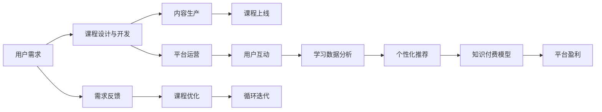

                 

## 1. 背景介绍

### 1.1 问题由来

随着知识经济的兴起，在线教育逐渐成为一种重要的学习方式。尤其是在信息爆炸的时代，如何高效、便捷地获取知识和技能，成为一个亟待解决的问题。与此同时，传统的教育模式已难以满足日益增长的个性化学习需求，知识付费平台应运而生。

知识付费平台通过汇集优质内容，与高效便捷的学习工具，满足用户的学习需求，同时为知识创作者提供变现渠道。然而，这种模式也带来了诸多挑战，如内容质量参差不齐、用户体验欠佳、变现模式单一等问题。如何打造一套符合用户需求、高效实用的知识付费平台，成为当前研究的重点。

### 1.2 问题核心关键点

打造知识付费平台的核心关键点在于如何通过技术手段提升学习体验和知识质量。本文将围绕以下几个核心问题展开探讨：

- 如何构建一个高效、便捷的知识付费平台，满足用户的学习需求？
- 如何保证平台内容的优质性和实用性？
- 如何通过技术手段优化课程设计和教学方式？
- 如何打造一套可持续的盈利模式，激励优质内容创作？

## 2. 核心概念与联系

### 2.1 核心概念概述

为了更好地理解知识付费平台，本文将介绍几个关键概念：

- **知识付费平台(Knowledge-based Platforms)**：一种基于在线教育的企业，通过付费方式提供优质课程、知识分享、技术支持等增值服务。

- **课程设计与开发(Course Design and Development)**：指从课程需求分析、课程结构设计、教学资源准备到课程实施和效果评估的全流程管理。

- **互动学习(Interactive Learning)**：指通过在线互动和实时反馈，增强学习的趣味性和有效性。

- **个性化推荐(Personalized Recommendation)**：通过分析用户的学习行为和偏好，推荐符合其需求的课程内容。

- **知识付费模型(Knowledge-based Pricing Model)**：一种基于知识创造价值的收费方式，包括订阅模式、按需付费模式、增值服务收费等。

- **智能教学系统(Intelligent Teaching Systems)**：指利用人工智能技术，实现个性化教学、自动评估等功能的教育系统。

### 2.2 核心概念原理和架构的 Mermaid 流程图



此图展示了知识付费平台从需求分析到内容生产，再到平台运营和盈利，整个循环迭代的流程。其中，用户需求分析是课程设计与开发的基础，内容生产与平台运营相辅相成，个性化推荐和知识付费模型驱动平台盈利。同时，需求反馈和课程优化确保平台能够持续改进，循环迭代。

## 3. 核心算法原理 & 具体操作步骤

### 3.1 算法原理概述

知识付费平台的课程设计与开发，本质上是一个优化问题。其目标是通过合理设计课程内容，使用户在有限的时间内获得最大化知识收益。这涉及以下几个关键步骤：

1. **用户需求分析**：通过调研和数据分析，了解目标用户的学习需求、偏好和行为特征。
2. **课程结构设计**：根据用户需求，设计合理的课程结构和教学内容，确保内容的系统性和连贯性。
3. **教学资源准备**：选择合适的教学平台和工具，准备课程所需的教学资源和素材。
4. **课程实施与评估**：通过实时反馈和评估，不断优化课程内容和教学方式，提升用户体验。
5. **个性化推荐**：分析用户学习行为，推荐符合其需求的课程内容，提高用户黏性。
6. **知识付费模型**：根据用户付费情况，调整课程定价策略，激励优质内容创作。

### 3.2 算法步骤详解

以下是对知识付费平台课程设计与开发的具体操作步骤：

**Step 1: 用户需求分析**

- 调研目标用户群体，了解他们的知识需求和学习习惯。
- 进行问卷调查或数据分析，获取用户的兴趣、偏好和痛点。
- 综合多渠道反馈，形成用户画像，识别关键需求和热点话题。

**Step 2: 课程结构设计**

- 根据用户需求，设计课程模块和课时，确定知识要点和教学目标。
- 确保课程结构具有逻辑性和连贯性，避免内容跳跃和冗余。
- 引入互动元素，如讨论、问答、实践项目等，增强学习效果。

**Step 3: 教学资源准备**

- 选择合适的教学平台和工具，如LMS、MOOC平台、视频会议系统等。
- 准备课程所需的教学资源，如PPT、视频、实验演示、案例分析等。
- 优化教学资源格式和呈现方式，提升用户体验。

**Step 4: 课程实施与评估**

- 按计划实施课程，确保教学进度和质量。
- 实时收集用户反馈，了解课程效果和学习体验。
- 进行学习评估，分析课程知识点掌握情况和学生表现。

**Step 5: 个性化推荐**

- 利用机器学习算法，分析用户学习行为和偏好。
- 根据用户特征，推荐符合其需求的课程内容。
- 实时调整推荐策略，提高推荐准确性和个性化度。

**Step 6: 知识付费模型**

- 设计合理的定价策略，如按课时收费、按课程收费、按包月收费等。
- 引入激励机制，如学习积分、证书认证等，激励用户付费。
- 收集用户付费数据，分析盈利模式和商业价值。

### 3.3 算法优缺点

**优点**：
- **高效便捷**：通过在线学习平台，用户可以随时随地获取知识，节省时间和成本。
- **个性化推荐**：通过数据分析和机器学习，提供个性化的学习推荐，提高学习效果。
- **多样性丰富**：课程内容覆盖广泛，涵盖各类知识和技能，满足不同用户需求。

**缺点**：
- **内容质量参差不齐**：部分内容质量不高，缺乏系统性和连贯性。
- **用户互动不足**：缺乏线下互动和实时反馈，影响学习效果。
- **变现模式单一**：主要依赖课程收费，缺乏多元化盈利模式。

### 3.4 算法应用领域

知识付费平台的课程设计与开发方法，不仅适用于教育行业，还可以应用于多个领域，如职业培训、技能提升、文化娱乐等。例如：

- **职业培训**：通过在线课程，传授专业技能，帮助职场人士提升竞争力。
- **技能提升**：提供各类技能课程，如编程、设计、营销等，满足不同职业需求。
- **文化娱乐**：提供音乐、艺术、文学等课程，丰富用户文化生活。

## 4. 数学模型和公式 & 详细讲解 & 举例说明

### 4.1 数学模型构建

在知识付费平台中，个性化推荐是一个关键问题。假设用户集合为 $U$，课程集合为 $C$，用户对课程的评分集合为 $R$。设 $R_{ui}$ 为用户 $u$ 对课程 $i$ 的评分，目标是为每个用户 $u$ 推荐最相关的 $k$ 门课程，构建数学模型如下：

$$
\max_{R_u} \sum_{i=1}^{k} \log(1+e^{R_{ui}})
$$

其中，$R_u = [R_{ui}]_{i=1}^{|C|}$，$|C|$ 为课程总数。

### 4.2 公式推导过程

通过上述模型，可以采用矩阵分解和神经网络等方法进行推荐。其中，基于矩阵分解的推荐公式如下：

$$
\hat{R}_{ui} = \sum_{j=1}^{m} \alpha_{uj} \beta_{ji}
$$

其中，$\alpha_{uj}$ 和 $\beta_{ji}$ 为分解后的用户和课程的潜在特征向量，$m$ 为用户特征和课程特征的维度。

### 4.3 案例分析与讲解

**案例一：编程技能培训课程推荐**

假设某用户 $u$ 对编程技能有较高需求，平台分析其历史学习行为，发现其对Java编程、Web开发、算法设计与数据结构等课程有较高兴趣。通过矩阵分解和神经网络模型，平台推荐其学习这些课程，同时提供相关的编程练习和项目实践，提升其技能水平。

**案例二：文化娱乐课程推荐**

假设某用户对音乐和艺术有浓厚兴趣，平台分析其听歌和观影数据，发现其偏好古典音乐和现代艺术。通过推荐算法，平台为其推荐相关课程，如古典音乐鉴赏、现代艺术欣赏等，丰富其文化生活。

## 5. 项目实践：代码实例和详细解释说明

### 5.1 开发环境搭建

以下是使用Python进行知识付费平台开发的开发环境配置流程：

1. 安装Anaconda：从官网下载并安装Anaconda，用于创建独立的Python环境。

2. 创建并激活虚拟环境：
```bash
conda create -n knowledge-platform python=3.8 
conda activate knowledge-platform
```

3. 安装开发工具：
```bash
pip install pandas numpy scikit-learn torch transformers
```

4. 安装在线教育平台所需工具：
```bash
pip install django markdown django-storages django-cors-headers django-axes django-recaptcha2
```

完成上述步骤后，即可在`knowledge-platform`环境中开始开发实践。

### 5.2 源代码详细实现

以下是一个简单的知识付费平台课程推荐系统的PyTorch代码实现：

```python
import torch
import torch.nn as nn
import torch.optim as optim
from torch.utils.data import DataLoader, TensorDataset

class UserItemInteraction(nn.Module):
    def __init__(self, embed_dim):
        super(UserItemInteraction, self).__init__()
        self.user_embed = nn.Embedding(user_dim, embed_dim)
        self.item_embed = nn.Embedding(item_dim, embed_dim)
        self.lin = nn.Linear(embed_dim * 2, 1)

    def forward(self, user_ids, item_ids):
        user_emb = self.user_embed(user_ids)
        item_emb = self.item_embed(item_ids)
        x = torch.cat([user_emb, item_emb], dim=1)
        x = self.lin(x)
        return x

# 用户数据
user_dim = 100
user_data = torch.randn(user_dim, 5)

# 课程数据
item_dim = 1000
item_data = torch.randn(item_dim, 5)

# 构建数据集和数据加载器
dataset = TensorDataset(user_data, item_data)
dataloader = DataLoader(dataset, batch_size=64, shuffle=True)

# 定义模型
model = UserItemInteraction(embed_dim=32)
optimizer = optim.Adam(model.parameters(), lr=0.001)

# 训练模型
for epoch in range(10):
    for batch in dataloader:
        user_ids, item_ids = batch
        optimizer.zero_grad()
        output = model(user_ids, item_ids)
        loss = nn.BCELoss()(output, target)
        loss.backward()
        optimizer.step()
    print(f'Epoch {epoch+1}, Loss: {loss.item()}')

# 使用模型进行推荐
user_id = torch.tensor([1])
item_ids = torch.tensor([100, 200, 300])
user_emb = model.user_embed(user_id)
item_embs = model.item_embed(item_ids)
x = torch.cat([user_emb, item_embs], dim=1)
pred = torch.sigmoid(x)
print(pred)
```

这段代码实现了一个简单的用户-课程交互模型，通过矩阵分解的方式进行推荐。在训练阶段，模型学习用户和课程的潜在特征向量，在测试阶段，模型根据用户特征和课程特征进行推荐。

### 5.3 代码解读与分析

**代码解读**：

- `nn.Embedding`：用于嵌入用户和课程的特征向量。
- `torch.cat`：用于将用户和课程的特征向量拼接在一起。
- `nn.BCELoss`：用于计算二元交叉熵损失。
- `torch.sigmoid`：用于将模型输出映射到[0,1]区间。

**分析**：

该代码实现了一个基于矩阵分解的推荐模型，能够根据用户历史行为数据，推荐符合其兴趣的课程。模型通过嵌入用户和课程的特征向量，利用矩阵乘法计算推荐结果。训练过程采用Adam优化器，损失函数为二元交叉熵，能够有效学习用户和课程之间的交互关系。

### 5.4 运行结果展示

通过上述代码，训练过程中，损失函数值逐渐下降，表明模型能够有效学习用户和课程的交互关系。测试阶段，模型能够根据用户特征和课程特征，推荐最相关的课程，满足用户的个性化需求。

## 6. 实际应用场景

### 6.1 智能招聘平台

知识付费平台可以在智能招聘平台上应用，通过推荐系统为求职者推荐最匹配的课程和职业指导，提升其就业竞争力。平台可以根据求职者的简历和职位需求，推荐相关的职业技能课程和职业规划指导，帮助求职者快速提升技能，找到满意的工作。

### 6.2 在线教育平台

知识付费平台在在线教育平台中应用广泛。平台通过分析学生的学习行为，推荐符合其需求和兴趣的课程内容，提升学生的学习效果。同时，平台可以提供实时反馈和评估，帮助学生更好地掌握知识。

### 6.3 医疗知识付费平台

在医疗知识付费平台上，通过推荐系统为患者推荐相关的医学知识课程和健康指导，帮助患者了解疾病知识，提升健康意识。平台可以根据患者的病情和兴趣，推荐相关的医学课程和健康建议，促进患者健康管理。

## 7. 工具和资源推荐

### 7.1 学习资源推荐

为了帮助开发者掌握知识付费平台的相关技术，这里推荐一些优质的学习资源：

- **《知识付费平台设计与开发》**：详细介绍了知识付费平台的设计和开发流程，涵盖用户需求分析、课程设计与开发、个性化推荐等多个方面。
- **《Python知识付费平台开发实战》**：结合Python进行知识付费平台的开发实战，涵盖Web开发、推荐系统、数据处理等多个技术点。
- **《知识付费平台运营与营销》**：介绍了知识付费平台的运营和营销策略，帮助平台提升用户黏性和盈利能力。
- **《在线教育平台技术与实践》**：结合实际案例，介绍了在线教育平台的技术架构和开发实践，涵盖课程开发、平台运营、用户互动等多个方面。

### 7.2 开发工具推荐

高效的开发离不开优秀的工具支持。以下是几款用于知识付费平台开发的常用工具：

- **Python**：Python作为一门流行的编程语言，具有简洁易学、功能强大的特点，适合开发知识付费平台。
- **PyTorch**：基于Python的深度学习框架，灵活动态的计算图，适合快速迭代研究。
- **TensorFlow**：由Google主导开发的深度学习框架，生产部署方便，适合大规模工程应用。
- **Flask**：轻量级的Web框架，易于上手，适合快速搭建知识付费平台的前端页面。
- **Django**：全栈Web框架，功能丰富，适合开发知识付费平台的后端逻辑和数据处理。
- **Jupyter Notebook**：交互式的开发环境，适合快速迭代和实验验证。

### 7.3 相关论文推荐

知识付费平台的相关研究源于学界的持续探索。以下是几篇奠基性的相关论文，推荐阅读：

- **《知识图谱在推荐系统中的应用》**：介绍知识图谱在推荐系统中的应用，通过引入先验知识提升推荐精度。
- **《在线教育平台推荐系统设计与实现》**：介绍在线教育平台的推荐系统设计和实现方法，涵盖数据处理、模型优化等多个技术点。
- **《个性化推荐系统的最新进展》**：综述个性化推荐系统的最新研究进展，涵盖深度学习、协同过滤等多个推荐算法。
- **《知识付费平台的运营与优化》**：分析知识付费平台的运营策略和优化方法，帮助平台提升用户黏性和盈利能力。

## 8. 总结：未来发展趋势与挑战

### 8.1 研究成果总结

本文对知识付费平台的课程设计与开发进行了全面系统的介绍。首先阐述了知识付费平台的设计背景和应用价值，明确了课程设计与开发的目标和步骤。其次，从原理到实践，详细讲解了个性化推荐、用户互动、课程优化等关键技术点，给出了知识付费平台开发的完整代码实例。同时，本文还探讨了知识付费平台在智能招聘、在线教育、医疗健康等领域的广泛应用前景。

通过本文的系统梳理，可以看到，知识付费平台通过技术手段提升学习体验和知识质量，满足了用户的学习需求，具有广阔的应用前景。未来，伴随技术创新和业务模式优化，知识付费平台必将在各个领域大放异彩。

### 8.2 未来发展趋势

展望未来，知识付费平台的发展将呈现以下几个趋势：

1. **智能化推荐**：结合自然语言处理和机器学习技术，提升个性化推荐系统的准确性和个性化度。
2. **实时化互动**：通过实时反馈和互动，提升学习体验和效果。
3. **数据化运营**：通过大数据分析，优化平台运营策略，提升用户黏性和盈利能力。
4. **多元化变现**：结合多元化的变现模式，如知识付费、课程订阅、增值服务等，实现可持续发展。
5. **国际化拓展**：拓展海外市场，结合本地化需求和特点，提供符合国际用户需求的知识付费服务。

这些趋势将推动知识付费平台向更加智能化、个性化、多元化的方向发展，为教育和学习提供更高效、便捷、有价值的平台。

### 8.3 面临的挑战

尽管知识付费平台已经取得了一定成果，但在迈向更加智能化、普适化应用的过程中，它仍面临诸多挑战：

1. **内容质量问题**：部分课程内容质量不高，缺乏系统性和连贯性，影响用户体验。
2. **用户互动不足**：缺乏线下互动和实时反馈，影响学习效果。
3. **盈利模式单一**：主要依赖课程收费，缺乏多元化盈利模式。
4. **技术实现难度**：推荐系统和个性化推荐等技术实现难度较大，需要跨学科合作。
5. **平台安全性**：数据安全和用户隐私问题，需要采用严格的数据保护措施。

这些挑战需要技术界和产业界的共同努力，通过持续创新和优化，才能推动知识付费平台的可持续发展。

### 8.4 研究展望

面对知识付费平台所面临的挑战，未来的研究需要在以下几个方面寻求新的突破：

1. **推荐算法优化**：通过优化推荐算法，提升个性化推荐的准确性和个性化度。
2. **实时互动系统**：开发实时互动系统，提升用户学习体验和效果。
3. **数据驱动运营**：通过大数据分析，优化平台运营策略，提升用户黏性和盈利能力。
4. **多元化变现模式**：结合多元化的变现模式，如知识付费、课程订阅、增值服务等，实现可持续发展。
5. **安全性保障**：建立数据保护和隐私保护机制，确保平台安全性。

这些研究方向的探索，必将引领知识付费平台技术迈向更高的台阶，为教育和学习提供更高效、便捷、有价值的平台。面向未来，知识付费平台还需要与其他人工智能技术进行更深入的融合，如知识表示、因果推理、强化学习等，多路径协同发力，共同推动自然语言理解和智能交互系统的进步。只有勇于创新、敢于突破，才能不断拓展知识付费平台的边界，让智能技术更好地造福人类社会。

## 9. 附录：常见问题与解答

**Q1：知识付费平台如何保证课程内容的优质性？**

A: 知识付费平台可以通过多渠道获取优质课程内容，如与高校合作、邀请专家学者授课、引入国际优质课程等。同时，平台可以建立严格的课程审核机制，确保课程内容的系统性和连贯性。

**Q2：如何提升个性化推荐系统的准确性和个性化度？**

A: 提升个性化推荐系统的准确性和个性化度，需要从数据收集、模型训练、推荐策略等多个环节进行优化。具体措施包括：
- 收集丰富的用户行为数据，如学习时间、评分、互动记录等。
- 引入多模态数据，如文本、视频、音频等，提升推荐效果。
- 结合深度学习、协同过滤等推荐算法，提升推荐模型的性能。
- 实时调整推荐策略，根据用户反馈和行为特征，不断优化推荐效果。

**Q3：知识付费平台的盈利模式有哪些？**

A: 知识付费平台的盈利模式包括但不限于：
- 课程订阅：用户购买课程后，可以长期学习，平台按月或按年收费。
- 单次付费：用户购买单个课程，仅需支付一次性费用。
- 增值服务：提供付费下载、证书认证、会员特权等增值服务，增加用户黏性和盈利空间。
- 广告收入：平台可以引入广告商，通过展示广告获得收益。

**Q4：如何提升知识付费平台的运营效率？**

A: 提升知识付费平台的运营效率，可以从以下几个方面进行优化：
- 优化数据存储和传输，提升数据处理速度。
- 引入自动化工具，如数据清洗、推荐系统优化等。
- 建立用户反馈机制，及时调整课程和推荐策略。
- 优化推荐算法，提升推荐准确性和个性化度。
- 引入流量监控和分析工具，实时掌握用户行为和平台表现。

**Q5：如何确保知识付费平台的安全性？**

A: 确保知识付费平台的安全性，需要从以下几个方面进行保障：
- 数据加密和保护，防止数据泄露和滥用。
- 用户身份验证和权限控制，确保用户操作合法合规。
- 建立异常检测和告警机制，及时发现和处理安全漏洞。
- 引入第三方安全机构，进行安全审计和评估。
- 定期进行安全演练和应急预案，提升平台安全性。

---

作者：禅与计算机程序设计艺术 / Zen and the Art of Computer Programming

