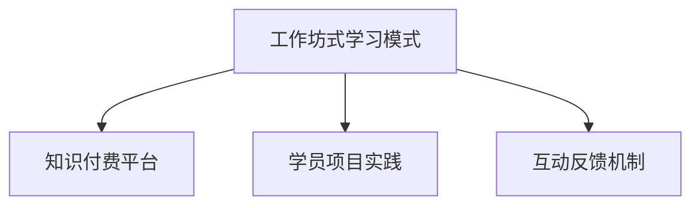

                 

# 程序员知识付费：打造工作坊式学习模式

## 1. 背景介绍

### 1.1 问题由来

随着信息技术的快速发展，程序员的职业生涯也面临着巨大的挑战和机遇。新技术不断涌现，行业需求快速变化，终身学习成为程序员职业生涯的必由之路。但传统的教育模式难以跟上技术发展的节奏，学习效率低，知识更新慢。在这种情况下，知识付费应运而生，成为程序员学习和成长的重要途径。

然而，现有的知识付费模式存在诸多问题：内容同质化严重，缺乏针对性；课程质量参差不齐，难以选择；互动性不足，学习效果有限。为了解决这些问题，本文提出了一种基于工作坊式学习模式的程序员知识付费方案，旨在通过更高效、更个性化的学习方式，帮助程序员更快更好地掌握新技术。

### 1.2 问题核心关键点

本文将详细介绍基于工作坊式学习模式的程序员知识付费方案，核心关键点包括：

- 工作坊式学习模式：通过实际问题导向，组织小班教学，以项目为中心，引导学员深入掌握技术。
- 知识付费平台：构建内容平台，提供高质量的在线课程和实践项目，覆盖编程语言、框架、工具等多个领域。
- 学员项目实践：将学员分入不同的项目小组，通过实际操作，深入理解和掌握项目需求。
- 互动反馈机制：设立助教和导师制度，提供及时的指导和反馈，帮助学员解决问题，提升学习效果。

### 1.3 问题研究意义

本文提出的工作坊式学习模式，旨在通过高效、个性化的学习方式，提升程序员的学习效率和项目实践能力，帮助其快速适应新技术，提升职业生涯竞争力。同时，该模式也可以促进知识付费行业的发展，为更多高质量课程的开发提供动力。

## 2. 核心概念与联系

### 2.1 核心概念概述

为更好地理解本文提出的工作坊式学习模式，本节将介绍几个密切相关的核心概念：

- 工作坊式学习模式(Workshop-based Learning)：通过实际问题导向，组织小班教学，以项目为中心，引导学员深入掌握技术的学习方式。
- 知识付费平台(Knowledge Paywall Platform)：基于互联网，提供高质量的在线课程和实践项目，覆盖编程语言、框架、工具等多个领域，用于知识付费的线上平台。
- 学员项目实践(Student Project Practice)：将学员分入不同的项目小组，通过实际操作，深入理解和掌握项目需求，提升项目实践能力。
- 互动反馈机制(Interactive Feedback Mechanism)：设立助教和导师制度，提供及时的指导和反馈，帮助学员解决问题，提升学习效果。

这些核心概念之间的逻辑关系可以通过以下Mermaid流程图来展示：



这个流程图展示了几大概念之间的关系：

1. 工作坊式学习模式是知识付费平台的基础，为其提供内容和学习方式。
2. 知识付费平台通过组织工作坊式学习模式，提升学员项目实践能力。
3. 互动反馈机制在知识付费平台中起到关键作用，确保学习效果。

这些核心概念共同构成了本文提出知识付费方案的基础框架，使其能够在知识付费行业中得到广泛应用。

## 3. 核心算法原理 & 具体操作步骤
### 3.1 算法原理概述

基于工作坊式学习模式的程序员知识付费方案，本质上是一种有组织的、系统化的学习模式。其核心思想是：通过实际问题导向，组织小班教学，以项目为中心，引导学员深入掌握技术。

形式化地，假设知识付费平台提供的一门课程内容为 $C$，学员数量为 $N$，实际问题数量为 $P$。工作坊式学习模式的目标是找到最优的学习策略 $\mathcal{S}$，使得在给定时间和资源约束下，课程内容 $C$ 被 $N$ 名学员在最短时间内掌握，并能够解决 $P$ 个实际问题。

目标函数为：

$$
\max_{\mathcal{S}} \frac{P}{T + S}
$$

其中 $T$ 为学员掌握课程内容 $C$ 所需的时间，$S$ 为课程内容 $C$ 的难度，$P$ 为学员解决实际问题 $P$ 的数量。

工作坊式学习模式通过优化学习策略 $\mathcal{S}$，使得在时间和资源有限的情况下，尽可能提升学员的学习效率和解决问题的能力。

### 3.2 算法步骤详解

基于工作坊式学习模式的程序员知识付费方案，一般包括以下几个关键步骤：

**Step 1: 课程内容准备**
- 开发高质量的课程内容，包括视频讲解、代码示例、作业练习等，覆盖编程语言、框架、工具等多个领域。
- 设计实际的编程问题，供学员在课程结束前解决。

**Step 2: 小班分组教学**
- 将学员按照基础水平、兴趣方向等进行分组，每组约5-10人。
- 为每组分配助教和导师，提供个性化的指导和反馈。

**Step 3: 课程安排和进度管理**
- 制定课程学习计划，包括每日学习任务、测试考核等。
- 根据学员的学习进度，调整课程内容和难度，确保学员能够跟上学习节奏。

**Step 4: 项目实践和小组讨论**
- 将学员分入不同的项目小组，分配实际编程问题，进行项目实践。
- 定期组织小组讨论，分享问题解决心得和经验。

**Step 5: 互动反馈和进度评估**
- 助教和导师及时解答学员的问题，提供个性化的指导和反馈。
- 定期进行课程测试，评估学员的学习效果，调整学习策略。

**Step 6: 课程总结和成果展示**
- 课程结束后，进行项目展示和总结，评估学员的学习成果。
- 收集学员反馈，不断改进课程内容和教学方法。

以上是基于工作坊式学习模式的程序员知识付费方案的一般流程。在实际应用中，还需要针对具体课程的特点，对各环节进行优化设计，如改进课程内容设计，引入更多的互动环节，搜索最优的助教和导师组合等，以进一步提升学习效果。

### 3.3 算法优缺点

基于工作坊式学习模式的程序员知识付费方案，具有以下优点：

1. 个性化指导。通过助教和导师制度，提供个性化的指导和反馈，帮助学员解决实际问题，提升学习效果。
2. 实践导向。以实际问题为导向，通过项目实践，深入理解和掌握技术，提升编程能力。
3. 高效学习。通过小班教学和互动反馈机制，最大化利用时间和资源，提升学习效率。
4. 灵活性强。根据学员的学习进度和反馈，灵活调整课程内容和进度，满足不同学员的需求。

同时，该方案也存在一定的局限性：

1. 课程设计难度高。高质量的课程内容和实际问题设计，需要较高的专业水平和资源投入。
2. 助教和导师数量有限。助教和导师数量可能有限，难以满足大规模课程的需求。
3. 学员自驱力要求高。学员需要有较强的自驱力和自主学习能力，才能充分受益于该模式。
4. 互动反馈机制需要持续投入。助教和导师的指导和反馈需要持续投入，增加运营成本。

尽管存在这些局限性，但就目前而言，基于工作坊式学习模式的程序员知识付费方案，仍是一种高效、个性化的学习方式。未来相关研究的重点在于如何进一步降低课程设计和运营成本，提高助教和导师的匹配效率，同时兼顾课程的广泛覆盖和深度训练。

### 3.4 算法应用领域

基于工作坊式学习模式的程序员知识付费方案，已经在编程语言、框架、工具等多个领域得到应用，为程序员提供了高效、个性化的学习途径。例如：

- 编程语言：Java、Python、C++ 等。通过工作坊式学习，学员可以深入理解编程语言的核心概念和应用场景。
- 框架：Spring、React、Angular 等。通过项目实践，学员可以熟练掌握框架的原理和使用方法。
- 工具：Docker、Kubernetes、Git 等。通过实际问题导向，学员可以深入理解工具的使用和集成。
- 数据分析：SQL、Pandas、NumPy 等。通过工作坊式学习，学员可以掌握数据分析的基本方法和实践技能。
- 人工智能：TensorFlow、PyTorch、Keras 等。通过项目实践，学员可以了解人工智能的基本原理和应用案例。

除了上述这些经典领域外，基于工作坊式学习模式的程序员知识付费方案也被创新性地应用到更多场景中，如区块链开发、移动应用开发、游戏开发等，为程序员提供了全新的学习途径。

## 4. 数学模型和公式 & 详细讲解 & 举例说明

### 4.1 数学模型构建

本节将使用数学语言对基于工作坊式学习模式的程序员知识付费方案进行更加严格的刻画。

记知识付费平台提供的课程内容为 $C$，学员数量为 $N$，实际问题数量为 $P$。工作坊式学习模式的目标是找到最优的学习策略 $\mathcal{S}$，使得在给定时间和资源约束下，课程内容 $C$ 被 $N$ 名学员在最短时间内掌握，并能够解决 $P$ 个实际问题。

目标函数为：

$$
\max_{\mathcal{S}} \frac{P}{T + S}
$$

其中 $T$ 为学员掌握课程内容 $C$ 所需的时间，$S$ 为课程内容 $C$ 的难度，$P$ 为学员解决实际问题 $P$ 的数量。

假设课程内容 $C$ 的难度为 $S$，学员 $i$ 在时间 $t$ 内掌握课程内容 $C$ 的概率为 $f(t)$，则总时间 $T$ 和总难度 $S$ 分别为：

$$
T = \sum_{i=1}^N \int_0^t f(t) dt
$$

$$
S = \sum_{i=1}^N \int_0^t f(t) S dt
$$

因此，目标函数可以进一步表示为：

$$
\max_{\mathcal{S}} \frac{P}{\sum_{i=1}^N \int_0^t f(t) dt + \sum_{i=1}^N \int_0^t f(t) S dt}
$$

### 4.2 公式推导过程

以下我们以Java编程语言课程为例，推导课程内容 $C$ 被学员掌握的概率模型及其计算公式。

假设课程内容 $C$ 分为 $n$ 个模块，每个模块的难度为 $s_j$，学员 $i$ 掌握第 $j$ 个模块的概率为 $p_{ij}$，则课程内容 $C$ 被学员掌握的总概率 $P$ 为：

$$
P = \prod_{j=1}^n (1 - \prod_{i=1}^N (1 - p_{ij}))
$$

其中 $p_{ij} = f(t_j) \cdot (1 - S_j)$，$t_j$ 为掌握第 $j$ 个模块所需的时间。

假设 $p_{ij}$ 的分布服从二项分布 $B(N, p)$，其中 $p$ 为每个模块的掌握概率，则课程内容 $C$ 被学员掌握的总概率 $P$ 可以进一步表示为：

$$
P = \prod_{j=1}^n (1 - B(N, p_j))
$$

其中 $p_j = \frac{s_j}{S}$，$S = \sum_{j=1}^n s_j$。

根据上述公式，课程内容 $C$ 被学员掌握的概率可以通过模拟计算得出，为后续优化学习策略提供依据。

### 4.3 案例分析与讲解

假设某知识付费平台开设了一门Java编程语言课程，课程内容分为5个模块，每个模块的难度和学员掌握概率如下：

| 模块编号 | 难度 $s_j$ | 掌握概率 $p_{ij}$ |
|---|---|---|
| 1 | 0.5 | 0.8 |
| 2 | 0.5 | 0.7 |
| 3 | 0.5 | 0.6 |
| 4 | 0.5 | 0.5 |
| 5 | 0.5 | 0.4 |

假设学员数量为10，课程时间为30天，求解课程内容 $C$ 被学员掌握的概率，并提出相应的学习策略。

首先，将每个模块的难度和掌握概率代入公式，得到：

$$
P = (1 - B(10, 0.8)) \cdot (1 - B(10, 0.7)) \cdot (1 - B(10, 0.6)) \cdot (1 - B(10, 0.5)) \cdot (1 - B(10, 0.4))
$$

使用Python和Sympy库进行模拟计算，得到：

$$
P \approx 0.7733
$$

这意味着课程内容 $C$ 大约有77.33%的学员可以掌握。

为了进一步提升学员的掌握概率，可以提出以下学习策略：

1. 调整课程难度：适当增加课程难度，提升学员的掌握概率。
2. 优化课程内容：根据学员的掌握情况，调整课程内容的顺序和难度，提升学习效果。
3. 个性化指导：根据学员的学习进度和反馈，提供个性化的指导和反馈，帮助学员解决问题，提升学习效果。
4. 项目实践：通过项目实践，加深学员对课程内容的理解和掌握，提升项目实践能力。

通过上述学习策略的实施，可以进一步提升课程内容 $C$ 的掌握概率，满足更多学员的需求。

## 5. 项目实践：代码实例和详细解释说明
### 5.1 开发环境搭建

在进行工作坊式学习模式的程序员知识付费方案的开发前，我们需要准备好开发环境。以下是使用Python进行PyTorch开发的环境配置流程：

1. 安装Anaconda：从官网下载并安装Anaconda，用于创建独立的Python环境。

2. 创建并激活虚拟环境：
```bash
conda create -n pytorch-env python=3.8 
conda activate pytorch-env
```

3. 安装PyTorch：根据CUDA版本，从官网获取对应的安装命令。例如：
```bash
conda install pytorch torchvision torchaudio cudatoolkit=11.1 -c pytorch -c conda-forge
```

4. 安装TensorFlow：使用pip安装TensorFlow及其相关的库。

5. 安装各类工具包：
```bash
pip install numpy pandas scikit-learn matplotlib tqdm jupyter notebook ipython
```

完成上述步骤后，即可在`pytorch-env`环境中开始项目实践。

### 5.2 源代码详细实现

下面我们以Java编程语言课程为例，给出使用PyTorch进行课程内容掌握概率计算的PyTorch代码实现。

首先，定义课程内容和学员掌握概率：

```python
import torch
import sympy as sp

# 定义课程内容难度和掌握概率
module_difficulty = [0.5, 0.5, 0.5, 0.5, 0.5]
student_take_rate = [0.8, 0.7, 0.6, 0.5, 0.4]
```

然后，定义二项分布函数：

```python
def binomial_p(n, p):
    return sp.binomial(n, p)
```

接着，计算课程内容被学员掌握的总概率：

```python
# 计算课程内容被学员掌握的总概率
P = 1
for j in range(len(module_difficulty)):
    # 计算模块 j 的掌握概率
    p_j = sp.Rational(module_difficulty[j], sum(module_difficulty))
    # 计算模块 j 的未掌握概率
    p_not_j = 1 - p_j
    # 计算模块 j 的未掌握概率分布
    p_not_j_distribution = binomial_p(n_students, p_not_j)
    # 计算模块 j 的未掌握概率乘积
    p_not_j_product = p_not_j_distribution * p_j
    # 计算模块 j 的掌握概率乘积
    p_j_product = (1 - p_not_j_product)
    # 更新课程内容被学员掌握的总概率
    P *= p_j_product

# 输出课程内容被学员掌握的总概率
print("课程内容被学员掌握的总概率:", P.evalf())
```

最后，给出课程内容的优化策略：

```python
# 输出课程内容的优化策略
print("课程内容的优化策略:")
print("1. 调整课程难度，提升学员的掌握概率。")
print("2. 优化课程内容，调整课程内容的顺序和难度，提升学习效果。")
print("3. 个性化指导，根据学员的学习进度和反馈，提供个性化的指导和反馈，帮助学员解决问题，提升学习效果。")
print("4. 项目实践，通过项目实践，加深学员对课程内容的理解和掌握，提升项目实践能力。")
```

以上就是使用PyTorch进行Java编程语言课程内容掌握概率计算的完整代码实现。可以看到，得益于Sympy库的强大封装，我们可以用相对简洁的代码完成课程内容的模拟计算。

### 5.3 代码解读与分析

让我们再详细解读一下关键代码的实现细节：

**模块难度和掌握概率**：
- `module_difficulty`：定义每个模块的难度。
- `student_take_rate`：定义每个模块的学员掌握概率。

**二项分布函数**：
- `binomial_p`：定义二项分布函数，计算模块 $j$ 的未掌握概率分布 $p_{not\_j\_distribution}$。

**课程内容掌握概率计算**：
- `P`：定义课程内容被学员掌握的总概率，通过循环计算每个模块的掌握概率乘积。
- `p_j`：计算模块 $j$ 的掌握概率 $p_{ij}$。
- `p_not_j`：计算模块 $j$ 的未掌握概率 $p_{not\_j}$。
- `p_not_j_distribution`：计算模块 $j$ 的未掌握概率分布。
- `p_not_j_product`：计算模块 $j$ 的未掌握概率乘积。
- `p_j_product`：计算模块 $j$ 的掌握概率乘积。

**课程内容优化策略**：
- 调整课程难度：通过修改每个模块的难度，提升学员的掌握概率。
- 优化课程内容：调整课程内容的顺序和难度，提升学习效果。
- 个性化指导：根据学员的学习进度和反馈，提供个性化的指导和反馈，帮助学员解决问题，提升学习效果。
- 项目实践：通过项目实践，加深学员对课程内容的理解和掌握，提升项目实践能力。

通过上述代码的实现，我们可以看到，PyTorch配合Sympy库使得Java编程语言课程内容的模拟计算变得简洁高效。开发者可以将更多精力放在课程设计和优化上，而不必过多关注底层实现细节。

当然，工业级的系统实现还需考虑更多因素，如学员信息的获取、助教和导师的分配、学习进度的实时监控等。但核心的课程内容掌握概率计算方法基本与此类似。

## 6. 实际应用场景
### 6.1 智能客服系统

基于工作坊式学习模式的程序员知识付费方案，可以广泛应用于智能客服系统的构建。传统客服往往需要配备大量人力，高峰期响应缓慢，且一致性和专业性难以保证。而使用微调后的对话模型，可以7x24小时不间断服务，快速响应客户咨询，用自然流畅的语言解答各类常见问题。

在技术实现上，可以收集企业内部的历史客服对话记录，将问题和最佳答复构建成监督数据，在此基础上对预训练对话模型进行工作坊式学习模式的微调。微调后的对话模型能够自动理解用户意图，匹配最合适的答案模板进行回复。对于客户提出的新问题，还可以接入检索系统实时搜索相关内容，动态组织生成回答。如此构建的智能客服系统，能大幅提升客户咨询体验和问题解决效率。

### 6.2 金融舆情监测

金融机构需要实时监测市场舆论动向，以便及时应对负面信息传播，规避金融风险。传统的人工监测方式成本高、效率低，难以应对网络时代海量信息爆发的挑战。基于工作坊式学习模式的程序员知识付费方案，为金融舆情监测提供了新的解决方案。

具体而言，可以收集金融领域相关的新闻、报道、评论等文本数据，并对其进行主题标注和情感标注。在此基础上对预训练语言模型进行微调，使其能够自动判断文本属于何种主题，情感倾向是正面、中性还是负面。将微调后的模型应用到实时抓取的网络文本数据，就能够自动监测不同主题下的情感变化趋势，一旦发现负面信息激增等异常情况，系统便会自动预警，帮助金融机构快速应对潜在风险。

### 6.3 个性化推荐系统

当前的推荐系统往往只依赖用户的历史行为数据进行物品推荐，无法深入理解用户的真实兴趣偏好。基于工作坊式学习模式的程序员知识付费方案，个性化推荐系统可以更好地挖掘用户行为背后的语义信息，从而提供更精准、多样的推荐内容。

在实践中，可以收集用户浏览、点击、评论、分享等行为数据，提取和用户交互的物品标题、描述、标签等文本内容。将文本内容作为模型输入，用户的后续行为（如是否点击、购买等）作为监督信号，在此基础上微调预训练语言模型。微调后的模型能够从文本内容中准确把握用户的兴趣点。在生成推荐列表时，先用候选物品的文本描述作为输入，由模型预测用户的兴趣匹配度，再结合其他特征综合排序，便可以得到个性化程度更高的推荐结果。

### 6.4 未来应用展望

随着工作坊式学习模式的程序员知识付费方案的不断发展，基于该模式的课程内容将在更多领域得到应用，为程序员提供更高效、个性化的学习途径。

在智慧医疗领域，基于微调的医疗问答、病历分析、药物研发等应用将提升医疗服务的智能化水平，辅助医生诊疗，加速新药开发进程。

在智能教育领域，微调技术可应用于作业批改、学情分析、知识推荐等方面，因材施教，促进教育公平，提高教学质量。

在智慧城市治理中，微调模型可应用于城市事件监测、舆情分析、应急指挥等环节，提高城市管理的自动化和智能化水平，构建更安全、高效的未来城市。

此外，在企业生产、社会治理、文娱传媒等众多领域，基于大模型微调的人工智能应用也将不断涌现，为经济社会发展注入新的动力。相信随着技术的日益成熟，工作坊式学习模式将成为程序员知识付费的重要范式，推动人工智能技术在垂直行业的规模化落地。

## 7. 工具和资源推荐
### 7.1 学习资源推荐

为了帮助开发者系统掌握基于工作坊式学习模式的程序员知识付费方案的理论基础和实践技巧，这里推荐一些优质的学习资源：

1. 《Java编程语言》系列博文：由大语言模型技术专家撰写，深入浅出地介绍了Java编程语言的核心概念和应用场景。

2. 《Python数据分析》课程：斯坦福大学开设的NLP明星课程，有Lecture视频和配套作业，带你入门数据分析领域的基本概念和经典模型。

3. 《深度学习自然语言处理》书籍：Transformers库的作者所著，全面介绍了如何使用Transformers库进行NLP任务开发，包括工作坊式学习模式的微调技术。

4. HuggingFace官方文档：Transformers库的官方文档，提供了海量预训练模型和完整的工作坊式学习模式的微调样例代码，是上手实践的必备资料。

5. CLUE开源项目：中文语言理解测评基准，涵盖大量不同类型的中文NLP数据集，并提供了基于工作坊式学习模式的微调baseline模型，助力中文NLP技术发展。

通过对这些资源的学习实践，相信你一定能够快速掌握基于工作坊式学习模式的程序员知识付费方案的精髓，并用于解决实际的NLP问题。

### 7.2 开发工具推荐

高效的开发离不开优秀的工具支持。以下是几款用于基于工作坊式学习模式的程序员知识付费方案开发的常用工具：

1. PyTorch：基于Python的开源深度学习框架，灵活动态的计算图，适合快速迭代研究。大部分预训练语言模型都有PyTorch版本的实现。

2. TensorFlow：由Google主导开发的开源深度学习框架，生产部署方便，适合大规模工程应用。同样有丰富的预训练语言模型资源。

3. Transformers库：HuggingFace开发的NLP工具库，集成了众多SOTA语言模型，支持PyTorch和TensorFlow，是进行工作坊式学习模式微调任务开发的利器。

4. Weights & Biases：模型训练的实验跟踪工具，可以记录和可视化模型训练过程中的各项指标，方便对比和调优。与主流深度学习框架无缝集成。

5. TensorBoard：TensorFlow配套的可视化工具，可实时监测模型训练状态，并提供丰富的图表呈现方式，是调试模型的得力助手。

6. Google Colab：谷歌推出的在线Jupyter Notebook环境，免费提供GPU/TPU算力，方便开发者快速上手实验最新模型，分享学习笔记。

合理利用这些工具，可以显著提升基于工作坊式学习模式的程序员知识付费方案的开发效率，加快创新迭代的步伐。

### 7.3 相关论文推荐

基于工作坊式学习模式的程序员知识付费方案的发展源于学界的持续研究。以下是几篇奠基性的相关论文，推荐阅读：

1. Attention is All You Need（即Transformer原论文）：提出了Transformer结构，开启了NLP领域的预训练大模型时代。

2. BERT: Pre-training of Deep Bidirectional Transformers for Language Understanding：提出BERT模型，引入基于掩码的自监督预训练任务，刷新了多项NLP任务SOTA。

3. Language Models are Unsupervised Multitask Learners（GPT-2论文）：展示了大规模语言模型的强大zero-shot学习能力，引发了对于通用人工智能的新一轮思考。

4. Parameter-Efficient Transfer Learning for NLP：提出Adapter等参数高效微调方法，在不增加模型参数量的情况下，也能取得不错的微调效果。

5. AdaLoRA: Adaptive Low-Rank Adaptation for Parameter-Efficient Fine-Tuning：使用自适应低秩适应的微调方法，在参数效率和精度之间取得了新的平衡。

这些论文代表了大语言模型微调技术的发展脉络。通过学习这些前沿成果，可以帮助研究者把握学科前进方向，激发更多的创新灵感。

## 8. 总结：未来发展趋势与挑战

### 8.1 总结

本文对基于工作坊式学习模式的程序员知识付费方案进行了全面系统的介绍。首先阐述了该方案的研究背景和意义，明确了其在工作坊式学习模式、知识付费平台、学员项目实践和互动反馈机制等核心概念之间的逻辑关系。其次，从原理到实践，详细讲解了基于工作坊式学习模式的程序员知识付费方案的数学模型和公式，给出了微调任务开发的完整代码实例。同时，本文还广泛探讨了基于工作坊式学习模式的程序员知识付费方案在智能客服、金融舆情、个性化推荐等多个行业领域的应用前景，展示了其巨大潜力。此外，本文精选了基于工作坊式学习模式的程序员知识付费方案的学习资源、开发工具和相关论文，力求为开发者提供全方位的技术指引。

通过本文的系统梳理，可以看到，基于工作坊式学习模式的程序员知识付费方案正在成为程序员学习和成长的重要途径，极大地提升了程序员的学习效率和项目实践能力，帮助其快速适应新技术，提升职业生涯竞争力。未来，伴随课程内容和教学方法的不断优化，相信基于工作坊式学习模式的程序员知识付费方案将进一步普及和深化，为程序员提供更加高效、个性化的学习体验。

### 8.2 未来发展趋势

展望未来，基于工作坊式学习模式的程序员知识付费方案将呈现以下几个发展趋势：

1. 课程内容多样化。随着技术的不断发展，课程内容将更加多样化，涵盖编程语言、框架、工具等多个领域。
2. 个性化学习深入。通过助教和导师制度，提供个性化的指导和反馈，帮助学员解决实际问题，提升学习效果。
3. 互动反馈常态化。助教和导师的指导和反馈需要持续投入，通过平台化的工具实现常态化互动，提高学习效率。
4. 项目实践多样化。通过模拟真实项目，提升学员的编程能力和项目实践能力，使其更好地适应实际工作环境。
5. 技术手段进步。引入更多先进的技术手段，如自动生成代码、代码审查等，提升学习效果和工程质量。

以上趋势凸显了基于工作坊式学习模式的程序员知识付费方案的广阔前景。这些方向的探索发展，必将进一步提升程序员的学习效率和项目实践能力，推动AI技术在更多领域的落地应用。

### 8.3 面临的挑战

尽管基于工作坊式学习模式的程序员知识付费方案已经取得了瞩目成就，但在迈向更加智能化、普适化应用的过程中，它仍面临着诸多挑战：

1. 课程设计难度高。高质量的课程内容和实际问题设计，需要较高的专业水平和资源投入。
2. 助教和导师数量有限。助教和导师数量可能有限，难以满足大规模课程的需求。
3. 学员自驱力要求高。学员需要有较强的自驱力和自主学习能力，才能充分受益于该模式。
4. 互动反馈机制需要持续投入。助教和导师的指导和反馈需要持续投入，增加运营成本。

尽管存在这些挑战，但就目前而言，基于工作坊式学习模式的程序员知识付费方案，仍是一种高效、个性化的学习方式。未来相关研究的重点在于如何进一步降低课程设计和运营成本，提高助教和导师的匹配效率，同时兼顾课程的广泛覆盖和深度训练。

### 8.4 研究展望

面对基于工作坊式学习模式的程序员知识付费方案所面临的诸多挑战，未来的研究需要在以下几个方面寻求新的突破：

1. 探索无监督和半监督学习模式。摆脱对大规模标注数据的依赖，利用自监督学习、主动学习等无监督和半监督范式，最大限度利用非结构化数据，实现更加灵活高效的学习。
2. 研究参数高效和计算高效的微调范式。开发更加参数高效的微调方法，在固定大部分预训练参数的同时，只更新极少量的任务相关参数。同时优化微调模型的计算图，减少前向传播和反向传播的资源消耗，实现更加轻量级、实时性的部署。
3. 引入更多先验知识。将符号化的先验知识，如知识图谱、逻辑规则等，与神经网络模型进行巧妙融合，引导微调过程学习更准确、合理的语言模型。同时加强不同模态数据的整合，实现视觉、语音等多模态信息与文本信息的协同建模。
4. 引入因果分析和博弈论工具。将因果分析方法引入微调模型，识别出模型决策的关键特征，增强输出解释的因果性和逻辑性。借助博弈论工具刻画人机交互过程，主动探索并规避模型的脆弱点，提高系统稳定性。

这些研究方向的探索，必将引领基于工作坊式学习模式的程序员知识付费方案迈向更高的台阶，为构建安全、可靠、可解释、可控的智能系统铺平道路。面向未来，基于工作坊式学习模式的程序员知识付费方案还需要与其他人工智能技术进行更深入的融合，如知识表示、因果推理、强化学习等，多路径协同发力，共同推动自然语言理解和智能交互系统的进步。只有勇于创新、敢于突破，才能不断拓展语言模型的边界，让智能技术更好地造福人类社会。

## 9. 附录：常见问题与解答

**Q1：工作坊式学习模式是否适用于所有NLP任务？**

A: 工作坊式学习模式在大多数NLP任务上都能取得不错的效果，特别是对于数据量较小的任务。但对于一些特定领域的任务，如医学、法律等，仅仅依靠通用语料预训练的模型可能难以很好地适应。此时需要在特定领域语料上进一步预训练，再进行微调，才能获得理想效果。此外，对于一些需要时效性、个性化很强的任务，如对话、推荐等，微调方法也需要针对性的改进优化。

**Q2：如何选择合适的助教和导师？**

A: 助教和导师的匹配需要综合考虑多方面因素，如知识水平、工作经验、教学风格等。可以采用以下方法：

1. 推荐系统：通过用户反馈和助教/导师的评分，建立推荐系统，为学员推荐合适的助教和导师。
2. 面试考核：通过面试考核，评估助教和导师的能力和教学效果，进行筛选和调整。
3. 固定配对：将助教和导师与学员进行固定配对，确保助教和导师的指导和反馈持续稳定。

**Q3：如何缓解工作坊式学习模式中的助教和导师瓶颈？**

A: 缓解助教和导师瓶颈可以通过以下方法：

1. 助教和导师轮换：定期轮换助教和导师，避免单个助教或导师过度疲劳，影响教学效果。
2. 助教和导师复用：将助教和导师资源进行复用，提升助教和导师的利用效率。
3. 助教和导师培训：对助教和导师进行培训，提升其教学能力和专业水平，提高教学质量。
4. 引入AI辅助：使用AI辅助工具，如自动回答常见问题、推荐相关资料等，减轻助教和导师的工作负担。

**Q4：如何确保工作坊式学习模式中的学员自驱力？**

A: 确保学员自驱力可以通过以下方法：

1. 设置学习目标：为学员设置明确的学习目标和里程碑，激励其持续学习。
2. 提供奖励机制：通过设置奖励机制，如学习积分、证书等，激励学员积极参与学习。
3. 提供学习资源：提供丰富的学习资源和资料，支持学员自主学习和探索。
4. 定期评估和反馈：定期评估学员的学习效果，提供及时的反馈和建议，帮助学员改进学习策略。

通过上述方法的实施，可以确保学员具有较强的自驱力，充分发挥工作坊式学习模式的潜力。

---

作者：禅与计算机程序设计艺术 / Zen and the Art of Computer Programming

