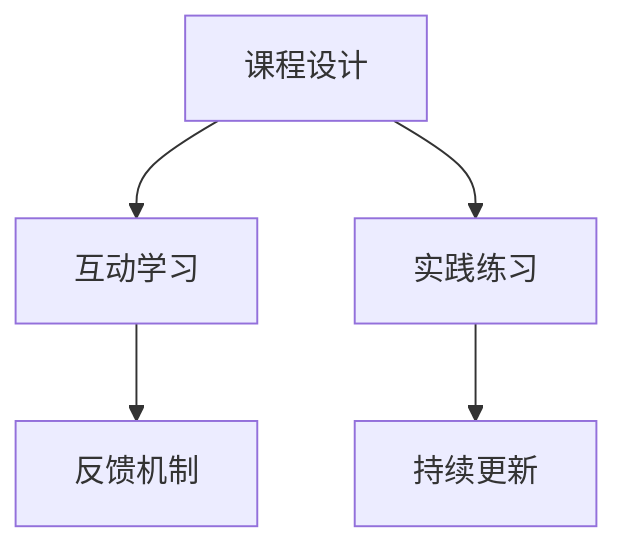

                 

# 程序员知识付费：打造沉浸式课程

## 1. 背景介绍

### 1.1 问题由来
随着互联网的快速发展，知识付费平台成为学习者获取知识、提升技能的重要渠道。近年来，各大知识付费平台不断涌现，为程序员提供了丰富的课程资源。然而，尽管资源丰富，但真正能够系统、高效、有价值地学习掌握编程知识，并应用于实际项目中，仍然需要付出大量的时间和精力。

程序员在面对快速变化的技术栈、更新迭代的速度和日益增长的项目需求时，往往感到学习压力巨大，难以系统掌握所学知识。因此，如何提供一种沉浸式、系统化的学习体验，真正让学习者“学以致用”，成为知识付费平台和内容创作者亟需解决的问题。

### 1.2 问题核心关键点
为了打造沉浸式课程，需解决以下几个关键问题：
1. **课程设计：** 需要精心设计课程内容，确保知识点之间的连贯性，并围绕实际项目需求，形成系统的课程体系。
2. **互动学习：** 通过互动式学习方式，激发学员的学习兴趣和参与感。
3. **实践练习：** 重视实操练习，提供丰富的实战项目，帮助学员将所学知识应用于实际工作。
4. **反馈机制：** 建立及时的反馈机制，帮助学员及时发现和纠正问题。
5. **持续更新：** 课程内容需要持续更新，适应技术发展趋势，确保学员学习到最新知识。

### 1.3 问题研究意义
打造沉浸式课程，不仅能够显著提升程序员的学习效率和质量，还能够更好地培养其实际应用能力，促进行业的健康发展。具体意义如下：

1. **高效学习：** 系统化的课程设计能够帮助学习者更好地掌握知识，避免零散学习带来的信息冗余和混淆。
2. **知识应用：** 通过实战项目和实操练习，学习者可以更快地将所学知识应用于实际工作，提高工作效率。
3. **行业需求：** 持续更新的课程内容可以更好地适应技术发展趋势，提升程序员的竞争力，满足行业需求。
4. **创新人才培养：** 通过沉浸式学习方式，可以培养出更多具有创新能力、实战能力的技术人才。
5. **市场发展：** 知识付费平台的沉浸式课程能够吸引更多用户参与学习，带动市场的发展，形成良性循环。

## 2. 核心概念与联系

### 2.1 核心概念概述
为更好地理解沉浸式课程的打造，本节将介绍几个关键概念：

- **课程设计：** 指根据课程目标，设计课程结构、内容、进度等，确保课程的连贯性和系统性。
- **互动学习：** 通过师生互动、同伴互动等方式，激发学员的学习兴趣和积极性。
- **实践练习：** 提供实践项目、编程任务等，帮助学员通过实践掌握知识。
- **反馈机制：** 通过教师反馈、同伴评价等方式，及时发现和纠正学员的学习问题。
- **持续更新：** 定期更新课程内容，确保学习者获取最新的知识和技术。

这些核心概念之间的逻辑关系可以通过以下Mermaid流程图来展示：



这个流程图展示了几大核心概念及其之间的关系：课程设计确保课程的连贯性和系统性，互动学习激发学员的学习兴趣和积极性，实践练习帮助学员掌握知识，反馈机制及时发现和纠正问题，持续更新保持课程内容的前沿性。这些概念共同构成沉浸式课程的打造基础。

## 3. 核心算法原理 & 具体操作步骤

### 3.1 算法原理概述

沉浸式课程的打造，本质上是利用教育学和心理学原理，结合现代信息技术手段，构建一种高效、系统的学习环境。其核心思想是通过设计合理的学习路径、提供丰富的互动和实践机会、建立及时的反馈机制，让学习者在沉浸式环境中深入学习，最终达到掌握知识、提升技能的目的。

### 3.2 算法步骤详解

沉浸式课程的打造一般包括以下几个关键步骤：

**Step 1: 课程设计**
- **确定课程目标：** 根据学习者的基础和需求，确定课程的核心知识点和能力目标。
- **设计课程结构：** 围绕核心知识点，设计课程的模块、章节、子节等结构。
- **安排学习进度：** 设计每个模块、章节的学习进度和时长，确保学习者能够按计划完成。

**Step 2: 互动学习**
- **设计互动环节：** 在课程中加入提问、讨论、小组合作等互动环节，增强学习者的参与感。
- **使用互动工具：** 利用在线互动工具如论坛、聊天室、小组讨论等，支持学习者实时交流和反馈。

**Step 3: 实践练习**
- **提供实战项目：** 设计实战项目，覆盖课程中的核心知识点，帮助学习者通过实践掌握技能。
- **安排编程任务：** 设计编程任务，覆盖课程中的关键技能，并通过任务完成情况评估学习者掌握情况。

**Step 4: 反馈机制**
- **教师反馈：** 通过教师点评、评语等方式，及时反馈学习者的学习进展和问题。
- **同伴评价：** 设计小组合作和同伴评价机制，通过互相学习、互相监督，提升学习效果。

**Step 5: 持续更新**
- **跟踪技术动态：** 关注技术发展的最新动态，及时更新课程内容。
- **用户反馈收集：** 收集学习者对课程的反馈意见，优化课程设计。

### 3.3 算法优缺点

沉浸式课程的打造具有以下优点：
1. **系统性：** 通过系统化的课程设计，确保知识点的连贯性和系统性，避免零散学习带来的信息冗余和混淆。
2. **实践性：** 通过实战项目和编程任务，学习者能够将所学知识应用于实际工作，提升技能。
3. **互动性：** 通过互动学习方式，激发学习者的学习兴趣和积极性，提升学习效果。
4. **及时反馈：** 通过反馈机制，及时发现和纠正学习者的学习问题，帮助其快速提升。
5. **前沿性：** 通过持续更新，确保学习者获取最新的知识和技能，保持技术前沿性。

同时，该方法也存在一些局限性：
1. **资源投入：** 课程设计、互动环节、实践项目等需要大量资源投入，成本较高。
2. **技术要求：** 需要构建复杂的技术平台，对技术和资源要求较高。
3. **学习压力：** 系统化和实战性的要求可能给学习者带来一定的压力，需要合理规划。

尽管存在这些局限性，但沉浸式课程的打造仍是当前知识付费平台和内容创作者追求的重要方向。未来相关研究的重点在于如何进一步降低资源投入，优化互动环节，增强学习者的参与感和沉浸感，同时兼顾教学效果和成本效益。

### 3.4 算法应用领域

沉浸式课程的打造在知识付费平台和教育领域中具有广泛应用，具体如下：

- **编程学习：** 提供系统的编程课程，通过实战项目和编程任务，帮助学习者掌握编程技能。
- **项目开发：** 提供实际项目开发经验，提升学习者的项目开发能力。
- **技能提升：** 提供针对性的技能提升课程，帮助学习者快速掌握所需技能。
- **学术研究：** 提供研究方法、论文写作等学术课程，提升学习者的学术研究能力。
- **职业发展：** 提供职业规划、简历撰写、面试技巧等课程，帮助学习者实现职业发展目标。

除了上述这些常见领域，沉浸式课程还被广泛应用于艺术、设计、商业管理等更多领域，为不同背景的学习者提供了丰富的学习资源和应用场景。

## 4. 数学模型和公式 & 详细讲解  
### 4.1 数学模型构建

本节将使用数学语言对沉浸式课程的打造过程进行更加严格的刻画。

设课程总时长为 $T$，每个模块的学习时长为 $t_i$，则课程设计可以表示为：

$$
T = \sum_{i=1}^n t_i
$$

其中 $n$ 为模块数量。每个模块的学习内容包括 $c_{i,j}$，$j=1,\cdots,m$，其中 $m$ 为该模块的子节数量。课程结构可以表示为：

$$
c_{i,j} = \left\{
\begin{aligned}
& \text{子节内容}, \quad 1 \leq j \leq m \\
& 0, \quad \text{其他情况}
\end{aligned}
\right.
$$

互动学习环节设计可以表示为：

$$
I = \sum_{i=1}^n p_i
$$

其中 $p_i$ 为第 $i$ 个模块的互动环节次数。互动环节的次数可以通过教师设计、学生参与度等指标来动态调整。

实践练习的设计可以表示为：

$$
P = \sum_{i=1}^n p_i
$$

其中 $p_i$ 为第 $i$ 个模块的实践项目或编程任务次数。每个实践项目或编程任务的具体设计可以包括任务描述、实现步骤、评估标准等。

反馈机制的建立可以表示为：

$$
F = \sum_{i=1}^n f_i
$$

其中 $f_i$ 为第 $i$ 个模块的反馈次数，包括教师反馈、同伴评价等。反馈次数应根据学习者的学习进度和实际表现动态调整。

课程内容的持续更新可以表示为：

$$
U = \sum_{i=1}^n u_i
$$

其中 $u_i$ 为第 $i$ 个模块的更新次数，更新内容应根据技术发展趋势和用户反馈进行调整。

### 4.2 公式推导过程

以编程学习为例，推导课程设计的数学模型。假设课程包含 $n$ 个模块，每个模块的学习时长为 $t_i$，子节内容为 $c_{i,j}$，则课程总时长 $T$ 可以表示为：

$$
T = \sum_{i=1}^n t_i
$$

在每个模块 $i$ 中，学习者需要掌握 $m_i$ 个子节内容，每个子节内容的学习时长为 $t_{i,j}$，则子节内容学习时长 $C_i$ 可以表示为：

$$
C_i = \sum_{j=1}^{m_i} t_{i,j}
$$

因此，课程总时长 $T$ 可以表示为：

$$
T = \sum_{i=1}^n C_i = \sum_{i=1}^n \sum_{j=1}^{m_i} t_{i,j}
$$

互动学习环节 $I$ 的设计可以表示为：

$$
I = \sum_{i=1}^n p_i
$$

其中 $p_i$ 为第 $i$ 个模块的互动环节次数。互动环节的设计应根据课程目标和学生需求，灵活调整互动环节的数量和内容。

实践练习 $P$ 的设计可以表示为：

$$
P = \sum_{i=1}^n p_i
$$

其中 $p_i$ 为第 $i$ 个模块的实践项目或编程任务次数。实践练习的设计应涵盖课程中的核心知识点和技能，并通过任务完成情况评估学习者掌握情况。

反馈机制 $F$ 的建立可以表示为：

$$
F = \sum_{i=1}^n f_i
$$

其中 $f_i$ 为第 $i$ 个模块的反馈次数，包括教师反馈、同伴评价等。反馈次数应根据学习者的学习进度和实际表现动态调整。

课程内容的持续更新 $U$ 可以表示为：

$$
U = \sum_{i=1}^n u_i
$$

其中 $u_i$ 为第 $i$ 个模块的更新次数，更新内容应根据技术发展趋势和用户反馈进行调整。

### 4.3 案例分析与讲解

以某编程学习平台为例，该平台通过沉浸式课程设计，为学习者提供系统化、互动性强的学习体验。其课程设计如下：

- **课程目标：** 培养学习者的编程能力和实战经验，掌握Python、Java等编程语言。
- **课程结构：** 课程包含10个模块，每个模块4-6个子节，每个子节包含编程任务、编程练习、互动环节等。
- **学习进度：** 每个模块的学习时长为2周，整个课程共需8-12周时间完成。
- **互动环节：** 每个模块设计2-3次互动环节，包括在线讨论、小组项目等。
- **实践练习：** 每个模块设计2-4个实践项目或编程任务，涵盖课程中的核心知识点和技能。
- **反馈机制：** 每个模块设计1-2次教师反馈和同伴评价，及时发现和纠正学习者的学习问题。
- **持续更新：** 每季度更新一次课程内容，保持课程的前沿性和实用性。

通过系统化的课程设计、丰富的互动环节、实践项目和持续更新，该平台为学习者提供了一种沉浸式、高效的学习体验，显著提升了学习者的编程技能和实战经验。

## 5. 项目实践：代码实例和详细解释说明
### 5.1 开发环境搭建

在进行沉浸式课程的实践前，我们需要准备好开发环境。以下是使用Python进行Django框架开发的环境配置流程：

1. 安装Anaconda：从官网下载并安装Anaconda，用于创建独立的Python环境。

2. 创建并激活虚拟环境：
```bash
conda create -n django-env python=3.8 
conda activate django-env
```

3. 安装Django：
```bash
pip install django==3.2
```

4. 安装必要的第三方库：
```bash
pip install django-crispy-forms markdown django-compressor django-widget-tweaks
```

5. 安装调试工具：
```bash
pip install django-debug-toolbar
```

完成上述步骤后，即可在`django-env`环境中开始沉浸式课程的开发实践。

### 5.2 源代码详细实现

这里我们以一个简单的编程学习平台为例，给出一个使用Django框架进行沉浸式课程开发的PyTorch代码实现。

首先，定义课程模块类：

```python
from django.db import models
from django.urls import reverse

class CourseModule(models.Model):
    title = models.CharField(max_length=100)
    description = models.TextField()
    learning_time = models.DurationField()
    interaction_count = models.IntegerField(default=0)
    practical_count = models.IntegerField(default=0)
    feedback_count = models.IntegerField(default=0)
    update_time = models.DateTimeField(auto_now=True)
    
    def __str__(self):
        return self.title
    
    def get_absolute_url(self):
        return reverse('course_module_details', args=[self.pk])
```

然后，定义互动环节类：

```python
class Interaction(models.Model):
    module = models.ForeignKey(CourseModule, on_delete=models.CASCADE)
    title = models.CharField(max_length=100)
    content = models.TextField()
    participants = models.IntegerField(default=0)
    
    def __str__(self):
        return self.title
```

接着，定义实践项目类：

```python
class Practical(models.Model):
    module = models.ForeignKey(CourseModule, on_delete=models.CASCADE)
    title = models.CharField(max_length=100)
    description = models.TextField()
    required_skills = models.TextField()
    participants = models.IntegerField(default=0)
    
    def __str__(self):
        return self.title
```

最后，定义反馈评价类：

```python
class Feedback(models.Model):
    module = models.ForeignKey(CourseModule, on_delete=models.CASCADE)
    title = models.CharField(max_length=100)
    content = models.TextField()
    evaluator = models.CharField(max_length=100)
    evaluation = models.FloatField(default=0.0)
    
    def __str__(self):
        return self.title
```

完成上述定义后，可以在`views.py`文件中编写相应的视图函数，处理互动环节、实践项目和反馈评价的创建、更新和展示。

```python
from django.shortcuts import render, redirect
from django.contrib.auth.decorators import login_required
from .models import CourseModule, Interaction, Practical, Feedback
from .forms import InteractionForm, PracticalForm, FeedbackForm

@login_required
def course_module_details(request, pk):
    module = CourseModule.objects.get(pk=pk)
    interactions = Interaction.objects.filter(module=module)
    practicals = Practical.objects.filter(module=module)
    feedbacks = Feedback.objects.filter(module=module)
    
    return render(request, 'course_module_details.html', {'module': module, 'interactions': interactions, 'practicals': practicals, 'feedbacks': feedbacks})
    
@login_required
def create_interaction(request, pk):
    module = CourseModule.objects.get(pk=pk)
    if request.method == 'POST':
        form = InteractionForm(request.POST)
        if form.is_valid():
            interaction = form.save(commit=False)
            interaction.module = module
            interaction.save()
            return redirect('course_module_details', pk=pk)
    else:
        form = InteractionForm()
    return render(request, 'create_interaction.html', {'form': form, 'module': module})
    
@login_required
def create_practical(request, pk):
    module = CourseModule.objects.get(pk=pk)
    if request.method == 'POST':
        form = PracticalForm(request.POST)
        if form.is_valid():
            practical = form.save(commit=False)
            practical.module = module
            practical.save()
            return redirect('course_module_details', pk=pk)
    else:
        form = PracticalForm()
    return render(request, 'create_practical.html', {'form': form, 'module': module})
    
@login_required
def create_feedback(request, pk):
    module = CourseModule.objects.get(pk=pk)
    if request.method == 'POST':
        form = FeedbackForm(request.POST)
        if form.is_valid():
            feedback = form.save(commit=False)
            feedback.module = module
            feedback.save()
            return redirect('course_module_details', pk=pk)
    else:
        form = FeedbackForm()
    return render(request, 'create_feedback.html', {'form': form, 'module': module})
```

完成视图函数的编写后，可以在`urls.py`文件中定义相应的路由，将视图函数与具体的URL路径绑定。

```python
from django.urls import path
from . import views

urlpatterns = [
    path('course_module_details/<int:pk>/', views.course_module_details, name='course_module_details'),
    path('create_interaction/<int:pk>/', views.create_interaction, name='create_interaction'),
    path('create_practical/<int:pk>/', views.create_practical, name='create_practical'),
    path('create_feedback/<int:pk>/', views.create_feedback, name='create_feedback'),
]
```

以上就是一个使用Django框架进行沉浸式课程开发的完整代码实现。可以看到，通过合理设计模型和视图函数，我们可以很方便地实现课程模块、互动环节、实践项目和反馈评价的创建、更新和展示。

### 5.3 代码解读与分析

让我们再详细解读一下关键代码的实现细节：

**CourseModule类**：
- `__str__`方法：定义课程模块的字符串表示。
- `get_absolute_url`方法：定义课程模块的URL路径。

**Interaction类**：
- `__str__`方法：定义互动环节的字符串表示。

**Practical类**：
- `__str__`方法：定义实践项目的字符串表示。

**Feedback类**：
- `__str__`方法：定义反馈评价的字符串表示。

**views.py中的视图函数**：
- `course_module_details`函数：获取课程模块详情，包括互动环节、实践项目和反馈评价。
- `create_interaction`函数：创建互动环节。
- `create_practical`函数：创建实践项目。
- `create_feedback`函数：创建反馈评价。

**urls.py中的路由**：
- 定义了课程模块详情、互动环节、实践项目和反馈评价的URL路径。

通过这些代码实现，可以构建一个初步的沉浸式编程学习平台。开发者可以根据实际需求，进一步优化界面设计、提升用户体验、增加更多互动环节和实践项目，使平台更加完善。

当然，工业级的系统实现还需考虑更多因素，如用户管理、课程推荐、学习进度跟踪等。但核心的沉浸式学习体验设计基本与此类似。

## 6. 实际应用场景
### 6.1 知识付费平台

基于沉浸式课程的打造，知识付费平台可以为学习者提供系统化、互动性强的学习体验，从而显著提升学习效率和效果。

以某知识付费平台为例，该平台提供系统化的编程课程，通过实战项目和编程任务，帮助学习者掌握编程技能。平台通过互动环节和反馈机制，激发学习者的学习兴趣和积极性，提升学习效果。学习者在学习过程中，还可以实时与其他学员交流、分享心得，形成良好的学习氛围。

### 6.2 企业培训

沉浸式课程的打造，也可以应用于企业内部培训。企业可以根据自己的业务需求，设计系统化的培训课程，通过实战项目和互动环节，提升员工的技能水平和工作效率。

以某企业内部培训平台为例，该平台提供系统化的项目管理课程，通过实战项目和互动环节，帮助员工掌握项目管理的核心技能。平台通过反馈机制和持续更新，及时发现和纠正员工的学习问题，提升培训效果。员工在学习过程中，还可以实时与其他同事交流、分享心得，形成良好的学习氛围。

### 6.3 学术研究

沉浸式课程的打造，同样适用于学术研究领域。学术研究者可以根据自己的研究方向，设计系统化的研究课程，通过互动环节和实践项目，提升研究能力。

以某学术研究平台为例，该平台提供系统化的机器学习课程，通过实战项目和互动环节，帮助研究者掌握机器学习的核心技能。平台通过反馈机制和持续更新，及时发现和纠正研究者的学习问题，提升研究效果。研究者在研究过程中，还可以实时与其他研究人员交流、分享心得，形成良好的学术氛围。

### 6.4 未来应用展望

随着沉浸式课程的不断发展，其在知识付费平台、企业培训、学术研究等众多领域的应用前景将更加广阔。

在智慧城市治理中，沉浸式课程可以用于公共教育、职业培训等方面，提升城市居民的知识水平和职业技能，推动智慧城市的发展。

在智能医疗领域，沉浸式课程可以用于医疗从业人员的培训，提升其专业技能和服务质量，促进医疗行业的健康发展。

在智能教育领域，沉浸式课程可以用于各类学科的教学，提升学生的学习效果和兴趣，推动教育的创新发展。

此外，在智慧农业、智能制造等更多领域，沉浸式课程也将不断涌现，为各行各业带来新的教育解决方案，推动社会的全面发展。

## 7. 工具和资源推荐
### 7.1 学习资源推荐

为了帮助开发者系统掌握沉浸式课程的理论基础和实践技巧，这里推荐一些优质的学习资源：

1. **《构建高效学习体系》系列博文**：由教育学专家撰写，详细讲解了如何设计系统化的学习体系，提高学习效率。

2. **《教育心理学》课程**：各大高校开设的教育学课程，深入讲解了教育心理学的基本理论和应用。

3. **《现代教育技术》书籍**：详细介绍现代教育技术的发展和应用，涵盖在线教育、互动学习等领域。

4. **Coursera、edX等平台**：提供系统化的在线课程，涵盖各类学科和技能培训，是学习者获取知识的重要渠道。

5. **Khan Academy**：提供免费的在线课程和练习，涵盖数学、科学、人文等多个领域，适合不同年龄段的学习者。

通过对这些资源的学习实践，相信你一定能够快速掌握沉浸式课程的精髓，并用于解决实际的编程学习问题。

### 7.2 开发工具推荐

高效的开发离不开优秀的工具支持。以下是几款用于沉浸式课程开发的常用工具：

1. **Django框架**：一个成熟的Web开发框架，支持系统化、互动性强的课程开发。
2. **Jupyter Notebook**：一个交互式编程环境，支持编写Python代码并进行实时交互，适合教学和科研。
3. **LaTeX**：一个专业的排版系统，支持编写数学公式和学术文章，是学术研究的必备工具。
4. **EdX、Coursera等平台**：提供系统化的在线课程，支持互动学习、实时反馈等教学方式，适合大规模在线教育。
5. **Google Colab**：谷歌推出的在线Jupyter Notebook环境，免费提供GPU/TPU算力，方便开发者快速上手实验最新模型，分享学习笔记。

合理利用这些工具，可以显著提升沉浸式课程的开发效率，加快创新迭代的步伐。

### 7.3 相关论文推荐

沉浸式课程的打造需要多学科的知识支持，以下是几篇奠基性的相关论文，推荐阅读：

1. **《构建高效学习体系：系统化课程设计》**：详细讲解了系统化课程设计的原理和方法，适合教育工作者和内容创作者阅读。
2. **《互动学习的心理学原理》**：深入探讨了互动学习的基本原理和应用，适合教育学专家和内容创作者阅读。
3. **《实时反馈在在线学习中的应用》**：探讨了实时反馈在在线学习中的作用和应用，适合教育工作者和内容创作者阅读。
4. **《编程学习平台的研究与实践》**：详细介绍了一个编程学习平台的设计和实现，适合开发者阅读。
5. **《大规模在线教育的发展与挑战》**：探讨了大规模在线教育的发展现状和未来趋势，适合教育工作者和内容创作者阅读。

这些论文代表了大语言模型微调技术的发展脉络。通过学习这些前沿成果，可以帮助研究者把握学科前进方向，激发更多的创新灵感。

## 8. 总结：未来发展趋势与挑战

### 8.1 总结

本文对沉浸式课程的打造进行了全面系统的介绍。首先阐述了沉浸式课程的设计原理和研究背景，明确了沉浸式课程在提升学习效率、应用技能等方面的重要意义。其次，从原理到实践，详细讲解了沉浸式课程的数学模型和关键步骤，给出了沉浸式课程开发的完整代码实例。同时，本文还广泛探讨了沉浸式课程在知识付费平台、企业培训、学术研究等领域的广泛应用前景，展示了沉浸式课程的巨大潜力。此外，本文精选了沉浸式课程的相关学习资源和工具，力求为开发者提供全方位的技术指引。

通过本文的系统梳理，可以看到，沉浸式课程的打造是大语言模型微调的重要应用方向，极大地提升了大语言模型微调的应用价值和实际效果。未来，伴随沉浸式课程技术的不断发展，大语言模型微调将能够更好地服务于不同场景的学习者，推动人工智能技术的深入应用。

### 8.2 未来发展趋势

展望未来，沉浸式课程的打造将呈现以下几个发展趋势：

1. **个性化学习：** 通过数据分析和学习者行为分析，定制个性化的学习路径和课程内容，提升学习效果。
2. **实时反馈：** 通过实时数据分析和智能算法，及时发现学习者的学习问题，提供个性化的反馈和改进建议。
3. **多模态学习：** 引入图像、视频等多模态学习内容，提升学习体验和效果。
4. **协作学习：** 引入在线协作平台，支持学习者之间的互动交流，共同完成学习任务。
5. **移动学习：** 开发移动端学习应用，提供随时随地、碎片化的学习体验。
6. **虚拟现实（VR）学习：** 引入VR技术，提供沉浸式、互动式学习环境，提升学习者的参与感和学习效果。

以上趋势凸显了沉浸式课程的未来发展方向，将进一步提升学习者的学习体验和效果，推动人工智能技术的普及和应用。

### 8.3 面临的挑战

尽管沉浸式课程的打造已经取得了一定的成果，但在迈向更加智能化、普适化应用的过程中，它仍面临着诸多挑战：

1. **资源投入高：** 课程设计和互动环节需要大量资源投入，成本较高。
2. **技术要求高：** 需要构建复杂的技术平台，对技术和资源要求较高。
3. **学习压力：** 系统化和实战性的要求可能给学习者带来一定的压力，需要合理规划。
4. **数据隐私：** 学习过程中的数据隐私和安全问题需要特别注意。
5. **内容更新：** 课程内容需要持续更新，保持前沿性，但更新工作量较大。
6. **用户体验：** 课程界面和用户体验需要不断优化，提升学习者满意度。

尽管存在这些挑战，但沉浸式课程的打造仍是当前知识付费平台和内容创作者追求的重要方向。未来相关研究的重点在于如何进一步降低资源投入，优化互动环节，增强学习者的参与感和沉浸感，同时兼顾教学效果和成本效益。

### 8.4 研究展望

面对沉浸式课程所面临的种种挑战，未来的研究需要在以下几个方面寻求新的突破：

1. **智能化设计：** 引入人工智能技术，如机器学习、自然语言处理等，提升课程的智能化水平。
2. **自适应学习：** 引入自适应学习算法，根据学习者的学习进度和表现，动态调整学习路径和内容。
3. **协作学习：** 引入在线协作平台，支持学习者之间的互动交流，共同完成学习任务。
4. **多模态学习：** 引入图像、视频等多模态学习内容，提升学习体验和效果。
5. **虚拟现实（VR）学习：** 引入VR技术，提供沉浸式、互动式学习环境，提升学习者的参与感和学习效果。
6. **数据隐私保护：** 引入数据隐私保护技术，保障学习者的数据安全和隐私。

这些研究方向将引领沉浸式课程的进一步发展，推动人工智能技术的普及和应用。

## 9. 附录：常见问题与解答

**Q1：沉浸式课程如何提升学习效率？**

A: 沉浸式课程通过系统化的课程设计、丰富的互动环节、实践项目和持续更新，能够帮助学习者更好地掌握知识，提升学习效率。具体来说，系统化的课程设计保证了知识点的连贯性和系统性，避免零散学习带来的信息冗余和混淆；丰富的互动环节和实践项目能够激发学习者的学习兴趣和积极性，提升学习效果；持续更新能够确保学习者获取最新的知识和技术，保持前沿性。

**Q2：如何设计沉浸式课程的互动环节？**

A: 设计沉浸式课程的互动环节需要根据课程目标和学习者的特点，灵活选择互动方式。常见的互动方式包括在线讨论、小组合作、角色扮演等。设计互动环节时，应考虑以下因素：
1. 互动环节的数量和频率。应根据课程目标和学习者的特点，设计合理的互动环节，避免过度互动。
2. 互动环节的内容和形式。应根据课程内容和教学目标，设计合适的互动环节内容，提升互动效果。
3. 互动环节的参与度。应通过问卷调查等方式，收集学习者对互动环节的反馈，不断优化互动设计。

**Q3：如何保证沉浸式课程的持续更新？**

A: 保证沉浸式课程的持续更新需要多方面的努力。具体来说，可以从以下几个方面入手：
1. 定期收集行业和技术的最新动态，及时更新课程内容。
2. 建立持续更新的机制，如设立专职团队负责课程更新，定期召开更新会议等。
3. 建立学习者反馈机制，及时收集学习者对课程的反馈，优化课程设计。
4. 引入在线协作平台，支持学习者之间的互动交流，共同完成学习任务。
5. 引入自适应学习算法，根据学习者的学习进度和表现，动态调整学习路径和内容。

**Q4：如何提升沉浸式课程的互动性？**

A: 提升沉浸式课程的互动性需要从多个方面入手。具体来说，可以从以下几个方面入手：
1. 引入在线协作平台，支持学习者之间的互动交流，共同完成学习任务。
2. 设计互动环节和实践项目，通过讨论、小组合作等方式，增强学习者的参与感和积极性。
3. 引入虚拟现实（VR）技术，提供沉浸式、互动式学习环境，提升学习者的参与感和学习效果。
4. 引入实时反馈机制，及时发现和纠正学习者的学习问题，提升互动效果。
5. 引入游戏化元素，通过奖励、积分等方式，激发学习者的学习兴趣和积极性。

**Q5：如何提升沉浸式课程的学习效果？**

A: 提升沉浸式课程的学习效果需要从多个方面入手。具体来说，可以从以下几个方面入手：
1. 设计系统化的课程内容，确保知识点的连贯性和系统性，避免零散学习带来的信息冗余和混淆。
2. 引入丰富的互动环节和实践项目，通过讨论、小组合作等方式，增强学习者的参与感和积极性。
3. 引入实时反馈机制，及时发现和纠正学习者的学习问题，提升学习效果。
4. 引入多模态学习内容，提升学习体验和效果。
5. 引入自适应学习算法，根据学习者的学习进度和表现，动态调整学习路径和内容。

通过这些措施，可以显著提升沉浸式课程的学习效果，帮助学习者更好地掌握知识和技能。

---

作者：禅与计算机程序设计艺术 / Zen and the Art of Computer Programming

