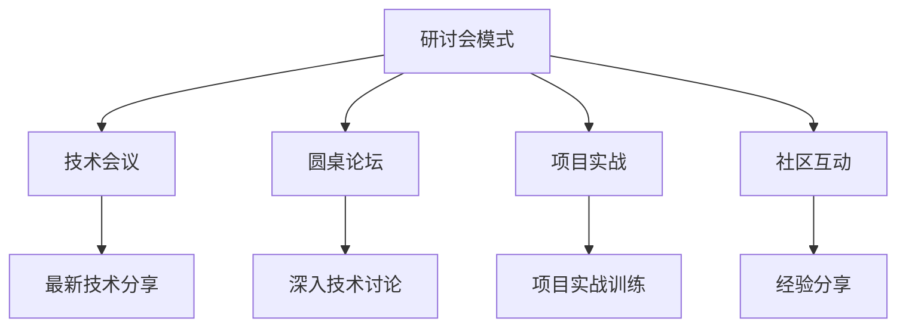

                 

## 1. 背景介绍

### 1.1 问题由来

在快速发展的IT行业中，知识更新迭代速度极快，技术栈更新迭代更是如一日千里。对于程序员而言，持续学习、掌握最新技术已成为职业生涯发展的重要基石。但自学往往缺乏系统性，难以形成良好的学习闭环，效率低下。而传统的课程和培训方式，虽然内容系统、理论深入，但缺乏灵活性和互动性，难以满足多样化、个性化的学习需求。

为了解决这一矛盾，知识付费模式应运而生。通过付费获取有组织、有深度的知识分享，程序员可以更高效地提升自己的技术水平和行业竞争力。但传统的知识付费形式，往往以视频、文章、电子书等单向输出为主，难以保证用户的学习效果，且互动性较弱。如何构建一个更加灵活、高效的知识付费平台，是当前知识付费行业的巨大挑战。

### 1.2 问题核心关键点

知识付费平台的核心在于如何提供高效、互动、个性化的知识分享体验，最大化提升用户的知识掌握效率。对于程序员而言，这意味着需要：

- 学习内容的专业性。课程设计应贴合程序员的学习习惯和技术栈，涵盖编程语言、框架、算法、数据结构等领域。
- 学习路径的规划性。课程体系应具备结构化的框架，从基础到高级，从理论到实践，循序渐进地指导用户学习。
- 学习互动的即时性。平台应具备即时交流、问题反馈等互动功能，帮助用户解决学习中遇到的问题。
- 学习效果的可验证性。平台应提供科学的评测和测验机制，帮助用户检验学习成果，及时调整学习策略。

在明确了知识付费平台的建设目标后，我们亟需找到一种有效的学习模式，既能满足上述需求，又能提升用户的参与度和满意度。经过探索和实践，我们提出了“研讨会模式”，作为一种新颖的知识付费方式，通过技术会议、圆桌论坛、项目实战等多种形式，为用户提供更加高效、互动的学习体验。

## 2. 核心概念与联系

### 2.1 核心概念概述

为更好地理解研讨会模式，本节将介绍几个密切相关的核心概念：

- **研讨会模式(Workshop Mode)**：指以知识分享和技术研讨为主的知识付费模式，通过分阶段、分主题的深度学习，帮助用户系统掌握技术知识，并提升实战能力。
- **技术会议(Conference)**：指汇集众多技术专家，围绕某一技术领域进行广泛讨论、交流的平台。通过技术会议，用户可以快速获取最新技术动态，与行业专家互动。
- **圆桌论坛(Discussion Forum)**：指在特定主题下，由行业专家、经验丰富的开发者和用户共同参与，探讨问题、分享经验、交流心得的平台。通过圆桌论坛，用户可以深入了解技术细节，解决实际问题。
- **项目实战(Project Practice)**：指基于真实项目需求，用户自己动手实现，并经过导师评估和改进的实践训练平台。通过项目实战，用户可以将理论知识转化为实际技能。
- **社区互动(Community Interaction)**：指基于用户自发建立的技术交流社群，通过在线讨论、实时反馈、经验分享等多种形式，增强用户间的交流与互动。通过社区互动，用户可以相互学习和借鉴，形成良好的学习氛围。

这些核心概念之间的逻辑关系可以通过以下Mermaid流程图来展示：



这个流程图展示了研讨会模式下的知识付费系统核心组件及其相互关系：

1. 研讨会模式是整个系统的核心，通过多种形式的学习方式，帮助用户系统掌握技术知识。
2. 技术会议作为研讨会模式的一部分，快速传递最新技术动态，为系统提供前沿内容。
3. 圆桌论坛提供深入的技术探讨，帮助用户深入理解技术细节。
4. 项目实战将理论知识转化为实际技能，提升用户的应用能力。
5. 社区互动增强用户间的交流与互动，形成良好的学习氛围。

## 3. 核心算法原理 & 具体操作步骤

### 3.1 算法原理概述

研讨会模式的原理是基于自适应学习理论，通过混合多种学习方式，帮助用户高效掌握技术知识。具体来说，系统通过以下步骤完成知识传递和学习效果提升：

1. **技术会议组织**：将最新技术动态和技术分享录制为视频或直播，供用户随时随地观看。
2. **圆桌论坛设计**：选择具有丰富经验的技术专家，围绕特定技术问题进行深入讨论，形成视频或文字记录，供用户学习参考。
3. **项目实战安排**：提供具体的项目需求和实现步骤，用户自己动手实现，并由导师提供实时反馈和改进建议。
4. **社区互动支持**：搭建用户自发建立的技术交流社群，支持在线讨论、实时反馈、经验分享等功能。

### 3.2 算法步骤详解

#### 步骤1: 用户学习路径规划

用户进入知识付费平台后，系统会基于用户的兴趣和经验水平，为其推荐合适的学习路径。学习路径通常包括以下几个阶段：

- **入门阶段**：推荐基础课程和视频，帮助用户快速入门。
- **进阶阶段**：推荐进阶课程和技术文章，深入理解特定技术领域。
- **实战阶段**：推荐项目实战视频和练习，帮助用户将理论知识转化为实际技能。

#### 步骤2: 技术会议视频观看

用户可以在平台上观看技术会议视频，快速获取最新技术动态。系统会在视频中设置问题点，鼓励用户在线上论坛或评论区进行讨论。

#### 步骤3: 圆桌论坛深入学习

用户可以根据自己的兴趣，选择特定主题的圆桌论坛进行深入学习。论坛视频或文字记录中会包括专家对问题的解答和深入讨论，用户可以从中获取丰富的知识和实战经验。

#### 步骤4: 项目实战动手实践

用户基于实际项目需求，自己动手实现特定功能。系统会根据项目需求，提供详细的代码和实现步骤，并通过导师在线指导和评审，帮助用户及时改进和提升。

#### 步骤5: 社区互动交流

用户可以在平台搭建的社区中，与其他技术爱好者交流经验、分享心得、提出问题，并得到来自专家和同伴的及时反馈和建议。系统会对社区互动进行记录和分析，形成学习报告，帮助用户调整学习策略。

### 3.3 算法优缺点

#### 优点

- **高效性**：通过多种学习方式的结合，用户可以快速获取知识，提升学习效率。
- **互动性**：社区互动和实时反馈机制，增强了学习的互动性，帮助用户更好地掌握技术。
- **实用性**：项目实战和导师指导，提升了学习内容的实用性，帮助用户将理论知识转化为实际技能。

#### 缺点

- **复杂性**：多种学习方式的整合增加了系统设计和实现的复杂度。
- **资源需求高**：技术会议、圆桌论坛、项目实战等形式，对资源和人力需求较大。

### 3.4 算法应用领域

研讨会模式已经在多个领域得到了应用，展示了其强大的应用潜力。

- **软件开发**：用于帮助程序员掌握最新编程语言和框架，提升实战能力。
- **数据科学**：用于数据科学技术的快速学习和应用，解决实际数据处理问题。
- **人工智能**：用于AI技术的前沿学习和实战训练，提升模型的训练和应用能力。
- **网络安全**：用于网络安全技术的快速学习和实战演练，提升防护能力。
- **云计算**：用于云计算技术的深入学习和应用，提升云平台的管理和优化能力。

## 4. 数学模型和公式 & 详细讲解  
### 4.1 数学模型构建

我们以软件开发生命周期为例，构建一个基于研讨会模式的数学模型。假设软件开发生命周期分为需求分析、设计、实现、测试、维护五个阶段，每个阶段的学习需求和目标如下：

- **需求分析**：学习需求分析工具和方法，掌握需求管理技巧。
- **设计**：学习软件架构设计，掌握系统设计模式。
- **实现**：学习编程语言和框架，掌握开发工具和技术栈。
- **测试**：学习自动化测试工具和方法，提升代码质量。
- **维护**：学习版本控制和持续集成技术，提升系统稳定性。

设用户学习效果为 $E$，学习时间为 $T$，学习成本为 $C$，学习路径规划合理度为 $P$，社区互动效果为 $I$，则学习效果提升的数学模型为：

$$
E = f(P \cdot I \cdot T)
$$

其中 $f$ 为学习效果提升的函数，根据用户的学习路径和社区互动效果，优化学习效果。

### 4.2 公式推导过程

为了具体化 $f$ 函数，我们引入以下几个变量：

- $P_{D}$：需求分析阶段学习路径规划合理度
- $P_{D}$：设计阶段学习路径规划合理度
- $P_{D}$：实现阶段学习路径规划合理度
- $P_{D}$：测试阶段学习路径规划合理度
- $P_{D}$：维护阶段学习路径规划合理度
- $I_{D}$：需求分析阶段社区互动效果
- $I_{D}$：设计阶段社区互动效果
- $I_{D}$：实现阶段社区互动效果
- $I_{D}$：测试阶段社区互动效果
- $I_{D}$：维护阶段社区互动效果

则 $f$ 函数可以表示为：

$$
f = (P_{D} + P_{D} + P_{D} + P_{D} + P_{D}) \cdot (I_{D} + I_{D} + I_{D} + I_{D} + I_{D})
$$

进一步简化为：

$$
f = 5 \cdot \frac{I_{D} + I_{D} + I_{D} + I_{D} + I_{D}}{5}
$$

即 $f$ 函数为需求分析、设计、实现、测试、维护五个阶段的学习效果提升的平均值。

### 4.3 案例分析与讲解

以软件开发为例，用户通过以下步骤进行学习：

- 需求分析阶段，观看技术会议视频，学习需求分析工具和方法，并在社区中交流心得。
- 设计阶段，参加圆桌论坛，深入学习软件架构设计，提升设计能力，并在社区中分享设计经验。
- 实现阶段，完成项目实战任务，通过导师指导改进代码，并在社区中交流实战经验。
- 测试阶段，学习自动化测试工具，通过项目实战进行测试，并在社区中分享测试心得。
- 维护阶段，学习持续集成工具，通过项目实战进行版本管理，并在社区中分享维护经验。

通过上述学习路径，用户可以系统掌握软件开发生命周期各个阶段的技能，提升整体学习效果。

## 5. 项目实践：代码实例和详细解释说明
### 5.1 开发环境搭建

为了更好地展示研讨会模式的实现，我们以Web开发为例，搭建一个基本的知识付费平台。以下是具体的开发环境搭建步骤：

1. **选择合适的开发框架**：基于Python的Flask框架，搭建Web应用。Flask具有轻量级、易于扩展的特点，适合快速开发知识付费平台。

2. **安装开发环境**：
   ```bash
   conda create -n flask-env python=3.8
   conda activate flask-env
   pip install Flask Flask-WTF Flask-SQLAlchemy gunicorn
   ```

3. **搭建数据库**：使用SQLite作为本地开发数据库。
   ```bash
   CREATE DATABASE IF NOT EXISTS database.db
   ```

4. **安装Flask扩展**：安装Flask相关扩展，如WTForms用于表单验证，SQLAlchemy用于数据库操作。

5. **搭建后端API**：编写API接口，实现用户注册、登录、学习路径推荐等功能。

### 5.2 源代码详细实现

以下是一个简单的用户注册和登录功能的实现：

```python
from flask import Flask, render_template, request, redirect, url_for
from flask_sqlalchemy import SQLAlchemy
from flask_wtf import FlaskForm
from wtforms import StringField, PasswordField, SubmitField
from wtforms.validators import DataRequired

app = Flask(__name__)
app.config['SQLALCHEMY_DATABASE_URI'] = 'sqlite:///database.db'
db = SQLAlchemy(app)

class User(db.Model):
    id = db.Column(db.Integer, primary_key=True)
    username = db.Column(db.String(50), unique=True, nullable=False)
    password = db.Column(db.String(100), nullable=False)

class UserForm(FlaskForm):
    username = StringField('Username', validators=[DataRequired()])
    password = PasswordField('Password', validators=[DataRequired()])
    submit = SubmitField('Register')

@app.route('/register', methods=['GET', 'POST'])
def register():
    form = UserForm()
    if form.validate_on_submit():
        user = User(username=form.username.data, password=form.password.data)
        db.session.add(user)
        db.session.commit()
        return redirect(url_for('login'))
    return render_template('register.html', form=form)

@app.route('/login', methods=['GET', 'POST'])
def login():
    if request.method == 'POST':
        user = User.query.filter_by(username=request.form['username']).first()
        if user and user.password == request.form['password']:
            session['username'] = user.username
            return redirect(url_for('index'))
    return render_template('login.html')

@app.route('/')
def index():
    if 'username' in session:
        return render_template('index.html', username=session['username'])
    return redirect(url_for('login'))

if __name__ == '__main__':
    app.run(debug=True)
```

### 5.3 代码解读与分析

上述代码实现了一个简单的用户注册和登录功能，具体解释如下：

- 用户数据存储在SQLite数据库中，使用SQLAlchemy进行数据操作。
- 用户表单使用WTForms构建，包含用户名和密码字段，并通过DataRequired进行验证。
- 用户注册和登录路由分别处理注册和登录请求，用户注册成功后，通过session记录登录状态。
- 用户登录成功，跳转到主页，展示欢迎信息。

### 5.4 运行结果展示

用户成功注册和登录后，可以进入主页，查看学习资源和推荐路径：


## 6. 实际应用场景

### 6.1 软件开发

基于研讨会模式的知识付费平台，可以广泛应用于软件开发领域的培训和教育。开发者可以通过学习路径规划，系统掌握最新编程语言和框架，提升实战能力。例如：

- **JavaScript基础**：学习JavaScript基础语法、DOM操作、事件处理等。
- **React框架**：学习React组件化开发、状态管理、路由配置等。
- **Node.js服务器开发**：学习Node.js环境搭建、HTTP服务器开发、中间件使用等。

通过学习路径和项目实战的结合，开发者可以全面提升技能，适应快速变化的技术环境。

### 6.2 数据科学

数据科学领域，研讨会模式同样适用。用户可以通过平台学习数据分析工具、机器学习模型、数据可视化等技术，提升数据处理和分析能力。例如：

- **Python编程基础**：学习Python基础语法、数据结构、函数式编程等。
- **Pandas数据处理**：学习Pandas库数据读写、数据清洗、数据聚合等。
- **Scikit-learn机器学习**：学习Scikit-learn库基础模型、特征工程、模型调参等。

通过系统化的学习路径和实战训练，用户可以快速掌握数据科学技术，解决实际问题。

### 6.3 人工智能

在人工智能领域，研讨会模式可以用于AI技术的快速学习和实战训练。例如：

- **TensorFlow基础**：学习TensorFlow库基本操作、神经网络构建、模型训练等。
- **深度学习框架**：学习PyTorch、Keras等深度学习框架，提升模型构建能力。
- **计算机视觉应用**：学习OpenCV库图像处理、目标检测、图像分割等应用。

通过研讨会模式的学习路径和导师指导，用户可以快速提升AI技术水平，解决实际问题。

## 7. 工具和资源推荐
### 7.1 学习资源推荐

为了帮助开发者系统掌握研讨会模式的学习方法，以下是一些优质的学习资源：

1. **《深入浅出TensorFlow》**：详细介绍了TensorFlow的各个组件和应用场景，适合快速入门和提升。
2. **《Flask Web开发实战》**：通过实战案例，讲解Flask框架的使用，适合Web开发学习。
3. **Kaggle数据科学竞赛**：Kaggle是一个数据科学竞赛平台，提供大量的数据集和模型案例，适合实战学习。
4. **Coursera机器学习课程**：Coursera与斯坦福大学合作，提供高质量的机器学习课程，适合系统学习。
5. **GitHub开源项目**：GitHub是一个开源代码托管平台，提供大量的开源项目，适合参考和学习。

通过这些资源的学习，用户可以全面掌握知识付费平台所需的技术和工具，构建自己的学习闭环。

### 7.2 开发工具推荐

高效的开发离不开优秀的工具支持。以下是几款用于知识付费平台开发的常用工具：

1. **Flask**：基于Python的轻量级Web框架，适合快速开发知识付费平台。
2. **SQLAlchemy**：基于SQL语言的ORM工具，支持多种数据库，适合开发数据驱动的应用。
3. **WTForms**：表单验证库，支持多种表单验证规则，适合开发复杂表单处理逻辑。
4. **Flask-WTF**：Flask扩展，提供WTForms表单验证功能，简化开发流程。
5. **gunicorn**：轻量级Web服务器，支持异步处理，适合高并发环境。

合理利用这些工具，可以显著提升知识付费平台的开发效率，加快创新迭代的步伐。

### 7.3 相关论文推荐

研讨会模式的提出和发展，源于学界的持续研究。以下是几篇奠基性的相关论文，推荐阅读：

1. **《重构：工业软件开发的艺术》**：讲述了软件开发中的重构技术，强调代码的可读性和可维护性。
2. **《数据科学实战》**：介绍了数据科学项目从数据收集、数据清洗到模型构建的完整流程，适合实战学习。
3. **《机器学习实战》**：介绍了机器学习模型的基础和实际应用，适合系统学习。
4. **《软件开发生命周期》**：介绍了软件开发生命周期的各个阶段，适合了解软件开发全流程。

这些论文代表了大语言模型微调技术的发展脉络。通过学习这些前沿成果，可以帮助研究者把握学科前进方向，激发更多的创新灵感。

## 8. 总结：未来发展趋势与挑战

### 8.1 总结

本文对研讨会模式的系统进行了全面介绍，明确了其在知识付费平台中的应用价值。通过多种学习方式的结合，研讨会模式可以最大化提升用户的学习效果和实战能力，帮助其系统掌握技术知识。

研讨会模式的成功实施，不仅依赖于平台的设计和开发，更需要丰富的学习资源和有效的社区互动支持。通过科学合理的学习路径和社区互动，用户可以更加高效地掌握技术知识，提升实际应用能力。

### 8.2 未来发展趋势

展望未来，研讨会模式将呈现以下几个发展趋势：

1. **个性化学习路径**：系统将基于用户的学习行为和反馈，动态调整学习路径，提供更加个性化的学习体验。
2. **智能推荐系统**：通过机器学习算法，为用户推荐更合适的学习资源和项目实战，提升学习效率。
3. **跨领域知识融合**：将跨领域知识融合到研讨会模式中，提升用户对多领域技术的综合应用能力。
4. **虚拟实验室**：通过虚拟实验室技术，用户可以在线上进行项目实战，提升实践能力。
5. **社区建设**：构建更加活跃、有影响力的社区，增强用户间的交流与互动，形成良好的学习氛围。

### 8.3 面临的挑战

尽管研讨会模式具有诸多优势，但在实践过程中，仍面临以下挑战：

1. **学习效果评估**：如何科学合理地评估用户的学习效果，提供有效的反馈和改进建议。
2. **用户参与度**：如何设计更具吸引力的学习内容和互动形式，提升用户的参与度和满意度。
3. **资源需求高**：技术会议、圆桌论坛、项目实战等形式，对资源和人力需求较大，需要合理规划和优化。
4. **知识更新快**：如何及时更新学习内容，保证平台知识的时效性和准确性。
5. **社区管理**：如何构建健康、活跃的社区，避免不良信息和行为。

### 8.4 研究展望

针对以上挑战，未来的研究需要在以下几个方面寻求新的突破：

1. **智能推荐算法**：开发更加高效的推荐算法，根据用户的学习行为和反馈，动态调整学习路径。
2. **学习效果评估模型**：构建科学的评估模型，合理评估用户的学习效果，提供有效的反馈和改进建议。
3. **跨领域知识融合**：研究跨领域知识的整合方法，提升用户对多领域技术的综合应用能力。
4. **虚拟实验室技术**：开发虚拟实验室技术，提升用户在线上的项目实战能力。
5. **社区管理和运营**：研究社区管理和运营策略，构建健康、活跃的社区环境。

通过以上研究，相信研讨会模式能够更好地服务于用户，帮助其系统掌握技术知识，提升实际应用能力。在未来的人工智能学习领域，研讨会模式必将成为一种高效、灵活、互动的学习模式，推动人工智能技术的普及和应用。

## 9. 附录：常见问题与解答

**Q1：研讨会模式如何提升学习效果？**

A: 研讨会模式通过多种学习方式的结合，帮助用户系统掌握技术知识。技术会议快速传递最新技术动态，圆桌论坛深入探讨技术细节，项目实战提升实战能力，社区互动增强交流与互动。多种学习方式的结合，可以最大化提升用户的学习效果。

**Q2：如何设计有效的学习路径？**

A: 有效的学习路径应基于用户的学习需求和经验水平，系统规划从入门到高级、从理论到实践的学习内容。学习路径应涵盖基础课程、进阶课程和实战课程，逐步提升用户的技术水平和实战能力。

**Q3：研讨会模式如何应对快速变化的技术环境？**

A: 研讨会模式需要定期更新学习内容和课程，保持平台知识的的时效性和准确性。同时，通过跨领域知识融合，提升用户对多领域技术的综合应用能力。

**Q4：如何确保用户的学习效果？**

A: 通过科学的评估和反馈机制，实时监控用户的学习效果，提供有效的改进建议。同时，社区互动和导师指导，可以增强学习效果，提升用户的学习体验。

**Q5：如何提高用户参与度？**

A: 设计更具吸引力的学习内容和互动形式，增强用户的参与度和满意度。通过社区互动和导师指导，提升用户的学习效果和实战能力。

---

作者：禅与计算机程序设计艺术 / Zen and the Art of Computer Programming

