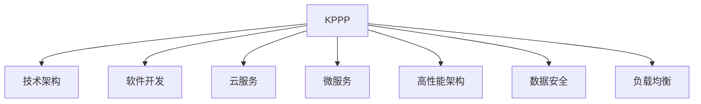

                 

# 程序员自建知识付费平台的技术方案

> 关键词：知识付费平台, 技术架构, 软件开发, 云服务, 微服务, 高性能架构, 数据安全, 负载均衡

## 1. 背景介绍

### 1.1 问题由来
近年来，知识付费市场快速崛起，各种类型的知识产品如雨后春笋般涌现，满足了广大用户对高质量、深度化、结构化知识内容的需求。然而，面对纷繁复杂的知识产品和参差不齐的内容质量，如何为用户提供可靠、高效的知识获取渠道，成为平台运营商的一大挑战。

### 1.2 问题核心关键点
构建知识付费平台的难点在于如何通过高效的系统架构和技术方案，支撑平台功能的稳定运行，提升用户体验，保障内容的质量和多样性。本文档将从技术方案的角度，系统介绍知识付费平台的关键组件和技术要点，并结合实际应用案例，给出建设知识付费平台的具体指南。

## 2. 核心概念与联系

### 2.1 核心概念概述

为更好地理解知识付费平台的技术方案，本节将介绍几个密切相关的核心概念：

- **知识付费平台(Knowledge Pay-Per-Use Platform, KPPP)**：通过在线方式提供专业知识的平台，用户需支付一定的费用，以获取知识产品的在线访问权限。
- **技术架构(Technical Architecture)**：平台的技术实现框架，包括基础设施、数据存储、应用系统等组件的部署和架构设计。
- **软件开发(Development)**：从需求分析到代码实现，再到部署测试的整个软件生命周期过程。
- **云服务(Cloud Service)**：基于云计算基础设施，提供弹性、高效的资源和应用服务，支撑平台的快速部署和扩展。
- **微服务(Microservices)**：将应用拆分成一组细粒度的服务，每个服务独立运行，具备高内聚、低耦合的特点。
- **高性能架构(High Performance Architecture)**：通过合理设计系统架构，提高应用的处理能力和响应速度，支持大规模用户并发访问。
- **数据安全(Data Security)**：确保数据在传输、存储和使用过程中的安全性，防止数据泄露、篡改等风险。
- **负载均衡(Load Balancing)**：通过将用户请求分散到多台服务器上，提升应用系统的稳定性和可扩展性。

这些核心概念之间的逻辑关系可以通过以下Mermaid流程图来展示：



这个流程图展示了一个知识付费平台的核心概念及其之间的关系：

1. KPPP平台是整个系统设计的核心目标，所有技术方案和组件都必须围绕提升用户体验、保障内容质量和服务安全展开。
2. 技术架构和软件开发是平台建设的基础。
3. 云服务为平台提供了弹性、高效的计算和存储资源。
4. 微服务架构使得平台应用更易扩展和维护。
5. 高性能架构确保平台能够处理高并发用户请求，满足用户访问需求。
6. 数据安全是平台稳定运行的前提，保障用户数据的安全性和隐私。
7. 负载均衡技术通过合理分配请求，防止单点故障，提升应用可用性。

## 3. 核心算法原理 & 具体操作步骤
### 3.1 算法原理概述

知识付费平台的核心算法原理主要涉及用户管理、知识发布与推送、交易管理、内容推荐等模块。

- **用户管理**：包括用户注册、登录、权限控制等功能，通过身份认证和权限验证保障平台安全。
- **知识发布与推送**：涉及知识产品的上传、审核、发布、推送等流程，确保知识内容的质量和时效性。
- **交易管理**：实现支付、订单、退款等功能，保障用户付费和内容分发的一致性。
- **内容推荐**：通过用户行为分析，推荐符合用户兴趣和需求的知识内容，提升用户粘性。

这些模块均基于常见的计算机科学原理，如分布式计算、数据存储、缓存技术等。平台通过合理设计各个模块的功能和接口，实现协同工作，为用户提供流畅、无缝的知识获取体验。

### 3.2 算法步骤详解

知识付费平台的技术实现一般包括以下几个关键步骤：

**Step 1: 确定业务需求和设计方案**

- 明确平台的主要业务功能，如用户管理、知识发布、交易支付、内容推荐等。
- 根据需求设计系统架构和技术栈，确定使用的编程语言、数据库、中间件等。

**Step 2: 搭建开发环境**

- 搭建服务器和网络环境，确保数据传输安全。
- 安装和配置开发工具，如IDE、版本控制系统等。
- 部署数据库和缓存系统，保障数据读写效率。

**Step 3: 实现核心功能模块**

- 实现用户管理模块，包括用户注册、登录、权限控制等。
- 实现知识发布模块，包括知识上传、审核、发布等。
- 实现交易管理模块，包括支付、订单、退款等。
- 实现内容推荐模块，包括用户行为分析、内容推荐算法等。

**Step 4: 集成测试**

- 对各个功能模块进行单元测试和集成测试，确保各模块功能正确。
- 模拟真实用户环境，进行负载测试和压力测试，验证系统性能和稳定性。

**Step 5: 部署上线**

- 将开发完成的系统部署到生产环境，进行最后的检查和优化。
- 监控系统运行状态，确保系统稳定运行。

**Step 6: 持续迭代和优化**

- 根据用户反馈和业务需求，不断优化和迭代系统功能。
- 定期评估系统性能和安全，进行必要的升级和优化。

### 3.3 算法优缺点

知识付费平台的技术方案具有以下优点：

1. **模块化设计**：通过将应用拆分成多个独立服务，提高了系统的可扩展性和维护性。
2. **高可用性**：通过负载均衡和冗余设计，确保系统在面对高并发流量时仍能稳定运行。
3. **弹性扩展**：云服务提供了按需伸缩的资源，可以根据实际需求灵活调整系统资源。
4. **数据安全**：采用了多种数据加密和安全措施，保障用户数据的安全性和隐私。

同时，该方案也存在以下局限性：

1. **开发复杂度高**：微服务架构虽然带来了高可扩展性，但也增加了系统设计和开发的复杂度。
2. **运维成本高**：系统需要持续监控和优化，以确保性能和安全性，增加了运维成本。
3. **资源消耗大**：云服务虽然弹性，但长期运行也会产生较高的计算和存储成本。

尽管存在这些局限性，但就目前而言，微服务架构仍是知识付费平台建设的普遍选择，能够提供较高的系统可靠性和用户体验。

### 3.4 算法应用领域

知识付费平台的微服务架构和技术方案，在众多领域都有广泛的应用，例如：

- **在线教育**：为在线课程提供个性化推荐和学习路径，提升教育效果。
- **金融科技**：为金融产品提供高质量的客户教育内容，提升客户满意度和忠诚度。
- **医疗健康**：为健康管理提供权威的健康知识，帮助用户提高生活质量。
- **IT技术培训**：为开发者提供最新的技术知识和实战项目，加速技术学习和知识积累。
- **人力资源**：为企业员工提供专业技能培训，提升员工技能和竞争力。

这些应用场景展示了微服务架构的强大生命力和灵活性，相信在更多的领域中，知识付费平台将发挥越来越重要的作用。

## 4. 数学模型和公式 & 详细讲解 & 举例说明

### 4.1 数学模型构建

知识付费平台的核心算法涉及多个数学模型，如推荐算法、支付算法、搜索算法等。以推荐算法为例，假设知识库中有$n$个知识产品，每个产品$i$的用户评分向量为$\mathbf{r}_i$，用户$u$的评分向量为$\mathbf{r}_u$。用户$u$对知识产品$i$的评分预测值$y_{iu}$可以通过以下矩阵分解模型来计算：

$$
\mathbf{r}_i = \mathbf{A}_i\mathbf{q}_i + \mathbf{b}_i
$$
$$
\mathbf{r}_u = \mathbf{A}_u\mathbf{q}_u + \mathbf{b}_u
$$
$$
y_{iu} = \mathbf{r}_i^\top \mathbf{r}_u
$$

其中$\mathbf{A}_i, \mathbf{A}_u$为知识产品向量和用户向量矩阵，$\mathbf{q}_i, \mathbf{q}_u$为用户和产品向量，$\mathbf{b}_i, \mathbf{b}_u$为偏置向量。

### 4.2 公式推导过程

矩阵分解模型基于用户-知识产品矩阵$\mathbf{R}$进行分解，将$y_{iu}$的预测值表示为两个向量的内积。通过最小化预测误差$\mathcal{L}(\mathbf{R}, \mathbf{A}_i, \mathbf{A}_u, \mathbf{q}_i, \mathbf{q}_u, \mathbf{b}_i, \mathbf{b}_u)$，来优化模型参数，使得预测值尽可能接近真实评分。

推导过程如下：

$$
\begin{aligned}
\mathcal{L}(\mathbf{R}, \mathbf{A}_i, \mathbf{A}_u, \mathbf{q}_i, \mathbf{q}_u, \mathbf{b}_i, \mathbf{b}_u) &= \sum_{i=1}^n \sum_{u=1}^m (y_{iu} - (\mathbf{r}_i^\top \mathbf{r}_u))^2 \\
&= \sum_{i=1}^n \sum_{u=1}^m (\mathbf{r}_i^\top \mathbf{r}_u - y_{iu})^2 \\
&= \sum_{i=1}^n \sum_{u=1}^m (\mathbf{A}_i^\top \mathbf{q}_i + \mathbf{b}_i^\top + \mathbf{A}_u^\top \mathbf{q}_u + \mathbf{b}_u^\top)^2 - 2(\mathbf{A}_i^\top \mathbf{q}_i + \mathbf{b}_i^\top)(\mathbf{A}_u^\top \mathbf{q}_u + \mathbf{b}_u^\top) + y_{iu}^2 \\
&= \|\mathbf{A}_i^\top \mathbf{q}_i + \mathbf{b}_i^\top\|^2 + \|\mathbf{A}_u^\top \mathbf{q}_u + \mathbf{b}_u^\top\|^2 - 2(\mathbf{A}_i^\top \mathbf{q}_i + \mathbf{b}_i^\top)(\mathbf{A}_u^\top \mathbf{q}_u + \mathbf{b}_u^\top) + \sum_{i=1}^n \sum_{u=1}^m y_{iu}^2
\end{aligned}
$$

最小化$\mathcal{L}$，得到：

$$
\mathbf{A}_i = (\mathbf{A}_i^\top \mathbf{q}_i + \mathbf{b}_i^\top)(\mathbf{q}_i^\top \mathbf{q}_i + \mathbf{b}_i^\top \mathbf{b}_i)^{-1}\mathbf{q}_i^\top
$$
$$
\mathbf{q}_i = (\mathbf{q}_i^\top \mathbf{q}_i)^{-1}\mathbf{A}_i^\top \mathbf{r}_i
$$
$$
\mathbf{A}_u = (\mathbf{A}_u^\top \mathbf{q}_u + \mathbf{b}_u^\top)(\mathbf{q}_u^\top \mathbf{q}_u + \mathbf{b}_u^\top \mathbf{b}_u)^{-1}\mathbf{q}_u^\top
$$
$$
\mathbf{q}_u = (\mathbf{q}_u^\top \mathbf{q}_u)^{-1}\mathbf{A}_u^\top \mathbf{r}_u
$$

### 4.3 案例分析与讲解

假设有一个在线教育平台，平台上有10000个在线课程，每个课程有1000个用户评分。我们可以使用上述矩阵分解模型进行课程推荐，首先随机初始化矩阵$\mathbf{A}_i, \mathbf{A}_u$和向量$\mathbf{q}_i, \mathbf{q}_u$，然后通过迭代优化模型参数，使得预测评分尽可能接近真实评分。最终，我们能够生成一个推荐系统，为用户提供个性化课程推荐。

## 5. 项目实践：代码实例和详细解释说明

### 5.1 开发环境搭建

在进行知识付费平台的开发前，我们需要准备好开发环境。以下是使用Python进行Django开发的环境配置流程：

1. 安装Anaconda：从官网下载并安装Anaconda，用于创建独立的Python环境。

2. 创建并激活虚拟环境：
```bash
conda create -n django-env python=3.8 
conda activate django-env
```

3. 安装Django和其他依赖包：
```bash
pip install django djangorestframework django-filter
```

4. 安装数据库和其他工具包：
```bash
pip install psycopg2-binary django-environ
```

完成上述步骤后，即可在`django-env`环境中开始开发。

### 5.2 源代码详细实现

这里以一个简单的知识付费平台为例，给出使用Django开发的知识付费平台完整代码实现。

首先，定义应用模型和视图：

```python
from django.db import models
from django.contrib.auth.models import User
from django.urls import reverse
from rest_framework import viewsets, generics, permissions, status
from rest_framework.views import APIView
from rest_framework.response import Response
from rest_framework.decorators import api_view

class Course(models.Model):
    title = models.CharField(max_length=255)
    description = models.TextField()
    price = models.DecimalField(max_digits=10, decimal_places=2)
    author = models.ForeignKey(User, on_delete=models.CASCADE)
    pub_date = models.DateTimeField(auto_now_add=True)

    def __str__(self):
        return self.title

    def get_absolute_url(self):
        return reverse('course-detail', kwargs={'pk': self.pk})

class CourseSerializer(serializers.ModelSerializer):
    class Meta:
        model = Course
        fields = ['id', 'title', 'description', 'price', 'author', 'pub_date']

class CourseViewSet(viewsets.ModelViewSet):
    queryset = Course.objects.all()
    serializer_class = CourseSerializer
    permission_classes = [permissions.IsAuthenticated]

    def list(self, request):
        courses = Course.objects.filter(author=request.user)
        return Response(courses)

    def create(self, request):
        serializer = CourseSerializer(data=request.data)
        serializer.is_valid(raise_exception=True)
        serializer.save(author=request.user)
        return Response(serializer.data, status=status.HTTP_201_CREATED)
```

然后，定义API路由和请求处理：

```python
from django.urls import path
from rest_framework.authtoken import views

urlpatterns = [
    path('api-token-auth/', views.obtain_auth_token),
    path('courses/', CourseViewSet.as_view(), name='course-list'),
    path('courses/<int:pk>/', CourseViewSet.as_view(), name='course-detail'),
]
```

接着，定义用户注册和登录视图：

```python
from django.contrib.auth import get_user_model
from rest_framework import status
from rest_framework.decorators import api_view
from rest_framework.response import Response

def register_user(request):
    data = request.POST
    user = get_user_model().objects.create_user(data['email'], data['password'])
    return Response(user.id, status=status.HTTP_201_CREATED)

@api_view(['POST'])
def login_user(request):
    data = request.POST
    email = data.get('email')
    password = data.get('password')
    user = get_user_model().objects.filter(email=email).first()
    if not user or not user.check_password(password):
        return Response({'detail': 'Invalid credentials'}, status=status.HTTP_400_BAD_REQUEST)
    token = user.auth_token.create()
    return Response({'token': token.key}, status=status.HTTP_201_CREATED)
```

最后，启动Django应用，并运行测试：

```bash
python manage.py runserver 0.0.0.0:8000
```

### 5.3 代码解读与分析

让我们再详细解读一下关键代码的实现细节：

**Course模型和CourseSerializer**：
- `Course`模型定义了课程的基本属性，包括标题、描述、价格等。
- `CourseSerializer`使用Django REST框架的序列化器，将模型对象转换为JSON格式的响应数据。

**CourseViewSet**：
- 定义了Django REST框架的ViewSet，实现对课程的CRUD操作。
- 使用`permissions.IsAuthenticated`权限类，确保只有认证用户才能进行操作。
- `list`方法用于获取所有课程，`create`方法用于创建新课程。

**API路由**：
- 定义了API的路由规则，将请求映射到对应的视图处理函数。
- 使用`as_view()`方法将`CourseViewSet`转换为API视图，便于集成到Django应用中。

**用户注册和登录视图**：
- `register_user`方法用于创建新用户，使用Django内置的用户模型。
- `login_user`方法用于用户登录，验证邮箱和密码，并返回认证令牌。

**启动Django应用**：
- 使用`runserver`命令启动Django开发服务器，监听请求并返回响应。

这个完整的代码实例展示了Django框架下构建知识付费平台的基本流程，从模型定义、序列化器、视图处理到API路由和用户认证，每个环节都紧密相连，共同构成了一个完整的应用系统。

## 6. 实际应用场景

### 6.1 智能课程推荐

在线教育平台可以利用推荐算法，为每个用户推荐个性化课程。通过分析用户的学习历史和兴趣偏好，算法可以生成定制化的课程推荐列表，提升学习效果和用户体验。

具体而言，平台可以通过微服务架构，将推荐算法和课程服务分离，使得算法更新和扩展更加灵活。例如，可以使用Spark机器学习框架，进行大规模在线学习数据的分析，生成用户行为特征和知识产品特征。然后，通过Flink分布式计算框架，实时更新推荐模型，并将其部署到微服务中，供用户端应用调用。

### 6.2 财务咨询服务

财务咨询服务平台可以为中小微企业提供个性化的财务分析和咨询服务。通过微服务架构，平台可以提供多种财务工具和分析报告，如收入预测、现金流管理等，帮助企业进行财务决策。

在实际应用中，平台可以使用Kubernetes容器编排工具，将微服务部署在云平台上，支持弹性扩展和负载均衡。同时，平台可以采用微服务API网关，统一管理各个微服务的接口，确保系统的一致性和可靠性。

### 6.3 医疗健康知识

健康知识平台可以为公众提供科学、权威的医疗健康知识。通过微服务架构，平台可以实现知识内容的智能推荐和检索，帮助用户快速获取所需信息。

具体而言，平台可以使用Elasticsearch搜索引擎，对海量的健康知识进行索引和搜索，同时采用微服务架构，将推荐算法和搜索引擎服务分离，使得推荐算法的更新和扩展更加方便。例如，可以使用TensorFlow进行推荐模型的训练，并通过RESTful API将其集成到微服务中。

### 6.4 未来应用展望

未来，随着微服务架构和云服务的进一步发展，知识付费平台的建设将更加高效、可靠和可扩展。以下是未来应用展望的几个趋势：

1. **服务细粒度化**：将应用拆分成更细粒度的服务，提升微服务的独立性和可扩展性。
2. **云平台优化**：采用更多高性能云服务，如AWS、Azure、阿里云等，提升应用的运行效率和资源利用率。
3. **边缘计算融合**：将微服务与边缘计算结合，提升应用的响应速度和稳定性。
4. **DevOps自动化**：采用DevOps技术，实现微服务的自动化部署、监控和运维，提升开发效率和系统稳定性。
5. **区块链应用**：利用区块链技术，实现知识版权的保护和数据的透明可追溯。
6. **人工智能融合**：结合人工智能技术，提升知识推荐、搜索和分析的智能化水平，提供更优质的用户体验。

通过这些技术手段，知识付费平台将能够更好地满足用户需求，提升平台的用户粘性和商业价值。

## 7. 工具和资源推荐

### 7.1 学习资源推荐

为了帮助开发者系统掌握知识付费平台的技术方案，这里推荐一些优质的学习资源：

1. Django官方文档：Django的官方文档详细介绍了Django框架的使用方法和最佳实践，适合初学者和进阶开发者参考。
2. Django REST框架文档：Django REST框架的官方文档提供了丰富的API开发案例，适合构建RESTful风格的API应用。
3. RESTful API设计指南：这是一本关于API设计原则和最佳实践的书籍，适合开发者在开发知识付费平台时参考。
4. 《Django实战》：这本书系统介绍了Django框架的使用方法和实际应用案例，适合深度学习API开发的开发者。
5. 《微服务架构实战》：这是一本关于微服务架构设计和实现的书籍，适合开发者掌握微服务的搭建和运维。
6. 《Docker实战》：这本书系统介绍了Docker容器化技术的使用方法，适合开发者构建高性能的知识付费平台。

通过对这些资源的学习实践，相信你一定能够快速掌握知识付费平台的核心技术，并用于解决实际的开发问题。

### 7.2 开发工具推荐

高效的开发离不开优秀的工具支持。以下是几款用于知识付费平台开发的工具：

1. PyCharm：一款功能强大的Python IDE，支持Django和Django REST框架的开发和调试。
2. Postman：一款API测试工具，支持RESTful API的测试和监控。
3. Docker：一款容器化技术，支持Django应用和微服务的容器化部署和运行。
4. Ansible：一款自动化运维工具，支持微服务的自动化部署和运维。
5. Kubernetes：一款容器编排工具，支持微服务的自动扩展和负载均衡。
6. Jenkins：一款自动化构建工具，支持Django应用的自动化测试和部署。

合理利用这些工具，可以显著提升知识付费平台开发的效率，降低开发成本。

### 7.3 相关论文推荐

知识付费平台的技术发展得益于学界的持续研究。以下是几篇奠基性的相关论文，推荐阅读：

1. "Google's Web Toolkit: A Library of JavaScript and HTML Tools for Rich Internet Applications"：这篇文章介绍了Google Web Toolkit的开发方法和最佳实践，适合开发者构建高效的API应用。
2. "RESTful Web Services: Architectural Style and Mashup Approach for Web-Architecture"：这篇文章介绍了RESTful API的设计原则和方法，适合开发者设计高效、易用的API。
3. "Django for Web Developers"：这本书详细介绍了Django框架的使用方法和最佳实践，适合开发者构建高效的Web应用。
4. "Microservices: A Service-Oriented Architecture and Design Guide"：这篇文章介绍了微服务架构的设计原则和方法，适合开发者掌握微服务的搭建和运维。
5. "Docker: The Definitive Guide"：这本书详细介绍了Docker容器化技术的使用方法，适合开发者构建高性能、可扩展的知识付费平台。

这些论文代表了大语言模型微调技术的发展脉络。通过学习这些前沿成果，可以帮助研究者把握学科前进方向，激发更多的创新灵感。

## 8. 总结：未来发展趋势与挑战

### 8.1 总结

本文对知识付费平台的技术方案进行了全面系统的介绍。首先阐述了知识付费平台的核心技术点，明确了微服务架构和技术栈的选择。其次，从软件开发、数据库管理、负载均衡等方面，详细讲解了知识付费平台的开发流程和关键技术。同时，本文还给出了多个应用场景的实际案例，展示了知识付费平台在不同领域的广泛应用。最后，本文还对知识付费平台的发展趋势和面临的挑战进行了总结，提供了未来研究的方向。

通过本文的系统梳理，可以看到，知识付费平台的技术方案涉及多个核心概念和技术模块，合理的设计和优化能够提升平台的性能、稳定性和可扩展性，满足用户的实际需求。相信随着技术的发展，知识付费平台将迎来更加广泛的应用场景，成为各行各业数字化转型的重要工具。

### 8.2 未来发展趋势

展望未来，知识付费平台的技术方案将呈现以下几个发展趋势：

1. **技术栈更新**：随着Django和Django REST框架的不断迭代，平台的技术栈也将不断更新，提升开发效率和系统性能。
2. **微服务演进**：随着微服务架构的深入研究，平台将采用更加细粒度的微服务设计，提升系统的独立性和可扩展性。
3. **云服务升级**：随着云服务技术的不断进步，平台将采用更加高效、可靠的云服务，提升应用的运行效率和资源利用率。
4. **人工智能融合**：结合人工智能技术，提升知识推荐、搜索和分析的智能化水平，提供更优质的用户体验。
5. **区块链应用**：利用区块链技术，实现知识版权的保护和数据的透明可追溯，提升平台的可靠性和安全性。
6. **DevOps自动化**：采用DevOps技术，实现微服务的自动化部署、监控和运维，提升开发效率和系统稳定性。

这些趋势将推动知识付费平台的进一步发展，带来更高效、可靠、智能的解决方案，满足用户的实际需求。

### 8.3 面临的挑战

尽管知识付费平台的技术方案已经取得了不小的进步，但在迈向更加智能化、普适化应用的过程中，它仍面临着诸多挑战：

1. **用户行为分析**：准确理解和分析用户行为，生成个性化推荐，是知识付费平台的关键挑战。需要结合用户数据和行为数据，使用机器学习算法进行建模。
2. **系统稳定性**：保障系统在高并发流量下的稳定运行，是知识付费平台的重要挑战。需要采用弹性扩展和负载均衡技术，确保系统的高可用性。
3. **数据安全**：保障用户数据的安全性和隐私，是知识付费平台的关键挑战。需要采用数据加密、访问控制等技术，确保数据的完整性和机密性。
4. **模型更新**：保持推荐模型的更新和优化，是知识付费平台的重要挑战。需要结合用户反馈和业务需求，定期更新推荐模型。
5. **系统运维**：保障系统的持续运行和维护，是知识付费平台的关键挑战。需要采用DevOps技术和自动化运维工具，提升系统的可维护性和稳定性。

这些挑战需要开发者在实践中不断探索和优化，才能构建更加高效、可靠、智能的知识付费平台。

### 8.4 研究展望

面对知识付费平台所面临的挑战，未来的研究需要在以下几个方面寻求新的突破：

1. **推荐算法优化**：开发更加智能、高效的推荐算法，提升推荐质量和用户体验。
2. **多模态融合**：结合文本、图像、视频等多模态数据，提升知识推荐的丰富性和智能化水平。
3. **系统架构设计**：采用更加细粒度的微服务设计，提升系统的独立性和可扩展性。
4. **数据安全保护**：采用更加严格的访问控制和数据加密技术，保障用户数据的安全性和隐私。
5. **DevOps自动化**：采用DevOps技术和自动化运维工具，提升系统的可维护性和稳定性。
6. **区块链应用**：利用区块链技术，实现知识版权的保护和数据的透明可追溯。

这些研究方向将推动知识付费平台的进一步发展，提升平台的用户粘性和商业价值，为知识付费平台的建设提供坚实的技术保障。总之，知识付费平台需要持续优化和升级，才能满足用户的实际需求，提升平台的商业价值和用户体验。

## 9. 附录：常见问题与解答

**Q1: 知识付费平台的核心技术是什么？**

A: 知识付费平台的核心技术主要包括微服务架构、云服务、API开发、数据存储、负载均衡等。其中，微服务架构是知识付费平台的基础，云服务提供弹性、高效的计算和存储资源，API开发实现前后端的数据交互，数据存储保障数据的持久化和安全，负载均衡提升系统的稳定性和可用性。

**Q2: 如何构建一个高性能的知识付费平台？**

A: 构建高性能的知识付费平台需要合理设计系统架构和技术栈。建议使用微服务架构，将应用拆分成多个独立服务，提升系统的独立性和可扩展性。采用高性能云服务，如AWS、Azure、阿里云等，提升应用的运行效率和资源利用率。使用Django REST框架，实现高效、易用的API开发。使用Elasticsearch搜索引擎，提供快速的知识检索和推荐服务。采用Nginx负载均衡，提升系统的并发处理能力。

**Q3: 如何保障知识付费平台的数据安全？**

A: 保障知识付费平台的数据安全需要采用多种安全措施。建议使用HTTPS协议进行数据传输，采用数据加密技术保护数据存储。使用Django REST框架的认证和权限控制，限制未授权访问。使用RESTful API网关，统一管理各个微服务的接口，确保系统的一致性和可靠性。使用自动化运维工具，实时监控系统状态，及时发现和修复安全漏洞。

**Q4: 如何实现知识付费平台的个性化推荐？**

A: 实现知识付费平台的个性化推荐需要构建推荐算法。建议使用矩阵分解、协同过滤等推荐算法，结合用户行为数据和知识产品特征，生成个性化推荐列表。使用机器学习框架，如TensorFlow、PyTorch等，进行推荐模型的训练和优化。使用Spark分布式计算框架，处理大规模在线学习数据的分析，提升推荐算法的性能和稳定性。

**Q5: 如何优化知识付费平台的负载均衡？**

A: 优化知识付费平台的负载均衡需要合理设计系统架构。建议使用Nginx负载均衡，将用户请求分散到多台服务器上，提升系统的稳定性和可扩展性。使用Kubernetes容器编排工具，支持微服务的弹性扩展和负载均衡。使用Gunicorn应用服务器，提升系统的并发处理能力。使用Redis缓存技术，减轻数据库的读写压力，提升系统性能。

这些常见问题及其解答，为知识付费平台的开发者提供了技术指导和参考，有助于构建高效、可靠、智能的知识付费平台。

