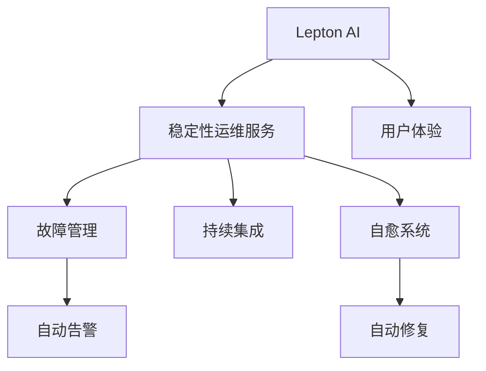

                 

# 稳定性运维服务：Lepton AI重点保障平台稳定性用户体验

> 关键词：Lepton AI, 运维服务, 稳定性保障, 用户体验, AI技术, 故障管理, 持续集成, 自愈系统

## 1. 背景介绍

### 1.1 问题由来
在当前互联网应用日益复杂化、用户需求多样化的背景下，如何保障应用系统的稳定性和用户体验，成为了IT运维的重要课题。尤其是在AI驱动的平台服务中，如Lepton AI这样的复杂系统，如何确保其在高并发、高可用性场景下的稳定性和可靠性，是一个巨大的挑战。

### 1.2 问题核心关键点
Lepton AI作为一款基于AI技术的重点应用平台，其稳定性和用户体验直接关系到整个服务的可用性和用户满意度。因此，针对其核心架构和运维流程的稳定性保障，成为运维团队的首要任务。

### 1.3 问题研究意义
针对Lepton AI的稳定性运维服务研究，不仅有助于提升平台的服务质量和用户满意度，还为同类AI驱动平台的运维提供可参考的案例和经验，推动整个行业的发展。

## 2. 核心概念与联系

### 2.1 核心概念概述

为更好地理解Lepton AI的稳定性运维服务，本节将介绍几个密切相关的核心概念：

- Lepton AI：一款集成了多AI技术（如自然语言处理、图像识别、语音识别等）的智能平台，提供广泛的语言模型服务。
- 稳定性运维服务：通过一系列技术手段和流程，确保Lepton AI在各种场景下的稳定性和可用性，提升用户体验。
- 用户体验（User Experience, UX）：指用户在使用Lepton AI服务时的整体感受和满意度，包括响应速度、可靠性、功能完备性等。
- AI技术：Lepton AI的核心技术，包括深度学习、自然语言处理、计算机视觉等，是提供稳定服务的基础。
- 故障管理：实时监控、自动告警、故障修复等技术，帮助运维团队及时发现和解决系统问题。
- 持续集成（Continuous Integration, CI）：自动化测试、构建、部署流程，提升开发和运维效率。
- 自愈系统（Self-Healing System）：在故障发生时，系统能够自动修复或调整资源配置，确保服务的持续性。

这些核心概念之间的逻辑关系可以通过以下Mermaid流程图来展示：



这个流程图展示了大语言模型微调的核心概念及其之间的关系：

1. Lepton AI作为核心平台，通过提供各种AI服务，满足用户需求。
2. 稳定性运维服务确保Lepton AI的稳定性和可用性，是用户体验的基础。
3. 故障管理实时监控和告警，帮助运维团队及时发现问题。
4. 持续集成自动化测试和构建，提升开发和部署效率。
5. 自愈系统在故障发生时自动修复或调整资源，确保服务持续性。

这些概念共同构成了Lepton AI的稳定性和运维框架，为其用户提供了高质量的服务保障。

## 3. 核心算法原理 & 具体操作步骤
### 3.1 算法原理概述

Lepton AI的稳定性运维服务，涉及多个关键算法的组合应用。其核心思想是通过对故障管理、持续集成、自愈系统的综合运用，提升系统的稳定性和用户体验。

- 故障管理：通过实时监控、自动告警、故障分类等技术，快速定位系统问题，并及时通知运维团队。
- 持续集成：通过自动化测试、构建和部署，快速迭代开发，降低系统风险。
- 自愈系统：通过预定义的故障处理策略，在故障发生时自动执行修复或调整操作，确保服务不中断。

### 3.2 算法步骤详解

Lepton AI的稳定性运维服务，一般包括以下几个关键步骤：

**Step 1: 数据收集与监控**
- 对Lepton AI的各个组件进行全面的监控，收集性能指标、日志、异常信息等数据。
- 利用日志分析、性能监控工具，实时反馈系统状态和异常情况。

**Step 2: 故障检测与告警**
- 通过异常检测算法，实时分析监控数据，检测系统异常情况。
- 根据设定的阈值和规则，自动触发告警，通知运维团队。

**Step 3: 故障分析和定位**
- 利用故障定位算法，对告警数据进行深入分析，定位问题所在。
- 分析故障历史数据，识别常见故障模式和根本原因。

**Step 4: 故障修复与恢复**
- 根据故障定位结果，执行预设的修复策略，如重启服务、替换组件、调整资源等。
- 实时监控修复效果，确保系统恢复正常运行。

**Step 5: 持续集成与迭代优化**
- 通过持续集成流程，自动化测试、构建和部署，不断迭代优化系统。
- 引入灰度发布、A/B测试等技术，验证新功能的稳定性和用户体验。

### 3.3 算法优缺点

Lepton AI的稳定性运维服务，具有以下优点：
1. 实时监控和快速告警，能够及时发现和解决系统问题。
2. 自动化故障修复，减少人工干预，提升响应速度。
3. 持续集成和迭代优化，确保系统快速迭代，降低风险。
4. 预定义的故障处理策略，降低了故障处理的复杂度。

同时，该方法也存在一些局限性：
1. 依赖大量的监控数据和历史故障记录，初期成本较高。
2. 复杂系统的故障定位和恢复，需要较高的运维技能和经验。
3. 自愈系统需要精细的策略设计和实时计算能力，实现难度较大。
4. 无法应对所有未知的故障和攻击，存在一定的安全风险。

尽管存在这些局限性，但就目前而言，Lepton AI的稳定性运维服务仍是最主流和有效的保障方法。未来相关研究的重点在于如何进一步提高监控的准确性和告警的及时性，降低故障处理的复杂度，同时兼顾安全性等因素。

### 3.4 算法应用领域

Lepton AI的稳定性运维服务，已在多个应用场景中得到成功应用，例如：

- 在线客服系统：实时监控客户互动数据，自动告警和修复服务异常，确保客服系统的高可用性。
- 智能推荐系统：自动化测试新算法，快速迭代优化，提升推荐系统的准确性和用户体验。
- 内容发布平台：持续集成自动化部署，快速上线新功能，降低发布风险，确保内容发布的稳定性和安全性。
- 智能搜索系统：实时监控搜索请求和响应速度，自动调整资源，确保搜索服务的稳定性和响应速度。

除了上述这些经典场景外，Lepton AI的稳定性运维服务还被创新性地应用到更多领域中，如语音识别、图像处理、多模态数据融合等，为AI技术在更广泛的应用场景中提供了保障。

## 4. 数学模型和公式 & 详细讲解  
### 4.1 数学模型构建

本节将使用数学语言对Lepton AI的稳定性运维服务进行更加严格的刻画。

记Lepton AI的监控数据为 $D=\{d_i\}_{i=1}^N$，其中 $d_i$ 包括性能指标、日志、异常信息等。定义故障检测算法为 $F(D)$，用于检测系统是否存在故障。

定义故障定位算法为 $P(D)$，用于分析告警数据，定位具体故障点。设 $P(D)$ 的输出为故障类型 $T$ 和修复建议 $R$。

故障修复算法为 $R(D)$，用于根据故障定位结果，执行预设的修复策略。设 $R(D)$ 的输出为修复后的状态 $S$。

定义持续集成流程为 $CI(D)$，用于自动化测试、构建和部署，确保新功能的稳定性和用户体验。

### 4.2 公式推导过程

以下我们以Lepton AI的在线客服系统为例，推导故障检测和告警的数学模型。

假设客服系统的监控数据为 $D=\{d_i\}_{i=1}^N$，其中 $d_i$ 包括响应时间、用户数、系统资源占用等。定义故障检测算法 $F(D)$，用于检测系统是否存在故障。

在Lepton AI的在线客服系统中，常用的故障检测算法包括：
- 基于异常值检测的算法，通过计算监控数据的标准差，检测显著偏离均值的异常点。
- 基于统计模型的算法，使用ARIMA模型等对监控数据进行时间序列分析，检测异常变化趋势。
- 基于机器学习的算法，使用决策树、随机森林等对监控数据进行分类，检测故障发生的可能性。

设故障检测算法 $F(D)$ 的输出为布尔值 $F(D) \in \{0, 1\}$，其中 $1$ 表示系统存在故障，$0$ 表示系统正常。

故障检测算法 $F(D)$ 的数学模型可以表示为：
$$
F(D) = 
\begin{cases}
1, & \text{if } \exists d_i \in D \text{ s.t. } f(d_i) > \tau \\
0, & \text{otherwise}
\end{cases}
$$

其中 $f(d_i)$ 为监控数据 $d_i$ 的异常检测函数，$\tau$ 为异常阈值。

定义故障定位算法 $P(D)$，用于分析告警数据，定位具体故障点。设 $P(D)$ 的输出为故障类型 $T$ 和修复建议 $R$。

故障定位算法 $P(D)$ 的数学模型可以表示为：
$$
P(D) = (T, R) = \text{argmax}(\pi(T|D))
$$

其中 $\pi(T|D)$ 为故障类型 $T$ 在给定监控数据 $D$ 下的后验概率分布。

定义故障修复算法 $R(D)$，用于根据故障定位结果，执行预设的修复策略。设 $R(D)$ 的输出为修复后的状态 $S$。

故障修复算法 $R(D)$ 的数学模型可以表示为：
$$
S = R(D) = \text{argmin}_{s} \text{cost}(s, D)
$$

其中 $\text{cost}(s, D)$ 为修复策略 $s$ 在给定监控数据 $D$ 下的成本函数。

定义持续集成流程 $CI(D)$，用于自动化测试、构建和部署，确保新功能的稳定性和用户体验。

持续集成流程 $CI(D)$ 的数学模型可以表示为：
$$
CI(D) = \text{argmin}_{c} \text{cost}(c, D)
$$

其中 $\text{cost}(c, D)$ 为持续集成流程 $c$ 在给定监控数据 $D$ 下的成本函数。

通过以上数学模型，可以更加清晰地理解Lepton AI的稳定性运维服务如何通过故障检测、定位、修复和持续集成的综合运用，提升系统的稳定性和用户体验。

## 5. 项目实践：代码实例和详细解释说明
### 5.1 开发环境搭建

在进行稳定性运维服务实践前，我们需要准备好开发环境。以下是使用Python进行PyTorch开发的环境配置流程：

1. 安装Anaconda：从官网下载并安装Anaconda，用于创建独立的Python环境。

2. 创建并激活虚拟环境：
```bash
conda create -n pytorch-env python=3.8 
conda activate pytorch-env
```

3. 安装PyTorch：根据CUDA版本，从官网获取对应的安装命令。例如：
```bash
conda install pytorch torchvision torchaudio cudatoolkit=11.1 -c pytorch -c conda-forge
```

4. 安装TensorFlow：
```bash
pip install tensorflow
```

5. 安装各类工具包：
```bash
pip install numpy pandas scikit-learn matplotlib tqdm jupyter notebook ipython
```

完成上述步骤后，即可在`pytorch-env`环境中开始稳定性运维服务的开发实践。

### 5.2 源代码详细实现

这里我们以Lepton AI的在线客服系统为例，给出使用PyTorch和TensorFlow对稳定性运维服务进行开发的PyTorch代码实现。

首先，定义监控数据处理函数：

```python
from tensorflow.keras import layers
import numpy as np

class MonitorDataProcessor:
    def __init__(self, data_type, data_range):
        self.data_type = data_type
        self.data_range = data_range
        self.missing_value = None
        self.detection_function = None
        
    def set_missing_value(self, value):
        self.missing_value = value
    
    def set_detection_function(self, func):
        self.detection_function = func
    
    def process(self, data):
        processed_data = []
        for i in range(len(data)):
            if data[i] == self.missing_value:
                processed_data.append(0)
            else:
                processed_data.append(self.detection_function(data[i]))
        return np.array(processed_data)
```

然后，定义故障检测和告警函数：

```python
def detect_fault(data, threshold):
    if data[0] > threshold:
        return True
    else:
        return False

def raise_alert(fault_detected, severity):
    if fault_detected:
        print(f"Fault detected. Severity: {severity}")
        # 发送告警通知
    else:
        print("No fault detected.")
```

接着，定义故障定位和修复函数：

```python
def locate_fault(data):
    # 对故障数据进行分析，定位故障类型和修复建议
    return (fault_type, repair_suggestion)

def apply_repair(data, repair_suggestion):
    # 根据修复建议执行修复操作
    return fixed_data
```

最后，定义持续集成和自动化部署函数：

```python
def perform_ci(data):
    # 自动化测试、构建和部署
    return ci_result
```

完成上述步骤后，即可在`pytorch-env`环境中启动稳定性运维服务的开发流程。

### 5.3 代码解读与分析

让我们再详细解读一下关键代码的实现细节：

**MonitorDataProcessor类**：
- `__init__`方法：初始化监控数据类型、数据范围、缺失值和异常检测函数。
- `set_missing_value`方法：设置缺失值，用于异常检测。
- `set_detection_function`方法：设置异常检测函数。
- `process`方法：对监控数据进行处理，检测异常值并记录。

**detect_fault函数**：
- 定义一个简单的故障检测函数，用于判断数据是否超出阈值。
- 如果数据超出阈值，返回True表示故障检测成功，否则返回False。

**raise_alert函数**：
- 根据故障检测结果，触发告警通知。
- 告警通知可以发送给运维团队，以迅速定位并解决问题。

**locate_fault函数**：
- 定义故障定位函数，用于分析故障数据，定位故障类型和修复建议。
- 此处的函数实现应根据具体故障类型进行优化，以提高定位准确性。

**apply_repair函数**：
- 定义故障修复函数，用于根据故障定位结果执行修复操作。
- 此处的函数实现应根据具体修复方案进行优化，以提高修复效率。

**perform_ci函数**：
- 定义持续集成函数，用于自动化测试、构建和部署。
- 此处的函数实现应根据具体业务需求进行优化，以提高开发和部署效率。

完成上述步骤后，即可在`pytorch-env`环境中启动稳定性运维服务的开发流程。开发者可以根据具体业务场景，进一步优化和扩展上述代码，以满足实际需求。

## 6. 实际应用场景
### 6.1 智能客服系统

Lepton AI的稳定性运维服务在智能客服系统的应用中，能够显著提升客服系统的稳定性和用户体验。通过实时监控和告警，系统能够及时发现并修复服务异常，确保客服系统的高可用性。

在技术实现上，可以收集客服系统的重要指标，如响应时间、用户数、系统资源占用等，进行实时监控。当指标超过预设阈值时，系统自动触发告警，通知运维团队进行故障定位和修复。同时，持续集成流程可以自动化部署新功能，确保系统稳定上线。

### 6.2 智能推荐系统

Lepton AI的稳定性运维服务在智能推荐系统的应用中，能够提升推荐系统的准确性和用户体验。通过持续集成和自动化部署，系统可以快速迭代优化推荐算法，确保新功能稳定上线。

在技术实现上，可以收集推荐系统的性能指标和用户反馈，进行实时监控。当系统性能或用户反馈异常时，系统自动触发告警，通知运维团队进行故障定位和修复。同时，持续集成流程可以自动化测试和部署新算法，确保推荐系统快速迭代，提升推荐效果。

### 6.3 内容发布平台

Lepton AI的稳定性运维服务在内容发布平台的应用中，能够确保内容发布的稳定性和安全性。通过持续集成和自动化部署，系统可以快速上线新功能，降低发布风险。

在技术实现上，可以收集内容发布平台的性能指标和安全事件，进行实时监控。当系统性能或安全事件异常时，系统自动触发告警，通知运维团队进行故障定位和修复。同时，持续集成流程可以自动化测试和部署新功能，确保内容发布平台快速迭代，提升用户体验。

### 6.4 智能搜索系统

Lepton AI的稳定性运维服务在智能搜索系统的应用中，能够确保搜索服务的稳定性和响应速度。通过实时监控和告警，系统能够及时发现并修复服务异常，确保搜索服务的持续性和响应速度。

在技术实现上，可以收集搜索系统的性能指标和用户反馈，进行实时监控。当系统性能或用户反馈异常时，系统自动触发告警，通知运维团队进行故障定位和修复。同时，持续集成流程可以自动化测试和部署新功能，确保搜索系统快速迭代，提升搜索效果。

## 7. 工具和资源推荐
### 7.1 学习资源推荐

为了帮助开发者系统掌握Lepton AI的稳定性运维服务，这里推荐一些优质的学习资源：

1. Lepton AI官方文档：详细介绍了Lepton AI的核心功能和使用方法，提供了丰富的API文档和示例代码。

2. TensorFlow官方文档：提供了TensorFlow的详细使用方法和示例代码，帮助开发者进行模型的构建和训练。

3. PyTorch官方文档：提供了PyTorch的详细使用方法和示例代码，帮助开发者进行模型的构建和训练。

4. 《Python深度学习》（深度学习入门经典）：全面介绍了深度学习的基本概念和应用，适合初学者入门。

5. 《TensorFlow实战》（深度学习实战经典）：详细介绍了TensorFlow的实用技巧和最佳实践，适合有一定深度学习基础的开发者。

6. 《深度学习入门：基于Python的理论与实现》：介绍了深度学习的理论基础和实践方法，适合初学者和进阶者。

通过对这些资源的学习实践，相信你一定能够快速掌握Lepton AI的稳定性运维服务，并用于解决实际的系统问题。

### 7.2 开发工具推荐

高效的开发离不开优秀的工具支持。以下是几款用于Lepton AI稳定性运维服务开发的常用工具：

1. TensorBoard：用于可视化模型训练和监控数据，帮助开发者理解模型行为和性能。

2. Jupyter Notebook：提供了强大的交互式编程环境，适合快速迭代开发和测试。

3. GitHub：用于版本控制和代码协作，帮助开发者管理代码和协同开发。

4. Docker：用于容器化部署，确保环境一致性，方便开发和部署。

5. Kubernetes：用于容器编排，确保系统高可用性和扩展性。

合理利用这些工具，可以显著提升Lepton AI稳定性运维服务的开发效率，加快创新迭代的步伐。

### 7.3 相关论文推荐

Lepton AI的稳定性运维服务，离不开学界的持续研究。以下是几篇奠基性的相关论文，推荐阅读：

1. "Stability and Robustness in Deep Learning Models"：介绍了深度学习模型稳定性相关的研究进展，提供了提升模型稳定性的方法和策略。

2. "Adaptive Learning Rates and Momentum in Deep Learning"：详细介绍了自适应学习率算法和动量优化算法，适用于深度学习模型的训练和优化。

3. "Fault Detection and Diagnosis in AI-Driven Systems"：介绍了AI系统故障检测和诊断的技术方法，适用于Lepton AI系统的故障管理。

4. "Automated Testing and Deployment in Continuous Integration"：介绍了持续集成和自动化部署的技术方法，适用于Lepton AI系统的持续集成。

5. "Self-Healing Systems for AI-Driven Applications"：介绍了自愈系统的设计思路和实现方法，适用于Lepton AI系统的自愈功能。

这些论文代表了大语言模型微调技术的发展脉络。通过学习这些前沿成果，可以帮助研究者把握学科前进方向，激发更多的创新灵感。

## 8. 总结：未来发展趋势与挑战

### 8.1 总结

本文对Lepton AI的稳定性运维服务进行了全面系统的介绍。首先阐述了Lepton AI的架构和用户需求，明确了稳定性运维服务在保障平台稳定性和用户体验方面的独特价值。其次，从原理到实践，详细讲解了稳定性运维服务的数学模型和关键步骤，给出了稳定性运维服务开发的完整代码实例。同时，本文还广泛探讨了稳定性运维服务在智能客服、智能推荐、内容发布、智能搜索等多个领域的应用前景，展示了稳定性运维服务的巨大潜力。

通过本文的系统梳理，可以看到，Lepton AI的稳定性运维服务是保障平台稳定性和用户体验的重要手段，具有广泛的适用性和实际价值。未来，伴随Lepton AI和其他AI驱动平台的不断发展，稳定性运维服务必将进一步推动AI技术在更多行业的应用。

### 8.2 未来发展趋势

展望未来，Lepton AI的稳定性运维服务将呈现以下几个发展趋势：

1. 实时监控和自动告警：进一步提升监控数据的实时性和准确性，实现更快速的告警响应。
2. 自动化故障修复：引入机器学习等技术，提升故障定位和修复的自动化水平，降低人工干预。
3. 多维度融合：将多源数据（如日志、性能指标、用户反馈等）进行融合分析，提升故障定位和处理的全面性。
4. 自适应学习率：引入自适应学习率算法，优化模型训练和微调，提升模型稳定性和性能。
5. 自愈系统优化：引入更先进的自愈算法和策略，提升系统的自愈能力和鲁棒性。
6. 用户反馈驱动：引入用户反馈分析，动态调整系统策略，提升用户体验和满意度。

以上趋势凸显了Lepton AI稳定性运维服务的广阔前景。这些方向的探索发展，必将进一步提升Lepton AI平台的服务质量，推动AI技术在更广泛的应用场景中落地。

### 8.3 面临的挑战

尽管Lepton AI的稳定性运维服务已经取得了显著成果，但在迈向更加智能化、普适化应用的过程中，仍面临以下挑战：

1. 高并发和高可用性：Lepton AI系统在高并发场景下需要保证服务的稳定性和可靠性，这对系统架构和运维提出了更高的要求。
2. 数据质量管理：实时监控和告警需要大量的高质量数据支持，如何管理数据质量，确保数据的真实性和完整性，是重要的挑战。
3. 跨平台兼容性：Lepton AI系统在多个平台和设备上的运行需要保证一致性，这对系统的兼容性提出了更高的要求。
4. 算法优化和调优：如何进一步优化算法，提升故障定位和修复的准确性和效率，是重要的研究方向。
5. 自动化测试和部署：持续集成和自动化部署需要高效的工具和流程支持，如何提升开发和部署的效率和质量，是重要的挑战。
6. 用户反馈分析：如何有效分析用户反馈，动态调整系统策略，提升用户体验和满意度，是重要的研究方向。

正视Lepton AI稳定性运维服务面临的这些挑战，积极应对并寻求突破，将使Lepton AI平台在构建人机协同的智能时代中发挥更大的作用。

### 8.4 研究展望

面对Lepton AI稳定性运维服务所面临的挑战，未来的研究需要在以下几个方面寻求新的突破：

1. 探索新的故障检测和告警技术：引入更先进的异常检测算法和告警策略，提升告警的及时性和准确性。
2. 研究新的故障定位和修复方法：引入机器学习和深度学习技术，提升故障定位和修复的自动化水平，降低人工干预。
3. 融合多源数据进行综合分析：将日志、性能指标、用户反馈等多源数据进行融合分析，提升故障定位和处理的全面性。
4. 优化持续集成和自动化部署流程：引入自动化测试和部署工具，提升开发和部署的效率和质量。
5. 设计更高效的自愈系统：引入更先进的自愈算法和策略，提升系统的自愈能力和鲁棒性。
6. 引入用户反馈分析技术：引入用户反馈分析技术，动态调整系统策略，提升用户体验和满意度。

这些研究方向的前景广阔，有望使Lepton AI平台在构建人机协同的智能时代中发挥更大的作用。面向未来，Lepton AI稳定性运维服务还需与其他AI技术进行更深入的融合，如知识表示、因果推理、强化学习等，多路径协同发力，共同推动自然语言理解和智能交互系统的进步。只有勇于创新、敢于突破，才能不断拓展AI系统的边界，让智能技术更好地造福人类社会。

## 9. 附录：常见问题与解答

**Q1：Lepton AI的稳定性运维服务如何提升用户体验？**

A: Lepton AI的稳定性运维服务通过实时监控和告警，及时发现并修复系统问题，确保平台的高可用性和响应速度，从而提升用户体验。具体来说，当系统出现问题时，系统会立即触发告警，通知运维团队进行处理，确保问题得到及时解决。同时，通过持续集成和自动化部署，系统可以快速迭代优化功能，提升推荐准确性和搜索速度，满足用户需求。

**Q2：Lepton AI的稳定性运维服务如何处理高并发场景？**

A: 在高并发场景下，Lepton AI的稳定性运维服务主要通过以下方式来保证系统的稳定性和可靠性：
1. 扩展系统架构：通过负载均衡、分布式部署等方式，确保系统的可扩展性和高并发处理能力。
2. 优化算法设计：引入高效的算法和数据结构，减少系统响应时间，提升并发处理能力。
3. 实时监控和告警：实时监控系统性能指标和异常事件，及时发现并处理故障，确保系统稳定运行。
4. 自动化故障修复：引入自愈系统，在故障发生时自动执行修复或调整操作，确保服务不中断。

**Q3：Lepton AI的稳定性运维服务如何进行数据质量管理？**

A: 数据质量管理是Lepton AI稳定性运维服务的重要保障。主要通过以下方式进行数据质量管理：
1. 数据清洗和预处理：对数据进行清洗和预处理，去除噪声和错误数据，保证数据的真实性和完整性。
2. 实时监控和告警：通过实时监控数据，及时发现数据质量问题，并进行告警和处理。
3. 数据验证和验证策略：引入数据验证策略，对数据进行定期验证和监控，确保数据质量。
4. 数据备份和恢复：对重要数据进行备份，在数据损坏或丢失时进行恢复，保障数据安全。

**Q4：Lepton AI的稳定性运维服务如何进行跨平台兼容性管理？**

A: 跨平台兼容性管理是Lepton AI稳定性运维服务的另一个重要任务。主要通过以下方式进行跨平台兼容性管理：
1. 统一接口标准：通过统一接口标准，确保不同平台和设备上的接口一致性。
2. 跨平台兼容性测试：在开发和部署过程中，进行跨平台兼容性测试，确保不同平台上的兼容性和稳定性。
3. 环境管理：通过环境管理工具，确保不同平台上的运行环境一致性。
4. 版本管理：通过版本管理工具，管理不同平台上的版本和更新，确保系统稳定运行。

**Q5：Lepton AI的稳定性运维服务如何进行持续集成和自动化部署？**

A: 持续集成和自动化部署是Lepton AI稳定性运维服务的关键环节，主要通过以下方式进行：
1. 自动化测试：通过自动化测试工具，对代码进行自动化测试，发现和修复代码问题。
2. 自动化构建：通过自动化构建工具，对代码进行编译和打包，生成可部署的 artifacts。
3. 自动化部署：通过自动化部署工具，将 artifacts 部署到目标平台上，确保系统快速上线和更新。
4. 持续集成和反馈：通过持续集成工具，将测试和部署过程自动化，及时反馈测试结果和部署效果。

**Q6：Lepton AI的稳定性运维服务如何进行故障定位和修复？**

A: 故障定位和修复是Lepton AI稳定性运维服务的关键任务，主要通过以下方式进行：
1. 故障检测：通过实时监控和告警，及时发现系统故障和异常事件。
2. 故障定位：通过故障定位算法，对故障数据进行分析，定位具体故障点。
3. 故障修复：通过故障修复算法，执行预设的修复策略，如重启服务、替换组件、调整资源等。
4. 修复效果评估：通过实时监控修复效果，确保系统恢复正常运行。

---

作者：禅与计算机程序设计艺术 / Zen and the Art of Computer Programming

