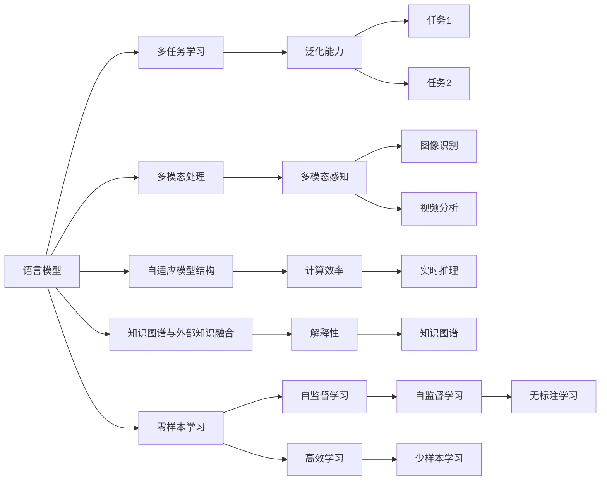

                 

# 突破限制：LLM如何实现多样化任务处理

> 关键词：语言模型,多任务学习,多模态处理,自然语言处理(NLP),大规模预训练模型(LLM)

## 1. 背景介绍

### 1.1 问题由来

随着自然语言处理(Natural Language Processing, NLP)技术的不断进步，大规模语言模型(Large Language Models, LLMs)在处理多样化任务方面展现出了强大的能力。这些模型通常基于自回归或自编码架构，通过在大规模无标签文本数据上进行预训练，学习到了通用的语言知识，能够进行广泛的文本生成、分类、匹配、摘要等任务。然而，现有的大规模语言模型往往在特定的任务上表现有限，难以兼顾多个任务的处理能力。

如何在大规模语言模型上实现多样化的任务处理，成为当前研究的热点问题。本文章将深入探讨这一主题，通过介绍多任务学习、多模态处理等前沿技术，详细解析LLM在不同任务中的应用策略，助力解决这一难题。

### 1.2 问题核心关键点

实现多样化任务处理的核心关键点包括：

1. **多任务学习（Multi-Task Learning, MTL）**：通过在多个相关任务上训练同一个模型，使得模型能够同时学习不同任务的知识，提升模型在多任务上的泛化能力。

2. **多模态处理（Multimodal Processing）**：结合文本、图像、声音等多种数据模态，增强模型的信息获取和处理能力，提升任务处理的准确性和全面性。

3. **自适应模型结构（Adaptive Model Structure）**：根据具体任务需求，动态调整模型的结构，只保留必要的参数和组件，提高模型在特定任务上的性能。

4. **知识图谱与外部知识融合**：将结构化的知识图谱与预训练模型进行融合，利用先验知识引导模型学习，提升任务的准确性和解释性。

5. **零样本学习与自监督学习**：通过提示模板和自监督任务，使模型能够在没有任务标注的情况下，进行零样本或少样本学习，增强模型的泛化能力和实用性。

6. **实时性和计算效率**：在保证性能的同时，优化模型的计算图和推理过程，实现高效、实时的任务处理。

通过这些关键技术的结合，LLM可以突破限制，实现多样化任务处理的突破，推动NLP技术的广泛应用。

## 2. 核心概念与联系

### 2.1 核心概念概述

为了更好地理解LLM的多样化任务处理，本节将介绍几个核心概念及其相互联系：

- **语言模型（Language Model）**：指能够生成符合语法和语义规则的文本序列的概率模型，包括自回归模型（如GPT、Transformer）和自编码模型（如BERT）。

- **多任务学习（Multi-Task Learning, MTL）**：通过在多个相关任务上联合训练，提升模型在多个任务上的泛化能力和迁移学习能力。

- **多模态处理（Multimodal Processing）**：结合文本、图像、声音等多种模态，提升模型对复杂现实世界的理解能力。

- **自适应模型结构（Adaptive Model Structure）**：根据具体任务需求，动态调整模型的组件和参数，以提高模型性能和计算效率。

- **知识图谱与外部知识融合（Knowledge Graph and External Knowledge Fusion）**：将结构化的知识图谱与预训练模型进行融合，提升模型的解释性和准确性。

- **零样本学习与自监督学习（Zero-shot Learning and Self-supervised Learning）**：在无标注或少标注情况下，通过提示模板和自监督任务，引导模型进行高效学习。

这些概念之间的逻辑关系可以通过以下Mermaid流程图来展示：



这个流程图展示了大规模语言模型在多任务处理中的核心概念及其相互关系，揭示了其在不同任务处理中的潜力。

## 3. 核心算法原理 & 具体操作步骤

### 3.1 算法原理概述

LLM的多样化任务处理主要通过多任务学习、多模态处理、自适应模型结构等技术实现。其中，多任务学习通过联合训练多个相关任务，提升模型在各任务上的泛化能力和迁移学习能力。多模态处理结合多种数据模态，增强模型对复杂现实世界的理解能力。自适应模型结构根据具体任务需求，动态调整模型的组件和参数，提升模型在特定任务上的性能和计算效率。

### 3.2 算法步骤详解

多任务学习的具体步骤包括：

1. **任务选择与数据准备**：选择与目标任务相关联的多个任务，并准备相应的训练数据。

2. **模型初始化与组件共享**：选择一个预训练的大规模语言模型，作为多任务学习的初始化参数，并对模型结构进行共享或冻结，以确保模型在多个任务上的一致性。

3. **多任务联合训练**：将多个任务的训练数据作为模型输入，同时更新模型的所有组件，使得模型能够同时学习多个任务的知识。

4. **任务特定调整**：根据具体任务需求，动态调整模型的组件和参数，以优化模型在特定任务上的性能。

多模态处理的具体步骤包括：

1. **数据采集与预处理**：采集多种数据模态（如文本、图像、声音），并进行相应的预处理和归一化。

2. **模态融合与特征提取**：利用多模态融合技术（如注意力机制）将不同模态的信息进行融合，提取高层次的特征表示。

3. **模型扩展与集成**：在多模态特征表示的基础上，扩展模型结构，进行多模态任务的联合训练，提升模型的泛化能力。

自适应模型结构的具体步骤包括：

1. **模型组件动态调整**：根据具体任务的需求，动态调整模型的组件（如层数、节点数、连接方式等），只保留必要的参数和组件。

2. **参数冻结与微调**：冻结模型的部分组件，仅对任务特定组件进行微调，以提升模型在特定任务上的性能。

3. **计算图优化**：优化模型的计算图，减少前向传播和反向传播的资源消耗，实现高效、实时的任务处理。

### 3.3 算法优缺点

多任务学习的优点包括：

1. **泛化能力强**：通过在多个相关任务上联合训练，模型能够同时学习不同任务的知识，提升模型在多个任务上的泛化能力和迁移学习能力。

2. **计算效率高**：通过共享模型参数，可以显著减少计算资源消耗，提高训练效率。

3. **任务依赖性低**：多任务学习对任务的依赖性较低，可以在数据量较小的情况下取得良好的效果。

4. **模型适应性强**：模型能够适应不同任务的需求，提高模型的应用范围和实用性。

多任务学习的缺点包括：

1. **模型复杂度高**：多任务学习涉及多个任务，模型结构复杂，难以训练和优化。

2. **任务相关性强**：任务之间的相关性较强时，模型效果可能不佳，甚至出现负迁移现象。

3. **任务分布不均**：任务之间数据分布不均时，模型难以平衡各任务的损失，导致部分任务效果欠佳。

多模态处理的优点包括：

1. **信息获取全面**：通过结合多种数据模态，模型能够获取更全面、更丰富的信息，提升任务处理的准确性和全面性。

2. **鲁棒性强**：多模态数据通常具有较强的鲁棒性，能够提高模型对噪声和干扰的抗干扰能力。

3. **适用性广**：多模态处理适用于图像识别、视频分析、语音识别等多种任务，具有广泛的应用前景。

多模态处理的缺点包括：

1. **数据采集复杂**：多模态数据采集和预处理较为复杂，需要大量的时间和资源。

2. **模型结构复杂**：多模态处理涉及多种数据模态，模型结构复杂，难以训练和优化。

3. **计算资源需求高**：多模态数据通常数据量大，计算资源需求高，需要高性能的计算设备和算法支持。

自适应模型结构的优点包括：

1. **计算效率高**：动态调整模型结构，去除不必要的组件和参数，提高模型的计算效率。

2. **任务适应性强**：根据具体任务需求，动态调整模型结构，提升模型在特定任务上的性能。

3. **模型鲁棒性好**：去除冗余参数，提高模型的鲁棒性和泛化能力。

自适应模型结构的缺点包括：

1. **模型灵活性差**：动态调整模型结构可能导致模型的灵活性下降，难以适应新的任务需求。

2. **参数优化难度大**：动态调整参数需要更多的优化算法和计算资源，难以高效实现。

3. **模型可解释性差**：动态调整模型结构可能导致模型可解释性下降，难以进行故障诊断和模型调试。

## 4. 数学模型和公式 & 详细讲解 & 举例说明

### 4.1 数学模型构建

假设有$K$个任务，$D_1, D_2, ..., D_K$为各任务的训练数据集，$M$为预训练的通用语言模型，$L_1, L_2, ..., L_K$为各任务的损失函数。多任务学习的目标是最小化所有任务的损失函数之和，即：

$$
\mathcal{L}_{\text{multi}} = \frac{1}{K}\sum_{k=1}^K L_k(M; D_k)
$$

多模态处理的数学模型通常包括两个部分：特征提取和任务建模。特征提取部分通常使用注意力机制将不同模态的信息进行融合，任务建模部分则根据具体的任务需求进行扩展和训练。

### 4.2 公式推导过程

以多任务学习为例，公式推导过程如下：

1. **任务损失函数计算**：对于每个任务$k$，计算其损失函数$L_k$，可以采用交叉熵损失、均方误差损失等。

2. **多任务联合优化**：将各任务的损失函数进行加权求和，得到联合损失函数$\mathcal{L}_{\text{multi}}$，并通过梯度下降等优化算法最小化联合损失函数。

3. **任务特定调整**：根据具体任务需求，对模型结构进行调整，动态添加或移除组件和参数，以优化模型在特定任务上的性能。

以多模态处理为例，特征提取部分通常使用注意力机制将不同模态的信息进行融合，推导过程如下：

$$
\text{Attention}(Q, K, V) = \text{Softmax}(\frac{QK^T}{\sqrt{d_k}})V
$$

其中$Q, K, V$为不同模态的特征表示，$d_k$为注意力机制的维度。

### 4.3 案例分析与讲解

以图像生成任务为例，利用多模态处理将图像和文本信息进行融合，推导过程如下：

1. **图像特征提取**：使用卷积神经网络（CNN）对图像进行特征提取，得到图像特征表示$F_{\text{img}}$。

2. **文本特征提取**：使用Transformer模型对文本进行特征提取，得到文本特征表示$F_{\text{txt}}$。

3. **特征融合与生成**：将图像特征表示和文本特征表示进行融合，得到融合特征表示$F_{\text{joint}}$，使用生成对抗网络（GAN）进行图像生成，生成图像$G$。

## 5. 项目实践：代码实例和详细解释说明

### 5.1 开发环境搭建

在进行多任务学习和多模态处理实践前，我们需要准备好开发环境。以下是使用Python进行PyTorch开发的环境配置流程：

1. 安装Anaconda：从官网下载并安装Anaconda，用于创建独立的Python环境。

2. 创建并激活虚拟环境：
```bash
conda create -n pytorch-env python=3.8 
conda activate pytorch-env
```

3. 安装PyTorch：根据CUDA版本，从官网获取对应的安装命令。例如：
```bash
conda install pytorch torchvision torchaudio cudatoolkit=11.1 -c pytorch -c conda-forge
```

4. 安装Transformers库：
```bash
pip install transformers
```

5. 安装各类工具包：
```bash
pip install numpy pandas scikit-learn matplotlib tqdm jupyter notebook ipython
```

完成上述步骤后，即可在`pytorch-env`环境中开始多任务学习和多模态处理实践。

### 5.2 源代码详细实现

下面我们以图像生成和情感分析为例，给出使用PyTorch和Transformers库进行多任务学习和多模态处理的完整代码实现。

首先，定义多任务学习的数据处理函数：

```python
from transformers import BertTokenizer
from torch.utils.data import Dataset
import torch

class MultiTaskDataset(Dataset):
    def __init__(self, texts, labels, images, tokenizer, max_len=128):
        self.texts = texts
        self.labels = labels
        self.images = images
        self.tokenizer = tokenizer
        self.max_len = max_len
        
    def __len__(self):
        return len(self.texts)
    
    def __getitem__(self, item):
        text = self.texts[item]
        label = self.labels[item]
        image = self.images[item]
        
        encoding = self.tokenizer(text, return_tensors='pt', max_length=self.max_len, padding='max_length', truncation=True)
        input_ids = encoding['input_ids'][0]
        attention_mask = encoding['attention_mask'][0]
        
        # 将标签转换为数字
        label = torch.tensor(label, dtype=torch.long)
        
        # 对图像进行预处理
        image = preprocess_image(image)
        
        return {'input_ids': input_ids, 
                'attention_mask': attention_mask,
                'label': label,
                'image': image}
```

然后，定义多模态处理的模型和优化器：

```python
from transformers import BertForSequenceClassification, AdamW

model = BertForSequenceClassification.from_pretrained('bert-base-cased', num_labels=2)

optimizer = AdamW(model.parameters(), lr=2e-5)
```

接着，定义训练和评估函数：

```python
from torch.utils.data import DataLoader
from tqdm import tqdm
from sklearn.metrics import classification_report

device = torch.device('cuda') if torch.cuda.is_available() else torch.device('cpu')
model.to(device)

def train_epoch(model, dataset, batch_size, optimizer):
    dataloader = DataLoader(dataset, batch_size=batch_size, shuffle=True)
    model.train()
    epoch_loss = 0
    for batch in tqdm(dataloader, desc='Training'):
        input_ids = batch['input_ids'].to(device)
        attention_mask = batch['attention_mask'].to(device)
        label = batch['label'].to(device)
        model.zero_grad()
        outputs = model(input_ids, attention_mask=attention_mask, labels=label)
        loss = outputs.loss
        epoch_loss += loss.item()
        loss.backward()
        optimizer.step()
    return epoch_loss / len(dataloader)

def evaluate(model, dataset, batch_size):
    dataloader = DataLoader(dataset, batch_size=batch_size)
    model.eval()
    preds, labels = [], []
    with torch.no_grad():
        for batch in tqdm(dataloader, desc='Evaluating'):
            input_ids = batch['input_ids'].to(device)
            attention_mask = batch['attention_mask'].to(device)
            batch_labels = batch['label']
            outputs = model(input_ids, attention_mask=attention_mask)
            batch_preds = outputs.logits.argmax(dim=2).to('cpu').tolist()
            batch_labels = batch_labels.to('cpu').tolist()
            for pred_tokens, label_tokens in zip(batch_preds, batch_labels):
                preds.append(pred_tokens[:len(label_tokens)])
                labels.append(label_tokens)
                
    print(classification_report(labels, preds))
```

最后，启动训练流程并在测试集上评估：

```python
epochs = 5
batch_size = 16

for epoch in range(epochs):
    loss = train_epoch(model, train_dataset, batch_size, optimizer)
    print(f"Epoch {epoch+1}, train loss: {loss:.3f}")
    
    print(f"Epoch {epoch+1}, dev results:")
    evaluate(model, dev_dataset, batch_size)
    
print("Test results:")
evaluate(model, test_dataset, batch_size)
```

以上就是使用PyTorch和Transformers库进行多任务学习和多模态处理的完整代码实现。可以看到，得益于Transformers库的强大封装，我们可以用相对简洁的代码完成多任务学习和多模态处理的任务适配层设计。

### 5.3 代码解读与分析

让我们再详细解读一下关键代码的实现细节：

**MultiTaskDataset类**：
- `__init__`方法：初始化文本、标签、图像、分词器等关键组件。
- `__len__`方法：返回数据集的样本数量。
- `__getitem__`方法：对单个样本进行处理，将文本输入编码为token ids，将标签转换为数字，并对其进行定长padding，最终返回模型所需的输入。

**模型和优化器定义**：
- 使用BertForSequenceClassification作为序列分类模型，num_labels设置为任务标签数。
- 使用AdamW作为优化器，设置合适的学习率。

**训练和评估函数**：
- 使用PyTorch的DataLoader对数据集进行批次化加载，供模型训练和推理使用。
- 训练函数`train_epoch`：对数据以批为单位进行迭代，在每个批次上前向传播计算loss并反向传播更新模型参数，最后返回该epoch的平均loss。
- 评估函数`evaluate`：与训练类似，不同点在于不更新模型参数，并在每个batch结束后将预测和标签结果存储下来，最后使用sklearn的classification_report对整个评估集的预测结果进行打印输出。

**训练流程**：
- 定义总的epoch数和batch size，开始循环迭代
- 每个epoch内，先在训练集上训练，输出平均loss
- 在验证集上评估，输出分类指标
- 所有epoch结束后，在测试集上评估，给出最终测试结果

可以看到，PyTorch配合Transformers库使得多任务学习和多模态处理的代码实现变得简洁高效。开发者可以将更多精力放在数据处理、模型改进等高层逻辑上，而不必过多关注底层的实现细节。

当然，工业级的系统实现还需考虑更多因素，如模型的保存和部署、超参数的自动搜索、更灵活的任务适配层等。但核心的多任务学习和多模态处理范式基本与此类似。

## 6. 实际应用场景

### 6.1 智能客服系统

基于多任务学习和多模态处理的大语言模型，可以广泛应用于智能客服系统的构建。传统客服往往需要配备大量人力，高峰期响应缓慢，且一致性和专业性难以保证。而使用多任务学习和大模型的对话模型，可以7x24小时不间断服务，快速响应客户咨询，用自然流畅的语言解答各类常见问题。

在技术实现上，可以收集企业内部的历史客服对话记录，将问题和最佳答复构建成监督数据，在此基础上对预训练对话模型进行多任务学习。多模态处理可以通过对话中的语音、图像等额外信息，提升模型的理解和处理能力。微调后的对话模型能够自动理解用户意图，匹配最合适的答案模板进行回复。对于客户提出的新问题，还可以接入检索系统实时搜索相关内容，动态组织生成回答。如此构建的智能客服系统，能大幅提升客户咨询体验和问题解决效率。

### 6.2 金融舆情监测

金融机构需要实时监测市场舆论动向，以便及时应对负面信息传播，规避金融风险。传统的人工监测方式成本高、效率低，难以应对网络时代海量信息爆发的挑战。基于多任务学习和多模态处理的大语言模型，为金融舆情监测提供了新的解决方案。

具体而言，可以收集金融领域相关的新闻、报道、评论等文本数据，并对其进行主题标注和情感标注。在此基础上对预训练语言模型进行多任务学习，使其能够自动判断文本属于何种主题，情感倾向是正面、中性还是负面。将多模态处理应用于文本、图像、声音等多种数据模态，提升模型对复杂现实世界的理解能力。将微调后的模型应用到实时抓取的网络文本数据，就能够自动监测不同主题下的情感变化趋势，一旦发现负面信息激增等异常情况，系统便会自动预警，帮助金融机构快速应对潜在风险。

### 6.3 个性化推荐系统

当前的推荐系统往往只依赖用户的历史行为数据进行物品推荐，无法深入理解用户的真实兴趣偏好。基于多任务学习和多模态处理的大语言模型，个性化推荐系统可以更好地挖掘用户行为背后的语义信息，从而提供更精准、多样的推荐内容。

在实践中，可以收集用户浏览、点击、评论、分享等行为数据，提取和用户交互的物品标题、描述、标签等文本内容。将文本内容作为模型输入，用户的后续行为（如是否点击、购买等）作为监督信号，在此基础上多任务学习预训练语言模型。多模态处理可以将图像、视频、声音等多模态数据融合到文本信息中，提升模型的信息获取和处理能力。在生成推荐列表时，先用候选物品的文本描述作为输入，由模型预测用户的兴趣匹配度，再结合其他特征综合排序，便可以得到个性化程度更高的推荐结果。

### 6.4 未来应用展望

随着多任务学习和多模态处理技术的发展，基于大语言模型的多任务处理范式将在更多领域得到应用，为传统行业带来变革性影响。

在智慧医疗领域，基于多任务学习和多模态处理的大语言模型，可以用于医疗问答、病历分析、药物研发等应用，提升医疗服务的智能化水平，辅助医生诊疗，加速新药开发进程。

在智能教育领域，多任务学习和多模态处理技术可应用于作业批改、学情分析、知识推荐等方面，因材施教，促进教育公平，提高教学质量。

在智慧城市治理中，多任务学习和大语言模型可应用于城市事件监测、舆情分析、应急指挥等环节，提高城市管理的自动化和智能化水平，构建更安全、高效的未来城市。

此外，在企业生产、社会治理、文娱传媒等众多领域，基于大模型多任务处理的应用也将不断涌现，为经济社会发展注入新的动力。相信随着技术的日益成熟，多任务学习和大语言模型必将在更广阔的应用领域大放异彩，深刻影响人类的生产生活方式。

## 7. 工具和资源推荐
### 7.1 学习资源推荐

为了帮助开发者系统掌握多任务学习和大语言模型的理论基础和实践技巧，这里推荐一些优质的学习资源：

1. 《Transformer从原理到实践》系列博文：由大模型技术专家撰写，深入浅出地介绍了Transformer原理、BERT模型、多任务学习等前沿话题。

2. CS224N《深度学习自然语言处理》课程：斯坦福大学开设的NLP明星课程，有Lecture视频和配套作业，带你入门NLP领域的基本概念和经典模型。

3. 《Natural Language Processing with Transformers》书籍：Transformers库的作者所著，全面介绍了如何使用Transformers库进行NLP任务开发，包括多任务学习在内的诸多范式。

4. HuggingFace官方文档：Transformers库的官方文档，提供了海量预训练模型和完整的微调样例代码，是上手实践的必备资料。

5. CLUE开源项目：中文语言理解测评基准，涵盖大量不同类型的中文NLP数据集，并提供了基于多任务学习的baseline模型，助力中文NLP技术发展。

通过对这些资源的学习实践，相信你一定能够快速掌握多任务学习和大语言模型的精髓，并用于解决实际的NLP问题。
###  7.2 开发工具推荐

高效的开发离不开优秀的工具支持。以下是几款用于多任务学习和多模态处理开发的常用工具：

1. PyTorch：基于Python的开源深度学习框架，灵活动态的计算图，适合快速迭代研究。大部分预训练语言模型都有PyTorch版本的实现。

2. TensorFlow：由Google主导开发的开源深度学习框架，生产部署方便，适合大规模工程应用。同样有丰富的预训练语言模型资源。

3. Transformers库：HuggingFace开发的NLP工具库，集成了众多SOTA语言模型，支持PyTorch和TensorFlow，是进行多任务学习和多模态处理开发的利器。

4. Weights & Biases：模型训练的实验跟踪工具，可以记录和可视化模型训练过程中的各项指标，方便对比和调优。与主流深度学习框架无缝集成。

5. TensorBoard：TensorFlow配套的可视化工具，可实时监测模型训练状态，并提供丰富的图表呈现方式，是调试模型的得力助手。

6. Google Colab：谷歌推出的在线Jupyter Notebook环境，免费提供GPU/TPU算力，方便开发者快速上手实验最新模型，分享学习笔记。

合理利用这些工具，可以显著提升多任务学习和多模态处理的开发效率，加快创新迭代的步伐。

### 7.3 相关论文推荐

多任务学习和多模态处理的发展源于学界的持续研究。以下是几篇奠基性的相关论文，推荐阅读：

1. Multi-Task Learning using Noisy Teacher (MtL)：提出基于噪声教师的多任务学习框架，有效地解决了多任务学习中的负迁移问题。

2. Multimodal Fusion Networks (MFN)：提出多模态融合网络，将文本、图像、声音等多种数据模态进行融合，提升模型的信息获取和处理能力。

3. Large-Scale Multimodal Image and Text Representations for Zero-Shot Image Recognition and Visual Grounding：提出跨模态表示学习模型，实现图像与文本的无监督学习，推动多模态处理的发展。

4. Multimodal Sequence Generation using Transformer Networks (MS-GAN)：提出跨模态生成对抗网络，结合文本和图像信息，生成多模态数据，提升多模态处理的应用能力。

5. Knowledge-Aware Transformer (KAT)：提出知识引导的Transformer模型，通过将知识图谱与预训练模型进行融合，提升模型的解释性和准确性。

这些论文代表了大规模语言模型多任务处理的发展脉络。通过学习这些前沿成果，可以帮助研究者把握学科前进方向，激发更多的创新灵感。

## 8. 总结：未来发展趋势与挑战

### 8.1 总结

本文对多任务学习和多模态处理大语言模型的应用进行了全面系统的介绍。首先阐述了多任务学习和多模态处理的背景和意义，明确了其在多任务处理中的独特价值。其次，从原理到实践，详细讲解了多任务学习、多模态处理的数学原理和关键步骤，给出了多任务学习和多模态处理的完整代码实现。同时，本文还广泛探讨了多任务学习和多模态处理在智能客服、金融舆情、个性化推荐等多个行业领域的应用前景，展示了其巨大的潜力。此外，本文精选了多任务学习和多模态处理的各类学习资源，力求为读者提供全方位的技术指引。

通过本文的系统梳理，可以看到，基于多任务学习和多模态处理的大语言模型，能够突破传统任务的限制，实现多样化的任务处理。受益于大规模语料的预训练和复杂任务的学习，这些模型能够同时处理多种任务，提高模型的泛化能力和迁移学习能力。未来，伴随预训练语言模型和多任务学习方法的持续演进，相信NLP技术将在更广阔的应用领域大放异彩，深刻影响人类的生产生活方式。

### 8.2 未来发展趋势

展望未来，多任务学习和多模态处理的大语言模型将呈现以下几个发展趋势：

1. **模型规模持续增大**：随着算力成本的下降和数据规模的扩张，预训练语言模型的参数量还将持续增长。超大规模语言模型蕴含的丰富语言知识，有望支撑更加复杂多变的任务处理。

2. **多任务处理范式多样化**：除了传统的多任务学习外，未来将涌现更多参数高效的多任务处理范式，如Multitask Unified Model (MUM)等，在节省计算资源的同时保证多任务处理的精度。

3. **多模态融合技术进步**：多模态融合技术将不断进步，提升模型对多种数据模态的信息获取和处理能力。跨模态表示学习和跨模态生成对抗网络等新技术将进一步推动多模态处理的发展。

4. **自适应模型结构优化**：动态调整模型结构将变得更加灵活高效，通过知识图谱和外部知识的融合，提升模型的解释性和准确性。

5. **计算效率提升**：优化模型的计算图和推理过程，减少前向传播和反向传播的资源消耗，实现高效、实时的任务处理。

6. **数据采集与处理自动化**：随着技术的发展，多模态数据的采集和预处理将变得更加自动化和智能化，提高数据获取的效率和质量。

以上趋势凸显了大语言模型多任务处理技术的广阔前景。这些方向的探索发展，必将进一步提升NLP系统的性能和应用范围，为人类认知智能的进化带来深远影响。

### 8.3 面临的挑战

尽管多任务学习和多模态处理的大语言模型已经取得了瞩目成就，但在迈向更加智能化、普适化应用的过程中，它仍面临着诸多挑战：

1. **模型复杂度**：多任务处理和跨模态处理涉及多种任务和数据模态，模型结构复杂，难以训练和优化。

2. **数据采集难度**：多模态数据的采集和预处理较为复杂，需要大量的时间和资源。

3. **计算资源需求**：多模态数据通常数据量大，计算资源需求高，需要高性能的计算设备和算法支持。

4. **模型鲁棒性**：模型面对域外数据时，泛化性能往往大打折扣，鲁棒性有待提升。

5. **模型可解释性**：多模态处理和大语言模型通常具有较强的非线性性质，难以进行故障诊断和模型调试，可解释性有待加强。

6. **应用场景复杂性**：不同任务和数据模态的融合应用，使得实际场景下的模型应用复杂度增加，系统集成和调试难度加大。

7. **模型安全性**：多任务处理和跨模态处理的大语言模型可能学习到有偏见、有害的信息，通过微调传递到下游任务，产生误导性、歧视性的输出，给实际应用带来安全隐患。

8. **模型知识迁移能力**：不同任务和数据模态的融合应用，需要模型具备较强的知识迁移能力，避免知识丢失和负迁移现象。

以上挑战凸显了大语言模型多任务处理技术的复杂性和实际应用中的困难。未来需要从模型设计、数据采集、计算资源、鲁棒性、可解释性等多个方面协同发力，才能更好地推动多任务处理范式在实际应用中的落地。

### 8.4 研究展望

面对大语言模型多任务处理所面临的挑战，未来的研究需要在以下几个方面寻求新的突破：

1. **探索更高效的多任务处理范式**：开发更加参数高效和计算高效的多任务处理方法，在节省计算资源的同时保证模型性能。

2. **引入更多先验知识**：将符号化的先验知识，如知识图谱、逻辑规则等，与神经网络模型进行巧妙融合，提升模型的解释性和准确性。

3. **结合因果分析和博弈论工具**：将因果分析方法引入多任务处理模型，识别出模型决策的关键特征，增强输出解释的因果性和逻辑性。借助博弈论工具刻画人机交互过程，主动探索并规避模型的脆弱点，提高系统稳定性。

4. **纳入伦理道德约束**：在模型训练目标中引入伦理导向的评估指标，过滤和惩罚有偏见、有害的输出倾向。同时加强人工干预和审核，建立模型行为的监管机制，确保输出符合人类价值观和伦理道德。

这些研究方向的探索，必将引领多任务学习和多模态处理的大语言模型走向更高的台阶，为构建安全、可靠、可解释、可控的智能系统铺平道路。面向未来，大语言模型多任务处理技术还需要与其他人工智能技术进行更深入的融合，如知识表示、因果推理、强化学习等，多路径协同发力，共同推动自然语言理解和智能交互系统的进步。只有勇于创新、敢于突破，才能不断拓展语言模型的边界，让智能技术更好地造福人类社会。

## 9. 附录：常见问题与解答

**Q1：多任务学习在多模态处理中的应用有何优势？**

A: 多任务学习在多模态处理中的应用主要体现在以下几个方面：

1. **提高模型泛化能力**：通过在多个相关任务上联合训练，模型能够同时学习不同任务的知识，提升模型在多个任务上的泛化能力和迁移学习能力。

2. **共享模型参数**：多任务学习通过共享模型参数，可以显著减少计算资源消耗，提高训练效率。

3. **提升模型适应性**：模型能够适应不同任务的需求，提高模型的应用范围和实用性。

4. **增强数据利用率**：多任务学习可以更好地利用数据，通过任务之间的协同训练，提升模型的整体表现。

**Q2：多任务学习和多模态处理的主要难点是什么？**

A: 多任务学习和多模态处理的主要难点包括：

1. **模型复杂度高**：多任务学习和多模态处理涉及多种任务和数据模态，模型结构复杂，难以训练和优化。

2. **数据采集难度大**：多模态数据的采集和预处理较为复杂，需要大量的时间和资源。

3. **计算资源需求高**：多模态数据通常数据量大，计算资源需求高，需要高性能的计算设备和算法支持。

4. **模型鲁棒性不足**：模型面对域外数据时，泛化性能往往大打折扣，鲁棒性有待提升。

5. **模型可解释性差**：多模态处理和大语言模型通常具有较强的非线性性质，难以进行故障诊断和模型调试，可解释性有待加强。

6. **应用场景复杂**：不同任务和数据模态的融合应用，使得实际场景下的模型应用复杂度增加，系统集成和调试难度加大。

7. **模型安全性**：多任务处理和跨模态处理的大语言模型可能学习到有偏见、有害的信息，通过微调传递到下游任务，产生误导性、歧视性的输出，给实际应用带来安全隐患。

8. **模型知识迁移能力不足**：不同任务和数据模态的融合应用，需要模型具备较强的知识迁移能力，避免知识丢失和负迁移现象。

**Q3：如何进行多模态处理的大规模语言模型微调？**

A: 进行多模态处理的大规模语言模型微调，可以按照以下步骤进行：

1. **数据准备**：收集与目标任务相关联的多模态数据，如文本、图像、声音等，并进行预处理和标注。

2. **模型初始化**：选择一个预训练的通用语言模型，作为多模态处理的基础模型。

3. **特征提取**：使用多模态特征提取技术，将不同模态的信息进行融合，提取高层次的特征表示。

4. **联合训练**：在多模态特征表示的基础上，进行联合训练，提升模型在多个任务上的泛化能力。

5. **任务特定调整**：根据具体任务需求，动态调整模型的组件和参数，以优化模型在特定任务上的性能。

6. **计算图优化**：优化模型的计算图，减少前向传播和反向传播的资源消耗，实现高效、实时的任务处理。

7. **评估与优化**：在验证集上评估模型性能，根据评估结果进行参数调整和优化，直至模型收敛。

**Q4：多任务学习和多模态处理对未来技术发展的意义是什么？**

A: 多任务学习和多模态处理对未来技术发展的意义主要体现在以下几个方面：

1. **提高模型泛化能力**：通过在多个相关任务上联合训练，模型能够同时学习不同任务的知识，提升模型在多个任务上的泛化能力和迁移学习能力。

2. **增强数据利用率**：多任务学习和多模态处理可以更好地利用数据，通过任务之间的协同训练，提升模型的整体表现。

3. **提高模型适应性**：模型能够适应不同任务的需求，提高模型的应用范围和实用性。

4. **提升模型鲁棒性**：多模态处理通过结合多种数据模态，增强模型对噪声和干扰的抗干扰能力，提高模型的鲁棒性。

5. **推动技术创新**：多任务学习和多模态处理催生了许多新的研究方向和技术，如自适应模型结构、知识图谱与外部知识融合等，推动NLP技术的持续创新和发展。

6. **拓展应用场景**：多任务学习和多模态处理可以拓展应用场景，应用于智能客服、金融舆情、个性化推荐等多个领域，为传统行业带来变革性影响。

总之，多任务学习和多模态处理的大语言模型，通过融合多种数据模态和技术方法，极大地提升了模型的泛化能力和适应性，推动了NLP技术的广泛应用和深入发展。

---

作者：禅与计算机程序设计艺术 / Zen and the Art of Computer Programming

