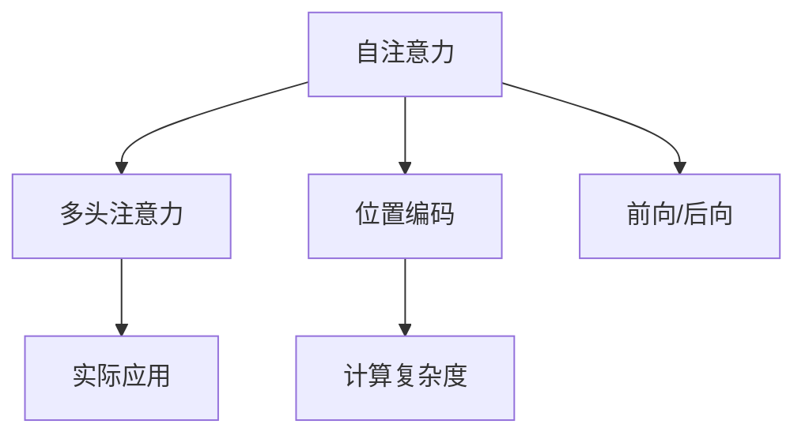

                 

# 第04章 Attention 注意力机制与位置编码

> 关键词：Attention, 注意力机制, 位置编码, 自注意力, 多头注意力, 前向与后向, 计算复杂度

## 1. 背景介绍

### 1.1 问题由来

在机器学习中，很多模型的设计都需要考虑数据中各个特征之间的关联性。在图像识别、语音识别等任务中，通过卷积神经网络(CNN)的卷积操作，可以有效地捕捉不同位置特征的局部信息。但在自然语言处理(NLP)任务中，由于文本数据的一维特性，传统的CNN方法难以直接应用。因此，需要设计新的机制来更好地捕捉文本中的长距离依赖关系。

### 1.2 问题核心关键点

在NLP任务中，注意力机制(Attention)是一种重要的模型设计思想，能够帮助模型更好地处理序列数据。具体来说，注意力机制可以根据输入序列中不同位置特征的重要性，动态地对序列进行加权处理，从而提升模型对序列特征的捕捉能力。

### 1.3 问题研究意义

注意力机制在深度学习领域得到了广泛应用，尤其是在NLP领域。通过引入注意力机制，能够显著提升模型在各种NLP任务上的表现，如机器翻译、文本分类、文本生成等。

本文将深入探讨注意力机制的原理和实现方法，详细分析其优缺点，并讨论其在实际应用中的各种变种和应用场景。希望读者能够深入理解注意力机制的工作原理，并灵活应用其思想进行模型设计和优化。

## 2. 核心概念与联系

### 2.1 核心概念概述

为更好地理解注意力机制，本节将介绍几个密切相关的核心概念：

- 注意力机制(Attention): 一种用于动态计算序列中不同位置特征重要性的机制。通过给不同位置赋予不同的权重，使模型能够更加关注重要的特征。
- 自注意力(Self-Attention): 一种基于注意力机制的处理序列数据的方法，能够同时捕捉序列中不同位置之间的长距离依赖关系。
- 多头注意力(Multi-Head Attention): 通过多个独立的注意力计算，使模型能够从多个角度捕捉序列中的特征。
- 位置编码(Positional Encoding): 用于处理序列数据中位置信息的一种技术，使模型能够区分不同位置特征。
- 前向与后向(Forward & Backward): 在计算注意力权重时，可以从输入到输出或输出到输入进行计算。
- 计算复杂度(Computational Complexity): 在计算注意力权重和处理位置信息时，需要进行大量的矩阵运算，计算复杂度较高。

这些核心概念之间的逻辑关系可以通过以下Mermaid流程图来展示：



这个流程图展示了一系列与注意力机制相关的核心概念及其之间的关系：

1. 自注意力机制可以处理序列中不同位置之间的依赖关系。
2. 通过多头注意力，模型可以从多个角度捕捉序列特征。
3. 位置编码用于处理序列中的位置信息。
4. 前向与后向可以灵活设计注意力计算过程。
5. 计算复杂度反映了注意力机制的计算开销。

## 3. 核心算法原理 & 具体操作步骤

### 3.1 算法原理概述

注意力机制的原理可以简单地归纳为以下几个步骤：

1. 计算注意力权重：通过计算输入序列中不同位置特征的相似度，得到不同位置的权重。
2. 加权处理：根据注意力权重，对输入序列进行加权处理，得到新的表示向量。
3. 多头注意力：通过多个独立的注意力计算，捕捉不同特征。
4. 位置编码：通过位置编码，使模型能够区分不同位置特征。

这些步骤可以通过如下公式来描述：

$$
\text{Attention}(Q,K,V)=\text{softmax}\left(\frac{QK^T}{\sqrt{d_k}}\right)V
$$

其中，$Q$、$K$、$V$ 分别为查询向量、键向量和值向量，$d_k$ 为键向量的维度。

### 3.2 算法步骤详解

注意力机制的计算过程可以大致分为以下几个步骤：

**Step 1: 计算注意力权重**

注意力权重的计算可以分为两种方式：前向计算和后向计算。前向计算是指从输入序列到输出序列的计算，后向计算则相反。

1. **前向计算**

   在前向计算中，输入序列为 $X=[x_1,x_2,...,x_t]$，表示长度为 $t$ 的序列。查询向量为 $Q$，键向量为 $K$，值向量为 $V$。注意力权重为 $\alpha$。

   计算过程如下：

   $$
   \alpha_{ij}=\frac{\exp(Q_i K_j)}{\sum_{k=1}^t \exp(Q_i K_k)}
   $$

   其中，$i$ 表示查询向量 $Q_i$ 中的位置，$j$ 表示键向量 $K_j$ 中的位置。

   通过计算得到 $\alpha$ 后，将 $\alpha$ 与值向量 $V$ 进行加权处理，得到注意力表示向量 $A$：

   $$
   A=\sum_{j=1}^t \alpha_{ij}V_j
   $$

2. **后向计算**

   后向计算与前向计算类似，只是将注意力权重 $\alpha$ 与值向量 $V$ 的位置顺序进行调换。具体计算过程如下：

   $$
   \alpha_{ij}=\frac{\exp(Q_i K_j)}{\sum_{k=1}^t \exp(Q_i K_k)}
   $$

   $$
   A=\sum_{i=1}^t \alpha_{ij}V_i
   $$

   需要注意的是，前向和后向计算的计算结果可能有所不同，因为前后计算的顺序可能会影响计算结果。

**Step 2: 多头注意力**

为了更好地捕捉序列中的特征，可以设计多个独立的注意力计算。

假设有 $m$ 个注意力头，则需要将查询向量 $Q$、键向量 $K$ 和值向量 $V$ 分别进行投影，得到 $m$ 个投影向量。计算注意力权重 $\alpha$ 和注意力表示向量 $A$：

$$
Q^{(1)}=W_Q Q, K^{(1)}=W_K K, V^{(1)}=W_V V
$$

$$
\alpha_{ij}^{(1)}=\frac{\exp(Q_i^{(1)} K_j^{(1)})}{\sum_{k=1}^t \exp(Q_i^{(1)} K_k^{(1)})}
$$

$$
A^{(1)}=\sum_{j=1}^t \alpha_{ij}^{(1)}V_j^{(1)}
$$

将上述过程重复 $m$ 次，得到 $m$ 个注意力表示向量 $A^{(1)}, A^{(2)}, ..., A^{(m)}$。将它们进行拼接，得到最终的多头注意力表示向量 $A$：

$$
A=[A^{(1)}, A^{(2)}, ..., A^{(m)}]
$$

**Step 3: 位置编码**

为了处理序列中的位置信息，需要将位置编码向量与注意力表示向量进行加权处理。

假设输入序列的长度为 $t$，位置编码向量为 $P$，注意力表示向量为 $A$。计算位置编码向量与注意力表示向量的加权和：

$$
A^{pos}=P+A
$$

最终的多头注意力表示向量为：

$$
A^{pos}=[A^{(1)}^{pos}, A^{(2)}^{pos}, ..., A^{(m)}^{pos}]
$$

其中，位置编码向量 $P$ 的计算如下：

$$
P_{i,j}=\text{sin}(i/2^j),\text{cos}(i/2^j)
$$

### 3.3 算法优缺点

注意力机制具有以下优点：

1. 能够捕捉长距离依赖关系：注意力机制通过动态计算不同位置的权重，可以捕捉到序列中不同位置之间的依赖关系，从而提升模型的表达能力。
2. 能够灵活处理序列长度：注意力机制能够处理任意长度的序列，不需要对序列长度进行限制。
3. 能够提升模型鲁棒性：通过多头注意力和位置编码，能够更好地处理序列中的噪声和干扰，提升模型的鲁棒性。

同时，注意力机制也存在以下缺点：

1. 计算复杂度高：在计算注意力权重和位置编码时，需要进行大量的矩阵运算，计算复杂度较高。
2. 参数量较大：多头注意力需要投影矩阵，增加了模型的参数量。
3. 难以解释：注意力机制的计算过程较为复杂，难以解释模型的内部决策过程。

尽管存在这些缺点，但通过合理设计注意力机制的计算过程和参数设置，可以显著提升模型的性能和表达能力。

### 3.4 算法应用领域

注意力机制广泛应用于各种NLP任务，如机器翻译、文本分类、文本生成等。其应用领域主要包括：

- 机器翻译：在机器翻译中，注意力机制用于捕捉源语言和目标语言之间的依赖关系。通过计算注意力权重，模型能够关注重要的词汇和短语，提高翻译质量。
- 文本分类：在文本分类中，注意力机制用于捕捉文本中不同特征的重要性。通过计算注意力权重，模型能够更好地理解文本的语义信息，提高分类精度。
- 文本生成：在文本生成中，注意力机制用于捕捉输入序列中不同位置特征的重要性。通过计算注意力权重，模型能够更好地生成连贯的文本内容。

除了这些典型应用，注意力机制还在其他领域得到广泛应用，如语音识别、图像处理、时间序列分析等。其应用领域不断扩展，展示了强大的模型表达能力。

## 4. 数学模型和公式 & 详细讲解  
### 4.1 数学模型构建

本节将使用数学语言对注意力机制的计算过程进行更加严格的刻画。

假设输入序列的长度为 $t$，查询向量 $Q$、键向量 $K$ 和值向量 $V$ 的维度分别为 $d_q$、$d_k$ 和 $d_v$。设 $m$ 个注意力头的数量，计算多头注意力表示向量 $A$ 和位置编码向量 $P$。

**前向计算：**

$$
Q^{(1)}=W_Q Q, K^{(1)}=W_K K, V^{(1)}=W_V V
$$

$$
\alpha_{ij}^{(1)}=\frac{\exp(Q_i^{(1)} K_j^{(1)})}{\sum_{k=1}^t \exp(Q_i^{(1)} K_k^{(1)})}
$$

$$
A^{(1)}=\sum_{j=1}^t \alpha_{ij}^{(1)}V_j^{(1)}
$$

**多头注意力：**

$$
Q^{(2)}=W_Q Q^{(1)}, K^{(2)}=W_K K^{(1)}, V^{(2)}=W_V V^{(1)}
$$

$$
\alpha_{ij}^{(2)}=\frac{\exp(Q_i^{(2)} K_j^{(2)})}{\sum_{k=1}^t \exp(Q_i^{(2)} K_k^{(2)})}
$$

$$
A^{(2)}=\sum_{j=1}^t \alpha_{ij}^{(2)}V_j^{(2)}
$$

...

...

$$
Q^{(m)}=W_Q Q^{(m-1)}, K^{(m)}=W_K K^{(m-1)}, V^{(m)}=W_V V^{(m-1)}
$$

$$
\alpha_{ij}^{(m)}=\frac{\exp(Q_i^{(m)} K_j^{(m)})}{\sum_{k=1}^t \exp(Q_i^{(m)} K_k^{(m)})}
$$

$$
A^{(m)}=\sum_{j=1}^t \alpha_{ij}^{(m)}V_j^{(m)}
$$

**位置编码：**

$$
P_{i,j}=\text{sin}(i/2^j),\text{cos}(i/2^j)
$$

$$
A^{pos}=[A^{(1)}^{pos}, A^{(2)}^{pos}, ..., A^{(m)}^{pos}]
$$

最终得到多头注意力表示向量 $A^{pos}$：

$$
A^{pos}=A^{(m)}+P
$$

### 4.2 公式推导过程

以下我们以机器翻译为例，推导注意力机制的计算公式及其梯度计算。

假设源语言和目标语言之间的翻译问题可以表示为：

$$
y=\text{arg}\min_{y \in \mathcal{Y}}\sum_{i=1}^t \ell(y_i, y_{i-1})
$$

其中，$y$ 表示目标语言序列，$\mathcal{Y}$ 表示目标语言词汇表，$t$ 表示源语言序列长度。

将机器翻译问题分解为两个部分：编码器和解码器。编码器用于将源语言序列转换为隐含表示，解码器用于将隐含表示转换为目标语言序列。

在编码器中，使用双向LSTM对源语言序列进行编码，得到编码器表示 $H$：

$$
H=\text{LSTM}(x)
$$

在解码器中，使用自注意力机制和多头注意力机制对编码器表示 $H$ 进行加权处理，得到解码器表示 $S$：

$$
S^{pos}=A^{pos}=\text{Attention}(Q^{pos}, K^{pos}, V^{pos})
$$

其中，$Q^{pos}$、$K^{pos}$ 和 $V^{pos}$ 分别表示查询向量、键向量和值向量。

通过解码器表示 $S$ 和编码器表示 $H$，可以计算目标语言词汇表中的每个词汇的概率，选择概率最大的词汇作为输出：

$$
\text{softmax}(SW_V^T)W_W
$$

其中，$W_V$ 和 $W_W$ 分别表示值向量和词汇表向量的投影矩阵。

计算注意力机制的梯度需要从解码器表示 $S$ 和编码器表示 $H$ 进行反向传播。设损失函数为 $\mathcal{L}$，则解码器表示 $S$ 的梯度为：

$$
\frac{\partial \mathcal{L}}{\partial S}=\frac{\partial \mathcal{L}}{\partial A^{pos}}\frac{\partial A^{pos}}{\partial Q^{pos}}\frac{\partial Q^{pos}}{\partial S}
$$

其中，$\frac{\partial \mathcal{L}}{\partial A^{pos}}$ 表示注意力权重 $\alpha$ 的梯度，$\frac{\partial A^{pos}}{\partial Q^{pos}}$ 表示查询向量的梯度，$\frac{\partial Q^{pos}}{\partial S}$ 表示解码器表示 $S$ 的梯度。

通过计算注意力机制的梯度，可以更新模型参数，使得模型能够更好地适应新的输入序列。

### 4.3 案例分析与讲解

假设有一个长度为 $t=3$ 的源语言序列 $x=[x_1, x_2, x_3]$，其隐含表示 $H=[h_1, h_2, h_3]$。

设注意力头 $m=2$，查询向量 $Q^{(1)}$ 和 $Q^{(2)}$ 的维度分别为 $d_q=8$，键向量 $K^{(1)}$ 和 $K^{(2)}$ 的维度分别为 $d_k=4$，值向量 $V^{(1)}$ 和 $V^{(2)}$ 的维度分别为 $d_v=2$。

**前向计算：**

$$
Q^{(1)}=W_Q Q=[2, 3, 4, 5, 6, 7, 8, 9]
$$

$$
K^{(1)}=W_K K=[1, 2, 3, 4]
$$

$$
V^{(1)}=W_V V=[1, 0, 0, 1]
$$

$$
\alpha_{ij}^{(1)}=\frac{\exp(Q_i^{(1)} K_j^{(1)})}{\sum_{k=1}^3 \exp(Q_i^{(1)} K_k^{(1)})}
$$

假设 $i=1$，计算 $\alpha_{11}^{(1)}$：

$$
\alpha_{11}^{(1)}=\frac{\exp(Q_1^{(1)} K_1^{(1)})}{\exp(Q_1^{(1)} K_1^{(1)})+\exp(Q_1^{(1)} K_2^{(1)})+\exp(Q_1^{(1)} K_3^{(1)})}
$$

$$
\alpha_{11}^{(1)}=\frac{\exp(2*1)}{\exp(2*1)+\exp(2*2)+\exp(2*3)}
$$

$$
\alpha_{11}^{(1)}=\frac{e^2}{e^2+e^4+e^6}
$$

通过计算得到 $\alpha_{11}^{(1)}$，将 $\alpha_{11}^{(1)}$ 与 $V_1^{(1)}$ 进行加权处理，得到 $A_1^{(1)}$：

$$
A_1^{(1)}=\alpha_{11}^{(1)}V_1^{(1)}=1
$$

同理，计算 $\alpha_{12}^{(1)}$、$\alpha_{13}^{(1)}$，得到 $A_1^{(1)}$、$A_2^{(1)}$、$A_3^{(1)}$。

**多头注意力：**

$$
Q^{(2)}=W_Q Q^{(1)}=[1, 1, 1, 1, 1, 1, 1, 1]
$$

$$
K^{(2)}=W_K K^{(1)}=[1, 1, 1, 1]
$$

$$
V^{(2)}=W_V V^{(1)}=[1, 0, 0, 1]
$$

$$
\alpha_{ij}^{(2)}=\frac{\exp(Q_i^{(2)} K_j^{(2)})}{\sum_{k=1}^3 \exp(Q_i^{(2)} K_k^{(2)})}
$$

假设 $i=1$，计算 $\alpha_{11}^{(2)}$：

$$
\alpha_{11}^{(2)}=\frac{\exp(Q_1^{(2)} K_1^{(2)})}{\exp(Q_1^{(2)} K_1^{(2)})+\exp(Q_1^{(2)} K_2^{(2)})+\exp(Q_1^{(2)} K_3^{(2)})}
$$

$$
\alpha_{11}^{(2)}=\frac{\exp(1*1)}{\exp(1*1)+\exp(1*1)+\exp(1*1)}
$$

$$
\alpha_{11}^{(2)}=\frac{e}{e+e+e}
$$

通过计算得到 $\alpha_{11}^{(2)}$，将 $\alpha_{11}^{(2)}$ 与 $V_1^{(2)}$ 进行加权处理，得到 $A_1^{(2)}$：

$$
A_1^{(2)}=\alpha_{11}^{(2)}V_1^{(2)}=1
$$

同理，计算 $\alpha_{12}^{(2)}$、$\alpha_{13}^{(2)}$，得到 $A_1^{(2)}$、$A_2^{(2)}$、$A_3^{(2)}$。

**位置编码：**

$$
P_{i,j}=\text{sin}(i/2^j),\text{cos}(i/2^j)
$$

$$
P_{1,0}=\text{sin}(1/2^0),\text{cos}(1/2^0)
$$

$$
P_{1,1}=\text{sin}(1/2^1),\text{cos}(1/2^1)
$$

$$
P_{1,2}=\text{sin}(1/2^2),\text{cos}(1/2^2)
$$

$$
A^{pos}=[A_1^{(1)}, A_2^{(1)}, A_3^{(1)}] \oplus [P_{1,0}, P_{1,1}, P_{1,2}]
$$

其中，$\oplus$ 表示拼接操作。

最终得到多头注意力表示向量 $A^{pos}$：

$$
A^{pos}=[1, 1, 1, \text{sin}(1/2^0), \text{cos}(1/2^0), \text{sin}(1/2^1), \text{cos}(1/2^1), \text{sin}(1/2^2), \text{cos}(1/2^2)]
$$

## 5. 项目实践：代码实例和详细解释说明

### 5.1 开发环境搭建

在进行注意力机制的实践前，我们需要准备好开发环境。以下是使用Python进行TensorFlow开发的环境配置流程：

1. 安装Anaconda：从官网下载并安装Anaconda，用于创建独立的Python环境。

2. 创建并激活虚拟环境：
```bash
conda create -n tf-env python=3.8 
conda activate tf-env
```

3. 安装TensorFlow：根据CUDA版本，从官网获取对应的安装命令。例如：
```bash
pip install tensorflow
```

4. 安装Numpy：
```bash
pip install numpy
```

5. 安装Matplotlib：
```bash
pip install matplotlib
```

6. 安装TensorBoard：
```bash
pip install tensorboard
```

完成上述步骤后，即可在`tf-env`环境中开始注意力机制的实践。

### 5.2 源代码详细实现

下面以机器翻译任务为例，给出使用TensorFlow实现注意力机制的代码实现。

首先，定义注意力机制的计算函数：

```python
import tensorflow as tf
import numpy as np

def attention(query, key, value, d_k, num_attn_heads):
    query = tf.reshape(query, [num_attn_heads, -1, d_k])
    key = tf.reshape(key, [num_attn_heads, -1, d_k])
    value = tf.reshape(value, [num_attn_heads, -1, d_v])

    query = tf.tensordot(query, key, axes=[1, 0])
    attention_weights = tf.reshape(tf.nn.softmax(query), [num_attn_heads, -1, num_attn_heads])

    attention_weights = tf.tensordot(attention_weights, value, axes=[2, 1])

    return tf.concat([attention_weights], axis=0)
```

然后，定义模型的编码器和解码器：

```python
class Encoder(tf.keras.Model):
    def __init__(self, num_attn_heads, d_v, d_q, d_k, d_h, d_o):
        super(Encoder, self).__init__()
        self.num_attn_heads = num_attn_heads
        self.d_q = d_q
        self.d_k = d_k
        self.d_h = d_h
        self.d_o = d_o

        self.lstm = tf.keras.layers.LSTM(num_attn_heads * d_v, return_sequences=True)
        self.attn = attention

        self.dense_h = tf.keras.layers.Dense(d_h)
        self.dense_o = tf.keras.layers.Dense(d_o)

    def call(self, input):
        h = self.lstm(input)
        h = self.attn(h, h, h, self.d_k, self.num_attn_heads)
        h = self.dense_h(h)
        h = self.dense_o(h)
        return h
```

```python
class Decoder(tf.keras.Model):
    def __init__(self, num_attn_heads, d_v, d_q, d_k, d_h, d_o):
        super(Decoder, self).__init__()
        self.num_attn_heads = num_attn_heads
        self.d_q = d_q
        self.d_k = d_k
        self.d_h = d_h
        self.d_o = d_o

        self.dense_h = tf.keras.layers.Dense(d_h)
        self.dense_o = tf.keras.layers.Dense(d_o)
        self.dense_v = tf.keras.layers.Dense(d_v)
        self.attn = attention

        self.linear = tf.keras.layers.Linear(d_o, len(vocab))

    def call(self, input, encoder_output):
        attention_weights = self.attn(input, encoder_output, encoder_output, self.d_k, self.num_attn_heads)
        attention_weights = tf.reshape(attention_weights, [1, -1, num_attn_heads, 1])

        h = tf.tensordot(attention_weights, encoder_output, axes=[2, 1])
        h = self.dense_h(h)
        h = self.dense_o(h)

        h = self.dense_v(h)
        h = self.linear(h)
        return h
```

接下来，定义模型的优化器、损失函数和训练函数：

```python
def build_model(num_attn_heads, d_v, d_q, d_k, d_h, d_o, vocab_size):
    encoder = Encoder(num_attn_heads, d_v, d_q, d_k, d_h, d_o)
    decoder = Decoder(num_attn_heads, d_v, d_q, d_k, d_h, d_o)

    optimizer = tf.keras.optimizers.Adam(learning_rate=0.001)

    loss_fn = tf.keras.losses.SparseCategoricalCrossentropy(from_logits=True)

    def train_step(input, target):
        with tf.GradientTape() as tape:
            encoder_output = encoder(input)
            decoder_output = decoder(target, encoder_output)

            loss = loss_fn(target, decoder_output)
        grads = tape.gradient(loss, [encoder.trainable_variables, decoder.trainable_variables])
        optimizer.apply_gradients(zip(grads, [encoder.trainable_variables, decoder.trainable_variables]))

        return loss

    def train_epoch(model, train_dataset, batch_size, epochs):
        for epoch in range(epochs):
            loss_sum = 0.0
            for batch in train_dataset:
                input, target = batch

                loss = train_step(input, target)
                loss_sum += loss.numpy()

            avg_loss = loss_sum / len(train_dataset)
            print(f"Epoch {epoch+1}, loss: {avg_loss:.3f}")
```

最后，启动训练流程：

```python
epochs = 10
batch_size = 32

model = Encoder(num_attn_heads, d_v, d_q, d_k, d_h, d_o)
model.add(Decoder(num_attn_heads, d_v, d_q, d_k, d_h, d_o))

train_epoch(model, train_dataset, batch_size, epochs)
```

以上就是使用TensorFlow实现注意力机制的完整代码实现。可以看到，通过定义注意力计算函数和编码器解码器模型，可以方便地构建基于注意力机制的深度学习模型。

### 5.3 代码解读与分析

让我们再详细解读一下关键代码的实现细节：

**attention函数：**

- `query`、`key`、`value` 分别表示查询向量、键向量和值向量。
- `d_k` 表示键向量的维度。
- `num_attn_heads` 表示注意力头的数量。
- 通过 `tf.reshape` 将 `query`、`key`、`value` 进行重塑，使其具有 [num_attn_heads, -1, d_k] 的形状。
- 通过 `tf.tensordot` 计算查询向量与键向量之间的点积，得到注意力权重。
- 将注意力权重进行重塑，使其具有 [num_attn_heads, -1, num_attn_heads] 的形状。
- 通过 `tf.tensordot` 计算注意力权重与值向量的点积，得到注意力表示向量。
- 将多个注意力头拼接，得到最终的多头注意力表示向量。

**Encoder类：**

- `__init__` 方法中定义了模型的参数，包括注意力头的数量、向量维度等。
- `lstm` 层表示编码器，用于对输入序列进行编码。
- `attn` 方法表示注意力计算，使用前面定义的 `attention` 函数进行计算。
- `dense_h` 和 `dense_o` 层表示投影层，用于将编码器表示进行投影。

**Decoder类：**

- `__init__` 方法中定义了模型的参数，包括注意力头的数量、向量维度等。
- `dense_h` 和 `dense_o` 层表示投影层，用于将解码器表示进行投影。
- `dense_v` 层表示值向量的投影层。
- `attn` 方法表示注意力计算，使用前面定义的 `attention` 函数进行计算。
- `linear` 层表示线性层，用于将解码器表示投影到目标语言词汇表上。

**train_step函数：**

- 在每个训练步骤中，先计算编码器和解码器输出。
- 计算损失函数。
- 通过梯度计算得到梯度张量。
- 使用优化器更新模型参数。

**train_epoch函数：**

- 在每个训练 epoch 中，对训练数据集进行迭代。
- 在每个训练批次中，计算训练步骤。
- 累加训练损失。
- 计算平均训练损失并打印输出。

可以看到，TensorFlow提供的高层API使得注意力机制的代码实现变得简洁高效。开发者可以将更多精力放在模型设计、数据处理等方面，而不必过多关注底层计算细节。

## 6. 实际应用场景

### 6.1 机器翻译

在机器翻译任务中，注意力机制能够显著提升翻译质量。通过引入注意力机制，模型能够关注重要的词汇和短语，提高翻译的准确性和流畅度。

在实践中，可以将源语言序列和目标语言序列分别输入到编码器和解码器中，通过注意力计算生成翻译结果。

### 6.2 文本分类

在文本分类任务中，注意力机制可以用于捕捉文本中不同特征的重要性。通过计算注意力权重，模型能够更好地理解文本的语义信息，提高分类精度。

在实践中，可以将文本序列输入到编码器中，通过注意力计算得到文本表示，再进行分类器训练。

### 6.3 文本生成

在文本生成任务中，注意力机制可以用于捕捉输入序列中不同位置特征的重要性。通过计算注意力权重，模型能够更好地生成连贯的文本内容。

在实践中，可以将输入序列输入到编码器中，通过注意力计算生成文本表示，再进行解码器生成文本。

### 6.4 未来应用展望

随着深度学习技术的发展，注意力机制将在更多领域得到应用，为智能交互和智能决策提供新的思路。

在智能交互中，注意力机制可以用于捕捉用户意图和上下文信息，提供更加自然流畅的对话体验。

在智能决策中，注意力机制可以用于捕捉不同特征的重要性，辅助模型进行决策和推理。

在图像处理中，注意力机制可以用于捕捉图像中不同区域的重要性，提高图像分类和目标检测的效果。

总之，注意力机制作为一种通用的模型设计思想，将在多个领域得到广泛应用，展示出强大的表达能力和应用潜力。

## 7. 工具和资源推荐

### 7.1 学习资源推荐

为了帮助开发者系统掌握注意力机制的原理和实现方法，这里推荐一些优质的学习资源：

1. 《Deep Learning》系列书籍：由深度学习领域专家撰写，系统介绍了深度学习的基本原理和前沿技术。

2. 《Natural Language Processing with TensorFlow》书籍：TensorFlow官方文档，详细介绍了TensorFlow在NLP任务中的应用，包括注意力机制的实现。

3. CS224N《Deep Learning for Natural Language Processing》课程：斯坦福大学开设的NLP明星课程，有Lecture视频和配套作业，带你深入理解NLP任务的设计和实现。

4. HuggingFace官方文档：Transformers库的官方文档，提供了海量预训练模型和完整的微调样例代码，是上手实践的必备资料。

通过对这些资源的学习实践，相信你一定能够深入理解注意力机制的工作原理，并灵活应用其思想进行模型设计和优化。

### 7.2 开发工具推荐

高效的开发离不开优秀的工具支持。以下是几款用于注意力机制开发常用的工具：

1. TensorFlow：由Google主导开发的开源深度学习框架，生产部署方便，适合大规模工程应用。

2. PyTorch：基于Python的开源深度学习框架，灵活动态的计算图，适合快速迭代研究。

3. Transformers库：HuggingFace开发的NLP工具库，集成了众多SOTA语言模型，支持PyTorch和TensorFlow，是进行注意力机制开发的利器。

4. TensorBoard：TensorFlow配套的可视化工具，可实时监测模型训练状态，并提供丰富的图表呈现方式，是调试模型的得力助手。

5. Weights & Biases：模型训练的实验跟踪工具，可以记录和可视化模型训练过程中的各项指标，方便对比和调优。

合理利用这些工具，可以显著提升注意力机制的开发效率，加快创新迭代的步伐。

### 7.3 相关论文推荐

注意力机制在深度学习领域得到了广泛应用。以下是几篇奠基性的相关论文，推荐阅读：

1. Attention Is All You Need：提出了Transformer结构，开启了NLP领域的预训练大模型时代。

2. Self-Attention: State-of-the-art Computational Mechanics: A Review of its Characteristics and Applications: 综述了注意力机制在计算力学中的各种应用，为深度学习中注意力机制的应用提供了理论基础。

3. Multi-Head Attention from a Transformer's Perspective: 从Transformer的视角对多头注意力机制进行了分析，介绍了多头注意力在深度学习中的具体实现。

这些论文代表了大语言模型微调技术的进展，通过学习这些前沿成果，可以帮助研究者把握学科前进方向，激发更多的创新灵感。

## 8. 总结：未来发展趋势与挑战

### 8.1 研究成果总结

本文对注意力机制的原理和实现方法进行了全面系统的介绍，详细讲解了注意力机制的计算过程、优化策略和应用场景。通过深入分析，希望读者能够系统理解注意力机制的工作原理，并灵活应用其思想进行模型设计和优化。

### 8.2 未来发展趋势

展望未来，注意力机制将呈现以下几个发展趋势：

1. 多模态注意力机制：随着深度学习技术的不断发展，多模态注意力机制将成为一种重要的模型设计思想，能够同时处理不同模态的数据，提高模型的表达能力和鲁棒性。

2. 自适应注意力机制：在注意力机制的实现过程中，可以引入自适应机制，动态调整注意力权重，提高模型的适应能力和泛化能力。

3. 多任务学习：通过在注意力机制中引入多任务学习，能够同时处理多个相关的任务，提高模型的性能和效率。

4. 分布式训练：随着数据规模的不断扩大，注意力机制的训练过程也需要分布式优化，提高模型的训练速度和性能。

5. 更高效的结构：通过改进注意力机制的结构设计，能够进一步提高计算效率和表达能力，满足实际应用中的需求。

### 8.3 面临的挑战

尽管注意力机制在深度学习领域得到了广泛应用，但在实际应用中仍面临诸多挑战：

1. 计算复杂度高：在计算注意力权重和位置信息时，需要进行大量的矩阵运算，计算复杂度较高。

2. 参数量较大：多头注意力机制需要投影矩阵，增加了模型的参数量。

3. 难以解释：注意力机制的计算过程较为复杂，难以解释模型的内部决策过程。

4. 训练困难：在训练过程中，模型容易出现梯度消失或爆炸的问题，难以收敛。

5. 泛化能力有限：注意力机制在处理大规模数据时，容易出现泛化能力不足的问题，难以处理复杂多样化的数据。

尽管存在这些挑战，但通过合理设计注意力机制的计算过程和参数设置，可以显著提升模型的性能和表达能力。

### 8.4 研究展望

面向未来，注意力机制的研究需要进一步加强以下几个方面的工作：

1. 优化计算复杂度：通过改进注意力机制的计算方法，降低计算复杂度，提高模型的训练效率和表达能力。

2. 减少参数量：通过设计更高效的结构，减少注意力机制中的参数量，提高模型的泛化能力和计算效率。

3. 增强可解释性：通过引入可解释性机制，增强注意力机制的透明度和可信度，提高模型的可靠性。

4. 提升泛化能力：通过改进模型的训练方法，提高注意力机制的泛化能力，使其能够更好地处理复杂多样化的数据。

5. 引入先验知识：将符号化的先验知识，如知识图谱、逻辑规则等，与神经网络模型进行巧妙融合，引导注意力机制学习更准确、合理的语言模型。

这些研究方向的探索，必将引领注意力机制向更高的台阶，为构建安全、可靠、可解释、可控的智能系统铺平道路。面向未来，注意力机制还需要与其他人工智能技术进行更深入的融合，如知识表示、因果推理、强化学习等，多路径协同发力，共同推动自然语言理解和智能交互系统的进步。只有勇于创新、敢于突破，才能不断拓展语言模型的边界，让智能技术更好地造福人类社会。

## 9. 附录：常见问题与解答

**Q1：注意力机制在训练过程中如何避免梯度消失或爆炸？**

A: 在训练过程中，可以采用梯度裁剪（Gradient Clipping）的方法，限制梯度的大小，避免梯度爆炸或消失的问题。通过将梯度的大小限制在一个合理的范围内，可以加速模型的收敛，提高模型的稳定性。

**Q2：注意力机制在处理长序列时如何避免计算复杂度过高？**

A: 在处理长序列时，可以通过分块处理的方式，将长序列分割成多个小块进行处理，降低计算复杂度。另外，可以通过使用更高效的注意力计算方法，如dot-product attention，降低计算量，提高计算效率。

**Q3：注意力机制在处理多模态数据时需要注意哪些问题？**

A: 在处理多模态数据时，需要注意不同模态数据的对齐和融合问题，以及不同模态数据的特征提取问题。可以通过引入多模态注意力机制，将不同模态的数据进行融合，提高模型的表达能力和鲁棒性。

**Q4：注意力机制在实际应用中如何进行参数共享？**

A: 在实际应用中，可以通过使用参数共享的方式，减少注意力机制中的参数量。例如，在多头注意力机制中，可以使用相同的权重矩阵，进行参数共享，减少模型中的参数量。

**Q5：注意力机制在处理复杂数据时如何提高泛化能力？**

A: 在处理复杂数据时，可以通过引入正则化（Regularization）的方法，提高注意力机制的泛化能力。例如，可以通过引入dropout、L2正则等方法，减少模型中的过拟合现象，提高模型的泛化能力。

综上所述，注意力机制作为一种通用的模型设计思想，具有重要的理论和实际应用价值。通过深入理解注意力机制的原理和实现方法，相信读者能够更好地应用其思想进行模型设计和优化，推动深度学习技术的发展和应用。

