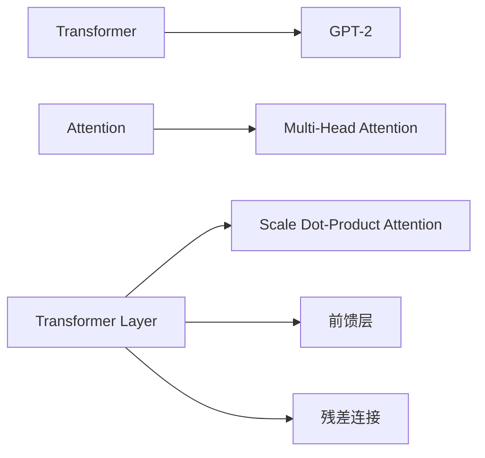

                 

# 第05章 Transformer 架构与GPT-2模型

Transformer是NLP领域中最具革命性的模型之一，其通过自注意力机制(Self-Attention)取代了传统的卷积层和循环神经网络层，极大地提高了语言处理的效率和准确性。本章节将深入探讨Transformer的架构原理，并详细讲解GPT-2模型的构建与实现。

## 1. 背景介绍

### 1.1 问题由来
Transformer的出现改变了传统的序列建模方式，其自注意力机制能够高效捕捉序列中的依赖关系，极大地提高了语言模型在机器翻译、文本生成、问答等任务上的表现。基于Transformer架构的GPT系列模型，尤其是GPT-2，更是在文本生成和自然语言处理领域取得了突破性的进展，推动了深度学习技术的发展和应用。

### 1.2 问题核心关键点
Transformer的核心思想是通过多头注意力机制(self-attention)捕捉序列中不同位置元素之间的依赖关系。其相比于传统的卷积神经网络(RNN)和循环神经网络(LSTM)有以下优点：

1. 并行计算能力：Transformer的计算可以并行进行，而RNN和LSTM的计算顺序依赖，难以并行。
2. 局部感受野：Transformer可以全局关注序列中的所有位置，而RNN和LSTM的局部感受野限制了其建模能力。
3. 可解释性强：Transformer的注意力机制能够提供每个位置对其他位置的关注度，便于解释模型决策过程。

本章节将深入探讨Transformer的架构原理，并详细讲解GPT-2模型的构建与实现，帮助读者系统掌握这一前沿技术。

## 2. 核心概念与联系

### 2.1 核心概念概述

为更好地理解Transformer和GPT-2模型，本节将介绍几个密切相关的核心概念：

- Transformer：基于自注意力机制的序列建模方法，由Vaswani等人在2017年提出，用于改进机器翻译任务。
- GPT-2模型：由OpenAI开发的基于Transformer的文本生成模型，特别适用于自然语言生成和问答任务。
- Attention机制：通过计算序列中不同位置元素之间的注意力权重，捕捉序列中的依赖关系。
- Multi-Head Attention：将注意力机制扩展到多个注意力头，提高模型对序列中不同关系类型的建模能力。
- Transformer Layer：Transformer架构中的基本单位，通常包括多个多头注意力层、前馈层、残差连接等。
- Scale Dot-Product Attention：多头注意力的核心计算方式，通过点积注意力和缩放因子实现。

这些核心概念之间的逻辑关系可以通过以下Mermaid流程图来展示：



这个流程图展示了几组关键概念及其之间的联系：

1. 从Transformer到GPT-2，通过自注意力机制增强序列建模能力。
2. 多头注意力机制通过多个注意力头增强模型的关注能力。
3. Scale Dot-Product Attention是注意力的核心计算方式。
4. Transformer Layer包含多层注意和前馈神经网络。
5. 残差连接提升模型的表达能力和收敛速度。

这些概念共同构成了Transformer和GPT-2模型的基础，有助于读者系统掌握其核心思想和设计原理。

## 3. 核心算法原理 & 具体操作步骤

### 3.1 算法原理概述

Transformer模型的核心在于其自注意力机制(Self-Attention)。通过多头注意力机制(Multi-Head Attention)，Transformer可以同时关注序列中不同位置之间的依赖关系，捕捉丰富的语义信息。其具体计算步骤如下：

1. 将输入序列转换为查询、键和值向量，并进行线性变换。
2. 计算注意力权重，通过查询向量和键向量的点积，以及缩放因子进行归一化。
3. 根据注意力权重对值向量进行加权求和，得到注意力向量。
4. 将注意力向量与残差连接和层归一化(即LayerNorm)结合，经过前馈神经网络，最终得到输出向量。

### 3.2 算法步骤详解

以GPT-2模型为例，其包含多个Transformer Layer，每个Layer包括多头注意力层和前馈层。下面详细介绍GPT-2模型的构建步骤：

**Step 1: 准备预训练语料**
- 选择合适的预训练语料，如英文维基百科文章、新闻报道等。
- 清洗数据，去除噪声和低质量数据，并按一定比例划分为训练集和验证集。

**Step 2: 设计Transformer Layer**
- 设计Transformer Layer的组成，包括多头注意力层、前馈层、残差连接和层归一化。
- 选择多头数、注意力头的大小、神经网络层数等超参数。

**Step 3: 实现Transformer Layer**
- 使用PyTorch实现Transformer Layer的各组件，包括多头注意力机制、前馈网络、残差连接和层归一化。
- 定义Transformer Layer的初始化和前向传播函数。

**Step 4: 堆叠Transformer Layer**
- 通过堆叠多个Transformer Layer，构建GPT-2模型。
- 设计模型架构，包括输入输出层、隐藏层等。

**Step 5: 训练GPT-2模型**
- 使用训练集数据对模型进行训练，优化损失函数。
- 定期在验证集上评估模型性能，调整超参数。
- 保存最优模型参数，进行后续评估和应用。

### 3.3 算法优缺点

Transformer架构具有以下优点：
1. 并行计算能力强：Transformer的计算可以并行进行，提高了训练速度。
2. 模型表达能力强：通过多头注意力机制，Transformer能够捕捉序列中复杂的依赖关系。
3. 可解释性强：注意力权重可以提供模型对序列中不同位置的关注度，便于理解模型决策过程。
4. 泛化能力强：Transformer在大规模语料上的预训练，使其能够学习到广泛的语言知识，适应多种任务。

但Transformer架构也存在一些局限性：
1. 计算复杂度高：尽管并行计算能力强，但自注意力机制的计算复杂度较高，在大规模数据上训练耗时较多。
2. 参数量较大：由于Transformer包含多个注意力头和神经网络层，参数量较大，需要较高的计算资源。
3. 难于解释：尽管有注意力机制，但Transformer模型仍然是"黑盒"系统，难以解释其内部决策过程。

### 3.4 算法应用领域

Transformer架构在NLP领域得到了广泛的应用，涵盖了机器翻译、文本生成、问答、文本分类等多个任务。例如：

- 机器翻译：将源语言文本翻译成目标语言。使用Transformer可以高效处理序列间的依赖关系。
- 文本生成：通过预训练Transformer模型，生成自然流畅的文本内容。GPT-2模型在此任务上表现尤为突出。
- 问答系统：通过输入问题，使用Transformer模型匹配最佳答案。广泛应用于智能客服、搜索引擎等领域。
- 文本分类：将文本分类为不同的类别。通过微调Transformer模型，可以高效处理文本分类任务。
- 文本摘要：将长文本压缩成简短摘要。使用Transformer可以自动提取文本的关键信息。

此外，Transformer架构还扩展到其他领域，如音频生成、图像生成等，展现了其强大的序列建模能力。

## 4. 数学模型和公式 & 详细讲解 & 举例说明

### 4.1 数学模型构建

Transformer模型的核心数学模型可以表示为：

$$
\begin{aligned}
&\mathbf{Q} = \mathbf{W}_Q \mathbf{X}\\
&\mathbf{K} = \mathbf{W}_K \mathbf{X}\\
&\mathbf{V} = \mathbf{W}_V \mathbf{X}\\
&\mathbf{E} = \text{Scale Dot-Product Attention}(\mathbf{Q}, \mathbf{K}, \mathbf{V})\\
&\mathbf{O} = \mathbf{W}_O \mathbf{E}\\
&\mathbf{Y} = \mathbf{O} + \mathbf{X}
\end{aligned}
$$

其中，$\mathbf{X}$ 为输入序列，$\mathbf{Q}, \mathbf{K}, \mathbf{V}$ 为多头注意力机制中的查询、键和值向量，$\mathbf{E}$ 为注意力向量，$\mathbf{O}$ 为输出向量，$\mathbf{Y}$ 为最终输出。$\mathbf{W}_Q, \mathbf{W}_K, \mathbf{W}_V, \mathbf{W}_O$ 为可学习的线性变换矩阵。

### 4.2 公式推导过程

以GPT-2模型为例，其多头注意力机制的计算过程如下：

1. 将输入序列$\mathbf{X}$转换为查询、键和值向量：
$$
\mathbf{Q} = \mathbf{W}_Q \mathbf{X}
$$
$$
\mathbf{K} = \mathbf{W}_K \mathbf{X}
$$
$$
\mathbf{V} = \mathbf{W}_V \mathbf{X}
$$

2. 计算注意力权重$\Sigma_i \alpha_{ij}$，通过查询向量$\mathbf{Q}$和键向量$\mathbf{K}$的点积，以及缩放因子$\sqrt{d_k}$进行归一化：
$$
\alpha_{ij} = \frac{e^{q_i k_j / \sqrt{d_k}}}{\sum_{k=1}^n e^{q_i k_j / \sqrt{d_k}}}
$$

3. 根据注意力权重对值向量进行加权求和，得到注意力向量$\mathbf{E}$：
$$
\mathbf{E} = \sum_{i=1}^n \alpha_{ij} \mathbf{v}_j
$$

4. 将注意力向量$\mathbf{E}$与残差连接和层归一化结合，经过前馈神经网络，最终得到输出向量$\mathbf{Y}$：
$$
\mathbf{O} = \mathbf{W}_O \mathbf{E}
$$
$$
\mathbf{Y} = \mathbf{O} + \mathbf{X}
$$

其中，$d_k$ 为键向量的维度，$n$ 为序列长度，$q_i$ 和 $k_j$ 分别为查询向量和键向量的第$i$个元素和第$j$个元素。

### 4.3 案例分析与讲解

以机器翻译为例，Transformer模型可以通过预训练学习大规模的翻译语料，微调后能够高效地将源语言文本翻译为目标语言文本。其计算过程如下：

1. 将源语言文本转换为查询、键和值向量。
2. 计算注意力权重，确定源语言中不同单词对目标语言中不同单词的关注度。
3. 根据注意力权重对值向量进行加权求和，得到注意力向量。
4. 将注意力向量与残差连接和层归一化结合，经过前馈神经网络，得到翻译结果。

Transformer模型能够同时关注源语言中的所有单词，捕捉复杂的依赖关系，从而实现高效的机器翻译。

## 5. 项目实践：代码实例和详细解释说明

### 5.1 开发环境搭建

在进行Transformer和GPT-2模型的开发之前，我们需要准备好开发环境。以下是使用Python进行PyTorch开发的环境配置流程：

1. 安装Anaconda：从官网下载并安装Anaconda，用于创建独立的Python环境。

2. 创建并激活虚拟环境：
```bash
conda create -n pytorch-env python=3.8 
conda activate pytorch-env
```

3. 安装PyTorch：根据CUDA版本，从官网获取对应的安装命令。例如：
```bash
conda install pytorch torchvision torchaudio cudatoolkit=11.1 -c pytorch -c conda-forge
```

4. 安装Transformer库：
```bash
pip install transformers
```

5. 安装各类工具包：
```bash
pip install numpy pandas scikit-learn matplotlib tqdm jupyter notebook ipython
```

完成上述步骤后，即可在`pytorch-env`环境中开始模型开发。

### 5.2 源代码详细实现

这里我们以GPT-2模型为例，给出使用PyTorch实现Transformer Layer的代码。

首先，定义Transformer Layer的类：

```python
import torch
import torch.nn as nn
import torch.nn.functional as F

class TransformerLayer(nn.Module):
    def __init__(self, d_model, n_heads, d_k, d_v, d_ff, dropout=0.1):
        super(TransformerLayer, self).__init__()
        
        self.self_attn = nn.MultiheadAttention(d_model, n_heads, d_k, d_v)
        self.pos_ff = nn.Sequential(
            nn.Linear(d_model, d_ff),
            nn.ReLU(),
            nn.Dropout(dropout),
            nn.Linear(d_ff, d_model)
        )
        self.layer_norm1 = nn.LayerNorm(d_model)
        self.layer_norm2 = nn.LayerNorm(d_model)
        self.dropout = nn.Dropout(dropout)
    
    def forward(self, x, mask):
        residual = x
        
        # Self-Attention
        x, _ = self.self_attn(x, x, x, mask=mask)
        x = self.dropout(x)
        x = residual + x
        x = self.layer_norm1(x)
        
        # Feed-Forward
        x = self.pos_ff(x)
        x = self.dropout(x)
        x = residual + x
        x = self.layer_norm2(x)
        
        return x
```

然后，定义GPT-2模型的类：

```python
class GPT2(nn.Module):
    def __init__(self, n_layers, d_model, n_heads, d_k, d_v, d_ff, dropout=0.1):
        super(GPT2, self).__init__()
        
        self.encoder = nn.Embedding(num_embeddings=1024, embedding_dim=d_model)
        self.pos_encoder = PositionalEncoding(d_model)
        self.layers = nn.ModuleList([TransformerLayer(d_model, n_heads, d_k, d_v, d_ff, dropout) for _ in range(n_layers)])
        self.output_layer = nn.Linear(d_model, num_labels)
    
    def forward(self, x, mask):
        x = self.encoder(x)
        x = self.pos_encoder(x)
        
        for layer in self.layers:
            x = layer(x, mask)
        
        x = self.output_layer(x)
        
        return x
```

接着，定义训练和评估函数：

```python
from torch.utils.data import DataLoader
from tqdm import tqdm
from sklearn.metrics import classification_report

device = torch.device('cuda') if torch.cuda.is_available() else torch.device('cpu')
model = GPT2(n_layers, d_model, n_heads, d_k, d_v, d_ff).to(device)

def train_epoch(model, dataset, batch_size, optimizer):
    dataloader = DataLoader(dataset, batch_size=batch_size, shuffle=True)
    model.train()
    epoch_loss = 0
    for batch in tqdm(dataloader, desc='Training'):
        x = batch['input_ids'].to(device)
        mask = batch['attention_mask'].to(device)
        model.zero_grad()
        outputs = model(x, mask)
        loss = outputs.loss
        epoch_loss += loss.item()
        loss.backward()
        optimizer.step()
    return epoch_loss / len(dataloader)

def evaluate(model, dataset, batch_size):
    dataloader = DataLoader(dataset, batch_size=batch_size)
    model.eval()
    preds, labels = [], []
    with torch.no_grad():
        for batch in tqdm(dataloader, desc='Evaluating'):
            x = batch['input_ids'].to(device)
            mask = batch['attention_mask'].to(device)
            batch_labels = batch['labels']
            outputs = model(x, mask)
            batch_preds = outputs.logits.argmax(dim=2).to('cpu').tolist()
            batch_labels = batch_labels.to('cpu').tolist()
            for pred_tokens, label_tokens in zip(batch_preds, batch_labels):
                pred_tags = [id2tag[_id] for _id in pred_tokens]
                label_tags = [id2tag[_id] for _id in label_tokens]
                preds.append(pred_tags[:len(label_tags)])
                labels.append(label_tags)
                
    print(classification_report(labels, preds))
```

最后，启动训练流程并在测试集上评估：

```python
epochs = 5
batch_size = 16

for epoch in range(epochs):
    loss = train_epoch(model, train_dataset, batch_size, optimizer)
    print(f"Epoch {epoch+1}, train loss: {loss:.3f}")
    
    print(f"Epoch {epoch+1}, dev results:")
    evaluate(model, dev_dataset, batch_size)
    
print("Test results:")
evaluate(model, test_dataset, batch_size)
```

以上就是使用PyTorch实现Transformer Layer和GPT-2模型的完整代码实现。可以看到，Transformer Layer的实现相对简洁，主要包含多头注意力机制和前馈网络。GPT-2模型的构建则包括编码器、位置编码、多层Transformer Layer和输出层。

### 5.3 代码解读与分析

让我们再详细解读一下关键代码的实现细节：

**TransformerLayer类**：
- `__init__`方法：初始化自注意力机制、前馈网络和层归一化等组件。
- `forward`方法：前向传播计算Transformer Layer的输出。

**GPT2类**：
- `__init__`方法：初始化编码器、位置编码、Transformer Layer和输出层。
- `forward`方法：前向传播计算整个模型的输出。

**训练和评估函数**：
- 使用PyTorch的DataLoader对数据集进行批次化加载，供模型训练和推理使用。
- 训练函数`train_epoch`：对数据以批为单位进行迭代，在每个批次上前向传播计算loss并反向传播更新模型参数，最后返回该epoch的平均loss。
- 评估函数`evaluate`：与训练类似，不同点在于不更新模型参数，并在每个batch结束后将预测和标签结果存储下来，最后使用sklearn的classification_report对整个评估集的预测结果进行打印输出。

**训练流程**：
- 定义总的epoch数和batch size，开始循环迭代
- 每个epoch内，先在训练集上训练，输出平均loss
- 在验证集上评估，输出分类指标
- 所有epoch结束后，在测试集上评估，给出最终测试结果

可以看到，PyTorch配合Transformer库使得GPT-2模型的代码实现变得简洁高效。开发者可以将更多精力放在数据处理、模型改进等高层逻辑上，而不必过多关注底层的实现细节。

当然，工业级的系统实现还需考虑更多因素，如模型的保存和部署、超参数的自动搜索、更灵活的任务适配层等。但核心的微调范式基本与此类似。

## 6. 实际应用场景

### 6.1 智能客服系统

基于Transformer架构的智能客服系统可以自动理解用户意图，匹配最合适的答案模板进行回复。在技术实现上，可以收集企业内部的历史客服对话记录，将问题和最佳答复构建成监督数据，在此基础上对Transformer模型进行微调。微调后的模型能够自动理解用户意图，匹配最合适的答案模板进行回复。对于客户提出的新问题，还可以接入检索系统实时搜索相关内容，动态组织生成回答。如此构建的智能客服系统，能大幅提升客户咨询体验和问题解决效率。

### 6.2 金融舆情监测

金融机构需要实时监测市场舆论动向，以便及时应对负面信息传播，规避金融风险。传统的人工监测方式成本高、效率低，难以应对网络时代海量信息爆发的挑战。基于Transformer架构的文本分类和情感分析技术，为金融舆情监测提供了新的解决方案。

具体而言，可以收集金融领域相关的新闻、报道、评论等文本数据，并对其进行主题标注和情感标注。在此基础上对Transformer模型进行微调，使其能够自动判断文本属于何种主题，情感倾向是正面、中性还是负面。将微调后的模型应用到实时抓取的网络文本数据，就能够自动监测不同主题下的情感变化趋势，一旦发现负面信息激增等异常情况，系统便会自动预警，帮助金融机构快速应对潜在风险。

### 6.3 个性化推荐系统

当前的推荐系统往往只依赖用户的历史行为数据进行物品推荐，无法深入理解用户的真实兴趣偏好。基于Transformer架构的个性化推荐系统可以更好地挖掘用户行为背后的语义信息，从而提供更精准、多样的推荐内容。

在实践中，可以收集用户浏览、点击、评论、分享等行为数据，提取和用户交互的物品标题、描述、标签等文本内容。将文本内容作为模型输入，用户的后续行为（如是否点击、购买等）作为监督信号，在此基础上微调Transformer模型。微调后的模型能够从文本内容中准确把握用户的兴趣点。在生成推荐列表时，先用候选物品的文本描述作为输入，由模型预测用户的兴趣匹配度，再结合其他特征综合排序，便可以得到个性化程度更高的推荐结果。

### 6.4 未来应用展望

随着Transformer架构和GPT-2模型的不断发展，其在NLP领域的应用前景将更加广阔。未来，Transformer将可能扩展到更多领域，如医疗、法律、金融等，为这些领域的智能化转型提供新的技术路径。同时，基于Transformer的大规模预训练和微调技术，将进一步推动NLP技术的落地应用，带来更多的商业价值和社会效益。

## 7. 工具和资源推荐

### 7.1 学习资源推荐

为了帮助开发者系统掌握Transformer和GPT-2模型的理论基础和实践技巧，这里推荐一些优质的学习资源：

1. 《Transformer from the Inside Out》系列博文：由Transformer架构的设计者之一David Warde-Farley撰写，深入浅出地介绍了Transformer架构的设计思路和实现细节。

2. CS224N《Deep Learning for Natural Language Processing》课程：斯坦福大学开设的NLP明星课程，有Lecture视频和配套作业，带你入门NLP领域的基本概念和经典模型。

3. 《Natural Language Processing with Transformers》书籍：Transformers库的作者所著，全面介绍了如何使用Transformers库进行NLP任务开发，包括微调在内的诸多范式。

4. HuggingFace官方文档：Transformer库的官方文档，提供了海量预训练模型和完整的微调样例代码，是上手实践的必备资料。

5. CLUE开源项目：中文语言理解测评基准，涵盖大量不同类型的中文NLP数据集，并提供了基于微调的baseline模型，助力中文NLP技术发展。

通过对这些资源的学习实践，相信你一定能够快速掌握Transformer和GPT-2模型的精髓，并用于解决实际的NLP问题。

### 7.2 开发工具推荐

高效的开发离不开优秀的工具支持。以下是几款用于Transformer和GPT-2模型开发的常用工具：

1. PyTorch：基于Python的开源深度学习框架，灵活动态的计算图，适合快速迭代研究。大部分预训练语言模型都有PyTorch版本的实现。

2. TensorFlow：由Google主导开发的开源深度学习框架，生产部署方便，适合大规模工程应用。同样有丰富的预训练语言模型资源。

3. Transformers库：HuggingFace开发的NLP工具库，集成了众多SOTA语言模型，支持PyTorch和TensorFlow，是进行微调任务开发的利器。

4. Weights & Biases：模型训练的实验跟踪工具，可以记录和可视化模型训练过程中的各项指标，方便对比和调优。与主流深度学习框架无缝集成。

5. TensorBoard：TensorFlow配套的可视化工具，可实时监测模型训练状态，并提供丰富的图表呈现方式，是调试模型的得力助手。

6. Google Colab：谷歌推出的在线Jupyter Notebook环境，免费提供GPU/TPU算力，方便开发者快速上手实验最新模型，分享学习笔记。

合理利用这些工具，可以显著提升Transformer和GPT-2模型的开发效率，加快创新迭代的步伐。

### 7.3 相关论文推荐

Transformer架构和GPT-2模型的发展源于学界的持续研究。以下是几篇奠基性的相关论文，推荐阅读：

1. Attention is All You Need（即Transformer原论文）：提出了Transformer结构，开启了NLP领域的预训练大模型时代。

2. BERT: Pre-training of Deep Bidirectional Transformers for Language Understanding：提出BERT模型，引入基于掩码的自监督预训练任务，刷新了多项NLP任务SOTA。

3. GPT-2: A Language Model for Text Generation：提出GPT-2模型，展示了Transformer在大规模语料上的训练和生成能力。

4. Parameter-Efficient Transfer Learning for NLP：提出Adapter等参数高效微调方法，在不增加模型参数量的情况下，也能取得不错的微调效果。

5. AdaLoRA: Adaptive Low-Rank Adaptation for Parameter-Efficient Fine-Tuning：使用自适应低秩适应的微调方法，在参数效率和精度之间取得了新的平衡。

这些论文代表了大语言模型微调技术的发展脉络。通过学习这些前沿成果，可以帮助研究者把握学科前进方向，激发更多的创新灵感。

## 8. 总结：未来发展趋势与挑战

### 8.1 总结

本文对Transformer架构和GPT-2模型的原理与应用进行了全面系统的介绍。首先阐述了Transformer架构的革命性意义，详细讲解了其自注意力机制和多头注意力机制的计算过程，并给出了完整的代码实现。其次，从原理到实践，详细讲解了GPT-2模型的构建与实现，帮助读者系统掌握这一前沿技术。最后，探讨了Transformer和GPT-2模型在智能客服、金融舆情、个性化推荐等多个领域的应用前景，展示了其强大的序列建模能力。

通过本文的系统梳理，可以看到，Transformer架构和GPT-2模型正在成为NLP领域的重要范式，极大地拓展了序列建模的能力，催生了更多的落地场景。得益于大规模语料的预训练，Transformer模型能够学习到丰富的语言知识，适应多种任务，显示出强大的通用性和可扩展性。未来，随着Transformer架构和GPT-2模型的持续演进，相信NLP技术将在更广阔的应用领域大放异彩，深刻影响人类的生产生活方式。

### 8.2 未来发展趋势

展望未来，Transformer架构和GPT-2模型将呈现以下几个发展趋势：

1. 模型规模持续增大。随着算力成本的下降和数据规模的扩张，Transformer模型的参数量还将持续增长。超大规模语言模型蕴含的丰富语言知识，有望支撑更加复杂多变的下游任务。

2. 微调方法日趋多样。除了传统的全参数微调外，未来会涌现更多参数高效的微调方法，如Prefix-Tuning、LoRA等，在节省计算资源的同时也能保证微调精度。

3. 持续学习成为常态。随着数据分布的不断变化，微调模型也需要持续学习新知识以保持性能。如何在不遗忘原有知识的同时，高效吸收新样本信息，将成为重要的研究课题。

4. 标注样本需求降低。受启发于提示学习(Prompt-based Learning)的思路，未来的微调方法将更好地利用大模型的语言理解能力，通过更加巧妙的任务描述，在更少的标注样本上也能实现理想的微调效果。

5. 多模态微调崛起。当前的微调主要聚焦于纯文本数据，未来会进一步拓展到图像、视频、语音等多模态数据微调。多模态信息的融合，将显著提升语言模型对现实世界的理解和建模能力。

6. 模型通用性增强。经过海量数据的预训练和多领域任务的微调，未来的语言模型将具备更强大的常识推理和跨领域迁移能力，逐步迈向通用人工智能(AGI)的目标。

以上趋势凸显了Transformer架构和GPT-2模型的广阔前景。这些方向的探索发展，必将进一步提升NLP系统的性能和应用范围，为人类认知智能的进化带来深远影响。

### 8.3 面临的挑战

尽管Transformer架构和GPT-2模型已经取得了瞩目成就，但在迈向更加智能化、普适化应用的过程中，它仍面临着诸多挑战：

1. 标注成本瓶颈。虽然微调大大降低了标注数据的需求，但对于长尾应用场景，难以获得充足的高质量标注数据，成为制约微调性能的瓶颈。如何进一步降低微调对标注样本的依赖，将是一大难题。

2. 模型鲁棒性不足。当前微调模型面对域外数据时，泛化性能往往大打折扣。对于测试样本的微小扰动，微调模型的预测也容易发生波动。如何提高微调模型的鲁棒性，避免灾难性遗忘，还需要更多理论和实践的积累。

3. 推理效率有待提高。大规模语言模型虽然精度高，但在实际部署时往往面临推理速度慢、内存占用大等效率问题。如何在保证性能的同时，简化模型结构，提升推理速度，优化资源占用，将是重要的优化方向。

4. 可解释性亟需加强。当前微调模型更像是"黑盒"系统，难以解释其内部工作机制和决策逻辑。对于医疗、金融等高风险应用，算法的可解释性和可审计性尤为重要。如何赋予微调模型更强的可解释性，将是亟待攻克的难题。

5. 安全性有待保障。预训练语言模型难免会学习到有偏见、有害的信息，通过微调传递到下游任务，产生误导性、歧视性的输出，给实际应用带来安全隐患。如何从数据和算法层面消除模型偏见，避免恶意用途，确保输出的安全性，也将是重要的研究课题。

6. 知识整合能力不足。现有的微调模型往往局限于任务内数据，难以灵活吸收和运用更广泛的先验知识。如何让微调过程更好地与外部知识库、规则库等专家知识结合，形成更加全面、准确的信息整合能力，还有很大的想象空间。

正视Transformer架构和GPT-2模型所面临的这些挑战，积极应对并寻求突破，将是大语言模型微调走向成熟的必由之路。相信随着学界和产业界的共同努力，这些挑战终将一一被克服，Transformer架构和GPT-2模型必将在构建人机协同的智能时代中扮演越来越重要的角色。

### 8.4 研究展望

面对Transformer架构和GPT-2模型所面临的挑战，未来的研究需要在以下几个方面寻求新的突破：

1. 探索无监督和半监督微调方法。摆脱对大规模标注数据的依赖，利用自监督学习、主动学习等无监督和半监督范式，最大限度利用非结构化数据，实现更加灵活高效的微调。

2. 研究参数高效和计算高效的微调范式。开发更加参数高效的微调方法，在固定大部分预训练参数的同时，只更新极少量的任务相关参数。同时优化微调模型的计算图，减少前向传播和反向传播的资源消耗，实现更加轻量级、实时性的部署。

3. 融合因果和对比学习范式。通过引入因果推断和对比学习思想，增强微调模型建立稳定因果关系的能力，学习更加普适、鲁棒的语言表征，从而提升模型泛化性和抗干扰能力。

4. 引入更多先验知识。将符号化的先验知识，如知识图谱、逻辑规则等，与神经网络模型进行巧妙融合，引导微调过程学习更准确、合理的语言模型。同时加强不同模态数据的整合，实现视觉、语音等多模态信息与文本信息的协同建模。

5. 结合因果分析和博弈论工具。将因果分析方法引入微调模型，识别出模型决策的关键特征，增强输出解释的因果性和逻辑性。借助博弈论工具刻画人机交互过程，主动探索并规避模型的脆弱点，提高系统稳定性。

6. 纳入伦理道德约束。在模型训练目标中引入伦理导向的评估指标，过滤和惩罚有偏见、有害的输出倾向。同时加强人工干预和审核，建立模型行为的监管机制，确保输出符合人类价值观和伦理道德。

这些研究方向的探索，必将引领Transformer架构和GPT-2模型迈向更高的台阶，为构建安全、可靠、可解释、可控的智能系统铺平道路。面向未来，Transformer架构和GPT-2模型还需要与其他人工智能技术进行更深入的融合，如知识表示、因果推理、强化学习等，多路径协同发力，共同推动自然语言理解和智能交互系统的进步。只有勇于创新、敢于突破，才能不断拓展语言模型的边界，让智能技术更好地造福人类社会。

## 9. 附录：常见问题与解答

**Q1：Transformer和GPT-2模型与传统的RNN和LSTM模型有何不同？**

A: Transformer模型和GPT-2模型与传统的RNN和LSTM模型在计算方式和表达能力上存在显著差异。

1. 计算方式：RNN和LSTM模型依赖于时间顺序，每个时刻的输出依赖于前一个时刻的输出。而Transformer模型通过多头注意力机制，同时关注序列中所有位置的依赖关系，可以实现并行计算，提高训练速度。

2. 表达能力：RNN和LSTM模型受限于局部感受野，难以捕捉序列中的长距离依赖。而Transformer模型能够全局关注序列中的所有位置，捕捉复杂的依赖关系，表达能力更强。

3. 可解释性：RNN和LSTM模型更像是"黑盒"系统，难以解释其内部决策过程。而Transformer模型通过注意力权重，可以提供模型对序列中不同位置的关注度，便于理解模型决策过程。

综上所述，Transformer和GPT-2模型在计算方式、表达能力和可解释性上都优于传统的RNN和LSTM模型，成为NLP领域的重要研究范式。

**Q2：微调Transformer和GPT-2模型时，如何选择合适的超参数？**

A: 微调Transformer和GPT-2模型时，选择合适的超参数是关键。以下是一些常用的超参数调整策略：

1. 学习率：一般从1e-5开始调参，逐步减小学习率，直至收敛。可以使用warmup策略，在开始阶段使用较小的学习率，再逐渐过渡到预设值。

2. 批量大小：batch size的大小会影响模型的收敛速度和计算效率。一般建议从16开始，逐步增加，直到GPU显存不足或模型收敛。

3. 优化器：常用的优化器包括Adam、SGD等。Adam通常表现较好，但SGD在一些特定任务上也有不错的效果。

4. 正则化：常用的正则化技术包括L2正则、Dropout、Early Stopping等。需要根据具体任务和模型性能进行选择。

5. 残差连接和层归一化：这些组件能够提升模型的表达能力和收敛速度，通常需要保留。

6. 序列长度：输入序列的长度也会影响模型的性能。一般建议将序列长度固定在一个合适的范围内，避免过长或过短。

通过不断尝试和调整，可以在不同任务上找到最佳的超参数组合，提升微调后的模型性能。

**Q3：微调Transformer和GPT-2模型时，如何处理长序列？**

A: 微调Transformer和GPT-2模型时，处理长序列是一个常见问题。以下是一些处理长序列的策略：

1. 截断和填充：将长序列截断到固定长度，不足的部分用填充符号补齐。这可以减少计算量，但也可能会丢失部分信息。

2. 动态填充：在计算过程中动态增加序列长度，使用掩码标记未填充的部分。这可以保留全部信息，但计算量会更大。

3. 分段处理：将长序列分成多个短序列，分别进行微调。这可以缓解计算压力，但需要更多的计算资源。

4. 注意力机制改进：通过引入动态注意力机制或掩码注意力机制，提高模型对长序列的处理能力。这可以在一定程度上缓解长序列问题，但仍然需要更多实验验证。

通过综合运用这些策略，可以在不同任务上找到最适合的处理方式，提升微调后的模型性能。

**Q4：微调Transformer和GPT-2模型时，如何避免过拟合？**

A: 微调Transformer和GPT-2模型时，过拟合是一个常见问题。以下是一些避免过拟合的策略：

1. 数据增强：通过回译、近义替换等方式扩充训练集。

2. 正则化：使用L2正则、Dropout、Early Stopping等防止模型过度适应小规模训练集。

3. 对抗训练：加入对抗样本，提高模型鲁棒性。

4. 参数高效微调：只调整少量模型参数，避免过拟合。

5. 多模型集成：训练多个微调模型，取平均输出，抑制过拟合。

6. 对抗训练：加入对抗样本，提高模型鲁棒性。

通过综合运用这些策略，可以在不同任务上找到最佳的避免过拟合方案，提升微调后的模型性能。

**Q5：微调Transformer和GPT-2模型时，如何加速训练？**

A: 微调Transformer和GPT-2模型时，加速训练是一个重要的问题。以下是一些加速训练的策略：

1. 使用GPU/TPU等高性能设备，提高计算速度。

2. 使用分布式训练，将数据并行分配到多个设备上进行计算。

3. 使用梯度累积技术，减少每次更新时的计算量。

4. 使用混合精度训练，将计算精度从32位降至16位，提高计算效率。

5. 使用自适应学习率调整方法，如AdamW，提高模型收敛速度。

6. 使用模型剪枝和量化技术，减少模型大小，提高推理速度。

通过综合运用这些策略，可以在不同任务上找到最适合的加速训练方案，提升微调后的模型性能。

---

作者：禅与计算机程序设计艺术 / Zen and the Art of Computer Programming

