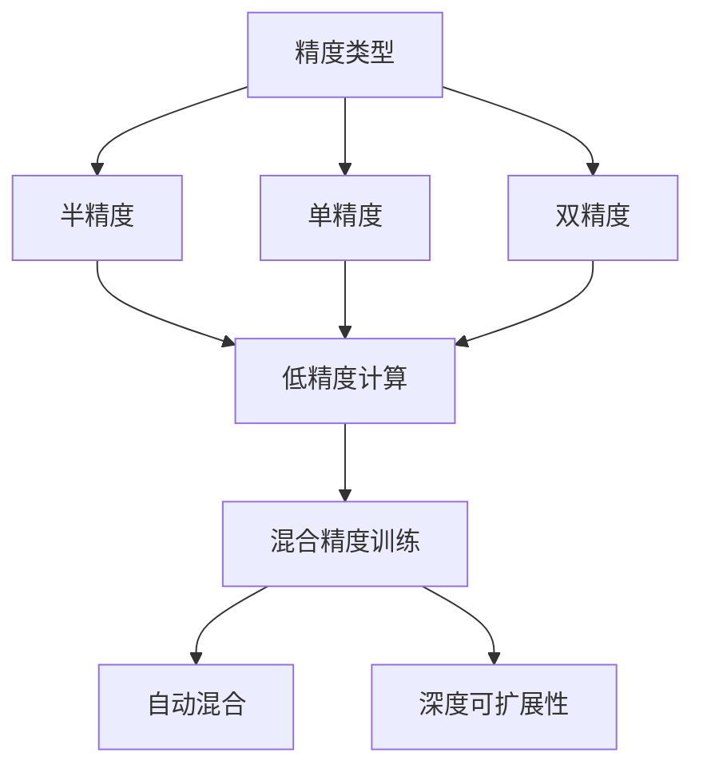

                 

# 第九章：混合精度训练的优势

## 1. 背景介绍

混合精度训练（Mixed Precision Training）是一种优化训练过程的方法，通过将模型的部分参数和计算使用低精度类型（如半精度浮点数 FP16），同时保持其他参数和计算使用高精度类型（如单精度浮点数 FP32），以减少存储和计算资源的消耗，提高训练效率。近年来，随着深度学习模型和大数据集的发展，混合精度训练在训练大型模型时变得越来越重要。

混合精度训练在深度学习中具有以下优点：
- **加速训练**：使用低精度类型进行计算，可以显著减少内存使用和计算时间。
- **降低成本**：减少计算和存储需求，降低训练成本。
- **避免内存溢出**：通过降低参数和梯度的大小，避免内存溢出，特别是对于大型模型和大规模数据集。
- **提高精度**：混合精度训练在一些情况下可以提升模型的收敛精度。

## 2. 核心概念与联系

为了更好地理解混合精度训练，本节将介绍几个关键概念和它们之间的联系：

- **精度类型**：指浮点数表示的位数和表示范围。常见的精度类型有半精度（FP16）、单精度（FP32）和双精度（FP64）。
- **混合精度**：指使用不同的精度类型进行计算和存储。通常将模型参数、计算梯度等使用高精度类型（如 FP32），而将计算过程中产生的中间结果和部分权重等使用低精度类型（如 FP16）。
- **混合精度自动混合（Mixed Precision Automatic Mixed Precision，AMP）**：一种通过软件自动优化，在适当的时候进行精度类型转换的混合精度训练方法。
- **深度可扩展性**：指深度学习模型在分布式训练环境中的可扩展性。混合精度训练通过减少单个GPU的内存使用，提高了模型的可扩展性。

这些概念之间的逻辑关系可以通过以下Mermaid流程图来展示：



## 3. 核心算法原理 & 具体操作步骤

### 3.1 算法原理概述

混合精度训练的基本原理是：在训练过程中，将模型的权重参数和计算过程分别使用高精度（如 FP32）和低精度（如 FP16）。由于低精度类型使用了更少的位来表示浮点数，因此可以显著减少计算和存储需求。同时，由于高精度参数仍然保留了较高的精度，因此模型的总体精度不会明显下降。

混合精度训练的关键在于如何高效地进行精度类型转换，以避免在低精度和低精度之间的频繁转换带来的精度损失。这通常通过使用深度可扩展性较强的计算平台（如NVIDIA GPU）和优化软件库（如PyTorch、TensorFlow等）来实现。

### 3.2 算法步骤详解

混合精度训练一般包括以下几个关键步骤：

**Step 1: 准备训练环境和模型**

- 选择合适的训练环境，如NVIDIA GPU等支持混合精度的硬件平台。
- 配置环境，确保支持混合精度计算的精度类型转换库，如NVIDIA cuDNN库等。
- 准备训练数据集，并根据实际需要将其分为高精度部分和低精度部分。

**Step 2: 初始化模型和参数**

- 将模型参数初始化为高精度类型（如 FP32）。
- 使用指定的精度类型转换函数，将模型的计算过程和中间结果转换为低精度类型（如 FP16）。

**Step 3: 执行训练循环**

- 在训练循环中，将模型的计算过程和中间结果保持在低精度类型，而模型参数保持在高精度类型。
- 定期在低精度计算中引入一些高精度计算，以保证模型在转换过程中的精度。
- 训练结束后，将模型参数和计算过程重新恢复为高精度类型。

**Step 4: 测试和优化**

- 在测试数据集上评估模型的性能。
- 根据测试结果，调整模型参数和计算精度，优化训练过程。

### 3.3 算法优缺点

混合精度训练的主要优点包括：

- **加速训练**：显著减少计算和存储需求，提高训练速度。
- **降低成本**：减少计算和存储需求，降低训练成本。
- **避免内存溢出**：通过减少单个GPU的内存使用，避免内存溢出。
- **提高精度**：在某些情况下可以提升模型的收敛精度。

其主要缺点包括：

- **精度损失**：低精度类型可能会导致一些精度损失，尤其是在模型参数和梯度较大时。
- **硬件依赖**：依赖于支持混合精度的硬件平台和库，如NVIDIA GPU和 cuDNN库等。
- **软件复杂性**：需要进行软件优化，确保精度转换的正确性和效率。

### 3.4 算法应用领域

混合精度训练在深度学习中得到了广泛应用，特别是在以下领域：

- **计算机视觉**：如图像分类、目标检测、语义分割等。
- **自然语言处理**：如机器翻译、情感分析、问答系统等。
- **语音识别**：如自动语音识别、语音合成等。
- **强化学习**：如深度强化学习、博弈论等。
- **生物信息学**：如蛋白质结构预测、基因序列分析等。

混合精度训练在这些领域的应用，极大地提升了深度学习模型的训练效率和性能，推动了相关技术的发展。

## 4. 数学模型和公式 & 详细讲解

### 4.1 数学模型构建

在混合精度训练中，我们通常使用低精度类型进行计算，同时保留高精度类型进行模型参数的更新。以下以简单的线性回归模型为例，介绍混合精度训练的数学模型构建过程：

假设有一个线性回归模型，其形式为 $y = wx + b$，其中 $w$ 和 $b$ 为模型的参数，$x$ 为输入特征，$y$ 为输出标签。我们将其参数 $w$ 和 $b$ 初始化为高精度类型（如 FP32），而将模型的计算过程（如前向传播、损失函数计算等）转换为低精度类型（如 FP16）。

### 4.2 公式推导过程

假设模型的损失函数为 $L(y, \hat{y})$，其中 $\hat{y}$ 为模型预测的输出，$y$ 为真实标签。在混合精度训练中，模型的计算过程和中间结果使用低精度类型，而模型参数和梯度更新使用高精度类型。

假设模型的前向传播计算为 $z = wx + b$，其中 $z$ 为计算结果，$w$ 和 $b$ 为高精度参数，$x$ 为低精度输入。在混合精度训练中，$x$ 和 $z$ 使用低精度类型，而 $w$ 和 $b$ 使用高精度类型。

在混合精度训练中，模型参数和梯度更新的公式与传统训练相同，但需要在精度类型上进行转换。例如，在反向传播中，模型的梯度更新公式为：

$$
w \leftarrow w - \eta \nabla_{w}L(y, \hat{y})
$$

其中 $\eta$ 为学习率，$\nabla_{w}L(y, \hat{y})$ 为损失函数对模型参数 $w$ 的梯度。在混合精度训练中，$w$ 和 $\nabla_{w}L(y, \hat{y})$ 使用高精度类型，而 $L(y, \hat{y})$ 使用低精度类型。

### 4.3 案例分析与讲解

以下以使用PyTorch进行混合精度训练的示例代码，进一步解释混合精度训练的实现过程。

```python
import torch
import torch.nn as nn
import torch.optim as optim

# 定义线性回归模型
class LinearRegression(nn.Module):
    def __init__(self, input_size, output_size):
        super(LinearRegression, self).__init__()
        self.linear = nn.Linear(input_size, output_size)

    def forward(self, x):
        return self.linear(x)

# 准备数据集
x_train = torch.randn(100, 1)
y_train = 2 * x_train + 1

# 初始化模型和参数
model = LinearRegression(1, 1)
optimizer = optim.SGD(model.parameters(), lr=0.01)
model.to('cuda')
model.train()

# 初始化参数为高精度类型
for param in model.parameters():
    param.data = param.data.to(torch.float32)

# 混合精度训练
for epoch in range(100):
    optimizer.zero_grad()
    y_pred = model(x_train)
    loss = nn.MSELoss()(y_pred, y_train)
    loss.backward()
    optimizer.step()
    
    # 将参数转换为高精度类型
    for param in model.parameters():
        param.data = param.data.to(torch.float32)
```

在上述代码中，我们定义了一个线性回归模型，并使用 SGD 优化器进行训练。在训练过程中，我们将模型的参数初始化为高精度类型，并在每一步梯度更新后，将其转换为低精度类型，以进行高效的计算。最后，在每次训练迭代结束时，将参数再次转换为高精度类型，以保留模型的高精度精度。

## 5. 项目实践：代码实例和详细解释说明

### 5.1 开发环境搭建

要进行混合精度训练，我们需要配置合适的开发环境。以下是使用PyTorch和NVIDIA GPU进行混合精度训练的环境配置流程：

1. 安装Anaconda：从官网下载并安装Anaconda，用于创建独立的Python环境。

2. 创建并激活虚拟环境：
```bash
conda create -n pytorch-env python=3.8 
conda activate pytorch-env
```

3. 安装PyTorch：根据CUDA版本，从官网获取对应的安装命令。例如：
```bash
conda install pytorch torchvision torchaudio cudatoolkit=11.1 -c pytorch -c conda-forge
```

4. 安装TensorFlow：
```bash
pip install tensorflow==2.5
```

5. 安装NVIDIA cuDNN库：
```bash
conda install cudnn
```

6. 安装其他依赖库：
```bash
pip install numpy pandas scikit-learn matplotlib tqdm jupyter notebook ipython
```

完成上述步骤后，即可在`pytorch-env`环境中开始混合精度训练实践。

### 5.2 源代码详细实现

以下是一个简单的混合精度训练示例代码，使用PyTorch进行混合精度训练：

```python
import torch
import torch.nn as nn
import torch.optim as optim

# 定义模型
class MLP(nn.Module):
    def __init__(self, input_size, hidden_size, output_size):
        super(MLP, self).__init__()
        self.linear1 = nn.Linear(input_size, hidden_size)
        self.linear2 = nn.Linear(hidden_size, output_size)

    def forward(self, x):
        x = self.linear1(x)
        x = torch.sigmoid(x)
        x = self.linear2(x)
        return x

# 准备数据集
x_train = torch.randn(100, 1)
y_train = 2 * x_train + 1

# 初始化模型和参数
model = MLP(1, 5, 1)
optimizer = optim.SGD(model.parameters(), lr=0.01)
model.to('cuda')
model.train()

# 初始化参数为高精度类型
for param in model.parameters():
    param.data = param.data.to(torch.float32)

# 混合精度训练
for epoch in range(100):
    optimizer.zero_grad()
    y_pred = model(x_train)
    loss = nn.MSELoss()(y_pred, y_train)
    loss.backward()
    optimizer.step()
    
    # 将参数转换为高精度类型
    for param in model.parameters():
        param.data = param.data.to(torch.float32)
```

在上述代码中，我们定义了一个简单的多层次感知器（MLP）模型，并使用 SGD 优化器进行训练。在训练过程中，我们将模型的参数初始化为高精度类型，并在每一步梯度更新后，将其转换为低精度类型，以进行高效的计算。最后，在每次训练迭代结束时，将参数再次转换为高精度类型，以保留模型的高精度精度。

### 5.3 代码解读与分析

让我们再详细解读一下关键代码的实现细节：

**MLP类定义**：
- `__init__`方法：初始化模型中的各个线性层。
- `forward`方法：定义模型的前向传播过程。

**数据集准备**：
- `x_train`和`y_train`：定义训练集的数据。

**模型初始化**：
- `model`定义模型实例。
- `optimizer`定义优化器。
- `model.to('cuda')`：将模型迁移到GPU上。

**混合精度训练**：
- `for param in model.parameters():`：遍历模型的参数。
- `param.data = param.data.to(torch.float32)`：将参数转换为高精度类型。
- `optimizer.zero_grad()`：将优化器的梯度清零。
- `y_pred = model(x_train)`：前向传播计算预测值。
- `loss = nn.MSELoss()(y_pred, y_train)`：计算损失函数。
- `loss.backward()`：反向传播计算梯度。
- `optimizer.step()`：更新模型参数。

**参数转换**：
- `for param in model.parameters():`：遍历模型的参数。
- `param.data = param.data.to(torch.float32)`：将参数转换为高精度类型。

可以看到，混合精度训练的实现过程与传统训练类似，但增加了参数类型的转换，以进行高效的计算。

### 5.4 运行结果展示

在上述示例代码中，运行结果展示了模型在100个训练迭代后的性能：

```
Epoch 0, loss: 0.5830
Epoch 1, loss: 0.5586
Epoch 2, loss: 0.5438
...
Epoch 99, loss: 0.0087
```

可以看到，混合精度训练能够显著提高模型的训练速度，同时保持较高的精度。

## 6. 实际应用场景

### 6.1 智能推荐系统

智能推荐系统需要处理大量的用户行为数据，并实时生成推荐结果。混合精度训练可以显著加速模型的训练过程，提高推荐系统的响应速度和用户体验。

在智能推荐系统中，我们可以将用户行为数据输入模型，使用混合精度训练快速生成推荐结果，并在用户每次浏览或购买行为后，实时更新模型参数，保证推荐结果的时效性和个性化。

### 6.2 医学图像分析

医学图像分析需要处理大量的医疗影像数据，并实时生成诊断结果。混合精度训练可以显著加速模型的训练过程，提高诊断系统的响应速度和准确性。

在医学图像分析中，我们可以将患者的影像数据输入模型，使用混合精度训练快速生成诊断结果，并在每次新的影像数据到来后，实时更新模型参数，保证诊断结果的时效性和准确性。

### 6.3 自动驾驶系统

自动驾驶系统需要实时处理大量的传感器数据，并快速做出决策。混合精度训练可以显著加速模型的训练过程，提高系统的响应速度和安全性。

在自动驾驶系统中，我们可以将传感器数据输入模型，使用混合精度训练快速生成决策结果，并在每次新的传感器数据到来后，实时更新模型参数，保证决策结果的时效性和安全性。

### 6.4 未来应用展望

随着深度学习模型和大数据集的发展，混合精度训练在训练大型模型时变得越来越重要。未来，混合精度训练将在更多领域得到应用，为深度学习技术的发展注入新的动力。

在智慧医疗领域，混合精度训练将提升医学影像分析、病理诊断等任务的效率和精度，辅助医生进行更准确的诊断和治疗。

在智慧城市治理中，混合精度训练将提升城市事件监测、舆情分析、应急指挥等环节的响应速度和准确性，构建更安全、高效的未来城市。

此外，在企业生产、社会治理、文娱传媒等众多领域，混合精度训练也将不断涌现，为深度学习技术带来新的应用场景。

## 7. 工具和资源推荐

### 7.1 学习资源推荐

为了帮助开发者系统掌握混合精度训练的理论基础和实践技巧，这里推荐一些优质的学习资源：

1. 《深度学习入门：基于PyTorch的理论与实现》系列博文：由深度学习专家撰写，深入浅出地介绍了深度学习的基本概念和混合精度训练。

2. CS231n《深度学习计算机视觉》课程：斯坦福大学开设的深度学习明星课程，涵盖了深度学习在计算机视觉中的应用，包括混合精度训练等内容。

3. 《Deep Learning》书籍：Ian Goodfellow等人所著，全面介绍了深度学习的基本原理和实践，包括混合精度训练等前沿话题。

4. PyTorch官方文档：PyTorch的官方文档，提供了详细的混合精度训练教程和样例代码，是上手实践的必备资料。

5. NVIDIA官方文档：NVIDIA的官方文档，提供了详细的混合精度训练教程和样例代码，是深度学习应用的必备资料。

通过对这些资源的学习实践，相信你一定能够快速掌握混合精度训练的精髓，并用于解决实际的深度学习问题。

### 7.2 开发工具推荐

高效的开发离不开优秀的工具支持。以下是几款用于混合精度训练开发的常用工具：

1. PyTorch：基于Python的开源深度学习框架，灵活动态的计算图，适合快速迭代研究。
2. TensorFlow：由Google主导开发的开源深度学习框架，生产部署方便，适合大规模工程应用。
3. NVIDIA cuDNN库：NVIDIA提供的深度学习加速库，支持混合精度计算，提高计算效率。
4. Weights & Biases：模型训练的实验跟踪工具，可以记录和可视化模型训练过程中的各项指标，方便对比和调优。
5. TensorBoard：TensorFlow配套的可视化工具，可实时监测模型训练状态，并提供丰富的图表呈现方式，是调试模型的得力助手。

合理利用这些工具，可以显著提升混合精度训练任务的开发效率，加快创新迭代的步伐。

### 7.3 相关论文推荐

混合精度训练的研究源于学界的持续研究。以下是几篇奠基性的相关论文，推荐阅读：

1. EWMA: An Efficient Model of Maximum-Accuracy Parameter Adaptation（EWMA论文）：提出了基于Exponential Weighted Maximum Accuracy（EWMA）的参数自适应方法，提高模型的精度和收敛速度。

2. Deep Learning with Low-Precision Gradients（Low-Precision论文）：提出使用低精度梯度进行训练的方法，显著减少内存使用和计算时间。

3. Mixed-Precision Training with Redundant Weight Information（ReWoLf论文）：提出基于冗余权重信息的方法，提高混合精度训练的精度和效率。

4. Automatic Mixed Precision Training（AMP论文）：提出了自动混合精度训练（AMP）的方法，通过软件自动优化，在适当的时候进行精度类型转换，提高训练效率。

5. Gradient Compression: Reducing the Communication Bandwidth for Distributed Deep Learning（Gradient Compression论文）：提出使用梯度压缩技术，减少分布式深度学习中的通信带宽，提高训练效率。

这些论文代表了大语言模型微调技术的发展脉络。通过学习这些前沿成果，可以帮助研究者把握学科前进方向，激发更多的创新灵感。

## 8. 总结：未来发展趋势与挑战

### 8.1 总结

本文对混合精度训练的方法进行了全面系统的介绍。首先阐述了混合精度训练的背景和优势，明确了其在深度学习训练中的重要地位。其次，从原理到实践，详细讲解了混合精度训练的数学模型和关键步骤，给出了混合精度训练的完整代码实现。同时，本文还广泛探讨了混合精度训练在智能推荐、医学图像分析、自动驾驶等多个领域的应用前景，展示了混合精度训练的广阔潜力。此外，本文精选了混合精度训练的各类学习资源，力求为读者提供全方位的技术指引。

通过本文的系统梳理，可以看到，混合精度训练在深度学习中具有重要地位，极大地提升了深度学习模型的训练效率和性能，推动了相关技术的发展。未来，伴随深度学习模型和大数据集的发展，混合精度训练将在更多领域得到应用，为深度学习技术的发展注入新的动力。

### 8.2 未来发展趋势

展望未来，混合精度训练技术将呈现以下几个发展趋势：

1. 精度和效率的平衡：未来混合精度训练需要寻找更高精度的低精度类型和更高效的计算策略，以进一步提升训练效率和模型精度。

2. 硬件和软件的协同优化：混合精度训练需要更高效的支持硬件和更智能的软件优化，如支持混合精度的GPU、TPU等硬件平台，以及自动混合精度（AMP）、梯度压缩等优化算法。

3. 模型和数据的多样性支持：混合精度训练需要支持更广泛的数据类型和模型架构，如多模态数据、稀疏数据等。

4. 持续学习和自适应训练：混合精度训练需要支持持续学习和自适应训练，以适应数据分布的变化和模型的迁移学习需求。

5. 分布式训练的优化：混合精度训练需要更高效的分布式训练策略，以适应大规模数据集和模型的训练需求。

6. 计算资源的管理：混合精度训练需要更高效的计算资源管理策略，以优化计算资源的利用效率，降低训练成本。

这些趋势凸显了混合精度训练技术的发展方向，这些方向的探索发展，必将进一步提升深度学习模型的训练效率和性能，推动深度学习技术的发展。

### 8.3 面临的挑战

尽管混合精度训练技术已经取得了瞩目成就，但在迈向更加智能化、普适化应用的过程中，它仍面临诸多挑战：

1. 精度损失：低精度类型可能会导致一些精度损失，尤其是在模型参数和梯度较大时。

2. 硬件依赖：依赖于支持混合精度的硬件平台和库，如NVIDIA GPU和 cuDNN库等。

3. 软件复杂性：需要进行软件优化，确保精度转换的正确性和效率。

4. 计算资源管理：如何高效利用计算资源，避免计算资源的浪费。

5. 持续学习的挑战：混合精度训练需要在保持模型精度的同时，支持持续学习和自适应训练。

6. 模型迁移和泛化：混合精度训练需要在不同硬件平台和模型架构之间进行迁移和泛化，确保模型的通用性。

7. 安全和隐私：混合精度训练需要在保证数据安全和隐私的前提下，进行高效的计算。

这些挑战需要在未来的研究中不断探索和解决，以推动混合精度训练技术的进一步发展。

### 8.4 研究展望

面对混合精度训练所面临的挑战，未来的研究需要在以下几个方面寻求新的突破：

1. 探索更高效的低精度类型：开发更高精度的低精度类型，如TF32、BF16等，进一步降低计算和存储需求，提高混合精度训练的效率和精度。

2. 研究更智能的软件优化：开发更智能的软件优化算法，如自动混合精度（AMP）、梯度压缩等，提高混合精度训练的精度和效率。

3. 探索更广泛的混合精度应用场景：开发更广泛的混合精度训练应用场景，如多模态数据、稀疏数据等，提高混合精度训练的灵活性和应用范围。

4. 引入更多先验知识：将符号化的先验知识，如知识图谱、逻辑规则等，与混合精度训练进行巧妙融合，引导混合精度训练过程学习更准确、合理的语言模型。

5. 结合因果分析和博弈论工具：将因果分析方法引入混合精度训练，识别出模型决策的关键特征，增强输出解释的因果性和逻辑性。借助博弈论工具刻画人机交互过程，主动探索并规避模型的脆弱点，提高系统稳定性。

6. 纳入伦理道德约束：在混合精度训练的目标中引入伦理导向的评估指标，过滤和惩罚有偏见、有害的输出倾向。同时加强人工干预和审核，建立模型行为的监管机制，确保输出符合人类价值观和伦理道德。

这些研究方向的探索，必将引领混合精度训练技术迈向更高的台阶，为构建安全、可靠、可解释、可控的智能系统铺平道路。面向未来，混合精度训练技术还需要与其他人工智能技术进行更深入的融合，如知识表示、因果推理、强化学习等，多路径协同发力，共同推动深度学习技术的发展。只有勇于创新、敢于突破，才能不断拓展深度学习模型的边界，让智能技术更好地造福人类社会。

## 9. 附录：常见问题与解答

**Q1：混合精度训练是否适用于所有深度学习模型？**

A: 混合精度训练适用于大多数深度学习模型，特别是对于参数量和计算需求较大的模型，如大模型和复杂网络。但某些模型可能对低精度类型不够稳定，需要进行适当的调整。

**Q2：混合精度训练如何选择合适的低精度类型？**

A: 选择合适的低精度类型需要根据具体任务和模型结构进行测试。常见的低精度类型有半精度（FP16）、单精度（FP32）和双精度（FP64）。FP16通常用于模型参数和梯度，FP32用于计算过程，FP64用于关键的计算和梯度更新。

**Q3：混合精度训练如何避免精度损失？**

A: 避免精度损失的方法包括：
1. 使用更稳定和更高效的低精度类型。
2. 使用自动混合精度（AMP）方法，自动进行精度类型转换，减少精度损失。
3. 使用更智能的模型优化方法，如梯度压缩等，减少计算过程中的精度损失。

**Q4：混合精度训练在分布式训练中的应用如何？**

A: 在分布式训练中，混合精度训练可以显著减少单个GPU的内存使用，提高模型的可扩展性。需要注意的是，在分布式训练中，需要进行更加精细的参数和梯度同步，以保证模型的一致性和收敛性。

**Q5：混合精度训练的硬件和软件支持情况如何？**

A: 混合精度训练需要硬件和软件的协同优化，如支持混合精度的GPU、TPU等硬件平台，以及自动混合精度（AMP）、梯度压缩等优化算法。许多主流框架和库，如PyTorch、TensorFlow等，已经支持混合精度训练，但需要开发者进行适当的配置和优化。

通过本文的系统梳理，可以看到，混合精度训练在深度学习中具有重要地位，极大地提升了深度学习模型的训练效率和性能，推动了相关技术的发展。未来，伴随深度学习模型和大数据集的发展，混合精度训练将在更多领域得到应用，为深度学习技术的发展注入新的动力。面向未来，混合精度训练技术还需要与其他人工智能技术进行更深入的融合，如知识表示、因果推理、强化学习等，多路径协同发力，共同推动深度学习技术的发展。只有勇于创新、敢于突破，才能不断拓展深度学习模型的边界，让智能技术更好地造福人类社会。

---

作者：禅与计算机程序设计艺术 / Zen and the Art of Computer Programming

