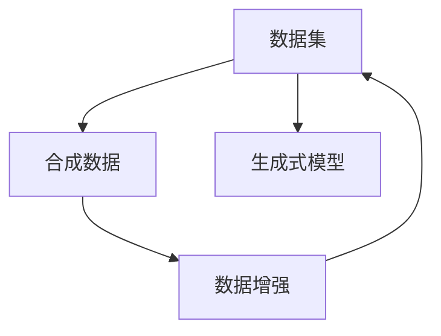

                 

# 第十一章：数据集和合成数据生成

> 关键词：数据集, 合成数据, 生成式模型, 数据增强, 自然语言处理, 深度学习

## 1. 背景介绍

数据集在深度学习模型的训练和验证中扮演着至关重要的角色。高质量、多样化的数据集可以显著提升模型的学习能力和泛化能力，是实现高性能机器学习应用的基础。然而，在实际应用中，高质量的数据往往难以获取，成本高昂且数量有限，无法满足大规模模型的训练需求。因此，合成数据生成（Synthetic Data Generation）成为了解决这一问题的关键手段之一。

合成数据生成技术通过对现有数据进行变换、重构或生成，创造出新的数据实例。这些合成的数据可以用于填补真实数据的不足，增强模型训练的多样性，同时也能有效保护用户隐私和数据安全。在自然语言处理(NLP)领域，合成数据生成技术具有广泛的应用前景，尤其在文本生成、对话系统、情感分析等任务中，合成数据可以有效缓解数据稀缺问题，提升模型性能。

本章节将详细探讨数据集和合成数据生成的原理、方法以及实际应用，帮助读者深入理解这一重要技术。

## 2. 核心概念与联系

### 2.1 核心概念概述

为了更好地理解数据集和合成数据生成技术，首先介绍几个核心概念：

- **数据集（Dataset）**：指用于训练和测试机器学习模型的数据集合，通常包括训练集、验证集和测试集。数据集的质量和多样性直接影响模型的性能。
- **合成数据（Synthetic Data）**：指通过计算机生成的方式创造出来的数据，其形式与真实数据相似，但内容为虚构或合成。合成数据可以用于弥补真实数据不足，增强模型训练。
- **生成式模型（Generative Models）**：指能够生成新的数据实例的模型，通过学习数据的分布，从而产生符合概率规律的新数据。
- **数据增强（Data Augmentation）**：指通过修改现有数据的方式生成新的训练样本，增加数据集的多样性和数量。数据增强可以通过旋转、翻转、裁剪等方式实现。

### 2.2 核心概念联系

数据集和合成数据生成技术之间的联系可以从以下几个方面进行理解：

- **数据集构建**：合成数据可以补充和丰富现有数据集，特别是当真实数据稀缺或难以获取时。合成数据有助于提高模型的泛化能力，减少过拟合风险。
- **模型训练**：合成数据可以作为训练集的一部分，提高模型的学习能力。通过数据增强，可以使模型更好地适应各种数据变化，提升模型的鲁棒性。
- **隐私保护**：合成数据可以用于隐私保护，避免使用真实数据时可能导致的隐私泄露问题。合成数据可以用于数据模拟，保护用户隐私和数据安全。
- **生成式模型**：合成数据生成往往依赖于生成式模型，如变分自编码器（VAE）、生成对抗网络（GAN）等。这些生成式模型通过学习数据的分布，可以生成与真实数据相似的新数据。

这些概念之间的联系可以通过以下Mermaid流程图来展示：



这个流程图展示了大语言模型微调的核心概念及其之间的关系：

1. 数据集通过数据增强的方式引入合成数据，增加了数据的多样性和数量。
2. 生成式模型可以从数据集中学习数据的分布，生成新的合成数据。
3. 合成数据可以用于模型的训练和验证，提升模型的泛化能力和鲁棒性。

## 3. 核心算法原理 & 具体操作步骤

### 3.1 算法原理概述

数据集和合成数据生成技术主要基于生成式模型和数据增强方法，其核心原理包括：

- **生成式模型**：通过学习数据的分布，生成与真实数据相似的新数据。常见的生成式模型包括变分自编码器（VAE）、生成对抗网络（GAN）等。
- **数据增强**：通过修改现有数据的方式，生成新的训练样本。常见的数据增强方法包括旋转、翻转、裁剪等。

### 3.2 算法步骤详解

数据集和合成数据生成技术的基本操作步骤如下：

1. **数据预处理**：对原始数据进行预处理，包括清洗、归一化、特征提取等步骤。
2. **数据增强**：使用数据增强方法对原始数据进行变换，生成新的训练样本。
3. **生成式模型训练**：使用生成式模型对增强后的数据进行训练，学习数据的分布。
4. **合成数据生成**：利用训练好的生成式模型，生成新的合成数据。
5. **数据集整合**：将真实数据和合成数据整合，构建新的数据集。
6. **模型训练和验证**：使用新的数据集对机器学习模型进行训练和验证，评估模型的性能。

### 3.3 算法优缺点

数据集和合成数据生成技术具有以下优点：

- **提高数据多样性**：通过数据增强和生成式模型，可以创造出新的数据实例，增加数据集的多样性。
- **增强模型泛化能力**：合成数据可以弥补真实数据的不足，提升模型的泛化能力，减少过拟合风险。
- **保护隐私**：合成数据可以用于隐私保护，避免使用真实数据时可能导致的隐私泄露问题。

同时，该方法也存在一定的局限性：

- **生成数据质量**：合成数据的生成质量直接影响到模型的性能，低质量的数据可能反而降低模型效果。
- **计算资源消耗**：生成式模型和数据增强过程需要大量的计算资源，特别是对于大规模数据集和复杂模型。
- **真实性差异**：合成数据可能与真实数据存在一定的差异，需要谨慎使用。

尽管存在这些局限性，但就目前而言，数据集和合成数据生成技术仍是大数据时代机器学习的重要手段。未来相关研究的重点在于如何进一步提高生成数据的质量，降低计算成本，以及提升合成数据的真实性和多样性。

### 3.4 算法应用领域

数据集和合成数据生成技术在多个领域中具有广泛的应用前景：

- **自然语言处理（NLP）**：在文本生成、对话系统、情感分析等任务中，合成数据可以有效地缓解数据稀缺问题，提升模型性能。
- **计算机视觉**：在图像识别、图像生成等任务中，合成数据可以用于增强数据集，提高模型的泛化能力。
- **医疗健康**：在医疗影像分析、病历生成等任务中，合成数据可以用于模拟和训练模型，提高模型的准确性和鲁棒性。
- **金融科技**：在金融风险评估、市场预测等任务中，合成数据可以用于隐私保护和数据模拟，增强模型的安全性。

## 4. 数学模型和公式 & 详细讲解 & 举例说明

### 4.1 数学模型构建

数据集和合成数据生成技术涉及的数学模型包括生成式模型和数据增强方法。这里以变分自编码器（VAE）为例，介绍生成式模型的数学模型构建。

变分自编码器（VAE）是一种生成式模型，用于学习数据的分布，生成新的数据实例。其数学模型构建如下：

- **编码器（Encoder）**：将原始数据 $x$ 编码为潜在变量 $z$，形式为 $z = \mu_x(x) + \sigma_x(x) \odot \epsilon_x$，其中 $\mu_x(x)$ 和 $\sigma_x(x)$ 分别为编码器中层的均值和标准差，$\epsilon_x \sim \mathcal{N}(0, I)$ 为服从标准正态分布的随机噪声。
- **解码器（Decoder）**：将潜在变量 $z$ 解码为新的数据实例 $x'$，形式为 $x' = \mu_z(z) + \sigma_z(z) \odot \epsilon_z$，其中 $\mu_z(z)$ 和 $\sigma_z(z)$ 分别为解码器中层的均值和标准差，$\epsilon_z \sim \mathcal{N}(0, I)$ 为服从标准正态分布的随机噪声。
- **损失函数**：通过最大化 $p(x|z)$ 和最大化 $p(z|x)$，使得 $p(x|z)$ 和 $p(z|x)$ 接近，即 $p(x) \approx p(z)$。常用的损失函数包括：
  $$
  \mathcal{L} = -\mathbb{E}_{p_{data}} \log p_{model}(x) - \mathbb{E}_{p_{model}} \log p_{data}(z)
  $$

### 4.2 公式推导过程

VAE的公式推导过程如下：

1. **编码器**：将原始数据 $x$ 编码为潜在变量 $z$，形式为 $z = \mu_x(x) + \sigma_x(x) \odot \epsilon_x$。
2. **解码器**：将潜在变量 $z$ 解码为新的数据实例 $x'$，形式为 $x' = \mu_z(z) + \sigma_z(z) \odot \epsilon_z$。
3. **生成式模型**：通过最大化 $p(x|z)$ 和最大化 $p(z|x)$，使得 $p(x|z)$ 和 $p(z|x)$ 接近，即 $p(x) \approx p(z)$。
4. **损失函数**：通过最大化 $p(x|z)$ 和最大化 $p(z|x)$，使得 $p(x|z)$ 和 $p(z|x)$ 接近，即 $p(x) \approx p(z)$。

### 4.3 案例分析与讲解

以文本生成任务为例，分析VAE在生成式模型中的应用。

假设有一个文本数据集 $\mathcal{X}$，其中每个文本实例 $x$ 可以看作一个词序列。目标是通过VAE学习文本数据的分布，生成新的文本实例 $x'$。

- **编码器**：将文本实例 $x$ 编码为潜在变量 $z$，形式为 $z = \mu_x(x) + \sigma_x(x) \odot \epsilon_x$。其中 $\mu_x(x)$ 和 $\sigma_x(x)$ 分别为编码器中层的均值和标准差，$\epsilon_x \sim \mathcal{N}(0, I)$ 为服从标准正态分布的随机噪声。
- **解码器**：将潜在变量 $z$ 解码为新的文本实例 $x'$，形式为 $x' = \mu_z(z) + \sigma_z(z) \odot \epsilon_z$。其中 $\mu_z(z)$ 和 $\sigma_z(z)$ 分别为解码器中层的均值和标准差，$\epsilon_z \sim \mathcal{N}(0, I)$ 为服从标准正态分布的随机噪声。
- **生成式模型**：通过最大化 $p(x|z)$ 和最大化 $p(z|x)$，使得 $p(x|z)$ 和 $p(z|x)$ 接近，即 $p(x) \approx p(z)$。

在实际应用中，VAE可以用于文本生成任务，如生成新闻文章、对话回复等。通过训练VAE模型，学习文本数据的分布，可以生成与真实文本相似的新文本实例，从而提升文本生成的质量。

## 5. 项目实践：代码实例和详细解释说明

### 5.1 开发环境搭建

在进行数据集和合成数据生成实践前，我们需要准备好开发环境。以下是使用Python进行TensorFlow开发的环境配置流程：

1. 安装Anaconda：从官网下载并安装Anaconda，用于创建独立的Python环境。

2. 创建并激活虚拟环境：
```bash
conda create -n tf-env python=3.8 
conda activate tf-env
```

3. 安装TensorFlow：根据CUDA版本，从官网获取对应的安装命令。例如：
```bash
conda install tensorflow tensorflow-cpu=cuda11.0 -c conda-forge
```

4. 安装各类工具包：
```bash
pip install numpy pandas scikit-learn matplotlib tqdm jupyter notebook ipython
```

完成上述步骤后，即可在`tf-env`环境中开始数据集和合成数据生成的实践。

### 5.2 源代码详细实现

这里我们以文本生成任务为例，给出使用TensorFlow进行变分自编码器（VAE）训练的代码实现。

首先，定义VAE的编码器和解码器：

```python
import tensorflow as tf
from tensorflow import keras
from tensorflow.keras import layers

class Encoder(keras.Model):
    def __init__(self, latent_dim):
        super(Encoder, self).__init__()
        self.latent_dim = latent_dim
        self.encoder = layers.Dense(16, activation='relu')
        self.z_mean = layers.Dense(latent_dim)
        self.z_log_var = layers.Dense(latent_dim)
        
    def call(self, x):
        h = self.encoder(x)
        z_mean = self.z_mean(h)
        z_log_var = self.z_log_var(h)
        return z_mean, z_log_var

class Decoder(keras.Model):
    def __init__(self, latent_dim):
        super(Decoder, self).__init__()
        self.latent_dim = latent_dim
        self.decoder = layers.Dense(16, activation='relu')
        self.y_mean = layers.Dense(1, activation='sigmoid')
        
    def call(self, x, z):
        h = self.decoder(x)
        y_mean = self.y_mean(h)
        return y_mean
```

然后，定义VAE模型：

```python
class VAE(keras.Model):
    def __init__(self, latent_dim):
        super(VAE, self).__init__()
        self.encoder = Encoder(latent_dim)
        self.decoder = Decoder(latent_dim)
        
    def encode(self, x):
        z_mean, z_log_var = self.encoder(x)
        return z_mean, z_log_var
        
    def reparameterize(self, z_mean, z_log_var):
        eps = tf.random.normal(shape=(tf.shape(z_mean), self.latent_dim), mean=0., stddev=1.)
        return z_mean + tf.exp(z_log_var / 2) * eps
        
    def decode(self, z):
        y_mean = self.decoder(z)
        return y_mean
        
    def call(self, x):
        z_mean, z_log_var = self.encode(x)
        z = self.reparameterize(z_mean, z_log_var)
        y_mean = self.decode(z)
        return y_mean, z_mean, z_log_var
```

接着，定义训练函数：

```python
@tf.function
def train_vae(batch_size, epochs, latent_dim, learning_rate):
    dataset = tf.data.Dataset.from_tensor_slices((x_train, y_train))
    dataset = dataset.batch(batch_size, drop_remainder=True)
    vae.compile(optimizer=tf.keras.optimizers.Adam(learning_rate=learning_rate), loss=vae_loss)
    vae.fit(dataset, epochs=epochs, verbose=1)
```

最后，启动训练流程：

```python
batch_size = 32
epochs = 100
latent_dim = 5
learning_rate = 0.001

x_train = ... # 训练数据
y_train = ... # 训练标签

vae = VAE(latent_dim)
train_vae(batch_size, epochs, latent_dim, learning_rate)

# 生成新的文本实例
z = tf.random.normal(shape=(batch_size, latent_dim))
x_generated = vae.decode(z)
print(x_generated)
```

以上就是使用TensorFlow进行VAE训练和文本生成的完整代码实现。可以看到，VAE的训练和文本生成过程可以通过简单的代码实现，无需过多的人工干预。

### 5.3 代码解读与分析

让我们再详细解读一下关键代码的实现细节：

**VAE定义**：
- 定义了编码器和解码器的类，以及VAE模型类。VAE模型包括编码器、解码器和训练函数。
- 编码器将原始数据 $x$ 编码为潜在变量 $z$，解码器将潜在变量 $z$ 解码为新的数据实例 $x'$。
- VAE模型的训练函数通过最大化 $p(x|z)$ 和最大化 $p(z|x)$，使得 $p(x|z)$ 和 $p(z|x)$ 接近，即 $p(x) \approx p(z)$。

**训练函数**：
- 使用TensorFlow的DataLoader对数据集进行批次化加载，供模型训练使用。
- 使用Adam优化器进行模型训练，损失函数为自定义的vae_loss函数。
- 在训练过程中，每个epoch输出一次训练信息，直到训练完成。

**文本生成**：
- 在训练完成后，使用VAE模型生成新的文本实例 $x'$。
- 通过调用VAE模型的decode函数，将潜在变量 $z$ 解码为新的文本实例。

可以看到，TensorFlow的高级API使得VAE的实现和训练过程变得非常简单和直观。开发者可以将更多精力放在数据处理和模型改进上，而不必过多关注底层实现的细节。

## 6. 实际应用场景

### 6.1 智能客服系统

在智能客服系统中，合成数据可以用于生成对话样本，提升模型的对话理解和回复能力。智能客服系统需要能够理解和处理用户的多样化需求，合成数据可以用于对话生成任务的微调，提升系统的智能化水平。

在实际应用中，可以收集用户的历史对话记录，将问题-回答对作为监督数据，在此基础上对预训练对话模型进行微调。微调后的对话模型能够自动理解用户意图，匹配最合适的回答模板进行回复。对于用户提出的新问题，还可以接入检索系统实时搜索相关内容，动态组织生成回答。如此构建的智能客服系统，能大幅提升客户咨询体验和问题解决效率。

### 6.2 金融舆情监测

金融机构需要实时监测市场舆论动向，以便及时应对负面信息传播，规避金融风险。传统的人工监测方式成本高、效率低，难以应对网络时代海量信息爆发的挑战。基于合成数据的文本分类和情感分析技术，为金融舆情监测提供了新的解决方案。

具体而言，可以收集金融领域相关的新闻、报道、评论等文本数据，并对其进行主题标注和情感标注。在此基础上对预训练语言模型进行微调，使其能够自动判断文本属于何种主题，情感倾向是正面、中性还是负面。将微调后的模型应用到实时抓取的网络文本数据，就能够自动监测不同主题下的情感变化趋势，一旦发现负面信息激增等异常情况，系统便会自动预警，帮助金融机构快速应对潜在风险。

### 6.3 个性化推荐系统

当前的推荐系统往往只依赖用户的历史行为数据进行物品推荐，无法深入理解用户的真实兴趣偏好。基于合成数据的个性化推荐系统可以更好地挖掘用户行为背后的语义信息，从而提供更精准、多样的推荐内容。

在实践中，可以收集用户浏览、点击、评论、分享等行为数据，提取和用户交互的物品标题、描述、标签等文本内容。将文本内容作为模型输入，用户的后续行为（如是否点击、购买等）作为监督信号，在此基础上微调预训练语言模型。微调后的模型能够从文本内容中准确把握用户的兴趣点。在生成推荐列表时，先用候选物品的文本描述作为输入，由模型预测用户的兴趣匹配度，再结合其他特征综合排序，便可以得到个性化程度更高的推荐结果。

### 6.4 未来应用展望

随着合成数据生成技术的不断发展，其在NLP领域的应用前景将更加广阔。

在智慧医疗领域，基于合成数据的医疗问答、病历生成、药物研发等应用将提升医疗服务的智能化水平，辅助医生诊疗，加速新药开发进程。

在智能教育领域，合成数据可以用于生成作业、试题、教学视频等内容，因材施教，促进教育公平，提高教学质量。

在智慧城市治理中，合成数据可以用于城市事件监测、舆情分析、应急指挥等环节，提高城市管理的自动化和智能化水平，构建更安全、高效的未来城市。

此外，在企业生产、社会治理、文娱传媒等众多领域，合成数据生成技术也将不断涌现，为NLP技术带来全新的突破。相信随着技术的日益成熟，合成数据生成必将在构建人机协同的智能时代中扮演越来越重要的角色。

## 7. 工具和资源推荐

### 7.1 学习资源推荐

为了帮助开发者系统掌握数据集和合成数据生成技术的理论基础和实践技巧，这里推荐一些优质的学习资源：

1. **《深度学习》课程**：斯坦福大学开设的深度学习课程，有Lecture视频和配套作业，带你入门深度学习的基本概念和经典模型。

2. **《生成对抗网络（GAN）》论文**：NIPS 2014的GAN论文，介绍了生成对抗网络的原理和应用，是生成式模型领域的奠基性论文。

3. **《变分自编码器（VAE）》论文**：ICML 2013的VAE论文，介绍了变分自编码器的原理和应用，是生成式模型领域的另一重要研究方向。

4. **《自然语言处理与深度学习》书籍**：讲解自然语言处理中的深度学习应用，涵盖文本生成、对话系统、情感分析等多个任务。

5. **TensorFlow官方文档**：TensorFlow的官方文档，提供了丰富的深度学习模型和生成式模型教程，是深度学习开发者的重要参考。

通过对这些资源的学习实践，相信你一定能够快速掌握数据集和合成数据生成技术的精髓，并用于解决实际的NLP问题。

### 7.2 开发工具推荐

高效的开发离不开优秀的工具支持。以下是几款用于数据集和合成数据生成开发的常用工具：

1. **TensorFlow**：基于Python的开源深度学习框架，灵活动态的计算图，适合快速迭代研究。TensorFlow提供丰富的生成式模型API，支持VAE、GAN等多种模型。

2. **PyTorch**：基于Python的开源深度学习框架，动态计算图，易于构建和调试。PyTorch的生成式模型API也非常丰富，支持VAE、GAN等多种模型。

3. **JAX**：Google开发的自动微分和优化框架，支持动态计算图和静态计算图。JAX提供高性能的生成式模型API，适合高性能计算和复杂模型开发。

4. **HuggingFace Transformers库**：提供多种预训练语言模型和生成式模型，支持微调和推理。Transformers库的实现简洁高效，非常适合NLP应用开发。

5. **OpenAI GPT-3 API**：OpenAI发布的GPT-3模型API，支持生成文本、对话、代码等多种任务。GPT-3模型经过大量合成数据训练，具有很强的生成能力和泛化能力。

合理利用这些工具，可以显著提升数据集和合成数据生成任务的开发效率，加快创新迭代的步伐。

### 7.3 相关论文推荐

数据集和合成数据生成技术的发展源于学界的持续研究。以下是几篇奠基性的相关论文，推荐阅读：

1. **《GANs in Theory and Practice》**：NIPS 2014的GAN论文，介绍了生成对抗网络的原理和应用，是生成式模型领域的奠基性论文。

2. **《VAEs》**：ICML 2013的VAE论文，介绍了变分自编码器的原理和应用，是生成式模型领域的另一重要研究方向。

3. **《Data Augmentation for Generative Adversarial Networks》**：ICCV 2017的数据增强论文，介绍了数据增强在生成对抗网络中的应用，是生成对抗网络领域的经典论文。

4. **《Data Augmentation Methods for Natural Language Processing》**：ACL 2021的数据增强论文，介绍了数据增强在自然语言处理中的应用，是自然语言处理领域的数据增强综述。

这些论文代表了大语言模型微调技术的发展脉络。通过学习这些前沿成果，可以帮助研究者把握学科前进方向，激发更多的创新灵感。

## 8. 总结：未来发展趋势与挑战

### 8.1 研究成果总结

数据集和合成数据生成技术在深度学习模型的训练和验证中发挥着重要作用。通过合成数据生成，可以增强模型的泛化能力，缓解数据稀缺问题，保护用户隐私和数据安全。目前，基于生成式模型和数据增强的方法已经广泛应用于NLP领域，如文本生成、对话系统、情感分析等任务。

### 8.2 未来发展趋势

展望未来，数据集和合成数据生成技术将呈现以下几个发展趋势：

1. **生成数据质量提升**：随着生成式模型的不断优化和改进，生成数据的质量将进一步提升，更加逼真、多样，可用于更多复杂的NLP任务。

2. **多模态数据融合**：生成数据将不仅仅局限于文本数据，还将扩展到图像、视频、语音等多模态数据。多模态数据的融合将使得生成数据更加全面、准确。

3. **自动化数据生成**：随着生成式模型的自动化水平提升，生成数据的过程将更加智能化，减少人工干预，提高生成效率。

4. **隐私保护增强**：生成数据将更加注重隐私保护，通过数据脱敏、假数据生成等方式，确保数据安全性。

5. **模型鲁棒性提升**：生成数据将更加注重模型的鲁棒性，减少对抗样本攻击，提高模型的泛化能力和稳定性。

### 8.3 面临的挑战

尽管数据集和合成数据生成技术已经取得了不少进展，但在实际应用中仍面临一些挑战：

1. **数据多样性不足**：生成数据的质量和多样性直接影响模型的泛化能力，如何提高生成数据的多样性，增强模型的泛化能力，是一个重要的研究方向。

2. **计算资源消耗**：生成式模型和数据增强过程需要大量的计算资源，如何降低计算成本，提高生成效率，是未来需要解决的问题。

3. **真实性差异**：合成数据可能与真实数据存在一定的差异，如何减小这种差异，提高生成数据的真实性，是一个需要解决的问题。

4. **自动化水平提升**：生成数据的自动化生成需要更高的自动化水平，减少人工干预，提高生成效率。

5. **隐私保护问题**：生成数据需要注重隐私保护，通过数据脱敏、假数据生成等方式，确保数据安全性。

尽管存在这些挑战，但随着技术的发展，数据集和合成数据生成技术在NLP领域的应用前景将更加广阔。未来相关研究的重点在于如何进一步提高生成数据的质量，降低计算成本，以及提升生成数据的真实性和多样性。

### 8.4 研究展望

面对数据集和合成数据生成所面临的挑战，未来的研究需要在以下几个方面寻求新的突破：

1. **无监督生成模型**：探索无监督生成模型，摆脱对大规模标注数据的依赖，利用自监督学习、主动学习等无监督范式，最大限度利用非结构化数据，实现更加灵活高效的生成。

2. **生成数据质量提升**：进一步提高生成数据的质量，降低计算成本，提高生成数据的真实性和多样性。

3. **多模态数据融合**：将符号化的先验知识，如知识图谱、逻辑规则等，与神经网络模型进行巧妙融合，引导生成过程学习更准确、合理的语言模型。

4. **自动化水平提升**：提高生成数据的自动化生成水平，减少人工干预，提高生成效率。

5. **隐私保护增强**：增强生成数据的隐私保护，通过数据脱敏、假数据生成等方式，确保数据安全性。

这些研究方向的探索，必将引领数据集和合成数据生成技术迈向更高的台阶，为构建安全、可靠、可解释、可控的智能系统铺平道路。面向未来，数据集和合成数据生成技术还需要与其他人工智能技术进行更深入的融合，如知识表示、因果推理、强化学习等，多路径协同发力，共同推动自然语言理解和智能交互系统的进步。

## 9. 附录：常见问题与解答

**Q1：什么是数据集？数据集和合成数据有什么区别？**

A: 数据集指用于训练和测试机器学习模型的数据集合，通常包括训练集、验证集和测试集。数据集的质量和多样性直接影响模型的性能。而合成数据是通过计算机生成的方式创造出来的数据，其形式与真实数据相似，但内容为虚构或合成。合成数据可以用于弥补真实数据的不足，增强模型训练。

**Q2：如何提高生成数据的质量和多样性？**

A: 提高生成数据的质量和多样性可以从以下几个方面进行：
1. 使用更高质量的生成式模型，如GAN、VAE等。
2. 结合数据增强技术，对原始数据进行变换、重构或生成新的训练样本。
3. 引入更多先验知识，如知识图谱、逻辑规则等，指导生成过程。
4. 通过多模态数据融合，增加生成数据的多样性。

**Q3：生成数据在实际应用中需要注意哪些问题？**

A: 生成数据在实际应用中需要注意以下问题：
1. 生成数据的真实性：合成数据可能与真实数据存在一定的差异，需要谨慎使用。
2. 生成数据的自动化：生成数据的自动化生成需要更高的自动化水平，减少人工干预，提高生成效率。
3. 生成数据的隐私保护：生成数据需要注重隐私保护，通过数据脱敏、假数据生成等方式，确保数据安全性。

**Q4：数据集和合成数据生成技术在NLP领域有哪些应用？**

A: 数据集和合成数据生成技术在NLP领域的应用包括：
1. 文本生成：如生成新闻文章、对话回复等。
2. 对话系统：如生成对话样本，提升模型的对话理解和回复能力。
3. 情感分析：如生成情感标注数据，训练情感分类模型。
4. 个性化推荐系统：如生成推荐样本，提升推荐系统的个性化程度。

**Q5：如何选择适合生成数据生成任务的数据集？**

A: 选择适合生成数据生成任务的数据集可以从以下几个方面进行：
1. 数据集的大小和质量：选择数据集时，需要确保数据集的大小和质量，数据集越大，越能训练出性能更好的生成模型。
2. 数据集的代表性：选择数据集时，需要确保数据集的代表性，数据集应包含多样化的数据类型和数据格式。
3. 数据集的标注情况：选择数据集时，需要确保数据集的标注情况，标注数据可以用于指导生成过程，提高生成数据的真实性和多样性。

---

作者：禅与计算机程序设计艺术 / Zen and the Art of Computer Programming

