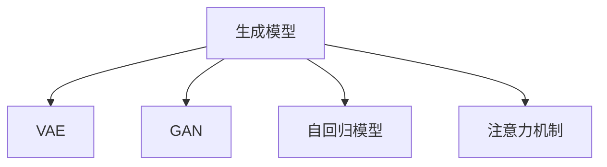

                 

# 第十四章：高级主题：生成式人工智能

## 1. 背景介绍

生成式人工智能是人工智能领域的一个重要分支，旨在通过深度学习等技术，学习并生成新的、具有创造性的内容，如文本、图像、音频等。这不仅包括自然语言生成、图像生成等常见应用，还涉及视频生成、音乐创作等多个前沿领域。本章将深入探讨生成式人工智能的原理与实践，探讨其核心算法、操作步骤以及优缺点，同时通过具体案例与实际应用场景，展示其强大的应用潜力。

## 2. 核心概念与联系

生成式人工智能的核心概念主要包括生成模型、变分自编码器（VAE）、生成对抗网络（GAN）、变分自编码器（VAE）、自回归模型等。这些核心概念之间的联系和相互作用，构成了生成式人工智能的核心技术框架。

### 2.1 核心概念概述

- **生成模型（Generative Model）**：这类模型旨在学习数据的生成过程，并根据学习到的生成过程生成新的数据样本。
- **变分自编码器（VAE）**：一种基于概率生成模型的变分推理框架，用于生成新的数据样本，同时保持数据的潜在变量分布的一致性。
- **生成对抗网络（GAN）**：一种通过两个神经网络竞争生成逼真样本的技术，其中一个网络生成样本，另一个网络判断样本的真实性。
- **自回归模型（Auto-Regressive Model）**：这类模型通过已知的信息预测下一个数据点，常用于文本生成等任务。
- **注意力机制（Attention Mechanism）**：在生成式任务中，用于提高模型对重要信息的关注和生成过程的效率。

这些核心概念之间的联系通过以下Mermaid流程图进行展示：



## 3. 核心算法原理 & 具体操作步骤

### 3.1 算法原理概述

生成式人工智能的核心算法原理主要涉及概率模型、变分推断、对抗生成等方法。这些方法通过学习数据的分布特征，生成新的数据样本。变分推断和对抗生成方法通过优化损失函数，逐步提高生成的数据样本的质量和多样性。

### 3.2 算法步骤详解

1. **数据准备**：收集需要生成的新数据的样本，并对其进行预处理。
2. **模型选择**：根据具体应用场景选择合适的生成模型，如VAE、GAN等。
3. **模型训练**：在收集到的数据上训练模型，最小化生成样本与真实样本之间的差距。
4. **样本生成**：使用训练好的模型生成新的数据样本，并评估生成的样本质量。
5. **样本后处理**：对生成的样本进行后处理，如去噪、修正等，以提高样本质量。

### 3.3 算法优缺点

**优点**：
- 能够生成高质量、多样化的数据样本。
- 能够解决数据不足的问题，提高数据生成效率。
- 在图像、文本、音乐等多个领域有广泛应用。

**缺点**：
- 需要大量计算资源和数据。
- 生成的样本可能存在质量不稳定的问题。
- 模型的训练和优化过程较为复杂，需要深入理解其原理和算法。

### 3.4 算法应用领域

生成式人工智能在多个领域有着广泛的应用，如：

- **自然语言生成**：自动生成文章、对话、摘要等文本。
- **图像生成**：生成逼真图像、艺术作品等。
- **视频生成**：自动生成视频内容，如电影、动画等。
- **音乐创作**：生成新的音乐、乐曲等。

## 4. 数学模型和公式 & 详细讲解 & 举例说明

### 4.1 数学模型构建

生成式人工智能的数学模型构建主要包括生成模型、变分自编码器（VAE）和生成对抗网络（GAN）的构建。

**生成模型**：

$$ P(x) = \prod_{i=1}^N p(x_i | x_{<i}) $$

其中 $x$ 为生成的样本，$x_i$ 为样本中的第 $i$ 个数据点。

**VAE模型**：

$$ p(x) = \mathcal{N}(x | \mu(z), \sigma(z)) $$

$$ q(z | x) = \mathcal{N}(z | \mu(x), \sigma(x)) $$

其中 $x$ 为观测数据，$z$ 为潜在变量，$\mu(x)$ 和 $\sigma(x)$ 为潜在变量的均值和方差。

**GAN模型**：

$$ p_g(x) = \frac{1}{2}p_r(x) + \frac{1}{2}p_f(x) $$

其中 $p_g(x)$ 为生成数据分布，$p_r(x)$ 为真实数据分布，$p_f(x)$ 为生成数据分布。

### 4.2 公式推导过程

**生成模型**：

$$ P(x) = \prod_{i=1}^N p(x_i | x_{<i}) = \prod_{i=1}^N p(x_i | x_{<i-1}, \theta) $$

其中 $\theta$ 为模型参数。

**VAE模型**：

$$ \log p(x) = \mathbb{E}_{q(z|x)}\log p(x|z) + \mathbb{E}_{q(z|x)}\log q(z|x) $$

$$ \log p(x) = \mathbb{E}_{q(z|x)}\log \mathcal{N}(x | \mu(z), \sigma(z)) + \mathbb{E}_{q(z|x)}\log \mathcal{N}(z | \mu(x), \sigma(x)) $$

**GAN模型**：

$$ \max_{G} \min_{D} V(G, D) $$

$$ V(G, D) = \mathbb{E}_{x \sim p_r(x)} \log D(x) + \mathbb{E}_{x \sim p_g(x)} \log (1 - D(x)) $$

其中 $G$ 为生成器，$D$ 为判别器。

### 4.3 案例分析与讲解

**文本生成**：

以自然语言生成为例，可以使用自回归模型或Transformer模型进行文本生成。自回归模型通过已知的信息预测下一个单词或字符，逐步生成完整的文本。

**图像生成**：

使用GAN模型进行图像生成，通过两个神经网络（生成器和判别器）竞争生成逼真的图像样本。生成器学习生成新的图像，判别器学习区分真实图像和生成图像，两个网络交替训练，直到生成器能够生成高质量的图像样本。

## 5. 项目实践：代码实例和详细解释说明

### 5.1 开发环境搭建

使用Python进行开发，具体步骤如下：

1. 安装Anaconda：从官网下载并安装Anaconda，用于创建独立的Python环境。
2. 创建并激活虚拟环境：
```bash
conda create -n pytorch-env python=3.8 
conda activate pytorch-env
```

3. 安装PyTorch：根据CUDA版本，从官网获取对应的安装命令。例如：
```bash
conda install pytorch torchvision torchaudio cudatoolkit=11.1 -c pytorch -c conda-forge
```

4. 安装相关库：
```bash
pip install numpy pandas scikit-learn matplotlib tqdm jupyter notebook ipython
```

### 5.2 源代码详细实现

以文本生成为例，使用GPT模型进行文本生成。

```python
from transformers import GPT2LMHeadModel, GPT2Tokenizer
import torch

model = GPT2LMHeadModel.from_pretrained('gpt2')
tokenizer = GPT2Tokenizer.from_pretrained('gpt2')

def generate_text(prompt, max_length=50):
    inputs = tokenizer.encode(prompt, return_tensors='pt')
    outputs = model.generate(inputs, max_length=max_length, top_p=0.9, do_sample=True)
    return tokenizer.decode(outputs[0], skip_special_tokens=True)

text = generate_text("The art of computer programming is a journey of")
print(text)
```

### 5.3 代码解读与分析

**GPT2LMHeadModel和GPT2Tokenizer**：
- 从预训练模型库中加载GPT-2模型和分词器。
- 使用分词器将提示转换为模型可以处理的token ids。
- 将token ids输入模型，进行生成操作。
- 将生成结果解码为可读的文本。

**generate_text函数**：
- 接受一个提示字符串，将提示字符串转化为token ids。
- 输入模型，生成新的文本序列。
- 将生成序列解码为可读文本。

## 6. 实际应用场景

### 6.1 自动文本生成

自动文本生成在新闻报道、自动翻译、文章摘要、对话系统等多个领域有着广泛应用。自动文本生成可以节省大量的人力成本，提高效率和准确性。

### 6.2 图像生成

图像生成在艺术创作、虚拟现实、游戏开发等多个领域有重要应用。通过生成逼真图像，可以解决图像数据不足的问题，提高数据生成效率。

### 6.3 视频生成

视频生成在电影制作、动画制作、虚拟现实等多个领域有重要应用。通过生成高质量的视频内容，可以解决视频数据不足的问题，提高视频生成效率。

### 6.4 音乐创作

音乐生成在音乐创作、游戏开发、广告制作等多个领域有重要应用。通过生成高质量的音乐，可以解决音乐数据不足的问题，提高音乐生成效率。

## 7. 工具和资源推荐

### 7.1 学习资源推荐

1. **《生成式对抗网络》**：由Ian Goodfellow等作者所著，系统介绍了生成对抗网络的原理和实践，是学习生成对抗网络的重要参考资料。
2. **Coursera《深度学习》课程**：由Andrew Ng教授开设的深度学习课程，涵盖生成模型、变分自编码器、生成对抗网络等多个主题。
3. **HuggingFace官方文档**：提供了丰富的预训练语言模型和生成模型资源，是学习和实践生成式人工智能的重要工具。
4. **PyTorch官方文档**：提供了详细的PyTorch框架介绍和代码示例，是学习和实践深度学习的重要参考。
5. **TensorFlow官方文档**：提供了详细的TensorFlow框架介绍和代码示例，是学习和实践深度学习的重要参考。

### 7.2 开发工具推荐

1. **PyTorch**：基于Python的开源深度学习框架，灵活动态的计算图，适合快速迭代研究。
2. **TensorFlow**：由Google主导开发的开源深度学习框架，生产部署方便，适合大规模工程应用。
3. **Weights & Biases**：模型训练的实验跟踪工具，可以记录和可视化模型训练过程中的各项指标，方便对比和调优。
4. **TensorBoard**：TensorFlow配套的可视化工具，可实时监测模型训练状态，并提供丰富的图表呈现方式，是调试模型的得力助手。
5. **Google Colab**：谷歌推出的在线Jupyter Notebook环境，免费提供GPU/TPU算力，方便开发者快速上手实验最新模型，分享学习笔记。

### 7.3 相关论文推荐

1. **Attention Is All You Need**：提出Transformer结构，开启了NLP领域的预训练大模型时代。
2. **Generative Adversarial Nets**：提出GAN模型，通过两个神经网络竞争生成逼真样本。
3. **A Tutorial on Deep Generative Models**：介绍了深度生成模型在图像生成、文本生成等领域的多种应用。
4. **VAE: A Learning Framework for Generative Modeling**：提出变分自编码器，用于生成新的数据样本。
5. **Unsupervised Machine Learning for Speech Generation**：提出基于深度学习的语音生成方法，推动了语音生成技术的发展。

## 8. 总结：未来发展趋势与挑战

### 8.1 研究成果总结

生成式人工智能在自然语言生成、图像生成、视频生成、音乐创作等多个领域已经取得了显著的进展，推动了人工智能技术向更加多样化和智能化的方向发展。生成式人工智能技术的核心算法包括生成模型、变分自编码器、生成对抗网络等，这些算法通过学习数据的分布特征，生成高质量、多样化的新数据样本。

### 8.2 未来发展趋势

1. **深度生成模型**：未来的生成模型将更加复杂和强大，能够生成更高质量、更多样化的数据。
2. **跨模态生成**：未来的生成模型将支持跨模态数据生成，如文本、图像、声音等多种模态数据的融合。
3. **自主生成**：未来的生成模型将具备更高的自主性和创造性，能够生成更具新颖性和原创性的内容。
4. **可解释性**：未来的生成模型将具备更高的可解释性，能够解释其生成过程和决策机制。

### 8.3 面临的挑战

1. **计算资源**：生成式人工智能需要大量的计算资源和存储空间，如何降低计算成本，提高计算效率，是一个重要的研究方向。
2. **生成质量**：生成的样本质量不稳定，如何提高生成样本的质量和多样性，是一个重要的研究方向。
3. **模型复杂度**：生成模型往往结构复杂，如何简化模型结构，提高训练效率和可解释性，是一个重要的研究方向。

### 8.4 研究展望

未来的生成式人工智能研究将重点关注以下几个方面：

1. **跨模态生成**：支持跨模态数据生成，如文本、图像、声音等多种模态数据的融合。
2. **自主生成**：提高生成模型的自主性和创造性，生成更具新颖性和原创性的内容。
3. **可解释性**：提高生成模型的可解释性，解释其生成过程和决策机制。
4. **计算效率**：提高生成模型的计算效率，降低计算成本。

## 9. 附录：常见问题与解答

**Q1：生成式人工智能的应用范围有哪些？**

A: 生成式人工智能在自然语言生成、图像生成、视频生成、音乐创作等多个领域有着广泛的应用。例如，自动文本生成、图像生成、视频生成、音乐创作等。

**Q2：生成式人工智能的缺点有哪些？**

A: 生成式人工智能的缺点包括：
- 需要大量的计算资源和存储空间。
- 生成的样本质量不稳定。
- 模型结构复杂，训练和优化过程较为复杂。

**Q3：生成式人工智能的优点有哪些？**

A: 生成式人工智能的优点包括：
- 能够生成高质量、多样化的数据样本。
- 能够解决数据不足的问题，提高数据生成效率。
- 在多个领域有广泛的应用。

**Q4：生成式人工智能的未来发展方向有哪些？**

A: 生成式人工智能的未来发展方向包括：
- 深度生成模型。
- 跨模态生成。
- 自主生成。
- 可解释性。

**Q5：如何提高生成式人工智能的生成质量？**

A: 提高生成式人工智能的生成质量可以通过以下方法实现：
- 使用更先进的生成模型，如GAN、VAE等。
- 优化模型的训练过程，使用更高级的优化算法。
- 增加训练数据量，提高模型的泛化能力。

---

作者：禅与计算机程序设计艺术 / Zen and the Art of Computer Programming

