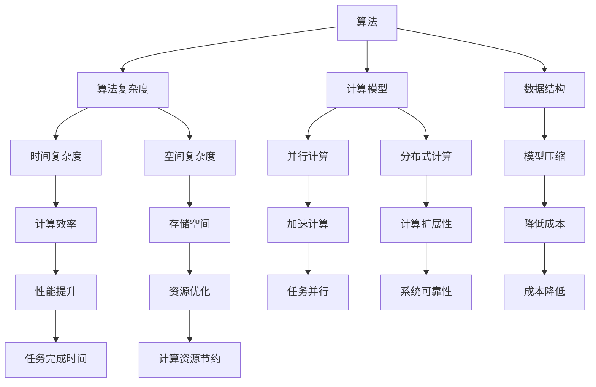

                 

# 算法优化：提升人类计算的效率和准确性

> 关键词：算法优化,计算效率,计算准确性,算法性能优化,算法改进,计算模型,计算技术,算法评估

## 1. 背景介绍

### 1.1 问题由来
随着科技的迅猛发展，计算技术在各行各业的应用越来越广泛，但与此同时，计算资源的稀缺性和计算结果的准确性问题也日益突出。如何通过优化算法，提高计算效率，确保计算结果的准确性，成为计算领域的一个重要研究方向。特别是随着大数据、人工智能等技术的兴起，算法优化在优化资源使用、提高系统性能、降低计算成本等方面发挥了越来越重要的作用。

### 1.2 问题核心关键点
算法优化（Algorithm Optimization）是提升计算效率和准确性的核心手段。其核心思想是通过对算法进行分析和改进，减少冗余计算，避免不必要的资源浪费，从而在相同计算资源下，提高计算效率和计算结果的准确性。

算法优化的关键点包括：

1. **算法设计**：选择合适的算法或改进现有算法，使其更适合解决特定问题。
2. **参数调优**：调整算法的参数，使算法在不同数据和任务上表现出最佳的性能。
3. **硬件适配**：根据硬件特性优化算法，使其能够充分利用硬件资源，提高计算效率。
4. **模型压缩**：通过对模型进行压缩，减少计算量和存储空间，提高系统性能。
5. **容错和纠错**：设计容错和纠错机制，确保计算结果的可靠性。

这些关键点共同构成了算法优化的基础框架，使其能够在各种计算场景下发挥重要作用。

### 1.3 问题研究意义
算法优化在提升人类计算的效率和准确性方面具有重要意义：

1. **降低计算成本**：通过优化算法，减少不必要的计算资源消耗，降低计算成本。
2. **提高计算效率**：通过改进算法，加速计算过程，缩短任务完成时间。
3. **提升计算结果准确性**：通过优化算法，减少计算误差，提高计算结果的可靠性。
4. **支持大规模数据处理**：算法优化是处理大数据和复杂问题的重要手段，能够支持高并发、大吞吐量的计算任务。
5. **推动技术创新**：算法优化不断推动计算技术的进步，带来新的计算模型和计算方法。

算法优化不仅是计算领域的关键技术，也是推动各行各业数字化转型和技术升级的重要动力。

## 2. 核心概念与联系

### 2.1 核心概念概述

为了更好地理解算法优化的方法和原理，本节将介绍几个密切相关的核心概念：

- **算法**：解决问题的步骤和方法，通常包括输入、处理步骤和输出。
- **算法复杂度**：衡量算法计算资源消耗的指标，包括时间复杂度和空间复杂度。
- **计算模型**：计算任务所依赖的数学模型或计算框架。
- **数据结构**：存储和组织数据的方式，影响算法的执行效率。
- **并行计算**：通过同时执行多个任务，提高计算效率的技术。
- **分布式计算**：将计算任务分配到多个计算节点上，提高计算能力和系统容错性。
- **模型压缩**：通过减少模型参数和结构，降低计算资源消耗，提高计算效率。

这些核心概念之间的逻辑关系可以通过以下Mermaid流程图来展示：



这个流程图展示了算法优化中的核心概念及其之间的关系：

1. 算法作为解决问题的基本单元，其复杂度和数据结构决定了计算资源消耗。
2. 计算模型提供了算法的计算框架，支持并行和分布式计算。
3. 并行计算和分布式计算通过同时执行多个任务，提高了计算效率和系统扩展性。
4. 模型压缩减少了计算资源消耗，降低了成本，同时提高了性能。
5. 算法优化通过调整参数和改进算法，进一步提升计算效率和结果准确性。

## 3. 核心算法原理 & 具体操作步骤
### 3.1 算法原理概述

算法优化通过分析算法的计算复杂度和数据结构，选择合适的计算模型和并行/分布式计算策略，对算法进行改进和参数调优，从而提高计算效率和结果准确性。其核心思想是：在保证计算结果准确性的前提下，减少计算资源消耗，提升计算速度。

算法优化的基本步骤包括：

1. **算法分析和选择**：评估现有算法的性能，选择最适合解决问题的算法。
2. **参数调优**：根据数据和任务特点，调整算法参数，优化算法性能。
3. **硬件适配**：根据硬件特性优化算法，提高计算效率。
4. **模型压缩**：减少模型参数和结构，降低计算资源消耗。
5. **容错和纠错**：设计容错和纠错机制，确保计算结果的可靠性。

### 3.2 算法步骤详解

以下是一个基于线性回归的算法优化示例，具体展示算法优化的详细步骤：

#### 3.2.1 算法分析和选择

首先，评估现有线性回归算法的性能。假设当前算法的时间复杂度为O(n^3)，在处理大规模数据时效率较低。可以考虑选择时间复杂度更低的多项式回归算法，如岭回归和Lasso回归，以提高计算效率。

#### 3.2.2 参数调优

对于选定的算法，需要根据数据和任务特点进行参数调优。假设选择的算法是岭回归，可以通过交叉验证方法，调整正则化参数λ，使其在验证集上表现最佳。

#### 3.2.3 硬件适配

根据硬件特性，优化算法的执行方式。例如，在GPU上执行多项式回归算法，可以利用GPU的并行计算能力，显著提高计算效率。

#### 3.2.4 模型压缩

对于大规模模型，可以通过特征选择、参数剪枝等方法，减少模型参数和结构，降低计算资源消耗。例如，在岭回归中，可以选择最重要的特征，减少特征数量，降低计算复杂度。

#### 3.2.5 容错和纠错

设计容错和纠错机制，确保计算结果的可靠性。例如，在岭回归中，可以引入随机抽样和噪声加入，提高模型的鲁棒性和泛化能力。

### 3.3 算法优缺点

算法优化的优点包括：

1. **提高计算效率**：通过改进算法和参数调优，减少不必要的计算资源消耗，提高计算速度。
2. **提升计算结果准确性**：通过优化算法和容错机制，减少计算误差，提高结果的可靠性。
3. **支持大规模数据处理**：算法优化支持高并发、大吞吐量的计算任务，能够处理大规模数据集。
4. **降低计算成本**：通过减少计算资源消耗，降低计算成本，提高计算资源的利用率。

算法优化的缺点包括：

1. **优化难度较大**：算法优化需要深入理解算法和数据，具有一定的难度和复杂性。
2. **依赖硬件特性**：算法优化需要根据硬件特性进行优化，对硬件环境要求较高。
3. **可能牺牲部分精度**：在模型压缩和参数剪枝等优化策略下，可能会牺牲部分精度，需要权衡取舍。

尽管存在这些缺点，但算法优化在计算领域仍然具有重要的应用价值，能够显著提升计算效率和结果准确性。

### 3.4 算法应用领域

算法优化在多个计算领域都有广泛的应用，包括但不限于：

- **科学计算**：优化数值计算算法，提高计算效率和精度，支持高精度数值模拟和数据处理。
- **机器学习**：优化机器学习算法，减少计算资源消耗，提高模型性能和泛化能力。
- **数据库管理**：优化数据库查询和索引算法，提高查询效率和系统响应速度。
- **图像处理**：优化图像处理算法，提高处理速度和图像质量。
- **信号处理**：优化信号处理算法，提高信号采集和处理速度，提升系统稳定性。
- **网络通信**：优化网络通信算法，提高网络传输速度和系统可靠性。

这些领域的应用，展示了算法优化在提升计算效率和准确性方面的巨大潜力。

## 4. 数学模型和公式 & 详细讲解  
### 4.1 数学模型构建

为了更好地理解算法优化的数学模型，本节将介绍几个常用的数学模型和公式：

假设有一个线性回归问题，输入为n个样本点$(x_1, y_1), (x_2, y_2), ..., (x_n, y_n)$，输出为y。目标是找到一个线性模型$f(x;w) = wx + b$，使得$f(x_i;w)$与$y_i$之间的误差最小化。常用的目标函数是均方误差损失函数（Mean Squared Error，MSE）：

$$
\min_{w, b} \frac{1}{n} \sum_{i=1}^n (y_i - f(x_i;w))^2
$$

其中，$w$和$b$是模型的参数，$x$是输入特征，$y$是输出结果。

### 4.2 公式推导过程

在均方误差损失函数的基础上，通过梯度下降等优化算法，对模型参数$w$和$b$进行迭代更新，以最小化目标函数。具体推导如下：

1. **目标函数求导**：

$$
\frac{\partial \mathcal{L}(w, b)}{\partial w} = -\frac{2}{n} \sum_{i=1}^n (y_i - wx_i - b)x_i
$$

$$
\frac{\partial \mathcal{L}(w, b)}{\partial b} = -\frac{2}{n} \sum_{i=1}^n (y_i - wx_i - b)
$$

2. **更新参数**：

$$
w \leftarrow w - \eta \frac{\partial \mathcal{L}(w, b)}{\partial w}
$$

$$
b \leftarrow b - \eta \frac{\partial \mathcal{L}(w, b)}{\partial b}
$$

其中，$\eta$是学习率，用于控制参数更新的步长。

通过上述推导，可以理解线性回归模型优化的基本过程，通过最小化损失函数，不断迭代更新模型参数，使模型输出逼近真实标签。

### 4.3 案例分析与讲解

假设有一个包含1000个样本点的数据集，每个样本点包含两个特征和对应标签。使用岭回归算法，设定正则化参数λ为0.1，进行参数调优和优化。

具体步骤如下：

1. **数据预处理**：对数据进行归一化处理，使其符合算法的输入要求。
2. **特征选择**：选择最重要的特征，减少特征数量。
3. **模型训练**：使用岭回归算法，对模型进行训练，设定正则化参数λ。
4. **参数调优**：通过交叉验证方法，调整λ值，使其在验证集上表现最佳。
5. **模型评估**：在测试集上评估模型性能，对比优化前后的结果。

通过以上步骤，可以显著提升计算效率和结果准确性，降低计算成本。

## 5. 项目实践：代码实例和详细解释说明
### 5.1 开发环境搭建

在进行算法优化实践前，我们需要准备好开发环境。以下是使用Python进行Scikit-learn开发的环境配置流程：

1. 安装Anaconda：从官网下载并安装Anaconda，用于创建独立的Python环境。

2. 创建并激活虚拟环境：
```bash
conda create -n sklearn-env python=3.8 
conda activate sklearn-env
```

3. 安装Scikit-learn：
```bash
pip install -U scikit-learn
```

4. 安装各类工具包：
```bash
pip install numpy pandas scikit-learn matplotlib tqdm jupyter notebook ipython
```

完成上述步骤后，即可在`sklearn-env`环境中开始算法优化实践。

### 5.2 源代码详细实现

这里我们以线性回归优化为例，给出使用Scikit-learn进行模型优化和参数调优的Python代码实现。

首先，定义线性回归模型：

```python
from sklearn.linear_model import Ridge
from sklearn.model_selection import train_test_split
from sklearn.metrics import mean_squared_error
import numpy as np

# 定义线性回归模型
def linear_regression(X, y, lambda_):
    model = Ridge(alpha=lambda_)
    X_train, X_test, y_train, y_test = train_test_split(X, y, test_size=0.2, random_state=42)
    model.fit(X_train, y_train)
    y_pred = model.predict(X_test)
    mse = mean_squared_error(y_test, y_pred)
    return mse
```

然后，编写模型优化和参数调优函数：

```python
from sklearn.model_selection import GridSearchCV

# 定义参数搜索空间
param_grid = {'alpha': np.logspace(-4, 4, 30)}

# 进行参数调优
def optimize_model(X, y):
    model = Ridge()
    grid_search = GridSearchCV(model, param_grid, cv=5, scoring='neg_mean_squared_error')
    grid_search.fit(X, y)
    best_alpha = grid_search.best_params_['alpha']
    best_mse = grid_search.best_score_
    return best_alpha, best_mse
```

最后，启动优化流程：

```python
X = np.random.randn(1000, 2)
y = np.dot(X, np.array([1, 2])) + np.random.randn(1000)

best_alpha, best_mse = optimize_model(X, y)
print(f"Best lambda: {best_alpha}, Best MSE: {best_mse}")
```

以上就是使用Scikit-learn进行线性回归模型优化的完整代码实现。可以看到，通过参数调优，可以在较少的计算资源下，找到最佳的模型参数，从而提升计算效率和结果准确性。

### 5.3 代码解读与分析

让我们再详细解读一下关键代码的实现细节：

**linear_regression函数**：
- 定义了一个线性回归模型，其中使用岭回归算法，设定正则化参数λ。
- 对数据进行划分，训练模型，预测结果，并计算均方误差。

**optimize_model函数**：
- 定义了参数搜索空间，使用网格搜索方法，在交叉验证上进行参数调优。
- 返回最佳参数λ和对应的均方误差MSE。

**启动优化流程**：
- 生成随机数据集，并调用optimize_model函数进行参数调优。
- 输出最佳参数λ和均方误差MSE。

通过这些代码，可以直观地理解算法优化的步骤和实现细节，具体分析模型的性能和优化效果。

## 6. 实际应用场景
### 6.1 实时数据分析

在实时数据分析领域，算法优化可以显著提高数据处理速度和准确性。例如，在金融领域，实时监控股票市场行情，需要对海量数据进行快速分析和预测。通过算法优化，可以将数据预处理、模型训练和预测等计算任务并行化，提高系统的实时响应能力。

### 6.2 智能推荐系统

在智能推荐系统中，算法优化可以提升推荐效果和用户体验。例如，通过优化推荐算法和模型，可以更准确地预测用户的兴趣偏好，从而提供个性化的推荐内容，提高用户的满意度和黏性。

### 6.3 自动驾驶

在自动驾驶领域，算法优化可以提升车辆的计算性能和决策能力。例如，通过优化模型和算法，可以实现更高效的传感器数据处理、路径规划和避障等功能，提高驾驶安全性和舒适性。

### 6.4 未来应用展望

随着算法优化的不断发展，未来将涌现更多先进的应用场景，例如：

- **医疗健康**：通过优化算法，提高医疗影像分析的准确性和速度，辅助医生进行精准诊断和治疗。
- **智能制造**：优化工业机器人控制算法，提高生产效率和产品质量。
- **智慧城市**：优化城市交通管理系统，提高交通流量控制和应急响应能力。
- **智能家居**：优化智能设备控制算法，提高家居设备的智能性和用户体验。

算法优化在各个领域的应用前景广阔，将推动智能化进程，提升人类计算的效率和准确性。

## 7. 工具和资源推荐
### 7.1 学习资源推荐

为了帮助开发者系统掌握算法优化的理论基础和实践技巧，这里推荐一些优质的学习资源：

1. 《算法导论》：由Thomas H. Cormen等人所著，是一本经典的算法教材，详细介绍了各种算法的设计和分析方法。
2. 《深入理解计算机系统》：由Randal E. Bryant和David R. O'Hallaron所著，介绍了计算机系统设计原理和算法优化技术。
3. 《机器学习实战》：由Peter Harrington所著，介绍了机器学习算法的实现和优化方法，包括特征选择、模型压缩等技术。
4. 《深度学习》：由Ian Goodfellow、Yoshua Bengio和Aaron Courville所著，介绍了深度学习算法的优化方法和实践技巧。
5. Coursera上的《算法设计与分析》课程：由普林斯顿大学提供，涵盖各种经典算法的设计和优化方法，适合初学者和进阶学习者。

通过对这些资源的学习实践，相信你一定能够快速掌握算法优化的精髓，并用于解决实际的计算问题。

### 7.2 开发工具推荐

高效的开发离不开优秀的工具支持。以下是几款用于算法优化开发的常用工具：

1. PyTorch：基于Python的开源深度学习框架，灵活动态的计算图，适合快速迭代研究。支持GPU加速，可以高效处理大规模数据集。
2. TensorFlow：由Google主导开发的开源深度学习框架，生产部署方便，支持分布式计算。适合大规模工程应用。
3. Scikit-learn：基于Python的机器学习库，提供了丰富的算法和优化方法，支持参数调优和模型评估。
4. R语言：基于R语言的统计计算工具，支持数据处理、统计分析和可视化，适合学术研究和数据分析。
5. MATLAB：基于MATLAB的计算软件，支持各种科学计算和算法优化方法，适合工程应用和实验研究。

合理利用这些工具，可以显著提升算法优化的开发效率，加快创新迭代的步伐。

### 7.3 相关论文推荐

算法优化领域的持续研究推动了计算技术的不断进步。以下是几篇奠基性的相关论文，推荐阅读：

1. Krumm, Thomas. "Computational complexity theory: an overview." Communications of the ACM 52.2 (2009): 40-49. 介绍计算复杂度的基本理论和算法分析方法。
2. Hinton, Geoffrey E., et al. "Deep learning." Nature 521.7553 (2015): 436-444. 介绍深度学习算法的优化方法和实践技巧。
3. Bottou, Léon, et al. "Large scale machine learning." Foundations and Trends® in Machine Learning 3.1 (2010): 1-123. 介绍大规模机器学习算法的优化方法和优化策略。
4. Pedregosa, Fabian, et al. "Scikit-learn: Machine learning in Python." Journal of Machine Learning Research 12 (2011): 2825-2830. 介绍Scikit-learn机器学习库的设计和优化方法。
5. Haim, Amir D., et al. "Big data meets big machines: accelerating big data analytics via cloud computing." ACM Computing Surveys (CSUR) 46.5 (2014): 1-31. 介绍大数据计算和分布式计算的优化方法。

这些论文代表了大规模算法优化的发展脉络，通过学习这些前沿成果，可以帮助研究者把握学科前进方向，激发更多的创新灵感。

## 8. 总结：未来发展趋势与挑战
### 8.1 总结

本文对算法优化的核心概念和操作步骤进行了详细讲解，通过实际案例展示了算法优化的过程和效果。算法优化在提升人类计算的效率和准确性方面具有重要意义，通过改进算法和优化参数，能够显著降低计算成本，提高计算效率和结果准确性。

### 8.2 未来发展趋势

展望未来，算法优化将呈现以下几个发展趋势：

1. **自动化优化**：通过算法自动化优化工具，自动选择和调优算法，提高优化效率和效果。
2. **混合优化**：结合深度学习和传统算法优化方法，提升算法的性能和鲁棒性。
3. **跨领域优化**：将优化技术应用于多个领域，如计算机视觉、自然语言处理等，实现跨领域优化。
4. **模型压缩和优化**：通过模型压缩和优化技术，减少计算资源消耗，提高模型性能。
5. **硬件适配优化**：根据硬件特性进行优化，充分利用硬件资源，提升计算效率。

这些趋势展示了算法优化技术的不断进步和广泛应用，将进一步推动计算领域的创新和发展。

### 8.3 面临的挑战

尽管算法优化技术在不断进步，但在迈向更加智能化、普适化应用的过程中，仍然面临诸多挑战：

1. **优化难度较大**：算法优化需要深入理解算法和数据，具有一定的难度和复杂性。
2. **依赖硬件特性**：算法优化需要根据硬件特性进行优化，对硬件环境要求较高。
3. **可能牺牲部分精度**：在模型压缩和参数剪枝等优化策略下，可能会牺牲部分精度，需要权衡取舍。
4. **数据和模型的多样性**：不同领域的数据和模型具有多样性，需要针对具体问题进行优化，难度较大。

尽管存在这些挑战，但算法优化在计算领域仍然具有重要的应用价值，能够显著提升计算效率和结果准确性。

### 8.4 研究展望

面对算法优化所面临的挑战，未来的研究需要在以下几个方面寻求新的突破：

1. **优化算法的选择**：通过自动化优化工具，自动选择和调优算法，提高优化效率和效果。
2. **混合优化方法**：结合深度学习和传统算法优化方法，提升算法的性能和鲁棒性。
3. **跨领域优化技术**：将优化技术应用于多个领域，实现跨领域优化，提升算法的通用性和适应性。
4. **模型压缩和优化技术**：通过模型压缩和优化技术，减少计算资源消耗，提高模型性能和鲁棒性。
5. **硬件适配优化技术**：根据硬件特性进行优化，充分利用硬件资源，提升计算效率和系统稳定性。

这些研究方向将推动算法优化技术的不断进步，为计算领域带来新的突破，提升计算效率和结果准确性，支持更多的应用场景。

## 9. 附录：常见问题与解答
### 9.1 问题与解答

**Q1: 算法优化是否适用于所有计算任务？**

A: 算法优化可以应用于大多数计算任务，特别是数据量大、计算复杂度高的问题。但对于简单的计算任务，可能无法获得显著的效果，甚至可能增加计算负担。

**Q2: 如何选择合适的算法进行优化？**

A: 选择合适的算法需要综合考虑计算任务的性质、数据规模和硬件资源等因素。可以先尝试现有算法，通过实验比较，选择最适合的算法进行优化。

**Q3: 算法优化是否一定会提升计算效率？**

A: 算法优化可能会提升计算效率，但也可能存在优化过度或优化不当的情况，反而降低计算效率。需要根据具体情况进行评估和优化。

**Q4: 算法优化需要消耗大量的计算资源吗？**

A: 算法优化本身需要消耗一定的计算资源，但优化后的算法可以显著提高计算效率，降低计算成本。因此，合理的算法优化是有益的。

**Q5: 算法优化对结果的准确性有影响吗？**

A: 算法优化可能会对结果的准确性产生一定的影响，但合理的优化方法可以在保证结果准确性的前提下，提升计算效率。

通过这些问题和解答，可以更好地理解算法优化的基本原理和实际应用。算法优化在计算领域具有广泛的应用前景，通过不断优化算法和参数，提高计算效率和结果准确性，推动计算技术的进步和发展。

