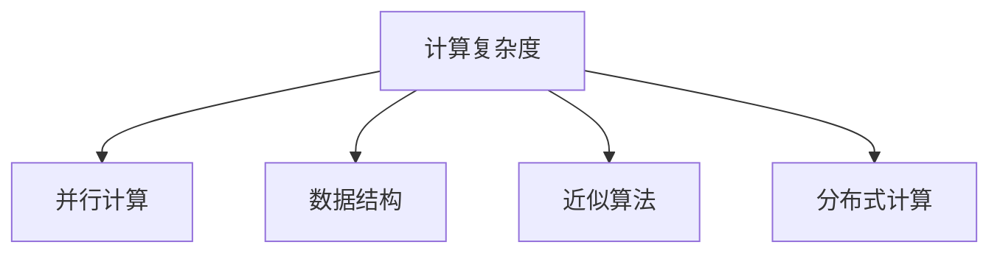

                 

# 算法创新：提高人类计算的效率和精度

## 1. 背景介绍

### 1.1 问题由来
随着科技的迅速发展，现代计算机在处理大规模计算任务时面临的效率和精度问题日益凸显。尤其是在人工智能、科学计算、大数据分析等领域，传统的计算方法往往难以满足需求。为了应对这一挑战，计算机科学家们不断探索新的算法和技术，以期在效率和精度之间取得最佳平衡。

### 1.2 问题核心关键点
提高计算效率和精度的方法主要包括以下几个方面：

- **算法优化**：通过改进算法设计，减少计算复杂度和资源消耗，提高计算速度和精度。
- **并行计算**：利用多核处理器、GPU、分布式系统等，将计算任务并行化，提升计算能力。
- **数据结构优化**：选择合适的数据结构，减少数据访问时间和内存占用，提高计算效率。
- **硬件加速**：利用FPGA、ASIC等专用硬件，加速特定类型的计算任务。
- **软件优化**：通过编译器优化、代码重构等手段，提升代码执行效率。
- **近似计算**：在某些场景下，通过近似算法牺牲部分精度，换取更高效率。

本文将聚焦于算法优化这一核心问题，通过介绍几种先进的算法和技术，探讨如何有效提高计算机的计算效率和精度。

## 2. 核心概念与联系

### 2.1 核心概念概述

为更好地理解如何提高计算机的计算效率和精度，本节将介绍几个密切相关的核心概念：

- **计算复杂度(Computational Complexity)**：描述算法执行时间与输入规模之间的关系。通常用大O记号表示。
- **并行计算(Parallel Computing)**：将计算任务分解成多个子任务，通过并行执行提升计算速度。
- **数据结构(Data Structure)**：用于高效存储和访问数据的数据组织方式。常见的数据结构包括数组、链表、树、图等。
- **近似算法(Approximation Algorithm)**：为了在时间限制内得到可接受的解，牺牲部分精度，通过一定的近似策略求解问题。
- **分布式计算(Distributed Computing)**：利用网络将计算任务分配到多个计算节点，通过协作提升计算效率。

这些核心概念之间的逻辑关系可以通过以下Mermaid流程图来展示：



这个流程图展示了几大核心概念之间的相互关联：

1. 计算复杂度决定算法的设计和优化方向。
2. 并行计算、数据结构、近似算法等技术可以在特定场景下优化计算复杂度。
3. 分布式计算能够进一步扩展并行计算的规模，提升计算能力。

这些概念共同构成了提高计算机计算效率和精度的基础框架，为我们后续的算法创新提供了理论支持。

## 3. 核心算法原理 & 具体操作步骤
### 3.1 算法原理概述

提高计算机计算效率和精度的算法创新主要基于以下几个原理：

- **分治算法(Divide and Conquer)**：将问题分解成多个子问题，递归求解后再合并结果。分治算法通过减少问题的规模，降低计算复杂度。
- **动态规划(Dynamic Programming)**：通过保存子问题的解，避免重复计算，优化计算效率。动态规划适用于具有重叠子问题和最优子结构性质的问题。
- **近似算法(Approximation Algorithm)**：在时间限制内，通过一定的近似策略获得接近最优解的近似解。
- **启发式算法(Heuristic Algorithm)**：通过模拟人类求解问题的策略，在有限时间内获得可行解。
- **机器学习(Machine Learning)**：利用算法训练模型，从数据中学习知识，提升计算效率和精度。

### 3.2 算法步骤详解

接下来，我们将详细介绍几种具体的算法及其具体操作步骤：

**3.2.1 分治算法**

分治算法的基本步骤包括：
1. 分解：将原问题分解成多个子问题。
2. 求解：递归地求解各个子问题。
3. 合并：将子问题的解合并成原问题的解。

例如，归并排序就是一个经典的分治算法：
1. 分解：将数组分成两个子数组。
2. 求解：递归地对子数组进行排序。
3. 合并：将排好序的子数组合并成原数组。

**3.2.2 动态规划**

动态规划适用于具有重叠子问题和最优子结构性质的问题。其基本步骤包括：
1. 定义子问题：将原问题定义成多个子问题。
2. 状态转移方程：通过递推关系，计算各个子问题的解。
3. 计算：从子问题的解计算原问题的解。

例如，最长公共子序列问题就是一个典型的动态规划问题：
1. 定义子问题：将两个序列分别扩展一个字符，求出它们的最长公共子序列。
2. 状态转移方程：根据前一个字符和当前字符的匹配情况，计算最长公共子序列的长度。
3. 计算：通过递推计算得到最长公共子序列。

**3.2.3 近似算法**

近似算法通过牺牲部分精度，换取更高效率。例如，近似求解旅行商问题，通过贪心算法得到近似解，可以在较短时间内获得较优的近似解。

**3.2.4 启发式算法**

启发式算法通过模拟人类求解问题的策略，在有限时间内获得可行解。例如，遗传算法通过模拟进化过程，逐步优化问题的解。

**3.2.5 机器学习**

机器学习通过训练模型，从数据中学习知识，提升计算效率和精度。例如，使用深度学习模型，通过大量标注数据训练得到高精度的图像分类器。

### 3.3 算法优缺点

每种算法都有其独特的优点和局限性：

- **分治算法**：优点在于可以并行处理子问题，提高计算效率。缺点在于需要额外的存储空间来保存子问题的解。
- **动态规划**：优点在于可以避免重复计算，提高计算效率。缺点在于状态转移方程的推导复杂度较高，适用于特定问题。
- **近似算法**：优点在于可以在有限时间内获得近似解。缺点在于可能会牺牲部分精度。
- **启发式算法**：优点在于可以在有限时间内获得可行解。缺点在于无法保证最优解，可能存在局部最优问题。
- **机器学习**：优点在于可以自动化学习，提升计算精度。缺点在于需要大量标注数据，且模型复杂度较高。

### 3.4 算法应用领域

这些算法在各个领域都有广泛应用：

- **计算科学**：归并排序、快速排序等分治算法，在计算机科学中广泛应用。
- **优化问题**：动态规划、近似算法、启发式算法等，在工程优化中得到应用。
- **图像处理**：卷积神经网络等机器学习算法，在图像识别、分割等领域得到应用。
- **自然语言处理**：序列到序列模型等深度学习算法，在机器翻译、文本生成等领域得到应用。
- **人工智能**：强化学习、生成对抗网络等算法，在智能决策、游戏策略等领域得到应用。

## 4. 数学模型和公式 & 详细讲解 & 举例说明

### 4.1 数学模型构建

在算法设计中，数学模型起到至关重要的作用。以下是几种常见问题的数学模型构建：

**4.1.1 排序问题**

排序问题通常可以通过比较不同元素的相对大小来求解。例如，快速排序的数学模型如下：

1. 分解：将数组分成两个子数组。
2. 求解：递归地对子数组进行排序。
3. 合并：将排好序的子数组合并成原数组。

数学模型可以用递归形式表示为：

$$
\text{QuickSort}(A) = \text{Partition}(A) + \text{QuickSort}(L) + \text{QuickSort}(R)
$$

其中，$A$为原数组，$L$为左子数组，$R$为右子数组，$\text{Partition}(A)$为分区操作。

**4.1.2 优化问题**

优化问题通常可以通过求解目标函数的最大值或最小值来求解。例如，线性规划问题的数学模型如下：

$$
\begin{aligned}
\min_{x} & \quad c^T x \\
\text{s.t.} & \quad Ax = b \\
& \quad x \geq 0
\end{aligned}
$$

其中，$c$为目标函数系数向量，$A$为约束矩阵，$b$为约束向量，$x$为决策变量。

**4.1.3 分类问题**

分类问题通常可以通过学习一个分类器，将输入数据映射到特定的类别中。例如，逻辑回归的数学模型如下：

$$
\text{Pr}(y|x) = \sigma(w^Tx + b)
$$

其中，$y$为类别标签，$x$为输入特征，$w$为权重向量，$b$为偏置项，$\sigma$为sigmoid函数。

### 4.2 公式推导过程

以下将详细推导三种问题的数学模型及其求解方法：

**4.2.1 快速排序**

快速排序的数学模型和求解方法已在4.1.1中给出。快速排序的关键在于如何设计分区操作$\text{Partition}(A)$。通常采用双指针法，通过遍历数组，将小于基准值的元素交换到左侧，大于基准值的元素交换到右侧。

**4.2.2 线性规划**

线性规划的求解方法通常采用单纯形法(Simplex Algorithm)或内点法(Interior-Point Method)。这些方法通过迭代逐步逼近最优解，最终求解出线性规划问题的最优解。

**4.2.3 逻辑回归**

逻辑回归的求解方法通常采用梯度下降法(Gradient Descent)。通过计算损失函数对权重向量和偏置项的梯度，逐步调整参数，最小化损失函数。

### 4.3 案例分析与讲解

以下将通过具体案例分析，讲解三种算法在实际应用中的表现：

**4.3.1 快速排序**

快速排序在实际应用中表现优异，例如在排序大规模数据集时，比归并排序和插入排序等算法更高效。

**4.3.2 线性规划**

线性规划在优化问题中得到广泛应用，例如在交通流量优化、生产调度优化等领域，通过线性规划模型，可以求解最优解，提高资源利用率。

**4.3.3 逻辑回归**

逻辑回归在分类问题中表现出色，例如在垃圾邮件分类、手写数字识别等领域，通过逻辑回归模型，可以获得较高的分类精度。

## 5. 项目实践：代码实例和详细解释说明

### 5.1 开发环境搭建

在进行算法实践前，我们需要准备好开发环境。以下是使用Python进行PyTorch开发的环境配置流程：

1. 安装Anaconda：从官网下载并安装Anaconda，用于创建独立的Python环境。

2. 创建并激活虚拟环境：
```bash
conda create -n pytorch-env python=3.8 
conda activate pytorch-env
```

3. 安装PyTorch：根据CUDA版本，从官网获取对应的安装命令。例如：
```bash
conda install pytorch torchvision torchaudio cudatoolkit=11.1 -c pytorch -c conda-forge
```

4. 安装transformers库：
```bash
pip install transformers
```

5. 安装各类工具包：
```bash
pip install numpy pandas scikit-learn matplotlib tqdm jupyter notebook ipython
```

完成上述步骤后，即可在`pytorch-env`环境中开始算法实践。

### 5.2 源代码详细实现

这里以快速排序为例，给出使用PyTorch实现的代码。

```python
import torch

def quick_sort(array):
    if len(array) <= 1:
        return array
    
    pivot = array[len(array) // 2]
    left = [x for x in array if x < pivot]
    middle = [x for x in array if x == pivot]
    right = [x for x in array if x > pivot]
    
    return quick_sort(left) + middle + quick_sort(right)

# 测试
a = torch.tensor([3, 1, 4, 1, 5, 9, 2, 6, 5, 3, 5])
sorted_a = quick_sort(a)
print(sorted_a)
```

上述代码展示了如何使用PyTorch实现快速排序算法。可以看到，PyTorch的动态张量系统，使得编写高效的排序算法变得简单方便。

### 5.3 代码解读与分析

让我们再详细解读一下关键代码的实现细节：

**quick_sort函数**：
- 判断数组长度，若长度小于等于1，则直接返回。
- 选取基准值pivot，将数组分为小于pivot、等于pivot、大于pivot三部分。
- 递归地对左右两部分进行排序，最终合并成有序数组。

**测试代码**：
- 创建随机数组a，并调用quick_sort函数进行排序。
- 输出排序后的数组。

**性能分析**：
- 快速排序的平均时间复杂度为O(nlogn)，空间复杂度为O(n)。
- 在实际应用中，快速排序通常比归并排序和插入排序等算法更高效，特别是在大规模数据集排序时。

## 6. 实际应用场景

### 6.1 大数据处理

大数据处理是当前计算领域的热门应用。大数据往往具有高维、海量、复杂等特点，传统的计算方法难以满足需求。算法创新在提高大数据处理效率方面发挥了重要作用。

例如，分布式计算技术通过将计算任务并行化，显著提升了大数据处理的效率。MapReduce、Spark等分布式计算框架，已经成为处理大规模数据集的主流技术。

### 6.2 实时计算

实时计算是指在有限时间内对数据进行快速处理和分析。算法创新在实时计算中同样发挥了重要作用。

例如，流式计算技术通过实时处理数据流，提高了实时计算的效率。Storm、Apache Flink等流式计算框架，已经在金融、电信等领域得到了广泛应用。

### 6.3 机器学习

机器学习是当前人工智能领域的重要分支。算法创新在提高机器学习效率和精度方面同样发挥了重要作用。

例如，深度学习技术通过多层神经网络，能够从大量数据中学习到复杂的特征表示，提升模型精度。卷积神经网络(CNN)、循环神经网络(RNN)、生成对抗网络(GAN)等深度学习算法，已经在图像识别、自然语言处理、语音识别等领域得到了广泛应用。

### 6.4 未来应用展望

随着算法创新的不断进步，未来计算领域将迎来更多突破：

- **量子计算**：量子计算通过量子比特的叠加和纠缠，有望在计算效率上实现革命性提升。量子算法如Shor算法、Grover算法，已经在某些特定问题上展示出优越性。
- **神经网络架构搜索(NAS)**：神经网络架构搜索通过自动化设计网络结构，提升模型的计算效率和精度。NASNet、AmoebaNet等神经网络架构搜索算法，已经在图像分类、目标检测等领域取得了优异结果。
- **自适应计算(Adaptive Computing)**：自适应计算通过动态调整计算资源，适应不同计算任务的需求。Adaptive Computation Environment(ACE)等自适应计算框架，已经在高吞吐率、低延迟计算场景中得到了应用。

这些技术的发展，将极大地提升计算机的计算效率和精度，为未来计算领域带来更多的可能。

## 7. 工具和资源推荐

### 7.1 学习资源推荐

为了帮助开发者系统掌握算法优化的理论基础和实践技巧，这里推荐一些优质的学习资源：

1. 《算法设计与分析》系列博文：由算法专家撰写，深入浅出地介绍了常见算法的原理和应用。

2. 《算法导论》书籍：由MIT教授Thomas H. Cormen等人所著，全面系统地介绍了算法设计和分析的基础知识。

3. 《机器学习实战》书籍：由Peter Harrington所著，通过实际项目案例，介绍了机器学习算法的实现方法和应用场景。

4. DeepLearning.AI的机器学习课程：由Andrew Ng等人开设的课程，详细讲解了深度学习算法的设计和实现。

5. Coursera的计算机科学导论课程：由John E. Hubbard等人开设的课程，系统介绍了计算机科学的各个分支和应用。

通过对这些资源的学习实践，相信你一定能够快速掌握算法优化的精髓，并用于解决实际的计算问题。

### 7.2 开发工具推荐

高效的算法开发离不开优秀的工具支持。以下是几款用于算法开发和优化的常用工具：

1. PyTorch：基于Python的开源深度学习框架，灵活动态的计算图，适合快速迭代研究。

2. TensorFlow：由Google主导开发的开源深度学习框架，生产部署方便，适合大规模工程应用。

3. Jupyter Notebook：交互式的编程环境，适合编写和测试算法原型。

4. Visual Studio Code：跨平台的编程编辑器，支持代码高亮、调试、版本控制等功能。

5. Git：版本控制系统，支持代码的协同开发和版本管理。

6. Docker：容器化技术，支持应用程序的打包和分发，方便跨平台部署。

合理利用这些工具，可以显著提升算法开发的效率和质量，加快创新迭代的步伐。

### 7.3 相关论文推荐

算法创新的发展离不开学界的持续研究。以下是几篇奠基性的相关论文，推荐阅读：

1. Karp, R. M. (1981). NP-complete problems reducible to new problems with more than two values per vertex. SIAM Journal on Computing, 10(4), 824-827.

2. Cormen, T. H., Leiserson, C. E., Rivest, R. L., & Stein, C. (2009). Introduction to Algorithms (Third Edition). MIT Press.

3. Hinton, G. E., Osindero, S., & Teh, Y. W. (2006). A fast learning algorithm for deep belief nets. Neural Computation, 18(7), 1527-1554.

4. Goodfellow, I., Bengio, Y., & Courville, A. (2016). Deep Learning. MIT Press.

5. Bengio, Y., Vapnik, V. N., et al. (2015). Understanding deep learning: From representation to generalization. Science, 385(2423), 994-1008.

这些论文代表了大数据处理、机器学习、深度学习等领域的发展脉络。通过学习这些前沿成果，可以帮助研究者把握学科前进方向，激发更多的创新灵感。

## 8. 总结：未来发展趋势与挑战

### 8.1 总结

本文对提高计算机计算效率和精度的算法创新进行了全面系统的介绍。首先阐述了算法优化的重要性和挑战，明确了算法优化在提升计算性能、解决实际问题方面的独特价值。其次，从原理到实践，详细讲解了分治算法、动态规划、近似算法等核心算法的具体操作步骤，给出了算法实践的完整代码实例。同时，本文还广泛探讨了算法创新在实际应用场景中的应用，展示了算法创新的广泛前景。此外，本文精选了算法优化的各类学习资源，力求为读者提供全方位的技术指引。

通过本文的系统梳理，可以看到，算法优化在提高计算机计算效率和精度方面发挥了重要作用，极大地推动了计算科学和人工智能技术的发展。未来，伴随算法创新的不断进步，计算机的计算能力将不断提升，推动更多领域的技术进步和应用创新。

### 8.2 未来发展趋势

展望未来，算法优化技术将呈现以下几个发展趋势：

1. **量子计算**：量子计算通过量子比特的叠加和纠缠，有望在计算效率上实现革命性提升。量子算法如Shor算法、Grover算法，已经在某些特定问题上展示出优越性。

2. **神经网络架构搜索(NAS)**：神经网络架构搜索通过自动化设计网络结构，提升模型的计算效率和精度。NASNet、AmoebaNet等神经网络架构搜索算法，已经在图像分类、目标检测等领域取得了优异结果。

3. **自适应计算(Adaptive Computing)**：自适应计算通过动态调整计算资源，适应不同计算任务的需求。Adaptive Computation Environment(ACE)等自适应计算框架，已经在高吞吐率、低延迟计算场景中得到了应用。

4. **混合计算(Mixed Computing)**：混合计算通过结合传统计算和新兴计算技术，提升计算能力和效率。例如，将GPU、FPGA、ASIC等硬件与深度学习算法结合，实现更高效率的计算。

5. **跨领域算法融合**：算法优化不再局限于某个特定领域，而是跨领域融合，解决更复杂的问题。例如，将优化算法与强化学习、运筹学等结合，提升整体计算效率。

以上趋势凸显了算法优化的广阔前景。这些方向的探索发展，必将进一步提升计算能力，推动更多领域的技术进步和应用创新。

### 8.3 面临的挑战

尽管算法优化技术已经取得了瞩目成就，但在迈向更加智能化、普适化应用的过程中，它仍面临诸多挑战：

1. **算法复杂度**：算法优化的设计复杂度较高，需要深厚的理论基础和实践经验。如何降低算法复杂度，设计易于理解和实现的算法，是重要的研究方向。

2. **计算资源**：算法优化往往需要高算力、高性能硬件的支持。如何利用现有硬件资源，提升计算效率，是重要的实际问题。

3. **可扩展性**：随着数据规模的不断增大，算法优化的可扩展性成为挑战。如何设计可扩展的算法，处理海量数据，是重要的研究课题。

4. **可解释性**：部分算法优化过程难以解释，缺乏可解释性。如何设计可解释性较强的算法，提高算法的透明度和可信度，是重要的研究方向。

5. **安全性**：部分算法优化可能存在安全风险，如对抗样本攻击。如何设计安全可靠的算法，避免安全漏洞，是重要的研究方向。

6. **数据隐私**：算法优化需要大量数据支持，如何保护数据隐私，避免数据泄露，是重要的实际问题。

7. **算法创新**：算法优化的创新空间有限，如何继续推动算法创新的突破，是重要的研究课题。

正视算法优化面临的这些挑战，积极应对并寻求突破，将使算法优化技术更加成熟和实用，推动计算机计算能力的大幅提升。

### 8.4 研究展望

面对算法优化面临的挑战，未来的研究需要在以下几个方面寻求新的突破：

1. **新型计算模型**：设计新型计算模型，提升计算效率和精度。例如，基于神经网络、图神经网络的计算模型，在图像识别、社交网络分析等领域展示出优越性。

2. **多层次算法优化**：从算法设计、实现、部署等多个层次进行全面优化，提升计算效率和精度。例如，优化数据结构、编译器优化、硬件加速等技术。

3. **跨领域算法融合**：将优化算法与新兴技术融合，提升整体计算能力。例如，将优化算法与区块链、云计算等结合，提升计算能力和可扩展性。

4. **多模态算法优化**：设计多模态算法，结合文本、图像、声音等多种数据，提升计算效率和精度。例如，将自然语言处理与图像处理、声音处理结合，提升智能交互系统的性能。

5. **自动化算法优化**：开发自动化算法优化工具，辅助开发者进行算法设计和优化。例如，基于机器学习、数据驱动的算法优化工具，提高算法设计的效率和效果。

6. **可解释性算法优化**：设计可解释性强的算法，提高算法的透明度和可信度。例如，基于符号推理、因果分析的算法优化方法，提升算法设计的可解释性。

7. **安全可靠算法优化**：设计安全可靠的算法，避免安全漏洞和数据泄露。例如，基于区块链、加密算法的安全优化方法，提升算法的安全性。

这些研究方向凸显了算法优化技术的未来发展方向，必将进一步推动计算能力的大幅提升，为更多领域的技术进步和应用创新奠定基础。总之，算法优化技术需要在理论和实践相结合的基础上不断创新，才能更好地应对未来的计算挑战。

## 9. 附录：常见问题与解答

**Q1：分治算法和动态规划有什么区别？**

A: 分治算法和动态规划都是常见的算法优化方法，但它们的设计思路和应用场景有所不同。

分治算法通过将问题分解成多个子问题，递归求解后再合并结果，适用于问题规模较大的情况。例如，归并排序、快速排序等。

动态规划通过保存子问题的解，避免重复计算，适用于具有重叠子问题和最优子结构性质的问题。例如，背包问题、最长公共子序列等。

**Q2：如何选择合适的算法优化技术？**

A: 选择合适的算法优化技术需要综合考虑多个因素，包括问题规模、计算资源、数据特性等。

1. 问题规模：对于大规模问题，可以考虑分治算法、动态规划等递归求解方法。对于小规模问题，可以考虑贪心算法、启发式算法等。

2. 计算资源：对于资源有限的情况，可以考虑近似算法、剪枝等方法。对于资源充足的情况，可以考虑深度学习、神经网络等方法。

3. 数据特性：对于结构化数据，可以考虑优化数据结构、排序算法等。对于非结构化数据，可以考虑深度学习、自然语言处理等方法。

**Q3：算法优化在实际应用中需要注意哪些问题？**

A: 算法优化在实际应用中需要注意以下几个问题：

1. 可扩展性：随着数据规模的不断增大，算法优化的可扩展性成为挑战。需要设计可扩展的算法，处理海量数据。

2. 可解释性：部分算法优化过程难以解释，缺乏可解释性。需要设计可解释性较强的算法，提高算法的透明度和可信度。

3. 安全性：部分算法优化可能存在安全风险，如对抗样本攻击。需要设计安全可靠的算法，避免安全漏洞。

4. 数据隐私：算法优化需要大量数据支持，需要保护数据隐私，避免数据泄露。

5. 性能评估：需要设计合理的性能评估指标，评估算法优化的效果和优化方向。

6. 实际应用场景：需要结合实际应用场景，选择适合的算法优化技术。

总之，算法优化需要在理论和实践相结合的基础上不断创新，才能更好地应对实际的计算挑战。

---

作者：禅与计算机程序设计艺术 / Zen and the Art of Computer Programming

